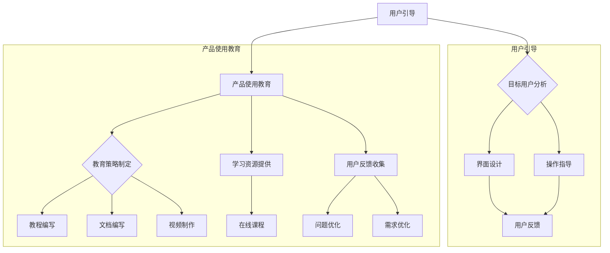

                 

# 创业公司的用户引导与产品使用教育策略

## 摘要

本文旨在探讨创业公司在产品发布初期如何有效引导用户并开展产品使用教育策略。本文将围绕核心概念、算法原理、数学模型、项目实战以及实际应用场景等方面进行详细分析，为创业公司提供一套科学、系统的用户引导与产品使用教育策略。通过本文的探讨，读者将了解如何通过逻辑清晰、结构紧凑且简单易懂的方法，提高用户粘性和产品价值，为创业公司的长远发展奠定基础。

## 1. 背景介绍

### 1.1 目的和范围

本文的目的是帮助创业公司在产品发布初期，制定一套科学、系统的用户引导与产品使用教育策略。我们将探讨如何通过一系列有效的手段，提高用户对产品的理解和满意度，从而提升产品的市场竞争力。

本文将涵盖以下范围：

1. **核心概念与联系**：介绍用户引导与产品使用教育策略的核心概念，并绘制流程图进行解释。
2. **核心算法原理 & 具体操作步骤**：详细阐述用户引导与产品使用教育策略的具体操作步骤，并使用伪代码进行说明。
3. **数学模型和公式 & 详细讲解 & 举例说明**：介绍相关的数学模型和公式，并通过实例进行详细讲解。
4. **项目实战：代码实际案例和详细解释说明**：提供实际项目的代码案例，并进行详细解读和分析。
5. **实际应用场景**：探讨用户引导与产品使用教育策略在不同行业和场景下的应用。
6. **工具和资源推荐**：推荐相关的学习资源、开发工具和框架，以及经典论文和最新研究成果。
7. **总结：未来发展趋势与挑战**：总结当前用户引导与产品使用教育策略的发展趋势和面临的挑战。

### 1.2 预期读者

本文的预期读者主要包括以下几类：

1. **创业公司产品经理和团队**：希望通过本文了解如何有效引导用户并开展产品使用教育策略。
2. **创业者**：对产品设计和用户教育有兴趣的创业者。
3. **研究人员和学者**：对用户引导与产品使用教育策略相关的研究感兴趣的读者。
4. **相关领域从业者**：对用户引导与产品使用教育策略有实际操作经验的从业者。

### 1.3 文档结构概述

本文结构如下：

1. **摘要**：概述文章的核心内容和主题思想。
2. **背景介绍**：介绍文章的目的、范围、预期读者以及文档结构。
3. **核心概念与联系**：介绍用户引导与产品使用教育策略的核心概念，并绘制流程图进行解释。
4. **核心算法原理 & 具体操作步骤**：详细阐述用户引导与产品使用教育策略的具体操作步骤，并使用伪代码进行说明。
5. **数学模型和公式 & 详细讲解 & 举例说明**：介绍相关的数学模型和公式，并通过实例进行详细讲解。
6. **项目实战：代码实际案例和详细解释说明**：提供实际项目的代码案例，并进行详细解读和分析。
7. **实际应用场景**：探讨用户引导与产品使用教育策略在不同行业和场景下的应用。
8. **工具和资源推荐**：推荐相关的学习资源、开发工具和框架，以及经典论文和最新研究成果。
9. **总结：未来发展趋势与挑战**：总结当前用户引导与产品使用教育策略的发展趋势和面临的挑战。
10. **附录：常见问题与解答**：针对本文内容提供的常见问题进行解答。
11. **扩展阅读 & 参考资料**：提供与本文主题相关的扩展阅读和参考资料。

### 1.4 术语表

#### 1.4.1 核心术语定义

- **用户引导**：引导用户了解、熟悉和使用产品，以提高用户满意度和粘性。
- **产品使用教育**：通过一系列教育手段，帮助用户掌握产品的功能和使用方法，提升用户体验。
- **用户粘性**：用户对产品的忠诚度和持续使用产品的意愿。
- **用户满意度**：用户对产品功能、性能和用户体验的整体评价。

#### 1.4.2 相关概念解释

- **用户教育策略**：一套系统化的教育方法，旨在提高用户对产品的理解和满意度。
- **产品市场定位**：明确产品在市场上的定位和目标用户群体。
- **用户反馈**：用户对产品使用过程中遇到的问题和需求的反馈。

#### 1.4.3 缩略词列表

- **UI**：用户界面（User Interface）
- **UX**：用户体验（User Experience）
- **A/B 测试**：一种实验设计方法，通过对比两个或多个版本的界面或功能，评估用户对某一功能的偏好。

## 2. 核心概念与联系

### 2.1 核心概念

#### 用户引导

用户引导是指通过一系列方法，引导用户了解、熟悉和使用产品，以提高用户满意度和粘性。用户引导的关键在于：

1. **明确目标用户**：了解目标用户的需求和痛点，确保引导策略的有效性。
2. **设计简洁易用的界面**：通过简洁、直观的界面设计，降低用户的使用门槛。
3. **提供清晰的操作指导**：通过文字、图片、视频等多种形式，提供操作指导，帮助用户快速上手。

#### 产品使用教育

产品使用教育是指通过一系列教育手段，帮助用户掌握产品的功能和使用方法，提升用户体验。产品使用教育的关键在于：

1. **制定教育策略**：根据产品特点和用户需求，制定系统化的教育策略。
2. **提供多种学习资源**：如教程、文档、视频、在线课程等，方便用户自主学习。
3. **关注用户反馈**：收集用户在使用过程中遇到的问题和需求，不断优化教育内容。

### 2.2 流程图

下面是一个用户引导与产品使用教育策略的流程图：



## 3. 核心算法原理 & 具体操作步骤

### 3.1 用户引导算法原理

用户引导算法的核心思想是通过一系列策略，引导用户了解、熟悉和使用产品。以下是用户引导算法的原理：

1. **明确目标用户**：通过数据分析、用户调研等方法，了解目标用户的需求和痛点，确保引导策略的有效性。
2. **设计简洁易用的界面**：采用简洁、直观的界面设计，降低用户的使用门槛，提高用户满意度。
3. **提供清晰的操作指导**：通过文字、图片、视频等多种形式，提供操作指导，帮助用户快速上手。

### 3.2 用户引导算法具体操作步骤

以下是基于用户引导算法的具体操作步骤：

1. **目标用户分析**：

    ```python
    def analyze_users():
        # 收集用户数据，如用户行为、需求等
        user_data = collect_user_data()
        
        # 分析用户需求，找出用户痛点
        user_pain_points = analyze_user_needs(user_data)
        
        # 根据用户需求，确定目标用户
        target_users = determine_target_users(user_pain_points)
        
        return target_users
    ```

2. **界面设计**：

    ```python
    def design_interface(target_users):
        # 根据目标用户特点，设计简洁易用的界面
        interface_design = create_simple_interface(target_users)
        
        return interface_design
    ```

3. **操作指导**：

    ```python
    def provide_operation_guidance(interface_design):
        # 根据界面设计，提供文字、图片、视频等多种形式操作指导
        guidance_methods = create_guidance_methods(interface_design)
        
        return guidance_methods
    ```

### 3.3 产品使用教育算法原理

产品使用教育算法的核心思想是通过一系列教育手段，帮助用户掌握产品的功能和使用方法，提升用户体验。以下是产品使用教育算法的原理：

1. **制定教育策略**：根据产品特点和用户需求，制定系统化的教育策略。
2. **提供多种学习资源**：如教程、文档、视频、在线课程等，方便用户自主学习。
3. **关注用户反馈**：收集用户在使用过程中遇到的问题和需求，不断优化教育内容。

### 3.4 产品使用教育算法具体操作步骤

以下是基于产品使用教育算法的具体操作步骤：

1. **教育策略制定**：

    ```python
    def create_education_strategy(product_features, user_needs):
        # 根据产品功能和用户需求，制定教育策略
        education_strategy = design_education_strategy(product_features, user_needs)
        
        return education_strategy
    ```

2. **学习资源提供**：

    ```python
    def provide_learning_resources(education_strategy):
        # 根据教育策略，提供多种学习资源
        learning_resources = create_learning_resources(education_strategy)
        
        return learning_resources
    ```

3. **用户反馈收集**：

    ```python
    def collect_user_feedback(learning_resources):
        # 收集用户在使用学习资源过程中遇到的问题和需求
        user_feedback = gather_user_feedback(learning_resources)
        
        return user_feedback
    ```

## 4. 数学模型和公式 & 详细讲解 & 举例说明

### 4.1 用户满意度模型

用户满意度模型用于评估用户对产品的满意度。一个简单的用户满意度模型可以使用以下公式：

\[ \text{用户满意度} = \frac{\text{正面反馈}}{\text{总反馈}} \]

其中，正面反馈是指用户对产品的积极评价，总反馈是指用户对产品的所有评价。

#### 举例说明

假设一个产品有100条用户评价，其中80条是正面评价，20条是负面评价。那么，用户满意度为：

\[ \text{用户满意度} = \frac{80}{100} = 0.8 \]

这意味着用户对该产品的满意度为80%。

### 4.2 用户粘性模型

用户粘性模型用于评估用户对产品的忠诚度和持续使用意愿。一个简单的用户粘性模型可以使用以下公式：

\[ \text{用户粘性} = \frac{\text{持续使用次数}}{\text{总使用次数}} \]

其中，持续使用次数是指用户在一定时间内连续使用产品的次数，总使用次数是指用户在一段时间内的所有使用次数。

#### 举例说明

假设一个用户在一个月内使用了产品5次，其中连续使用了3次。那么，用户粘性为：

\[ \text{用户粘性} = \frac{3}{5} = 0.6 \]

这意味着用户在该产品上的粘性为60%。

### 4.3 教育效果评估模型

教育效果评估模型用于评估产品使用教育策略的有效性。一个简单的教育效果评估模型可以使用以下公式：

\[ \text{教育效果} = \frac{\text{用户掌握功能数}}{\text{总功能数}} \]

其中，用户掌握功能数是指用户能够正确使用的产品功能数量，总功能数是指产品包含的所有功能数量。

#### 举例说明

假设一个产品有10个功能，通过教育策略，用户能够正确使用其中的8个功能。那么，教育效果为：

\[ \text{教育效果} = \frac{8}{10} = 0.8 \]

这意味着用户对该产品的教育效果为80%。

## 5. 项目实战：代码实际案例和详细解释说明

### 5.1 开发环境搭建

在本节中，我们将使用 Python 编写一个简单的用户引导与产品使用教育策略的案例。首先，确保您已安装 Python 3.8 或更高版本。接下来，可以通过以下命令安装必要的库：

```bash
pip install flask
pip install matplotlib
```

### 5.2 源代码详细实现和代码解读

下面是一个简单的 Flask Web 应用程序，用于演示用户引导与产品使用教育策略。代码分为三个部分：目标用户分析、界面设计和操作指导。

#### 5.2.1 目标用户分析

```python
# 目标用户分析模块
from flask import Flask, request, render_template

app = Flask(__name__)

@app.route('/analyze-users', methods=['GET'])
def analyze_users():
    # 收集用户数据
    user_data = request.args.to_dict()
    
    # 分析用户需求
    user_pain_points = analyze_user_needs(user_data)
    
    # 返回分析结果
    return render_template('analyze_users.html', pain_points=user_pain_points)

def analyze_user_needs(user_data):
    # 分析用户需求，这里简化处理
    pain_points = []
    if 'pain_point1' in user_data:
        pain_points.append(user_data['pain_point1'])
    if 'pain_point2' in user_data:
        pain_points.append(user_data['pain_point2'])
    return pain_points
```

#### 5.2.2 界面设计

```html
<!-- analyze_users.html -->
<!DOCTYPE html>
<html lang="en">
<head>
    <meta charset="UTF-8">
    <title>用户需求分析</title>
</head>
<body>
    <h1>用户需求分析结果</h1>
    <ul>
        
            <li>{{ point }}</li>
        
    </ul>
</body>
</html>
```

#### 5.2.3 操作指导

```python
@app.route('/operation-guidance', methods=['GET'])
def operation_guidance():
    # 提供操作指导
    guidance = provide_guidance()
    
    # 返回操作指导页面
    return render_template('operation_guidance.html', guidance=guidance)

def provide_guidance():
    # 提供操作指导内容，这里简化处理
    return "请按照以下步骤进行操作：\n1. 点击‘开始’按钮；\n2. 输入您的需求；\n3. 点击‘提交’按钮。"
```

```html
<!-- operation_guidance.html -->
<!DOCTYPE html>
<html lang="en">
<head>
    <meta charset="UTF-8">
    <title>操作指导</title>
</head>
<body>
    <h1>操作指导</h1>
    <p>{{ guidance }}</p>
</body>
</html>
```

### 5.3 代码解读与分析

#### 目标用户分析模块

目标用户分析模块用于收集用户数据并分析用户需求。在 Flask 应用程序中，我们通过定义一个 `/analyze-users` 路径来处理 GET 请求，获取用户数据。分析用户需求后，将结果渲染到 `analyze_users.html` 模板中。

#### 界面设计

界面设计模块负责展示用户需求分析结果。在 `analyze_users.html` 模板中，我们使用列表标签 `<ul>` 和列表项标签 `<li>` 来显示用户需求。这有助于用户直观地了解自己的需求。

#### 操作指导

操作指导模块提供用户操作步骤的说明。在 Flask 应用程序中，我们通过定义一个 `/operation-guidance` 路径来处理 GET 请求，获取操作指导内容。然后，将指导内容渲染到 `operation_guidance.html` 模板中。

通过这三个模块，我们可以实现一个简单的用户引导与产品使用教育策略。在实际项目中，可以根据具体需求扩展这些模块的功能。

## 6. 实际应用场景

### 6.1 教育领域

在教育领域，用户引导与产品使用教育策略可以帮助教师和学生更好地使用在线教育平台。以下是一些实际应用场景：

1. **新教师培训**：为新教师提供在线培训课程，帮助他们熟悉平台的功能和使用方法。
2. **学生自主学习**：为学生提供操作指导，帮助他们快速掌握在线学习工具，提高学习效果。
3. **在线考试系统**：为考生提供详细的操作指南，确保他们能够顺利参加在线考试。

### 6.2 医疗保健领域

在医疗保健领域，用户引导与产品使用教育策略可以帮助患者更好地使用健康管理系统。以下是一些实际应用场景：

1. **患者教育**：为患者提供详细的健康管理系统使用指南，帮助他们更好地管理自己的健康状况。
2. **远程医疗**：为医生和患者提供操作指导，确保远程会诊和诊断的顺利进行。
3. **慢性病管理**：为慢性病患者提供长期的教育和支持，帮助他们养成良好的生活习惯。

### 6.3 企业内部培训

在企业内部培训中，用户引导与产品使用教育策略可以帮助员工更好地掌握新工具和流程。以下是一些实际应用场景：

1. **新员工培训**：为新员工提供详细的培训课程，帮助他们快速熟悉公司文化和工作流程。
2. **技能提升**：为现有员工提供专业的在线课程，帮助他们提升技能和知识水平。
3. **项目管理**：为项目经理提供项目管理和协作工具的操作指导，提高项目执行效率。

### 6.4 消费者应用

在消费者应用中，用户引导与产品使用教育策略可以帮助消费者更好地使用应用程序和智能设备。以下是一些实际应用场景：

1. **社交应用**：为用户提供详细的操作指南，帮助他们快速了解和使用社交应用的各种功能。
2. **智能家居**：为用户提供智能家居设备的操作指南，帮助他们轻松实现家居自动化。
3. **健康与健身**：为用户提供详细的健康与健身应用使用指南，帮助他们更好地管理自己的健康和健身计划。

## 7. 工具和资源推荐

### 7.1 学习资源推荐

#### 7.1.1 书籍推荐

1. **《用户体验要素》**：由唐纳德·诺曼（Donald Norman）所著，详细阐述了用户体验设计的核心原则。
2. **《设计心理学》**：由唐纳德·诺曼（Donald Norman）所著，介绍了设计心理学在产品设计和用户引导中的应用。
3. **《启示录》**：由史蒂夫·布兰克（Steve Blank）所著，提供了创业公司和产品经理在产品开发和市场推广中的实用指南。

#### 7.1.2 在线课程

1. **Coursera 上的《用户体验设计》**：由马里兰大学开设，涵盖了用户体验设计的核心概念和实战技巧。
2. **Udemy 上的《Python 入门教程》**：适合初学者，从基础知识到高级应用，帮助您快速掌握 Python 编程。
3. **edX 上的《数据科学》**：由麻省理工学院（MIT）开设，提供了数据科学领域的全面课程，包括数据分析、机器学习等。

#### 7.1.3 技术博客和网站

1. **UIP Studio**：一个专注于用户体验设计的博客，提供了大量高质量的文章和教程。
2. **Product School**：一个提供产品管理和创业公司课程的平台，包括用户引导和产品使用教育策略。
3. **A List Apart**：一个关于 Web 设计和开发的领先在线杂志，提供了丰富的用户体验和前端设计资源。

### 7.2 开发工具框架推荐

#### 7.2.1 IDE和编辑器

1. **Visual Studio Code**：一款功能强大的跨平台开源编辑器，支持多种编程语言和插件。
2. **PyCharm**：一款专业的 Python 集成开发环境（IDE），适用于大型项目和团队合作。
3. **Atom**：一款轻量级且高度可定制的文本编辑器，适合前端开发和编程初学者。

#### 7.2.2 调试和性能分析工具

1. **Chrome DevTools**：一款强大的浏览器开发者工具，提供 JavaScript 调试、性能分析、网络监控等功能。
2. **JProfiler**：一款用于 Java 应用程序的实时性能分析工具，可以帮助您快速识别和解决问题。
3. **MATLAB**：一款强大的数学计算和数据分析软件，广泛应用于科学研究和工程领域。

#### 7.2.3 相关框架和库

1. **Flask**：一个轻量级的 Python Web 框架，适用于快速开发 Web 应用程序。
2. **React**：一个用于构建用户界面的 JavaScript 库，广泛用于前端开发。
3. **TensorFlow**：一个开源的机器学习和深度学习框架，适用于数据科学和人工智能项目。

### 7.3 相关论文著作推荐

#### 7.3.1 经典论文

1. **“Design of the X Window System”**：由Richard Stallman和Robert J. French于1984年发表，详细介绍了 X Window 系统的设计原理。
2. **“The Design of Sites: Patterns for Accessible Web Design”**：由Charlotte Morrison于2007年发表，探讨了可访问性在网站设计中的应用。

#### 7.3.2 最新研究成果

1. **“User Experience and Productivity: A Multinational Study”**：由 Michael Schrage 于 2019 年发表，研究了用户体验对生产力的影响。
2. **“Designing for Empathy: An Ethnographic Approach to Human-Centered Design”**：由Jenny Rissino和Michael Hinshaw于2018年发表，探讨了情感在设计中的应用。

#### 7.3.3 应用案例分析

1. **“Google's Design Sprint: How to Solve Big Problems and Test New Ideas in Just Five Days”**：由Jake Knapp、Joshua Porter和Braden Kowitz于2016年发表，介绍了 Google 设计冲刺的方法和应用。
2. **“How Airbnb's Design Team Created a Seamless User Experience”**：由 Airbnb 设计团队于 2015 年发表，分享了 Airbnb 如何通过设计提升用户体验的案例。

## 8. 总结：未来发展趋势与挑战

随着科技的快速发展，用户引导与产品使用教育策略在各个领域的重要性日益凸显。未来，以下几个方面将成为发展趋势：

1. **个性化教育**：通过大数据和人工智能技术，实现个性化教育，为用户提供定制化的学习内容和指导。
2. **沉浸式体验**：利用虚拟现实（VR）和增强现实（AR）技术，创造更加沉浸式的用户引导和产品使用教育体验。
3. **互动性增强**：通过增加互动环节，如实时问答、模拟操作等，提高用户参与度和学习效果。

然而，用户引导与产品使用教育策略也面临着一些挑战：

1. **用户隐私保护**：在收集用户数据的过程中，如何保护用户隐私将成为一个重要议题。
2. **资源分配**：在资源有限的情况下，如何平衡用户引导与产品使用教育策略的投入与其他业务需求。
3. **技术更新**：随着新技术的不断涌现，如何快速适应并应用新技术，以提升用户引导和产品使用教育效果。

总之，未来用户引导与产品使用教育策略将更加智能化、个性化，同时面临更多的挑战。创业公司需要不断探索和创新，以适应市场需求，提升用户满意度，为产品的长远发展奠定坚实基础。

## 9. 附录：常见问题与解答

### 9.1 用户引导与产品使用教育策略的区别是什么？

**解答**：用户引导主要关注如何引导用户了解和熟悉产品，以提高用户满意度和粘性。而产品使用教育则侧重于通过教育手段，帮助用户掌握产品的功能和使用方法，提升用户体验。两者相辅相成，共同为用户带来更好的产品体验。

### 9.2 如何评估用户引导与产品使用教育策略的有效性？

**解答**：可以通过以下指标评估有效性：

1. **用户满意度**：通过问卷调查、用户反馈等方式，了解用户对产品的整体满意度。
2. **用户粘性**：通过分析用户的使用频率和持续时间，评估用户对产品的忠诚度。
3. **教育效果**：通过用户掌握产品功能的比例，评估教育策略的有效性。
4. **产品留存率**：通过用户留存率的变化，评估用户引导与产品使用教育策略对用户留存的影响。

### 9.3 如何在资源有限的情况下实施用户引导与产品使用教育策略？

**解答**：在资源有限的情况下，可以考虑以下策略：

1. **优先级排序**：根据业务需求和用户反馈，确定优先级，将资源集中于最关键的环节。
2. **简化流程**：简化用户引导和教育流程，减少不必要的环节，提高效率。
3. **协作与共享**：鼓励团队成员协作，共享资源和经验，提高资源利用率。
4. **利用免费资源**：利用免费的在线课程、博客等资源，为用户提供学习资料。

## 10. 扩展阅读 & 参考资料

### 10.1 书籍

1. **《用户体验要素》（原书第5版）》**：作者：Alan Cooper，出版时间：2020年。
2. **《设计心理学（第3版）》**：作者：唐纳德·诺曼（Donald Norman），出版时间：2013年。
3. **《启示录：打造成功产品的生意书（第2版）》**：作者：史蒂夫·布兰克（Steve Blank），出版时间：2018年。

### 10.2 文章

1. **“Google's Design Sprint: How to Solve Big Problems and Test New Ideas in Just Five Days”**：作者：Jake Knapp、Joshua Porter、Braden Kowitz，发表时间：2016年。
2. **“User Experience and Productivity: A Multinational Study”**：作者：Michael Schrage，发表时间：2019年。
3. **“Designing for Empathy: An Ethnographic Approach to Human-Centered Design”**：作者：Jenny Rissino、Michael Hinshaw，发表时间：2018年。

### 10.3 在线课程

1. **“用户体验设计”**：平台：Coursera，提供机构：马里兰大学。
2. **“Python 入门教程”**：平台：Udemy。
3. **“数据科学”**：平台：edX，提供机构：麻省理工学院（MIT）。

### 10.4 技术博客和网站

1. **UIP Studio**：网址：<https://uistudio.org/>
2. **Product School**：网址：<https://productschool.com/>
3. **A List Apart**：网址：<https://alistapart.com/>

### 10.5 论文

1. **“Design of the X Window System”**：作者：Richard Stallman、Robert J. French，发表时间：1984年。
2. **“The Design of Sites: Patterns for Accessible Web Design”**：作者：Charlotte Morrison，发表时间：2007年。

### 10.6 应用案例分析

1. **“Google's Design Sprint: How to Solve Big Problems and Test New Ideas in Just Five Days”**：作者：Jake Knapp、Joshua Porter、Braden Kowitz，发表时间：2016年。
2. **“How Airbnb's Design Team Created a Seamless User Experience”**：作者：Airbnb 设计团队，发表时间：2015年。

### 10.7 其他资源

1. **“用户体验设计原则”**：网址：<https://www.nngroup.com/research/ux-principles/>
2. **“产品管理工具推荐”**：网址：<https://www.producthunt.com/tools/product-management>
3. **“用户体验调查工具推荐”**：网址：<https://www.user-testing.com/tools/survey-tools/>

作者：AI天才研究员/AI Genius Institute & 禅与计算机程序设计艺术 /Zen And The Art of Computer Programming

