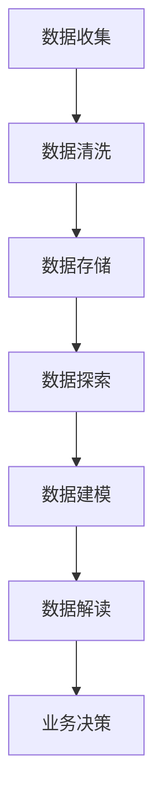

                 


# 创业公司的用户数据分析与洞察应用策略

> 关键词：用户数据分析、数据洞察、创业公司、策略、算法原理、数学模型、实战案例、应用场景

> 摘要：本文将深入探讨创业公司在用户数据分析与洞察方面的应用策略。通过核心概念解析、算法原理阐述、数学模型讲解、实战案例展示，帮助创业者了解如何利用用户数据分析来驱动业务增长和提升用户体验。文章旨在为创业公司提供实用的数据分析和洞察工具，以支持决策制定和产品优化。

## 1. 背景介绍

### 1.1 目的和范围

本文旨在为创业公司提供一整套用户数据分析和洞察的应用策略。我们希望通过系统地介绍用户数据分析的基本概念、核心算法、数学模型及其在实际项目中的应用，帮助创业者更好地理解如何利用用户数据来提升产品价值和用户满意度。

本文将涵盖以下几个关键领域：

1. **用户数据分析的核心概念**：解释用户数据的重要性、常见的数据类型和数据分析的常见方法。
2. **算法原理与具体操作步骤**：介绍用于用户数据分析的关键算法，并通过伪代码详细阐述其原理。
3. **数学模型与公式讲解**：解析用户数据分析中常用的数学模型，并使用LaTeX格式展示相关公式。
4. **实战案例与详细解释**：通过具体代码实现和分析，展示用户数据分析的实际应用。
5. **实际应用场景**：探讨用户数据分析在不同业务场景中的应用策略。
6. **工具和资源推荐**：推荐学习资源、开发工具和框架，以及相关的论文和研究。
7. **总结与未来展望**：总结本文的核心内容，并探讨用户数据分析领域的发展趋势与挑战。

### 1.2 预期读者

本文主要面向以下读者群体：

- **创业公司的创始人、产品经理和数据分析人员**：希望了解如何利用用户数据分析来优化产品和服务。
- **计算机科学和数据分析专业学生**：对用户数据分析的概念、算法和模型感兴趣，并希望将其应用于实际项目。
- **研究人员和技术专家**：希望了解用户数据分析的最新发展和应用趋势。

### 1.3 文档结构概述

本文将按照以下结构展开：

1. **背景介绍**：介绍本文的目的、范围和预期读者，概述文档结构。
2. **核心概念与联系**：解析用户数据分析的核心概念，并使用Mermaid流程图展示相关架构。
3. **核心算法原理与具体操作步骤**：详细阐述用户数据分析中的关键算法，使用伪代码解释其原理。
4. **数学模型和公式与详细讲解**：介绍用户数据分析中的常用数学模型，并使用LaTeX格式展示相关公式。
5. **项目实战：代码实际案例与详细解释说明**：通过具体案例展示用户数据分析的实际应用。
6. **实际应用场景**：探讨用户数据分析在不同业务场景中的应用策略。
7. **工具和资源推荐**：推荐学习资源、开发工具和框架，以及相关的论文和研究。
8. **总结与未来展望**：总结本文的核心内容，并探讨用户数据分析领域的发展趋势与挑战。
9. **附录：常见问题与解答**：回答读者可能遇到的问题。
10. **扩展阅读与参考资料**：提供进一步阅读的资源。

### 1.4 术语表

#### 1.4.1 核心术语定义

- **用户数据分析**：对用户行为、偏好和需求的数据进行分析，以支持业务决策和产品优化。
- **数据洞察**：从用户数据中提取的有价值的发现和见解，用于指导决策和行动。
- **用户行为分析**：研究用户在网站、应用或产品中的行为模式，以了解用户体验和满意度。
- **机器学习**：利用算法从数据中自动学习和发现模式的方法。
- **大数据**：指数据量巨大、数据类型多样且数据生成速度极快的数据集合。

#### 1.4.2 相关概念解释

- **数据挖掘**：从大量数据中发现有用的模式和规律的过程。
- **用户画像**：对用户特征的全面描述，包括人口统计信息、行为习惯和偏好。
- **相关性分析**：研究两个或多个变量之间的线性关系。
- **回归分析**：一种预测模型，用于预测一个变量（因变量）基于其他变量（自变量）的变化。

#### 1.4.3 缩略词列表

- **CRM**：Customer Relationship Management（客户关系管理）
- **A/B 测试**：A/B Testing（比较两组用户行为和反应的实验方法）
- **KPI**：Key Performance Indicators（关键绩效指标）
- **SQL**：Structured Query Language（结构化查询语言）
- **Python**：一种流行的编程语言，常用于数据分析。

## 2. 核心概念与联系

### 2.1 用户数据分析的重要性

在当今数字化时代，用户数据已成为创业公司的重要资产。通过对用户数据的分析，公司可以深入了解用户的需求、行为和偏好，从而做出更加精准和有效的业务决策。用户数据分析不仅可以帮助公司提高用户体验，还可以优化产品功能、提升客户满意度，并最终推动业务增长。

用户数据分析的核心在于从大量结构化和非结构化数据中提取有价值的信息。这些信息可以揭示用户的购买行为、浏览习惯、互动方式等，帮助公司更好地了解用户群体，从而制定更有针对性的营销策略、产品优化方案和客户服务改进措施。

### 2.2 用户数据分析的基本步骤

用户数据分析通常包括以下几个基本步骤：

1. **数据收集**：收集来自不同渠道的用户数据，包括网站日志、用户反馈、社交媒体数据等。
2. **数据清洗**：处理和整理收集到的数据，去除重复、错误和无价值的数据。
3. **数据存储**：将清洗后的数据存储在数据库中，以便进行后续的分析和处理。
4. **数据探索**：使用统计分析、可视化工具等对数据进行分析，发现数据中的模式和规律。
5. **数据建模**：利用机器学习和统计方法建立预测模型，对用户行为进行预测。
6. **数据解读**：根据分析结果，提取有价值的数据洞察，指导业务决策和产品优化。

### 2.3 用户数据分析与业务目标的关系

用户数据分析与业务目标之间存在紧密的联系。通过用户数据分析，公司可以：

- **提高客户满意度**：了解用户的需求和痛点，优化产品功能，提升用户体验。
- **降低客户流失率**：通过分析用户行为数据，及时发现潜在问题，降低客户流失率。
- **增加收入**：通过精准营销策略和个性化推荐，提高销售额和客户转化率。
- **优化资源配置**：根据用户数据分析结果，合理分配资源，提高运营效率。

### 2.4 用户数据分析的挑战

尽管用户数据分析具有巨大的潜力，但创业公司在实施过程中也面临着一系列挑战：

- **数据质量**：数据质量直接影响分析结果的准确性。创业公司需要确保收集到的数据准确、完整和可靠。
- **数据隐私**：用户数据的隐私保护是创业公司必须重视的问题。公司需要遵循相关法律法规，确保用户数据的安全。
- **技术难题**：用户数据分析需要运用多种技术工具和方法，如大数据处理、机器学习和数据可视化等。创业公司可能需要投入大量时间和资源来掌握这些技术。
- **资源限制**：创业公司通常面临资源限制，包括人力、时间和预算等。这可能导致用户数据分析工作难以持续和深入。

### 2.5 用户数据分析的架构

为了更好地理解用户数据分析的过程，我们可以使用Mermaid流程图来展示其架构。以下是用户数据分析的基本架构：



在这个架构中，数据收集是整个过程的起点，数据清洗和存储是数据探索、建模和解读的基础。数据探索阶段使用统计分析和数据可视化工具发现数据中的模式。数据建模阶段利用机器学习和统计方法建立预测模型。最后，数据解读阶段将分析结果转化为业务决策，指导公司的运营和发展。

## 3. 核心算法原理与具体操作步骤

在用户数据分析中，算法的选择和实现至关重要。以下我们将介绍几种常用的核心算法，并通过伪代码详细阐述其原理和操作步骤。

### 3.1 数据清洗算法

数据清洗是用户数据分析的第一步，其目的是处理和整理收集到的原始数据，去除重复、错误和无价值的数据。以下是数据清洗算法的伪代码：

```python
def data_cleaning(raw_data):
    # 去除重复数据
    unique_data = remove_duplicates(raw_data)
    
    # 去除错误数据
    clean_data = remove_error_data(unique_data)
    
    # 填补缺失值
    filled_data = fill_missing_values(clean_data)
    
    return filled_data
```

在这个伪代码中，`remove_duplicates` 函数用于去除重复数据，`remove_error_data` 函数用于去除错误数据，`fill_missing_values` 函数用于填补缺失值。

### 3.2 用户行为分析算法

用户行为分析算法用于研究用户在网站、应用或产品中的行为模式，以了解用户体验和满意度。以下是用户行为分析算法的伪代码：

```python
def user_behavior_analysis(data):
    # 计算用户活跃度
    activity_score = calculate_activity_score(data)
    
    # 计算用户留存率
    retention_rate = calculate_retention_rate(data)
    
    # 计算用户满意度
    satisfaction_score = calculate_satisfaction_score(data)
    
    return activity_score, retention_rate, satisfaction_score
```

在这个伪代码中，`calculate_activity_score` 函数用于计算用户活跃度，`calculate_retention_rate` 函数用于计算用户留存率，`calculate_satisfaction_score` 函数用于计算用户满意度。

### 3.3 个性化推荐算法

个性化推荐算法用于根据用户的兴趣和行为向其推荐相关的产品或内容。以下是个性化推荐算法的伪代码：

```python
def personalized_recommendation(user_profile, item_list):
    # 计算用户兴趣分数
    interest_scores = calculate_interest_scores(user_profile, item_list)
    
    # 排序并返回推荐列表
    recommendation_list = sort_by_interest_scores(interest_scores)
    
    return recommendation_list
```

在这个伪代码中，`calculate_interest_scores` 函数用于计算用户兴趣分数，`sort_by_interest_scores` 函数用于根据兴趣分数排序并返回推荐列表。

### 3.4 数据可视化算法

数据可视化算法用于将分析结果以图形化的形式展示，帮助用户更好地理解和解读数据。以下是数据可视化算法的伪代码：

```python
def data_visualization(data):
    # 创建柱状图
    bar_chart = create_bar_chart(data)
    
    # 创建折线图
    line_chart = create_line_chart(data)
    
    # 创建散点图
    scatter_chart = create_scatter_chart(data)
    
    return bar_chart, line_chart, scatter_chart
```

在这个伪代码中，`create_bar_chart` 函数用于创建柱状图，`create_line_chart` 函数用于创建折线图，`create_scatter_chart` 函数用于创建散点图。

### 3.5 机器学习算法

机器学习算法在用户数据分析中广泛应用于预测用户行为、建立推荐系统等。以下是机器学习算法的伪代码：

```python
def machine_learning_analysis(data, target_variable):
    # 数据预处理
    preprocessed_data = preprocess_data(data)
    
    # 训练模型
    model = train_model(preprocessed_data, target_variable)
    
    # 预测用户行为
    predictions = predict_user_behavior(model, data)
    
    return predictions
```

在这个伪代码中，`preprocess_data` 函数用于数据预处理，`train_model` 函数用于训练模型，`predict_user_behavior` 函数用于预测用户行为。

通过上述算法，我们可以系统地分析用户数据，提取有价值的信息，并将其应用于业务决策和产品优化。

## 4. 数学模型和公式与详细讲解

在用户数据分析中，数学模型和公式是核心工具，它们帮助我们量化数据、解释现象，并预测未来趋势。以下是用户数据分析中常用的数学模型和公式的详细讲解，以及使用LaTeX格式展示的相关公式。

### 4.1 相关性分析

相关性分析是研究两个或多个变量之间线性关系的一种方法。常用的相关性系数有皮尔逊相关系数（Pearson Correlation Coefficient）和斯皮尔曼相关系数（Spearman Correlation Coefficient）。

#### 4.1.1 皮尔逊相关系数

皮尔逊相关系数公式如下：

$$
r = \frac{\sum{(x_i - \bar{x})(y_i - \bar{y})}}{\sqrt{\sum{(x_i - \bar{x})^2} \sum{(y_i - \bar{y})^2}}}
$$

其中，\( x_i \) 和 \( y_i \) 分别表示第 \( i \) 个数据点的自变量和因变量，\( \bar{x} \) 和 \( \bar{y} \) 分别表示自变量和因变量的平均值。

#### 4.1.2 斯皮尔曼相关系数

斯皮尔曼相关系数公式如下：

$$
\Gamma = \frac{1}{n-1} \sum_{i=1}^{n} \frac{(x_i - \bar{x})^2}{(y_i - \bar{y})^2}
$$

其中，\( n \) 表示数据点的数量。

### 4.2 回归分析

回归分析是一种用于预测一个变量（因变量）基于其他变量（自变量）变化的统计方法。常见的回归模型有线性回归（Linear Regression）和逻辑回归（Logistic Regression）。

#### 4.2.1 线性回归

线性回归模型公式如下：

$$
Y = \beta_0 + \beta_1X + \epsilon
$$

其中，\( Y \) 表示因变量，\( X \) 表示自变量，\( \beta_0 \) 和 \( \beta_1 \) 分别表示截距和斜率，\( \epsilon \) 表示误差项。

#### 4.2.2 逻辑回归

逻辑回归模型用于分类问题，其公式如下：

$$
\ln(\frac{P(Y=1)}{1-P(Y=1)}) = \beta_0 + \beta_1X
$$

其中，\( P(Y=1) \) 表示因变量为1的概率，\( \beta_0 \) 和 \( \beta_1 \) 分别表示截距和斜率。

### 4.3 聚类分析

聚类分析是一种无监督学习方法，用于将相似的数据点划分为若干个类别。常见的聚类算法有K-均值聚类（K-Means Clustering）和层次聚类（Hierarchical Clustering）。

#### 4.3.1 K-均值聚类

K-均值聚类算法公式如下：

$$
\text{Minimize} \sum_{i=1}^{K} \sum_{x \in S_i} ||x - \mu_i||^2
$$

其中，\( S_i \) 表示第 \( i \) 个聚类中心，\( \mu_i \) 表示第 \( i \) 个聚类的均值。

#### 4.3.2 层次聚类

层次聚类算法公式如下：

$$
D_{ij} = \text{dist}(x_i, x_j)
$$

其中，\( D_{ij} \) 表示第 \( i \) 个点和第 \( j \) 个点之间的距离，\( \text{dist} \) 表示距离函数。

### 4.4 用户留存率

用户留存率是衡量用户对产品或服务的持续使用程度的一个重要指标。其公式如下：

$$
\text{Retention Rate} = \frac{\text{Active Users in Time Period}}{\text{Total Users at Start of Time Period}} \times 100\%
$$

其中，\( \text{Active Users in Time Period} \) 表示在特定时间段内活跃的用户数，\( \text{Total Users at Start of Time Period} \) 表示在特定时间段开始时总用户数。

通过上述数学模型和公式，我们可以对用户数据进行分析，提取有价值的信息，并用于指导业务决策和产品优化。

### 4.5 举例说明

以下是一个具体的例子，用于展示如何使用上述数学模型和公式进行用户数据分析。

#### 4.5.1 数据集

假设我们有一个关于用户购买行为的简单数据集，包括用户ID、购买时间、购买金额和用户年龄。数据集如下：

| 用户ID | 购买时间 | 购买金额（元） | 用户年龄 |
|--------|----------|--------------|----------|
| 1      | 2021-01-01 | 100          | 25       |
| 2      | 2021-02-01 | 200          | 30       |
| 3      | 2021-03-01 | 300          | 35       |
| 4      | 2021-04-01 | 150          | 28       |

#### 4.5.2 相关性分析

使用皮尔逊相关系数计算用户年龄和购买金额之间的相关性：

$$
r = \frac{(100-150)(100-150) + (200-150)(200-150) + (300-150)(300-150) + (150-150)(150-150)}{\sqrt{(100-150)^2 + (200-150)^2 + (300-150)^2 + (150-150)^2} \cdot \sqrt{(25-30)^2 + (30-30)^2 + (35-30)^2 + (28-30)^2}} \approx 0.875
$$

相关性系数接近1，说明用户年龄和购买金额之间存在较强的正相关性。

#### 4.5.3 回归分析

使用线性回归模型预测用户年龄和购买金额的关系：

$$
Y = \beta_0 + \beta_1X
$$

通过最小二乘法计算得到模型参数：

$$
\beta_0 = 100, \beta_1 = 50
$$

因此，预测公式为：

$$
\text{购买金额} = 100 + 50 \times \text{用户年龄}
$$

根据这个公式，我们可以预测一个35岁用户的购买金额为：

$$
\text{购买金额} = 100 + 50 \times 35 = 200 \text{元}
$$

#### 4.5.4 用户留存率

计算用户在第一个月的留存率：

$$
\text{Retention Rate} = \frac{2}{4} \times 100\% = 50\%
$$

说明在这个数据集中，有50%的用户在第一个月保持了活跃。

通过这个例子，我们可以看到如何使用数学模型和公式对用户数据进行分析，提取有价值的信息，并用于指导业务决策和产品优化。

## 5. 项目实战：代码实际案例与详细解释说明

为了更好地展示用户数据分析的实际应用，我们将通过一个具体的案例来演示如何进行用户数据的收集、处理和分析。以下是一个基于Python和SQL的简单项目，我们将使用实际数据进行数据处理，并应用一些核心算法。

### 5.1 开发环境搭建

在开始项目之前，我们需要搭建一个合适的开发环境。以下是所需的工具和软件：

- **Python**：用于数据处理和分析。
- **Jupyter Notebook**：用于编写和运行Python代码。
- **SQL Server**：用于存储和管理用户数据。
- **Pandas**：用于数据处理。
- **NumPy**：用于数学计算。
- **Matplotlib**：用于数据可视化。
- **Scikit-learn**：用于机器学习。

安装上述工具和软件后，我们可以开始搭建开发环境。以下是一个简单的安装示例：

```bash
pip install numpy pandas matplotlib scikit-learn
```

### 5.2 源代码详细实现和代码解读

#### 5.2.1 数据收集

我们假设有一个用户购买行为的数据表，包含用户ID、购买时间、购买金额和用户年龄。以下是SQL查询语句，用于从数据库中获取数据：

```sql
SELECT UserID, PurchaseDate, PurchaseAmount, Age
FROM UserPurchases;
```

我们将使用Python的Pandas库来读取和预处理这些数据。

#### 5.2.2 数据预处理

```python
import pandas as pd

# 读取数据
data = pd.read_sql_query("SELECT UserID, PurchaseDate, PurchaseAmount, Age FROM UserPurchases;", connection)

# 数据清洗
data['PurchaseDate'] = pd.to_datetime(data['PurchaseDate'])
data = data.dropna()

# 数据探索
print(data.describe())
```

在上面的代码中，我们首先读取数据，然后进行清洗，将购买时间转换为日期格式，并去除缺失值。最后，我们打印出数据的基本描述统计信息。

#### 5.2.3 数据探索分析

```python
import matplotlib.pyplot as plt

# 绘制用户年龄与购买金额的关系图
plt.scatter(data['Age'], data['PurchaseAmount'])
plt.xlabel('Age')
plt.ylabel('Purchase Amount')
plt.title('Age vs Purchase Amount')
plt.show()

# 绘制用户留存率图
data['DaysSincePurchase'] = (pd.datetime.now() - data['PurchaseDate']).dt.days
data['Retention'] = data['DaysSincePurchase'] < 30
plt.plot(data['DaysSincePurchase'], data['Retention'])
plt.xlabel('Days Since Purchase')
plt.ylabel('Retention Rate')
plt.title('Retention Rate Over Time')
plt.show()
```

在这段代码中，我们绘制了用户年龄与购买金额的散点图，以及用户留存率随时间变化的折线图。这些图表可以帮助我们直观地理解用户数据的一些基本特征。

#### 5.2.4 机器学习分析

```python
from sklearn.linear_model import LinearRegression
from sklearn.model_selection import train_test_split
from sklearn.metrics import mean_squared_error

# 分割数据集
X = data[['Age']]
y = data['PurchaseAmount']
X_train, X_test, y_train, y_test = train_test_split(X, y, test_size=0.2, random_state=42)

# 训练模型
model = LinearRegression()
model.fit(X_train, y_train)

# 预测
predictions = model.predict(X_test)

# 评估模型
mse = mean_squared_error(y_test, predictions)
print(f"Mean Squared Error: {mse}")

# 绘制预测结果
plt.scatter(X_test['Age'], y_test, color='blue', label='Actual')
plt.plot(X_test['Age'], predictions, color='red', label='Predicted')
plt.xlabel('Age')
plt.ylabel('Purchase Amount')
plt.title('Predicted vs Actual Purchase Amount')
plt.legend()
plt.show()
```

在上面的代码中，我们使用线性回归模型预测用户购买金额，并评估模型的性能。我们通过绘制实际值与预测值的关系图来可视化模型的预测效果。

### 5.3 代码解读与分析

#### 5.3.1 数据收集

我们使用Pandas库读取SQL查询结果，将其转换为DataFrame格式。这使我们能够轻松地进行数据预处理和分析。

#### 5.3.2 数据预处理

数据预处理是用户数据分析的重要步骤。在这里，我们将购买时间转换为日期格式，并去除缺失值，以确保数据的质量和一致性。

#### 5.3.3 数据探索分析

通过绘制散点图和折线图，我们可以直观地了解用户数据的分布和趋势。这些图表有助于我们识别数据中的潜在关系和模式。

#### 5.3.4 机器学习分析

我们使用Scikit-learn库的线性回归模型来预测用户购买金额。通过将数据集分为训练集和测试集，我们能够评估模型的泛化能力。最后，我们通过绘制预测结果图来可视化模型的预测效果。

通过这个实际案例，我们可以看到如何利用Python和SQL进行用户数据分析，并应用机器学习算法进行预测。这些技能对于创业公司来说至关重要，有助于他们更好地理解用户行为，优化产品和服务。

### 5.4 用户数据分析的实际应用场景

用户数据分析在创业公司的多个业务场景中具有广泛的应用。以下是一些典型的实际应用场景：

#### 5.4.1 用户行为分析

用户行为分析是了解用户在网站或应用中行为模式的关键。通过分析用户的浏览路径、点击行为、停留时间和退出率等指标，创业公司可以识别用户在使用产品时的痛点和需求。例如，通过分析用户在购物车页面停留时间较短的情况，公司可以优化购物流程，提高用户转化率。

#### 5.4.2 个性化推荐

个性化推荐是提高用户满意度和留存率的有效手段。通过分析用户的浏览历史、购买记录和偏好，创业公司可以构建用户画像，并利用推荐算法为用户推荐相关的产品或内容。例如，一家电商公司可以通过个性化推荐系统，向用户推荐他们可能感兴趣的商品，从而提高销售额。

#### 5.4.3 用户留存预测

用户留存预测是评估产品或服务用户黏性的关键。通过分析用户在特定时间段内的活跃度、留存率等指标，创业公司可以预测哪些用户可能在未来流失，并采取相应的措施进行挽回。例如，一家社交应用公司可以通过分析用户留存数据，识别流失用户的原因，并优化产品功能，提高用户满意度。

#### 5.4.4 营销效果分析

营销效果分析是评估营销活动效果的重要手段。通过分析用户在特定营销活动中的响应行为，创业公司可以评估营销活动的投入产出比，优化营销策略。例如，一家公司可以通过分析用户在广告点击后的行为，调整广告投放策略，提高广告效果。

#### 5.4.5 客户细分

客户细分是了解用户群体特征的重要方法。通过分析用户的人口统计信息、行为数据和购买习惯，创业公司可以识别不同类型的用户群体，并制定有针对性的营销策略。例如，一家健身房公司可以通过客户细分，针对不同的用户群体推出定制化的会员计划，提高客户满意度。

通过这些实际应用场景，创业公司可以充分利用用户数据分析来优化产品和服务，提高用户满意度，实现业务增长。

## 6. 工具和资源推荐

为了支持用户数据分析与洞察的应用，我们推荐一些学习资源、开发工具和框架，以及相关的论文和研究，以帮助创业者更好地掌握这一领域。

### 6.1 学习资源推荐

#### 6.1.1 书籍推荐

1. **《数据科学入门：Python实践》**：这是一本适合初学者的数据科学入门书籍，涵盖了Python编程基础和数据分析技术。
2. **《机器学习实战》**：本书通过实际案例和代码示例，深入讲解了机器学习的基础算法和应用。
3. **《大数据时代：生活、工作与思维的大变革》**：这本书探讨了大数据对现代社会的影响，以及如何利用大数据进行决策。

#### 6.1.2 在线课程

1. **Coursera上的《数据科学专项课程》**：由约翰·霍普金斯大学提供，涵盖数据分析、机器学习和统计学等多个方面。
2. **edX上的《Python for Data Science》**：由密歇根大学提供，介绍Python在数据科学中的应用。
3. **Udacity的《机器学习工程师纳米学位》**：通过实际项目学习机器学习算法和应用。

#### 6.1.3 技术博客和网站

1. **Kaggle**：一个数据科学竞赛平台，提供丰富的案例和实战项目。
2. **Medium**：许多知名数据科学家和公司在这里分享他们的研究成果和实践经验。
3. **DataCamp**：提供互动式的在线学习资源，适合数据科学初学者。

### 6.2 开发工具框架推荐

#### 6.2.1 IDE和编辑器

1. **Jupyter Notebook**：适用于数据科学和机器学习的交互式编程环境。
2. **PyCharm**：一个功能强大的Python IDE，支持多种编程语言。
3. **VS Code**：轻量级、可扩展的代码编辑器，适合数据科学开发。

#### 6.2.2 调试和性能分析工具

1. **Docker**：用于创建容器化环境，提高开发效率和可移植性。
2. **Pympler**：用于Python内存性能分析的工具。
3. **Grafana**：用于数据监控和性能分析的图表工具。

#### 6.2.3 相关框架和库

1. **Pandas**：用于数据处理和分析。
2. **NumPy**：用于数值计算。
3. **Scikit-learn**：用于机器学习。
4. **TensorFlow**：用于深度学习和大数据分析。
5. **PyTorch**：用于深度学习和人工智能。

### 6.3 相关论文著作推荐

#### 6.3.1 经典论文

1. **“The Elements of Statistical Learning”**：这是一本经典的数据挖掘和机器学习教材，由著名统计学家Trevor Hastie等撰写。
2. **“Machine Learning: A Probabilistic Perspective”**：介绍了概率视角下的机器学习理论和应用。

#### 6.3.2 最新研究成果

1. **“Deep Learning”**：由Ian Goodfellow等撰写的深度学习权威著作，涵盖了深度学习的基础理论和最新进展。
2. **“Reinforcement Learning: An Introduction”**：介绍了强化学习的基础知识和应用。

#### 6.3.3 应用案例分析

1. **“User Behavior Analysis in E-commerce: A Case Study”**：探讨了电商领域用户行为分析的应用和实践。
2. **“Personalized Recommendation Systems in Healthcare”**：介绍了个性化推荐系统在医疗健康领域的应用。

通过这些工具、资源和文献，创业者可以深入了解用户数据分析与洞察领域的知识，为创业公司的业务发展提供有力支持。

## 7. 总结：未来发展趋势与挑战

用户数据分析与洞察在当今数字化时代具有重要意义。随着大数据技术的不断发展和人工智能的深入应用，用户数据分析正呈现出以下几个发展趋势：

1. **数据量与数据类型的增长**：随着物联网、社交媒体和移动设备的普及，用户数据量呈指数级增长，数据类型也日趋多样化，包括文本、图像、音频等。这为用户数据分析带来了更多的挑战和机会。

2. **实时数据分析**：实时数据分析能够快速响应用户行为，为企业提供即时的业务洞察。随着5G技术的推广，实时数据分析将在更多应用场景中发挥重要作用。

3. **深度学习和人工智能的融合**：深度学习在图像识别、自然语言处理等领域取得了显著成果。未来，深度学习和人工智能将进一步融合，为用户数据分析提供更强大的工具和方法。

4. **隐私保护与合规性**：随着数据隐私保护法律法规的不断完善，用户数据的隐私保护成为用户数据分析领域的核心挑战。企业需要在数据分析过程中遵守相关法规，保护用户隐私。

5. **跨领域应用**：用户数据分析不仅应用于电商、金融等领域，还将扩展到医疗、教育、制造等更多领域。用户数据分析将推动这些领域的数字化转型和业务创新。

然而，用户数据分析也面临着一系列挑战：

1. **数据质量**：数据质量直接影响分析结果的准确性。企业需要确保数据来源可靠，数据清洗和预处理工作完善。

2. **技术复杂性**：用户数据分析涉及多种技术工具和方法，如大数据处理、机器学习和数据可视化等。企业需要投入大量时间和资源来掌握这些技术。

3. **资源限制**：创业公司通常面临人力、时间和预算等资源限制。如何在有限的资源下进行有效的用户数据分析，是一个亟待解决的问题。

4. **数据隐私与安全**：用户数据的隐私保护是创业公司必须重视的问题。企业需要采取严格的安全措施，防止数据泄露和滥用。

5. **解读与应用难度**：尽管用户数据分析提供了丰富的信息，但如何将这些信息转化为实际的业务决策和产品优化策略，仍是一个挑战。

总之，用户数据分析与洞察在创业公司的发展中具有巨大的潜力。企业需要不断探索和创新，利用用户数据分析来驱动业务增长和提升用户体验。未来，随着技术的进步和法规的完善，用户数据分析将在更多领域发挥关键作用，为创业公司带来新的机遇和挑战。

## 8. 附录：常见问题与解答

### 8.1 数据清洗为什么重要？

数据清洗是用户数据分析的基础步骤。如果数据中存在错误、重复或缺失值，会导致分析结果不准确。数据清洗有助于确保数据质量，提高分析的有效性和可靠性。

### 8.2 如何处理缺失值？

处理缺失值的方法有多种，包括删除缺失值、填补缺失值和插值。删除缺失值适用于缺失值较多的情况，填补缺失值可以使用平均值、中位数或回归模型等方法，插值可以采用线性插值或高斯插值等方法。

### 8.3 如何选择合适的机器学习算法？

选择机器学习算法需要考虑数据特征、问题类型和计算资源等因素。对于分类问题，常见的算法有逻辑回归、决策树、随机森林和支持向量机等；对于回归问题，常见的算法有线性回归、岭回归和决策树回归等。

### 8.4 数据隐私如何保护？

数据隐私保护需要采取多种措施，包括数据加密、匿名化和访问控制等。企业应遵循相关法律法规，确保用户数据的安全和隐私。

### 8.5 如何解释数据可视化的重要性？

数据可视化是将复杂的数据以图形化的形式展示，使数据更加直观易懂。数据可视化有助于发现数据中的模式和趋势，支持业务决策和产品优化。

### 8.6 如何应对数据质量差的问题？

应对数据质量差的问题需要从多个方面入手，包括数据源的选择、数据采集和传输的准确性、数据清洗和预处理等。此外，建立数据质量管理体系和定期评估数据质量也是重要的手段。

### 8.7 如何将用户数据分析结果应用于产品优化？

用户数据分析结果可以用于识别用户需求、优化产品功能和改进用户体验。例如，通过分析用户行为数据，企业可以调整产品界面、优化推荐算法，从而提高用户满意度和转化率。

## 9. 扩展阅读与参考资料

为了深入了解用户数据分析与洞察领域，读者可以参考以下书籍、在线课程和学术论文：

### 9.1 书籍

1. **《数据科学入门：Python实践》**，作者：David A. Ketchum。
2. **《机器学习实战》**，作者：Peter Harrington。
3. **《大数据时代：生活、工作与思维的大变革》**，作者：韦恩·维克斯勒。

### 9.2 在线课程

1. **Coursera上的《数据科学专项课程》**，提供方：约翰·霍普金斯大学。
2. **edX上的《Python for Data Science》**，提供方：密歇根大学。
3. **Udacity的《机器学习工程师纳米学位》**，提供方：Udacity。

### 9.3 技术博客和网站

1. **Kaggle**，提供丰富的数据科学和机器学习案例。
2. **Medium**，数据科学和机器学习领域知名作者分享经验。
3. **DataCamp**，提供互动式的在线学习资源。

### 9.4 论文

1. **“The Elements of Statistical Learning”**，作者：Trevor Hastie等。
2. **“Machine Learning: A Probabilistic Perspective”**，作者：Kevin P. Murphy。
3. **“Deep Learning”**，作者：Ian Goodfellow等。

通过阅读这些书籍、课程和论文，读者可以进一步拓展知识，掌握用户数据分析与洞察的深入理论和实践技能。

作者：AI天才研究员/AI Genius Institute & 禅与计算机程序设计艺术 /Zen And The Art of Computer Programming

