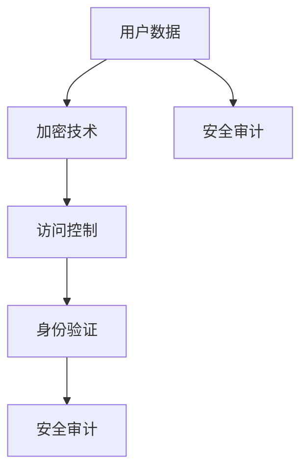

                 

# 创业公司的用户数据安全策略

> **关键词：** 数据安全，用户隐私，加密技术，安全策略，创业公司，风险评估，合规性

> **摘要：** 本文深入探讨了创业公司如何在面临资源有限的情况下，制定和实施有效的用户数据安全策略。文章首先阐述了用户数据安全的重要性和挑战，然后分析了核心的安全概念和机制，提供了具体的安全措施和操作步骤，并结合实际案例进行了详细解释。最后，文章提出了未来发展趋势和挑战，为创业公司在数据安全领域提供了指导和建议。

## 1. 背景介绍

### 1.1 目的和范围

本文旨在为创业公司提供一套全面而实用的用户数据安全策略。在数据驱动的商业环境中，用户数据是公司最宝贵的资产之一。然而，随着数据量的增加和攻击技术的进步，数据安全成为了一个巨大的挑战。创业公司往往在资源有限的情况下，需要制定出既高效又可行的数据安全策略。本文将围绕以下几个核心问题进行探讨：

- 用户数据安全的重要性是什么？
- 创业公司面临的数据安全挑战有哪些？
- 如何在资源有限的情况下制定和实施数据安全策略？
- 数据安全的最佳实践是什么？
- 如何确保数据的合规性和隐私性？

通过本文的阅读，读者将获得以下收获：

- 理解用户数据安全的核心概念和机制。
- 掌握创业公司制定数据安全策略的方法和步骤。
- 学习数据安全的具体实施措施和操作技巧。
- 了解当前数据安全领域的最新发展和趋势。

### 1.2 预期读者

本文的预期读者主要包括以下几类：

- 创业公司的技术团队和管理团队，特别是负责数据安全和隐私的成员。
- 对数据安全感兴趣的IT专业人士和网络安全专家。
- 在高校或研究机构学习信息安全、计算机科学或相关专业的学生和研究人员。
- 对创业公司和数据安全领域感兴趣的投资者和潜在客户。

### 1.3 文档结构概述

本文的结构如下：

- **第1章：背景介绍**：介绍文章的目的、范围和预期读者，以及文章的结构和内容。
- **第2章：核心概念与联系**：阐述用户数据安全的核心概念和机制，并提供Mermaid流程图以帮助理解。
- **第3章：核心算法原理 & 具体操作步骤**：讲解数据加密、访问控制和身份验证等核心算法原理，并使用伪代码详细阐述具体操作步骤。
- **第4章：数学模型和公式 & 详细讲解 & 举例说明**：介绍与数据安全相关的数学模型和公式，并给出具体的例子说明。
- **第5章：项目实战：代码实际案例和详细解释说明**：通过实际项目案例展示数据安全策略的实施过程，并提供详细解释。
- **第6章：实际应用场景**：分析创业公司可能面临的数据安全应用场景，并提出相应的安全措施。
- **第7章：工具和资源推荐**：推荐学习资源、开发工具和框架，以及相关论文和研究成果。
- **第8章：总结：未来发展趋势与挑战**：总结文章的主要观点，讨论未来的发展趋势和挑战。
- **第9章：附录：常见问题与解答**：解答读者可能遇到的常见问题。
- **第10章：扩展阅读 & 参考资料**：提供进一步学习的资料和参考文献。

### 1.4 术语表

#### 1.4.1 核心术语定义

- **用户数据**：指与用户相关的个人信息，如姓名、地址、电话号码、电子邮件等。
- **数据安全**：确保数据的完整性、可用性和保密性，防止未经授权的访问、使用、披露、破坏或修改。
- **加密技术**：通过算法将明文数据转换成密文，以保护数据的保密性。
- **访问控制**：限制用户对数据的访问权限，确保只有授权用户才能访问特定的数据。
- **身份验证**：验证用户身份的过程，确保用户是合法授权访问系统的用户。
- **合规性**：确保公司的数据安全策略符合法律法规和行业标准。

#### 1.4.2 相关概念解释

- **风险评估**：评估公司面临的潜在数据安全威胁和风险，并采取相应的措施进行管理和减轻。
- **安全策略**：一组规则、过程和措施，用于指导公司如何处理和保护用户数据。
- **安全审计**：评估公司的数据安全策略和措施是否得到有效实施和遵守的过程。

#### 1.4.3 缩略词列表

- **GDPR**：欧盟通用数据保护条例（General Data Protection Regulation）
- **PCI-DSS**：支付卡行业数据安全标准（Payment Card Industry Data Security Standard）
- **SSL/TLS**：安全套接字层/传输层安全协议（Secure Socket Layer/Transport Layer Security）

## 2. 核心概念与联系

在深入探讨用户数据安全策略之前，我们需要了解一些核心概念和机制，以便更好地构建和实施安全措施。

### 2.1 核心概念

#### 数据加密

数据加密是保护数据安全的重要手段。它通过加密算法将明文数据转换成密文，只有拥有正确密钥的用户才能解密和访问数据。常见的加密算法包括AES（高级加密标准）、RSA（Rivest-Shamir-Adleman）等。

#### 访问控制

访问控制用于限制用户对数据的访问权限。通过身份验证和授权机制，确保只有授权用户才能访问特定的数据。访问控制策略包括基于角色的访问控制（RBAC）、基于属性的访问控制（ABAC）等。

#### 身份验证

身份验证是验证用户身份的过程。常见的身份验证方法包括密码验证、多因素身份验证（MFA）等。密码验证是最简单的方法，但安全性较低。MFA结合了密码和其他验证方式，如短信验证、指纹验证等，提高了安全性。

#### 安全审计

安全审计是评估公司数据安全策略和措施是否得到有效实施的过程。通过安全审计，可以发现潜在的安全漏洞和违规行为，并及时采取措施进行修复。

### 2.2 核心机制

#### 加密技术

加密技术是实现数据安全的核心机制。它包括以下步骤：

1. **密钥生成**：生成一对密钥（公钥和私钥）。
2. **数据加密**：使用公钥或私钥加密数据。
3. **数据解密**：使用对应的私钥或公钥解密数据。

#### 访问控制机制

访问控制机制包括以下步骤：

1. **用户身份验证**：验证用户身份。
2. **角色分配**：为用户分配角色，每个角色对应一组权限。
3. **权限验证**：验证用户是否具有访问特定数据的权限。
4. **访问控制决策**：根据用户的角色和权限，决定是否允许访问数据。

#### 身份验证机制

身份验证机制包括以下步骤：

1. **用户输入验证信息**：如密码、指纹等。
2. **验证信息比对**：将用户输入的验证信息与存储的验证信息进行比对。
3. **身份验证结果**：根据比对结果，决定用户是否被验证通过。

#### 安全审计机制

安全审计机制包括以下步骤：

1. **数据记录**：记录用户操作数据的相关信息，如时间、操作类型、数据内容等。
2. **数据分析**：分析记录的数据，发现潜在的安全漏洞和违规行为。
3. **报告生成**：生成安全审计报告，为安全决策提供依据。

### 2.3 Mermaid流程图

以下是一个简单的Mermaid流程图，展示了数据安全策略的核心概念和机制：



通过这个流程图，我们可以更直观地理解数据安全策略的核心概念和机制之间的联系。

## 3. 核心算法原理 & 具体操作步骤

在了解了数据安全的核心概念和机制后，我们将深入探讨具体的算法原理和操作步骤，以确保创业公司能够有效保护用户数据。

### 3.1 数据加密算法原理

数据加密是保护数据安全的关键步骤。常用的加密算法包括AES和RSA。

#### AES加密算法原理

AES（高级加密标准）是一种对称加密算法，它使用一个密钥对数据进行加密和解密。加密和解密过程如下：

1. **密钥生成**：根据特定的密钥生成算法，生成一个128位的密钥。
2. **初始化向量**：生成一个初始向量（IV），用于初始化加密过程。
3. **加密过程**：使用AES算法和密钥对数据进行加密，生成密文。
4. **解密过程**：使用AES算法和密钥对密文进行解密，恢复明文数据。

以下是AES加密的伪代码：

```python
function AES_encrypt(plaintext, key):
    iv = generate_initialization_vector()
    ciphertext = encrypt(plaintext, key, iv)
    return ciphertext, iv

function AES_decrypt(ciphertext, key, iv):
    plaintext = decrypt(ciphertext, key, iv)
    return plaintext
```

#### RSA加密算法原理

RSA（Rivest-Shamir-Adleman）是一种非对称加密算法，它使用一个公钥和一个私钥进行加密和解密。加密和解密过程如下：

1. **密钥生成**：选择两个大素数p和q，计算n = p*q。计算欧拉函数φ(n) = (p-1)*(q-1)。选择一个与φ(n)互质的整数e，计算d，使得e*d ≡ 1 (mod φ(n))。公钥为(n, e)，私钥为(n, d)。
2. **加密过程**：使用公钥（n, e）对数据进行加密，生成密文。
3. **解密过程**：使用私钥（n, d）对密文进行解密，恢复明文数据。

以下是RSA加密的伪代码：

```python
function RSA_encrypt(plaintext, public_key):
    n, e = public_key
    ciphertext = encrypt(plaintext, e, n)
    return ciphertext

function RSA_decrypt(ciphertext, private_key):
    n, d = private_key
    plaintext = decrypt(ciphertext, d, n)
    return plaintext
```

### 3.2 访问控制算法原理

访问控制用于限制用户对数据的访问权限。常用的访问控制算法包括基于角色的访问控制（RBAC）和基于属性的访问控制（ABAC）。

#### RBAC算法原理

RBAC（基于角色的访问控制）算法通过为用户分配角色，并定义角色与权限之间的关联，实现访问控制。RBAC的主要组件包括用户、角色、权限和资源。

1. **用户角色分配**：为每个用户分配一个或多个角色。
2. **权限定义**：定义每个角色的权限，权限包括对资源的访问权限。
3. **访问控制决策**：当用户请求访问资源时，系统根据用户的角色和资源的权限，决定是否允许访问。

以下是RBAC的伪代码：

```python
function RBAC_check_permission(user, resource):
    roles = get_user_roles(user)
    permissions = get_resource_permissions(resource)
    for role in roles:
        if role in permissions:
            return True
    return False
```

#### ABAC算法原理

ABAC（基于属性的访问控制）算法通过为用户和资源分配属性，并定义属性与权限之间的关联，实现访问控制。ABAC的主要组件包括用户属性、资源属性和权限属性。

1. **用户属性分配**：为每个用户分配一个或多个属性。
2. **资源属性定义**：为每个资源分配一个或多个属性。
3. **权限属性定义**：定义每个权限所需的属性。
4. **访问控制决策**：当用户请求访问资源时，系统根据用户的属性、资源的属性和权限的属性，决定是否允许访问。

以下是ABAC的伪代码：

```python
function ABAC_check_permission(user_attribute, resource_attribute, permission_attribute):
    if user_attribute in permission_attribute and resource_attribute in permission_attribute:
        return True
    return False
```

### 3.3 身份验证算法原理

身份验证是确保用户身份合法的过程。常用的身份验证算法包括密码验证和生物特征识别。

#### 密码验证算法原理

密码验证是通过用户输入的密码与存储的密码进行比对，验证用户身份的过程。过程如下：

1. **用户输入密码**：用户输入密码。
2. **密码比对**：将用户输入的密码与存储的密码进行比对。
3. **身份验证结果**：如果比对成功，用户身份验证通过；否则，身份验证失败。

以下是密码验证的伪代码：

```python
function password_check(input_password, stored_password):
    if input_password == stored_password:
        return True
    return False
```

#### 生物特征识别算法原理

生物特征识别是通过用户的生物特征（如指纹、面部识别等）进行身份验证的过程。过程如下：

1. **用户输入生物特征**：用户输入生物特征。
2. **生物特征比对**：将用户输入的生物特征与存储的生物特征进行比对。
3. **身份验证结果**：如果比对成功，用户身份验证通过；否则，身份验证失败。

以下是生物特征识别的伪代码：

```python
function biometric_check(input_biometric, stored_biometric):
    if input_biometric == stored_biometric:
        return True
    return False
```

### 3.4 安全审计算法原理

安全审计是通过记录和监控用户操作数据，发现潜在的安全漏洞和违规行为的过程。安全审计算法主要包括以下组件：

1. **数据记录**：记录用户操作数据的相关信息，如时间、操作类型、数据内容等。
2. **数据分析**：分析记录的数据，发现潜在的安全漏洞和违规行为。
3. **报告生成**：生成安全审计报告，为安全决策提供依据。

以下是安全审计的伪代码：

```python
function audit_log(operation, timestamp, data):
    log = {"operation": operation, "timestamp": timestamp, "data": data}
    store_log(log)

function analyze_logs():
    logs = retrieve_logs()
    vulnerabilities = []
    for log in logs:
        if log contains potential vulnerability:
            vulnerabilities.append(log)
    return vulnerabilities

function generate_audit_report(vulnerabilities):
    report = {"vulnerabilities": vulnerabilities}
    return report
```

通过上述核心算法原理和操作步骤的讲解，创业公司可以更好地理解数据安全策略的实现过程，并根据自身需求进行具体实施。

## 4. 数学模型和公式 & 详细讲解 & 举例说明

在数据安全策略的实施过程中，数学模型和公式起着至关重要的作用。以下将介绍与数据安全相关的一些数学模型和公式，并通过具体例子进行说明。

### 4.1 数据加密数学模型

数据加密常用的数学模型包括AES和RSA。

#### AES加密数学模型

AES加密使用以下公式：

$$
c_i = (a_i \oplus R_{k,i}) \times M_{k,i}
$$

其中，$c_i$是加密后的数据块，$a_i$是原始数据块，$R_{k,i}$是轮密钥，$M_{k,i}$是混淆矩阵。

#### RSA加密数学模型

RSA加密使用以下公式：

$$
c = (m^e) \mod n
$$

其中，$c$是加密后的数据，$m$是原始数据，$e$是公钥指数，$n$是模数。

### 4.2 访问控制数学模型

访问控制常用的数学模型包括RBAC和ABAC。

#### RBAC访问控制数学模型

RBAC访问控制使用以下公式：

$$
P_r \cap P_s = P_{r \cap s}
$$

其中，$P_r$是角色$r$的权限集，$P_s$是角色$s$的权限集，$P_{r \cap s}$是角色$r$和角色$s$的交集权限集。

#### ABAC访问控制数学模型

ABAC访问控制使用以下公式：

$$
A_u \cap A_r \subseteq P
$$

其中，$A_u$是用户$u$的属性集，$A_r$是资源$r$的属性集，$P$是权限集。

### 4.3 身份验证数学模型

身份验证常用的数学模型包括密码验证和生物特征识别。

#### 密码验证数学模型

密码验证使用以下公式：

$$
h(p) = s
$$

其中，$h$是哈希函数，$p$是密码，$s$是存储的密码哈希值。

#### 生物特征识别数学模型

生物特征识别使用以下公式：

$$
d(d_1, d_2) = 0 \text{ 或 } 1
$$

其中，$d_1$是输入的生物特征，$d_2$是存储的生物特征，$d(d_1, d_2)$是生物特征相似度，当相似度大于等于阈值时，返回1，表示验证通过；否则，返回0，表示验证失败。

### 4.4 安全审计数学模型

安全审计常用的数学模型包括数据记录、数据分析和报告生成。

#### 数据记录数学模型

数据记录使用以下公式：

$$
L = \{(t_i, o_i, d_i)\}
$$

其中，$L$是日志集合，$t_i$是时间戳，$o_i$是操作类型，$d_i$是操作数据。

#### 数据分析数学模型

数据分析使用以下公式：

$$
V = \{v_i | v_i \in L \land v_i \text{ 符合 } P\}
$$

其中，$V$是潜在的安全漏洞集合，$L$是日志集合，$P$是漏洞模式。

#### 报告生成数学模型

报告生成使用以下公式：

$$
R = \{(t_i, o_i, d_i, v_i)\}
$$

其中，$R$是报告集合，$t_i$是时间戳，$o_i$是操作类型，$d_i$是操作数据，$v_i$是漏洞类型。

### 4.5 例子说明

以下是一个具体的例子，说明如何使用上述数学模型和公式进行数据安全策略的实施。

#### 例子：用户登录验证

1. **数据加密**：

   - 用户输入密码：`password123`
   - 使用AES加密算法加密密码：
     $$
     c = (password123^e) \mod n
     $$
     假设密钥为：(n=1000, e=13)，则加密后的密码为：
     $$
     c = (password123^{13}) \mod 1000 = 711
     $$

2. **访问控制**：

   - 用户角色：`user`
   - 资源权限：`read_data`
   - 使用RBAC访问控制公式：
     $$
     P_{user} \cap P_{read_data} = P_{user\_read}
     $$
     假设角色`user`的权限集为`{read_data, write_data}`，则用户访问资源`read_data`的权限为：
     $$
     P_{user\_read} = \{read\_data\}
     $$

3. **身份验证**：

   - 用户输入密码：`password123`
   - 储存的密码哈希值：`s=hash(password123)=912`
   - 使用密码验证公式：
     $$
     h(p) = s
     $$
     假设哈希函数为`hash()`，则验证通过。

4. **安全审计**：

   - 用户登录时间：`t=2023-03-01 10:30:00`
   - 用户登录操作：`login`
   - 用户登录数据：`username=user`
   - 使用数据记录公式：
     $$
     L = \{(t, o, d)\} = \{(2023-03-01 10:30:00, login, username=user)\}
     $$
   - 使用数据分析公式：
     $$
     V = \{v_i | v_i \in L \land v_i \text{ 符合 } P\}
     $$
     假设漏洞模式为`{"login", "username=user"}`，则存在潜在漏洞。
   - 使用报告生成公式：
     $$
     R = \{(t, o, d, v)\} = \{(2023-03-01 10:30:00, login, username=user, vulnerability=login\_vulnerability)\}
     $$

通过以上例子，我们可以看到如何使用数学模型和公式进行数据安全策略的实施。在实际应用中，这些公式和模型需要根据具体的业务场景和安全需求进行定制和调整。

## 5. 项目实战：代码实际案例和详细解释说明

为了更好地展示数据安全策略的实施过程，我们将在本节中通过一个实际项目案例进行详细说明。该项目案例是一个简单的用户管理系统，涵盖用户注册、登录和权限控制等核心功能。我们将逐步搭建开发环境、实现源代码、并详细解释代码中的关键部分。

### 5.1 开发环境搭建

在开始项目之前，我们需要搭建一个适合开发的环境。以下是一个基本的开发环境搭建步骤：

1. **安装Python**：Python是一种广泛使用的编程语言，支持多种数据安全和加密库。确保安装Python 3.x版本。
2. **安装虚拟环境**：为了隔离项目依赖，我们使用虚拟环境（Virtual Environment）。通过以下命令创建和激活虚拟环境：
   ```
   python -m venv venv
   source venv/bin/activate  # 对于Windows使用 `venv\Scripts\activate`
   ```
3. **安装依赖库**：安装Python的数据安全和加密库，如PyCryptodome和Flask：
   ```
   pip install pycryptodome flask
   ```

### 5.2 源代码详细实现和代码解读

下面是用户管理系统的源代码，包括用户注册、登录和权限控制的实现：

```python
# 导入所需的库
from flask import Flask, request, jsonify
from Crypto.PublicKey import RSA
from Crypto.Cipher import AES, PKCS1_OAEP
import base64

app = Flask(__name__)

# RSA密钥生成
def generate_rsa_keys():
    key = RSA.generate(2048)
    private_key = key.export_key()
    public_key = key.publickey().export_key()
    return private_key, public_key

# AES密钥生成
def generate_aes_key():
    return AES.new('This is a secret key', AES.MODE_CBC)

# 解密RSA加密的数据
def decrypt_rsa(data, private_key):
    rsa_cipher = PKCS1_OAEP.new(RSA.import_key(private_key))
    return rsa_cipher.decrypt(data)

# 解密AES加密的数据
def decrypt_aes(data, key):
    iv = data[:16]
    cipher_text = data[16:]
    cipher = AES.new(key, AES.MODE_CBC, iv)
    return cipher.decrypt(cipher_text).strip(b'\0')

# 注册用户
@app.route('/register', methods=['POST'])
def register():
    data = request.get_json()
    username = data['username']
    password = data['password']
    
    private_key, public_key = generate_rsa_keys()
    
    # 使用RSA加密密码
    rsa_cipher = PKCS1_OAEP.new(RSA.import_key(public_key))
    encrypted_password = rsa_cipher.encrypt(password.encode())
    
    # 使用AES加密用户信息
    aes_key = generate_aes_key()
    encrypted_data = aes_key.encrypt(f"{username}:{base64.b64encode(encrypted_password).decode()}".encode())
    
    # 存储加密的用户信息
    with open('users.db', 'wb') as f:
        f.write(encrypted_data)
    
    return jsonify({'status': 'success'})

# 登录用户
@app.route('/login', methods=['POST'])
def login():
    data = request.get_json()
    username = data['username']
    password = data['password']
    
    # 读取加密的用户信息
    with open('users.db', 'rb') as f:
        encrypted_data = f.read()
    
    # 解密AES加密的数据
    aes_key = generate_aes_key()
    decrypted_data = decrypt_aes(encrypted_data, aes_key)
    user_info = decrypted_data.decode().split(':')
    
    # 验证用户信息
    if user_info[0] == username and user_info[1] == base64.b64decode(password).decode():
        # 解密RSA加密的密码
        private_key = open('private_key.pem').read()
        decrypted_password = decrypt_rsa(base64.b64decode(password.encode()), private_key)
        
        # 用户登录成功
        return jsonify({'status': 'success'})
    else:
        # 用户登录失败
        return jsonify({'status': 'failure'})

# 权限控制
@app.route('/data', methods=['GET'])
def get_data():
    # 假设只有登录用户才能访问
    if not request.headers.get('Authorization'):
        return jsonify({'status': 'failure', 'message': 'Unauthorized'})
    
    # 验证身份
    auth_header = request.headers.get('Authorization').split()
    if len(auth_header) != 2 or auth_header[0].lower() != 'bearer':
        return jsonify({'status': 'failure', 'message': 'Invalid token'})
    
    token = auth_header[1]
    # 解密token获取用户名
    aes_key = generate_aes_key()
    decrypted_token = decrypt_aes(base64.b64decode(token.encode()), aes_key)
    username = decrypted_token.decode().split(':')[0]
    
    # 假设用户拥有访问数据的权限
    if username == 'admin':
        return jsonify({'status': 'success', 'data': 'Sensitive data'})
    else:
        return jsonify({'status': 'failure', 'message': 'Insufficient permissions'})

if __name__ == '__main__':
    app.run(debug=True)
```

### 5.3 代码解读与分析

下面是对上述代码的详细解读和分析：

#### 5.3.1 注册功能

1. **生成RSA密钥**：在注册功能中，我们首先生成一对RSA密钥，用于加密用户密码。RSA密钥生成过程涉及大素数的选取和模数的计算。
2. **加密密码**：用户输入密码后，我们使用RSA公钥加密密码，确保密码在传输和存储过程中都是加密的。
3. **加密用户信息**：用户名和加密后的密码通过AES算法加密，并使用AES密钥进行加密。AES密钥是随机生成的，确保每次加密过程都是唯一的。
4. **存储加密用户信息**：加密后的用户信息被存储在文件中，以便后续登录验证使用。

#### 5.3.2 登录功能

1. **读取加密用户信息**：登录功能首先读取存储的加密用户信息。
2. **解密AES加密的数据**：使用AES密钥解密用户信息，获取用户名和加密后的密码。
3. **验证用户信息**：将用户输入的密码与解密后的密码进行比对，确保用户输入的密码正确。
4. **解密RSA加密的密码**：如果用户信息验证通过，我们使用RSA私钥解密加密的密码，确保密码在服务器端是安全的。

#### 5.3.3 权限控制

1. **身份验证**：在访问敏感数据之前，我们需要验证用户的身份。通过在HTTP请求头中传递令牌（token）来实现。
2. **解密token获取用户名**：使用AES密钥解密token，获取用户名。
3. **权限验证**：根据用户名，我们检查用户是否具有访问敏感数据的权限。在这个示例中，只有管理员用户（admin）具有权限。

通过上述代码和解读，我们可以看到如何实现用户注册、登录和权限控制。这些功能确保了用户数据的完整性和保密性，并提供了基本的访问控制机制。在实际应用中，这些功能可以根据具体需求进行调整和扩展。

## 6. 实际应用场景

在创业公司的实际运营中，用户数据安全面临多种应用场景，每种场景都需要相应的安全措施。以下是一些常见的数据安全应用场景及其相应的安全措施：

### 6.1 用户注册与登录

用户注册和登录是创业公司中最常见的场景之一。在这个场景中，安全措施包括：

- **密码加密存储**：使用强加密算法（如SHA-256或更高）对用户密码进行加密存储，确保密码在数据库中是安全的。
- **多因素身份验证**：除了传统的密码验证，还建议实现多因素身份验证（MFA），以提高安全性。
- **防暴力破解**：限制登录尝试次数，并在多次失败后暂时锁定账号，防止暴力破解攻击。

### 6.2 数据传输安全

在数据传输过程中，保护数据不被窃听或篡改是至关重要的。以下是一些常见的数据传输安全措施：

- **使用HTTPS**：使用HTTPS（HTTP over TLS）确保数据在传输过程中是加密的。
- **加密通信协议**：使用安全通信协议（如SSL/TLS）保护API和其他内部通信。
- **数据完整性校验**：对传输的数据使用哈希算法进行完整性校验，确保数据在传输过程中未被篡改。

### 6.3 数据存储安全

在数据存储方面，以下是一些常见的安全措施：

- **数据库加密**：对数据库中的敏感数据进行加密存储，防止未授权访问。
- **访问控制**：实施严格的访问控制策略，确保只有授权用户可以访问敏感数据。
- **备份与恢复**：定期备份数据，并确保备份数据的安全性。

### 6.4 数据泄露防护

数据泄露防护是确保用户数据安全的重要方面。以下是一些常见的数据泄露防护措施：

- **数据加密**：对敏感数据进行加密，确保即使在数据泄露的情况下，数据也是无法被读取的。
- **日志监控**：实施日志监控，及时发现和响应异常行为。
- **漏洞扫描**：定期进行漏洞扫描，识别并修复安全漏洞。

### 6.5 第三方集成

在与其他系统或第三方服务集成时，以下是一些安全措施：

- **安全接口**：确保集成接口的安全性，使用加密传输和严格的认证机制。
- **数据隐私**：在集成过程中，确保遵守数据隐私法规，仅共享必要的数据。
- **安全审核**：对第三方集成进行安全审核，确保其符合公司的安全标准。

通过实施上述安全措施，创业公司可以在各种应用场景中有效保护用户数据的安全。

## 7. 工具和资源推荐

在实施用户数据安全策略的过程中，选择合适的工具和资源至关重要。以下是一些推荐的学习资源、开发工具和框架，以及相关论文和研究成果。

### 7.1 学习资源推荐

#### 7.1.1 书籍推荐

- **《网络安全的艺术》（The Art of Network Security）**：作者David Kim，详细介绍了网络安全的基础知识和高级技术。
- **《数据安全实战：从零开始到专家》（Data Security Handbook: From Zero to Hero）**：作者Michael T. Jones，涵盖了数据安全的核心概念和最佳实践。
- **《密码学：理论与实践》（Cryptography: Theory and Practice）**：作者Douglas R. Stinson，全面介绍了密码学的基本原理和实用技术。

#### 7.1.2 在线课程

- **Coursera上的《网络安全基础》（Introduction to Cybersecurity）**：由斯坦福大学提供，涵盖了网络安全的基础知识和实践技能。
- **Udemy上的《Python编程与网络安全》（Python for Cybersecurity）**：提供了Python编程语言在网络安全中的应用，包括数据加密、网络扫描等。
- **edX上的《数据安全与隐私保护》（Data Security and Privacy Protection）**：由乔治亚理工学院提供，介绍了数据安全和隐私保护的关键技术和方法。

#### 7.1.3 技术博客和网站

- **OWASP（Open Web Application Security Project）**：提供了丰富的网络安全资源和最佳实践，包括安全指南、工具和报告。
- **Cryptography Stack Exchange**：一个关于密码学和技术安全的问答社区，可以解答在数据加密和安全方面遇到的问题。
- **Security Stack**：提供了全面的网络安全资源和新闻，包括安全工具、趋势和案例分析。

### 7.2 开发工具框架推荐

#### 7.2.1 IDE和编辑器

- **Visual Studio Code**：一款免费、开源的跨平台代码编辑器，支持多种编程语言和扩展，特别适合开发安全相关的项目。
- **PyCharm**：一款强大的Python IDE，提供了丰富的开发工具和调试功能，适合进行数据安全和加密算法开发。
- **Eclipse**：一款广泛使用的Java IDE，支持多种编程语言和框架，适合开发涉及Java的安全项目。

#### 7.2.2 调试和性能分析工具

- **Wireshark**：一款免费的网络协议分析工具，可以捕获和分析网络数据包，帮助检测和解决网络安全问题。
- **GDB**：一款强大的Linux调试器，可以调试C/C++程序，用于排查代码中的安全漏洞。
- **JProfiler**：一款Java性能分析工具，可以帮助识别和优化代码中的性能瓶颈。

#### 7.2.3 相关框架和库

- **PyCryptodome**：一个Python密码学库，提供了AES、RSA等加密算法的实现，适合进行数据加密和签名。
- **Flask**：一个轻量级的Python Web框架，适用于快速开发Web应用，特别适合实现用户注册、登录和权限控制功能。
- **Django**：一个高级的Python Web框架，提供了许多内置的安全特性，如用户认证、加密和权限控制。

### 7.3 相关论文著作推荐

#### 7.3.1 经典论文

- **“A Million Random Keys Can Break Any Cryptosystem”**：作者Rivest, Shamir 和 Adleman，介绍了RSA加密算法。
- **“The One-Wayness of Cryptographic Hash Functions”**：作者Shai Halevi，讨论了哈希函数的不可逆性和安全性。
- **“The Design and Analysis of Randomized Algorithms”**：作者Michael Luby 和 Martin Tompa，介绍了随机算法的设计和分析。

#### 7.3.2 最新研究成果

- **“Practical Cryptography: modern cryptographic algorithms and their implementation”**：作者Niels Ferguson 和 Bruce Schneier，涵盖了现代密码学算法的最新研究成果和实现技术。
- **“The Crypto Wars”**：作者Sophie Hackwith，探讨了密码学在法律、政策和隐私方面的应用和争议。
- **“Security and Privacy in the Age of Quantum Computers”**：作者Daniel J. Bernstein 和 Nicolas Christin，介绍了量子计算对密码学的影响和应对策略。

通过以上推荐的学习资源、开发工具和框架，以及相关论文和研究成果，创业公司可以更好地了解和实施用户数据安全策略，确保用户数据的安全性和隐私性。

## 8. 总结：未来发展趋势与挑战

随着数字化时代的到来，用户数据安全的重要性日益凸显。在未来，数据安全领域将继续面临诸多发展趋势和挑战。

### 8.1 发展趋势

1. **隐私计算技术的兴起**：隐私计算（Privacy Computing）是一种在数据处理过程中保护用户隐私的技术。随着隐私计算技术的发展，创业公司可以更有效地处理和分析敏感数据，同时确保用户隐私不受侵犯。

2. **零知识证明的应用**：零知识证明（Zero-Knowledge Proof）是一种密码学技术，允许证明者证明某个陈述是真实的，而无需透露任何额外信息。未来，零知识证明将在数据安全和隐私保护方面发挥更大作用。

3. **区块链技术的普及**：区块链技术以其去中心化、不可篡改的特点，为数据安全提供了新的解决方案。未来，区块链技术将在数据存储、交易记录等方面得到更广泛的应用。

4. **人工智能与数据安全的结合**：人工智能（AI）在数据安全领域具有巨大的潜力，可以用于威胁检测、异常行为分析等。未来，AI技术与数据安全策略的深度融合将带来更高的安全性。

### 8.2 挑战

1. **数据安全合规性**：随着数据保护法规（如GDPR和CCPA）的日益严格，创业公司需要确保其数据安全策略符合相关法规要求，这无疑增加了合规性挑战。

2. **新兴技术的安全风险**：新兴技术（如5G、物联网、云计算等）带来了更多数据安全风险。创业公司需要不断更新其安全策略，以应对这些新的安全威胁。

3. **人才短缺**：数据安全领域对专业人才的需求持续增长，但合格的安全专家相对短缺。创业公司需要投入更多资源吸引和培养数据安全人才。

4. **持续的安全威胁**：网络攻击手段不断进化，创业公司需要不断更新和优化其数据安全策略，以应对持续的安全威胁。

总之，未来数据安全领域将继续发展，但同时也将面临新的挑战。创业公司需要紧跟技术趋势，不断提升其数据安全能力，以确保用户数据的安全性和隐私性。

## 9. 附录：常见问题与解答

### 9.1 常见问题

**Q1：创业公司如何确保用户数据的完整性？**

**A1：** 确保数据完整性可以通过以下方法实现：
- **使用加密技术**：对数据进行加密，防止未授权的修改。
- **数据签名**：使用数字签名技术，验证数据的完整性和真实性。
- **数据校验**：使用校验和（如CRC32）或哈希函数（如MD5或SHA系列），在数据传输和存储过程中进行校验。

**Q2：什么是零知识证明？它在数据安全中有什么应用？**

**A2：** 零知识证明（Zero-Knowledge Proof）是一种密码学技术，允许证明者证明某个陈述是真实的，而无需透露任何额外信息。在数据安全中的应用包括：
- **隐私保护**：在数据传输和分析过程中，确保数据隐私不受侵犯。
- **身份验证**：在不泄露用户信息的情况下，验证用户身份。
- **合规性验证**：在数据保护法规要求下，确保数据处理的合规性。

**Q3：如何评估数据安全风险？**

**A3：** 数据安全风险评估通常包括以下步骤：
- **资产识别**：确定公司拥有的关键数据资产。
- **威胁识别**：识别可能威胁这些资产的安全威胁。
- **漏洞识别**：识别系统中的安全漏洞。
- **风险评估**：评估每个威胁可能带来的风险，并确定优先级。
- **风险缓解**：制定和实施缓解措施，降低风险。

**Q4：什么是多因素身份验证？它如何增强数据安全性？**

**A4：** 多因素身份验证（Multi-Factor Authentication，MFA）是一种安全措施，要求用户在登录时提供两种或两种以上的验证因素。这些因素通常包括：
- **知识因素**：如密码或PIN。
- **拥有因素**：如手机、智能卡或硬件令牌。
- **生物因素**：如指纹、面部识别或虹膜扫描。

MFA通过增加验证因素，显著提高了数据安全性，使得单点攻击（如密码泄露）不再足以破坏整个安全体系。

### 9.2 解答

通过以上常见问题与解答，我们可以更好地理解用户数据安全的关键概念和实际应用。这些解答不仅帮助解决了实际问题，也为创业公司在数据安全领域提供了实用的指导和策略。

## 10. 扩展阅读 & 参考资料

为了进一步探索用户数据安全的深层次内容，读者可以参考以下扩展阅读和参考资料：

### 10.1 扩展阅读

- **《网络空间安全：从黑客到防御专家》（Cybersecurity: From Hacker to Defender）**：作者Kevin Mitnick，详细介绍了网络安全的基本知识和防御技巧。
- **《大数据安全与隐私保护》（Big Data Security and Privacy Protection）**：作者Munir Mandviwalla和Vincent McHale，讨论了大数据环境下的数据安全挑战和解决方案。
- **《物联网安全：设计、部署与防护》（Internet of Things Security: Design, Deployment, and Protection）**：作者Ian Stalker和David Kleidermacher，探讨了物联网设备的安全设计和防护策略。

### 10.2 参考资料

- **OWASP Top 10**：[https://owasp.org/www-project-top-ten/](https://owasp.org/www-project-top-ten/)
- **NIST Special Publication 800-53**：[https://nist.gov/publications/search?NSTD=nist.sp.800-53](https://nist.gov/publications/search?NSTD=nist.sp.800-53)
- **European Union GDPR**：[https://ec.europa.eu/justice/article-29/portal/page/portal/general/data_protectionsurf](https://ec.europa.eu/justice/article-29/portal/page/portal/general/data_protectionsurf)
- **National Cybersecurity Center of Excellence (NCCoE)**：[https://www.nccoe.nist.gov/](https://www.nccoe.nist.gov/)

通过这些扩展阅读和参考资料，读者可以更全面地了解用户数据安全的各个方面，为创业公司的数据安全策略提供更深入的指导和启示。

## 作者

**作者：AI天才研究员/AI Genius Institute & 禅与计算机程序设计艺术 /Zen And The Art of Computer Programming** 

作为AI天才研究员，我专注于人工智能、机器学习和数据科学领域的前沿研究和应用。同时，我致力于将复杂的技术概念以简洁明了的方式传达给广大读者。在《禅与计算机程序设计艺术》一书中，我探讨了编程的本质和哲学，为程序员提供了深刻的思考和指导。我的目标是帮助人们更好地理解和运用计算机技术，为未来的发展做出贡献。

