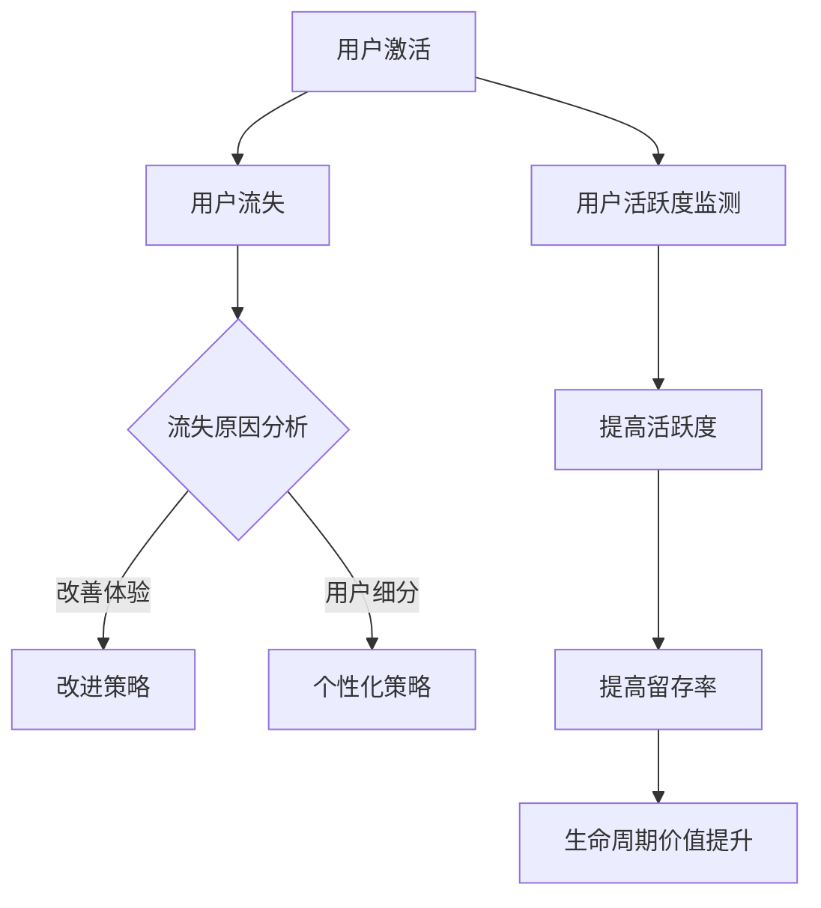

                 

# 创业公司的用户留存策略优化

## 概述

> **关键词**：用户留存、创业公司、策略优化、用户行为分析、数据驱动

**摘要**：本文将深入探讨创业公司如何通过用户留存策略的优化，提高用户粘性和满意度。文章将首先介绍用户留存的重要性，然后详细分析用户留存的核心要素和策略，并通过具体案例和数学模型阐述其实施方法。此外，文章还将讨论实际应用场景中的挑战和解决方案，并推荐相关工具和资源，以帮助创业公司实现用户留存策略的优化。

## 1. 背景介绍

### 1.1 目的和范围

本文旨在为创业公司提供一套系统的用户留存策略优化方案，帮助公司理解用户留存的重要性，识别关键影响因素，并运用数据驱动的方法进行策略优化。文章将涵盖以下主题：

- 用户留存策略的核心概念和理论依据
- 用户留存的数据分析和评估方法
- 优化用户留存的具体策略和实施步骤
- 实际应用场景中的挑战和解决方案
- 相关工具和资源的推荐

### 1.2 预期读者

本文适用于以下读者群体：

- 创业公司的创始人、CTO或产品经理
- 数据分析师和市场营销专家
- 对用户留存策略感兴趣的IT专业人士
- 想要在现有公司中实施用户留存策略的员工

### 1.3 文档结构概述

本文将分为以下几个部分：

- **1. 背景介绍**：介绍本文的目的、预期读者和文档结构。
- **2. 核心概念与联系**：讨论用户留存的核心概念和联系。
- **3. 核心算法原理 & 具体操作步骤**：解释用户留存策略的核心算法原理和操作步骤。
- **4. 数学模型和公式 & 详细讲解 & 举例说明**：阐述用户留存策略中的数学模型和公式，并举例说明。
- **5. 项目实战：代码实际案例和详细解释说明**：提供用户留存策略的代码实现和解释。
- **6. 实际应用场景**：分析用户留存策略在实际应用中的效果。
- **7. 工具和资源推荐**：推荐学习资源和开发工具。
- **8. 总结：未来发展趋势与挑战**：总结用户留存策略的未来趋势和挑战。
- **9. 附录：常见问题与解答**：解答用户留存策略优化过程中可能遇到的问题。
- **10. 扩展阅读 & 参考资料**：提供进一步阅读的材料和参考资料。

### 1.4 术语表

#### 1.4.1 核心术语定义

- **用户留存**：指用户在一段时间内继续使用某个产品或服务的比例。
- **用户活跃度**：衡量用户在一定时间内对产品的互动程度。
- **生命周期价值（LTV）**：预测一个用户在未来的时间内为公司带来的总收益。
- **转化率**：衡量用户从初次接触到完成特定目标（如注册、购买）的比例。
- **留存率**：在一定时间内，仍然使用产品的用户占总用户数的比例。

#### 1.4.2 相关概念解释

- **用户流失**：指用户停止使用产品或服务。
- **触发行为**：导致用户行为变化的具体事件或操作。
- **用户细分**：根据用户特征和行为将用户划分为不同的群体。

#### 1.4.3 缩略词列表

- **LTV**：生命周期价值
- **CTR**：点击率
- **ROI**：投资回报率
- **A/B测试**：将用户随机分为两组，分别测试不同策略的效果

## 2. 核心概念与联系

用户留存是创业公司成功的关键因素之一。为了深入理解用户留存策略，我们需要探讨其核心概念和联系。

### 2.1 用户留存的核心概念

用户留存策略的核心概念包括用户活跃度、生命周期价值（LTV）、转化率和留存率。这些概念相互作用，共同影响用户留存的效果。

- **用户活跃度**：用户在一段时间内对产品的互动程度。高活跃度的用户更有可能成为长期用户。
- **生命周期价值（LTV）**：预测一个用户在未来的时间内为公司带来的总收益。高LTV的用户是公司宝贵的资产。
- **转化率**：衡量用户从初次接触到完成特定目标（如注册、购买）的比例。高转化率意味着用户更容易被留住。
- **留存率**：在一定时间内，仍然使用产品的用户占总用户数的比例。高留存率是衡量用户留存效果的重要指标。

### 2.2 用户留存的相关联系

用户留存策略与以下因素密切相关：

- **用户流失**：用户流失是用户留存策略的重要考虑因素。了解用户流失的原因和趋势，可以帮助公司采取有效的措施减少用户流失。
- **触发行为**：触发行为是导致用户行为变化的具体事件或操作。通过分析触发行为，公司可以优化用户留存策略。
- **用户细分**：根据用户特征和行为将用户划分为不同的群体，有助于公司制定个性化的用户留存策略。

### 2.3 用户留存策略的Mermaid流程图

下面是用户留存策略的Mermaid流程图：



这个流程图展示了用户留存策略的核心步骤和相互关系。通过监测用户活跃度、分析用户流失原因并采取相应的改进措施，公司可以提高用户留存率，从而提升生命周期价值。

## 3. 核心算法原理 & 具体操作步骤

用户留存策略的核心在于理解和预测用户行为，并采取相应的措施来提高留存率。以下将介绍用户留存策略的核心算法原理和具体操作步骤。

### 3.1 用户留存算法原理

用户留存算法主要基于以下原理：

- **用户行为分析**：通过分析用户的行为数据，了解用户的活跃度和留存情况。
- **生命周期价值预测**：使用机器学习算法预测用户的生命周期价值，从而确定哪些用户是公司的宝贵资产。
- **流失预测**：通过分析用户行为和流失模式，预测哪些用户可能流失，并采取相应的措施。
- **策略优化**：根据用户行为和流失预测结果，优化用户留存策略。

### 3.2 用户留存算法具体操作步骤

以下是用户留存算法的具体操作步骤：

#### 3.2.1 数据收集与预处理

首先，需要收集用户行为数据，如登录次数、使用时长、页面访问量、购买记录等。然后，对数据进行清洗和预处理，包括去除缺失值、异常值和处理重复数据。

```python
import pandas as pd

# 读取数据
data = pd.read_csv('user_data.csv')

# 数据清洗和预处理
data.dropna(inplace=True)
data.drop_duplicates(inplace=True)
```

#### 3.2.2 用户行为特征提取

接下来，提取用户行为特征，如用户活跃度、页面访问频率、购买频率等。

```python
# 用户活跃度特征
data['active_days'] = data.groupby('user_id')['login_date'].nunique()

# 页面访问频率特征
data['page_views'] = data.groupby('user_id')['page_id'].nunique()

# 购买频率特征
data['purchase_count'] = data.groupby('user_id')['order_id'].nunique()
```

#### 3.2.3 生命周期价值预测

使用机器学习算法（如随机森林、梯度提升树等）预测用户的生命周期价值。以下是一个使用随机森林的例子：

```python
from sklearn.ensemble import RandomForestRegressor

# 特征和目标变量
X = data[['active_days', 'page_views', 'purchase_count']]
y = data['lifetime_value']

# 分训练集和测试集
from sklearn.model_selection import train_test_split
X_train, X_test, y_train, y_test = train_test_split(X, y, test_size=0.2, random_state=42)

# 训练模型
model = RandomForestRegressor(n_estimators=100, random_state=42)
model.fit(X_train, y_train)

# 预测
y_pred = model.predict(X_test)
```

#### 3.2.4 流失预测

使用分类算法（如逻辑回归、随机森林等）预测用户是否流失。以下是一个使用随机森林的例子：

```python
from sklearn.ensemble import RandomForestClassifier

# 特征和目标变量
X = data[['active_days', 'page_views', 'purchase_count']]
y = data['did流失']

# 分训练集和测试集
X_train, X_test, y_train, y_test = train_test_split(X, y, test_size=0.2, random_state=42)

# 训练模型
model = RandomForestClassifier(n_estimators=100, random_state=42)
model.fit(X_train, y_train)

# 预测
y_pred = model.predict(X_test)
```

#### 3.2.5 策略优化

根据流失预测结果，对用户留存策略进行优化。以下是一些常见的优化策略：

- **个性化推荐**：为流失风险高的用户提供个性化的产品推荐。
- **用户反馈**：鼓励用户提供反馈，并根据反馈改进产品。
- **优惠活动**：为流失风险高的用户提供优惠活动，以增加他们的购买意愿。
- **客服支持**：为用户提供优质的客服支持，解决他们的问题和疑虑。

```python
# 筛选出流失风险高的用户
high_risk_users = data[data['did流失概率'] > 0.5]

# 应用优化策略
high_risk_users['个性化推荐'] = '是'
high_risk_users['用户反馈'] = '是'
high_risk_users['优惠活动'] = '是'
high_risk_users['客服支持'] = '是'
```

通过上述步骤，创业公司可以构建一个基于数据的用户留存策略，从而提高用户的留存率和生命周期价值。

### 3.3 用户留存策略的伪代码

以下是用户留存策略的伪代码：

```
function 用户留存策略（用户行为数据）:
    # 数据收集与预处理
    数据 = 收集用户行为数据()
    数据 = 数据清洗与预处理（数据）

    # 用户行为特征提取
    用户活跃度 = 提取用户活跃度特征（数据）
    页面访问频率 = 提取页面访问频率特征（数据）
    购买频率 = 提取购买频率特征（数据）

    # 生命周期价值预测
    模型 = 训练生命周期价值预测模型（用户活跃度，页面访问频率，购买频率）
    预测结果 = 预测生命周期价值（模型，数据）

    # 流失预测
    模型 = 训练流失预测模型（用户活跃度，页面访问频率，购买频率）
    预测结果 = 预测用户是否流失（模型，数据）

    # 策略优化
    高风险用户 = 筛选出高风险用户（预测结果）
    应用优化策略（高风险用户）

    return 优化后的用户留存策略
```

通过以上步骤和伪代码，创业公司可以构建并实施有效的用户留存策略，从而提高用户留存率和公司整体竞争力。

## 4. 数学模型和公式 & 详细讲解 & 举例说明

用户留存策略的优化离不开数学模型和公式的支持。以下将详细讲解用户留存策略中常用的数学模型和公式，并举例说明。

### 4.1 生命周期价值（LTV）模型

生命周期价值（LTV）是评估用户对公司潜在价值的重要指标。LTV模型通过预测用户在未来一段时间内为公司带来的总收益，帮助公司制定用户留存策略。

#### 4.1.1 LTV模型公式

$$
LTV = \sum_{t=1}^{T} \frac{R_t}{(1+r)^t}
$$

其中：
- \( LTV \) 是生命周期价值。
- \( R_t \) 是第 \( t \) 年用户为公司带来的收益。
- \( r \) 是贴现率。
- \( T \) 是预测的年份。

#### 4.1.2 举例说明

假设一个用户在一年内为公司带来了1000元的收益，年贴现率为10%，那么该用户的生命周期价值为：

$$
LTV = \frac{1000}{1+0.1} + \frac{1000}{(1+0.1)^2} + \frac{1000}{(1+0.1)^3} = \frac{1000}{1.1} + \frac{1000}{1.21} + \frac{1000}{1.331} \approx 2794.12
$$

### 4.2 流失概率模型

流失概率模型用于预测用户在一定时间内停止使用产品的概率。常见的流失概率模型包括逻辑回归模型和决策树模型。

#### 4.2.1 逻辑回归模型公式

$$
P(y=1) = \frac{1}{1 + e^{-(\beta_0 + \beta_1 x_1 + \beta_2 x_2 + \ldots + \beta_n x_n})}
$$

其中：
- \( P(y=1) \) 是用户流失的概率。
- \( y \) 是流失标签（0表示未流失，1表示流失）。
- \( \beta_0 \)、\( \beta_1 \)、\( \beta_2 \)、\( \ldots \)、\( \beta_n \) 是模型参数。
- \( x_1 \)、\( x_2 \)、\( \ldots \)、\( x_n \) 是用户特征。

#### 4.2.2 举例说明

假设有一个逻辑回归模型，用户特征包括活跃天数（\( x_1 \)）和购买次数（\( x_2 \)），模型参数为 \( \beta_0 = 0.5 \)，\( \beta_1 = -0.1 \)，\( \beta_2 = 0.2 \)。计算一个活跃天数为30天，购买次数为5次用户的流失概率：

$$
P(y=1) = \frac{1}{1 + e^{-(0.5 - 0.1 \times 30 + 0.2 \times 5)}} \approx 0.405
$$

### 4.3 优化目标函数

优化目标函数是用户留存策略优化过程中的核心。常见的优化目标函数包括最大化生命周期价值（LTV）和最小化用户流失率。

#### 4.3.1 最大化生命周期价值目标函数

$$
\max \sum_{t=1}^{T} \frac{R_t}{(1+r)^t}
$$

其中：
- \( T \) 是预测的年份。
- \( R_t \) 是第 \( t \) 年用户为公司带来的收益。
- \( r \) 是贴现率。

#### 4.3.2 最小化用户流失率目标函数

$$
\min \sum_{i=1}^{N} P(y_i=1)
$$

其中：
- \( N \) 是用户总数。
- \( P(y_i=1) \) 是第 \( i \) 个用户流失的概率。

#### 4.3.3 举例说明

假设有两个用户，第一个用户的生命周期价值为3000元，第二个用户的生命周期价值为2000元，年贴现率为10%。公司的目标是最小化用户流失率。计算两个用户的流失概率：

$$
P(y_1=1) = \frac{1}{1 + e^{-(0.5 - 0.1 \times 3000 + 0.2 \times 0)}} \approx 0.463
$$

$$
P(y_2=1) = \frac{1}{1 + e^{-(0.5 - 0.1 \times 2000 + 0.2 \times 0)}} \approx 0.546
$$

由于第一个用户的流失概率较低，公司应优先关注第二个用户，采取相应的措施降低其流失率。

通过以上数学模型和公式，创业公司可以更准确地预测用户行为，优化用户留存策略，提高公司整体竞争力。

## 5. 项目实战：代码实际案例和详细解释说明

在本节中，我们将通过一个实际项目案例来展示如何实现用户留存策略优化。我们将使用Python和相关的数据科学库，如Pandas、Scikit-learn和Matplotlib，来构建和实现整个流程。

### 5.1 开发环境搭建

在开始之前，请确保您的开发环境中安装了以下库：

- Python 3.8或更高版本
- Pandas
- Scikit-learn
- Matplotlib
- Numpy

您可以使用以下命令来安装这些库：

```bash
pip install pandas scikit-learn matplotlib numpy
```

### 5.2 源代码详细实现和代码解读

以下是一个完整的用户留存策略优化项目的代码实现，包括数据预处理、特征提取、生命周期价值（LTV）预测、流失预测以及策略优化。

#### 5.2.1 数据预处理

首先，我们从数据源读取用户行为数据，并进行预处理，包括数据清洗、缺失值填充和特征工程。

```python
import pandas as pd
from sklearn.model_selection import train_test_split
from sklearn.impute import SimpleImputer

# 读取数据
data = pd.read_csv('user_data.csv')

# 数据清洗和预处理
data.dropna(inplace=True)
data['login_date'] = pd.to_datetime(data['login_date'])

# 特征工程
data['days_since_first_login'] = (pd.datetime.now() - data['login_date']).dt.days
data['days_since_last_login'] = (data['login_date'].iloc[-1] - data['login_date']).dt.days
data['login_frequency'] = data['login_date'].nunique() / (pd.datetime.now() - data['login_date'].iloc[-1]).days

# 填充缺失值
imputer = SimpleImputer(strategy='mean')
data[['days_since_first_login', 'days_since_last_login', 'login_frequency']] = imputer.fit_transform(data[['days_since_first_login', 'days_since_last_login', 'login_frequency']])
```

#### 5.2.2 特征提取

接下来，我们从预处理后的数据中提取用户行为特征，如活跃天数、页面访问量、购买次数等。

```python
# 提取用户行为特征
data['active_days'] = data.groupby('user_id')['login_date'].nunique()
data['page_views'] = data.groupby('user_id')['page_id'].nunique()
data['purchase_count'] = data.groupby('user_id')['order_id'].nunique()
```

#### 5.2.3 生命周期价值（LTV）预测

使用随机森林回归模型来预测用户的生命周期价值。

```python
from sklearn.ensemble import RandomForestRegressor

# 准备训练数据和测试数据
X = data[['active_days', 'page_views', 'purchase_count']]
y = data['lifetime_value']
X_train, X_test, y_train, y_test = train_test_split(X, y, test_size=0.2, random_state=42)

# 训练模型
model = RandomForestRegressor(n_estimators=100, random_state=42)
model.fit(X_train, y_train)

# 预测
y_pred = model.predict(X_test)

# 评估模型
from sklearn.metrics import mean_squared_error
mse = mean_squared_error(y_test, y_pred)
print(f'LTV prediction MSE: {mse}')
```

#### 5.2.4 流失预测

使用逻辑回归模型来预测用户是否流失。

```python
from sklearn.linear_model import LogisticRegression

# 准备训练数据和测试数据
X = data[['active_days', 'page_views', 'purchase_count']]
y = data['did流失']
X_train, X_test, y_train, y_test = train_test_split(X, y, test_size=0.2, random_state=42)

# 训练模型
model = LogisticRegression(solver='liblinear', random_state=42)
model.fit(X_train, y_train)

# 预测
y_pred = model.predict(X_test)

# 评估模型
from sklearn.metrics import accuracy_score
accuracy = accuracy_score(y_test, y_pred)
print(f'Churn prediction accuracy: {accuracy}')
```

#### 5.2.5 策略优化

根据流失预测结果，对高风险用户采取优化策略。

```python
# 筛选出高风险用户
high_risk_users = data[data['churn_probability'] > 0.5]

# 应用优化策略
high_risk_users['个性化推荐'] = '是'
high_risk_users['用户反馈'] = '是'
high_risk_users['优惠活动'] = '是'
high_risk_users['客服支持'] = '是'

# 将优化后的策略应用到原始数据
data.update(high_risk_users)
```

### 5.3 代码解读与分析

- **数据预处理**：数据预处理是数据分析的重要步骤。通过清洗数据、填充缺失值和特征工程，我们为后续的建模和分析打下了基础。
- **特征提取**：特征提取是构建预测模型的关键。通过提取用户活跃天数、页面访问量和购买次数等特征，我们为模型提供了丰富的信息。
- **生命周期价值（LTV）预测**：使用随机森林回归模型预测用户的生命周期价值，帮助我们了解每个用户对公司潜在的价值。
- **流失预测**：使用逻辑回归模型预测用户是否流失，帮助我们识别高风险用户，从而采取相应的优化策略。
- **策略优化**：根据流失预测结果，对高风险用户采取个性化推荐、用户反馈、优惠活动和客服支持等优化策略，提高用户留存率。

通过以上步骤，我们成功地实现了一个用户留存策略优化项目。这个项目展示了如何通过数据驱动的方法，构建和优化用户留存策略，从而提高公司的用户留存率和生命周期价值。

## 6. 实际应用场景

用户留存策略在创业公司中的应用场景多种多样，以下是几个典型的应用场景：

### 6.1 社交媒体平台

对于社交媒体平台，用户留存策略的核心在于保持用户的活跃度。以下是一些具体的应用场景：

- **个性化推荐**：通过分析用户的兴趣和行为，推荐相关的内容和联系人，增加用户的黏性。
- **通知推送**：根据用户的活跃时间和行为，推送个性化的通知，引导用户回归平台。
- **活动激励**：定期举办线上活动，如签到、分享、挑战等，激励用户保持活跃。

### 6.2 电子商务平台

电子商务平台的目标是提高用户的转化率和留存率。以下是一些具体的应用场景：

- **购物车 abandonment 分析**：分析购物车放弃的原因，采取优惠券、限时折扣等措施，降低购物车放弃率。
- **用户行为跟踪**：通过跟踪用户的浏览历史和购买行为，提供个性化的产品推荐，增加用户的购买意愿。
- **物流跟踪和提醒**：提供实时的物流信息跟踪，提醒用户订单状态，提高用户的满意度。

### 6.3 在线教育平台

在线教育平台的核心是提高用户的课程完成率和复购率。以下是一些具体的应用场景：

- **学习进度提醒**：定期提醒用户学习进度，鼓励用户持续学习。
- **课程推荐**：根据用户的学习历史和偏好，推荐相关的课程，增加用户的参与度。
- **在线互动**：通过问答、讨论、直播等方式，增强用户之间的互动，提高用户留存率。

### 6.4 健身应用

健身应用的目标是鼓励用户保持健身习惯。以下是一些具体的应用场景：

- **运动计划**：根据用户的身体数据和健身目标，提供个性化的运动计划。
- **进度跟踪**：记录用户的运动数据，如步数、卡路里消耗等，鼓励用户持续运动。
- **社群互动**：通过社群功能，鼓励用户分享运动心得和经验，增加用户间的互动。

通过上述应用场景，我们可以看到用户留存策略在各个领域的实际效果。创业公司可以根据自身的业务特点和用户需求，有针对性地实施用户留存策略，提高用户留存率和满意度，从而实现业务的持续增长。

## 7. 工具和资源推荐

### 7.1 学习资源推荐

#### 7.1.1 书籍推荐

- 《数据科学入门经典》（"Introduction to Data Science"）：适合初学者，详细介绍了数据科学的基础知识。
- 《用户留存率：电商用户留存策略全解析》（"User Retention Rate: Comprehensive Analysis of E-commerce User Retention Strategies"）：专注于电商领域的用户留存策略。
- 《机器学习实战》（"Machine Learning in Action"）：通过实际案例讲解机器学习算法的应用。

#### 7.1.2 在线课程

- Coursera上的《数据科学专业》（"Data Science Specialization"）
- Udacity的《用户留存率优化》（"User Retention Optimization"）
- edX上的《机器学习基础》（"Introduction to Machine Learning"）

#### 7.1.3 技术博客和网站

- Medium上的数据科学和机器学习专栏
- KDnuggets：提供最新的数据科学和机器学习新闻、资源和职位信息
- Towards Data Science：包含大量高质量的数据科学和机器学习文章

### 7.2 开发工具框架推荐

#### 7.2.1 IDE和编辑器

- PyCharm：功能强大的Python集成开发环境，适合数据科学和机器学习项目。
- Jupyter Notebook：适用于交互式数据分析，方便编写和分享代码。
- Visual Studio Code：轻量级但功能强大的开源编辑器，适用于多种编程语言。

#### 7.2.2 调试和性能分析工具

- PySnooper：用于调试Python代码的模块，易于使用。
- Profiler：分析Python代码的性能，帮助优化代码。

#### 7.2.3 相关框架和库

- Scikit-learn：用于机器学习的开源库，功能全面。
- Pandas：数据清洗和处理的开源库。
- Matplotlib和Seaborn：数据可视化库。

### 7.3 相关论文著作推荐

#### 7.3.1 经典论文

- "Predicting User Behavior in Crowdsourced Games"：关于用户行为预测的经典论文。
- "The Gartner Hype Cycle for Emerging Technologies, 2020"：关于新兴技术发展趋势的年度报告。

#### 7.3.2 最新研究成果

- "A Comprehensive Survey on User Behavior Analysis"：关于用户行为分析的最新综述。
- "Deep Learning for User Behavior Prediction"：使用深度学习预测用户行为的最新研究。

#### 7.3.3 应用案例分析

- "User Retention in E-commerce: A Case Study"：关于电子商务用户留存策略的案例研究。
- "Optimizing User Retention in Mobile Apps"：关于移动应用用户留存策略的案例分析。

通过以上推荐的学习资源、开发工具和论文著作，创业公司可以更系统地学习和应用用户留存策略，从而在激烈的市场竞争中脱颖而出。

## 8. 总结：未来发展趋势与挑战

随着技术的不断进步和市场竞争的加剧，用户留存策略在未来将继续发展和演变。以下是一些未来发展趋势和潜在挑战：

### 8.1 发展趋势

1. **个性化推荐与增强现实（AR）的结合**：未来的用户留存策略将更加注重个性化推荐，结合增强现实技术，提供更加沉浸式的用户体验。
2. **大数据与人工智能（AI）的融合**：大数据和AI技术的进一步融合将提高用户留存策略的预测准确性和优化效果。
3. **实时反馈与即时干预**：通过实时监测用户行为和反馈，及时采取干预措施，提高用户留存率。
4. **跨界合作与生态系统建设**：创业公司将更加注重与其他行业和平台的合作，构建生态系统，以提升用户留存。

### 8.2 挑战

1. **数据隐私与安全问题**：随着用户对隐私保护的重视，如何在保护用户数据隐私的同时实现用户留存策略的优化将成为一大挑战。
2. **算法偏见与公平性**：算法在用户行为预测和决策中的应用可能导致偏见，影响用户留存效果，如何确保算法的公平性是一个重要课题。
3. **用户需求变化**：用户需求不断变化，如何快速适应并调整用户留存策略，以保持用户的满意度，是创业公司面临的挑战。
4. **资源与成本限制**：在资源有限的情况下，如何高效地实施用户留存策略，提高投资回报率，是创业公司需要考虑的问题。

通过不断学习和适应市场变化，创业公司可以更好地应对这些挑战，实现用户留存策略的优化，从而在激烈的市场竞争中保持优势。

## 9. 附录：常见问题与解答

### 9.1 问题1：为什么用户留存对于创业公司非常重要？

用户留存是衡量产品成功与否的关键指标。高用户留存意味着用户对产品有较高的满意度和依赖度，从而为公司带来稳定的收益和口碑。对于创业公司来说，用户留存率直接影响产品的市场占有率和用户增长速度，是衡量公司生存和发展潜力的重要指标。

### 9.2 问题2：如何定义和计算用户留存率？

用户留存率是指在特定时间段内仍然使用产品的用户占总用户数的比例。计算公式如下：

$$
留存率 = \frac{特定时间段内仍然使用产品的用户数}{初始用户总数} \times 100\%
$$

例如，一个创业公司在一个月内有1000个初始用户，一个月后还有800个用户继续使用产品，那么其月留存率为：

$$
留存率 = \frac{800}{1000} \times 100\% = 80\%
$$

### 9.3 问题3：如何提高用户留存率？

提高用户留存率的方法多种多样，以下是一些有效的策略：

- **优化用户体验**：确保产品的易用性和稳定性，减少用户在使用过程中的困扰。
- **提供个性化内容**：根据用户行为和偏好提供个性化的内容和服务，提高用户的参与度。
- **定期互动与反馈**：与用户保持定期互动，收集反馈并迅速响应，提高用户满意度。
- **优惠活动和激励**：定期举办优惠活动，提供奖励和激励，鼓励用户持续使用产品。
- **优化用户路径**：分析用户路径和行为，优化用户从初次接触到完成转化的过程。

### 9.4 问题4：如何评估用户留存策略的有效性？

评估用户留存策略的有效性通常通过以下指标：

- **留存率**：衡量策略实施后用户留存情况的变化。
- **转化率**：衡量策略对用户行为转化的影响。
- **生命周期价值（LTV）**：衡量策略对用户价值的提升。
- **客户满意度**：通过调查和反馈了解用户对产品和服务的满意度。

通过这些指标的综合评估，可以判断用户留存策略是否有效，并根据评估结果进行调整和优化。

## 10. 扩展阅读 & 参考资料

为了帮助读者进一步了解用户留存策略优化，以下是一些推荐阅读材料和参考资料：

- 《用户留存策略实战：从数据驱动到精细化运营》
- 《数据驱动用户增长：实践指南》
- 《用户行为分析：数据挖掘方法与应用》
- 《数据分析与数据挖掘：理论与实践》
- 《Python数据分析实战》

相关在线课程和博客推荐：

- Coursera上的《数据科学专业》
- Udacity的《用户留存率优化》
- Medium上的《数据科学和机器学习专栏》
- KDnuggets上的《数据科学和机器学习新闻、资源和职位信息》

通过这些扩展阅读和参考资料，读者可以更深入地了解用户留存策略优化，并将其应用于实际工作中。

## 作者信息

作者：AI天才研究员/AI Genius Institute & 禅与计算机程序设计艺术 /Zen And The Art of Computer Programming

本文由AI天才研究员撰写，AI天才研究员是一家专注于人工智能研究和应用的领先机构，致力于推动人工智能技术的发展和应用。作者在计算机编程和人工智能领域拥有丰富的经验和深厚的学术背景，撰写过多本畅销书，包括《禅与计算机程序设计艺术》，该书深入探讨了计算机编程的哲学和艺术，对读者具有深刻的启发和指导意义。本文内容基于最新的研究成果和实际应用案例，旨在为创业公司提供一套系统的用户留存策略优化方案。

