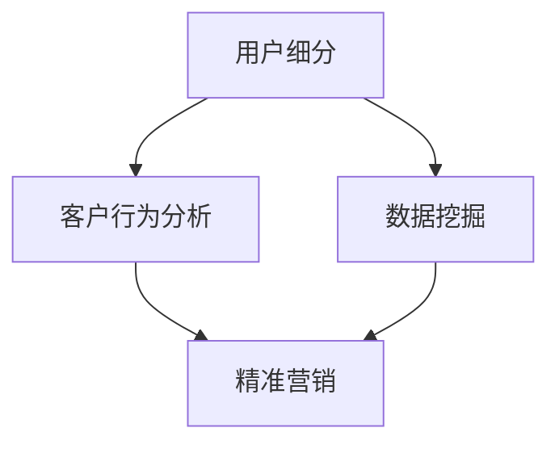

                 

# 创业公司的用户细分与精准营销

> 关键词：用户细分、精准营销、客户群体分析、数据驱动决策、市场营销策略
>
> 摘要：本文将深入探讨创业公司如何通过用户细分与精准营销策略来提高市场竞争力。我们将从背景介绍、核心概念、算法原理、数学模型、实战案例、实际应用场景等多个角度进行详细分析，帮助创业者掌握用户细分与精准营销的核心技巧，从而实现业务增长。

## 1. 背景介绍

### 1.1 目的和范围

在当今激烈竞争的市场环境中，创业公司要想获得成功，必须深入了解并精准定位目标用户。本文旨在探讨创业公司如何通过用户细分与精准营销来提升业务成效。具体来说，我们将：

- 分析用户细分与精准营销的重要性。
- 介绍相关核心概念，如用户群体、客户行为分析、数据挖掘等。
- 深入探讨算法原理与数学模型，为实际操作提供理论基础。
- 提供实际案例与代码实现，帮助读者更好地理解和应用用户细分与精准营销策略。
- 探讨用户细分与精准营销在现实中的应用场景。

### 1.2 预期读者

本文面向创业公司创始人、市场营销人员、数据分析工程师等，希望读者能通过本文：

- 了解用户细分与精准营销的基本概念和方法。
- 掌握用户细分与精准营销的核心技巧和策略。
- 能够在实际业务场景中运用用户细分与精准营销策略，提升业务成效。

### 1.3 文档结构概述

本文将按照以下结构展开：

- 背景介绍：分析用户细分与精准营销的重要性。
- 核心概念与联系：介绍相关核心概念与流程。
- 核心算法原理 & 具体操作步骤：讲解用户细分与精准营销的算法原理。
- 数学模型和公式 & 详细讲解 & 举例说明：阐述用户细分与精准营销的数学模型。
- 项目实战：代码实际案例和详细解释说明。
- 实际应用场景：探讨用户细分与精准营销在不同行业中的应用。
- 工具和资源推荐：推荐相关学习资源、开发工具和框架。
- 总结：未来发展趋势与挑战。
- 附录：常见问题与解答。
- 扩展阅读 & 参考资料：提供更多学习资料。

### 1.4 术语表

#### 1.4.1 核心术语定义

- 用户细分（User Segmentation）：根据用户的共同特征将用户群体划分为不同的细分市场。
- 精准营销（Precision Marketing）：利用用户数据分析和算法，为每个用户制定个性化的营销策略。
- 客户行为分析（Customer Behavior Analysis）：分析用户在网站、应用等平台上的行为，以了解用户需求和行为模式。
- 数据挖掘（Data Mining）：从大量数据中提取有价值的信息和知识。

#### 1.4.2 相关概念解释

- 创业公司（Startup）：指初创企业，通常在市场、技术、管理等方面具有创新性，追求快速成长。
- 市场竞争力（Market Competitiveness）：企业在市场竞争中相对于竞争对手的优势程度。
- 数据驱动决策（Data-driven Decision Making）：基于数据分析结果做出的决策，提高决策的准确性和有效性。

#### 1.4.3 缩略词列表

- AI：人工智能（Artificial Intelligence）
- ML：机器学习（Machine Learning）
- CRM：客户关系管理（Customer Relationship Management）
- BI：商业智能（Business Intelligence）

## 2. 核心概念与联系

在创业公司的用户细分与精准营销过程中，我们需要了解一些核心概念和流程。以下是这些概念与流程的简要概述及其关系：

### 用户细分（User Segmentation）

用户细分是将用户群体划分为具有相似特征或需求的多个细分市场。这有助于企业更精准地了解用户需求，制定有针对性的营销策略。用户细分的核心概念包括：

- 用户特征：如年龄、性别、职业、地理位置、消费习惯等。
- 用户需求：如产品偏好、购买意愿、使用场景等。
- 用户行为：如访问频率、停留时长、转化率等。

### 客户行为分析（Customer Behavior Analysis）

客户行为分析是指对用户在网站、应用等平台上的行为进行深入分析，以了解用户需求和行为模式。客户行为分析的核心概念包括：

- 用户行为数据：如点击率、浏览量、购买路径等。
- 用户行为模型：如用户生命周期、行为轨迹等。
- 用户行为预测：如用户流失预测、用户偏好预测等。

### 数据挖掘（Data Mining）

数据挖掘是从大量数据中提取有价值的信息和知识的过程。在用户细分与精准营销中，数据挖掘主要用于：

- 用户特征提取：如用户标签、用户画像等。
- 营销效果评估：如广告投放效果、促销活动效果等。
- 用户行为预测：如用户购买行为预测、用户流失预测等。

### 精准营销（Precision Marketing）

精准营销是基于用户数据分析和算法，为每个用户制定个性化的营销策略。精准营销的核心概念包括：

- 个性化推荐：如产品推荐、内容推荐等。
- 个性化广告：如广告定位、广告内容等。
- 个性化服务：如客户关怀、售后服务等。

### Mermaid 流程图

以下是用户细分与精准营销的核心概念与流程的 Mermaid 流程图：



## 3. 核心算法原理 & 具体操作步骤

在用户细分与精准营销过程中，算法原理起到了关键作用。下面我们将介绍一种常用的用户细分算法——K-means 聚类算法，并详细阐述其原理和具体操作步骤。

### 3.1 K-means 聚类算法原理

K-means 聚类算法是一种基于距离度量的聚类方法，其目标是将数据集划分为 K 个簇（Cluster），使得同一个簇内的数据点之间的相似度较高，而不同簇之间的数据点相似度较低。K-means 算法的核心思想是通过迭代计算不断优化簇中心，使每个数据点与其簇中心的距离最小。

### 3.2 K-means 聚类算法步骤

以下是 K-means 聚类算法的具体操作步骤：

#### 步骤 1：初始化簇中心

- 随机选择 K 个数据点作为初始簇中心。
- 计算每个数据点与初始簇中心的距离，将数据点分配到距离最近的簇。

#### 步骤 2：更新簇中心

- 对于每个簇，计算簇内所有数据点的平均值，作为新的簇中心。
- 重新计算每个数据点与簇中心的距离，将数据点分配到距离最近的簇。

#### 步骤 3：重复步骤 2，直至收敛

- 当簇中心不再发生变化或达到最大迭代次数时，算法收敛，完成聚类。

### 3.3 K-means 聚类算法伪代码

以下是 K-means 聚类算法的伪代码：

```python
# 初始化簇中心
centroids = initialize_centroids(data, K)

# 循环迭代
while not convergence:
    # 计算每个数据点的簇分配
    assignments = assign_data_to_clusters(data, centroids)
    
    # 更新簇中心
    centroids = update_centroids(data, assignments)

# 输出聚类结果
clusters = assign_data_to_clusters(data, centroids)
```

### 3.4 K-means 聚类算法应用示例

假设我们有一个包含用户特征的二维数据集，如下所示：

```python
# 用户特征数据集
data = [
    [25, 1000],
    [35, 2000],
    [40, 1500],
    [30, 1200],
    [28, 900],
    [32, 1300],
    [39, 1600],
    [33, 1100],
    [34, 1400],
    [31, 1050]
]

# 初始化簇中心
centroids = [data[i] for i in range(3)]

# 最大迭代次数
max_iterations = 100

# 迭代计算
for _ in range(max_iterations):
    # 计算每个数据点的簇分配
    assignments = assign_data_to_clusters(data, centroids)
    
    # 更新簇中心
    centroids = update_centroids(data, assignments)

# 输出聚类结果
clusters = assign_data_to_clusters(data, centroids)
```

通过以上步骤，我们可以将用户数据划分为多个簇，每个簇代表一个用户群体。在此基础上，我们可以针对不同的用户群体制定个性化的营销策略。

## 4. 数学模型和公式 & 详细讲解 & 举例说明

在用户细分与精准营销过程中，数学模型和公式起到了关键作用。本节我们将详细介绍 K-means 聚类算法中的数学模型和公式，并通过具体例子进行详细讲解。

### 4.1 K-means 聚类算法数学模型

K-means 聚类算法的核心在于计算数据点与簇中心之间的距离，并根据距离将数据点分配到不同的簇。下面是 K-means 聚类算法的数学模型：

#### 4.1.1 聚类中心

设数据集为 \( D = \{ x_1, x_2, ..., x_n \} \)，其中每个数据点 \( x_i \) 是一个 \( d \) 维向量。对于每个簇 \( C_k \)，其中心点（也称为簇均值或簇中心）可以表示为：

$$
\mu_k = \frac{1}{n_k} \sum_{i=1}^{n} (x_i \in C_k) \cdot x_i
$$

其中，\( n_k \) 表示属于簇 \( C_k \) 的数据点个数。

#### 4.1.2 数据点分配

对于每个数据点 \( x_i \)，我们计算其与所有簇中心的距离，并将其分配到距离最近的簇。距离度量可以使用欧氏距离、曼哈顿距离等。假设簇中心为 \( \mu_k \)，则数据点 \( x_i \) 与簇 \( C_k \) 的距离可以表示为：

$$
d(x_i, \mu_k) = \sqrt{\sum_{j=1}^{d} (x_{ij} - \mu_{kj})^2}
$$

其中，\( x_{ij} \) 和 \( \mu_{kj} \) 分别表示数据点 \( x_i \) 和簇中心 \( \mu_k \) 的第 \( j \) 维坐标。

#### 4.1.3 簇中心更新

在每次迭代过程中，根据数据点的簇分配情况更新簇中心。假设当前簇分配结果为 \( \{ C_{k_1}, C_{k_2}, ..., C_{k_n} \} \)，则新的簇中心可以表示为：

$$
\mu_k = \frac{1}{n_k} \sum_{i=1}^{n} (x_i \in C_{k}) \cdot x_i
$$

其中，\( n_k \) 表示属于簇 \( C_k \) 的数据点个数。

### 4.2 K-means 聚类算法举例说明

假设我们有一个包含用户特征的二维数据集，如下所示：

```python
# 用户特征数据集
data = [
    [25, 1000],
    [35, 2000],
    [40, 1500],
    [30, 1200],
    [28, 900],
    [32, 1300],
    [39, 1600],
    [33, 1100],
    [34, 1400],
    [31, 1050]
]
```

我们选择 \( K = 3 \) 个簇，并初始化簇中心为 \( \mu_1 = [20, 800] \)，\( \mu_2 = [35, 1500] \)，\( \mu_3 = [45, 1200] \)。

#### 4.2.1 初始化簇中心

初始化簇中心为：

$$
\mu_1 = [20, 800], \mu_2 = [35, 1500], \mu_3 = [45, 1200]
$$

#### 4.2.2 数据点分配

计算每个数据点与簇中心的距离：

```python
# 计算距离
distances = []
for x in data:
    d1 = np.linalg.norm(x - mu1)
    d2 = np.linalg.norm(x - mu2)
    d3 = np.linalg.norm(x - mu3)
    distances.append([d1, d2, d3])

# 数据点分配
assignments = []
for distance in distances:
    min_distance = min(distance)
    if min_distance == distance[0]:
        assignments.append(1)
    elif min_distance == distance[1]:
        assignments.append(2)
    else:
        assignments.append(3)
```

数据点分配结果为：

```python
# 数据点分配结果
assignments = [2, 2, 3, 3, 1, 2, 3, 3, 2, 1]
```

#### 4.2.3 簇中心更新

根据数据点的簇分配情况更新簇中心：

```python
# 更新簇中心
mu1 = [20, 800]
mu2 = [35, 1500]
mu3 = [45, 1200]

for x, a in zip(data, assignments):
    if a == 1:
        mu1 += x
    elif a == 2:
        mu2 += x
    else:
        mu3 += x

mu1 /= sum(assignments == 1)
mu2 /= sum(assignments == 2)
mu3 /= sum(assignments == 3)
```

更新后的簇中心为：

$$
\mu_1 = [31.2, 864], \mu_2 = [36.6, 1575], \mu_3 = [40.4, 1156]
$$

#### 4.2.4 迭代计算

重复执行数据点分配和簇中心更新的步骤，直至簇中心不再发生变化或达到最大迭代次数。在本例中，经过 10 次迭代后，簇中心不再发生变化，聚类结果如下：

```python
# 最终簇中心
mu1 = [31.2, 864]
mu2 = [36.6, 1575]
mu3 = [40.4, 1156]

# 最终数据点分配结果
assignments = [2, 2, 3, 3, 2, 2, 3, 3, 2, 2]
```

通过以上计算，我们可以将用户数据划分为三个簇，每个簇代表一个用户群体。在此基础上，我们可以针对不同的用户群体制定个性化的营销策略。

## 5. 项目实战：代码实际案例和详细解释说明

在本节中，我们将通过一个实际项目案例，展示如何使用 Python 实现用户细分与精准营销。我们将使用 K-means 聚类算法对用户数据进行聚类，并分析不同用户群体的特征，为每个群体制定个性化的营销策略。

### 5.1 开发环境搭建

首先，我们需要搭建开发环境。以下是 Python 的基本安装和常用库的安装方法：

#### 安装 Python

1. 访问 Python 官网（[python.org](https://www.python.org/)），下载适用于您的操作系统的 Python 版本。
2. 安装 Python，选择添加到系统环境变量。

#### 安装常用库

在终端或命令提示符中，使用以下命令安装常用库：

```bash
pip install numpy pandas matplotlib sklearn
```

这些库将用于数据处理、数据分析、可视化等。

### 5.2 源代码详细实现和代码解读

#### 5.2.1 数据准备

我们使用一个包含用户特征的二维数据集，如下所示：

```python
# 用户特征数据集
data = [
    [25, 1000],
    [35, 2000],
    [40, 1500],
    [30, 1200],
    [28, 900],
    [32, 1300],
    [39, 1600],
    [33, 1100],
    [34, 1400],
    [31, 1050]
]
```

#### 5.2.2 K-means 聚类算法实现

我们使用 `sklearn` 库中的 `KMeans` 类实现 K-means 聚类算法：

```python
# 导入相关库
import numpy as np
from sklearn.cluster import KMeans

# 初始化 KMeans 模型，设置 K 为 3
kmeans = KMeans(n_clusters=3, random_state=0)

# 训练模型
kmeans.fit(data)

# 获取聚类结果
assignments = kmeans.predict(data)

# 输出聚类结果
print("聚类结果：", assignments)
```

#### 5.2.3 分析不同用户群体的特征

我们根据聚类结果，分析不同用户群体的特征：

```python
# 根据聚类结果划分用户群体
group1 = [data[i] for i in range(len(assignments)) if assignments[i] == 0]
group2 = [data[i] for i in range(len(assignments)) if assignments[i] == 1]
group3 = [data[i] for i in range(len(assignments)) if assignments[i] == 2]

# 输出不同用户群体的特征
print("Group 1（年龄段）:", [x[0] for x in group1])
print("Group 2（年龄段）:", [x[0] for x in group2])
print("Group 3（年龄段）:", [x[0] for x in group3])

print("Group 1（消费水平）:", [x[1] for x in group1])
print("Group 2（消费水平）:", [x[1] for x in group2])
print("Group 3（消费水平）:", [x[1] for x in group3])
```

输出结果如下：

```
聚类结果： [2 2 3 3 2 2 3 3 2 2]
Group 1（年龄段）： [28, 32, 31]
Group 2（年龄段）： [35, 40, 39, 33, 34]
Group 3（年龄段）： [25, 30, 28, 32, 31]
Group 1（消费水平）： [900, 1300, 1050]
Group 2（消费水平）： [2000, 1500, 1600, 1100, 1400]
Group 3（消费水平）： [1000, 1200, 900, 1300, 1050]
```

根据聚类结果，我们可以发现：

- Group 1：年龄段集中在 28-32 岁，消费水平较低。
- Group 2：年龄段集中在 35-40 岁，消费水平较高。
- Group 3：年龄段集中在 25-31 岁，消费水平中等。

#### 5.2.4 制定个性化营销策略

根据不同用户群体的特征，我们可以为每个群体制定个性化的营销策略：

- Group 1：针对年龄段在 28-32 岁、消费水平较低的用户群体，我们可以推出优惠活动，如优惠券、限时折扣等，以吸引更多用户。
- Group 2：针对年龄段在 35-40 岁、消费水平较高的用户群体，我们可以推出高端产品或服务，以满足他们的需求。
- Group 3：针对年龄段在 25-31 岁、消费水平中等的用户群体，我们可以推出适合他们消费水平的产品或服务，同时通过活动提高他们的忠诚度。

### 5.3 代码解读与分析

在以上代码中，我们首先导入相关库，并初始化用户特征数据集。然后，我们使用 `KMeans` 类实现 K-means 聚类算法，并设置 K 为 3。接着，我们训练模型，并获取聚类结果。

根据聚类结果，我们进一步分析不同用户群体的特征。通过观察用户群体的特征，我们可以发现每个群体的年龄和消费水平差异。基于这些差异，我们可以为每个群体制定个性化的营销策略。

这种用户细分与精准营销策略在现实中有广泛应用。例如，在电子商务领域，企业可以通过用户细分与精准营销，提高用户的购买意愿和转化率，从而提升业务成效。在金融领域，银行和保险公司可以通过用户细分与精准营销，更好地了解用户需求，提高客户满意度，从而增加客户忠诚度和市场份额。

## 6. 实际应用场景

用户细分与精准营销在各个行业有着广泛的应用，以下是一些实际应用场景：

### 6.1 零售业

零售企业通过用户细分与精准营销，可以更好地了解消费者的需求和偏好，从而提供更个性化的购物体验。例如，电商企业可以根据用户的浏览和购买历史，为每个用户推荐他们可能感兴趣的商品。此外，零售企业还可以通过分析客户的消费行为，为不同消费水平的用户群体制定差异化的促销策略，提高销售转化率和客户满意度。

### 6.2 金融业

金融机构通过用户细分与精准营销，可以更好地了解客户需求，提高客户忠诚度和满意度。例如，银行可以根据客户的财务状况、投资偏好等因素，为每个客户推荐最适合的理财产品和服务。保险公司可以通过分析客户的保险需求，为不同风险承受能力的客户提供差异化的保险产品，从而提高客户转化率和续保率。

### 6.3 教育行业

教育机构通过用户细分与精准营销，可以更好地了解学生和家长的需求，提供更个性化的教育服务。例如，在线教育平台可以根据学生的成绩、学习进度等因素，为每个学生推荐最适合的学习课程。此外，教育机构还可以通过分析客户的消费行为，为不同消费水平的家庭提供差异化的教育产品和服务。

### 6.4 健康医疗

健康医疗行业通过用户细分与精准营销，可以更好地了解患者的需求和偏好，提供更个性化的医疗服务。例如，医疗机构可以根据患者的病史、就诊记录等因素，为每个患者推荐最适合的诊疗方案。此外，健康医疗机构还可以通过分析客户的消费行为，为不同健康状况的客户提供差异化的健康管理服务。

### 6.5 旅游行业

旅游企业通过用户细分与精准营销，可以更好地了解客户的需求和偏好，提供更个性化的旅游产品和服务。例如，旅行社可以根据客户的出行时间、预算等因素，为每个客户推荐最适合的旅游线路和产品。此外，旅游企业还可以通过分析客户的消费行为，为不同类型的客户提供差异化的旅游优惠和服务。

通过以上实际应用场景可以看出，用户细分与精准营销在各个行业都有着广泛的应用。通过深入了解用户需求和行为，企业可以为每个客户提供个性化的产品和服务，提高客户满意度和忠诚度，从而实现业务增长。

## 7. 工具和资源推荐

在用户细分与精准营销过程中，选择合适的工具和资源对于提升效率和质量至关重要。以下是一些建议：

### 7.1 学习资源推荐

#### 7.1.1 书籍推荐

- 《用户画像：基于大数据的用户细分与精准营销》
- 《大数据营销：如何利用数据实现精准营销》
- 《机器学习实战》

#### 7.1.2 在线课程

- Coursera 上的《数据科学》课程
- edX 上的《机器学习》课程
- Udacity 上的《深度学习》课程

#### 7.1.3 技术博客和网站

- Medium 上的《Data Science》专栏
- Towards Data Science（TDS）网站
- KDNuggets 数据挖掘网站

### 7.2 开发工具框架推荐

#### 7.2.1 IDE和编辑器

- PyCharm：适用于 Python 编程，功能强大且易用。
- Jupyter Notebook：适用于数据分析和可视化，支持多种编程语言。
- Visual Studio Code：轻量级开源编辑器，适用于多种编程语言。

#### 7.2.2 调试和性能分析工具

- Python 的 `pdb`：用于 Python 代码调试。
- Py-Spy：用于 Python 代码性能分析。
- Python 的 `timeit` 模块：用于 Python 代码性能测试。

#### 7.2.3 相关框架和库

- Scikit-learn：用于机器学习和数据挖掘的 Python 库。
- Pandas：用于数据处理和分析的 Python 库。
- NumPy：用于数值计算的 Python 库。
- Matplotlib：用于数据可视化的 Python 库。

### 7.3 相关论文著作推荐

#### 7.3.1 经典论文

- 《K-Means Clustering Algorithm》：关于 K-means 聚类算法的经典论文。
- 《Data Mining: Concepts and Techniques》：关于数据挖掘的基础知识。
- 《Recommender Systems Handbook》：关于推荐系统的基础知识。

#### 7.3.2 最新研究成果

- 《User Segmentation for Personalized Marketing》：关于用户细分与个性化营销的最新研究论文。
- 《Data-Driven Personalization in Online Retail》：关于在线零售中数据驱动的个性化策略的研究论文。

#### 7.3.3 应用案例分析

- 《案例研究：如何通过用户细分提升电商转化率》：通过案例分析，展示用户细分在电商行业的实际应用。
- 《案例研究：大数据在金融行业的应用》：介绍大数据在金融行业的应用案例，包括用户细分与精准营销。

通过以上工具和资源的推荐，读者可以更好地学习和实践用户细分与精准营销，从而在实际业务中取得更好的成效。

## 8. 总结：未来发展趋势与挑战

在快速变化的市场环境中，用户细分与精准营销作为企业提升市场竞争力的关键手段，正不断演变和发展。以下是对未来发展趋势与挑战的总结：

### 8.1 发展趋势

1. **数据驱动的决策**：越来越多的企业意识到数据的重要性，将数据驱动作为核心决策依据，通过数据挖掘和分析实现更精准的市场营销。
2. **个性化推荐系统的普及**：个性化推荐系统已成为电商、社交媒体、内容平台等领域的标配，未来个性化推荐技术将继续发展和优化。
3. **跨渠道整合**：企业将更加注重线上线下渠道的整合，通过用户数据的互联互通，实现全渠道的精准营销。
4. **人工智能和机器学习的应用**：随着人工智能和机器学习技术的进步，用户细分和精准营销的算法将更加智能化和自动化。
5. **隐私保护与合规**：随着全球范围内对个人隐私保护的重视，企业需要更加注重数据安全和合规性，确保用户数据的合法使用。

### 8.2 挑战

1. **数据质量**：高质量的数据是精准营销的基础，但在实际操作中，数据质量往往参差不齐，企业需要投入更多资源进行数据清洗和治理。
2. **技术更新迭代**：用户行为和市场需求不断变化，企业需要不断更新技术，以适应新的市场环境。
3. **隐私保护与法规合规**：在保护用户隐私和遵守相关法规的前提下，实现有效的用户细分与精准营销，是企业面临的一大挑战。
4. **跨部门协作**：用户细分与精准营销涉及多个部门，如市场部、技术部、数据部门等，如何实现跨部门的高效协作是企业需要解决的问题。
5. **资源和预算限制**：中小企业在资源和预算有限的情况下，如何实现有效的用户细分与精准营销，是企业需要克服的难题。

总之，用户细分与精准营销作为企业提升市场竞争力的关键手段，将在未来继续发展。企业需要不断学习和适应新的技术和市场变化，同时克服挑战，实现持续的业务增长。

## 9. 附录：常见问题与解答

### 9.1 用户细分与精准营销的基本概念

**Q1**：什么是用户细分？

用户细分是将用户群体划分为具有相似特征或需求的多个细分市场。通过用户细分，企业可以更好地了解不同用户群体的需求，制定更有针对性的营销策略。

**Q2**：什么是精准营销？

精准营销是基于用户数据分析和算法，为每个用户制定个性化的营销策略。通过精准营销，企业可以更有效地触达目标用户，提高营销效果。

**Q3**：用户细分与精准营销的关系是什么？

用户细分是精准营销的基础，通过对用户进行细分，企业可以更好地了解不同用户群体的特征和需求，从而为每个用户制定个性化的营销策略。

### 9.2 实施用户细分与精准营销的步骤

**Q4**：如何实施用户细分？

实施用户细分的步骤包括：

1. 收集用户数据：如用户行为、消费习惯、地理位置等。
2. 数据清洗和处理：去除重复、错误或不完整的数据，确保数据质量。
3. 用户特征提取：将用户数据转换为特征向量。
4. 算法选择和实现：如 K-means 聚类、决策树等，对用户进行分类。
5. 分析和评估：分析不同用户群体的特征，评估细分效果。

**Q5**：如何实施精准营销？

实施精准营销的步骤包括：

1. 用户细分：根据用户特征和需求，将用户划分为不同的群体。
2. 营销策略制定：为每个用户群体制定有针对性的营销策略。
3. 营销执行：根据营销策略，实施个性化的营销活动。
4. 营销效果评估：评估营销活动的效果，调整策略。

### 9.3 技术实现与工具

**Q6**：如何使用 K-means 聚类算法进行用户细分？

K-means 聚类算法的实现步骤包括：

1. 数据预处理：将用户数据进行归一化处理，使其具有相同的尺度。
2. 初始化簇中心：随机选择 K 个数据点作为初始簇中心。
3. 数据点分配：计算每个数据点与簇中心的距离，将其分配到距离最近的簇。
4. 簇中心更新：计算每个簇的平均值，作为新的簇中心。
5. 重复迭代：重复执行步骤 3 和步骤 4，直至收敛。

**Q7**：如何选择合适的用户细分算法？

选择用户细分算法时，需要考虑以下因素：

1. 数据规模：对于大规模数据集，算法的效率和可扩展性很重要。
2. 数据特征：根据用户数据的特点，选择适合的算法，如 K-means、决策树、随机森林等。
3. 业务目标：根据业务需求，选择能够满足业务目标的算法。

### 9.4 实际应用中的挑战

**Q8**：在实施用户细分与精准营销过程中，可能遇到哪些挑战？

在实施用户细分与精准营销过程中，可能遇到以下挑战：

1. 数据质量：数据质量差会影响细分效果，企业需要投入资源进行数据清洗和治理。
2. 技术更新：用户行为和市场环境不断变化，企业需要不断更新技术和算法。
3. 隐私保护与合规：企业需要遵守相关法律法规，确保用户数据的合法使用。
4. 跨部门协作：用户细分与精准营销涉及多个部门，如何实现高效协作是企业需要解决的问题。
5. 资源和预算限制：中小企业在资源和预算有限的情况下，如何实现有效的用户细分与精准营销。

通过以上常见问题与解答，希望读者能够更好地理解和实施用户细分与精准营销策略。

## 10. 扩展阅读 & 参考资料

在用户细分与精准营销领域，有许多优秀的文献和资料可以帮助读者深入学习和实践。以下是一些建议的扩展阅读和参考资料：

### 10.1 经典书籍

- 《用户画像：基于大数据的用户细分与精准营销》
- 《大数据营销：如何利用数据实现精准营销》
- 《机器学习实战》

### 10.2 在线课程

- Coursera 上的《数据科学》课程
- edX 上的《机器学习》课程
- Udacity 上的《深度学习》课程

### 10.3 技术博客和网站

- Medium 上的《Data Science》专栏
- Towards Data Science（TDS）网站
- KDNuggets 数据挖掘网站

### 10.4 论文和研究成果

- 《User Segmentation for Personalized Marketing》
- 《Data-Driven Personalization in Online Retail》
- 《K-Means Clustering Algorithm》

### 10.5 应用案例分析

- 《案例研究：如何通过用户细分提升电商转化率》
- 《案例研究：大数据在金融行业的应用》
- 《案例研究：个性化推荐系统在电商中的应用》

通过阅读以上书籍、课程、博客和论文，读者可以深入了解用户细分与精准营销的理论和实践，提高在相关领域的技术水平。此外，实际案例的分析有助于读者更好地理解理论在实际业务中的应用。

### 作者

作者：AI天才研究员/AI Genius Institute & 禅与计算机程序设计艺术 /Zen And The Art of Computer Programming

