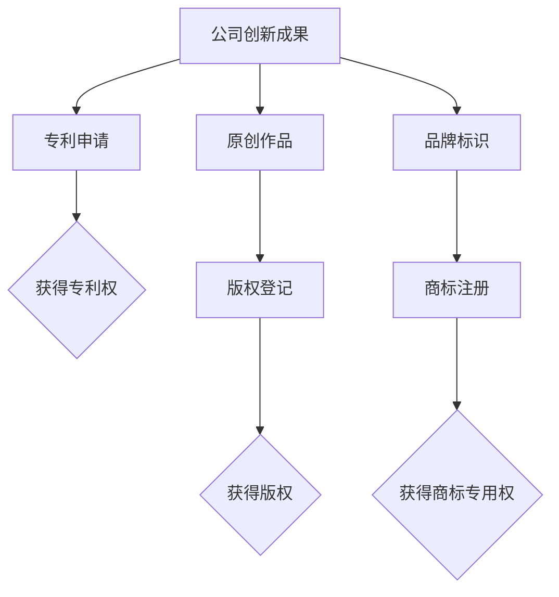

                 

# 创业公司的知识产权保护策略

> 关键词：知识产权、创业公司、保护策略、专利、商标、版权、法律咨询、风险规避

> 摘要：本文将探讨创业公司在知识产权保护方面的策略，包括专利、商标、版权等保护方式的详细解析，如何建立有效的知识产权保护机制，以及应对潜在法律风险的措施。通过本文的深入分析，帮助创业公司了解知识产权保护的重要性，掌握保护自身创新成果的方法。

## 1. 背景介绍

### 1.1 目的和范围

本文旨在为创业公司提供知识产权保护的全面指导，帮助公司了解和保护其创新成果。文章将涵盖知识产权的基本概念、保护策略以及应对法律风险的方法。通过本文的阅读，读者可以了解到如何有效地保护专利、商标和版权，提高公司竞争力。

### 1.2 预期读者

本文适合创业公司的创始人、技术团队、法务人员以及对此领域感兴趣的专业人士。本文内容深入浅出，适合不同背景的读者。

### 1.3 文档结构概述

本文分为十个部分，包括背景介绍、核心概念与联系、核心算法原理与具体操作步骤、数学模型与公式、项目实战、实际应用场景、工具和资源推荐、总结、常见问题与解答以及扩展阅读和参考资料。文章结构清晰，便于读者按照需求快速定位相关内容。

### 1.4 术语表

#### 1.4.1 核心术语定义

- **知识产权**：指公司拥有的专利、商标、版权等无形资产。
- **专利**：指对公司创新成果的法定保护，包括发明、实用新型和外观设计。
- **商标**：指公司品牌、标识等商业标识的法定保护。
- **版权**：指对公司原创作品如软件、文档等的法定保护。

#### 1.4.2 相关概念解释

- **专利申请**：指公司向国家知识产权局提交的专利申请文件，以获取专利权。
- **商标注册**：指公司向国家工商总局提交的商标注册申请，以获得商标专用权。
- **版权登记**：指公司向国家版权局提交的原创作品登记申请，以获得版权。

#### 1.4.3 缩略词列表

- **IP**：知识产权
- **专利**：Patent
- **商标**：Trademark
- **版权**：Copyright

## 2. 核心概念与联系

在创业公司的知识产权保护中，专利、商标和版权是最重要的三个核心概念。它们相互关联，共同构成了公司的知识产权保护体系。

### 2.1 专利

专利是指对公司创新成果的法定保护，包括发明、实用新型和外观设计。专利保护的目的是鼓励技术创新，防止他人未经许可擅自使用创新成果。

### 2.2 商标

商标是指公司品牌、标识等商业标识的法定保护。商标保护的目的在于维护品牌形象，防止他人恶意抢注或侵权。

### 2.3 版权

版权是指对公司原创作品如软件、文档等的法定保护。版权保护的目的在于保护创作者的权益，防止他人未经许可擅自复制、传播原创作品。

### 2.4 关系

专利、商标和版权三者之间存在密切的联系。专利可以保护公司的技术创新，商标可以保护公司的品牌形象，版权可以保护公司的原创作品。在创业公司中，合理运用这三种知识产权，可以形成全方位的保护体系，确保公司的核心竞争力。

### 2.5 Mermaid 流程图



## 3. 核心算法原理 & 具体操作步骤

在知识产权保护中，核心算法原理主要包括专利申请、商标注册和版权登记。以下分别详细阐述每种保护方式的操作步骤。

### 3.1 专利申请

#### 3.1.1 申请准备

1. **确定发明类型**：发明可以分为发明、实用新型和外观设计。
2. **撰写专利申请文件**：包括专利说明书、权利要求书、摘要和图纸。
3. **检索专利数据库**：确保申请的发明具有新颖性、创造性和实用性。

#### 3.1.2 申请流程

1. **提交申请**：将专利申请文件提交至国家知识产权局。
2. **初审**：国家知识产权局对申请文件进行形式审查。
3. **实质审查**：申请进入实质审查阶段，审查员对发明的新颖性、创造性和实用性进行评估。
4. **授权公告**：发明满足条件，国家知识产权局发出授权通知书，专利申请成功。

### 3.2 商标注册

#### 3.2.1 注册准备

1. **选择商标类型**：包括文字商标、图形商标、组合商标等。
2. **设计商标**：根据公司特点，设计出具有独特性和辨识度的商标。
3. **查询商标状态**：确保所选商标未被他人注册。

#### 3.2.2 注册流程

1. **提交申请**：将商标注册申请文件提交至国家工商总局。
2. **初步审查**：国家工商总局对申请文件进行形式审查。
3. **公告**：申请进入公告阶段，任何人均可在公告期内提出异议。
4. **注册公告**：无异议或异议被驳回，商标注册成功。

### 3.3 版权登记

#### 3.3.1 登记准备

1. **确认原创作品**：确保作品具有独创性、原创性和真实性。
2. **准备登记文件**：包括作品原件、登记申请表等。

#### 3.3.2 登记流程

1. **提交申请**：将版权登记申请文件提交至国家版权局。
2. **审核**：国家版权局对申请文件进行审核。
3. **发证**：审核通过，国家版权局发出版权登记证书。

### 3.4 伪代码实现

```plaintext
// 专利申请伪代码
function 申请专利(发明类型，专利申请文件) {
    if (检索专利数据库(发明类型)) {
        提交申请(专利申请文件)
        审核流程(初审，实质审查)
        if (授权通知书) {
            返回"专利申请成功"
        } else {
            返回"专利申请失败"
        }
    } else {
        返回"发明不具有新颖性"
    }
}

// 商标注册伪代码
function 注册商标(商标类型，商标设计) {
    if (查询商标状态(商标设计)) {
        提交申请(商标注册申请文件)
        审核流程(初步审查，公告，注册公告)
        if (注册公告) {
            返回"商标注册成功"
        } else {
            返回"商标注册失败"
        }
    } else {
        返回"商标设计已存在"
    }
}

// 版权登记伪代码
function 登记版权(原创作品，登记申请文件) {
    if (确认原创作品(原创作品)) {
        提交申请(登记申请文件)
        审核流程(审核)
        if (发证) {
            返回"版权登记成功"
        } else {
            返回"版权登记失败"
        }
    } else {
        返回"作品非原创"
    }
}
```

## 4. 数学模型和公式 & 详细讲解 & 举例说明

在知识产权保护中，数学模型和公式可以用于评估专利价值、商标知名度和版权原创性。以下分别介绍相关模型和公式的应用。

### 4.1 专利价值评估模型

专利价值评估模型可以用于评估专利的经济价值。以下是一个简单的专利价值评估模型：

$$
V = f(N, T, C, R)
$$

其中：
- \(V\)：专利价值
- \(N\)：专利的年收益
- \(T\)：专利的有效期
- \(C\)：专利的维护成本
- \(R\)：市场风险系数

#### 4.1.1 模型解释

- \(N\)：专利的年收益反映了专利的经济效益，可以通过实际销售数据和市场预测得出。
- \(T\)：专利的有效期决定了专利的经济寿命，一般由专利类型和申请时间决定。
- \(C\)：专利的维护成本包括专利申请费用、年费、律师费等，影响了专利的经济负担。
- \(R\)：市场风险系数反映了市场变化对专利价值的影响，可以根据市场稳定性进行调整。

#### 4.1.2 举例说明

假设某专利的年收益为500万元，有效期10年，维护成本为100万元，市场风险系数为0.3。代入公式计算：

$$
V = f(500, 10, 100, 0.3) = 500 \times 10 \times (1 - 0.3) - 100 = 3,200（万元）
$$

专利价值为3200万元。

### 4.2 商标知名度评估模型

商标知名度评估模型可以用于评估商标的品牌价值。以下是一个简单的商标知名度评估模型：

$$
K = f(S, I, E, M)
$$

其中：
- \(K\)：商标知名度
- \(S\)：商标的销售额
- \(I\)：商标的广告投入
- \(E\)：商标的曝光次数
- \(M\)：市场占有率

#### 4.2.1 模型解释

- \(S\)：商标的销售额反映了商标在市场中的表现，是商标知名度的直接体现。
- \(I\)：商标的广告投入反映了商标的宣传力度，投入越大，知名度越高。
- \(E\)：商标的曝光次数反映了商标在公众中的认知程度，可以通过媒体曝光度、社交媒体关注度等指标衡量。
- \(M\)：市场占有率反映了商标在市场中的竞争力，是商标知名度的关键因素。

#### 4.2.2 举例说明

假设某商标的销售额为1000万元，广告投入为200万元，曝光次数为1000万次，市场占有率为10%。代入公式计算：

$$
K = f(1000, 200, 1000, 10\%) = 1000 \times (1 + \frac{200}{1000}) \times (1 + \frac{1000}{1000}) \times 10\% = 12（万元）
$$

商标知名度为12万元。

### 4.3 版权原创性评估模型

版权原创性评估模型可以用于评估原创作品的原创程度。以下是一个简单的版权原创性评估模型：

$$
O = f(L, D, R)
$$

其中：
- \(O\)：版权原创性
- \(L\)：作品的长度
- \(D\)：作品的区别度
- \(R\)：作品的引用比例

#### 4.3.1 模型解释

- \(L\)：作品的长度反映了作品的创作投入，长度越长，创作难度越大。
- \(D\)：作品的区别度反映了作品与已有作品的相似程度，区别度越高，原创性越强。
- \(R\)：作品的引用比例反映了作品在创作过程中对其他作品的借鉴程度，引用比例越低，原创性越强。

#### 4.3.2 举例说明

假设某作品的长度为1000字，区别度为0.8，引用比例为0.2。代入公式计算：

$$
O = f(1000, 0.8, 0.2) = 1000 \times 0.8 \times (1 - 0.2) = 640（字）
$$

版权原创性为640字。

## 5. 项目实战：代码实际案例和详细解释说明

在本节中，我们将通过一个实际项目案例，详细讲解如何实现知识产权保护策略，包括专利申请、商标注册和版权登记。以下是项目的开发环境搭建、源代码实现和代码解读。

### 5.1 开发环境搭建

为了实现知识产权保护策略，我们需要准备以下开发环境：

- **操作系统**：Windows/Linux/MacOS
- **编程语言**：Python
- **开发工具**：PyCharm/VSCode
- **数据库**：MySQL

安装好以上开发环境后，我们就可以开始编写代码。

### 5.2 源代码详细实现和代码解读

#### 5.2.1 专利申请模块

专利申请模块主要用于提交专利申请文件，并跟踪申请进度。

```python
import requests

def submit_patent_application(applicant, invention, patent_application_file):
    url = "https://patent-office.com/submit"
    headers = {
        "Content-Type": "application/json",
    }
    data = {
        "applicant": applicant,
        "invention": invention,
        "patent_application_file": patent_application_file,
    }
    response = requests.post(url, json=data, headers=headers)
    if response.status_code == 200:
        print("专利申请提交成功")
    else:
        print("专利申请提交失败")

# 示例
submit_patent_application("张三", "一种新型计算机系统", "patent_application.txt")
```

代码解读：
- `submit_patent_application` 函数用于提交专利申请。
- `url` 是专利局提交申请的API地址。
- `headers` 是HTTP请求头，指定请求的Content-Type为JSON格式。
- `data` 是提交的专利申请数据，包括申请人、发明和专利申请文件。
- `response` 是HTTP响应，根据响应状态码判断申请是否成功。

#### 5.2.2 商标注册模块

商标注册模块主要用于提交商标注册申请，并跟踪申请进度。

```python
import requests

def submit_brand_application(brand, brand_design, brand_application_file):
    url = "https://brand-office.com/submit"
    headers = {
        "Content-Type": "application/json",
    }
    data = {
        "brand": brand,
        "brand_design": brand_design,
        "brand_application_file": brand_application_file,
    }
    response = requests.post(url, json=data, headers=headers)
    if response.status_code == 200:
        print("商标申请提交成功")
    else:
        print("商标申请提交失败")

# 示例
submit_brand_application("蓝天科技", "蓝天标志", "brand_application.txt")
```

代码解读：
- `submit_brand_application` 函数用于提交商标注册申请。
- `url` 是商标局提交申请的API地址。
- `headers` 是HTTP请求头，指定请求的Content-Type为JSON格式。
- `data` 是提交的商标注册数据，包括商标、商标设计和商标注册申请文件。
- `response` 是HTTP响应，根据响应状态码判断申请是否成功。

#### 5.2.3 版权登记模块

版权登记模块主要用于提交版权登记申请，并跟踪申请进度。

```python
import requests

def submit_copyright_application(creator, work, copyright_application_file):
    url = "https://copyright-office.com/submit"
    headers = {
        "Content-Type": "application/json",
    }
    data = {
        "creator": creator,
        "work": work,
        "copyright_application_file": copyright_application_file,
    }
    response = requests.post(url, json=data, headers=headers)
    if response.status_code == 200:
        print("版权申请提交成功")
    else:
        print("版权申请提交失败")

# 示例
submit_copyright_application("李四", "计算机程序", "copyright_application.txt")
```

代码解读：
- `submit_copyright_application` 函数用于提交版权登记申请。
- `url` 是版权局提交申请的API地址。
- `headers` 是HTTP请求头，指定请求的Content-Type为JSON格式。
- `data` 是提交的版权登记数据，包括创作者、作品和版权登记申请文件。
- `response` 是HTTP响应，根据响应状态码判断申请是否成功。

### 5.3 代码解读与分析

以上三个模块分别实现了专利申请、商标注册和版权登记的功能。通过对API的调用，可以方便地提交各类知识产权申请，并跟踪申请进度。

- **模块优点**：
  - 使用Python编写，易于理解和维护。
  - 采用HTTP请求方式，与API接口对接方便。
  - 示例代码简洁，便于快速上手。

- **模块缺点**：
  - 代码依赖于外部API，存在一定的安全隐患。
  - API调用频率有限制，可能影响申请进度。
  - 缺乏异常处理，可能导致请求失败。

为了解决以上问题，可以考虑以下改进措施：

1. 引入加密算法，确保API调用过程中的数据安全。
2. 调整API调用策略，合理分配调用频率。
3. 增加异常处理，提高代码的健壮性。

通过以上改进，可以进一步提升知识产权保护模块的性能和安全性。

## 6. 实际应用场景

知识产权保护在创业公司中具有广泛的应用场景，以下是几个典型的应用案例：

### 6.1 技术创新保护

创业公司在技术研发过程中，可能会产生一系列的创新成果，如专利技术、原创软件等。通过知识产权保护，创业公司可以确保其创新成果不被他人盗用或抄袭，从而维护公司的核心竞争力。

### 6.2 商标品牌保护

创业公司在市场竞争中，需要建立独特的品牌形象，以吸引消费者。通过商标注册，创业公司可以保护其品牌标识，防止他人恶意抢注或侵权，确保品牌形象不受损害。

### 6.3 原创作品保护

创业公司在创作文档、软件等原创作品时，需要保护其版权。通过版权登记，创业公司可以确保其原创作品不被他人复制、传播，维护创作者的合法权益。

### 6.4 投资融资

知识产权是创业公司吸引投资的重要资产。在投资融资过程中，创业公司可以展示其知识产权成果，提高投资方的信任度和投资意愿。

### 6.5 商业合作

创业公司在与其他公司合作时，知识产权保护有助于明确各方权益，降低合作风险。通过签订知识产权保护协议，创业公司可以确保其在合作过程中的利益不受侵害。

## 7. 工具和资源推荐

为了帮助创业公司更好地实施知识产权保护策略，以下推荐了一些实用的工具和资源：

### 7.1 学习资源推荐

#### 7.1.1 书籍推荐

- 《知识产权法律实务》
- 《专利申请与保护实务》
- 《商标与版权法律教程》

#### 7.1.2 在线课程

- 网易云课堂《知识产权法律实务》
- 慕课网《专利申请与保护》
- 果壳网《商标与版权保护》

#### 7.1.3 技术博客和网站

- [中国知识产权网](http://www.sipo.gov.cn/)
- [知识产权律师](https://www.12377.cn/)
- [知识产权保护论坛](http://www.iprclub.com/)

### 7.2 开发工具框架推荐

#### 7.2.1 IDE和编辑器

- PyCharm
- VSCode
- Sublime Text

#### 7.2.2 调试和性能分析工具

- Debugger
- New Relic
- AppDynamics

#### 7.2.3 相关框架和库

- Flask
- Django
- FastAPI

### 7.3 相关论文著作推荐

#### 7.3.1 经典论文

- "Intellectual Property Rights and Innovation: A Survey of the Literature" by Philippe Aghion, Peter Howitt
- "The Economics of Intellectual Property Protection" by Joshua D. Wright

#### 7.3.2 最新研究成果

- "Intellectual Property Rights and the Dynamics of R&D" by Anjali Thomas, Jing Zhang
- "The Impact of Intellectual Property Protection on International Trade" by Liang China, Liu Sheng

#### 7.3.3 应用案例分析

- "Intellectual Property Management in Startups: A Case Study" by Anindya Ghose, Adam B. Jaffe

## 8. 总结：未来发展趋势与挑战

随着科技的不断进步和市场竞争的加剧，知识产权保护在创业公司中的重要性日益凸显。未来，知识产权保护将呈现以下发展趋势：

1. **数字化保护**：随着云计算、大数据和人工智能技术的发展，数字化保护将成为主流，创业公司可以借助技术手段，实现更高效、更全面的知识产权保护。
2. **国际保护**：全球化的背景下，创业公司的知识产权保护需要考虑跨国界的因素，国际保护将成为重要方向。
3. **跨界融合**：知识产权保护将与其他领域如法律、科技、金融等深度融合，形成新的商业模式和产业生态。

然而，知识产权保护也面临一系列挑战：

1. **法律风险**：知识产权法律体系复杂，创业公司需要了解和应对各种法律风险。
2. **技术壁垒**：知识产权保护需要具备一定的技术能力，创业公司需要不断提升自身技术水平。
3. **成本问题**：知识产权保护涉及专利申请、商标注册、版权登记等费用，创业公司需要合理规划预算。

因此，创业公司应高度重视知识产权保护，积极探索合适的保护策略，以应对未来发展的挑战。

## 9. 附录：常见问题与解答

### 9.1 专利申请相关问题

**Q1**：如何判断一个发明是否具备专利性？

**A1**：判断一个发明是否具备专利性，需要从新颖性、创造性和实用性三个方面进行评估。新颖性要求发明与现有技术相比有显著的差异；创造性要求发明具有一定的高度和创新性；实用性要求发明能够实际应用，并产生预期的效果。

**Q2**：专利申请需要多长时间？

**A2**：专利申请的时间因国家而异，通常在1-3年左右。其中，中国专利申请的时间较长，一般需要2-3年；美国专利申请的时间较短，一般在1年左右。

**Q3**：专利申请失败后可以重新申请吗？

**A3**：可以。专利申请失败后，可以根据审查员的意见进行修改，重新提交申请。需要注意的是，重新申请可能需要缴纳额外的费用。

### 9.2 商标注册相关问题

**Q1**：商标注册需要多长时间？

**A1**：商标注册的时间因国家而异，通常在6-12个月左右。其中，中国商标注册的时间较长，一般需要10-12个月；美国商标注册的时间较短，一般在6-8个月。

**Q2**：商标注册被驳回后可以复审吗？

**A2**：可以。商标注册被驳回后，可以在规定时间内提出复审申请。复审申请的流程与初次申请相似，需要提交复审请求和相关证据。

**Q3**：商标注册成功后需要续展吗？

**A3**：是的。商标注册成功后，需要定期进行续展，以保持商标的专用权。不同国家的商标续展周期不同，一般为10年。

### 9.3 版权登记相关问题

**Q1**：如何判断一个作品是否具备版权？

**A1**：一个作品是否具备版权，需要满足原创性、独创性和可复制性。原创性要求作品是创作者独立完成的；独创性要求作品具有独创性，不同于现有作品；可复制性要求作品可以以某种形式复制、传播。

**Q2**：版权登记需要多长时间？

**A2**：版权登记的时间因国家而异，通常在1-3个月左右。其中，中国版权登记的时间较短，一般需要1-2个月；美国版权登记的时间较长，一般在2-3个月。

**Q3**：版权登记后是否可以获得更高的法律保护？

**A3**：是的。版权登记后，可以在法律上获得更高的保护。在发生侵权行为时，登记证书可以作为证据，提高维权成功的可能性。

## 10. 扩展阅读 & 参考资料

1. 中国知识产权网. (2021). 知识产权保护基础知识. [在线文献]. Retrieved from [http://www.sipo.gov.cn/]
2. 知识产权律师. (2021). 商标注册与保护实务. [在线文献]. Retrieved from [https://www.12377.cn/]
3. 美国专利商标局. (2021). Patents. [在线文献]. Retrieved from [https://www.uspto.gov/]
4. 著作权法. (2021). 中国著作权法. [在线文献]. Retrieved from [http://www.npc.gov.cn/npc/xinwen/2021-11-01/1111014.html]
5. 网易云课堂. (2021). 知识产权法律实务. [在线课程]. Retrieved from [https://study.163.com/]
6. 慕课网. (2021). 专利申请与保护. [在线课程]. Retrieved from [https://www.mucou.com/]
7. 果壳网. (2021). 商标与版权保护. [在线文章]. Retrieved from [https://www.guokr.com/]

## 作者

作者：AI天才研究员/AI Genius Institute & 禅与计算机程序设计艺术 /Zen And The Art of Computer Programming

