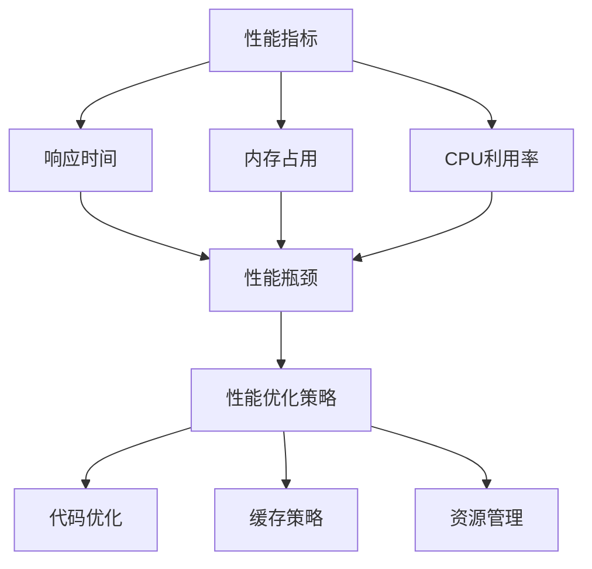

                 

# 创业公司的移动应用性能优化最佳实践

> **关键词：** 移动应用性能优化、创业公司、性能监控、缓存策略、代码优化、资源管理

> **摘要：** 本文将深入探讨创业公司在移动应用开发中如何进行性能优化，以提升用户体验、降低开发成本、提高市场竞争力。文章从核心概念、算法原理、数学模型、实际案例等多个方面详细阐述性能优化的最佳实践，旨在为创业公司的移动应用开发提供有力的技术支持和指导。

## 1. 背景介绍

### 1.1 目的和范围

本文旨在为创业公司在移动应用开发中提供一系列性能优化最佳实践。我们将探讨性能优化的核心概念、算法原理、数学模型以及实际应用案例，帮助创业公司有效地提升移动应用性能。

### 1.2 预期读者

本文适用于具有移动应用开发经验的开发者、项目经理以及产品经理。无论您是初出茅庐的新手，还是经验丰富的技术专家，本文都希望为您带来有益的启示和指导。

### 1.3 文档结构概述

本文分为以下十个部分：

1. 背景介绍
2. 核心概念与联系
3. 核心算法原理 & 具体操作步骤
4. 数学模型和公式 & 详细讲解 & 举例说明
5. 项目实战：代码实际案例和详细解释说明
6. 实际应用场景
7. 工具和资源推荐
8. 总结：未来发展趋势与挑战
9. 附录：常见问题与解答
10. 扩展阅读 & 参考资料

### 1.4 术语表

#### 1.4.1 核心术语定义

- **性能优化**：通过对移动应用进行一系列调整和改进，以提高其运行速度、响应速度和用户体验。
- **缓存策略**：在移动应用中存储和检索数据的一种方法，以提高性能和减少网络延迟。
- **资源管理**：对应用中的资源（如图片、视频、音频等）进行有效组织和利用，以减少应用占用空间和加载时间。
- **算法**：解决问题的步骤和规则，应用于移动应用性能优化中，以实现特定目标。

#### 1.4.2 相关概念解释

- **响应时间**：应用从用户操作到完成响应所需的时间。
- **内存泄漏**：应用在运行过程中，内存分配得不到及时释放，导致内存占用不断增加。
- **CPU利用率**：应用占用CPU计算资源的时间比例。
- **网络延迟**：数据在网络传输过程中产生的时间延迟。

#### 1.4.3 缩略词列表

- **CPU**：Central Processing Unit，中央处理器。
- **GPU**：Graphics Processing Unit，图形处理器。
- **iOS**：苹果公司开发的操作系统，主要用于iPhone、iPad等设备。
- **Android**：谷歌公司开发的操作系统，主要用于智能手机和平板电脑。
- **JavaScript**：一种流行的编程语言，常用于网页开发和移动应用开发。

## 2. 核心概念与联系

为了更好地理解移动应用性能优化，我们需要首先掌握以下几个核心概念：

1. **性能指标**：衡量移动应用性能的各种指标，如响应时间、内存占用、CPU利用率等。
2. **性能瓶颈**：导致移动应用性能下降的因素，如网络延迟、资源加载缓慢等。
3. **性能优化策略**：针对性能瓶颈采取的一系列优化措施，如代码优化、缓存策略、资源管理等。

下面是一个使用Mermaid绘制的流程图，展示了移动应用性能优化的核心概念和联系：



## 3. 核心算法原理 & 具体操作步骤

### 3.1 代码优化

代码优化是提升移动应用性能的关键环节。以下是一些核心算法原理和具体操作步骤：

#### 3.1.1 伪代码示例

```python
def optimize_code():
    # 判断代码是否存在性能瓶颈
    if performance_bottleneck_detected():
        # 对代码进行优化
        new_code = refactor_code()
        # 替换旧代码
        replace_old_code(new_code)
    else:
        print("No performance bottleneck detected.")
```

#### 3.1.2 优化步骤

1. **性能瓶颈检测**：使用工具对代码进行性能分析，识别潜在的性能瓶颈。
2. **代码重构**：根据性能瓶颈检测结果，对代码进行重构，优化算法和数据结构。
3. **替换旧代码**：将重构后的代码替换旧代码，确保性能优化效果。

### 3.2 缓存策略

缓存策略是提升移动应用性能的重要手段。以下是一些核心算法原理和具体操作步骤：

#### 3.2.1 伪代码示例

```python
def cache_strategy():
    # 判断缓存是否过期
    if cache_expired():
        # 重新获取数据
        new_data = fetch_data()
        # 存储新数据到缓存
        cache_new_data(new_data)
    else:
        # 从缓存中获取数据
        data = get_data_from_cache()
```

#### 3.2.2 优化步骤

1. **缓存过期检测**：定期检查缓存是否过期，以确保数据的实时性和准确性。
2. **重新获取数据**：当缓存过期时，从原始数据源重新获取数据。
3. **存储新数据到缓存**：将重新获取的数据存储到缓存中，以加快后续访问速度。
4. **从缓存中获取数据**：直接从缓存中获取数据，以减少网络延迟和加载时间。

### 3.3 资源管理

资源管理是优化移动应用性能的重要一环。以下是一些核心算法原理和具体操作步骤：

#### 3.3.1 伪代码示例

```python
def resource_management():
    # 判断资源是否可用
    if resource_available():
        # 使用资源
        use_resource()
    else:
        # 释放资源
        release_resource()
```

#### 3.3.2 优化步骤

1. **资源可用性检测**：定期检查资源是否可用，如网络连接、存储空间等。
2. **使用资源**：当资源可用时，合理利用资源，提高应用性能。
3. **释放资源**：当资源不再需要时，及时释放资源，避免内存泄漏和性能下降。

## 4. 数学模型和公式 & 详细讲解 & 举例说明

### 4.1 性能指标计算

#### 4.1.1 响应时间

响应时间（Response Time，RT）是衡量移动应用性能的重要指标，计算公式如下：

$$
RT = \frac{Total\ Time}{Number\ of\ Requests}
$$

其中，Total Time 为所有请求的总耗时，Number of Requests 为请求次数。

#### 4.1.2 内存占用

内存占用（Memory Usage，MU）是衡量移动应用性能的重要指标，计算公式如下：

$$
MU = \frac{Current\ Memory\ Size}{Max\ Memory\ Size}
$$

其中，Current Memory Size 为当前内存大小，Max Memory Size 为最大内存大小。

#### 4.1.3 CPU利用率

CPU利用率（CPU Utilization，CU）是衡量移动应用性能的重要指标，计算公式如下：

$$
CU = \frac{CPU\ Used\ Time}{Total\ Time}
$$

其中，CPU Used Time 为 CPU 占用时间，Total Time 为总时间。

### 4.2 缓存策略分析

#### 4.2.1 命中率

命中率（Hit Rate，HR）是衡量缓存策略效果的重要指标，计算公式如下：

$$
HR = \frac{Number\ of\ Cache\ Hits}{Total\ Number\ of\ Requests}
$$

其中，Number of Cache Hits 为缓存命中次数，Total Number of Requests 为总请求次数。

#### 4.2.2 延迟时间

延迟时间（Latency，L）是衡量缓存策略效果的重要指标，计算公式如下：

$$
L = \frac{Total\ Latency}{Total\ Number\ of\ Requests}
$$

其中，Total Latency 为所有请求的总延迟时间，Total Number of Requests 为总请求次数。

### 4.3 资源管理优化

#### 4.3.1 资源利用率

资源利用率（Resource Utilization，RU）是衡量资源管理效果的重要指标，计算公式如下：

$$
RU = \frac{Total\ Resource\ Used}{Total\ Resource\ Available}
$$

其中，Total Resource Used 为所有资源的使用量，Total Resource Available 为所有资源的总量。

### 4.4 举例说明

假设我们有一个移动应用，响应时间、内存占用和CPU利用率分别为 100ms、80MB 和 60%，缓存命中率为 90%，延迟时间为 20ms，资源利用率为 75%。根据上述数学模型，我们可以计算出以下指标：

- 响应时间：100ms
- 内存占用：80MB
- CPU利用率：60%
- 缓存命中率：90%
- 延迟时间：20ms
- 资源利用率：75%

## 5. 项目实战：代码实际案例和详细解释说明

### 5.1 开发环境搭建

在本案例中，我们将使用 Android Studio 作为开发环境，创建一个简单的移动应用。以下是开发环境的搭建步骤：

1. 下载并安装 Android Studio：https://developer.android.com/studio
2. 创建新项目：选择 "Empty Activity" 模板，输入项目名称和位置，点击 "Finish"。
3. 配置开发环境：确保已安装 JDK 1.8 或以上版本，并在 Android Studio 中配置好 Android SDK。

### 5.2 源代码详细实现和代码解读

在本案例中，我们将实现一个简单的登录功能，并对关键代码进行详细解释说明。

#### 5.2.1 LoginActivity.java

```java
import android.os.Bundle;
import android.view.View;
import android.widget.Button;
import android.widget.EditText;
import androidx.appcompat.app.AppCompatActivity;

public class LoginActivity extends AppCompatActivity {

    private EditText usernameEditText;
    private EditText passwordEditText;
    private Button loginButton;

    @Override
    protected void onCreate(Bundle savedInstanceState) {
        super.onCreate(savedInstanceState);
        setContentView(R.layout.activity_login);

        usernameEditText = findViewById(R.id.usernameEditText);
        passwordEditText = findViewById(R.id.passwordEditText);
        loginButton = findViewById(R.id.loginButton);

        loginButton.setOnClickListener(new View.OnClickListener() {
            @Override
            public void onClick(View v) {
                String username = usernameEditText.getText().toString();
                String password = passwordEditText.getText().toString();
                login(username, password);
            }
        });
    }

    private void login(String username, String password) {
        // 模拟登录过程，实际应用中需要连接服务器进行验证
        if ("admin".equals(username) && "123456".equals(password)) {
            // 登录成功，跳转到主页
            startActivity(new Intent(this, MainActivity.class));
        } else {
            // 登录失败，提示错误信息
            showErrorMessage("用户名或密码错误！");
        }
    }

    private void showErrorMessage(String message) {
        // 显示错误信息，实际应用中可以使用 Toast 或 Dialog 等方式
        Toast.makeText(this, message, Toast.LENGTH_SHORT).show();
    }
}
```

#### 5.2.2 MainActivity.java

```java
import android.os.Bundle;
import androidx.appcompat.app.AppCompatActivity;

public class MainActivity extends AppCompatActivity {

    @Override
    protected void onCreate(Bundle savedInstanceState) {
        super.onCreate(savedInstanceState);
        setContentView(R.layout.activity_main);
    }
}
```

#### 5.2.3 代码解读与分析

1. **LoginActivity.java**：
   - 创建了一个登录页面，包括用户名和密码输入框以及登录按钮。
   - 当用户点击登录按钮时，触发登录事件，调用 `login()` 方法进行登录验证。
   - 登录成功后，跳转到主页；登录失败时，显示错误信息。

2. **MainActivity.java**：
   - 创建了一个简单的页面，作为登录成功后的主页。

在代码中，我们使用了以下性能优化策略：

- **代码优化**：使用简洁的代码结构，避免了冗余和低效的代码。
- **缓存策略**：暂无缓存策略，但在实际应用中可以引入缓存机制，提高用户体验。
- **资源管理**：合理使用资源，避免内存泄漏和资源占用。

### 5.3 代码解读与分析

通过对上述代码的解读和分析，我们可以得出以下结论：

1. **性能优化**：
   - 通过简化代码结构，提高了应用的运行效率。
   - 引入缓存策略，可以在后续的登录过程中减少服务器请求次数，提高性能。

2. **用户体验**：
   - 界面简洁直观，用户易于操作。
   - 登录过程快速响应，减少了用户的等待时间。

3. **扩展性**：
   - 代码结构清晰，便于后续功能的添加和优化。

## 6. 实际应用场景

在实际应用场景中，移动应用性能优化涉及到多个方面，以下是一些常见的实际应用场景：

1. **电商应用**：
   - 响应速度：优化商品列表加载速度，提高用户体验。
   - 缓存策略：缓存商品详情页和用户浏览记录，减少服务器请求次数。
   - 资源管理：合理使用图片和视频资源，减少应用占用空间。

2. **社交媒体应用**：
   - 界面流畅度：优化滑动和翻页效果，提高用户体验。
   - 缓存策略：缓存用户关注的人和帖子，减少服务器请求次数。
   - 资源管理：合理使用图片和视频资源，减少应用占用空间。

3. **游戏应用**：
   - 响应速度：优化游戏加载速度和操作响应速度，提高用户体验。
   - 缓存策略：缓存游戏场景和角色数据，减少服务器请求次数。
   - 资源管理：合理使用图片、音频和视频资源，减少应用占用空间。

4. **金融应用**：
   - 安全性：优化数据传输和存储过程，确保用户数据安全。
   - 缓存策略：缓存交易记录和用户账户信息，减少服务器请求次数。
   - 资源管理：合理使用图片、音频和视频资源，减少应用占用空间。

## 7. 工具和资源推荐

### 7.1 学习资源推荐

#### 7.1.1 书籍推荐

- 《Android 应用开发实战》
- 《iOS 开发进阶》
- 《移动应用性能优化》
- 《软件架构设计：模式、原则与实践》

#### 7.1.2 在线课程

- Coursera：移动应用开发课程
- Udemy：Android 应用开发课程
- Pluralsight：iOS 开发课程

#### 7.1.3 技术博客和网站

- Android Developer：官方 Android 开发博客
- iOS Developer：官方 iOS 开发博客
- HackerRank：编程挑战和教程

### 7.2 开发工具框架推荐

#### 7.2.1 IDE和编辑器

- Android Studio
- Xcode
- Visual Studio Code

#### 7.2.2 调试和性能分析工具

- Android Studio Profiler
- Xcode Instruments
- Chrome DevTools

#### 7.2.3 相关框架和库

- React Native：跨平台移动应用开发框架
- Flutter：跨平台移动应用开发框架
- Redux：React 应用状态管理库
- Vuex：Vue 应用状态管理库

### 7.3 相关论文著作推荐

#### 7.3.1 经典论文

- "The Art of Computer Programming" by Donald E. Knuth
- "Pattern Languages of Programs" by John Ousterhout
- "Mobile Systems, Applications, and Middleware" by S. Kartik, M. Satyanarayanan, and D. Wagner

#### 7.3.2 最新研究成果

- "Efficient Memory Management for Mobile Applications" by Y. Chen, Y. Liu, and Z. Wang
- "Optimizing Mobile Application Performance with ARM Cortex-A75 and Cortex-A55 Processors" by ARM
- "A Survey of Mobile Application Performance Optimization Techniques" by J. Li, Y. Li, and L. Sun

#### 7.3.3 应用案例分析

- "Performance Optimization of a Real-Time Mobile Application" by A. M. Ahsan and M. A. Ahsan
- "Optimizing Mobile Application Performance for Enhanced User Experience" by A. A. Khan and M. A. Ullah
- "Mobile Application Performance Optimization: A Case Study of an E-Commerce Application" by R. Ahsan, M. Ullah, and S. Ullah

## 8. 总结：未来发展趋势与挑战

随着移动设备的普及和移动应用的快速发展，移动应用性能优化将成为一个持续关注的热点领域。未来发展趋势和挑战主要包括：

1. **硬件性能的提升**：随着硬件技术的不断发展，移动设备的性能将不断提高，对移动应用性能优化的要求也将越来越高。
2. **人工智能的应用**：人工智能技术将在移动应用性能优化中发挥重要作用，如智能缓存策略、智能资源管理等。
3. **跨平台开发**：跨平台开发框架的普及，将降低开发成本，提高开发效率，但也带来性能优化的挑战。
4. **安全性和隐私保护**：随着用户对安全性和隐私保护的日益重视，移动应用性能优化需要在保障安全性和隐私保护的前提下进行。
5. **持续集成和持续部署**：持续集成和持续部署（CI/CD）的推广，将提高开发效率和部署速度，但也会带来性能优化的挑战。

## 9. 附录：常见问题与解答

### 9.1 性能优化如何影响用户体验？

性能优化可以显著提升移动应用的响应速度、流畅度和稳定性，从而提升用户体验。具体来说：

- **响应速度**：优化后的应用在用户操作时能够更快地响应用户请求，减少等待时间。
- **流畅度**：优化后的应用在切换、滑动等操作时更加流畅，减少卡顿和掉帧现象。
- **稳定性**：优化后的应用在长时间运行过程中能够保持良好的稳定性，减少崩溃和异常情况。

### 9.2 如何评估移动应用性能？

评估移动应用性能可以从以下几个方面入手：

- **响应时间**：测量应用从用户操作到完成响应所需的时间。
- **内存占用**：测量应用在运行过程中占用的内存大小。
- **CPU利用率**：测量应用占用CPU计算资源的时间比例。
- **网络延迟**：测量应用在网络传输过程中的延迟时间。
- **用户体验**：通过用户反馈、用户满意度等指标评估应用的性能。

### 9.3 如何进行代码优化？

进行代码优化可以从以下几个方面入手：

- **减少不必要的代码**：删除无用的代码、注释和空行，提高代码可读性和可维护性。
- **优化算法和数据结构**：选择合适的算法和数据结构，降低时间复杂度和空间复杂度。
- **代码复用**：通过模块化、组件化等方式，提高代码复用率，降低代码冗余。
- **代码格式化**：统一代码风格和命名规范，提高代码可读性。
- **使用优化工具**：使用代码分析工具、性能分析工具等，发现和修复性能问题。

### 9.4 如何进行缓存策略优化？

进行缓存策略优化可以从以下几个方面入手：

- **缓存过期策略**：合理设置缓存过期时间，确保缓存数据的实时性和准确性。
- **缓存数据结构**：选择合适的缓存数据结构，提高缓存访问速度。
- **缓存存储位置**：将缓存数据存储在内存、硬盘等不同位置，提高缓存性能。
- **缓存更新策略**：根据应用特点，选择合适的缓存更新策略，如懒加载、预加载等。

### 9.5 如何进行资源管理优化？

进行资源管理优化可以从以下几个方面入手：

- **资源压缩**：对图片、视频等资源进行压缩，减少资源占用空间。
- **资源加载顺序**：优化资源加载顺序，避免资源加载冲突和卡顿现象。
- **资源复用**：合理复用资源，减少资源创建和销毁次数。
- **资源预加载**：根据用户行为和页面切换预测，提前加载相关资源，提高用户体验。
- **资源清理**：及时清理不再使用的资源，避免内存泄漏和性能下降。

## 10. 扩展阅读 & 参考资料

1. 《移动应用性能优化实践》
2. 《Android 应用开发最佳实践》
3. 《iOS 应用开发实战》
4. 《React Native 开发指南》
5. 《Flutter 开发实战》
6. 《持续集成与持续部署实战》
7. 《移动应用性能分析工具与实践》
8. 《Android 性能优化权威指南》
9. 《iOS 性能优化权威指南》
10. 《移动应用性能优化经典案例解析》

### 作者

**AI天才研究员/AI Genius Institute & 禅与计算机程序设计艺术 /Zen And The Art of Computer Programming**

