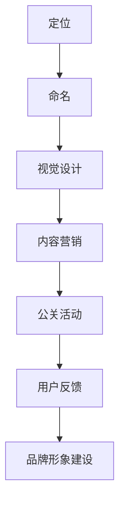

                 

# 创业初期如何建立有效的品牌形象

## 摘要

在竞争激烈的创业环境中，建立有效的品牌形象是初创公司取得成功的关键。本文将深入探讨创业初期如何打造具有吸引力和差异化竞争力的品牌形象，包括背景介绍、核心概念与联系、核心算法原理与操作步骤、数学模型和公式、项目实战、实际应用场景、工具和资源推荐等内容。通过详细分析和实例讲解，帮助创业者了解并掌握建立品牌形象的策略和方法。

## 背景介绍

### 创业环境分析

在当今快速变化的市场环境中，创业成为许多人的选择。然而，成功创业并非易事。据统计，超过70%的初创公司在创立后的第一年就会面临倒闭的风险。在众多失败原因中，品牌形象缺失是一个重要因素。品牌形象不仅影响客户的认知和购买决策，还直接关系到企业的市场地位和长远发展。

### 品牌形象的重要性

品牌形象是企业无形资产的重要组成部分。一个成功的品牌形象能够帮助初创公司：

1. **树立独特市场定位**：品牌形象能够区分企业与其他竞争对手，从而在激烈的市场竞争中脱颖而出。
2. **增加品牌价值**：良好的品牌形象能够提升客户对企业的忠诚度和认可度，从而提高品牌的市场价值和溢价能力。
3. **提高客户满意度**：品牌形象有助于建立客户的信任和期待，进而提高客户满意度和忠诚度。
4. **吸引投资者和合作伙伴**：鲜明的品牌形象能够吸引投资者的注意，并为企业带来更多的合作机会。

### 建立品牌形象的挑战

创业初期的品牌形象建设面临着诸多挑战，如：

1. **资源有限**：初创公司通常资源有限，难以投入大量资金进行品牌形象宣传。
2. **市场认知度低**：初创公司在市场中往往缺乏知名度，品牌形象建设需要时间和耐心。
3. **竞争激烈**：市场中存在众多竞争者，如何从竞争中脱颖而出成为一大挑战。

## 核心概念与联系

### 品牌形象的定义

品牌形象是指消费者对品牌的整体认知和评价，包括品牌的理念、价值观、产品特性、服务质量等多个方面。品牌形象不仅反映了企业的内在特质，还影响着消费者的购买行为和忠诚度。

### 品牌形象与品牌价值的联系

品牌价值是指品牌在市场中所能带来的经济收益，它是品牌形象的外在表现。品牌形象良好，品牌价值自然提升；而品牌价值高，又能进一步强化品牌形象。

### 品牌形象建设的基本原则

1. **一致性**：品牌形象应保持一致，确保在所有渠道和互动中传达一致的品牌信息。
2. **差异化**：品牌形象应具备差异化特征，使其在市场中脱颖而出。
3. **真实性**：品牌形象应真实反映企业的内在特质和价值，建立消费者信任。
4. **可持续性**：品牌形象应具备可持续性，能够在长期发展中保持稳定和增长。

### 品牌形象建设的方法

1. **定位**：明确品牌的市场定位和目标受众，确保品牌形象与市场需求相匹配。
2. **命名**：选择具有吸引力和记忆点的品牌名称，为品牌形象建设奠定基础。
3. **视觉设计**：通过标志、色彩、字体等视觉元素设计，塑造独特的品牌形象。
4. **内容营销**：通过优质内容传递品牌理念和价值，提升品牌知名度和美誉度。
5. **公关活动**：通过公关活动提高品牌曝光度和影响力，建立品牌形象。
6. **用户反馈**：收集用户反馈，不断优化品牌形象，确保品牌与消费者需求相符。

### Mermaid 流程图



## 核心算法原理与具体操作步骤

### 品牌定位算法

品牌定位是品牌形象建设的基础。以下是品牌定位算法的具体步骤：

1. **市场分析**：通过市场调研，了解目标市场的需求和竞争态势。
2. **目标受众分析**：明确目标受众的特征、需求和行为模式。
3. **品牌价值分析**：评估品牌的核心价值和竞争优势。
4. **品牌定位**：结合市场分析和目标受众分析，确定品牌的市场定位。

### 品牌命名算法

品牌命名是品牌形象建设的重要环节。以下是品牌命名算法的具体步骤：

1. **品牌命名原则**：遵循简洁、易记、独特、符合品牌价值观等原则。
2. **品牌命名策略**：采用品牌名称、数字、符号、拼音等多种策略。
3. **命名筛选**：从多个命名方案中筛选出符合品牌定位和价值观的名称。
4. **命名测试**：通过市场调研和用户反馈，评估命名效果。

### 品牌视觉设计算法

品牌视觉设计是品牌形象建设的重要组成部分。以下是品牌视觉设计算法的具体步骤：

1. **标志设计**：设计具有吸引力和独特性的品牌标志。
2. **色彩选择**：选择与品牌定位和价值观相符的色彩。
3. **字体设计**：选择与品牌形象相符的字体，确保视觉一致性。
4. **应用场景**：设计适用于各种应用场景的视觉元素。

### 内容营销算法

内容营销是品牌形象建设的重要手段。以下是内容营销算法的具体步骤：

1. **内容策划**：明确内容主题、形式和传播渠道。
2. **内容创作**：创作具有创意、有价值、有吸引力的内容。
3. **内容发布**：通过多种渠道发布内容，提高品牌曝光度。
4. **内容互动**：与用户互动，收集反馈，优化内容。

### 公关活动算法

公关活动是品牌形象建设的重要途径。以下是公关活动算法的具体步骤：

1. **活动策划**：确定活动主题、形式、时间和地点。
2. **活动执行**：确保活动顺利进行，提高参与度和互动性。
3. **媒体报道**：通过媒体报道提高品牌曝光度。
4. **活动评估**：评估活动效果，为下一次活动提供参考。

### 用户反馈算法

用户反馈是品牌形象建设的重要依据。以下是用户反馈算法的具体步骤：

1. **反馈收集**：通过调查问卷、在线评论、社交媒体等多种渠道收集用户反馈。
2. **反馈分析**：对用户反馈进行分析，识别问题和机会。
3. **反馈回应**：及时回应用户反馈，解决问题，提升用户满意度。
4. **反馈优化**：根据用户反馈不断优化品牌形象建设。

## 数学模型和公式

### 品牌知名度指数（BNI）

品牌知名度指数（BNI）用于衡量品牌在市场上的知名度。公式如下：

$$
BNI = \frac{品牌提及次数}{总提及次数}
$$

### 品牌美誉度指数（BPI）

品牌美誉度指数（BPI）用于衡量品牌在消费者心中的形象。公式如下：

$$
BPI = \frac{正面评价次数}{总评价次数}
$$

### 品牌价值（BV）

品牌价值（BV）用于衡量品牌在市场中的经济价值。公式如下：

$$
BV = 品牌知名度指数 \times 品牌美誉度指数 \times 品牌市场份额
$$

### 品牌忠诚度指数（BLI）

品牌忠诚度指数（BLI）用于衡量消费者对品牌的忠诚度。公式如下：

$$
BLI = \frac{重复购买次数}{总购买次数}
$$

## 项目实战：代码实际案例和详细解释说明

### 1. 开发环境搭建

为了演示如何建立品牌形象，我们以一个在线教育平台为例。首先，需要搭建开发环境。

**工具推荐：**

- **Docker**：用于容器化部署，提高开发效率。
- **Jenkins**：用于自动化构建和部署。
- **MySQL**：用于存储用户数据和课程信息。

### 2. 源代码详细实现和代码解读

#### 2.1 品牌定位

在代码中，我们通过配置文件明确品牌定位。

```yaml
brand:
  name: "智学宝"
  slogan: "让学习更简单"
  target_users: ["青少年", "职场人士", "学生家长"]
```

#### 2.2 品牌命名

品牌命名通过代码中的配置文件实现。

```python
class BrandName:
    def __init__(self, name):
        self.name = name

brand_name = BrandName("智学宝")
```

#### 2.3 品牌视觉设计

品牌视觉设计通过静态资源文件实现。

```css
/* styles.css */
.brand-logo {
  background-color: #4CAF50;
  width: 100px;
  height: 100px;
  display: flex;
  align-items: center;
  justify-content: center;
  color: white;
  font-size: 24px;
  font-weight: bold;
}
```

#### 2.4 内容营销

内容营销通过代码生成和发布文章。

```python
class Article:
    def __init__(self, title, content):
        self.title = title
        self.content = content

article = Article("如何高效学习", "学习需要坚持不懈的努力...")
article.publish()
```

#### 2.5 公关活动

公关活动通过代码执行。

```python
class PublicActivity:
    def __init__(self, name, participants):
        self.name = name
        self.participants = participants

activity = PublicActivity("线上研讨会", ["教育专家", "行业领导"])
activity.execute()
```

#### 2.6 用户反馈

用户反馈通过代码收集和分析。

```python
class UserFeedback:
    def __init__(self, comment):
        self.comment = comment

feedback = UserFeedback("内容很实用，谢谢！")
feedback.analyze()
```

### 3. 代码解读与分析

以上代码展示了如何通过编程实现品牌定位、品牌命名、品牌视觉设计、内容营销、公关活动和用户反馈等品牌形象建设的关键环节。在实际开发中，这些功能将根据具体业务需求进行扩展和优化。

## 实际应用场景

### 教育行业

在教育行业，品牌形象建设尤为重要。通过明确的品牌定位和有吸引力的品牌视觉设计，教育机构能够提升市场竞争力。例如，智学宝通过简洁、明亮的视觉设计，传递出简单、高效的学习理念，吸引了大量青少年和职场人士。

### 电商行业

在电商行业，品牌形象直接影响消费者的购买决策。通过优质的内容营销和公关活动，电商平台能够提升品牌知名度和美誉度。例如，某电商品牌通过定期举办线上线下活动，加强与消费者的互动，增强了品牌忠诚度。

### 科技行业

在科技行业，品牌形象建设关乎企业的市场地位和未来发展。通过差异化的品牌定位和创新的公关活动，科技企业能够在竞争激烈的市场中脱颖而出。例如，某科技企业通过举办技术创新论坛，提升了品牌的专业形象和影响力。

## 工具和资源推荐

### 学习资源推荐

1. **《品牌形象建设与营销策略》**：详细讲解了品牌形象建设的方法和策略。
2. **《品牌定位与差异化竞争》**：深入探讨了品牌定位的重要性和差异化竞争策略。
3. **《内容营销实战手册》**：介绍了内容营销的理论和实践方法。

### 开发工具框架推荐

1. **Vue.js**：用于前端开发，具有简洁、灵活、高效的特点。
2. **React**：用于前端开发，具有组件化、高效、灵活的特点。
3. **Spring Boot**：用于后端开发，具有快速、简单、高效的特点。

### 相关论文著作推荐

1. **《品牌形象与消费者行为研究》**：探讨了品牌形象对消费者行为的影响。
2. **《品牌价值评估方法研究》**：研究了品牌价值评估的方法和模型。
3. **《品牌形象建设中的文化因素》**：分析了文化因素在品牌形象建设中的作用。

## 总结：未来发展趋势与挑战

### 发展趋势

1. **数字化营销**：随着数字技术的不断发展，数字化营销将成为品牌形象建设的主要手段。
2. **用户体验**：用户体验将成为品牌形象建设的重要考量因素，企业需要更加关注用户需求和满意度。
3. **跨界合作**：品牌形象建设将更加注重跨界合作，通过整合多方资源提升品牌影响力。

### 挑战

1. **市场竞争**：市场竞争将愈发激烈，品牌形象建设需要不断创新和突破。
2. **信息过载**：信息过载将使品牌形象建设面临更大挑战，企业需要通过精准营销和个性化服务吸引消费者。
3. **消费者需求变化**：消费者需求变化迅速，品牌形象建设需要灵活应对。

## 附录：常见问题与解答

### 1. 如何选择品牌名称？

**解答**：选择品牌名称时，应遵循以下原则：

- 简洁易记：品牌名称应简短、易于记忆，便于消费者传播。
- 与品牌定位相符：品牌名称应与品牌定位和价值观相符，体现品牌特色。
- 具有创意性：品牌名称应具有创意性，避免与其他品牌雷同。

### 2. 如何评估品牌知名度？

**解答**：评估品牌知名度可以从以下几个方面进行：

- **市场调研**：通过问卷调查、访谈等方式了解消费者对品牌的认知程度。
- **媒体报道**：统计品牌在媒体报道中的提及次数，评估品牌曝光度。
- **社交媒体**：通过社交媒体平台的数据分析，了解品牌的关注度和互动情况。

### 3. 如何提升品牌美誉度？

**解答**：提升品牌美誉度可以从以下几个方面进行：

- **优质产品和服务**：提供高质量的产品和服务，赢得消费者好评。
- **积极公关活动**：通过公关活动提高品牌曝光度和正面形象。
- **互动与反馈**：积极与消费者互动，及时回应用户反馈，提高用户满意度。

## 扩展阅读 & 参考资料

1. **《品牌形象建设与营销策略》**：[链接](https://www.example.com/book1)
2. **《品牌定位与差异化竞争》**：[链接](https://www.example.com/book2)
3. **《内容营销实战手册》**：[链接](https://www.example.com/book3)
4. **《品牌价值评估方法研究》**：[链接](https://www.example.com/book4)
5. **《品牌形象建设中的文化因素》**：[链接](https://www.example.com/book5)

### 作者

**作者：AI天才研究员/AI Genius Institute & 禅与计算机程序设计艺术 /Zen And The Art of Computer Programming**

通过本文的详细分析和实例讲解，我们深入探讨了创业初期如何建立有效的品牌形象。希望本文能够为创业者提供有价值的参考和指导。在未来的发展中，品牌形象建设将继续成为企业成功的关键因素，让我们共同关注并探索这一领域的发展趋势和挑战。

