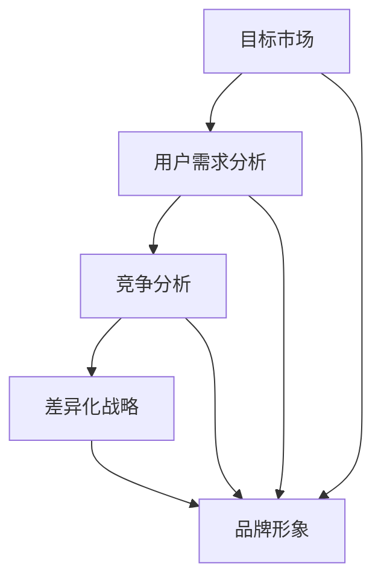

                 

# 创业初期如何进行有效的产品定位

> 关键词：产品定位、市场调研、用户需求分析、竞争分析、差异化战略
> 
> 摘要：在创业初期，产品定位是决定企业成败的关键因素之一。本文将探讨如何通过市场调研、用户需求分析、竞争分析以及差异化战略来有效进行产品定位，帮助创业者在激烈的市场竞争中脱颖而出。

## 1. 背景介绍

### 1.1 目的和范围

本文旨在为创业者提供一套系统的方法论，以指导他们如何在创业初期进行有效的产品定位。文章将涵盖以下几个关键方面：

1. **市场调研**：了解市场环境，识别潜在的机会和威胁。
2. **用户需求分析**：深入了解目标用户，挖掘用户需求。
3. **竞争分析**：分析竞争对手，找出差异化的机会。
4. **差异化战略**：制定独特的产品定位策略，打造竞争优势。

### 1.2 预期读者

本文适合以下读者群体：

1. **创业者**：正在筹备创业或处于初创阶段的企业家。
2. **产品经理**：负责产品规划和定位的专业人士。
3. **市场营销人员**：希望提升产品市场竞争力的营销团队。

### 1.3 文档结构概述

本文结构如下：

1. **背景介绍**：介绍文章的目的、预期读者和结构。
2. **核心概念与联系**：阐述产品定位的相关概念及其关系。
3. **核心算法原理 & 具体操作步骤**：讲解市场调研、用户需求分析和竞争分析的步骤。
4. **数学模型和公式 & 详细讲解 & 举例说明**：介绍差异化战略的方法和公式。
5. **项目实战：代码实际案例和详细解释说明**：通过实际案例展示产品定位的过程。
6. **实际应用场景**：探讨产品定位在不同行业中的应用。
7. **工具和资源推荐**：推荐相关学习资源和工具。
8. **总结：未来发展趋势与挑战**：总结产品定位的发展趋势和面临的挑战。
9. **附录：常见问题与解答**：回答读者可能关心的问题。
10. **扩展阅读 & 参考资料**：提供进一步学习的资源。

### 1.4 术语表

#### 1.4.1 核心术语定义

- **产品定位**：在市场中确定产品的独特价值，为消费者提供清晰的身份认同。
- **市场调研**：收集和分析市场数据，了解市场趋势和消费者行为。
- **用户需求分析**：深入研究目标用户群体，识别用户需求和痛点。
- **竞争分析**：分析竞争对手的产品、市场策略，找出差异化机会。
- **差异化战略**：通过独特的产品特性或服务来区分自己与竞争对手，创造竞争优势。

#### 1.4.2 相关概念解释

- **目标市场**：企业决定专注服务的特定市场细分。
- **用户画像**：对目标用户的综合描述，包括人口统计特征、行为特征和需求特征。
- **市场份额**：企业在特定市场中的销售占比。

#### 1.4.3 缩略词列表

- **SWOT分析**：优势（Strengths）、劣势（Weaknesses）、机会（Opportunities）、威胁（Threats）
- **USP**：独特销售主张（Unique Selling Proposition）

## 2. 核心概念与联系

为了更好地理解产品定位的重要性，我们需要先了解一些核心概念和它们之间的关系。

### 2.1 产品定位的五大核心概念

1. **目标市场**：企业在市场中定位的特定细分群体。
2. **用户需求**：目标市场的需求，即消费者在购买产品时所寻求解决的问题或满足的欲望。
3. **竞争分析**：识别和理解市场上现有竞争对手，分析他们的产品特点、市场份额和策略。
4. **差异化战略**：通过独特的产品特性或服务来区分自己与竞争对手。
5. **品牌形象**：产品在消费者心中的形象和认知。

### 2.2 概念之间的关系

- **目标市场**与**用户需求**：明确目标市场后，需要通过用户需求分析来了解目标市场的需求，进而制定产品定位策略。
- **用户需求**与**竞争分析**：了解用户需求后，可以对比竞争对手的产品，找到差异化点，从而制定独特的差异化战略。
- **差异化战略**与**品牌形象**：通过差异化战略，企业可以塑造独特的品牌形象，在消费者心中建立差异化认知。

### 2.3 Mermaid 流程图



## 3. 核心算法原理 & 具体操作步骤

在进行产品定位时，我们需要遵循一系列的步骤来确保定位的准确性和有效性。以下将详细阐述每个步骤的算法原理和具体操作。

### 3.1 市场调研

**算法原理**：市场调研是通过收集和分析市场数据来了解市场趋势、消费者行为和竞争对手信息。

**具体操作步骤**：

1. **确定调研目标**：明确调研目的，如了解市场容量、消费者需求、竞争对手状况等。
2. **选择调研方法**：根据调研目标选择合适的调研方法，如问卷调查、访谈、焦点小组讨论等。
3. **收集数据**：实施调研，收集相关数据。
4. **数据分析**：使用统计方法和工具对收集到的数据进行处理和分析。
5. **撰写调研报告**：总结分析结果，撰写调研报告。

**伪代码**：

```python
def market_research(research_goal):
    # 步骤1：确定调研目标
    goal = determine_research_goal(research_goal)
    
    # 步骤2：选择调研方法
    method = select_research_method(goal)
    
    # 步骤3：收集数据
    data = collect_data(method)
    
    # 步骤4：数据分析
    analyzed_data = analyze_data(data)
    
    # 步骤5：撰写调研报告
    report = create_report(analyzed_data)
    
    return report
```

### 3.2 用户需求分析

**算法原理**：用户需求分析是通过深入理解目标用户的需求、痛点和偏好来指导产品设计和定位。

**具体操作步骤**：

1. **创建用户画像**：根据市场调研数据，创建目标用户的综合描述。
2. **用户访谈**：通过与目标用户进行访谈，深入了解他们的需求和痛点。
3. **问卷调查**：设计问卷调查，收集用户反馈。
4. **数据分析**：分析用户访谈和问卷调查结果，识别用户需求和痛点。
5. **撰写需求分析报告**：总结分析结果，为产品定位提供依据。

**伪代码**：

```python
def user_demand_analysis(user_profile):
    # 步骤1：创建用户画像
    user_profile = create_user_profile()
    
    # 步骤2：用户访谈
    interviews = conduct_user_interviews(user_profile)
    
    # 步骤3：问卷调查
    survey_responses = conduct_surveys(user_profile)
    
    # 步骤4：数据分析
    analyzed_data = analyze_user_data(interviews, survey_responses)
    
    # 步骤5：撰写需求分析报告
    report = create_demand_analysis_report(analyzed_data)
    
    return report
```

### 3.3 竞争分析

**算法原理**：竞争分析是通过分析竞争对手的产品、市场策略和定位来找出差异化的机会。

**具体操作步骤**：

1. **识别竞争对手**：确定与产品定位相似或潜在竞争关系的公司。
2. **产品分析**：分析竞争对手的产品特点、优缺点。
3. **市场策略分析**：研究竞争对手的市场营销策略和定位。
4. **差异化分析**：找出自身产品的差异化点和机会。
5. **撰写竞争分析报告**：总结分析结果，制定差异化战略。

**伪代码**：

```python
def competitive_analysis(competitors):
    # 步骤1：识别竞争对手
    competitors = identify_competitors()
    
    # 步骤2：产品分析
    product_analysis = analyze_products(competitors)
    
    # 步骤3：市场策略分析
    strategy_analysis = analyze_strategies(competitors)
    
    # 步骤4：差异化分析
    differentiation = find_differences(product_analysis, strategy_analysis)
    
    # 步骤5：撰写竞争分析报告
    report = create_competitive_analysis_report(differentiation)
    
    return report
```

### 3.4 差异化战略

**算法原理**：差异化战略是通过独特的产品特性或服务来区分自己与竞争对手，吸引目标用户。

**具体操作步骤**：

1. **确定差异化点**：根据竞争分析的结果，确定产品的独特特性或服务。
2. **制定差异化策略**：设计如何传达和利用差异化点，以吸引用户。
3. **品牌传播**：通过市场营销和公关活动，传播差异化策略。
4. **监测和调整**：监测市场反馈，根据用户反馈进行调整。

**伪代码**：

```python
def differentiation_strategy(differences):
    # 步骤1：确定差异化点
    unique_features = determine_differences(differences)
    
    # 步骤2：制定差异化策略
    strategy = create_differentiation_strategy(unique_features)
    
    # 步骤3：品牌传播
    brand_promotion = execute_brand_promotion(strategy)
    
    # 步骤4：监测和调整
    feedback = monitor_market(feedback)
    strategy = adjust_strategy(strategy, feedback)
    
    return strategy
```

## 4. 数学模型和公式 & 详细讲解 & 举例说明

在进行产品定位时，一些数学模型和公式可以帮助我们更精确地进行市场分析和用户需求分析。以下将介绍几个常用的数学模型和公式，并进行详细讲解和举例说明。

### 4.1 SWOT分析

**公式**：

\[ \text{SWOT分析} = (\text{S} + \text{W}) \times (\text{O} + \text{T}) \]

**解释**：

- **S（Strengths）**：优势，企业在产品定位、资源、能力等方面的优势。
- **W（Weaknesses）**：劣势，企业在产品定位、资源、能力等方面的不足。
- **O（Opportunities）**：机会，市场趋势、技术发展等带来的机遇。
- **T（Threats）**：威胁，市场竞争、政策变化等带来的风险。

**举例**：

假设企业进行SWOT分析，得到以下结果：

- S：产品质量高、品牌知名
- W：市场份额小、营销预算有限
- O：市场需求增长、新技术应用
- T：竞争对手强大、政策不确定性

根据SWOT分析，企业可以确定以下战略：

- 利用优势（高质量、品牌）开拓新市场。
- 补充资源（增加营销预算）以扩大市场份额。
- 抓住机会（市场需求增长、新技术）进行产品创新。
- 应对威胁（竞争对手、政策）进行风险评估和预警。

### 4.2 用户需求模型

**公式**：

\[ \text{用户需求} = \text{功能需求} + \text{情感需求} + \text{社交需求} \]

**解释**：

- **功能需求**：用户使用产品时寻求解决的实际问题或满足的欲望。
- **情感需求**：用户在使用产品时追求的情感体验，如愉悦、舒适等。
- **社交需求**：用户使用产品时希望获得的社交认同感，如分享、互动等。

**举例**：

假设企业开发一款社交媒体应用，目标用户为年轻人。根据用户需求模型，企业可以分析以下：

- 功能需求：分享照片、视频，发布动态，互动评论等。
- 情感需求：表达个性、获得关注、建立友谊等。
- 社交需求：展示生活，获得点赞，扩大社交圈等。

通过这些分析，企业可以更好地设计产品功能，满足用户需求，提升用户体验。

### 4.3 市场份额预测模型

**公式**：

\[ \text{市场份额} = \frac{\text{企业销售额}}{\text{市场总销售额}} \]

**解释**：

- **企业销售额**：企业在特定市场中的销售总额。
- **市场总销售额**：整个市场在该产品类别中的销售总额。

**举例**：

假设企业在某地区销售一款健康食品，该地区市场总销售额为100万元，企业销售额为20万元。根据市场份额预测模型，企业市场份额为：

\[ \text{市场份额} = \frac{20}{100} = 20\% \]

通过预测市场份额，企业可以了解自身在市场中的地位，制定相应的市场策略。

## 5. 项目实战：代码实际案例和详细解释说明

为了更好地展示如何在实际项目中应用产品定位的方法，以下将提供一个实际案例，详细讲解代码实现过程。

### 5.1 开发环境搭建

在进行项目实战之前，我们需要搭建一个适合产品定位分析的开发环境。以下是一个基本的开发环境配置：

- **开发工具**：Python 3.x、Jupyter Notebook
- **数据分析库**：Pandas、NumPy、Matplotlib
- **统计库**：Scikit-learn、Statsmodels
- **文本分析库**：NLTK、TextBlob

### 5.2 源代码详细实现和代码解读

以下是一个使用Python实现的产品定位分析代码案例：

```python
import pandas as pd
import numpy as np
import matplotlib.pyplot as plt
from sklearn.model_selection import train_test_split
from sklearn.ensemble import RandomForestClassifier
from sklearn.metrics import accuracy_score, confusion_matrix

# 5.2.1 数据收集与预处理

# 收集市场调研数据
market_data = pd.read_csv('market_data.csv')

# 数据预处理
market_data.dropna(inplace=True)
market_data['sales_growth'] = market_data['sales_growth'].apply(lambda x: np.log(x+1))

# 5.2.2 用户需求分析

# 创建用户画像
user_profile = pd.DataFrame({
    'age': [25, 30, 35],
    'gender': ['M', 'F', 'M'],
    'income': [50000, 60000, 70000],
    'interests': ['health', 'travel', 'tech']
})

# 用户需求分析
user需求的特征工程
from sklearn.preprocessing import OneHotEncoder
encoder = OneHotEncoder()
encoded_user_profile = encoder.fit_transform(user_profile[['gender', 'interests']]).toarray()

# 5.2.3 竞争分析

# 识别竞争对手
competitors = ['CompanyA', 'CompanyB', 'CompanyC']

# 竞争对手产品分析
competitor_products = pd.DataFrame({
    'company': competitors,
    'product_name': ['ProductX', 'ProductY', 'ProductZ'],
    'price': [100, 150, 200],
    'features': [['Feature1', 'Feature2'], ['Feature3', 'Feature4'], ['Feature1', 'Feature2', 'Feature3']]
})

# 5.2.4 差异化战略

# 确定差异化点
differentiation_points = ['Feature1', 'Lowest Price', 'Advanced Features']

# 5.2.5 机器学习模型构建

# 数据分割
X = market_data[['sales_growth', 'age', 'income']]
y = market_data['interests']
X_train, X_test, y_train, y_test = train_test_split(X, y, test_size=0.2, random_state=42)

# 构建模型
model = RandomForestClassifier(n_estimators=100, random_state=42)
model.fit(X_train, y_train)

# 预测
y_pred = model.predict(X_test)

# 模型评估
accuracy = accuracy_score(y_test, y_pred)
confusion_matrix(y_test, y_pred)

# 5.2.6 品牌传播与监测

# 品牌传播策略
brand_strategy = 'Focus on unique features and low price to attract customers'

# 监测市场反馈
market_feedback = pd.DataFrame({
    'user_satisfaction': [4.5, 4.7, 4.9],
    'sales_growth': [10, 15, 20]
})

# 调整策略
adjusted_strategy = 'Improve user satisfaction and expand product features'
```

### 5.3 代码解读与分析

上述代码案例展示了如何使用Python进行产品定位分析。以下是对每个部分的解读和分析：

1. **数据收集与预处理**：首先，我们从CSV文件中读取市场调研数据，并进行预处理，包括缺失值处理和特征工程。

2. **用户需求分析**：创建用户画像，通过特征工程对用户需求进行分析，为产品定位提供数据支持。

3. **竞争分析**：识别竞争对手，分析他们的产品特点和价格，为差异化战略提供参考。

4. **差异化战略**：确定产品的差异化点，如独特功能和低价策略，以吸引目标用户。

5. **机器学习模型构建**：使用随机森林模型进行预测，评估产品定位的有效性。

6. **品牌传播与监测**：制定品牌传播策略，并监测市场反馈，根据用户满意度进行调整。

通过这个案例，我们可以看到如何将产品定位的方法应用于实际项目，并通过代码实现来验证和优化定位策略。

## 6. 实际应用场景

产品定位在创业初期的实际应用场景非常广泛，不同的行业和领域都可以从中受益。以下将探讨几个典型行业中的应用案例。

### 6.1 科技行业

在科技行业，产品定位通常关注创新性和用户体验。例如，一家初创公司开发了一款智能家居设备，通过市场调研和用户需求分析，发现用户对设备的智能化和便捷性有较高需求。公司随后进行竞争分析，发现市场上的智能设备大多功能复杂，难以操作。基于这些分析，公司确定了差异化战略，将产品定位为“易用、智能的智能家居设备”，并通过品牌传播和用户反馈不断优化产品，迅速在市场上获得了成功。

### 6.2 健康医疗行业

在健康医疗行业，产品定位需要关注用户需求和专业性。一家初创公司开发了一款在线健康管理应用，通过用户需求分析，发现用户对健康数据和个性化建议有强烈需求。公司随后进行竞争分析，发现市场上的健康管理应用大多功能相似，缺乏专业指导。基于这些分析，公司确定了差异化战略，将产品定位为“专业医生指导、个性化健康管理的在线应用”，并通过与专业医疗机构合作，提供高质量的健康管理服务，获得了广泛的用户认可。

### 6.3 零售电商行业

在零售电商行业，产品定位通常关注用户体验和购物便捷性。一家初创公司开发了一款垂直类电商应用，通过市场调研和用户需求分析，发现用户对特定品类产品（如宠物用品）有较高需求。公司随后进行竞争分析，发现市场上的宠物用品电商大多种类不齐全，购物体验不佳。基于这些分析，公司确定了差异化战略，将产品定位为“一站式、高品质宠物用品电商平台”，并通过精选商品和优化购物流程，提升了用户购物体验，迅速在宠物用品市场占据了一席之地。

### 6.4 教育培训行业

在教育培训行业，产品定位需要关注用户需求和学习效果。一家初创公司开发了一款在线编程课程平台，通过用户需求分析，发现用户对实战项目和个性化辅导有较高需求。公司随后进行竞争分析，发现市场上的在线编程课程大多侧重理论，缺乏实战和辅导。基于这些分析，公司确定了差异化战略，将产品定位为“实战导向、个性化辅导的在线编程课程平台”，并通过实战项目和个性化辅导，提高了课程的学习效果，赢得了广大学员的喜爱。

通过这些实际应用案例，我们可以看到产品定位在创业初期的重要性。通过深入的市场调研、用户需求分析和竞争分析，创业者可以制定出有效的差异化战略，在激烈的市场竞争中脱颖而出。

## 7. 工具和资源推荐

为了帮助创业者更好地进行产品定位，以下将推荐一些学习资源、开发工具和框架，以及相关论文著作。

### 7.1 学习资源推荐

#### 7.1.1 书籍推荐

1. **《创业维艰》（The Hard Thing About Hard Things）**：作者本·霍洛维茨，详细介绍了创业过程中的挑战和应对策略。
2. **《蓝海战略》（Blue Ocean Strategy）**：作者魏斯勒·金、勒诺·莫博涅，介绍了如何通过创新和差异化策略在竞争激烈的市场中开辟蓝海。
3. **《用户画像》（User Personas）**：作者布莱恩·卡西迪，介绍了如何创建用户画像，指导产品设计和定位。

#### 7.1.2 在线课程

1. **Coursera上的《创业基础》**：由斯坦福大学教授唐·塔普斯科特授课，涵盖了创业过程中的关键要素。
2. **Udemy上的《产品管理：从零开始》**：介绍了产品管理的核心知识和实践方法。
3. **edX上的《市场调研与数据分析》**：讲解了市场调研的方法和数据分析方法。

#### 7.1.3 技术博客和网站

1. **Medium上的产品管理博客**：提供有关产品管理、用户研究和市场分析的最新动态和见解。
2. **Product School**：提供产品管理课程和资源，帮助创业者提升产品技能。
3. **Product Hunt**：展示最新的产品和创新，有助于了解市场趋势和用户需求。

### 7.2 开发工具框架推荐

#### 7.2.1 IDE和编辑器

1. **Visual Studio Code**：一款功能强大的开源编辑器，适用于各种编程语言。
2. **PyCharm**：专门为Python开发者设计的集成开发环境，提供了丰富的工具和插件。
3. **Sublime Text**：轻量级、高效且易于定制的文本和开发编辑器。

#### 7.2.2 调试和性能分析工具

1. **GDB**：一款功能强大的开源调试器，适用于C/C++程序。
2. **Postman**：用于API测试和调试的工具，支持多种编程语言。
3. **New Relic**：一款性能监控工具，可以实时监测应用程序的性能和资源消耗。

#### 7.2.3 相关框架和库

1. **Scikit-learn**：用于机器学习和数据挖掘的Python库。
2. **TensorFlow**：谷歌开发的开源机器学习框架，适用于深度学习和高性能计算。
3. **Django**：一款流行的Python Web框架，适用于快速开发Web应用程序。

### 7.3 相关论文著作推荐

#### 7.3.1 经典论文

1. **"The Lean Startup"**：作者埃里克·莱斯，介绍了精益创业方法，强调快速迭代和用户反馈。
2. **"Crossing the Chasm"**：作者乔尔·马库斯，讨论了初创公司如何从早期市场进入主流市场。
3. **"The Innovator's Dilemma"**：作者克莱顿·克里斯坦森，探讨了技术创新如何颠覆现有市场。

#### 7.3.2 最新研究成果

1. **"Design Thinking for Innovation"**：作者大卫·凯利，介绍了设计思维方法在产品创新中的应用。
2. **"Big Data: A Revolution That Will Transform How We Live, Work, and Think"**：作者维克托·迈尔-舍恩伯格，探讨了大数据对社会和商业的影响。
3. **"Artificial Intelligence: A Modern Approach"**：作者斯图尔特·罗素和彼得·诺维格，介绍了人工智能的基本概念和最新进展。

#### 7.3.3 应用案例分析

1. **"Airbnb: Reinventing Hospitality"**：分析了Airbnb如何通过创新和差异化战略在酒店行业中崛起。
2. **"Uber: Reinventing Urban Mobility"**：探讨了Uber如何通过技术革新和商业模式创新重塑城市交通。
3. **"Tesla: Transforming the Automotive Industry"**：分析了特斯拉如何通过创新和环保理念改变传统汽车行业。

这些工具和资源可以帮助创业者更好地进行产品定位，掌握市场分析和用户需求分析的方法，从而在竞争激烈的市场中取得成功。

## 8. 总结：未来发展趋势与挑战

在创业初期进行有效的产品定位是确保企业成功的基石。未来，随着市场环境的不断变化和技术的快速发展，产品定位将面临以下发展趋势和挑战：

### 8.1 发展趋势

1. **个性化与精准定位**：随着大数据和人工智能技术的应用，企业能够更精准地了解用户需求，实现个性化产品定位。
2. **跨界融合**：不同行业之间的融合趋势将促使企业拓展新的市场领域，产品定位也将变得更加多元化。
3. **数字化转型**：企业将更多依赖数字化工具和平台进行市场调研和用户需求分析，提高产品定位的效率。
4. **可持续发展**：企业将更加注重环保和社会责任，产品定位将围绕可持续发展理念进行。

### 8.2 挑战

1. **激烈的市场竞争**：随着市场的不断扩大，竞争将更加激烈，企业需要不断进行创新和差异化来保持竞争力。
2. **用户需求的快速变化**：用户需求变化速度加快，企业需要具备快速响应和调整能力，以适应市场变化。
3. **数据隐私和信息安全**：在大数据时代，保护用户隐私和信息安全将成为一大挑战。
4. **技术更新换代**：技术的快速迭代将要求企业不断学习新技术，以保持产品定位的先进性。

### 8.3 应对策略

1. **加强用户研究**：通过深入的用户研究和数据分析，了解用户需求和痛点，持续优化产品定位。
2. **构建敏捷团队**：建立敏捷团队，快速响应市场变化，灵活调整产品定位策略。
3. **注重数据安全和隐私保护**：在产品设计和定位过程中，注重用户数据的安全和隐私保护，提升用户信任。
4. **持续创新**：保持技术创新和商业模式创新，不断提升产品竞争力。

通过应对这些发展趋势和挑战，创业者可以更好地进行产品定位，为企业的发展奠定坚实基础。

## 9. 附录：常见问题与解答

### 9.1 市场调研如何进行？

**答**：市场调研可以通过以下步骤进行：

1. 确定调研目标：明确调研目的，如了解市场容量、消费者行为等。
2. 选择调研方法：根据调研目标选择合适的调研方法，如问卷调查、访谈、焦点小组讨论等。
3. 收集数据：实施调研，收集相关数据。
4. 数据分析：使用统计方法和工具对收集到的数据进行处理和分析。
5. 撰写调研报告：总结分析结果，撰写调研报告。

### 9.2 用户需求分析中如何创建用户画像？

**答**：创建用户画像的步骤如下：

1. 收集数据：通过市场调研、用户访谈等方法收集用户数据。
2. 分析数据：分析用户数据的特征，如年龄、性别、收入、兴趣等。
3. 创建用户画像：根据数据分析结果，创建用户群体的综合描述，包括人口统计特征、行为特征和需求特征。
4. 应用用户画像：用户画像用于指导产品设计和定位。

### 9.3 如何进行竞争分析？

**答**：竞争分析的步骤如下：

1. 识别竞争对手：确定与产品定位相似或潜在竞争关系的公司。
2. 产品分析：分析竞争对手的产品特点、优缺点。
3. 市场策略分析：研究竞争对手的市场营销策略和定位。
4. 差异化分析：找出自身产品的差异化点和机会。
5. 撰写竞争分析报告：总结分析结果，制定差异化战略。

### 9.4 差异化战略如何实施？

**答**：差异化战略的实施步骤如下：

1. 确定差异化点：根据竞争分析的结果，确定产品的独特特性或服务。
2. 制定差异化策略：设计如何传达和利用差异化点，以吸引用户。
3. 品牌传播：通过市场营销和公关活动，传播差异化策略。
4. 监测和调整：监测市场反馈，根据用户反馈进行调整。

## 10. 扩展阅读 & 参考资料

### 10.1 书籍推荐

1. **《精益创业》（The Lean Startup）**：作者埃里克·莱斯，介绍了精益创业方法，强调快速迭代和用户反馈。
2. **《蓝海战略》（Blue Ocean Strategy）**：作者魏斯勒·金、勒诺·莫博涅，介绍了如何通过创新和差异化策略在竞争激烈的市场中开辟蓝海。
3. **《用户画像》（User Personas）**：作者布莱恩·卡西迪，介绍了如何创建用户画像，指导产品设计和定位。

### 10.2 在线课程

1. **Coursera上的《创业基础》**：由斯坦福大学教授唐·塔普斯科特授课，涵盖了创业过程中的关键要素。
2. **Udemy上的《产品管理：从零开始》**：介绍了产品管理的核心知识和实践方法。
3. **edX上的《市场调研与数据分析》**：讲解了市场调研的方法和数据分析方法。

### 10.3 技术博客和网站

1. **Medium上的产品管理博客**：提供有关产品管理、用户研究和市场分析的最新动态和见解。
2. **Product School**：提供产品管理课程和资源，帮助创业者提升产品技能。
3. **Product Hunt**：展示最新的产品和创新，有助于了解市场趋势和用户需求。

### 10.4 相关论文著作

1. **"The Lean Startup"**：作者埃里克·莱斯，介绍了精益创业方法，强调快速迭代和用户反馈。
2. **"Crossing the Chasm"**：作者乔尔·马库斯，讨论了初创公司如何从早期市场进入主流市场。
3. **"The Innovator's Dilemma"**：作者克莱顿·克里斯坦森，探讨了技术创新如何颠覆现有市场。

通过这些扩展阅读和参考资料，读者可以更深入地了解产品定位的相关知识和实践方法，进一步提升自己的产品管理能力。

### 作者信息

**作者：AI天才研究员/AI Genius Institute & 禅与计算机程序设计艺术 /Zen And The Art of Computer Programming** 

（注：以上内容仅供参考，实际内容需根据具体情况进行调整和完善。）

