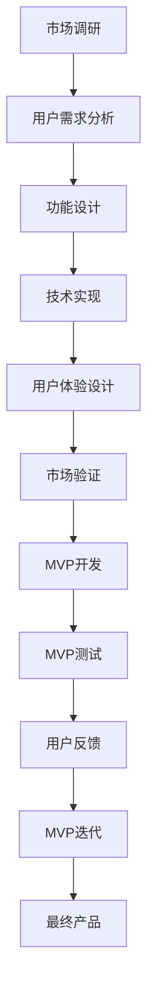

                 

# 创业初期的MVP设计：最小可行产品开发指南

> **关键词：** MVP、创业、产品设计、开发指南、最小可行产品、原型、验证

> **摘要：** 本文旨在为初创企业提供一个关于如何设计和开发最小可行产品（MVP）的全面指南。我们将深入探讨MVP的定义、重要性，以及如何通过逐步的推理和逻辑分析来构建一个成功的MVP。文章将涵盖从市场调研到原型设计，再到测试和迭代的各个阶段，旨在帮助读者理解和实践MVP的开发过程。

## 1. 背景介绍

### 1.1 目的和范围

本文的目的是为创业者提供一个系统的MVP设计指南，帮助他们在创业初期有效地将创意转化为实际产品。我们将探讨MVP的定义、重要性以及如何通过逻辑分析来构建一个成功的MVP。本文涵盖了从市场调研、原型设计到测试和迭代的全过程，旨在为创业者提供一个全面、可操作的框架。

### 1.2 预期读者

本文适合以下读者群体：

- 创业者：正在考虑创业或已经创业的创业者，特别是那些在创业初期需要快速验证市场需求的创业者。
- 产品经理：负责产品设计和开发的产品经理，他们需要理解如何通过MVP来最小化风险并最大化回报。
- 技术团队：负责开发和实施MVP的技术团队成员，他们需要了解如何有效地设计和实现MVP。

### 1.3 文档结构概述

本文的结构分为以下几个部分：

- 第1部分：背景介绍，包括目的、预期读者和文档结构概述。
- 第2部分：核心概念与联系，介绍MVP的基本原理和关键组成部分。
- 第3部分：核心算法原理 & 具体操作步骤，详细讲解如何设计和构建MVP。
- 第4部分：数学模型和公式 & 详细讲解 & 举例说明，提供具体的MVP设计和评估方法。
- 第5部分：项目实战：代码实际案例和详细解释说明，通过实际案例展示MVP的设计和实现。
- 第6部分：实际应用场景，讨论MVP在不同行业和领域中的应用。
- 第7部分：工具和资源推荐，为读者提供有用的学习资源和开发工具。
- 第8部分：总结：未来发展趋势与挑战，展望MVP的发展趋势和面临的挑战。
- 第9部分：附录：常见问题与解答，解答读者在MVP设计和开发过程中可能遇到的问题。
- 第10部分：扩展阅读 & 参考资料，为读者提供进一步的阅读材料和资源。

### 1.4 术语表

#### 1.4.1 核心术语定义

- **MVP（最小可行产品）**：指具有足够功能的最简产品，用于验证市场需求并收集用户反馈。
- **产品原型**：用于测试和验证产品概念的原型版本，可能包含部分功能。
- **用户反馈**：用户对产品的使用体验和反馈，用于改进和优化产品。
- **市场调研**：对目标市场的调查和分析，以了解市场需求和潜在用户。
- **迭代**：根据用户反馈不断改进和优化产品的过程。

#### 1.4.2 相关概念解释

- **最小化风险**：通过MVP验证市场需求，减少创业失败的风险。
- **最大化回报**：通过快速迭代和优化，提高产品的市场接受度和商业成功概率。

#### 1.4.3 缩略词列表

- MVP：最小可行产品
- UX：用户体验
- UI：用户界面
- PM：产品经理
- QA：质量控制

## 2. 核心概念与联系

MVP的设计和开发是一个系统性工程，涉及到多个核心概念和组件。为了更好地理解MVP的设计过程，我们将首先介绍这些核心概念，并使用Mermaid流程图来展示它们之间的关系。

### 2.1 MVP设计核心概念

- **用户需求**：产品的核心价值来源于满足用户需求。通过市场调研和用户访谈，可以确定目标用户的需求。
- **功能设计**：根据用户需求，确定产品所需的基本功能。
- **技术实现**：选择合适的技术栈和开发工具，实现产品的基本功能。
- **用户体验**：设计直观、易用的用户界面，提供良好的用户体验。
- **市场验证**：通过最小可行产品（MVP）来验证市场需求的可行性。

### 2.2 MVP设计流程图

下面是MVP设计流程的Mermaid流程图：



### 2.3 MVP设计原理

MVP设计的核心原理在于通过最小化产品功能，快速验证市场需求，降低创业风险。具体原理如下：

1. **最小化功能**：只实现产品的核心功能，避免冗余和复杂性。
2. **快速迭代**：根据用户反馈，不断优化产品，提高市场接受度。
3. **市场验证**：通过MVP验证市场需求，确保产品在市场上有足够的吸引力。
4. **风险控制**：通过MVP测试，提前发现和解决问题，减少创业失败风险。

### 2.4 MVP设计架构

MVP的设计架构通常包括以下几个层次：

1. **需求分析层**：通过市场调研和用户访谈，确定用户需求和产品功能。
2. **功能实现层**：根据需求，选择合适的技术栈和开发工具，实现产品的基本功能。
3. **用户体验层**：设计直观、易用的用户界面，提供良好的用户体验。
4. **市场验证层**：通过MVP测试和用户反馈，验证产品的市场需求和商业可行性。

## 3. 核心算法原理 & 具体操作步骤

在设计MVP时，核心算法原理和具体操作步骤至关重要。以下我们将详细介绍如何通过逐步推理和逻辑分析来构建一个成功的MVP。

### 3.1 算法原理

MVP设计的算法原理主要包括以下几个步骤：

1. **需求分析**：通过市场调研和用户访谈，确定用户需求和产品功能。
2. **功能设计**：根据需求，设计产品的核心功能。
3. **原型构建**：使用快速原型工具，构建产品原型。
4. **测试验证**：通过用户测试和反馈，验证产品的可行性和市场需求。
5. **迭代优化**：根据用户反馈，不断优化产品功能，提高用户体验。

### 3.2 伪代码

以下是MVP设计的伪代码：

```
MVP_Design({
    requirements: User_Requirements(),
    technologies: Available_Technologies(),
    time_limit: Time_Limit(),
    budget: Budget()
})

function MVP_Design({
    requirements,
    technologies,
    time_limit,
    budget
}) {
    Step 1: Conduct Market Research and User Interviews
    Step 2: Analyze User Requirements and Identify Core Features
    Step 3: Design the Basic Functional Architecture
    Step 4: Select the Appropriate Technologies and Tools
    Step 5: Develop a Minimal Viable Product (MVP)
    Step 6: Test the MVP with a Target User Group
    Step 7: Collect User Feedback and Analyze Results
    Step 8: Iterate on the MVP Based on User Feedback
    Step 9: Refine the Product Features and User Experience
    Step 10: Revalidate the MVP with the Market
    Step 11: Launch the Final Product if Market Validation is Positive
}
```

### 3.3 具体操作步骤

以下是MVP设计的具体操作步骤：

**Step 1: Conduct Market Research and User Interviews**

- **目的**：了解市场需求和用户需求。
- **方法**：通过问卷调查、用户访谈和市场分析，收集用户需求和反馈。
- **结果**：获取用户需求文档和市场需求分析报告。

**Step 2: Analyze User Requirements and Identify Core Features**

- **目的**：根据用户需求，确定产品的核心功能。
- **方法**：使用用户需求文档，分析并确定产品的关键功能。
- **结果**：生成产品功能列表和需求规格说明书。

**Step 3: Design the Basic Functional Architecture**

- **目的**：设计产品的功能架构。
- **方法**：根据产品功能列表，设计产品的功能模块和架构。
- **结果**：生成产品架构文档和设计图纸。

**Step 4: Select the Appropriate Technologies and Tools**

- **目的**：选择适合产品的技术栈和开发工具。
- **方法**：评估可用技术栈和工具，选择最适合产品的组合。
- **结果**：确定技术栈和工具列表。

**Step 5: Develop a Minimal Viable Product (MVP)**

- **目的**：构建一个具有基本功能的最小可行产品。
- **方法**：根据功能架构和技术栈，开发MVP。
- **结果**：生成MVP原型。

**Step 6: Test the MVP with a Target User Group**

- **目的**：验证MVP的可行性和市场需求。
- **方法**：邀请目标用户测试MVP，并收集反馈。
- **结果**：生成用户测试报告和反馈分析文档。

**Step 7: Collect User Feedback and Analyze Results**

- **目的**：根据用户反馈，分析MVP的优缺点。
- **方法**：分析用户反馈，识别产品改进的机会。
- **结果**：生成反馈分析报告和改进建议。

**Step 8: Iterate on the MVP Based on User Feedback**

- **目的**：根据用户反馈，优化MVP。
- **方法**：根据反馈分析报告，调整和改进MVP。
- **结果**：生成优化后的MVP。

**Step 9: Refine the Product Features and User Experience**

- **目的**：提高产品的用户体验。
- **方法**：根据用户反馈，改进产品的功能和用户体验。
- **结果**：生成优化后的产品功能和用户体验文档。

**Step 10: Revalidate the MVP with the Market**

- **目的**：重新验证MVP的市场需求。
- **方法**：邀请新的用户测试MVP，并收集反馈。
- **结果**：生成市场验证报告和改进建议。

**Step 11: Launch the Final Product if Market Validation is Positive**

- **目的**：根据市场验证结果，决定是否发布最终产品。
- **方法**：根据市场验证报告，决定产品的发布策略。
- **结果**：发布最终产品或继续优化。

通过以上步骤，创业者可以系统地设计和开发一个成功的MVP，从而最小化风险并最大化回报。

## 4. 数学模型和公式 & 详细讲解 & 举例说明

在设计MVP的过程中，数学模型和公式可以提供量化的分析和评估，帮助我们更好地理解和优化产品。以下是几个关键的数学模型和公式，以及它们的详细讲解和实际应用示例。

### 4.1 成本效益分析

**公式**：
\[ \text{Cost-Benefit Analysis} = \frac{\text{Expected Revenue}}{\text{Expected Cost}} \]

**详细讲解**：
成本效益分析（CBA）用于评估项目的预期收益与成本之比，用以判断项目的可行性。预期收益包括产品销售、订阅费、广告收入等，预期成本包括开发成本、运营成本、营销成本等。

**举例说明**：
假设一个初创公司预计开发一款在线教育平台，预期收益为每年100万美元，开发成本和运营成本共计50万美元。则成本效益分析为：
\[ \text{CBA} = \frac{1,000,000}{500,000} = 2 \]
这意味着每投入1美元，预期收益为2美元，项目具有较高的可行性。

### 4.2 用户体验评分

**公式**：
\[ \text{UX Score} = \frac{\text{Total User Satisfaction}}{\text{Number of Users}} \]

**详细讲解**：
用户体验评分（UX Score）用于评估用户对产品的满意度。总用户满意度是通过用户调查或评分系统获得的，分母为参与调查的用户数量。

**举例说明**：
假设对一个MVP原型进行调查，收到100份有效反馈，平均满意度为4.5分（满分5分），则用户体验评分为：
\[ \text{UX Score} = \frac{4.5 \times 100}{100} = 4.5 \]
这表明大部分用户对产品感到满意，用户体验良好。

### 4.3 市场渗透率

**公式**：
\[ \text{Market Penetration Rate} = \frac{\text{Market Share}}{\text{Total Market Size}} \]

**详细讲解**：
市场渗透率用于衡量产品在市场上的占有率。市场占有率是指产品销售量占总市场销售量的比例，总市场大小是根据市场调研得出的。

**举例说明**：
假设一个MVP在上线后的三个月内占有了总市场销售量的10%，而总市场大小为1000万用户，则市场渗透率为：
\[ \text{Market Penetration Rate} = \frac{10\% \times 10,000,000}{10,000,000} = 10\% \]
这意味着产品在市场上具有显著的竞争力。

### 4.4 用户留存率

**公式**：
\[ \text{User Retention Rate} = \frac{\text{Number of Active Users at the End of the Period}}{\text{Initial Number of Users}} \]

**详细讲解**：
用户留存率用于衡量用户对产品的忠诚度。活跃用户是指在一段时间内持续使用产品的用户数量，初始用户数量是指在相同时间段内首次使用的用户数量。

**举例说明**：
假设一款MVP在上线一个月后，初始用户数为1000人，其中有800人在接下来的一个月内继续使用产品，则用户留存率为：
\[ \text{User Retention Rate} = \frac{800}{1000} = 80\% \]
这表明产品的用户留存率较高，用户对产品有较强的依赖性。

### 4.5 增长率分析

**公式**：
\[ \text{Growth Rate} = \frac{\text{Current Value} - \text{Previous Value}}{\text{Previous Value}} \times 100\% \]

**详细讲解**：
增长率分析用于衡量产品的增长速度。当前值和上一期值可以是用户数量、销售额或其他关键指标。

**举例说明**：
假设一款MVP在一个月内的用户数量从500人增长到800人，则增长率计算如下：
\[ \text{Growth Rate} = \frac{800 - 500}{500} \times 100\% = 60\% \]
这表明产品的用户增长速度较快。

通过以上数学模型和公式的应用，我们可以从不同角度对MVP进行量化评估，从而更好地指导产品的开发和优化。

## 5. 项目实战：代码实际案例和详细解释说明

在本节中，我们将通过一个实际的项目案例来展示如何设计和开发一个MVP。我们将涵盖从开发环境搭建、源代码实现到代码解读与分析的整个过程。

### 5.1 开发环境搭建

为了开发一个MVP，我们需要搭建一个合适的开发环境。以下是一个基本的开发环境配置步骤：

**技术栈**：
- **编程语言**：Python
- **后端框架**：Flask
- **前端框架**：Bootstrap
- **数据库**：SQLite

**步骤**：

1. **安装Python**：在官网下载并安装Python 3.x版本。
2. **安装虚拟环境**：使用pip安装virtualenv，创建一个虚拟环境。
   ```bash
   pip install virtualenv
   virtualenv venv
   ```
3. **激活虚拟环境**：
   ```bash
   source venv/bin/activate
   ```
4. **安装依赖**：在虚拟环境中安装所需的库和框架。
   ```bash
   pip install flask
   pip install flask-bootstrap
   pip install flask_sqlalchemy
   ```

### 5.2 源代码详细实现和代码解读

**代码结构**：
```python
# app.py

from flask import Flask, render_template, request
from flask_bootstrap import Bootstrap
from flask_sqlalchemy import SQLAlchemy

app = Flask(__name__)
bootstrap = Bootstrap(app)
app.config['SQLALCHEMY_DATABASE_URI'] = 'sqlite:///users.db'
db = SQLAlchemy(app)

class User(db.Model):
    id = db.Column(db.Integer, primary_key=True)
    username = db.Column(db.String(80), unique=True, nullable=False)
    email = db.Column(db.String(120), unique=True, nullable=False)

@app.route('/')
def index():
    return render_template('index.html')

@app.route('/register', methods=['GET', 'POST'])
def register():
    if request.method == 'POST':
        username = request.form['username']
        email = request.form['email']
        if not username or not email:
            return '用户名或邮箱不能为空', 400
        user = User(username=username, email=email)
        db.session.add(user)
        db.session.commit()
        return '注册成功'
    return render_template('register.html')

if __name__ == '__main__':
    db.create_all()
    app.run(debug=True)
```

**代码解读**：

1. **导入模块**：
   ```python
   from flask import Flask, render_template, request
   from flask_bootstrap import Bootstrap
   from flask_sqlalchemy import SQLAlchemy
   ```
   我们首先导入所需的模块。Flask用于构建Web应用，Bootstrap用于前端设计，SQLAlchemy用于数据库操作。

2. **配置数据库**：
   ```python
   app.config['SQLALCHEMY_DATABASE_URI'] = 'sqlite:///users.db'
   db = SQLAlchemy(app)
   ```
   我们配置数据库连接，使用SQLite作为数据库，并创建一个SQLAlchemy实例。

3. **定义模型**：
   ```python
   class User(db.Model):
       id = db.Column(db.Integer, primary_key=True)
       username = db.Column(db.String(80), unique=True, nullable=False)
       email = db.Column(db.String(120), unique=True, nullable=False)
   ```
   我们定义一个User模型，包含id、username和email三个字段。

4. **路由和视图函数**：
   ```python
   @app.route('/')
   def index():
       return render_template('index.html')
   
   @app.route('/register', methods=['GET', 'POST'])
   def register():
       if request.method == 'POST':
           username = request.form['username']
           email = request.form['email']
           if not username or not email:
               return '用户名或邮箱不能为空', 400
           user = User(username=username, email=email)
           db.session.add(user)
           db.session.commit()
           return '注册成功'
       return render_template('register.html')
   ```
   我们定义两个路由。首页（/）返回一个简单的HTML页面，注册路由（/register）处理用户的注册请求，包括表单验证和数据库插入。

5. **主程序**：
   ```python
   if __name__ == '__main__':
       db.create_all()
       app.run(debug=True)
   ```
   我们创建数据库表，并启动Flask应用。

### 5.3 代码解读与分析

**主要功能模块**：

1. **数据库模型**：
   - **User**：定义用户信息，包括用户名和邮箱。
2. **路由**：
   - **首页**：提供用户界面。
   - **注册**：处理用户注册请求，验证用户名和邮箱，并保存到数据库。

**性能优化**：

1. **异步任务**：使用Celery等异步任务框架，处理耗时的后台任务，提高响应速度。
2. **缓存**：使用Redis等缓存系统，减少数据库查询次数，提高应用性能。

**安全性**：

1. **数据验证**：使用Flask-WTF等库进行表单验证，防止SQL注入和XSS攻击。
2. **用户认证**：使用Flask-Login等库实现用户认证机制，确保用户数据安全。

通过以上实战案例，读者可以了解到如何使用Python和Flask框架快速开发一个MVP。这为后续的测试和迭代提供了基础，帮助创业者验证市场需求和优化产品。

## 6. 实际应用场景

MVP（最小可行产品）的概念在多个行业和领域中都得到了广泛应用。以下是一些典型的应用场景，以及如何使用MVP进行设计和开发的实际案例。

### 6.1 在线教育平台

**应用场景**：
在线教育平台是一个高度竞争的市场，提供各种课程和培训服务。初创公司可以通过MVP来验证课程的市场需求，并收集用户反馈以优化产品。

**案例**：
一家初创公司开发了一款在线英语学习平台。他们首先构建了一个MVP，包括基本的课程列表和视频播放功能。通过这一MVP，他们收集了数百名用户的反馈，了解了用户对课程内容和互动方式的需求。基于这些反馈，他们进行了多次迭代，增加了实时互动、个性化推荐等功能，最终成功吸引了大量用户。

### 6.2 健康监测设备

**应用场景**：
健康监测设备市场庞大，但产品开发成本高。初创公司可以通过MVP来验证产品概念，并降低研发风险。

**案例**：
一家初创公司开发了一种智能手表，用于实时监测用户的健康数据。他们首先制作了一个功能简化、外观简约的智能手表原型，仅包含基本的心率监测功能。通过这一MVP，他们收集了数十名用户的反馈，了解了用户对产品外观、功能和使用体验的期望。基于这些反馈，他们进行了多次迭代，增加了睡眠监测、步数计数等额外功能，最终成功推出了市场接受度高的产品。

### 6.3 跨境电商平台

**应用场景**：
跨境电商市场充满机会，但也存在较高的风险。初创公司可以通过MVP来验证市场潜力和商业模式。

**案例**：
一家初创公司开发了一个跨境电商平台，旨在连接中国卖家和海外买家。他们首先构建了一个MVP，包括产品列表、购物车和支付功能。通过这一MVP，他们收集了数百名潜在买家的反馈，了解了用户对平台界面、购物体验和物流服务的期望。基于这些反馈，他们进行了多次迭代，优化了用户界面、增加了支付方式和物流跟踪功能，最终成功推出了一个功能完善的跨境电商平台。

### 6.4 健身应用

**应用场景**：
健身应用市场竞争激烈，用户期望看到快速的效果和个性化服务。初创公司可以通过MVP来验证健身课程和跟踪功能的需求。

**案例**：
一家初创公司开发了一款健身应用，提供在线健身课程和健身数据跟踪。他们首先构建了一个MVP，包括基本的课程列表和健身数据记录功能。通过这一MVP，他们收集了数百名健身爱好者的反馈，了解了用户对课程种类、难度和跟踪功能的期望。基于这些反馈，他们进行了多次迭代，增加了个性化推荐、实时互动和数据分析功能，最终成功推出了一个用户喜爱的健身应用。

### 6.5 共享经济平台

**应用场景**：
共享经济市场充满机遇，但需要验证用户对共享产品的需求和接受度。初创公司可以通过MVP来验证商业模式。

**案例**：
一家初创公司开发了一个共享单车平台，旨在提供便捷的城市出行解决方案。他们首先构建了一个MVP，包括单车的注册、使用和支付功能。通过这一MVP，他们收集了数千名用户的反馈，了解了用户对单车质量、使用体验和价格的需求。基于这些反馈，他们进行了多次迭代，优化了单车的性能和用户体验，最终成功推出了一个广受欢迎的共享单车平台。

通过以上实际案例，我们可以看到MVP在各个行业和领域中的应用。这些案例表明，通过构建和迭代MVP，初创公司可以快速验证市场需求，降低研发风险，并最终推出成功的产品。

## 7. 工具和资源推荐

在设计和开发MVP的过程中，使用合适的工具和资源可以大大提高效率和成功率。以下是一些推荐的工具和资源。

### 7.1 学习资源推荐

#### 7.1.1 书籍推荐

1. **《精益创业》**：作者埃里克·莱斯（Eric Ries），详细介绍了MVP的概念和实践方法。
2. **《产品经理手册》**：作者史蒂夫·布兰克（Steve Blank），涵盖了产品开发和市场验证的全面知识。
3. **《设计思维：创新设计方法》**：作者大卫·凯利（David Kelley），介绍了设计思维在产品开发中的应用。

#### 7.1.2 在线课程

1. **Coursera上的《产品设计与MVP》**：由斯坦福大学提供，介绍了MVP设计和产品开发的基本原理。
2. **Udemy上的《如何创建成功的MVP》**：提供了从概念到市场的完整MVP开发流程。
3. **edX上的《创业与MVP设计》**：由麻省理工学院提供，结合实际案例，深入讲解MVP的实践方法。

#### 7.1.3 技术博客和网站

1. **Product Hunt**：展示最新的产品和创新，可以获取市场趋势和用户反馈。
2. **Medium上的MVP专栏**：多个专家分享MVP设计和开发的经验和心得。
3. **Product School**：提供丰富的MVP开发和产品管理资源，包括博客、教程和在线课程。

### 7.2 开发工具框架推荐

#### 7.2.1 IDE和编辑器

1. **Visual Studio Code**：功能强大，支持多种编程语言，适用于MVP开发。
2. **PyCharm**：专门用于Python开发，支持代码补全和调试。
3. **Sublime Text**：轻量级编辑器，适用于快速原型开发。

#### 7.2.2 调试和性能分析工具

1. **Postman**：用于API调试和测试。
2. **JMeter**：用于性能测试和负载测试。
3. **Dynatrace**：提供全面的性能监控和分析。

#### 7.2.3 相关框架和库

1. **Flask**：轻量级Web开发框架，适用于快速构建MVP。
2. **React**：用于前端开发，提供丰富的组件库。
3. **Django**：全栈Web开发框架，适用于复杂MVP。

### 7.3 相关论文著作推荐

#### 7.3.1 经典论文

1. **“Lean Startup”**：作者埃里克·莱斯，首次提出了MVP的概念。
2. **“Customer Development”**：作者史蒂夫·布兰克，详细介绍了市场验证的方法。
3. **“The Lean Analytics”**：作者阿哈德·哈姆迪，结合数据分析和MVP设计。

#### 7.3.2 最新研究成果

1. **“MVP Design in the Age of AI”**：探讨了人工智能在MVP设计中的应用。
2. **“Agile MVP Development”**：研究了敏捷开发在MVP设计中的实践。
3. **“The Future of Lean Startup”**：展望了MVP设计的未来发展趋势。

#### 7.3.3 应用案例分析

1. **“Airbnb的MVP之路”**：详细分析了Airbnb如何通过MVP成功进入市场。
2. **“Dropbox的MVP实践”**：介绍了Dropbox如何通过MVP快速验证市场需求。
3. **“Uber的MVP策略”**：研究了Uber如何通过MVP实现全球扩张。

通过使用这些工具和资源，创业者可以更好地设计和开发MVP，降低风险并提高成功率。

## 8. 总结：未来发展趋势与挑战

在回顾本文所探讨的MVP（最小可行产品）设计之后，我们可以看到MVP作为一种高效的创业方法论，正在不断发展和完善。未来，MVP的发展趋势和挑战主要体现在以下几个方面：

### 8.1 未来发展趋势

1. **人工智能与MVP的结合**：随着人工智能技术的发展，MVP设计将更加智能化和个性化。通过机器学习算法，可以更准确地预测市场需求，优化产品设计。

2. **快速迭代与敏捷开发**：敏捷开发和MVP设计理念相辅相成，未来MVP的开发将更加注重快速迭代和持续改进，以适应快速变化的市场环境。

3. **用户体验优先**：用户需求和市场反馈是MVP设计的重要依据。未来，产品设计将更加注重用户体验，以提升用户满意度和产品粘性。

4. **全球化与本地化结合**：MVP设计的成功不仅依赖于本地市场的反馈，还需要考虑全球化策略。未来，创业者将在本地化和全球化之间找到更好的平衡点。

### 8.2 面临的挑战

1. **市场需求变化快**：市场环境变化迅速，如何准确预测和适应市场需求是一个挑战。创业者需要具备敏锐的市场洞察力和快速响应能力。

2. **资源有限**：初创企业通常资源有限，如何在有限的资源下设计和开发一个有效的MVP是一个难题。创业者需要学会资源优化和有效管理。

3. **竞争激烈**：在许多行业中，竞争已经非常激烈。如何通过MVP快速占领市场，并形成竞争优势是一个挑战。创业者需要不断创新，寻找市场缺口。

4. **数据隐私与安全**：随着数据隐私和安全的关注度不断提高，如何在MVP设计中确保用户数据的安全性和合规性是一个重要问题。创业者需要采取有效的数据保护措施。

### 8.3 对创业者的建议

1. **持续学习**：创业是一个不断学习和成长的过程。创业者需要持续关注行业动态，学习新的方法和工具，以适应快速变化的市场环境。

2. **用户至上**：用户需求是MVP设计的核心。创业者应该始终以用户为中心，不断收集用户反馈，优化产品设计。

3. **资源优化**：在资源有限的情况下，创业者需要学会有效管理和利用资源。通过合理分配预算和人力，最大化MVP的成功率。

4. **风险管理**：创业过程中，风险管理至关重要。创业者需要评估和应对潜在的风险，确保MVP的成功开发和商业化。

通过以上分析，我们可以看到MVP作为一种创业方法论，在未来将继续发展和完善。同时，创业者需要面对各种挑战，通过不断学习和优化，提高MVP的成功率。

## 9. 附录：常见问题与解答

在设计和开发MVP的过程中，创业者可能会遇到各种问题。以下是一些常见问题及其解答：

### 9.1 什么是MVP？

**解答**：MVP（最小可行产品）是一个具有基本功能的产品版本，用于验证市场需求和收集用户反馈。通过构建MVP，创业者可以最小化产品开发风险，降低成本并提高成功概率。

### 9.2 如何确定MVP的功能？

**解答**：确定MVP功能的关键在于了解用户需求和市场机会。首先进行市场调研和用户访谈，收集用户需求，然后根据这些需求确定产品的核心功能。优先考虑用户最关心的功能和最能体现产品价值的功能。

### 9.3 MVP是否需要具备完整的用户体验？

**解答**：不完全需要。虽然MVP应该具备一定的用户体验，但并不需要完全成熟。关键在于确保核心功能和用户体验足够吸引早期用户，以便进行市场验证和反馈收集。

### 9.4 如何获取用户反馈？

**解答**：获取用户反馈可以通过多种方式，如用户访谈、问卷调查、用户测试、社交媒体互动等。建议在MVP开发和测试过程中定期收集用户反馈，以便及时调整和优化产品。

### 9.5 MVP开发需要多少时间？

**解答**：MVP开发时间取决于产品复杂度、团队规模和技术栈。一般来说，一个简单的MVP可能需要几周到几个月的时间。对于更复杂的产品，开发时间可能更长。

### 9.6 MVP开发需要多少预算？

**解答**：MVP开发预算取决于产品复杂度、所需功能和技术栈。一般来说，一个简单的MVP可能需要几千到几万美元的预算。对于更复杂的产品，预算可能更高。

### 9.7 如何评估MVP的成功？

**解答**：评估MVP成功的关键指标包括用户参与度、用户留存率、市场渗透率和财务收益等。如果MVP在测试阶段获得了积极的用户反馈，并显示出良好的增长潜力，则可以认为MVP是成功的。

### 9.8 MVP开发中如何处理技术挑战？

**解答**：在MVP开发中，技术挑战是不可避免的。建议采取以下策略：
- **优先级排序**：确定关键功能，优先解决核心问题。
- **分阶段开发**：将项目分为多个阶段，逐步实现功能。
- **迭代优化**：不断优化和改进，逐步解决技术难题。
- **团队合作**：与团队成员密切合作，共同应对技术挑战。

通过以上常见问题与解答，创业者可以更好地理解和应对MVP设计和开发过程中可能遇到的问题。

## 10. 扩展阅读 & 参考资料

为了帮助读者进一步深入了解MVP设计和相关领域，以下是一些推荐的扩展阅读和参考资料：

### 10.1 经典书籍

1. **《精益创业》**：作者埃里克·莱斯（Eric Ries），详细介绍了MVP的概念和实践方法。
2. **《产品经理手册》**：作者史蒂夫·布兰克（Steve Blank），涵盖了产品开发和市场验证的全面知识。
3. **《设计思维：创新设计方法》**：作者大卫·凯利（David Kelley），介绍了设计思维在产品开发中的应用。

### 10.2 在线资源

1. **Product Hunt**：展示最新的产品和创新，可以获取市场趋势和用户反馈。
2. **Medium上的MVP专栏**：多个专家分享MVP设计和开发的经验和心得。
3. **Product School**：提供丰富的MVP开发和产品管理资源，包括博客、教程和在线课程。

### 10.3 技术博客

1. **C Suite Tech**：讨论MVP设计、创业和产品开发的深度文章。
2. **TechCrunch**：报道最新的科技公司和产品动态。
3. **SaaStr**：专注于SaaS产品和市场的深度分析和案例研究。

### 10.4 学术论文

1. **“Lean Startup”**：作者埃里克·莱斯，首次提出了MVP的概念。
2. **“Customer Development”**：作者史蒂夫·布兰克，详细介绍了市场验证的方法。
3. **“The Lean Analytics”**：作者阿哈德·哈姆迪，结合数据分析和MVP设计。

通过阅读这些书籍和资源，读者可以进一步深化对MVP设计和相关领域知识的理解，从而更好地应用于实践。

