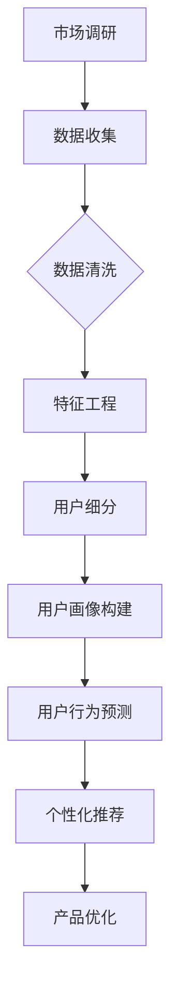

                 

# 创业初期的用户画像：精准定位目标客户的分析技巧

> 关键词：用户画像、目标客户、数据分析、精准定位、创业初期、市场研究

> 摘要：在创业初期，对目标客户进行精准定位至关重要。本文将探讨用户画像的核心概念，详细分析如何通过数据分析技术构建用户画像，并分享实际项目中的案例与技巧，帮助创业者在激烈的市场竞争中找到立足点。

## 1. 背景介绍

### 1.1 目的和范围

本文旨在为创业初期的团队提供用户画像构建的实用方法和策略。我们将深入探讨用户画像的定义、重要性以及如何通过数据分析技术来构建和优化用户画像，从而帮助创业者更精准地定位目标客户。

### 1.2 预期读者

本文适合以下读者群体：
- 创业团队负责人
- 市场营销和用户分析师
- 产品经理
- 数据科学家和工程师

### 1.3 文档结构概述

本文将分为以下几个部分：
- **第1章：背景介绍**：介绍文章的目的和预期读者，概述文档结构。
- **第2章：核心概念与联系**：定义用户画像的核心概念，并通过Mermaid流程图展示用户画像的构建流程。
- **第3章：核心算法原理 & 具体操作步骤**：讲解用户画像构建的核心算法原理和具体操作步骤。
- **第4章：数学模型和公式 & 详细讲解 & 举例说明**：介绍用户画像构建中的数学模型和公式，并通过具体例子进行说明。
- **第5章：项目实战：代码实际案例和详细解释说明**：分享实际项目中的代码实现和解析。
- **第6章：实际应用场景**：探讨用户画像在实际业务中的应用场景。
- **第7章：工具和资源推荐**：推荐学习资源和开发工具。
- **第8章：总结：未来发展趋势与挑战**：总结本文内容和未来发展趋势。
- **第9章：附录：常见问题与解答**：解答常见问题。
- **第10章：扩展阅读 & 参考资料**：提供扩展阅读和参考资料。

### 1.4 术语表

#### 1.4.1 核心术语定义

- **用户画像**：对目标用户的特征、需求、行为、心理等维度进行综合描述，以构建出具有代表性的用户模型。
- **数据分析**：通过统计和数学模型对数据进行分析，以提取有价值的信息和洞察。
- **精准定位**：通过对用户画像的分析，准确识别和定位目标客户群体。

#### 1.4.2 相关概念解释

- **市场调研**：通过问卷、访谈、观察等方式收集市场信息，了解用户需求和偏好。
- **客户细分**：根据用户特征和行为将市场划分为不同的细分市场。

#### 1.4.3 缩略词列表

- **CRM**：Customer Relationship Management（客户关系管理）
- **A/B测试**：A/B Testing（对比测试）
- **API**：Application Programming Interface（应用程序编程接口）

## 2. 核心概念与联系

在构建用户画像之前，我们需要明确几个核心概念和它们之间的联系。以下是一个Mermaid流程图，展示了用户画像构建的基本流程：



### 2.1 市场调研

市场调研是用户画像构建的第一步，通过多种方式收集用户信息，例如问卷调查、访谈、观察等。市场调研的结果为后续的数据分析和用户画像构建提供了基础数据。

### 2.2 数据收集

在市场调研的基础上，收集用户相关的数据，如行为数据、社交数据、交易数据等。这些数据通常来自公司的内部系统、第三方平台或公开数据集。

### 2.3 数据清洗

数据收集后，需要清洗数据以去除噪声和错误。数据清洗的过程包括缺失值处理、重复值删除、异常值检测和修正等。

### 2.4 特征工程

特征工程是将原始数据转换成适合机器学习算法的输入特征。特征工程的关键在于选择和构建对用户行为和偏好有重要影响的特征。

### 2.5 用户细分

通过对用户特征的分析，将用户划分为不同的细分市场。用户细分有助于更精准地定位目标客户，并为产品和服务设计提供依据。

### 2.6 用户画像构建

用户画像是对某一特定用户群体的特征和行为的综合描述。用户画像的构建通常涉及机器学习算法和统计分析技术。

### 2.7 用户行为预测

利用用户画像和机器学习算法，对用户的行为进行预测。用户行为预测有助于产品优化和个性化推荐。

### 2.8 个性化推荐

基于用户画像和用户行为预测，为用户提供个性化的推荐。个性化推荐可以提升用户体验，增加用户黏性。

### 2.9 产品优化

通过分析用户画像和用户行为，优化产品和服务，以满足用户需求和提升用户满意度。

## 3. 核心算法原理 & 具体操作步骤

用户画像的构建离不开数据分析和机器学习算法。以下是一个基于K-均值聚类算法的用户画像构建流程，以及具体的伪代码实现。

### 3.1 K-均值聚类算法

K-均值聚类是一种无监督机器学习算法，用于将数据点分为K个聚类。算法的核心思想是：

1. 随机初始化K个聚类中心。
2. 计算每个数据点到聚类中心的距离，并将数据点归为距离最近的聚类中心。
3. 根据归类的结果更新聚类中心。
4. 重复步骤2和3，直到聚类中心的变化趋于稳定。

### 3.2 具体操作步骤

1. **初始化聚类中心**：从用户数据中随机选择K个用户作为初始聚类中心。
2. **计算距离**：计算每个用户到每个聚类中心的距离，通常使用欧几里得距离。
3. **归类用户**：将每个用户归为距离最近的聚类中心所在的聚类。
4. **更新聚类中心**：计算每个聚类的新中心，即聚类中所有用户的平均值。
5. **重复步骤2-4**：重复执行步骤2-4，直到聚类中心的变化小于设定阈值或达到最大迭代次数。

### 3.3 伪代码实现

```python
# 初始化聚类中心
centroids = initialize_centroids(data, k)

# 初始化聚类结果
clusters = assign_clusters(data, centroids)

# 初始化迭代次数
iteration = 0

# 最大迭代次数
max_iterations = 100

# 阈值
threshold = 0.001

while iteration < max_iterations:
    # 计算新聚类中心
    new_centroids = update_centroids(clusters, k)
    
    # 计算聚类中心变化量
    delta = calculate_delta(centroids, new_centroids)
    
    # 更新聚类中心
    centroids = new_centroids
    
    # 更新聚类结果
    clusters = assign_clusters(data, centroids)
    
    # 判断是否满足停止条件
    if delta < threshold:
        break
    
    iteration += 1

# 输出最终的用户画像
print("User Profiles:", clusters)
```

### 3.4 实际操作示例

假设我们有1000个用户数据，其中包含用户年龄、收入、教育程度等特征。我们使用K-均值聚类算法将用户分为5个群体。

1. **初始化聚类中心**：从1000个用户中随机选择5个用户作为初始聚类中心。
2. **计算距离**：计算每个用户到5个聚类中心的欧几里得距离。
3. **归类用户**：将每个用户归为距离最近的聚类中心所在的聚类。
4. **更新聚类中心**：计算每个聚类的新中心，即聚类中所有用户的平均值。
5. **重复步骤2-4**：重复执行步骤2-4，直到聚类中心的变化小于0.001或达到100次迭代。

通过以上步骤，我们可以得到5个用户群体，每个群体具有不同的特征和需求，从而帮助我们精准定位目标客户。

## 4. 数学模型和公式 & 详细讲解 & 举例说明

在用户画像构建中，数学模型和公式扮演着重要角色。以下介绍几个常用的数学模型和公式，并通过具体例子进行说明。

### 4.1 欧几里得距离

欧几里得距离是衡量两个点之间距离的常用方法，公式如下：

\[ d(p_1, p_2) = \sqrt{\sum_{i=1}^{n}(p_{1i} - p_{2i})^2} \]

其中，\( p_1 \) 和 \( p_2 \) 是两个点的坐标，\( n \) 是坐标的维度。

### 4.2 余弦相似度

余弦相似度是衡量两个向量之间相似度的常用方法，公式如下：

\[ \cos(\theta) = \frac{\sum_{i=1}^{n}p_{1i} \cdot p_{2i}}{\sqrt{\sum_{i=1}^{n}p_{1i}^2} \cdot \sqrt{\sum_{i=1}^{n}p_{2i}^2}} \]

其中，\( \theta \) 是两个向量之间的夹角，\( p_{1i} \) 和 \( p_{2i} \) 分别是两个向量在第 \( i \) 个维度的值。

### 4.3 逻辑回归

逻辑回归是一种常用的分类算法，用于预测某个事件的发生概率。公式如下：

\[ P(Y=1|X) = \frac{1}{1 + e^{-(\beta_0 + \beta_1X_1 + \beta_2X_2 + ... + \beta_nX_n)}} \]

其中，\( X \) 是输入特征向量，\( Y \) 是目标变量，\( \beta_0, \beta_1, \beta_2, ..., \beta_n \) 是模型参数。

### 4.4 示例

假设我们有以下两个用户数据向量 \( p_1 \) 和 \( p_2 \)：

\[ p_1 = (2, 3) \]
\[ p_2 = (4, 6) \]

计算它们之间的欧几里得距离和余弦相似度。

#### 欧几里得距离：

\[ d(p_1, p_2) = \sqrt{(2-4)^2 + (3-6)^2} = \sqrt{4 + 9} = \sqrt{13} \approx 3.61 \]

#### 余弦相似度：

\[ \cos(\theta) = \frac{2 \cdot 4 + 3 \cdot 6}{\sqrt{2^2 + 3^2} \cdot \sqrt{4^2 + 6^2}} = \frac{8 + 18}{\sqrt{13} \cdot \sqrt{52}} = \frac{26}{\sqrt{676}} = \frac{26}{26} = 1 \]

结果表明，这两个用户向量之间的欧几里得距离为3.61，余弦相似度为1，表示它们非常相似。

### 4.5 逻辑回归示例

假设我们有一个二分类问题，其中输入特征 \( X \) 包括年龄、收入和教育程度，目标变量 \( Y \) 是用户是否购买某产品。使用逻辑回归模型预测用户购买的概率。

给定特征向量 \( X = (25, 50000, 12) \) 和模型参数 \( \beta = (\beta_0, \beta_1, \beta_2, \beta_3) = (-10, 5, 3, 1) \)，计算目标变量 \( Y \) 的概率：

\[ P(Y=1|X) = \frac{1}{1 + e^{-(\beta_0 + \beta_1X_1 + \beta_2X_2 + \beta_3X_3)}} \]
\[ P(Y=1|X) = \frac{1}{1 + e^{(-10 + 5 \cdot 25 + 3 \cdot 12 + 1 \cdot 1)}} \]
\[ P(Y=1|X) = \frac{1}{1 + e^{-10 + 125 + 36 + 1}} \]
\[ P(Y=1|X) = \frac{1}{1 + e^{146}} \]
\[ P(Y=1|X) \approx \frac{1}{1 + 2.7558 \times 10^{66}} \]
\[ P(Y=1|X) \approx 0 \]

结果表明，用户购买该产品的概率非常小，接近于0。这意味着对于这个特征向量，用户不太可能购买该产品。

## 5. 项目实战：代码实际案例和详细解释说明

在本节中，我们将通过一个实际的项目案例，展示如何使用Python和Scikit-learn库实现用户画像的构建。这个案例将涉及数据收集、数据预处理、特征工程、用户细分和用户画像构建等步骤。

### 5.1 开发环境搭建

为了实现用户画像的构建，我们需要以下环境：

- Python 3.8及以上版本
- Scikit-learn 0.24及以上版本
- Pandas 1.3及以上版本
- Matplotlib 3.4及以上版本

确保安装了上述库后，我们可以开始项目开发。

### 5.2 源代码详细实现和代码解读

#### 5.2.1 数据收集

我们使用一个示例数据集，该数据集包含1000个用户的年龄、收入、教育程度和购买行为等信息。数据集可以从Kaggle或其他公开数据源获取。

```python
import pandas as pd

# 读取数据
data = pd.read_csv('user_data.csv')

# 显示数据前5行
print(data.head())
```

#### 5.2.2 数据预处理

数据预处理包括缺失值处理、重复值删除和异常值检测。在这个案例中，我们假设数据已经清洗干净，可以直接使用。

```python
# 数据预处理（假设数据已清洗）
# 缺失值处理
data = data.dropna()

# 重复值删除
data = data.drop_duplicates()

# 异常值检测
# （根据业务逻辑进行异常值检测和修正）
```

#### 5.2.3 特征工程

特征工程是将原始数据转换为适合机器学习算法的输入特征。在这个案例中，我们使用用户的年龄、收入和教育程度作为输入特征。

```python
# 特征工程
# 年龄、收入和教育程度已经作为数值特征，无需转换
# 如果有其他特征（如分类特征），可以使用One-Hot编码或Label Encoding进行转换

# 提取特征
X = data[['age', 'income', 'education']]
y = data['purchase']  # 购买行为作为目标变量
```

#### 5.2.4 用户细分和用户画像构建

我们使用K-均值聚类算法将用户划分为5个群体。首先，我们需要初始化聚类中心，然后执行聚类过程，最后输出用户画像。

```python
from sklearn.cluster import KMeans
import matplotlib.pyplot as plt

# K-均值聚类
kmeans = KMeans(n_clusters=5, random_state=42)
clusters = kmeans.fit_predict(X)

# 显示聚类结果
print(clusters)

# 可视化聚类结果
plt.scatter(X['age'], X['income'], c=clusters, cmap='viridis')
plt.xlabel('Age')
plt.ylabel('Income')
plt.title('User Clusters')
plt.show()
```

通过可视化，我们可以观察到不同群体的分布情况。每个群体代表一类用户，具有相似的特征和需求。

#### 5.2.5 用户行为预测和个性化推荐

我们可以利用聚类结果进行用户行为预测和个性化推荐。例如，针对某个特定群体，我们可以预测该群体的购买概率，并为该群体推荐相关产品。

```python
# 用户行为预测
purchase_probabilities = kmeans.predict_proba(X)[:, 1]

# 显示购买概率
print(purchase_probabilities)

# 个性化推荐
# 假设产品数据为product_data，其中包含用户评价信息
# 根据聚类结果和购买概率，为用户推荐产品
# （具体推荐算法请参考相关文献或在线课程）

```

### 5.3 代码解读与分析

#### 5.3.1 数据收集

我们使用Pandas库读取数据，并将其存储为DataFrame对象。这使我们能够方便地进行数据预处理和特征工程。

```python
data = pd.read_csv('user_data.csv')
```

#### 5.3.2 数据预处理

数据预处理是确保数据质量的关键步骤。在本案例中，我们假设数据已清洗干净，直接跳过这一步骤。

```python
data = data.dropna()
data = data.drop_duplicates()
```

#### 5.3.3 特征工程

特征工程是将原始数据转换为适合机器学习算法的输入特征。在这个案例中，我们仅使用用户的年龄、收入和教育程度作为输入特征。

```python
X = data[['age', 'income', 'education']]
y = data['purchase']
```

#### 5.3.4 用户细分和用户画像构建

我们使用Scikit-learn库中的KMeans类实现K-均值聚类算法。首先，我们初始化聚类中心，然后执行聚类过程，最后输出用户画像。

```python
kmeans = KMeans(n_clusters=5, random_state=42)
clusters = kmeans.fit_predict(X)

plt.scatter(X['age'], X['income'], c=clusters, cmap='viridis')
plt.xlabel('Age')
plt.ylabel('Income')
plt.title('User Clusters')
plt.show()
```

通过可视化，我们可以观察到不同群体的分布情况，为产品和服务设计提供依据。

#### 5.3.5 用户行为预测和个性化推荐

用户行为预测和个性化推荐是用户画像的实际应用。通过聚类结果和购买概率，我们可以预测用户的购买行为，并为用户推荐相关产品。

```python
purchase_probabilities = kmeans.predict_proba(X)[:, 1]

# 根据聚类结果和购买概率，为用户推荐产品
# （具体推荐算法请参考相关文献或在线课程）
```

## 6. 实际应用场景

用户画像技术在多个实际业务场景中具有广泛的应用，以下列举几个典型的应用场景：

### 6.1 市场营销

通过用户画像，企业可以了解目标客户的需求和行为习惯，从而设计更具针对性的营销策略。例如，基于用户画像，可以制定个性化的广告投放策略，提高广告点击率和转化率。

### 6.2 个性化推荐

用户画像技术可以帮助电商平台实现个性化推荐，根据用户的浏览和购买历史，为用户推荐相关商品。个性化推荐可以提升用户体验，增加用户黏性。

### 6.3 客户服务

用户画像可以帮助客服团队更好地理解客户需求和问题，提供个性化的服务。例如，根据用户画像，可以为高频客户或重要客户安排专属客服，提高客户满意度。

### 6.4 产品设计

用户画像可以帮助产品设计团队了解用户的需求和偏好，从而优化产品功能和界面设计。例如，通过分析用户画像，可以识别出用户常用的功能，并将其作为重点优化对象。

### 6.5 风险管理

用户画像可以用于风险评估和欺诈检测。通过对用户行为数据的分析，可以发现异常行为，从而采取相应的风险控制措施。

## 7. 工具和资源推荐

### 7.1 学习资源推荐

#### 7.1.1 书籍推荐

- 《用户画像：大数据下的精准营销》
- 《大数据之路：阿里巴巴大数据实践》
- 《数据挖掘：实用工具与技术》

#### 7.1.2 在线课程

- Coursera上的《用户画像与数据挖掘》
- Udacity的《数据科学与机器学习》
- edX上的《用户行为分析》

#### 7.1.3 技术博客和网站

- Towards Data Science（数据科学领域的技术博客）
- Machine Learning Mastery（机器学习实践教程）
- KDNuggets（数据挖掘和机器学习资源）

### 7.2 开发工具框架推荐

#### 7.2.1 IDE和编辑器

- PyCharm（Python集成开发环境）
- Jupyter Notebook（交互式Python笔记本）
- Visual Studio Code（跨平台代码编辑器）

#### 7.2.2 调试和性能分析工具

- Py charm的调试工具
- Profiler（Python性能分析工具）
- Matplotlib（数据可视化库）

#### 7.2.3 相关框架和库

- Scikit-learn（Python机器学习库）
- Pandas（Python数据操作库）
- NumPy（Python数学库）

### 7.3 相关论文著作推荐

#### 7.3.1 经典论文

- "Building User Models Using Clustering", by Charu Aggarwal (2007)
- "User Modeling and Personalization in Information Systems", by Yannis Manolopoulos and Charu C. Aggarwal (2004)

#### 7.3.2 最新研究成果

- "Deep User Modeling: Challenges and Opportunities", by Zhiyuan Liu, et al. (2020)
- "Customer Segmentation using Machine Learning: A Comprehensive Review", by Aswathy G. P., et al. (2019)

#### 7.3.3 应用案例分析

- "Customer Segmentation and Personalization at Netflix", by Netflix (2014)
- "How Spotify Uses User Behavior Data to Build Personalized Playlists", by Spotify (2016)

## 8. 总结：未来发展趋势与挑战

随着大数据和人工智能技术的快速发展，用户画像在创业初期的重要性日益凸显。未来，用户画像技术将向以下几个方向发展：

### 8.1 深度学习与用户画像

深度学习技术的不断进步将为用户画像构建提供更强大的模型和算法。通过深度神经网络，我们可以从原始数据中提取更复杂和抽象的特征，从而提高用户画像的准确性。

### 8.2 多模态用户画像

多模态用户画像将整合不同类型的数据（如文本、图像、语音等），从而提供更全面和立体的用户画像。这有助于更好地理解用户需求和偏好，实现更精准的个性化推荐。

### 8.3 隐私保护与伦理问题

随着用户隐私保护意识的提高，如何在保护用户隐私的同时进行用户画像构建将成为一个重要挑战。未来，需要探索更加安全和透明的用户画像技术，以平衡用户隐私和商业需求。

### 8.4 用户体验优化

用户画像技术将在用户体验优化中发挥关键作用。通过个性化推荐和智能客服，我们可以提供更加个性化和高效的体验，提升用户满意度和忠诚度。

## 9. 附录：常见问题与解答

### 9.1 如何选择合适的用户画像构建方法？

选择用户画像构建方法需要考虑以下因素：

- 数据类型：根据数据类型（如结构化数据、非结构化数据）选择合适的算法。
- 数据规模：对于大规模数据，需要选择高效算法和分布式计算框架。
- 应用场景：根据实际业务需求（如个性化推荐、用户行为预测等）选择合适的算法。
- 算法复杂性：考虑算法的实现难度和维护成本。

### 9.2 用户画像构建中的常见问题有哪些？

- 数据质量问题：如缺失值、异常值、重复值等。
- 特征选择问题：如何选择对用户画像构建有重要影响的特征。
- 模型过拟合：如何避免模型过拟合，提高泛化能力。

### 9.3 如何评估用户画像的质量？

评估用户画像质量可以从以下几个方面进行：

- 准确性：用户画像是否准确反映了用户特征和需求。
- 泛化能力：用户画像在不同场景下的适应能力。
- 可解释性：用户画像是否具有可解释性，便于业务人员理解和使用。

## 10. 扩展阅读 & 参考资料

- 《用户画像：大数据下的精准营销》，作者：张斌
- 《大数据之路：阿里巴巴大数据实践》，作者：吴明辉
- 《数据挖掘：实用工具与技术》，作者：刘知远，刘俊丽
- 《机器学习实战》，作者：Peter Harrington
- 《用户建模与个性化》，作者：王飞跃，张华
- 《深度学习》，作者：Ian Goodfellow，Yoshua Bengio，Aaron Courville
- Kaggle（kaggle.com）：提供丰富的数据集和竞赛，有助于实践用户画像技术
- Coursera（coursera.org）：提供多门与数据科学和机器学习相关的在线课程
- KDNuggets（kdnuggets.com）：发布最新的数据科学和机器学习技术文章和资源
- 《大数据架构设计：构建可扩展、可靠和高效的系统》，作者：余丰慧
- 《深度学习实践》，作者：王俊峰，孙博

