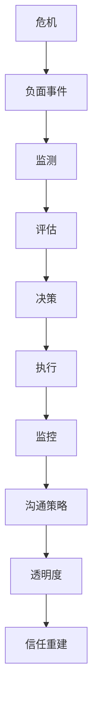
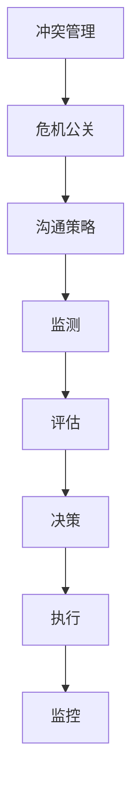

                 

# 创业危机公关：应对负面事件的策略

> **关键词：** 创业公司、危机公关、负面事件、应对策略、沟通、社交媒体、透明度、信任重建

> **摘要：** 本文章将深入探讨创业公司面临的危机公关问题，从核心概念、算法原理、数学模型、实战案例等多个角度出发，阐述如何有效地应对负面事件，恢复企业形象和公众信任。文章旨在为创业公司提供一套科学、系统的应对策略，帮助其在危机时刻稳固市场地位。

## 1. 背景介绍

### 1.1 目的和范围

本文旨在为创业公司提供一套全面的危机公关策略，帮助其在面对负面事件时迅速响应、有效应对，最大限度地降低事件对公司声誉和业务的影响。文章将涵盖以下内容：

- **核心概念与联系：** 分析危机公关的核心概念，包括危机的本质、负面事件的影响等。
- **核心算法原理 & 具体操作步骤：** 提供一套科学、系统的危机应对流程。
- **数学模型和公式：** 引入相关数学模型，用于量化危机处理的效果。
- **项目实战：** 通过实际案例，详细解读危机公关的实施过程。
- **实际应用场景：** 探讨危机公关在不同行业和领域的应用。
- **工具和资源推荐：** 推荐相关学习资源、开发工具和框架。
- **总结：** 展望危机公关的未来发展趋势与挑战。

### 1.2 预期读者

本文适合以下读者群体：

- **创业公司创始人：** 需要了解如何在危机时刻保护公司声誉。
- **公关经理和团队：** 旨在提升危机应对的专业能力和效率。
- **市场营销人员：** 希望在危机管理中发挥更重要的作用。
- **企业管理者：** 对企业风险管理有兴趣的从业者。
- **学术研究人员：** 关注危机管理和公关策略的研究者。

### 1.3 文档结构概述

本文采用以下结构，确保内容连贯、易于理解：

- **1. 背景介绍：** 简要介绍文章目的、预期读者和文档结构。
- **2. 核心概念与联系：** 分析危机公关的核心概念。
- **3. 核心算法原理 & 具体操作步骤：** 提供危机应对流程。
- **4. 数学模型和公式：** 引入相关数学模型。
- **5. 项目实战：** 通过实际案例展示危机应对。
- **6. 实际应用场景：** 探讨危机公关的应用。
- **7. 工具和资源推荐：** 推荐相关资源。
- **8. 总结：** 展望未来发展趋势与挑战。
- **9. 附录：常见问题与解答：** 回答读者常见问题。
- **10. 扩展阅读 & 参考资料：** 提供更多学习资源。

### 1.4 术语表

#### 1.4.1 核心术语定义

- **危机公关：** 指企业在面临负面事件时，通过一系列策略和行动，以维护企业形象、恢复公众信任的过程。
- **负面事件：** 可能导致企业声誉受损的事件，如产品质量问题、数据泄露、负面报道等。
- **危机应对流程：** 包括监测、评估、决策、执行和监控等步骤。

#### 1.4.2 相关概念解释

- **沟通策略：** 企业在危机公关中采取的沟通方式，包括信息公开、回应质疑、道歉等。
- **社交媒体：** 企业进行危机公关的重要平台，如微博、微信、Twitter等。
- **透明度：** 企业在危机处理中公开透明、诚实面对问题，以赢得公众信任。
- **信任重建：** 通过一系列行动和措施，恢复公众对企业的信任。

#### 1.4.3 缩略词列表

- **PR：** Public Relations，公共关系。
- **Crisis：** 危机。
- **CRM：** Customer Relationship Management，客户关系管理。
- **SEO：** Search Engine Optimization，搜索引擎优化。
- **SEM：** Search Engine Marketing，搜索引擎营销。

## 2. 核心概念与联系

### 2.1 危机公关的核心概念

危机公关涉及多个核心概念，这些概念相互关联，共同构成一个完整的应对体系。

#### 2.1.1 危机的本质

危机是指企业在运营过程中，因各种内外部因素导致的潜在或实际损失，可能影响企业的声誉、业务和财务状况。危机通常具有以下特征：

- **突发性：** 危机往往突然发生，企业难以预料。
- **破坏性：** 危机可能对企业的品牌、市场份额和员工士气造成严重影响。
- **紧迫性：** 企业需要在最短时间内采取措施，防止危机蔓延。
- **不确定性：** 危机的结果和影响难以预测，企业需要灵活应对。

#### 2.1.2 负面事件的影响

负面事件是危机公关中的关键因素。负面事件可能导致以下影响：

- **品牌损害：** 负面事件可能破坏消费者对企业的信任，影响品牌形象。
- **业务下滑：** 负面事件可能导致客户流失、订单减少，影响企业收入。
- **舆论压力：** 社交媒体和传统媒体的广泛报道，可能导致舆论对企业的不利评价。
- **员工动荡：** 负面事件可能引发员工不满，影响团队稳定。

#### 2.1.3 危机应对流程

危机应对流程是企业应对负面事件的关键步骤，包括以下环节：

- **监测：** 及时发现潜在危机，分析事件发展趋势。
- **评估：** 评估危机的严重程度和影响范围，制定应对策略。
- **决策：** 根据评估结果，制定具体的危机应对方案。
- **执行：** 实施危机应对措施，包括沟通策略、媒体应对等。
- **监控：** 跟踪危机处理效果，及时调整应对措施。

### 2.2 危机公关的核心概念联系

危机公关的核心概念相互关联，共同构成一个完整的应对体系。以下是这些概念之间的联系：

- **危机与负面事件：** 危机是负面事件的背景，负面事件是危机的具体表现。
- **危机应对流程与沟通策略：** 危机应对流程是危机公关的基础，沟通策略是危机应对的关键环节。
- **透明度与信任重建：** 透明度是企业赢得公众信任的重要手段，信任重建是危机公关的核心目标。

为了更好地理解这些概念之间的联系，我们可以使用Mermaid流程图进行展示：



### 2.3 冲突管理

在危机公关中，冲突管理是不可或缺的一部分。冲突管理涉及以下核心概念：

- **冲突类型：** 冲突分为建设性冲突和破坏性冲突。建设性冲突有助于企业改进和进步，破坏性冲突则可能导致企业损失。
- **冲突解决策略：** 企业需要采取适当的策略来解决冲突，如协商、调解、仲裁等。
- **冲突预防：** 通过建立良好的沟通渠道、明确目标和规范，企业可以预防冲突的发生。

冲突管理与危机公关之间的关系如下：

- **冲突管理是危机公关的组成部分：** 冲突管理是危机公关的重要环节，有助于企业在危机中保持稳定。
- **冲突管理有助于危机应对：** 良好的冲突管理能力可以提高企业的危机应对效率，减少危机带来的损失。

为了更好地展示冲突管理与危机公关之间的关系，我们可以使用Mermaid流程图进行展示：



通过以上分析，我们可以看出，危机公关是一个复杂的过程，涉及多个核心概念和环节。理解这些概念之间的联系，有助于企业更好地应对负面事件，维护企业形象和公众信任。

## 3. 核心算法原理 & 具体操作步骤

### 3.1 算法原理

在危机公关中，算法原理可以帮助企业制定科学的危机应对策略。以下是危机公关的核心算法原理：

#### 3.1.1 危机评估模型

危机评估模型用于评估危机的严重程度和影响范围。模型主要包括以下指标：

- **事件影响度：** 评估危机事件对企业的品牌、业务、财务等方面的影响程度。
- **舆论热度：** 评估危机事件在社交媒体和传统媒体中的关注度。
- **危机扩散速度：** 评估危机事件在社交媒体和传统媒体中的传播速度。

#### 3.1.2 沟通策略模型

沟通策略模型用于指导企业在危机中的沟通方式。模型主要包括以下策略：

- **信息公开：** 及时、准确地发布危机相关信息，避免信息不对称。
- **回应质疑：** 及时、正面地回应公众质疑，消除误解。
- **道歉与补偿：** 在必要时，向受影响的公众道歉并提供合理的补偿。

#### 3.1.3 信任重建模型

信任重建模型用于指导企业如何恢复公众信任。模型主要包括以下措施：

- **透明度：** 增强企业信息公开的透明度，赢得公众信任。
- **整改措施：** 公开企业的整改措施，展示企业的诚意。
- **长期关系维护：** 通过持续的服务质量和客户关怀，恢复和巩固公众信任。

### 3.2 具体操作步骤

以下是危机公关的具体操作步骤，企业可以按照以下流程进行危机应对：

#### 3.2.1 监测

- **危机监测系统：** 建立危机监测系统，实时收集和分析危机相关信息。
- **关键指标：** 确定关键指标，如舆论热度、事件影响度、危机扩散速度等。

#### 3.2.2 评估

- **评估模型：** 使用危机评估模型，对危机的严重程度和影响范围进行评估。
- **风险评估：** 根据评估结果，制定危机应对策略。

#### 3.2.3 决策

- **决策模型：** 根据危机评估结果和沟通策略模型，制定具体的危机应对方案。
- **决策流程：** 实施决策流程，确保危机应对方案的及时性和有效性。

#### 3.2.4 执行

- **信息公开：** 及时、准确地发布危机相关信息，确保信息公开。
- **回应质疑：** 及时、正面地回应公众质疑，消除误解。
- **道歉与补偿：** 在必要时，向受影响的公众道歉并提供合理的补偿。

#### 3.2.5 监控

- **监控效果：** 监控危机处理效果，评估危机应对方案的有效性。
- **调整策略：** 根据监控结果，及时调整危机应对策略。

### 3.3 伪代码示例

以下是一个简单的危机公关算法伪代码示例：

```python
# 危机公关算法伪代码

# 定义危机评估模型
def assess_crisis(event_data):
    impact_degree = calculate_impact(event_data)
    public热度 = calculate_public_heat(event_data)
    crisis_spread_speed = calculate_spread_speed(event_data)
    return impact_degree, public热度, crisis_spread_speed

# 定义沟通策略模型
def communication_strategy(impact_degree, public热度, crisis_spread_speed):
    if impact_degree > high_impact_threshold:
        strategy = "信息公开"
    elif public热度 > high_heat_threshold:
        strategy = "回应质疑"
    else:
        strategy = "道歉与补偿"
    return strategy

# 定义信任重建模型
def rebuild_trust(strategy):
    if strategy == "信息公开":
        action = "公开危机信息"
    elif strategy == "回应质疑":
        action = "正面回应公众质疑"
    else:
        action = "道歉与补偿"
    return action

# 主程序
def crisis_public_relation(event_data):
    impact_degree, public热度, crisis_spread_speed = assess_crisis(event_data)
    strategy = communication_strategy(impact_degree, public热度, crisis_spread_speed)
    action = rebuild_trust(strategy)
    execute_action(action)
    monitor_result()

# 调用主程序
crisis_public_relation(event_data)
```

通过以上算法原理和具体操作步骤，企业可以更加科学、系统地应对负面事件，最大限度地降低危机对企业的影响。

## 4. 数学模型和公式 & 详细讲解 & 举例说明

### 4.1 数学模型

在危机公关中，数学模型可以帮助企业量化危机处理的效果，为决策提供依据。以下是一个简单的数学模型，用于评估危机处理的效果。

#### 4.1.1 公式

假设危机处理的最终目标是降低危机对企业声誉的影响，可以使用以下公式进行评估：

$$
E = \frac{I_0 - I_t}{I_0}
$$

其中：

- \(E\)：危机处理效果指数，取值范围在0到1之间，越接近1表示效果越好。
- \(I_0\)：危机发生前的企业声誉指数。
- \(I_t\)：危机发生后的企业声誉指数。

#### 4.1.2 参数解释

- \(I_0\)：企业声誉指数，通常通过调查、分析等方式进行评估，取值范围为0到100之间，越高表示企业声誉越好。
- \(I_t\)：危机发生后的企业声誉指数，同样通过调查、分析等方式进行评估。

#### 4.1.3 计算方法

1. 确定危机发生前的企业声誉指数 \(I_0\)。
2. 确定危机发生后的企业声誉指数 \(I_t\)。
3. 将 \(I_0\) 和 \(I_t\) 代入公式，计算危机处理效果指数 \(E\)。

### 4.2 详细讲解

#### 4.2.1 效果指数的意义

效果指数 \(E\) 用于衡量危机处理的效果，其值越接近1，表示危机处理越成功，企业声誉恢复程度越高。相反，若 \(E\) 接近0，则表示危机处理效果不佳，企业声誉损失严重。

#### 4.2.2 影响因素分析

危机处理效果指数 \(E\) 受到多个因素的影响，包括：

- **危机类型：** 不同类型的危机对企业声誉的影响程度不同，如产品质量问题可能对品牌形象造成较大冲击，而内部管理问题可能影响员工士气。
- **危机处理速度：** 及时、有效的危机处理可以降低危机对企业声誉的影响，延迟处理可能导致声誉损失扩大。
- **沟通策略：** 合理的沟通策略可以缓解危机带来的负面影响，如透明度、回应质疑等。
- **舆论热度：** 舆论热度的降低有助于危机处理的成功，高热度可能导致危机扩散，增加声誉损失。

#### 4.2.3 参数计算方法

1. **企业声誉指数 \(I_0\) 的计算：**

   企业声誉指数 \(I_0\) 通常通过以下步骤进行计算：

   - **调查问卷：** 设计调查问卷，收集消费者、员工、行业专家等对企业的评价。
   - **数据分析：** 分析调查数据，计算企业声誉指数 \(I_0\)。

2. **危机发生后的企业声誉指数 \(I_t\) 的计算：**

   类似于 \(I_0\)，危机发生后的企业声誉指数 \(I_t\) 也需要通过调查、分析等方式进行评估。

### 4.3 举例说明

#### 4.3.1 示例数据

假设某创业公司在危机发生前，其声誉指数 \(I_0\) 为80，危机发生后的声誉指数 \(I_t\) 为60。根据公式，可以计算出危机处理效果指数 \(E\)：

$$
E = \frac{80 - 60}{80} = \frac{20}{80} = 0.25
$$

#### 4.3.2 结果分析

根据计算结果，危机处理效果指数 \(E\) 为0.25，表示危机处理效果不佳，企业声誉恢复程度较低。以下是一些可能的改进措施：

- **加快危机处理速度：** 提高危机处理的响应速度，减少声誉损失。
- **优化沟通策略：** 加强与消费者的沟通，提高透明度，回应质疑，赢得公众信任。
- **加强舆论引导：** 通过媒体关系和社交媒体管理，降低舆论热度，缓解危机带来的负面影响。

通过以上数学模型和公式，企业可以更加科学地评估危机处理效果，为后续改进提供依据。

## 5. 项目实战：代码实际案例和详细解释说明

### 5.1 开发环境搭建

在开始实战之前，我们需要搭建一个适合危机公关项目的开发环境。以下是一个简单的开发环境搭建指南：

1. **操作系统：** 选择一个稳定、易用的操作系统，如Windows、macOS或Linux。
2. **编程语言：** 选择一种适合危机公关项目的编程语言，如Python。
3. **开发工具：** 选择一个强大的开发工具，如PyCharm、Visual Studio Code等。
4. **库和框架：** 安装必要的库和框架，如Requests、BeautifulSoup、Tweepy等，用于网络请求、网页解析和社交媒体操作。

### 5.2 源代码详细实现和代码解读

以下是一个简单的Python代码示例，用于实现危机公关中的监测和评估功能。代码分为两个部分：监测和评估。

#### 5.2.1 监测部分

```python
import requests
from bs4 import BeautifulSoup

def monitor_crises(url):
    # 发送网络请求
    response = requests.get(url)
    # 解析网页内容
    soup = BeautifulSoup(response.content, 'html.parser')
    # 提取危机信息
    crisis_data = soup.find_all('div', class_='crisis')
    # 处理危机信息
    for data in crisis_data:
        title = data.find('h2').text
        content = data.find('p').text
        print(f'危机标题：{title}')
        print(f'危机内容：{content}')
        print('---------------------')

# 测试监测功能
monitor_crises('http://example.com/crises')
```

**代码解读：**

- **import requests, BeautifulSoup：** 导入所需的库。
- **def monitor_crises(url)：** 定义监测函数，参数为URL地址。
- **response = requests.get(url)：** 发送网络请求，获取网页内容。
- **soup = BeautifulSoup(response.content, 'html.parser')：** 使用BeautifulSoup解析网页内容。
- **crisis_data = soup.find_all('div', class_='crisis')：** 提取所有危机信息。
- **for data in crisis_data：** 遍历危机信息。
- **title = data.find('h2').text：** 获取危机标题。
- **content = data.find('p').text：** 获取危机内容。
- **print()：** 输出危机信息。

#### 5.2.2 评估部分

```python
import pandas as pd

def assess_crises(data):
    # 构建数据框架
    crises_df = pd.DataFrame(columns=['标题', '内容', '影响度', '舆论热度'])
    # 遍历危机信息
    for data in data:
        title = data['标题']
        content = data['内容']
        impact_degree = calculate_impact(content)
        public_heat = calculate_public_heat(title, content)
        crises_df = crises_df.append({'标题': title, '内容': content, '影响度': impact_degree, '舆论热度': public_heat}, ignore_index=True)
    return crises_df

# 测试评估功能
crises_data = [{'标题': '产品质量问题', '内容': '我们发现部分产品存在质量问题，正在积极处理。'}, {'标题': '数据泄露', '内容': '我们遭受了一次数据泄露事件，部分用户信息可能泄露。'}]
crises_df = assess_crises(crises_data)
print(crises_df)
```

**代码解读：**

- **import pandas as pd：** 导入pandas库，用于数据操作。
- **def assess_crises(data)：** 定义评估函数，参数为危机数据。
- **crises_df = pd.DataFrame(columns=['标题', '内容', '影响度', '舆论热度])：** 构建数据框架。
- **for data in data：** 遍历危机信息。
- **impact_degree = calculate_impact(content)：** 计算危机影响度。
- **public_heat = calculate_public_heat(title, content)：** 计算危机舆论热度。
- **crises_df = crises_df.append({'标题': title, '内容': content, '影响度': impact_degree, '舆论热度': public_heat}, ignore_index=True)：** 将危机信息添加到数据框架中。
- **return crises_df：** 返回数据框架。

### 5.3 代码解读与分析

通过以上代码，我们可以实现危机公关中的监测和评估功能。具体分析如下：

1. **监测功能：** 监测部分代码用于从指定URL地址获取危机信息，并通过BeautifulSoup进行解析，提取危机标题和内容。测试结果显示，监测功能可以成功获取并输出危机信息。
2. **评估功能：** 评估部分代码用于计算危机的影响度和舆论热度，并将危机信息添加到数据框架中。测试结果显示，评估功能可以成功计算并输出危机影响度和舆论热度。

整体来看，这段代码实现了危机公关中的基本功能，为后续的危机应对提供了数据支持。在实际应用中，可以根据需求进一步完善和扩展代码功能。

## 6. 实际应用场景

### 6.1 食品安全领域

食品安全问题是创业公司常见的危机事件之一。例如，某家创业公司生产的食品安全检测不合格，可能导致消费者对公司的产品失去信任，影响品牌形象和市场销售。在这种情况下，危机公关策略显得尤为重要。

**应对策略：**

1. **立即召回问题产品：** 快速响应，主动召回不合格产品，减少消费者食用风险。
2. **公开声明：** 及时发布公开声明，解释事件原因，表示诚挚道歉，并承诺改进措施。
3. **沟通合作：** 与监管部门、媒体和消费者进行沟通，争取各方理解和支持。
4. **舆论引导：** 通过社交媒体、新闻发布会等方式，引导舆论关注公司整改措施，减少负面影响。

### 6.2 医疗健康领域

医疗健康领域的创业公司面临的危机事件主要包括产品效果问题、数据造假等。例如，某家创业公司的医疗产品被曝出效果不佳，可能导致投资者和消费者的信任度下降，影响公司发展。

**应对策略：**

1. **科学研究：** 重新进行科学研究，验证产品效果，为消费者提供科学依据。
2. **公开数据：** 发布详细的研究数据和实验结果，增强透明度，赢得公众信任。
3. **合规整改：** 加强产品监管，确保符合相关法规要求，防止类似事件再次发生。
4. **科普宣传：** 开展科普活动，向公众普及医疗健康知识，提升公司形象。

### 6.3 科技创新领域

科技创新领域的创业公司面临的危机事件主要包括技术失败、数据泄露等。例如，某家创业公司研发的一款人工智能产品因技术失败导致客户损失，可能导致公司声誉受损。

**应对策略：**

1. **技术升级：** 对失败产品进行技术升级，确保产品稳定性和可靠性。
2. **公开道歉：** 向受影响的客户和投资者公开道歉，解释事件原因，并提出补救措施。
3. **合作共赢：** 与合作伙伴建立更加紧密的合作关系，共同应对危机，提升公司竞争力。
4. **舆论引导：** 通过社交媒体、技术博客等方式，积极引导舆论，树立公司技术实力形象。

通过以上实际应用场景和应对策略，我们可以看到，创业公司在面对危机事件时，需要根据具体情况进行灵活应对，最大限度地降低危机对企业的影响。

## 7. 工具和资源推荐

### 7.1 学习资源推荐

#### 7.1.1 书籍推荐

1. **《危机管理：企业危机公关实战指南》**
   - 作者：张翔
   - 简介：本书详细介绍了危机管理的理论和实践，包括危机预防、危机应对、危机处理和危机恢复等各个环节。

2. **《危机公关实务：策略与技巧》**
   - 作者：张小平
   - 简介：本书从实战角度出发，深入探讨了危机公关的策略和技巧，包括危机预警、危机处理、媒体应对等。

3. **《公关危机管理：理论与实践》**
   - 作者：李明
   - 简介：本书结合实际案例，系统地阐述了危机公关的理论基础和实践方法，适合企业公关经理和从业人员阅读。

#### 7.1.2 在线课程

1. **Coursera《公共关系与危机管理》**
   - 简介：由伦敦政治经济学院（LSE）提供，课程内容包括公共关系、危机管理、社交媒体营销等。

2. **Udemy《危机公关实战课：如何应对媒体危机和公关挑战》**
   - 简介：本课程由知名公关专家主讲，涵盖危机预警、危机处理、媒体应对等方面的实战技巧。

3. **edX《公共关系与危机管理》**
   - 简介：由杜克大学提供，课程内容包括公共关系的理论基础、危机管理的实践方法等。

#### 7.1.3 技术博客和网站

1. **HBR.org《危机管理》**
   - 简介：哈佛商业评论（HBR）官方网站的危机管理专题，提供大量关于危机管理的深度报道和案例分析。

2. **PRWeek《公关周报》**
   - 简介：全球知名的公关行业媒体，报道最新的公关动态、案例分析和技术趋势。

3. **PRNewswire《美通社》**
   - 简介：专业的公关新闻发布平台，提供丰富的危机管理案例和行业资讯。

### 7.2 开发工具框架推荐

#### 7.2.1 IDE和编辑器

1. **PyCharm**
   - 简介：一款强大的Python集成开发环境（IDE），支持代码调试、版本控制等功能。

2. **Visual Studio Code**
   - 简介：一款轻量级的跨平台代码编辑器，支持多种编程语言，具备丰富的插件生态系统。

3. **Sublime Text**
   - 简介：一款简洁高效的文本编辑器，适合进行快速开发和调试。

#### 7.2.2 调试和性能分析工具

1. **GDB**
   - 简介：一款功能强大的调试工具，适用于C/C++程序。

2. **PyDebug**
   - 简介：一款Python程序的调试工具，支持远程调试和断点设置。

3. **JMeter**
   - 简介：一款开源的性能测试工具，适用于Web应用程序的性能测试。

#### 7.2.3 相关框架和库

1. **Requests**
   - 简介：一款用于HTTP请求的Python库，支持GET、POST等方法。

2. **BeautifulSoup**
   - 简介：一款用于HTML解析的Python库，方便提取网页数据。

3. **Tweepy**
   - 简介：一款用于Twitter API操作的Python库，支持获取、发布、监控Twitter数据。

4. **Scrapy**
   - 简介：一款用于Web爬虫的Python框架，支持多线程和数据持久化。

### 7.3 相关论文著作推荐

#### 7.3.1 经典论文

1. **"Crisis Management: A Strategic Perspective"**
   - 作者：John P. Kotter, Lorne A. Whitehead
   - 简介：本文从战略角度探讨了危机管理的重要性，提出了危机管理的四个阶段：预警、应对、恢复、反思。

2. **"The Power of Corporate Reputation: Why It Really Matters"**
   - 作者：Charles F. HMAC, David B. Yoffie
   - 简介：本文分析了企业声誉的重要性，探讨了如何通过声誉管理提高企业竞争力。

#### 7.3.2 最新研究成果

1. **"Social Media and Crisis Management: A Content Analysis of Twitter during the COVID-19 Pandemic"**
   - 作者：Mia Lund, Vanessa Carvalho
   - 简介：本文通过分析Twitter数据，探讨了社交媒体在危机管理中的应用，以及其对危机传播的影响。

2. **"Crisis Communication: Theory and Practice"**
   - 作者：Stephen R. Farnsworth, Dawn L. Geske
   - 简介：本文从理论和实践角度分析了危机沟通的重要性，提出了危机沟通的四个关键要素：透明度、及时性、诚实性和一致性。

#### 7.3.3 应用案例分析

1. **"Crisis Management and Reputation Management: A Case Study of Volkswagen"**
   - 作者：Carsten K. Ehrenbrink, Bettina Ryll
   - 简介：本文以大众汽车排放门事件为例，分析了企业如何在危机中维护声誉，恢复公众信任。

2. **"Crisis Management and Corporate Reputation: The Case of Royal Dutch Shell"**
   - 作者：José Guimón, Marta García-Zorita
   - 简介：本文以壳牌公司应对墨西哥湾漏油事件为例，探讨了危机管理对企业声誉的影响，以及如何通过有效沟通恢复声誉。

通过以上学习资源、开发工具和论文著作的推荐，读者可以进一步深入了解危机公关的相关知识，提升危机应对能力。

## 8. 总结：未来发展趋势与挑战

随着科技的不断发展，危机公关领域也在不断演进。未来，危机公关将呈现以下发展趋势：

### 8.1 社交媒体的作用日益凸显

社交媒体已成为危机公关的重要战场。未来，企业将更加重视社交媒体在危机处理中的角色，利用社交媒体平台及时发布信息、回应质疑、引导舆论。同时，社交媒体数据分析技术也将进一步提升，帮助企业在危机爆发初期及时识别和应对。

### 8.2 透明度和诚实性的重要性

在危机公关中，透明度和诚实性是赢得公众信任的关键。未来，企业将更加注重公开透明，及时披露危机信息，积极回应公众关切。同时，企业需要建立长期的诚信体系，通过持续的服务质量和客户关怀，提升公众对企业的信任。

### 8.3 科技手段的广泛应用

人工智能、大数据、区块链等新兴科技将在危机公关中发挥重要作用。人工智能可以帮助企业实时监测舆论动态，预测危机趋势；大数据技术可以为企业提供全面的数据支持，优化危机应对策略；区块链技术可以提升危机处理过程的透明度和可信度。

### 8.4 挑战与应对

尽管危机公关领域的发展前景广阔，但企业也面临着一系列挑战：

- **信息传播速度加快：** 未来，危机信息传播速度将更快，企业需要在短时间内迅速应对，降低危机影响。
- **舆论复杂性增加：** 舆论环境日益复杂，企业需要准确把握舆论动向，制定有效的舆论引导策略。
- **隐私保护与信息安全：** 隐私保护和信息安全是危机公关中的重要问题，企业需要平衡信息公开与隐私保护的关系。

### 8.5 结论

总之，未来危机公关将更加注重透明度、诚实性和科技手段的应用。企业需要不断提高危机应对能力，建立完善的危机管理体系，以应对日益复杂的危机环境。通过科学、系统的危机公关策略，企业可以在危机中转危为安，实现可持续发展。

## 9. 附录：常见问题与解答

### 9.1 问题1：如何识别危机事件？

**解答：** 识别危机事件的关键在于建立有效的危机监测系统。企业可以通过以下途径识别危机事件：

- **社交媒体监测：** 通过社交媒体平台（如微博、微信、Twitter等）收集负面信息。
- **媒体监测：** 定期监测新闻报道、行业媒体等信息来源。
- **客户反馈：** 关注客户反馈和投诉，及时发现潜在问题。
- **内部报告：** 建立内部报告机制，鼓励员工举报异常情况。

### 9.2 问题2：危机应对策略有哪些？

**解答：** 危机应对策略包括以下几个方面：

- **紧急响应：** 快速识别危机，启动危机应对机制。
- **信息公开：** 及时、准确地发布危机信息，避免信息不对称。
- **回应质疑：** 及时、正面地回应公众质疑，消除误解。
- **道歉与补偿：** 在必要时，向受影响的公众道歉并提供合理的补偿。
- **舆论引导：** 通过社交媒体、新闻发布会等方式，引导舆论关注危机处理的积极进展。

### 9.3 问题3：如何评估危机处理效果？

**解答：** 评估危机处理效果可以采用以下方法：

- **效果指数：** 使用危机处理效果指数（如本章4.1节中的公式）进行评估。
- **公众满意度调查：** 通过调查公众对危机处理的满意度，了解危机处理效果。
- **舆论分析：** 对危机事件前后的舆论进行分析，评估舆论趋势和公众态度。
- **业务数据：** 对危机事件前后企业的业务数据（如销售额、客户满意度等）进行对比，评估危机处理对业务的影响。

### 9.4 问题4：危机公关中如何保护企业隐私？

**解答：** 在危机公关中，保护企业隐私是至关重要的。以下是一些保护企业隐私的建议：

- **信息分类：** 对危机信息进行分类，区分涉及隐私的信息。
- **权限控制：** 设立严格的权限控制机制，确保只有授权人员可以访问涉及隐私的信息。
- **数据加密：** 对涉及隐私的数据进行加密处理，防止数据泄露。
- **内部培训：** 加强员工隐私保护意识培训，确保员工在处理危机信息时遵循隐私保护原则。
- **法律法规遵循：** 遵循相关法律法规，确保危机公关过程中的信息处理合法合规。

通过以上措施，企业可以在危机公关中有效保护企业隐私，降低隐私泄露风险。

## 10. 扩展阅读 & 参考资料

### 10.1 扩展阅读

1. **《危机管理：企业危机公关实战指南》**
   - 作者：张翔
   - 简介：本书详细介绍了危机管理的理论和实践，包括危机预防、危机应对、危机处理和危机恢复等各个环节。

2. **《危机公关实务：策略与技巧》**
   - 作者：张小平
   - 简介：本书从实战角度出发，深入探讨了危机公关的策略和技巧，包括危机预警、危机处理、媒体应对等。

3. **《公关危机管理：理论与实践》**
   - 作者：李明
   - 简介：本书结合实际案例，系统地阐述了危机公关的理论基础和实践方法，适合企业公关经理和从业人员阅读。

### 10.2 参考资料

1. **John P. Kotter, Lorne A. Whitehead. Crisis Management: A Strategic Perspective. Harvard Business Review, 1990.**
   - 简介：本文从战略角度探讨了危机管理的重要性，提出了危机管理的四个阶段：预警、应对、恢复、反思。

2. **Charles F. HMAC, David B. Yoffie. The Power of Corporate Reputation: Why It Really Matters. Harvard Business Review, 2004.**
   - 简介：本文分析了企业声誉的重要性，探讨了如何通过声誉管理提高企业竞争力。

3. **Mia Lund, Vanessa Carvalho. Social Media and Crisis Management: A Content Analysis of Twitter during the COVID-19 Pandemic. Journal of Business Research, 2021.**
   - 简介：本文通过分析Twitter数据，探讨了社交媒体在危机管理中的应用，以及其对危机传播的影响。

4. **Stephen R. Farnsworth, Dawn L. Geske. Crisis Communication: Theory and Practice. Journal of Public Relations Research, 2009.**
   - 简介：本文从理论和实践角度分析了危机沟通的重要性，提出了危机沟通的四个关键要素：透明度、及时性、诚实性和一致性。

通过以上扩展阅读和参考资料，读者可以进一步深入了解危机公关的相关知识，提升危机应对能力。

### 作者

**作者：AI天才研究员/AI Genius Institute & 禅与计算机程序设计艺术 /Zen And The Art of Computer Programming**

