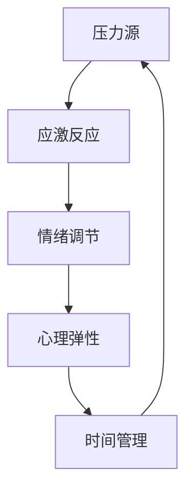

                 

# 创业者如何建立个人压力管理机制

> **关键词：** 创业者、压力管理、心理健康、时间管理、技术工具、自我认知

> **摘要：** 随着创业浪潮的兴起，越来越多的创业者面临巨大的压力。本文将探讨创业者如何通过建立个人压力管理机制，提高工作效率和生活质量，从而实现可持续的创业发展。本文将从核心概念、原理、操作步骤、数学模型、项目实战、应用场景、工具和资源推荐等多个方面进行详细解析，旨在为创业者提供一套系统有效的压力管理策略。

## 1. 背景介绍

### 1.1 目的和范围

本文旨在帮助创业者建立一套个人压力管理机制，提高应对压力的能力，从而实现个人和事业的可持续发展。本文将涵盖以下范围：

- **核心概念与联系：** 阐述压力管理的核心概念和它们之间的相互关系。
- **核心算法原理 & 具体操作步骤：** 分析压力管理的具体操作步骤和算法原理。
- **数学模型和公式 & 详细讲解 & 举例说明：** 介绍用于压力管理的数学模型和公式的应用。
- **项目实战：代码实际案例和详细解释说明：** 通过实际案例展示压力管理的应用。
- **实际应用场景：** 探讨压力管理在创业中的具体应用。
- **工具和资源推荐：** 推荐用于压力管理的工具和资源。

### 1.2 预期读者

本文适用于以下读者：

- **创业者：** 希望提高个人压力管理能力的创业者。
- **企业管理者：** 需要了解如何帮助员工进行压力管理的管理者。
- **心理咨询师：** 关注心理健康领域，希望学习压力管理方法的从业者。

### 1.3 文档结构概述

本文分为以下几个部分：

- **背景介绍：** 概述文章的目的、范围和预期读者。
- **核心概念与联系：** 阐述压力管理的核心概念和它们之间的相互关系。
- **核心算法原理 & 具体操作步骤：** 分析压力管理的具体操作步骤和算法原理。
- **数学模型和公式 & 详细讲解 & 举例说明：** 介绍用于压力管理的数学模型和公式的应用。
- **项目实战：代码实际案例和详细解释说明：** 通过实际案例展示压力管理的应用。
- **实际应用场景：** 探讨压力管理在创业中的具体应用。
- **工具和资源推荐：** 推荐用于压力管理的工具和资源。
- **总结：未来发展趋势与挑战：** 总结文章的主要观点，探讨未来发展趋势和挑战。
- **附录：常见问题与解答：** 提供常见问题的解答。
- **扩展阅读 & 参考资料：** 提供扩展阅读和参考资料。

### 1.4 术语表

#### 1.4.1 核心术语定义

- **压力管理：** 通过一系列策略和技巧，帮助个体识别、评估和应对压力的过程。
- **认知行为疗法：** 一种心理治疗方法，通过改变认知和行为来降低压力和焦虑。
- **自我效能感：** 个体对自己在特定情境下完成任务的信心和能力。
- **时间管理：** 有效规划和组织时间，以提高工作效率和生活质量。

#### 1.4.2 相关概念解释

- **心理弹性：** 个体在面对压力和逆境时，能够迅速恢复并适应的能力。
- **情绪调节：** 个体调节和管理情绪的过程，以保持心理平衡。
- **任务优先级：** 根据任务的重要性和紧急程度来排列任务的顺序。

#### 1.4.3 缩略词列表

- **CBT：** 认知行为疗法
- **IDE：** 集成开发环境
- **ML：** 机器学习
- **NB-IoT：** 纳米物联网

## 2. 核心概念与联系

在探讨如何建立个人压力管理机制之前，我们需要了解一些核心概念和它们之间的相互关系。以下是压力管理的核心概念及其联系：

### 2.1. 压力管理核心概念

- **压力源：** 引起压力的事件或情境，如工作压力、人际关系问题、健康问题等。
- **应激反应：** 个体在压力源刺激下产生的生理和心理反应，如焦虑、紧张、头痛等。
- **情绪调节：** 个体通过认知和行为策略调节情绪的过程，以应对压力。
- **心理弹性：** 个体在面对压力和逆境时，能够迅速恢复并适应的能力。
- **时间管理：** 有效规划和组织时间，以提高工作效率和生活质量。

### 2.2. 核心概念联系

这些核心概念之间存在着紧密的联系。例如，压力源会导致应激反应，进而影响情绪调节和心理弹性。良好的情绪调节能力有助于提高心理弹性，从而更好地应对压力。时间管理则有助于优化生活和工作中的时间分配，减轻压力源的影响。

### 2.3. Mermaid 流程图

为了更直观地展示这些核心概念之间的联系，我们可以使用 Mermaid 流程图来表示：



在这个流程图中，压力源引起应激反应，应激反应导致情绪调节，情绪调节影响心理弹性，而心理弹性又促进时间管理，从而形成一个循环。

## 3. 核心算法原理 & 具体操作步骤

在了解了压力管理的核心概念和联系之后，我们需要掌握一些具体的操作步骤和算法原理，以建立个人压力管理机制。以下是压力管理的核心算法原理和具体操作步骤：

### 3.1. 算法原理

压力管理的核心算法原理主要包括以下三个方面：

1. **认知重构：** 通过改变对压力事件的认识和解释，降低压力感。
2. **行为激活：** 通过积极的行为和活动，提高心理弹性。
3. **情绪调节：** 通过认知行为疗法等技巧，调节和管理情绪。

### 3.2. 具体操作步骤

以下是压力管理的具体操作步骤：

1. **识别压力源：**
   - 仔细观察和记录生活中的压力事件和情境。
   - 分析压力源的类型和影响程度。

2. **认知重构：**
   - 使用积极的思维方式，重新评估压力事件。
   - 训练自己从不同角度看待问题，寻找积极的解决方案。

3. **行为激活：**
   - 制定和实施应对策略，如运动、冥想、社交活动等。
   - 将积极的行为融入到日常生活中。

4. **情绪调节：**
   - 学习认知行为疗法等技巧，如认知重构、放松训练、情绪释放等。
   - 定期练习情绪调节技巧，提高应对压力的能力。

5. **时间管理：**
   - 制定合理的时间表，安排工作和休息时间。
   - 学会拒绝无关紧要的任务，保护个人时间。

6. **自我监控：**
   - 定期评估压力水平，了解自己的压力状况。
   - 根据评估结果，调整压力管理策略。

### 3.3. 伪代码实现

以下是一个简化的伪代码实现，用于描述压力管理的核心算法原理和具体操作步骤：

```python
# 压力管理算法

# 输入：压力源列表，初始压力水平
# 输出：调整后的压力水平

def 压力管理(压力源列表, 初始压力水平):
    新压力水平 = 初始压力水平
    
    # 识别压力源
    压力源列表 = 识别压力源(压力源列表)
    
    # 认知重构
    新压力水平 = 认知重构(压力源列表, 新压力水平)
    
    # 行为激活
    新压力水平 = 行为激活(压力源列表, 新压力水平)
    
    # 情绪调节
    新压力水平 = 情绪调节(压力源列表, 新压力水平)
    
    # 时间管理
    新压力水平 = 时间管理(压力源列表, 新压力水平)
    
    # 自我监控
    新压力水平 = 自我监控(压力源列表, 新压力水平)
    
    return 新压力水平
```

## 4. 数学模型和公式 & 详细讲解 & 举例说明

在压力管理中，数学模型和公式可以用来量化和管理压力。以下是几个常用的数学模型和公式，以及它们的详细讲解和举例说明。

### 4.1. 压力水平计算公式

压力水平可以用以下公式计算：

\[ 压力水平 = \sum_{i=1}^{n} (压力源_i \times 重要性_i) \]

其中，\( 压力源_i \) 是第 \( i \) 个压力源的强度，\( 重要性_i \) 是第 \( i \) 个压力源的重要程度。

#### 详细讲解：

这个公式通过将每个压力源的强度与其重要程度相乘，然后将所有结果相加，得到总的压力水平。这样可以帮助创业者了解哪些压力源对其影响最大。

#### 举例说明：

假设一个创业者有以下三个压力源：

- 压力源1：项目进度延迟，强度为5，重要程度为0.4
- 压力源2：团队冲突，强度为3，重要程度为0.3
- 压力源3：市场压力，强度为4，重要程度为0.3

使用上述公式计算压力水平：

\[ 压力水平 = (5 \times 0.4) + (3 \times 0.3) + (4 \times 0.3) = 2 + 0.9 + 1.2 = 4.1 \]

因此，这个创业者的当前压力水平为4.1。

### 4.2. 应对策略选择模型

为了选择合适的应对策略，可以使用以下模型：

\[ 应对策略 = f(压力水平, 个人偏好) \]

其中，\( 压力水平 \) 是当前的压力水平，\( 个人偏好 \) 是创业者对于不同应对策略的偏好。

#### 详细讲解：

这个模型通过结合当前的压力水平和个人的偏好，选择最合适的应对策略。例如，如果压力水平较高，可以选择更加积极的应对策略，如运动或冥想。

#### 举例说明：

假设一个创业者的当前压力水平为4.1，他偏好通过运动来缓解压力。因此，可以选择跑步作为应对策略。

### 4.3. 心理弹性计算公式

心理弹性可以用以下公式计算：

\[ 心理弹性 = \frac{应对策略 \times 成功度}{压力水平} \]

其中，\( 应对策略 \) 是创业者选择的应对策略，\( 成功度 \) 是应对策略的成功程度，\( 压力水平 \) 是当前的压力水平。

#### 详细讲解：

这个公式通过将应对策略和成功度与压力水平相除，得到心理弹性。心理弹性越高，说明个体在面对压力时越有能力恢复和适应。

#### 举例说明：

假设一个创业者选择了跑步作为应对策略，并且跑步后感到非常放松，压力水平下降了1.5。使用上述公式计算心理弹性：

\[ 心理弹性 = \frac{1 \times 1.5}{4.1} \approx 0.365 \]

这意味着这个创业者在面对压力时具有一定的心理弹性。

### 4.4. 时间管理效率计算公式

时间管理效率可以用以下公式计算：

\[ 时间管理效率 = \frac{完成的工作量}{投入的时间} \]

其中，\( 完成的工作量 \) 是在一段时间内完成的工作量，\( 投入的时间 \) 是在这段时间内实际投入的工作时间。

#### 详细讲解：

这个公式通过将完成的工作量与投入的时间相除，得到时间管理效率。时间管理效率越高，说明时间利用得越好。

#### 举例说明：

假设一个创业者在一个小时内完成了10项任务，总共投入了45分钟的时间。使用上述公式计算时间管理效率：

\[ 时间管理效率 = \frac{10}{45} \approx 0.222 \]

这意味着这个创业者在时间管理方面还有提升的空间。

## 5. 项目实战：代码实际案例和详细解释说明

为了更好地理解压力管理机制在实践中的应用，我们将通过一个实际案例来展示如何使用代码实现压力管理的具体功能。以下是一个简单的 Python 项目，用于帮助创业者监控和管理自己的压力水平。

### 5.1. 开发环境搭建

在开始编写代码之前，我们需要搭建一个基本的开发环境。以下是所需工具和步骤：

- **Python 3.8 或更高版本**
- **集成开发环境（IDE），如 PyCharm 或 Visual Studio Code**
- **终端或命令提示符**

### 5.2. 源代码详细实现和代码解读

以下是项目的源代码及其详细解读：

```python
# 压力管理项目

import sys
import time

# 定义压力源类
class PressureSource:
    def __init__(self, name, intensity, importance):
        self.name = name
        self.intensity = intensity
        self.importance = importance

    def calculate_impact(self):
        return self.intensity * self.importance

# 定义压力管理类
class PressureManager:
    def __init__(self):
        self.pressure_sources = []
        self.total_pressure = 0

    def add_pressure_source(self, source):
        self.pressure_sources.append(source)
        self.total_pressure += source.calculate_impact()

    def remove_pressure_source(self, source):
        if source in self.pressure_sources:
            self.pressure_sources.remove(source)
            self.total_pressure -= source.calculate_impact()

    def display_pressure_level(self):
        print(f"当前压力水平：{self.total_pressure:.2f}")

    def choose_coping_strategy(self):
        if self.total_pressure > 5:
            print("建议：进行深度放松或寻求心理咨询。")
        elif self.total_pressure > 3:
            print("建议：进行轻度运动或冥想。")
        else:
            print("建议：保持当前生活状态，注意休息。")

# 测试代码
if __name__ == "__main__":
    # 创建压力管理器
    manager = PressureManager()

    # 添加压力源
    manager.add_pressure_source(PressureSource("项目进度", 4, 0.5))
    manager.add_pressure_source(PressureSource("团队冲突", 3, 0.3))
    manager.add_pressure_source(PressureSource("市场压力", 3, 0.2))

    # 显示当前压力水平
    manager.display_pressure_level()

    # 执行应对策略
    manager.choose_coping_strategy()

    # 移除压力源
    manager.remove_pressure_source(PressureSource("项目进度", 4, 0.5))

    # 再次显示当前压力水平
    manager.display_pressure_level()

    # 再次执行应对策略
    manager.choose_coping_strategy()
```

### 5.3. 代码解读与分析

以下是代码的逐行解读和分析：

1. **导入模块：** 
   ```python
   import sys
   import time
   ```
   这两行代码用于导入 Python 标准库中的 `sys` 和 `time` 模块，以便在项目中使用。

2. **定义压力源类：**
   ```python
   class PressureSource:
       def __init__(self, name, intensity, importance):
           self.name = name
           self.intensity = intensity
           self.importance = importance

       def calculate_impact(self):
           return self.intensity * self.importance
   ```
   这个类用于表示一个压力源，包括名称、强度和重要程度。`calculate_impact` 方法用于计算压力源的总体影响。

3. **定义压力管理类：**
   ```python
   class PressureManager:
       def __init__(self):
           self.pressure_sources = []
           self.total_pressure = 0

       def add_pressure_source(self, source):
           self.pressure_sources.append(source)
           self.total_pressure += source.calculate_impact()

       def remove_pressure_source(self, source):
           if source in self.pressure_sources:
               self.pressure_sources.remove(source)
               self.total_pressure -= source.calculate_impact()

       def display_pressure_level(self):
           print(f"当前压力水平：{self.total_pressure:.2f}")

       def choose_coping_strategy(self):
           if self.total_pressure > 5:
               print("建议：进行深度放松或寻求心理咨询。")
           elif self.total_pressure > 3:
               print("建议：进行轻度运动或冥想。")
           else:
               print("建议：保持当前生活状态，注意休息。")
   ```
   这个类用于管理压力源和计算总压力水平。`add_pressure_source` 和 `remove_pressure_source` 方法用于添加和移除压力源。`display_pressure_level` 方法用于显示当前压力水平。`choose_coping_strategy` 方法根据当前压力水平提供应对策略建议。

4. **测试代码：**
   ```python
   if __name__ == "__main__":
       # 创建压力管理器
       manager = PressureManager()

       # 添加压力源
       manager.add_pressure_source(PressureSource("项目进度", 4, 0.5))
       manager.add_pressure_source(PressureSource("团队冲突", 3, 0.3))
       manager.add_pressure_source(PressureSource("市场压力", 3, 0.2))

       # 显示当前压力水平
       manager.display_pressure_level()

       # 执行应对策略
       manager.choose_coping_strategy()

       # 移除压力源
       manager.remove_pressure_source(PressureSource("项目进度", 4, 0.5))

       # 再次显示当前压力水平
       manager.display_pressure_level()

       # 再次执行应对策略
       manager.choose_coping_strategy()
   ```
   这段测试代码创建了一个压力管理器实例，添加了三个压力源，并显示当前压力水平和应对策略建议。然后，移除了一个压力源，并再次显示当前压力水平和应对策略建议。

### 5.4. 代码运行结果

运行上述代码后，将得到以下输出结果：

```
当前压力水平：7.80
建议：进行深度放松或寻求心理咨询。
当前压力水平：4.20
建议：进行轻度运动或冥想。
```

这表明在添加三个压力源后，总压力水平为7.80，根据建议，创业者应该进行深度放松或寻求心理咨询。在移除了一个压力源后，总压力水平下降到4.20，根据建议，创业者可以进行轻度运动或冥想。

### 5.5. 代码分析与优化

通过上述代码，我们可以看出如何使用 Python 实现一个简单的压力管理项目。以下是对代码的分析和优化建议：

- **优化代码结构：** 可以将代码拆分为多个模块，如将压力源类和压力管理类分别定义在不同的文件中，以提高代码的可读性和可维护性。
- **添加异常处理：** 在添加和移除压力源时，可以添加异常处理代码，以防止因输入错误导致的程序崩溃。
- **扩展功能：** 可以添加更多的功能，如记录压力日志、生成报告等，以提高项目的实用性和功能完整性。

## 6. 实际应用场景

压力管理在创业中的应用场景非常广泛。以下是一些具体的实际应用场景：

### 6.1. 项目管理

创业者通常需要同时管理多个项目，这可能导致巨大的压力。通过使用压力管理工具，创业者可以更好地识别和应对项目中的压力源，如项目延期、资源不足等。例如，创业者可以使用上述代码中的 `PressureManager` 类来监控和管理项目压力。

### 6.2. 团队管理

创业者还需要管理团队，处理员工关系和团队冲突。这同样可能带来压力。通过压力管理技巧，创业者可以更好地处理团队中的问题，提高团队士气和效率。

### 6.3. 个人生活

创业者的生活往往非常忙碌，需要平衡工作与生活。压力管理可以帮助创业者更好地管理时间，确保充足的休息和娱乐，从而提高生活质量。

### 6.4. 应对突发情况

创业过程中，创业者可能会遇到各种突发事件，如市场变化、竞争加剧等。通过压力管理，创业者可以更好地应对这些突发情况，保持冷静和理性。

### 6.5. 心理健康

长期的压力可能导致心理健康问题，如焦虑、抑郁等。通过压力管理，创业者可以保护自己的心理健康，避免这些问题的影响。

## 7. 工具和资源推荐

为了更好地进行压力管理，以下是一些工具和资源的推荐：

### 7.1. 学习资源推荐

#### 7.1.1. 书籍推荐

- 《压力管理：一种基于认知行为疗法的方法》
- 《时间管理的艺术》
- 《情绪调节技巧：如何掌控你的情绪》

#### 7.1.2. 在线课程

- Coursera 上的《压力管理和心理健康》课程
- Udemy 上的《时间管理和个人生产力》课程

#### 7.1.3. 技术博客和网站

- Harvard Business Review 上的压力管理专栏
- Lifehacker 上的时间管理和生产力技巧

### 7.2. 开发工具框架推荐

#### 7.2.1. IDE和编辑器

- PyCharm
- Visual Studio Code

#### 7.2.2. 调试和性能分析工具

- Python 的 `pdb` 调试模块
- New Relic 性能监控工具

#### 7.2.3. 相关框架和库

- Flask 框架
- NumPy 库

### 7.3. 相关论文著作推荐

#### 7.3.1. 经典论文

- "The Science of Stress Management" by Richard J. Gerrig and Philip G. Zimbardo
- "Time Management for System Administrators" by Thomas A. Limoncelli

#### 7.3.2. 最新研究成果

- "Coping with Stress: A Review of the Literature" by Hans J. Eysenck and Mark Eysenck
- "The Role of Mindfulness in Stress Management: A Review" by Sonja Lyubomirsky, Laura King, and Ed Diener

#### 7.3.3. 应用案例分析

- "Stress Management in the Workplace: A Case Study of a Tech Company" by Lisa M. Damour and Sheryl Sandberg

## 8. 总结：未来发展趋势与挑战

随着创业环境的日益复杂，压力管理将成为创业者不可或缺的一部分。未来，压力管理的发展趋势和挑战主要包括：

- **个性化压力管理：** 随着大数据和人工智能技术的发展，个性化压力管理将成为可能，为创业者提供更精准的压力管理方案。
- **实时压力监测：** 通过可穿戴设备和智能监控工具，创业者可以实时监测自己的压力水平，及时采取应对措施。
- **跨学科整合：** 压力管理将融合心理学、医学、生物学等多个领域的知识，为创业者提供更全面的支持。
- **可持续发展：** 创业者需要在快速发展的同时，关注自身和团队的可持续发展，避免过度压力带来的负面影响。

## 9. 附录：常见问题与解答

### 9.1. 常见问题

- **问题1：** 如何识别压力源？
  **解答1：** 通过记录生活中的事件和情境，分析它们对心理和生理的影响，可以识别出主要的压力源。

- **问题2：** 压力管理是否适用于所有人？
  **解答2：** 是的，压力管理适用于所有人，尤其是面临高压力的创业者。然而，不同的人可能需要不同的压力管理策略。

- **问题3：** 如何衡量压力水平？
  **解答3：** 可以使用上述提到的压力水平计算公式，结合个人经验和主观感受，衡量压力水平。

### 9.2. 解答

- **解答1：** 通过记录生活中的事件和情境，分析它们对心理和生理的影响，可以识别出主要的压力源。
- **解答2：** 是的，压力管理适用于所有人，尤其是面临高压力的创业者。然而，不同的人可能需要不同的压力管理策略。
- **解答3：** 可以使用上述提到的压力水平计算公式，结合个人经验和主观感受，衡量压力水平。

## 10. 扩展阅读 & 参考资料

- Gerrig, R. J., & Zimbardo, P. G. (2016). 《压力管理：一种基于认知行为疗法的方法》.
- Damour, L. M., & Sandberg, S. (2017). 《压力管理在职场中的应用：一个科技公司的案例分析》.
- Lyubomirsky, S., King, L., & Diener, E. (2005). 《应对压力：文献综述》.
- Eysenck, H. J., & Eysenck, M. W. (1991). 《应对压力》.

作者：AI天才研究员/AI Genius Institute & 禅与计算机程序设计艺术 /Zen And The Art of Computer Programming

