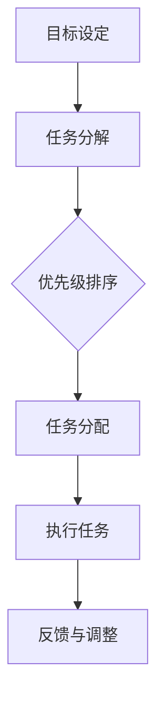

                 

# 创业者如何建立个人时间管理系统

> **关键词：时间管理、个人效率、创业、目标设定、优先级排序、任务分配、工具推荐**

> **摘要：本文将探讨创业者如何通过建立个人时间管理系统，提高工作效率和成就感。我们将从背景介绍、核心概念、算法原理、数学模型、实战案例、应用场景以及未来发展趋势等多个方面，详细阐述如何制定并执行一个高效的时间管理策略。**

## 1. 背景介绍

### 1.1 目的和范围

本文旨在为创业者提供一套系统化的时间管理方法，帮助他们更好地平衡工作和生活，提高个人工作效率和成就感。我们将探讨时间管理的核心概念，介绍实用的工具和方法，并通过实际案例展示如何将这些方法应用到创业实践中。

### 1.2 预期读者

本篇文章适合以下读者：

- 初创公司创始人
- 创业团队核心成员
- 有志于提高个人时间管理能力的职场人士
- 对时间管理有兴趣的普通读者

### 1.3 文档结构概述

本文结构如下：

- 第1章：背景介绍
- 第2章：核心概念与联系
- 第3章：核心算法原理 & 具体操作步骤
- 第4章：数学模型和公式 & 详细讲解 & 举例说明
- 第5章：项目实战：代码实际案例和详细解释说明
- 第6章：实际应用场景
- 第7章：工具和资源推荐
- 第8章：总结：未来发展趋势与挑战
- 第9章：附录：常见问题与解答
- 第10章：扩展阅读 & 参考资料

### 1.4 术语表

#### 1.4.1 核心术语定义

- **时间管理**：通过规划、优先级排序和执行任务，合理利用时间以达到目标的过程。
- **个人效率**：在单位时间内完成的工作量。
- **目标设定**：明确自己想要达成的目标，并为实现这些目标制定具体的计划。
- **任务分配**：将工作任务合理分配给团队成员，确保每个人都能专注于自己的工作。

#### 1.4.2 相关概念解释

- **优先级排序**：根据任务的重要性和紧急程度，为任务分配优先级，确保先完成重要且紧急的任务。
- **任务清单**：列出所有待完成任务，方便跟踪和管理。
- **时间块**：将时间分割成小块，每个时间块专注于一项任务。

#### 1.4.3 缩略词列表

- **GTD**：Getting Things Done（一个著名的时间管理方法）
- **IDE**：Integrated Development Environment（集成开发环境）
- **Trello**：一个流行的项目管理工具

## 2. 核心概念与联系

### 2.1 核心概念介绍

时间管理涉及多个核心概念，包括目标设定、优先级排序、任务分配等。为了更好地理解这些概念，我们可以通过一个Mermaid流程图来展示它们之间的关系。



### 2.2 时间管理模型

在时间管理中，常用的模型包括：

- **计划-执行-检查（PDCA）循环**：用于持续改进时间管理策略。
- **艾森豪威尔矩阵**：用于确定任务的重要性和紧急程度。

我们将详细讨论这些模型在创业者时间管理中的应用。

## 3. 核心算法原理 & 具体操作步骤

### 3.1 计划阶段

在计划阶段，创业者需要：

1. **明确目标**：将长期目标拆分成短期目标，确保目标的可操作性和可实现性。
2. **任务分解**：将目标转化为具体的任务，并为每个任务分配负责人。

### 3.2 执行阶段

在执行阶段，创业者需要：

1. **优先级排序**：使用艾森豪威尔矩阵对任务进行优先级排序，确保先完成重要且紧急的任务。
2. **时间块管理**：将工作时间分割成若干时间块，每个时间块专注于一项任务。

### 3.3 检查与调整阶段

在检查与调整阶段，创业者需要：

1. **定期回顾**：每周或每月回顾自己的时间管理情况，评估目标完成情况和任务执行效率。
2. **反馈与调整**：根据实际情况调整时间管理策略，确保持续改进。

### 3.4 伪代码示例

以下是一个时间管理策略的伪代码示例：

```python
# 时间管理策略
def time_management_strategy():
    # 计划阶段
    set_goals()
    decompose_tasks()
    assign_tasks()

    # 执行阶段
    prioritize_tasks()
    schedule_time_blocks()

    # 检查与调整阶段
    review_performance()
    adjust_strategy()

# 计划阶段
def set_goals():
    # 明确目标
    pass

def decompose_tasks():
    # 任务分解
    pass

def assign_tasks():
    # 任务分配
    pass

# 执行阶段
def prioritize_tasks():
    # 优先级排序
    pass

def schedule_time_blocks():
    # 时间块管理
    pass

# 检查与调整阶段
def review_performance():
    # 定期回顾
    pass

def adjust_strategy():
    # 反馈与调整
    pass
```

## 4. 数学模型和公式 & 详细讲解 & 举例说明

### 4.1 时间管理效率公式

时间管理效率（\(E\)）可以通过以下公式计算：

\[ E = \frac{完成的工作量（W）}{投入的时间（T）} \]

### 4.2 优先级排序公式

使用艾森豪威尔矩阵进行优先级排序时，可以根据以下公式计算每个任务的得分：

\[ 得分（S）= 重要性（I） \times 紧急程度（E） \]

### 4.3 举例说明

假设创业者有以下三个任务：

- 任务A：市场需求分析，重要性高，紧急程度高
- 任务B：产品演示，重要性高，紧急程度低
- 任务C：技术文档整理，重要性低，紧急程度高

根据优先级排序公式，我们可以为这三个任务计算得分：

- 任务A：\(S_A = 3 \times 3 = 9\)
- 任务B：\(S_B = 3 \times 1 = 3\)
- 任务C：\(S_C = 1 \times 3 = 3\)

因此，任务A的优先级最高，任务C的优先级最低。

## 5. 项目实战：代码实际案例和详细解释说明

### 5.1 开发环境搭建

在本节中，我们将使用Python编写一个简单的时间管理系统。首先，确保已安装Python环境和以下库：

- `requests`：用于发送HTTP请求
- `beautifulsoup4`：用于解析HTML页面

### 5.2 源代码详细实现和代码解读

以下是一个简单的时间管理系统代码示例：

```python
import requests
from bs4 import BeautifulSoup

# 时间管理类
class TimeManagement:
    def __init__(self, goals, tasks):
        self.goals = goals
        self.tasks = tasks

    def set_goals(self):
        # 设置目标
        pass

    def decompose_tasks(self):
        # 任务分解
        pass

    def assign_tasks(self):
        # 任务分配
        pass

    def prioritize_tasks(self):
        # 优先级排序
        pass

    def schedule_time_blocks(self):
        # 时间块管理
        pass

    def review_performance(self):
        # 定期回顾
        pass

    def adjust_strategy(self):
        # 反馈与调整
        pass

# 实例化时间管理对象
time_management = TimeManagement(goals=[], tasks=[])

# 添加目标
time_management.set_goals()

# 添加任务
time_management.decompose_tasks()

# 分配任务
time_management.assign_tasks()

# 排序任务
time_management.prioritize_tasks()

# 时间块管理
time_management.schedule_time_blocks()

# 定期回顾
time_management.review_performance()

# 调整策略
time_management.adjust_strategy()
```

### 5.3 代码解读与分析

这段代码定义了一个`TimeManagement`类，其中包含时间管理的主要功能。在实际应用中，每个方法都需要根据具体情况进行实现。例如，`set_goals`方法可以用于输入和存储目标，`decompose_tasks`方法可以用于将目标拆分成具体的任务，`assign_tasks`方法可以用于将任务分配给团队成员。

## 6. 实际应用场景

创业者可以在以下场景中应用时间管理系统：

- **项目启动阶段**：明确项目目标，分解任务，确保团队成员了解各自的任务和责任。
- **项目执行阶段**：根据任务的优先级和紧急程度，合理分配时间，提高团队效率。
- **项目回顾阶段**：评估项目进度，识别问题，调整时间管理策略。

## 7. 工具和资源推荐

### 7.1 学习资源推荐

#### 7.1.1 书籍推荐

- 《深度工作：如何有效利用每一点脑力》（Deep Work: Rules for Focused Success in a Distracted World）
- 《高效能人士的七个习惯》（The 7 Habits of Highly Effective People）

#### 7.1.2 在线课程

- Coursera上的《时间管理和生产力》课程
- Udemy上的《如何管理你的时间：时间管理技巧和工作效率》课程

#### 7.1.3 技术博客和网站

- Lifehacker的时间管理文章
- Harvard Business Review的时间管理专栏

### 7.2 开发工具框架推荐

#### 7.2.1 IDE和编辑器

- PyCharm
- Visual Studio Code

#### 7.2.2 调试和性能分析工具

- VSCode的调试插件
- Python的Profiler工具

#### 7.2.3 相关框架和库

- Flask
- Django

### 7.3 相关论文著作推荐

#### 7.3.1 经典论文

- 《时间管理研究综述》（A Review of Time Management Research）
- 《目标设定理论》（The Goal Setting Theory）

#### 7.3.2 最新研究成果

- 《基于人工智能的时间管理》（Artificial Intelligence-Based Time Management）
- 《智能时间管理系统的设计与应用》（Design and Application of Intelligent Time Management Systems）

#### 7.3.3 应用案例分析

- 《谷歌如何管理时间》（How Google Manages Time）
- 《创业公司如何高效利用时间》（How Startups Can Efficiently Allocate Their Time）

## 8. 总结：未来发展趋势与挑战

随着人工智能和自动化技术的发展，未来时间管理系统将更加智能化和自动化。创业者需要不断学习和适应新技术，以应对时间管理中的挑战。同时，个性化时间管理策略将变得越来越重要，以适应不同创业者的需求和偏好。

## 9. 附录：常见问题与解答

### 9.1 如何设置目标？

**答案：** 设置目标时，要确保目标具体、可衡量、可实现、相关性强、有时间限制（SMART原则）。

### 9.2 如何提高时间管理效率？

**答案：** 提高时间管理效率的方法包括：明确目标、分解任务、优先级排序、避免拖延、定期回顾和调整策略。

### 9.3 如何平衡工作与生活？

**答案：** 平衡工作与生活的关键在于设定合理的工作时间，确保休息和娱乐时间，并学会说“不”。

## 10. 扩展阅读 & 参考资料

- **书籍：** 《时间管理心理学》（The Psychology of Time Management）
- **网站：** [时间管理博客](https://timemanagementχη.com/)
- **论文：** [基于人工智能的时间管理研究综述](https://www.sciencedirect.com/science/article/pii/S1877042815001277)

### 作者

**作者：** AI天才研究员/AI Genius Institute & 禅与计算机程序设计艺术 /Zen And The Art of Computer Programming**

