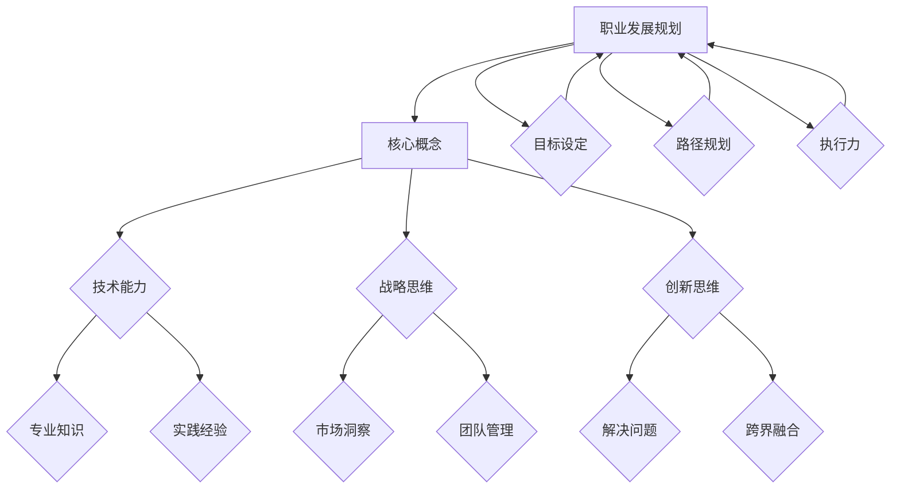
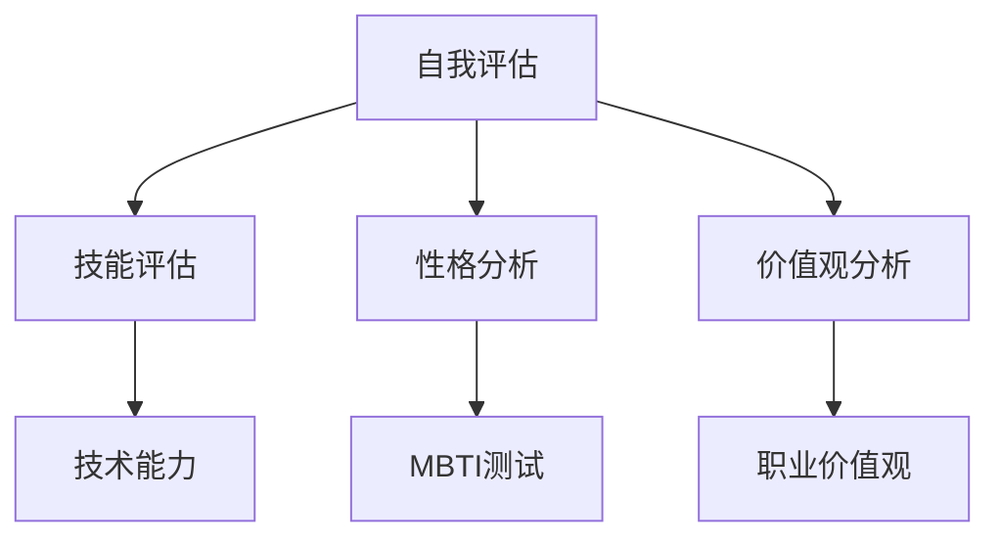
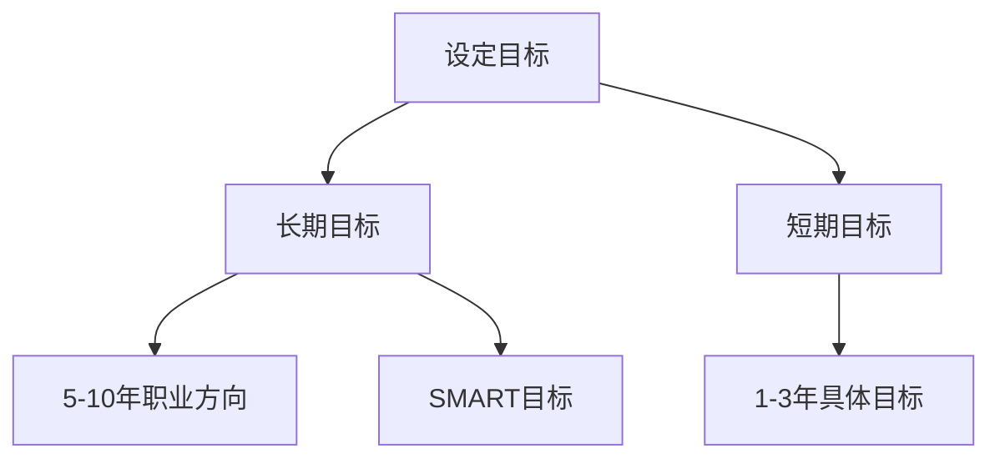
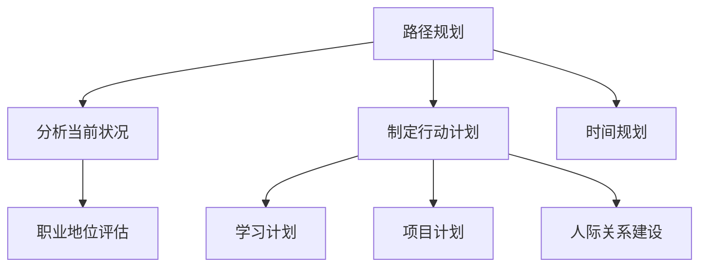
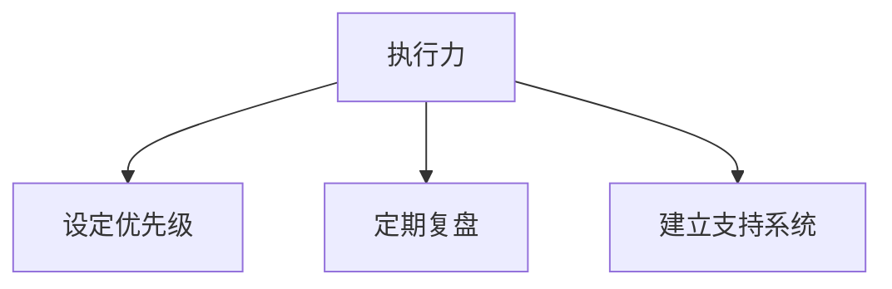
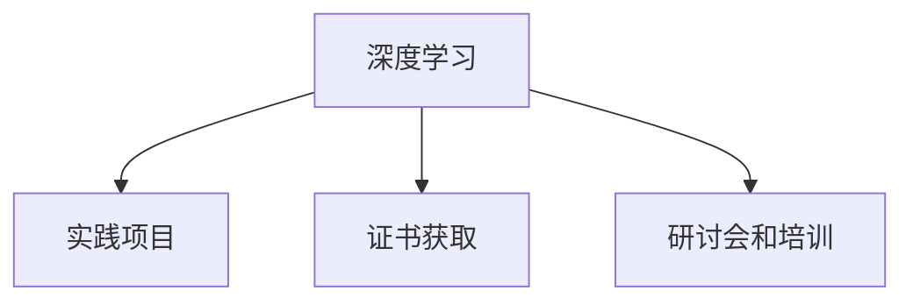
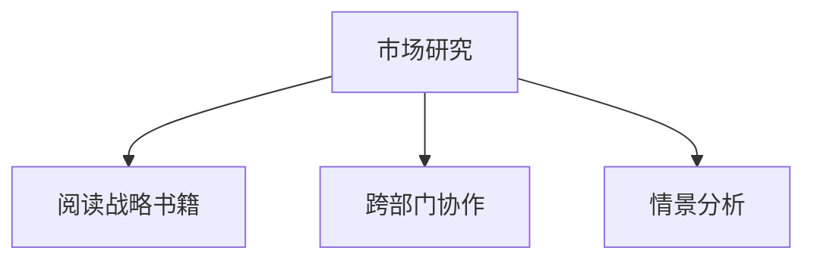
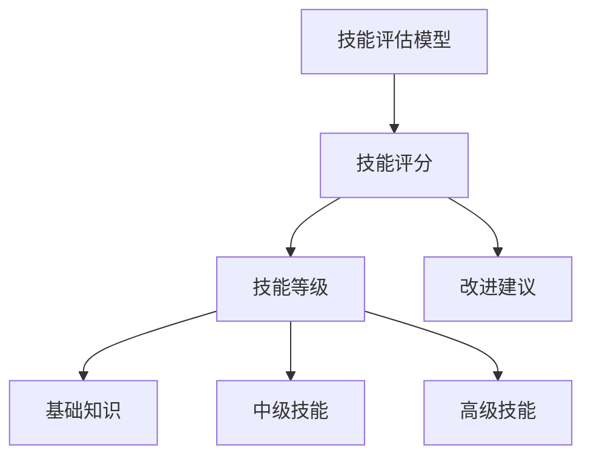
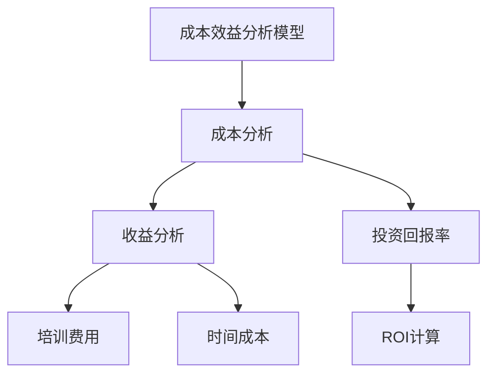
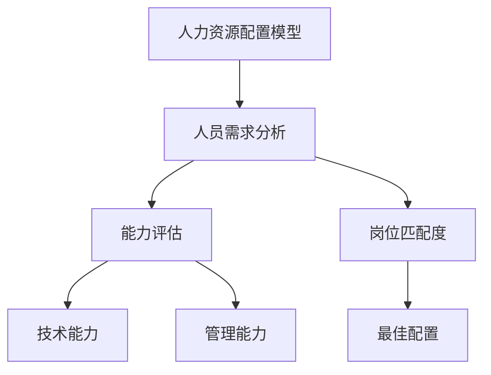

                 

# 创业者如何建立个人职业发展规划和能力提升路径

> **关键词**：职业发展规划、能力提升、创业者、技术能力、战略思维、创新思维、执行力
> 
> **摘要**：本文将深入探讨创业者如何制定和实施个人职业发展规划，以及如何通过不断学习和实践提升自身能力。文章将分为几个关键部分，首先介绍职业发展规划的重要性和基本步骤，接着讨论提升技术能力和战略思维的方法，最后给出实际案例和推荐资源，帮助创业者更好地实现职业目标。

## 1. 背景介绍

### 1.1 目的和范围

本文旨在帮助创业者明确职业发展规划的重要性，提供一套系统的方法论，以便他们能够更好地制定和执行个人职业发展计划。文章将覆盖以下主题：

- 职业发展规划的核心原则
- 提升技术能力和战略思维
- 实战案例与资源推荐
- 未来发展趋势与挑战

通过这篇文章，创业者将能够更清晰地认识到自己在职业道路上的定位，找到合适的发展路径，并不断提升自身能力，为创业成功奠定坚实基础。

### 1.2 预期读者

本文适用于以下读者群体：

- 初创公司创始人
- 高级技术工程师，有意向成为创业者
- 管理层人员，希望提升团队领导力和战略思维能力
- 对职业发展规划和自我提升感兴趣的技术爱好者

无论您是刚刚开始创业的初级创业者，还是已经在行业中有一定经验的高级从业者，本文都将为您提供宝贵的指导和建议。

### 1.3 文档结构概述

本文将按照以下结构展开：

1. 背景介绍
   - 目的和范围
   - 预期读者
   - 文档结构概述
   - 术语表
2. 核心概念与联系
   - 创业者职业发展规划核心概念
   - 职业发展规划流程图
3. 核心算法原理 & 具体操作步骤
   - 制定职业发展规划的步骤
   - 提升技术能力和战略思维的策略
4. 数学模型和公式 & 详细讲解 & 举例说明
   - 数学模型在职业规划中的应用
5. 项目实战：代码实际案例和详细解释说明
   - 职业发展规划实际案例
6. 实际应用场景
   - 创业过程中的职业规划应用
7. 工具和资源推荐
   - 学习资源
   - 开发工具框架
   - 相关论文著作
8. 总结：未来发展趋势与挑战
9. 附录：常见问题与解答
10. 扩展阅读 & 参考资料

### 1.4 术语表

#### 1.4.1 核心术语定义

- **职业发展规划**：指个人为了实现职业目标，系统性地制定和实施的行动计划。
- **技术能力**：指个人在特定技术领域的知识、技能和经验。
- **战略思维**：指个人在处理复杂问题时，从宏观角度进行思考和规划的能力。
- **创新思维**：指个人在解决问题时，能够提出新颖、有效解决方案的能力。

#### 1.4.2 相关概念解释

- **职业目标**：指个人在职业生涯中期望达到的具体成就。
- **能力提升**：指个人通过学习、实践等方式，不断提高自身在各个方面的能力。

#### 1.4.3 缩略词列表

- **CTO**：首席技术官
- **CEO**：首席执行官
- **IDE**：集成开发环境

## 2. 核心概念与联系

在讨论创业者如何建立个人职业发展规划和能力提升路径之前，有必要先明确一些核心概念和它们之间的联系。以下是一个Mermaid流程图，用于描述这些概念及其关系。



### 2.1 职业发展规划的核心概念

**职业发展规划**是创业者成功的关键因素之一。它不仅关乎个人的职业成长，还影响到整个团队的绩效和公司的发展。以下是职业发展规划中涉及的核心概念：

1. **目标设定**：明确个人和团队在职业发展中的目标，包括短期和长期目标。
2. **路径规划**：制定实现目标的策略和步骤，确保每个阶段都有明确的方向和行动计划。
3. **执行力**：确保制定的计划得到有效执行，不断调整和优化，以适应不断变化的环境。

**技术能力**是职业发展的基础。它包括：

- **专业知识**：在特定技术领域具备深厚的理论知识和实践经验。
- **实践经验**：通过实际项目和工作积累的经验，提升问题解决能力和实际操作技能。

**战略思维**是职业发展的关键能力。它包括：

- **市场洞察**：对市场趋势和竞争态势有深入的理解和判断。
- **团队管理**：能够有效管理团队，协调各方资源，确保团队目标的实现。

**创新思维**是职业发展的驱动力。它包括：

- **解决问题**：在面对复杂问题时，能够提出创新、有效的解决方案。
- **跨界融合**：能够将不同领域的知识和方法融合，产生新的价值。

通过以上核心概念的相互作用，创业者能够更好地制定和执行个人职业发展规划，不断提升自身能力，为创业成功奠定坚实基础。

## 3. 核心算法原理 & 具体操作步骤

### 3.1 制定职业发展规划的步骤

制定职业发展规划需要一系列明确的步骤，这些步骤不仅有助于明确个人目标，还能确保实现目标的路径具有可行性和可持续性。以下是制定职业发展规划的具体操作步骤：

#### 步骤 1：自我评估

**自我评估**是职业发展规划的第一步，它有助于创业者了解自己的优点、缺点、兴趣和职业价值观。以下是一些关键点：

1. **技能评估**：分析自己在技术领域的专业知识和实践经验。
2. **性格分析**：通过MBTI等性格测试，了解自己的性格特点，从而选择适合自己的职业方向。
3. **价值观分析**：明确自己在职业生涯中追求的价值观，如创新、团队协作、影响力等。



#### 步骤 2：设定目标

**设定目标**是职业发展规划的核心，明确的目标有助于创业者集中精力，确保每一阶段的努力都有方向。以下是设定目标的要点：

1. **长期目标**：设定未来5-10年的职业发展方向，例如成为某个技术领域的专家或创业者。
2. **短期目标**：设定未来1-3年的具体目标，如掌握某项新技术、完成某个项目等。
3. **SMART目标**：确保目标是具体（Specific）、可衡量（Measurable）、可实现（Achievable）、相关（Relevant）和有时限的（Time-bound）。



#### 步骤 3：路径规划

**路径规划**是将目标转化为具体行动的过程。以下是路径规划的关键步骤：

1. **分析当前状况**：评估当前的职业地位、资源和个人能力，找出差距和提升点。
2. **制定行动计划**：根据目标和现状，制定具体的行动计划，包括学习计划、项目计划、人际关系建设等。
3. **时间规划**：将每个行动计划分配到具体的时间段，确保在规定时间内完成。



#### 步骤 4：执行力

**执行力**是职业发展规划能否成功的关键。以下是提高执行力的几个策略：

1. **设定优先级**：将重要的任务放在优先位置，确保关键目标得到优先处理。
2. **定期复盘**：定期回顾自己的执行情况，找出不足和改进点。
3. **建立支持系统**：寻找导师或同行进行交流和指导，获得支持和反馈。



通过以上步骤，创业者可以系统地制定和实施个人职业发展规划，不断提升自身能力，为创业成功奠定坚实基础。

### 3.2 提升技术能力和战略思维的策略

在职业发展规划中，技术能力和战略思维是两个至关重要的方面。以下是一些具体策略，帮助创业者提升这些能力：

#### 3.2.1 技术能力的提升

**1. 深度学习**：选择一个特定的技术领域，进行深入学习和研究。例如，如果创业者是软件工程师，可以选择深入学习人工智能或区块链技术。

**2. 实践项目**：通过参与实际项目，将理论知识应用于实践中。例如，参与开源项目或自主开发一个应用。

**3. 证书获取**：获取相关证书，如PMP（项目管理专业人士认证）或AWS认证，以提高自己的专业水平。

**4. 参加研讨会和培训**：参加行业研讨会和技术培训，了解最新的技术动态和行业趋势。



#### 3.2.2 战略思维的提升

**1. 市场研究**：定期进行市场研究，了解竞争对手、客户需求和行业趋势。

**2. 阅读战略书籍**：阅读有关战略思维的书籍，如《竞争战略》、《蓝海战略》，学习成功企业的战略案例。

**3. 培养跨部门协作能力**：与不同部门的同事合作，了解公司的整体运营，提升战略思维。

**4. 演练情景分析**：通过模拟不同情况，分析可能的解决方案，培养应对复杂问题的能力。



通过以上策略，创业者可以不断提升自己的技术能力和战略思维，为职业发展奠定坚实基础。

## 4. 数学模型和公式 & 详细讲解 & 举例说明

### 4.1 数学模型在职业规划中的应用

在职业规划中，数学模型可以帮助创业者更好地理解自身的发展路径，以及如何优化资源配置。以下是几个常见的数学模型及其在职业规划中的应用：

#### 4.1.1 技能评估模型

**技能评估模型**用于评估创业者在技术领域的专业能力。以下是一个简单的技能评估模型：



**举例说明**：假设创业者对人工智能技术有初步了解，但需要提升高级技能。通过技能评估模型，创业者可以了解自己的技能等级，并获得相应的改进建议。

#### 4.1.2 成本效益分析模型

**成本效益分析模型**用于评估创业者在学习新技能或参加培训时的投资回报。以下是一个简单的成本效益分析模型：



**举例说明**：创业者计划参加一项人工智能高级课程，费用为10000元，预计学习时间为6个月，预期收益为提升30%的项目成功率。通过成本效益分析模型，创业者可以计算投资回报率，决定是否参加培训。

#### 4.1.3 人力资源配置模型

**人力资源配置模型**用于优化创业团队的人力资源配置，确保每个人都能发挥最大潜力。以下是一个简单的人力资源配置模型：



**举例说明**：创业者拥有一支由5名工程师和2名项目经理组成的团队。通过人力资源配置模型，创业者可以分析每个成员的技术能力和管理能力，为每个成员分配最合适的岗位。

通过这些数学模型，创业者可以更科学地制定职业发展规划，优化资源配置，提高团队整体效率。

## 5. 项目实战：代码实际案例和详细解释说明

### 5.1 开发环境搭建

在开始实际项目之前，我们需要搭建一个适合职业发展规划和技能提升的开发环境。以下是开发环境搭建的步骤：

#### 1. 系统环境安装

- 操作系统：Windows 10 / macOS / Linux
- 开发工具：Visual Studio Code / IntelliJ IDEA
- 版本控制工具：Git

#### 2. 安装必要软件和依赖库

- Python：安装Python 3.x版本，并配置Python环境。
- Docker：安装Docker，以便容器化部署项目。
- MySQL：安装MySQL数据库，用于存储数据。

#### 3. 配置代码库

在Git中创建一个新仓库，并克隆到本地：

```bash
git clone https://github.com/your-username/your-project.git
cd your-project
git checkout -b dev
```

### 5.2 源代码详细实现和代码解读

#### 5.2.1 项目结构

以下是项目的目录结构：

```plaintext
your-project/
|-- src/
|   |-- main.py
|   |-- app.py
|   |-- database/
|   |   |-- __init__.py
|   |   |-- database.py
|   |-- tests/
|   |   |-- __init__.py
|   |   |-- test_app.py
|-- requirements.txt
|-- Dockerfile
|-- .gitignore
```

#### 5.2.2 主代码文件实现

**main.py**：主程序文件，用于启动应用程序。

```python
# main.py
from app import app

if __name__ == '__main__':
    app.run(debug=True)
```

**app.py**：应用程序核心代码，实现业务逻辑。

```python
# app.py
from flask import Flask, jsonify, request
from database import Database

app = Flask(__name__)

db = Database()

@app.route('/')
def hello_world():
    return 'Hello, World!'

@app.route('/api/data', methods=['GET'])
def get_data():
    result = db.query("SELECT * FROM data_table;")
    return jsonify(result)
```

**database.py**：数据库操作模块。

```python
# database.py
import mysql.connector

class Database:
    def __init__(self):
        self.connection = mysql.connector.connect(
            host='localhost',
            user='root',
            password='password',
            database='your_database'
        )
        self.cursor = self.connection.cursor()

    def query(self, query):
        self.cursor.execute(query)
        result = self.cursor.fetchall()
        return result
```

#### 5.2.3 代码解读与分析

- **main.py**：负责启动Flask应用程序，并设置debug模式以便调试。
- **app.py**：实现Flask应用程序的核心逻辑，包括一个根路由`/`和一个API路由`/api/data`。
- **database.py**：封装MySQL数据库操作，简化数据库查询和插入操作。

### 5.3 代码解读与分析

以下是对项目代码的详细解读和分析：

#### 5.3.1 Flask应用程序架构

Flask是一个轻量级的Web应用程序框架，适用于快速开发和部署Web应用程序。应用程序通过`app.py`文件定义，包含以下关键组件：

- **Flask对象**：应用程序的核心，用于处理HTTP请求和响应。
- **路由**：定义URL与函数之间的映射关系，处理HTTP请求。
- **数据库操作**：通过`database.py`模块与MySQL数据库进行交互。

#### 5.3.2 数据库操作

`database.py`模块封装了MySQL数据库操作，包括连接数据库、执行SQL查询和获取结果。以下是一个简单的查询示例：

```python
# database.py
def query(self, query):
    self.cursor.execute(query)
    result = self.cursor.fetchall()
    return result
```

此方法接收一个SQL查询字符串作为输入，执行查询并返回查询结果。这种方法简化了数据库操作，使代码更易读、更易于维护。

#### 5.3.3 API路由实现

`app.py`文件中的API路由`/api/data`用于获取数据库中的数据。以下是一个简单的实现：

```python
# app.py
@app.route('/api/data', methods=['GET'])
def get_data():
    result = db.query("SELECT * FROM data_table;")
    return jsonify(result)
```

此路由使用`GET`方法响应HTTP请求，调用`database.py`模块中的`query`方法获取数据，并将结果序列化为JSON格式返回。

通过以上代码和解读，创业者可以了解如何使用Flask框架和MySQL数据库快速搭建一个简单的Web应用程序，为职业发展规划和技术能力提升提供实践经验。

## 6. 实际应用场景

在创业过程中，职业发展规划和能力提升是确保成功的关键因素。以下是一些实际应用场景，展示了如何将职业发展规划与创业实践相结合：

### 6.1 项目管理中的应用

在项目管理中，职业发展规划有助于创业者提升项目管理能力和执行力。例如，创业者可以通过以下步骤来应用职业发展规划：

1. **目标设定**：明确项目目标，如产品上线时间、预算、团队规模等。
2. **路径规划**：制定详细的项目计划，包括任务分解、时间表、资源分配等。
3. **执行力**：确保项目计划得到有效执行，定期监控项目进度，及时调整计划。

通过以上步骤，创业者可以确保项目在预算和时间范围内顺利完成，提升团队效率和项目成功率。

### 6.2 技术开发中的应用

在技术开发中，职业发展规划有助于创业者提升技术能力和创新能力。例如，创业者可以通过以下步骤来应用职业发展规划：

1. **技能评估**：评估自身在关键技术领域的技能水平，找出提升点。
2. **深度学习**：选择一个关键技术领域进行深入学习和研究，如人工智能、区块链等。
3. **实践项目**：参与实际项目，将所学知识应用于实践中，不断提升技术水平。

通过以上步骤，创业者可以不断积累技术经验，提升自身在技术领域的竞争力，为创业项目提供有力支持。

### 6.3 团队管理中的应用

在团队管理中，职业发展规划有助于创业者提升团队领导力和管理能力。例如，创业者可以通过以下步骤来应用职业发展规划：

1. **自我评估**：评估自身在团队管理方面的优点和不足。
2. **学习与管理**：通过阅读书籍、参加培训等方式，学习团队管理知识和技巧。
3. **实践与反馈**：在团队管理实践中不断总结经验，及时调整管理策略。

通过以上步骤，创业者可以提升团队协作效率，培养一支高效、有战斗力的团队，为创业成功奠定基础。

### 6.4 市场营销中的应用

在市场营销中，职业发展规划有助于创业者提升市场洞察力和创新能力。例如，创业者可以通过以下步骤来应用职业发展规划：

1. **市场研究**：定期进行市场研究，了解竞争对手、客户需求和行业趋势。
2. **创新思维**：通过创新思维训练，提出新颖的市场营销策略。
3. **执行力**：确保市场营销策略得到有效执行，及时调整策略以适应市场变化。

通过以上步骤，创业者可以更好地把握市场机会，提升品牌知名度和市场份额。

总之，在创业过程中，职业发展规划和能力提升是相辅相成的。通过系统地进行职业发展规划，创业者可以不断提升自身能力，为创业成功提供有力保障。

## 7. 工具和资源推荐

### 7.1 学习资源推荐

#### 7.1.1 书籍推荐

1. **《创业维艰》（"Hard Things About Hard Things" by Ben Horowitz）**
   - 作者Ben Horowitz是一位成功的创业者和投资人，本书详细描述了创业过程中的挑战和解决方法，对于创业者有极大的启发。

2. **《精益创业》（"The Lean Startup" by Eric Ries）**
   - 本书介绍了精益创业方法论，帮助创业者快速验证产品概念，降低创业风险。

3. **《智能创业》（"Smart Companies Succeed by Being Different" by A.G. Lafley and Roger L. Martin）**
   - 本书探讨如何通过差异化战略取得竞争优势，适合创业者了解市场定位和战略规划。

#### 7.1.2 在线课程

1. **Coursera的《创业：想法到市场》**
   - 该课程由斯坦福大学提供，涵盖创业的各个方面，包括市场研究、产品开发和营销策略。

2. **Udacity的《创业之路》**
   - 该课程提供系统性的创业指导，包括创业思维、产品设计、团队建设等。

3. **edX的《创业管理》**
   - 由MIT提供的课程，深入探讨创业过程中的管理挑战和解决方案。

#### 7.1.3 技术博客和网站

1. **Medium**
   - Medium上有许多创业者和行业专家分享的实战经验和见解，是学习创业知识的好去处。

2. **Product Hunt**
   - Product Hunt是一个展示新产品的地方，创业者可以了解最新的产品趋势和市场需求。

3. **TechCrunch**
   - TechCrunch是科技创业领域的权威媒体，提供最新的行业动态和深度分析。

### 7.2 开发工具框架推荐

#### 7.2.1 IDE和编辑器

1. **Visual Studio Code**
   - 跨平台开源编辑器，功能强大，支持多种编程语言。

2. **IntelliJ IDEA**
   - 功能丰富的Java和Python开发工具，提供强大的代码自动完成和调试功能。

3. **PyCharm**
   - 专为Python开发者设计的IDE，支持多种编程语言，提供全面的开发工具集。

#### 7.2.2 调试和性能分析工具

1. **Postman**
   - API调试和测试工具，适用于开发人员测试和调试API接口。

2. **JMeter**
   - 性能测试工具，用于测试Web应用程序的性能和负载能力。

3. **Docker**
   - 容器化平台，用于构建、部署和运行应用程序，提高开发和部署效率。

#### 7.2.3 相关框架和库

1. **Flask**
   - 轻量级Python Web框架，适合快速开发和部署Web应用程序。

2. **Django**
   - 高级Python Web框架，提供完整的开发工具集，适用于大型Web应用程序。

3. **React**
   - 用于构建用户界面的JavaScript库，适用于创建动态、响应式的Web应用。

### 7.3 相关论文著作推荐

#### 7.3.1 经典论文

1. **"The Lean Startup" by Eric Ries**
   - 本文介绍了精益创业方法论，对现代创业实践产生了深远影响。

2. **"Innovation and its Discontents" by Adam B. Jaffe and Josh Lerner**
   - 本文探讨了创新过程中面临的挑战和制度问题，提供了有益的启示。

3. **"The Lean Analytics" by Alistair Croll and Benjamin Yoskovitz**
   - 本文介绍了精益数据分析方法，帮助创业者通过数据驱动决策。

#### 7.3.2 最新研究成果

1. **"The Business Model Canvas" by Alex Osterwalder and Yves Pigneur**
   - 最新研究成果，提供了一种直观、实用的业务模型设计工具。

2. **"The Startup Playbook" by David S. Rose**
   - 介绍了创业者如何制定和实施成功的业务战略。

3. **"The Four Steps to the Epiphany" by Steve Blank**
   - 介绍了客户发展方法论，帮助创业者找到市场需求并快速迭代产品。

#### 7.3.3 应用案例分析

1. **"The Facebook Effect" by David Kirkpatrick**
   - 探讨了Facebook的创业故事，分析其成功的关键因素。

2. **"The Lean Analytics" by Alistair Croll and Benjamin Yoskovitz**
   - 通过案例分析，介绍了精益数据分析方法在创业中的应用。

3. **"The $100 Startup" by Chris Guillebeau**
   - 提供了100个创业成功案例，展示了如何通过小额投资实现创业梦想。

通过以上学习和资源推荐，创业者可以更好地了解创业领域的前沿知识和实践经验，为自己的职业发展规划提供有力支持。

## 8. 总结：未来发展趋势与挑战

在当前快速变化的商业环境中，创业者面临着前所未有的挑战和机遇。以下是未来职业发展规划和能力提升的主要发展趋势与挑战：

### 8.1 发展趋势

1. **数字化转型**：随着技术的飞速发展，创业者必须具备数字化转型的能力和意识。这包括对大数据、云计算、人工智能等新兴技术的掌握。

2. **全球化**：全球市场的开放和电子商务的发展使得创业者能够更容易地进入国际市场。跨文化沟通和管理能力成为必备技能。

3. **敏捷与创新**：敏捷管理和创新思维将更加重要。创业者需要不断适应市场变化，快速迭代产品和服务。

4. **可持续发展**：社会责任和可持续发展成为企业成功的核心要素。创业者需要关注环境保护、社会责任和经济效益的平衡。

### 8.2 挑战

1. **技术快速迭代**：技术更新速度加快，创业者需要不断学习新技能，以保持竞争力。

2. **市场竞争加剧**：市场竞争愈发激烈，创业者需要具备强大的战略规划和市场洞察力。

3. **资源限制**：初创企业通常资源有限，创业者需要学会如何高效利用有限的资源，实现最大化的效益。

4. **人才竞争**：吸引和留住人才成为一大挑战。创业者需要提升领导力和团队管理能力，建立企业文化，吸引并留住优秀人才。

### 8.3 应对策略

1. **持续学习**：保持对新兴技术的关注，不断学习新知识，提升自身技术能力和战略思维。

2. **跨领域合作**：与其他领域的企业和专家建立合作关系，实现资源互补，共同应对市场变化。

3. **创新驱动**：注重创新，不断尝试新的商业模式和业务模式，保持竞争优势。

4. **可持续发展**：注重社会责任和环境保护，实现可持续发展，提升品牌形象。

通过以上策略，创业者可以更好地应对未来发展的挑战，实现持续成长和成功。

## 9. 附录：常见问题与解答

### 9.1 如何平衡职业发展规划与日常工作？

**解答**：平衡职业发展规划与日常工作可以通过以下方法实现：

1. **目标明确**：确保职业发展规划的目标具体、可实现，与日常工作紧密结合。
2. **时间管理**：合理规划工作时间，确保工作与学习之间有平衡。
3. **优先级排序**：将重要且紧急的任务放在优先位置，确保关键工作得到完成。
4. **定期复盘**：定期评估职业发展进度，及时调整计划和策略。

### 9.2 如何提升团队领导力？

**解答**：提升团队领导力可以通过以下方法实现：

1. **培养团队精神**：建立积极向上的团队文化，鼓励团队成员合作和相互支持。
2. **明确期望**：为团队成员设定清晰的目标和期望，并提供必要的资源和支持。
3. **有效沟通**：通过定期会议、一对一沟通等方式，确保团队成员之间的信息畅通。
4. **激励与反馈**：及时给予团队成员正面的反馈和激励，提升团队士气。

### 9.3 如何持续学习新技能？

**解答**：持续学习新技能可以通过以下方法实现：

1. **制定学习计划**：根据职业发展规划，制定详细的学习计划，确保持续学习。
2. **利用在线资源**：利用在线课程、技术博客等资源，不断更新知识和技能。
3. **实践应用**：将所学知识应用于实际工作中，通过实践提升技能。
4. **建立学习小组**：与同行建立学习小组，相互学习、交流，共同进步。

### 9.4 如何管理时间和任务？

**解答**：管理时间和任务可以通过以下方法实现：

1. **制定日程表**：提前规划每天、每周和每月的任务，确保时间利用最大化。
2. **优先级排序**：根据任务的紧急程度和重要性进行排序，确保重要任务得到优先处理。
3. **使用工具**：使用任务管理工具（如Trello、Asana等），跟踪任务进度，提高工作效率。
4. **定期复盘**：定期评估任务完成情况，找出时间管理和任务管理中的不足，进行优化。

通过以上方法，创业者可以更好地管理时间和任务，确保职业发展规划的有效实施。

## 10. 扩展阅读 & 参考资料

创业者想要深入了解职业发展规划和能力提升，可以参考以下书籍、课程和论文：

### 10.1 书籍

1. **《精益创业》** by Eric Ries
   - 描述了精益创业方法论，帮助创业者快速验证产品概念。
2. **《创业维艰》** by Ben Horowitz
   - 描述了创业过程中的挑战和解决方法，提供了宝贵的实战经验。
3. **《智能创业》** by A.G. Lafley and Roger L. Martin
   - 探讨了如何通过差异化战略取得竞争优势。

### 10.2 在线课程

1. **Coursera的《创业：想法到市场》**
   - 覆盖创业的各个方面，包括市场研究、产品开发和营销策略。
2. **Udacity的《创业之路》**
   - 提供系统性的创业指导，包括创业思维、产品设计、团队建设等。
3. **edX的《创业管理》**
   - 探讨创业过程中的管理挑战和解决方案。

### 10.3 技术博客和网站

1. **Medium**
   - 分享创业者和行业专家的实战经验和见解。
2. **Product Hunt**
   - 展示最新的产品趋势和市场需求。
3. **TechCrunch**
   - 提供最新的行业动态和深度分析。

### 10.4 论文

1. **"The Lean Startup" by Eric Ries**
   - 介绍了精益创业方法论。
2. **"Innovation and its Discontents" by Adam B. Jaffe and Josh Lerner**
   - 探讨了创新过程中面临的挑战。
3. **"The Lean Analytics" by Alistair Croll and Benjamin Yoskovitz**
   - 介绍了精益数据分析方法。

通过以上资源和书籍，创业者可以更深入地了解职业发展规划和能力提升的各个方面，为自己的创业之路提供有力支持。

**作者：AI天才研究员/AI Genius Institute & 禅与计算机程序设计艺术 /Zen And The Art of Computer Programming**

