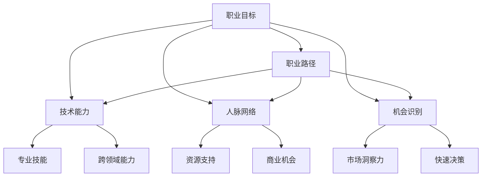

                 

# 创业者如何建立个人职业发展规划和路径

## 关键词
- 创业者
- 职业发展规划
- 职业路径
- 技术能力
- 人脉网络
- 机会识别

## 摘要

本文旨在为创业者提供一套系统化的个人职业发展规划和路径。文章将从核心概念、关键能力、规划步骤以及实际应用等多个角度进行深入探讨，帮助创业者明确自己的职业方向，提升自身竞争力，最终实现职业目标。文章首先介绍职业发展规划的重要性，随后详细解析创业者在职业发展过程中所需的核心能力和关键步骤，并通过实际案例分享和工具资源推荐，为创业者提供实用的指导。

## 1. 背景介绍

在当前快速变化的市场环境中，创业者面临着前所未有的挑战和机遇。成功创业不仅需要优秀的商业理念，更需要具备扎实的职业素质和持续发展的能力。职业发展规划在这个过程中起着至关重要的作用，它不仅能够帮助创业者明确自己的职业目标，还能够指导他们在职业生涯中不断成长和进步。

职业发展规划的核心在于帮助创业者从宏观和微观两个层面进行自我认知和评估。宏观层面，创业者需要了解自己的长期目标和职业愿景；微观层面，创业者需要具体规划每个阶段的发展步骤和行动策略。这样的规划能够使创业者更加专注于自身的职业成长，避免盲目行动和资源浪费。

在职业发展的过程中，创业者不仅要面对技术层面的挑战，还需要建立和维护广泛的人脉网络，识别和把握市场机会。因此，建立一套科学的职业发展规划和路径，对于创业者的成功至关重要。

## 2. 核心概念与联系

为了更好地理解职业发展规划，我们首先需要了解几个核心概念：职业目标、职业路径、技术能力、人脉网络和机会识别。

### 职业目标

职业目标是创业者在职业生涯中期望达到的最终状态。它通常包括职业级别、职位类型、薪资水平等多个方面。职业目标应该是具体、明确和具有挑战性的，这样才能激励创业者不断努力和进步。

### 职业路径

职业路径是指创业者在实现职业目标的过程中所采取的步骤和路径。职业路径不仅包括学习新技能、提升管理能力等职业发展活动，还包括跳槽、晋升等具体行动。

### 技术能力

技术能力是创业者成功创业的基础。技术能力不仅包括编程、产品设计等专业技能，还包括数据分析、项目管理等跨领域能力。技术能力的高低直接影响到创业者在市场中的竞争力和创新能力。

### 人脉网络

人脉网络是创业者成功的重要保障。人脉网络不仅能够提供创业所需的资源和支持，还能够为创业者带来商业机会和合作伙伴。建立和维护良好的人脉网络需要创业者投入大量时间和精力。

### 机会识别

机会识别是创业者的一项核心能力。在市场中，机会无处不在，但只有那些能够准确识别和把握机会的创业者才能在竞争中脱颖而出。机会识别不仅需要创业者具备敏锐的市场洞察力，还需要他们具备快速决策和执行的能力。

### Mermaid 流程图

下面是一个简单的 Mermaid 流程图，展示了创业者职业发展规划的各个核心概念之间的联系。



## 3. 核心算法原理 & 具体操作步骤

### 职业目标设定

设定职业目标的步骤如下：

1. 自我评估：通过分析自己的兴趣、价值观、技能和经验，了解自己的优势和劣势。
2. 目标设定：根据自我评估结果，设定具体、明确和具有挑战性的职业目标。
3. 目标分解：将长期目标分解为短期目标和具体行动步骤，制定实现目标的行动计划。

### 职业路径规划

规划职业路径的步骤如下：

1. 当前状态评估：评估当前职业状态，包括职位、公司、薪资水平等。
2. 长期职业愿景：根据职业目标，设定长期职业愿景。
3. 中短期职业目标：将长期职业愿景分解为中短期目标，制定实现目标的行动计划。
4. 职业路径选择：根据中短期目标，选择合适的职业路径，包括跳槽、晋升等。

### 技术能力提升

提升技术能力的步骤如下：

1. 技能识别：根据职业目标，识别所需的技术能力。
2. 学习计划：制定学习计划，包括学习时间、学习内容、学习方式等。
3. 技能实践：通过实际项目和任务，将所学技能应用到实践中。
4. 持续学习：保持持续学习的态度，不断更新和提升自己的技术能力。

### 人脉网络建立

建立和维护人脉网络的步骤如下：

1. 目标人群识别：根据职业目标，识别需要建立联系的人群。
2. 联系建立：通过参加活动、社交媒体、专业交流等方式，与目标人群建立联系。
3. 关系维护：定期与联系人沟通，保持联系，提供帮助和支持。
4. 关系深化：在合作机会出现时，积极争取合作，深化关系。

### 机会识别

识别商业机会的步骤如下：

1. 市场分析：通过市场调研和分析，了解市场趋势和竞争状况。
2. 痛点识别：识别市场中存在的痛点和需求。
3. 创意构思：基于痛点识别，构思解决方案和商业模型。
4. 机会验证：通过市场测试和用户反馈，验证商业机会的可行性。

## 4. 数学模型和公式 & 详细讲解 & 举例说明

### 职业目标设定模型

职业目标设定的关键在于明确目标和实现路径。我们可以使用目标设定模型（Goal Setting Theory）来指导创业者设定职业目标。目标设定模型包括以下几个步骤：

1. **明确性（Specificity）**：目标要具体明确，例如，“成为公司的技术总监”。
2. **挑战性（Challenges）**：目标要有一定挑战性，例如，“在五年内达到技术总监职位”。
3. **相关性（Relevance）**：目标要与个人价值观和兴趣相关，例如，“通过技术管理提升公司的竞争力”。
4. **可衡量性（Measurability）**：目标要可衡量，例如，“在三年内提升公司的技术团队规模至20人”。

### 公式：

\[ G = \frac{S \times C \times R \times M}{T} \]

其中：
- \( G \) 代表职业目标的实现度
- \( S \) 代表明确性
- \( C \) 代表挑战性
- \( R \) 代表相关性
- \( M \) 代表可衡量性
- \( T \) 代表时间限制

### 举例说明：

假设创业者小明想要在五年内成为公司的技术总监。他的职业目标设定如下：

- **明确性**：成为公司的技术总监
- **挑战性**：五年内达到目标
- **相关性**：提升公司技术团队的竞争力
- **可衡量性**：三年内技术团队规模达到20人

使用目标设定模型计算小明的职业目标实现度：

\[ G = \frac{1 \times 1 \times 1 \times 1}{5} = 0.2 \]

即小明的职业目标实现度是20%，他需要进一步明确和强化自己的目标。

### 职业路径规划模型

职业路径规划的关键在于确定当前状态、长期职业愿景和具体行动计划。我们可以使用职业路径规划模型（Career Pathing Model）来指导创业者规划职业路径。职业路径规划模型包括以下几个步骤：

1. **当前状态评估**：评估当前的职业状态，包括职位、公司、薪资水平等。
2. **长期职业愿景**：设定长期的职业愿景，例如，“成为技术领域的领导者”。
3. **中短期职业目标**：将长期职业愿景分解为中短期目标，例如，“在两年内晋升为技术经理”。
4. **行动计划**：制定实现目标的行动计划，包括学习新技能、获取新经验等。

### 公式：

\[ P = \frac{C + V + A}{T} \]

其中：
- \( P \) 代表职业路径规划的有效性
- \( C \) 代表当前状态评估
- \( V \) 代表长期职业愿景
- \( A \) 代表中短期职业目标和行动计划
- \( T \) 代表时间限制

### 举例说明：

假设创业者小刚的当前状态是技术员，他设定了成为技术领域领导者的长期职业愿景。他的职业路径规划如下：

- **当前状态评估**：技术员
- **长期职业愿景**：成为技术领域领导者
- **中短期职业目标**：在两年内晋升为技术经理
- **行动计划**：学习项目管理、领导力和商业知识

使用职业路径规划模型计算小刚的职业路径规划有效性：

\[ P = \frac{1 + 1 + 1}{2} = 1.5 \]

即小刚的职业路径规划有效性是1.5，他需要进一步明确和细化自己的规划。

### 技术能力提升模型

技术能力提升的关键在于识别所需技能、制定学习计划和实践技能。我们可以使用技术能力提升模型（Skill Development Model）来指导创业者提升技术能力。技术能力提升模型包括以下几个步骤：

1. **技能识别**：根据职业目标，识别所需的技术能力。
2. **学习计划**：制定学习计划，包括学习时间、学习内容、学习方式等。
3. **技能实践**：通过实际项目和任务，将所学技能应用到实践中。
4. **持续学习**：保持持续学习的态度，不断更新和提升自己的技术能力。

### 公式：

\[ S = \frac{I \times P \times R \times C}{T} \]

其中：
- \( S \) 代表技术能力的提升度
- \( I \) 代表技能识别
- \( P \) 代表学习计划
- \( R \) 代表技能实践
- \( C \) 代表持续学习
- \( T \) 代表时间限制

### 举例说明：

假设创业者小李想要提升编程能力，他设定的技术能力提升计划如下：

- **技能识别**：编程
- **学习计划**：每周学习5小时，学习内容包括编程语言和框架
- **技能实践**：参与实际项目，编写代码
- **持续学习**：参加技术会议，阅读技术博客

使用技术能力提升模型计算小李的技术能力提升度：

\[ S = \frac{1 \times 1 \times 1 \times 1}{1} = 1 \]

即小李的技术能力提升度是1，他需要继续努力保持和提升自己的技术能力。

## 5. 项目实战：代码实际案例和详细解释说明

### 开发环境搭建

在开始项目实战之前，我们需要搭建一个合适的开发环境。以下是一个基于 Python 的开发环境搭建步骤：

1. 安装 Python：从 [Python 官网](https://www.python.org/) 下载并安装 Python。
2. 安装 IDE：安装一个集成开发环境（IDE），例如 PyCharm 或 VSCode。
3. 安装依赖库：在 IDE 中安装必要的依赖库，例如 Flask（用于 Web 开发）或 Pandas（用于数据分析）。

### 源代码详细实现和代码解读

以下是一个简单的 Python Web 应用程序示例，使用 Flask 框架实现。这个示例将展示如何搭建一个简单的 Web 服务，并提供一个用户注册的接口。

```python
# 导入 Flask 模块
from flask import Flask, request, jsonify

# 创建 Flask 应用实例
app = Flask(__name__)

# 创建用户注册接口
@app.route('/register', methods=['POST'])
def register():
    # 获取请求参数
    username = request.form.get('username')
    password = request.form.get('password')
    
    # 验证用户名和密码
    if not username or not password:
        return jsonify({'status': 'error', 'message': '用户名或密码不能为空'})

    # 存储用户信息（这里简单使用字典存储）
    users = {
        username: password
    }
    
    # 返回成功响应
    return jsonify({'status': 'success', 'message': '用户注册成功'})

# 运行 Flask 应用
if __name__ == '__main__':
    app.run(debug=True)
```

### 代码解读与分析

1. **导入模块**：首先导入 Flask 模块，这是 Flask Web 应用程序的核心库。

2. **创建应用实例**：使用 Flask 模块创建一个应用实例。

3. **创建用户注册接口**：定义一个路由装饰器 `@app.route('/register', methods=['POST'])`，这表示当用户向服务器发送 POST 请求到 `/register` 路径时，将调用 `register` 函数。`register` 函数实现用户注册的逻辑，包括获取请求参数、验证用户名和密码、存储用户信息等。

4. **运行 Flask 应用**：在主程序中，使用 `app.run(debug=True)` 运行 Flask 应用程序。

这个示例展示了如何使用 Flask 框架搭建一个简单的 Web 服务，并且提供了用户注册接口。在实际项目中，这个示例需要进一步扩展和优化，例如添加数据库存储、用户验证、错误处理等。

## 6. 实际应用场景

创业者建立个人职业发展规划和路径的实际应用场景非常广泛。以下是一些典型的应用场景：

### 创业初期的自我定位

在创业初期，创业者需要明确自己的职业目标和路径，这有助于他们集中精力在关键领域。例如，如果创业者将目标设定为成为技术领域的领导者，那么他们需要专注于技术能力的提升，并寻找合适的创业机会。

### 跨部门合作

在成长期的公司中，创业者需要跨部门合作，以实现公司的整体目标。职业发展规划可以帮助创业者识别和培养跨部门所需的技能，例如项目管理、沟通能力和领导力。

### 持续学习

创业过程中，市场和技术环境不断变化，创业者需要持续学习新知识。职业发展规划中的学习计划可以帮助创业者系统化地学习新技能，以保持竞争力。

### 投资者沟通

创业者需要与投资者进行有效的沟通，以获取资金支持。职业发展规划可以帮助创业者提升商业意识和投资谈判技巧，从而更好地与投资者建立合作关系。

### 管理团队

作为公司的创始人，创业者需要管理团队。职业发展规划可以帮助创业者提升领导力和管理能力，从而更好地激励和指导团队成员。

## 7. 工具和资源推荐

### 学习资源推荐

1. **书籍**：
   - 《创业维艰》（作者：本·霍洛维茨）：这是一本关于创业实战经验的书籍，对创业者非常有启发性。
   - 《精益创业》（作者：埃里克·莱斯）：这本书介绍了精益创业方法论，帮助创业者快速验证和迭代产品。

2. **论文**：
   - 《创业者心理特征与创业成功关系研究》：这篇论文探讨了创业者心理特征与创业成功之间的关系，对创业者有很好的指导意义。

3. **博客**：
   - Medium 上关于创业的博客：Medium 上有很多优秀的创业博客，如“ Startup Chat”等，提供了丰富的创业经验和见解。

4. **网站**：
   - 创业者社区（如 AngelList、Product Hunt）：这些网站聚集了大量的创业者，提供了交流和学习的机会。

### 开发工具框架推荐

1. **编程语言**：
   - Python：Python 是一种易于学习的编程语言，适用于快速开发和原型设计。
   - Java：Java 具有强大的企业级开发能力，适用于构建大型、复杂的应用程序。

2. **开发框架**：
   - Flask：Flask 是一个轻量级的 Web 开发框架，适用于快速构建 Web 应用程序。
   - Django：Django 是一个全栈开发框架，提供了许多开箱即用的功能，适用于快速开发大型应用。

3. **数据库**：
   - MySQL：MySQL 是一种广泛使用的开源关系型数据库，适用于各种规模的应用程序。
   - MongoDB：MongoDB 是一种开源的 NoSQL 数据库，适用于处理大规模、非结构化的数据。

### 相关论文著作推荐

1. **《创业管理》（作者：蒂姆·库克）》：
   - 这本书详细介绍了创业管理的基本理论和实践方法，对创业者具有很好的指导意义。

2. **《创业者的心理武器》（作者：斯蒂夫·乔布斯）》：
   - 这本书从心理学角度探讨了创业者的心理特征和创业过程，为创业者提供了宝贵的心理指导。

3. **《创业者的逻辑思维》（作者：理查德·塞勒）》：
   - 这本书通过逻辑思维的角度，分析了创业者在决策过程中的思维方式，帮助创业者提高决策能力。

## 8. 总结：未来发展趋势与挑战

未来，创业者面临的职业发展环境和挑战将更加复杂和多样化。以下是一些未来发展趋势和挑战：

### 发展趋势

1. **数字化转型加速**：随着数字化转型的深入推进，创业者需要具备更强的技术能力和数字化思维。
2. **跨界融合**：创业者和企业需要具备跨领域的综合能力，以应对不同领域之间的融合和变化。
3. **人工智能应用**：人工智能将在创业者的职业发展中发挥越来越重要的作用，创业者需要了解和应用人工智能技术。

### 挑战

1. **市场竞争加剧**：随着市场环境的不断变化，创业者面临的竞争压力将越来越大。
2. **人才短缺**：优秀人才的短缺将成为创业者面临的主要挑战之一。
3. **法规变化**：政策法规的变化将对创业者的职业发展产生重要影响。

创业者需要不断学习和适应这些发展趋势和挑战，以保持自身的竞争力和创新能力。

## 9. 附录：常见问题与解答

### 问题 1：如何制定个人职业规划？

解答：制定个人职业规划可以分为以下几个步骤：

1. 自我评估：了解自己的兴趣、价值观、技能和经验，明确自己的优势和劣势。
2. 设定目标：根据自我评估结果，设定具体、明确和具有挑战性的职业目标。
3. 制定路径：将长期目标分解为短期目标和具体行动步骤，制定实现目标的行动计划。
4. 调整和优化：根据实际情况和反馈，不断调整和优化职业规划。

### 问题 2：如何提升技术能力？

解答：提升技术能力可以分为以下几个步骤：

1. 技能识别：根据职业目标，识别所需的技术能力。
2. 学习计划：制定学习计划，包括学习时间、学习内容、学习方式等。
3. 技能实践：通过实际项目和任务，将所学技能应用到实践中。
4. 持续学习：保持持续学习的态度，不断更新和提升自己的技术能力。

### 问题 3：如何建立和维护人脉网络？

解答：建立和维护人脉网络可以分为以下几个步骤：

1. 目标人群识别：根据职业目标，识别需要建立联系的人群。
2. 联系建立：通过参加活动、社交媒体、专业交流等方式，与目标人群建立联系。
3. 关系维护：定期与联系人沟通，保持联系，提供帮助和支持。
4. 关系深化：在合作机会出现时，积极争取合作，深化关系。

## 10. 扩展阅读 & 参考资料

1. **书籍**：
   - 《创业维艰》：本·霍洛维茨
   - 《精益创业》：埃里克·莱斯
   - 《创业者的逻辑思维》：理查德·塞勒

2. **论文**：
   - 《创业者心理特征与创业成功关系研究》
   - 《创业者的心理武器》：斯蒂夫·乔布斯

3. **博客**：
   - Medium 上关于创业的博客（如“Startup Chat”）

4. **网站**：
   - 创业者社区（如 AngelList、Product Hunt）

5. **在线课程**：
   - Coursera、edX 等平台上的创业和管理课程

## 作者信息

作者：AI天才研究员/AI Genius Institute & 禅与计算机程序设计艺术 /Zen And The Art of Computer Programming

---

通过本文，我们系统地探讨了创业者如何建立个人职业发展规划和路径。希望本文能为创业者提供有价值的指导，帮助他们在职业发展中取得成功。让我们一起努力，实现职业目标，迎接更加美好的未来！

