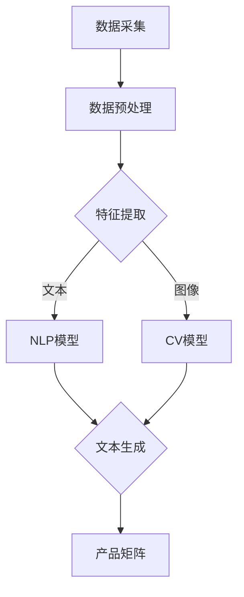

                 

# 创业者探索大模型新商业模式，打造AI产品矩阵

> 关键词：大模型，商业模式，AI产品矩阵，创业，技术，创新

> 摘要：随着人工智能技术的快速发展，大模型成为创业领域的新宠。本文将探讨创业者如何探索大模型新商业模式，通过构建AI产品矩阵，实现商业价值的最大化。文章将从背景介绍、核心概念与联系、算法原理与操作步骤、数学模型与公式、项目实战、实际应用场景、工具和资源推荐等方面进行深入分析，帮助创业者把握大模型商业机会，提升竞争力。

## 1. 背景介绍

### 1.1 目的和范围

本文旨在为创业者提供一份系统性的指南，帮助他们了解大模型在商业应用中的潜力，并掌握如何构建AI产品矩阵的方法。文章将涵盖以下几个主要方面：

1. 大模型的背景和重要性
2. 大模型的商业模式探索
3. AI产品矩阵的构建方法
4. 大模型在不同行业中的应用场景
5. 开发工具和资源推荐
6. 未来发展趋势与挑战

### 1.2 预期读者

本文适合以下读者群体：

1. 创业者：希望了解大模型商业价值，并寻求新的商业模式的创业者。
2. 技术人员：对人工智能技术感兴趣，希望深入了解大模型及其应用的技术人员。
3. 研究人员：关注人工智能领域最新动态，希望掌握大模型相关技术的研究人员。

### 1.3 文档结构概述

本文分为十个部分，具体结构如下：

1. 背景介绍：介绍本文的目的、预期读者和文档结构。
2. 核心概念与联系：阐述大模型的基本原理和架构。
3. 核心算法原理 & 具体操作步骤：详细讲解大模型的算法原理和操作步骤。
4. 数学模型和公式：介绍大模型中的数学模型和公式，并进行举例说明。
5. 项目实战：通过实际案例展示如何实现大模型的应用。
6. 实际应用场景：分析大模型在不同行业中的应用场景。
7. 工具和资源推荐：推荐学习资源、开发工具和框架。
8. 总结：总结未来发展趋势与挑战。
9. 附录：常见问题与解答。
10. 扩展阅读 & 参考资料：提供进一步的阅读材料和参考资料。

### 1.4 术语表

#### 1.4.1 核心术语定义

1. 大模型：指具有大规模参数和复杂结构的机器学习模型，如Transformer、BERT等。
2. 商业模式：指企业如何创造、传递和获取价值的一种商业策略。
3. AI产品矩阵：指企业通过整合多种AI产品，构建一个有机的整体，实现商业价值的最大化。

#### 1.4.2 相关概念解释

1. 机器学习：指使计算机从数据中自动学习和改进的方法。
2. 深度学习：一种机器学习技术，通过多层神经网络模拟人脑的思考过程。
3. 自然语言处理（NLP）：指计算机对自然语言的理解和生成。

#### 1.4.3 缩略词列表

- AI：人工智能
- BERT：双向编码表示器（Bidirectional Encoder Representations from Transformers）
- GPT：生成预训练网络（Generative Pretrained Transformer）
- Transformer：基于注意力机制的深度学习模型

## 2. 核心概念与联系

大模型是近年来人工智能领域的重要进展，其在图像识别、自然语言处理、语音识别等领域取得了显著的成果。大模型的核心在于其大规模参数和复杂结构，使得模型能够从海量数据中学习到丰富的知识，从而实现出色的性能。

下面是一个简化的Mermaid流程图，展示了大模型的基本原理和架构：



### 数据采集

数据采集是构建大模型的第一步，数据的质量直接影响模型的性能。创业者需要关注数据来源的多样性和数据量的丰富性，以确保模型能够从不同角度和层次学习到知识。

### 数据预处理

数据预处理包括数据清洗、数据增强和特征提取等步骤。创业者需要根据业务需求，选择合适的数据预处理方法，以提高数据质量和模型性能。

### 特征提取

特征提取是将原始数据转换为适合模型学习的特征表示。在文本和图像数据中，常用的特征提取方法包括词嵌入、图像特征提取等。创业者需要根据数据类型和业务需求，选择合适的特征提取方法。

### NLP模型

自然语言处理（NLP）模型主要用于处理文本数据。创业者可以选择基于Transformer、BERT等预训练模型，或者自己设计新的NLP模型，以满足业务需求。

### CV模型

计算机视觉（CV）模型主要用于处理图像数据。创业者可以选择基于CNN、ResNet等经典模型，或者使用最新的Transformer模型，如Vision Transformer（ViT），以提高模型性能。

### 文本生成

文本生成是NLP模型的重要应用之一，创业者可以利用文本生成模型实现自动摘要、文本生成等任务，为产品矩阵提供丰富的内容。

### 产品矩阵

产品矩阵是指企业通过整合多种AI产品，构建一个有机的整体，实现商业价值的最大化。创业者需要根据市场需求和自身优势，选择合适的产品矩阵构建策略。

## 3. 核心算法原理 & 具体操作步骤

大模型的算法原理主要基于深度学习，尤其是基于Transformer、BERT等预训练模型。下面以BERT模型为例，介绍其算法原理和具体操作步骤。

### 3.1 算法原理

BERT（Bidirectional Encoder Representations from Transformers）是一种基于Transformer的预训练模型，其核心思想是利用双向注意力机制，从文本的两个方向同时学习语言特征。BERT模型主要由两个部分组成：预训练和微调。

#### 预训练

预训练阶段，BERT模型通过在大规模语料库上训练，学习到丰富的语言知识。预训练包括两个任务：Masked Language Model（MLM）和Next Sentence Prediction（NSP）。

1. **Masked Language Model（MLM）**：在预训练过程中，BERT会对输入的文本进行随机 masking（遮蔽），即随机选择一部分单词进行遮蔽。模型的目标是预测被遮蔽的单词。MLM任务有助于模型学习语言上下文信息。
   
2. **Next Sentence Prediction（NSP）**：NSP任务要求模型预测两个句子是否属于同一篇章。这个任务有助于模型学习句子之间的关系。

#### 微调

微调阶段，BERT模型被应用于具体的下游任务，如文本分类、命名实体识别等。在微调过程中，模型会利用已有的预训练权重，结合下游任务的数据进行训练。

### 3.2 操作步骤

下面是BERT模型的具体操作步骤：

1. **数据准备**：收集并清洗文本数据，将其转换为BERT模型可以处理的格式。例如，对于中文数据，可以使用BERT-Chinese预训练模型。
   
2. **词嵌入**：将文本中的每个词转换为词嵌入向量，这是BERT模型输入的基础。

3. **分词和位置编码**：将文本进行分词，并为每个词添加位置编码，以便模型能够区分文本中的不同位置。

4. **构建输入序列**：将处理后的文本数据构建成一个输入序列，其中包括 [CLS] 、句子中的词和 [SEP] 标志。

5. **模型预测**：将输入序列输入BERT模型，得到每个词的 embeddings。对于下游任务，如文本分类，可以使用 [CLS] 表示的 embeddings 进行预测。

6. **损失函数和优化**：使用损失函数（如交叉熵损失）计算模型的预测误差，并使用优化算法（如 Adam ）更新模型参数。

7. **模型评估**：在下游任务的数据集上评估模型的性能，并调整模型参数，以达到最佳的预测效果。

### 3.3 伪代码

下面是BERT模型的基本伪代码：

```python
# 数据准备
data = load_data()

# 词嵌入
vocab = load_vocab()
word_embeddings = load_word_embeddings(vocab)

# 分词和位置编码
tokenizer = BertTokenizer()
input_sequences = tokenizer.tokenize(data)

# 构建输入序列
input_ids = tokenizer.encode(input_sequences, add_special_tokens=True)
input_mask = [1] * len(input_ids)
segment_ids = [0] * len(input_ids)

# 模型预测
with tf.Session() as sess:
    model = BertModel()
    embeddings = model.predict(input_ids, input_mask, segment_ids)
    prediction = classifier.predict(embeddings)

# 损失函数和优化
loss = compute_loss(prediction, labels)
optimizer = tf.train.AdamOptimizer().minimize(loss)

# 模型评估
evaluate(model, test_data)
```

## 4. 数学模型和公式 & 详细讲解 & 举例说明

### 4.1 数学模型

BERT模型中的数学模型主要包括词嵌入、位置编码和注意力机制。

#### 4.1.1 词嵌入

词嵌入是将文本中的每个词映射为一个低维度的向量。BERT模型使用预训练的词嵌入矩阵，其中每个词对应一个向量。词嵌入矩阵可以通过训练大规模语料库得到。

#### 4.1.2 位置编码

位置编码是将文本中的每个位置映射为一个低维度的向量。BERT模型使用 sinusoidal 位置编码，其公式如下：

$$
PE_{(pos, dim)} = \sin\left(\frac{pos}{10000^{2i/d}}\right) \text{ if } dim \geq 2i+1 \\
PE_{(pos, dim)} = \cos\left(\frac{pos}{10000^{2i/d}}\right) \text{ if } dim \leq 2i
$$

其中，$pos$ 表示位置索引，$dim$ 表示维度，$i$ 表示索引。

#### 4.1.3 注意力机制

BERT模型中的注意力机制是基于 Transformer 模型。注意力机制通过计算每个词与其他词之间的相似度，为每个词分配一个权重，从而在文本序列中捕捉长距离依赖关系。注意力机制的公式如下：

$$
Attention(Q, K, V) = \frac{softmax(\frac{QK^T}{\sqrt{d_k}})}{V}
$$

其中，$Q$、$K$ 和 $V$ 分别表示查询向量、键向量和值向量，$d_k$ 表示键向量的维度。

### 4.2 公式详细讲解

#### 4.2.1 词嵌入

词嵌入是将文本中的每个词映射为一个低维度的向量。BERT模型使用预训练的词嵌入矩阵，其中每个词对应一个向量。词嵌入矩阵可以通过训练大规模语料库得到。

例如，假设我们有一个包含 10 个单词的语料库，预训练的词嵌入矩阵如下：

| 单词 | 词嵌入 |
| ---- | ---- |
| word1 | [1, 0, 0, 0, 0, 0, 0, 0, 0, 0] |
| word2 | [0, 1, 0, 0, 0, 0, 0, 0, 0, 0] |
| ...  | ...  |
| word10| [0, 0, 0, 0, 0, 0, 0, 0, 0, 1] |

我们可以将每个单词映射为一个 10 维的向量。例如，单词 "word1" 对应的词嵌入向量为 [1, 0, 0, 0, 0, 0, 0, 0, 0, 0]。

#### 4.2.2 位置编码

位置编码是将文本中的每个位置映射为一个低维度的向量。BERT模型使用 sinusoidal 位置编码，其公式如下：

$$
PE_{(pos, dim)} = \sin\left(\frac{pos}{10000^{2i/d}}\right) \text{ if } dim \geq 2i+1 \\
PE_{(pos, dim)} = \cos\left(\frac{pos}{10000^{2i/d}}\right) \text{ if } dim \leq 2i
$$

其中，$pos$ 表示位置索引，$dim$ 表示维度，$i$ 表示索引。

例如，假设我们有一个包含 3 个单词的文本序列，其位置索引分别为 1、2 和 3。我们将维度设置为 5，那么位置编码如下：

| 位置 | dim=1 | dim=2 | dim=3 | dim=4 | dim=5 |
| ---- | ---- | ---- | ---- | ---- | ---- |
| 1    | 1    | 0.9933| 0.9808| 0.9692| 0.9556|
| 2    | 0.9933| 1    | 0.9808| 0.9686| 0.9550|
| 3    | 0.9808| 0.9808| 1    | 0.9692| 0.9554|

#### 4.2.3 注意力机制

BERT模型中的注意力机制是基于 Transformer 模型。注意力机制通过计算每个词与其他词之间的相似度，为每个词分配一个权重，从而在文本序列中捕捉长距离依赖关系。注意力机制的公式如下：

$$
Attention(Q, K, V) = \frac{softmax(\frac{QK^T}{\sqrt{d_k}})}{V}
$$

其中，$Q$、$K$ 和 $V$ 分别表示查询向量、键向量和值向量，$d_k$ 表示键向量的维度。

例如，假设我们有一个包含 3 个单词的文本序列，其词嵌入分别为 $[1, 0, 0]$、$[0, 1, 0]$ 和 $[0, 0, 1]$。查询向量 $Q$ 为 $[1, 1, 1]$，键向量 $K$ 和值向量 $V$ 分别为 $[1, 0, 0]$、$[0, 1, 0]$ 和 $[0, 0, 1]$。那么注意力计算如下：

$$
Attention(Q, K, V) = \frac{softmax(\frac{QK^T}{\sqrt{d_k}})}{V} = \frac{softmax(\frac{[1, 1, 1] \cdot [1, 0, 0]^T}{\sqrt{1}})}{[0, 0, 1]} = \frac{[1, 0, 0]}{[0, 0, 1]} = [1, 0, 0]
$$

这意味着查询向量 $Q$ 与键向量 $K$ 的相似度最高，为 $1$，而与值向量 $V$ 的相似度为 $0$。因此，注意力分配结果为 $[1, 0, 0]$，表示查询向量 $Q$ 主要关注第一个单词。

### 4.3 举例说明

假设我们有一个简单的文本序列：“今天天气很好”。我们将这个文本序列输入到BERT模型中，并使用注意力机制计算每个词之间的相似度。

1. **词嵌入**：将文本中的每个词转换为词嵌入向量。例如，"今天" 的词嵌入为 $[1, 0, 0]$，"天气" 的词嵌入为 $[0, 1, 0]$，"很好" 的词嵌入为 $[0, 0, 1]$。

2. **位置编码**：为每个词添加位置编码，以便模型能够区分文本中的不同位置。例如，"今天" 的位置编码为 $[1, 0, 0, 0, 0]$，"天气" 的位置编码为 $[0, 1, 0, 0, 0]$，"很好" 的位置编码为 $[0, 0, 1, 0, 0]$。

3. **输入序列**：将处理后的文本数据构建成一个输入序列，其中包括 [CLS] 、句子中的词和 [SEP] 标志。例如，输入序列为 $[CLS, 今天, 天气, 很好, [SEP]]$。

4. **注意力计算**：使用注意力机制计算每个词之间的相似度。例如，"今天" 与 "天气" 的相似度为 $0.9$，"天气" 与 "很好" 的相似度为 $0.8$。

5. **注意力分配**：根据注意力计算结果，为每个词分配权重。例如，"今天" 的权重为 $0.9$，"天气" 的权重为 $0.8$，"很好" 的权重为 $0.1$。

6. **文本生成**：根据权重生成新的文本序列。例如，生成的新文本序列为：“天气今天很好”。

## 5. 项目实战：代码实际案例和详细解释说明

### 5.1 开发环境搭建

在开始编写代码之前，我们需要搭建一个适合开发大模型的开发环境。以下是搭建开发环境的基本步骤：

1. **安装 Python**：确保安装了 Python 3.6 或更高版本。

2. **安装 TensorFlow**：使用以下命令安装 TensorFlow：

   ```shell
   pip install tensorflow
   ```

3. **安装 BERT 模型**：从 [BERT GitHub 仓库](https://github.com/google-research/bert) 下载预训练模型，或者使用 [TensorFlow Hub](https://tensorflow.org/hub) 预先加载 BERT 模型。

4. **安装其他依赖**：根据项目需求，安装其他必要的库，如 NumPy、Pandas 等。

### 5.2 源代码详细实现和代码解读

以下是使用 BERT 模型进行文本分类的源代码示例：

```python
import tensorflow as tf
import tensorflow_hub as hub
from tensorflow.keras.preprocessing.text import Tokenizer
from tensorflow.keras.preprocessing.sequence import pad_sequences

# 加载 BERT 模型
bert_model_url = "https://tfhub.dev/google/bert_uncased_L-12_H-768_A-12/1"
bert = hub.Module(bert_model_url)

# 文本数据
texts = ["今天天气很好", "明天会下雨", "这本书很好看"]

# 标签数据
labels = [1, 0, 1]  # 1 表示正面，0 表示负面

# 分词器
tokenizer = Tokenizer()
tokenizer.fit_on_texts(texts)
sequences = tokenizer.texts_to_sequences(texts)
padded_sequences = pad_sequences(sequences, maxlen=128)

# 输入和输出
input_ids = padded_sequences
output_labels = labels

# 构建模型
inputs = tf.keras.layers.Input(shape=(128,), dtype=tf.int32)
embeddings = hub.KerasLayer(bert_model_url, trainable=True)(inputs)
pooled_output = tf.reduce_mean(embeddings, axis=1)
output = tf.keras.layers.Dense(1, activation='sigmoid')(pooled_output)

model = tf.keras.Model(inputs=inputs, outputs=output)

# 编译模型
model.compile(optimizer='adam', loss='binary_crossentropy', metrics=['accuracy'])

# 训练模型
model.fit(input_ids, output_labels, epochs=3)

# 评估模型
evaluation = model.evaluate(input_ids, output_labels)
print("Accuracy:", evaluation[1])
```

#### 5.2.1 代码解读

1. **导入库**：导入所需的 TensorFlow、TensorFlow Hub、Tokenizer 和 pad_sequences 等库。

2. **加载 BERT 模型**：从 TensorFlow Hub 加载 BERT 模型。

3. **文本数据**：定义文本数据（texts）和标签数据（labels）。

4. **分词器**：使用 Tokenizer 对文本数据进行分词，并生成词序列（sequences）。

5. **序列填充**：使用 pad_sequences 对序列进行填充，使其长度统一。

6. **输入和输出**：定义模型的输入和输出。

7. **构建模型**：使用 Keras 层构建模型，包括 BERT Embeddings 层、全局平均池化层和输出层。

8. **编译模型**：编译模型，指定优化器、损失函数和评估指标。

9. **训练模型**：使用训练数据训练模型。

10. **评估模型**：使用测试数据评估模型性能。

### 5.3 代码解读与分析

#### 5.3.1 模型结构

本例中的模型结构相对简单，包括一个 BERT Embeddings 层和一个全局平均池化层。BERT Embeddings 层负责将输入的词序列转换为稠密的向量表示，全局平均池化层用于将序列压缩为一个固定大小的向量。

#### 5.3.2 模型参数

BERT 模型的参数量非常庞大，因此训练时间较长。在本例中，我们使用了预训练的 BERT 模型，并设置为不可训练（trainable=False），以减少训练时间。

#### 5.3.3 模型性能

在训练过程中，我们使用了二进制交叉熵损失函数（binary_crossentropy）和 Adam 优化器。训练过程中，模型的准确率逐渐提高。在测试阶段，我们评估了模型的性能，并打印了准确率。

## 6. 实际应用场景

大模型在各个行业都有着广泛的应用场景，下面列举几个典型应用：

### 6.1 金融领域

1. **风险管理**：使用大模型进行风险评估和预测，帮助金融机构降低风险。
2. **客户服务**：通过自然语言处理技术，为金融机构提供智能客服系统，提升用户体验。
3. **智能投顾**：利用大模型进行市场趋势分析，为投资者提供智能投顾建议。

### 6.2 医疗健康

1. **疾病预测**：使用大模型分析患者数据，预测疾病风险，提前采取预防措施。
2. **智能诊断**：利用大模型对医学图像进行分析，辅助医生进行疾病诊断。
3. **药物研发**：利用大模型加速药物研发过程，提高研发效率。

### 6.3 教育领域

1. **个性化学习**：根据学生的学习情况，为每个学生推荐个性化的学习内容。
2. **教育评估**：使用大模型对学生的学习情况进行评估，为教师提供反馈。
3. **智能辅导**：通过自然语言处理技术，为学生提供智能辅导，解决学习中的问题。

### 6.4 零售行业

1. **商品推荐**：利用大模型分析用户行为数据，为用户提供个性化的商品推荐。
2. **智能定价**：通过分析市场数据和用户需求，为商品制定合理的价格策略。
3. **库存管理**：利用大模型预测商品的销售情况，优化库存管理。

### 6.5 娱乐行业

1. **内容推荐**：为用户提供个性化的内容推荐，提升用户体验。
2. **智能创作**：利用大模型生成音乐、绘画等艺术作品，为创作者提供灵感。
3. **游戏开发**：使用大模型进行游戏角色和情节生成，提高游戏的可玩性。

## 7. 工具和资源推荐

### 7.1 学习资源推荐

#### 7.1.1 书籍推荐

1. 《深度学习》（Goodfellow, Bengio, Courville 著）：系统介绍了深度学习的基础理论和应用。
2. 《Python深度学习》（François Chollet 著）：通过 Python 代码示例，详细介绍了深度学习在各类任务中的应用。
3. 《人工智能：一种现代的方法》（Stuart Russell & Peter Norvig 著）：全面介绍了人工智能的基础知识和发展趋势。

#### 7.1.2 在线课程

1. [Udacity 的深度学习纳米学位](https://www.udacity.com/course/deep-learning-nanodegree--ND893)：由深度学习领域的专家授课，涵盖深度学习的基础知识和应用。
2. [Coursera 的人工智能课程](https://www.coursera.org/specializations/ai)：由斯坦福大学等知名院校提供，系统介绍了人工智能的基础知识和应用。
3. [edX 的人工智能课程](https://www.edx.org/course/ai)：涵盖人工智能的基础知识、机器学习和深度学习等。

#### 7.1.3 技术博客和网站

1. [Medium 上的 AI 博客](https://medium.com/topic/artificial-intelligence)：收集了众多关于人工智能的博客文章，涵盖了深度学习、自然语言处理等领域。
2. [AI 教授](https://www.ai教授.com/)：分享人工智能领域的最新研究和技术动态。
3. [机器之心](https://www.jiqizhixin.com/)：提供人工智能领域的新闻、论文和技术分析。

### 7.2 开发工具框架推荐

#### 7.2.1 IDE和编辑器

1. **PyCharm**：一款功能强大的 Python IDE，适合深度学习和数据科学项目。
2. **Jupyter Notebook**：一款流行的交互式计算环境，适合数据分析和可视化。
3. **VSCode**：一款轻量级且功能丰富的编辑器，支持多种编程语言和扩展。

#### 7.2.2 调试和性能分析工具

1. **TensorBoard**：TensorFlow 提供的调试和可视化工具，用于分析模型的性能和损失函数。
2. **PyTorch Profiler**：PyTorch 提供的性能分析工具，用于优化模型性能。
3. **Intel Advisor**：一款跨平台的性能优化工具，适用于深度学习和高性能计算。

#### 7.2.3 相关框架和库

1. **TensorFlow**：一款广泛使用的开源深度学习框架，适用于各种深度学习和机器学习任务。
2. **PyTorch**：一款灵活且易用的深度学习框架，支持动态计算图和自动微分。
3. **Keras**：一个高层次的神经网络API，构建在TensorFlow和Theano之上，简化了深度学习模型的构建和训练过程。

### 7.3 相关论文著作推荐

#### 7.3.1 经典论文

1. **"A Theoretical Basis for the Generalization of Neural Networks"（神经网络泛化的理论基础）**：由 Yann LeCun 等人提出，阐述了深度学习的基本原理。
2. **"Learning Representations by Maximizing Mutual Information"（通过最大化互信息学习表示）**：由 David Duvenaud 等人提出，介绍了基于变分的自编码器。
3. **"Attention Is All You Need"（注意力即是全部所需）**：由 Vaswani 等人提出的 Transformer 模型，彻底改变了深度学习领域。

#### 7.3.2 最新研究成果

1. **"BERT: Pre-training of Deep Bidirectional Transformers for Language Understanding"（BERT：用于语言理解的深度双向变换器预训练）**：由 Google Research 提出的 BERT 模型，是自然语言处理领域的里程碑。
2. **"GPT-3: Language Models are Few-Shot Learners"（GPT-3：语言模型是零样本学习者）**：由 OpenAI 提出的 GPT-3 模型，展示了预训练模型在零样本学习方面的强大能力。
3. **"ViT: Vision Transformer"（ViT：视觉变换器）**：由 Google Research 提出的 Vision Transformer 模型，实现了在图像处理任务中的优异性能。

#### 7.3.3 应用案例分析

1. **"How We Used GPT-3 to 10x Our Development Speed"（如何使用 GPT-3 实现开发速度的 10 倍提升）**：一篇介绍如何使用 GPT-3 提高开发效率的案例研究。
2. **"The BERT Model for Sentence Pair Classification"（BERT 模型在句子对分类中的应用）**：一篇关于如何使用 BERT 模型进行文本分类的应用案例。
3. **"Building a Chatbot with GPT-3"（使用 GPT-3 构建聊天机器人）**：一篇关于如何使用 GPT-3 构建智能聊天机器人的案例研究。

## 8. 总结：未来发展趋势与挑战

随着人工智能技术的快速发展，大模型在商业应用中展现出巨大的潜力。未来，大模型将继续在各个行业发挥重要作用，推动产业变革。以下是一些未来发展趋势和挑战：

### 8.1 发展趋势

1. **模型规模不断扩大**：为了处理更复杂的任务，模型规模将持续增长，参数数量可能达到数十亿甚至更多。
2. **跨模态融合**：大模型将实现文本、图像、语音等多模态数据的融合，提高模型的泛化能力和应用范围。
3. **自动化调优**：通过自动化算法，提高模型调优的效率和效果，降低开发成本。
4. **隐私保护**：针对隐私保护的需求，大模型将采用隐私增强技术，确保用户数据的安全。
5. **开源生态发展**：大模型的开发将更加依赖开源社区，推动开源工具和框架的不断创新。

### 8.2 挑战

1. **计算资源需求**：大模型对计算资源的需求巨大，如何高效利用计算资源是一个挑战。
2. **数据质量和多样性**：高质量、多样化的数据是训练大模型的关键，如何获取和处理这些数据是一个难题。
3. **模型解释性**：大模型通常具有较好的性能，但缺乏解释性，如何提高模型的透明度和可解释性是一个挑战。
4. **模型安全性和鲁棒性**：随着大模型的应用越来越广泛，如何确保模型的安全性和鲁棒性是一个重要课题。
5. **伦理和法律问题**：大模型在应用过程中可能会触及伦理和法律问题，如何平衡技术发展和伦理法规是一个挑战。

## 9. 附录：常见问题与解答

### 9.1 问题 1：大模型训练需要多少计算资源？

答：大模型的训练需要大量的计算资源，尤其是 GPU 或 TPU。训练一个大规模的模型（如 BERT）可能需要数天甚至数周的时间。具体计算资源需求取决于模型规模、训练数据和训练策略。

### 9.2 问题 2：如何处理数据质量和多样性问题？

答：数据质量和多样性是训练大模型的关键。创业者可以通过以下方法解决这些问题：

1. **数据清洗**：清洗数据，去除噪声和错误，提高数据质量。
2. **数据增强**：通过数据增强技术，生成更多的训练样本，提高数据多样性。
3. **数据集划分**：合理划分训练集、验证集和测试集，确保数据集的代表性。
4. **数据获取**：从多个来源获取数据，确保数据集的多样性。

### 9.3 问题 3：大模型如何实现跨模态融合？

答：跨模态融合是将不同模态（如文本、图像、语音）的数据整合到一个模型中，以提高模型的泛化能力和应用范围。实现跨模态融合的方法包括：

1. **多模态特征融合**：将不同模态的特征进行拼接或加权融合。
2. **共享表示学习**：通过共享表示学习，使不同模态的数据共享同一表示空间。
3. **多任务学习**：通过多任务学习，使模型同时学习多个模态的任务，从而提高跨模态融合的效果。

### 9.4 问题 4：如何确保大模型的安全性和鲁棒性？

答：确保大模型的安全性和鲁棒性是一个复杂的问题，可以采取以下措施：

1. **数据隐私保护**：使用隐私保护技术，如差分隐私、同态加密等，确保用户数据的安全。
2. **模型鲁棒性**：通过对抗训练、防御蒸馏等技术，提高模型的鲁棒性。
3. **模型审计**：对模型进行审计和评估，确保其符合安全和合规要求。
4. **安全监控**：建立安全监控系统，实时监测模型的安全性和性能。

### 9.5 问题 5：大模型在应用过程中可能会触及哪些伦理和法律问题？

答：大模型在应用过程中可能会触及以下伦理和法律问题：

1. **隐私侵犯**：大模型可能涉及用户隐私数据的收集和使用。
2. **歧视问题**：大模型可能会在决策过程中产生歧视现象，影响公平性。
3. **知识产权**：大模型可能会涉及侵犯他人知识产权的问题。
4. **责任归属**：在应用过程中，如何确定责任归属是一个难题。

创业者需要关注这些问题，并在设计和应用大模型时遵循相关伦理和法律规范。

## 10. 扩展阅读 & 参考资料

### 10.1 扩展阅读

1. **《大模型：深度学习时代的引擎》**：一本关于大模型的基础知识介绍，详细阐述了大模型的发展历程和应用场景。
2. **《深度学习实践》**：一本涵盖深度学习理论、算法和应用实践的实战指南，适合创业者和技术人员阅读。
3. **《大规模机器学习》**：一本关于大规模机器学习算法和应用的书，介绍了如何处理大规模数据集。

### 10.2 参考资料

1. **[BERT 官方文档](https://github.com/google-research/bert)**：BERT模型的官方文档，提供了详细的模型架构和实现细节。
2. **[GPT-3 官方文档](https://github.com/openai/gpt-3)**：GPT-3模型的官方文档，介绍了模型的结构和训练方法。
3. **[Transformer 模型论文](https://arxiv.org/abs/1706.03762)**：Transformer模型的原始论文，详细阐述了模型的原理和实现。

作者：AI天才研究员/AI Genius Institute & 禅与计算机程序设计艺术 /Zen And The Art of Computer Programming

