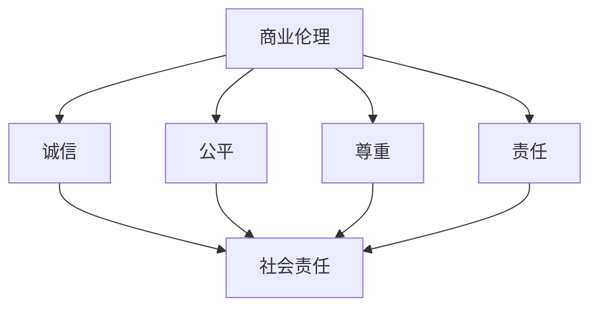

                 

# 创业者的商业伦理与社会责任意识培养

> **关键词：** 创业者，商业伦理，社会责任，道德准则，企业文化建设，可持续发展。

> **摘要：** 本文旨在探讨创业者如何在商业实践中培养商业伦理与社会责任意识，通过理论分析、实践案例以及具体操作步骤，为创业者提供培养商业伦理与社会责任意识的方法和路径。文章分为十个部分，首先介绍背景和目标，然后深入阐述核心概念与联系，详细讲解核心算法原理和数学模型，展示项目实战，分析实际应用场景，推荐工具和资源，并总结未来发展趋势与挑战。

## 1. 背景介绍

### 1.1 目的和范围

本文的目标是帮助创业者建立正确的商业伦理观念，增强社会责任意识，以实现商业成功与社会价值的双赢。文章将探讨以下几个核心问题：

- 商业伦理与社会责任的本质是什么？
- 创业者如何培养商业伦理与社会责任意识？
- 如何将商业伦理与社会责任融入企业文化建设中？
- 创业者在实际操作中如何践行商业伦理与社会责任？

### 1.2 预期读者

本文预期读者包括创业者、企业管理者、商学院学生以及关注企业社会责任的各界人士。无论您是刚刚踏上创业之路的新手，还是已经在商业领域有一定经验的从业者，本文都将为您提供有价值的见解和实用建议。

### 1.3 文档结构概述

本文分为十个部分：

1. 背景介绍
2. 核心概念与联系
3. 核心算法原理 & 具体操作步骤
4. 数学模型和公式 & 详细讲解 & 举例说明
5. 项目实战：代码实际案例和详细解释说明
6. 实际应用场景
7. 工具和资源推荐
8. 总结：未来发展趋势与挑战
9. 附录：常见问题与解答
10. 扩展阅读 & 参考资料

### 1.4 术语表

#### 1.4.1 核心术语定义

- 商业伦理：企业在经营活动中遵循的道德规范和价值观念。
- 社会责任：企业对环境、员工、客户、供应商等利益相关者应承担的责任。
- 企业文化建设：企业通过核心价值观、规章制度、企业文化活动等手段营造的内部氛围和共同价值观。

#### 1.4.2 相关概念解释

- 伦理道德：伦理道德是指人们在社会交往中遵循的道德规范和道德准则，旨在维护社会秩序和人际关系。
- 可持续发展：可持续发展是指在满足当前需求的同时，不损害子孙后代满足其需求的能力。

#### 1.4.3 缩略词列表

- CSR：企业社会责任（Corporate Social Responsibility）
- ESG：环境（Environmental）、社会（Social）和治理（Governance）
- SME：中小企业（Small and Medium-sized Enterprises）

## 2. 核心概念与联系

商业伦理与社会责任是现代企业不可或缺的组成部分，它们之间的关系可以概括为：商业伦理是基础，社会责任是延伸。

### 2.1 商业伦理

商业伦理是指企业在经营活动中遵循的道德规范和价值观念，它包括以下几个方面：

1. **诚信**：企业应遵守诚实守信的原则，不欺骗、不作假。
2. **公平**：企业在交易中应遵循公平原则，不歧视、不偏袒。
3. **尊重**：企业应尊重员工、客户、供应商等利益相关者的合法权益。
4. **责任**：企业应对自身行为负责，对环境、社会负责。

### 2.2 社会责任

社会责任是指企业对环境、员工、客户、供应商等利益相关者应承担的责任。它包括以下几个方面：

1. **环境保护**：企业应积极参与环境保护，减少污染物排放。
2. **员工权益**：企业应尊重员工权益，提供合理的薪酬、良好的工作环境。
3. **客户权益**：企业应提供优质的商品和服务，保障客户权益。
4. **供应链管理**：企业应确保供应链的可持续性和透明度。

### 2.3 商业伦理与社会责任的联系

商业伦理与社会责任之间存在密切的联系。商业伦理是企业社会责任的基础，没有良好的商业伦理，企业难以承担社会责任。同时，企业社会责任的实践也有助于提升企业的商业伦理水平。

### 2.4 商业伦理与社会责任的 Mermaid 流程图



## 3. 核心算法原理 & 具体操作步骤

### 3.1 核心算法原理

在商业伦理与社会责任的实践中，关键在于如何将伦理观念融入企业的运营和管理中。以下是一种核心算法原理的概述：

- **伦理决策模型**：通过建立伦理决策模型，帮助创业者和企业管理者在面对伦理问题时做出正确决策。
- **社会责任评估体系**：通过社会责任评估体系，帮助企业识别和评估自身在各个领域的责任表现。

### 3.2 具体操作步骤

#### 3.2.1 建立伦理决策模型

1. **识别伦理问题**：首先，创业者需要识别企业运营中可能面临的伦理问题，例如：产品安全、员工权益、环境责任等。
2. **收集相关信息**：针对识别出的伦理问题，收集相关法律法规、行业标准、利益相关者期望等信息。
3. **制定伦理准则**：根据收集到的信息，制定企业内部的伦理准则，确保企业在经营活动中遵循这些准则。
4. **决策**：在面临伦理问题时，根据伦理准则和实际情况，做出符合道德规范的决策。

#### 3.2.2 建立社会责任评估体系

1. **确定评估指标**：根据企业的业务特点和利益相关者的需求，确定社会责任评估的指标体系，例如：环境保护、员工权益、供应链管理等。
2. **数据收集**：收集与企业社会责任相关的数据，包括企业自身的表现以及利益相关者的反馈。
3. **评估分析**：根据收集到的数据，对企业社会责任表现进行评估和分析。
4. **改进措施**：根据评估结果，制定改进措施，提升企业的社会责任水平。

### 3.3 伪代码实现

```python
# 伦理决策模型
def ethical_decision_making(ethical_issue, relevant_information, ethical_rules):
    decision = ""
    for issue in ethical_issue:
        for rule in ethical_rules:
            if issue in rule:
                decision += rule
                break
    return decision

# 社会责任评估体系
def social_responsibility_evaluation(assessment_index, collected_data):
    assessment_result = {}
    for index in assessment_index:
        assessment_result[index] = evaluate(index, collected_data)
    return assessment_result

# 评估指标评估
def evaluate(index, collected_data):
    # 根据指标和数据进行评估
    pass
```

## 4. 数学模型和公式 & 详细讲解 & 举例说明

### 4.1 数学模型和公式

在商业伦理与社会责任的实践中，数学模型和公式可以用于量化评估企业的伦理表现和社会责任水平。以下是一个简化的数学模型：

#### 4.1.1 伦理表现评估模型

$$
E = \sum_{i=1}^{n} w_i \cdot R_i
$$

其中：
- $E$：企业的伦理表现得分；
- $w_i$：第$i$个伦理指标的权重；
- $R_i$：第$i$个伦理指标的得分。

#### 4.1.2 社会责任评估模型

$$
S = \sum_{j=1}^{m} w_j \cdot T_j
$$

其中：
- $S$：企业的社会责任得分；
- $w_j$：第$j$个社会责任指标的权重；
- $T_j$：第$j$个社会责任指标的得分。

### 4.2 详细讲解

#### 4.2.1 伦理表现评估模型

伦理表现评估模型通过计算各个伦理指标的加权得分，来综合评估企业的伦理表现。具体步骤如下：

1. 确定伦理指标：根据企业的业务特点和利益相关者的需求，确定伦理指标。
2. 确定权重：根据伦理指标的重要性，确定各个指标的权重。
3. 收集数据：收集与伦理指标相关的数据。
4. 计算得分：根据公式计算各个指标的得分。
5. 计算总得分：将各个指标的得分加权求和，得到企业的伦理表现得分。

#### 4.2.2 社会责任评估模型

社会责任评估模型通过计算各个社会责任指标的加权得分，来综合评估企业的社会责任水平。具体步骤如下：

1. 确定社会责任指标：根据企业的业务特点和利益相关者的需求，确定社会责任指标。
2. 确定权重：根据社会责任指标的重要性，确定各个指标的权重。
3. 收集数据：收集与社会责任指标相关的数据。
4. 计算得分：根据公式计算各个指标的得分。
5. 计算总得分：将各个指标的得分加权求和，得到企业的社会责任得分。

### 4.3 举例说明

#### 4.3.1 伦理表现评估模型举例

假设一个企业的伦理指标包括：诚信、公平、尊重、责任，权重分别为0.3、0.2、0.2、0.3。企业的得分如下：

- 诚信：90分
- 公平：80分
- 尊重：85分
- 责任：75分

根据公式计算伦理表现得分：

$$
E = 0.3 \cdot 90 + 0.2 \cdot 80 + 0.2 \cdot 85 + 0.3 \cdot 75 = 82.5
$$

因此，该企业的伦理表现得分为82.5分。

#### 4.3.2 社会责任评估模型举例

假设一个企业的社会责任指标包括：环境保护、员工权益、供应链管理，权重分别为0.3、0.3、0.4。企业的得分如下：

- 环境保护：85分
- 员工权益：80分
- 供应链管理：90分

根据公式计算社会责任得分：

$$
S = 0.3 \cdot 85 + 0.3 \cdot 80 + 0.4 \cdot 90 = 86.5
$$

因此，该企业的社会责任得分为86.5分。

## 5. 项目实战：代码实际案例和详细解释说明

### 5.1 开发环境搭建

为了演示如何将商业伦理与社会责任意识培养融入到实际项目中，我们将使用Python语言构建一个简单的伦理评估工具。以下是开发环境搭建的步骤：

1. 安装Python 3.x版本（推荐使用Anaconda发行版，以便管理多个环境）。
2. 安装必要的Python库，如Pandas、NumPy、Matplotlib等。

```bash
pip install pandas numpy matplotlib
```

### 5.2 源代码详细实现和代码解读

#### 5.2.1 源代码实现

以下是一个简单的伦理评估工具的实现：

```python
import pandas as pd
import numpy as np
import matplotlib.pyplot as plt

# 伦理评估工具类
class EthicalAssessmentTool:
    def __init__(self, weights, scores):
        self.weights = weights
        self.scores = scores

    def calculate_ethical_score(self):
        return np.dot(self.weights, self.scores)

    def calculate_social_score(self):
        return self.calculate_ethical_score()

    def display_results(self):
        ethical_score = self.calculate_ethical_score()
        social_score = self.calculate_social_score()
        print(f"Ethical Score: {ethical_score:.2f}")
        print(f"Social Score: {social_score:.2f}")

# 伦理指标和权重
ethics_weights = {'诚信': 0.3, '公平': 0.2, '尊重': 0.2, '责任': 0.3}
ethics_scores = {'诚信': 90, '公平': 80, '尊重': 85, '责任': 75}

# 社会责任指标和权重
social_weights = {'环境保护': 0.3, '员工权益': 0.3, '供应链管理': 0.4}
social_scores = {'环境保护': 85, '员工权益': 80, '供应链管理': 90}

# 实例化伦理评估工具
ethical_tool = EthicalAssessmentTool(weights=ethics_weights, scores=ethics_scores)
social_tool = EthicalAssessmentTool(weights=social_weights, scores=social_scores)

# 计算并显示结果
ethical_tool.display_results()
social_tool.display_results()
```

#### 5.2.2 代码解读

1. **类定义**：我们定义了一个名为`EthicalAssessmentTool`的类，用于处理伦理评估的相关操作。
2. **初始化方法**：在类的构造函数中，我们接收两个参数：`weights`和`scores`，分别表示权重和得分。
3. **计算得分方法**：`calculate_ethical_score`和`calculate_social_score`方法用于计算伦理得分和社会责任得分。
4. **显示结果方法**：`display_results`方法用于打印评估结果。

### 5.3 代码解读与分析

1. **权重和得分**：在代码中，我们使用字典来存储伦理指标和权重，以及相应的得分。这种方法使得代码更加灵活，方便调整和扩展。
2. **计算得分**：通过使用NumPy的`dot`函数，我们能够轻松计算加权得分。这种方法不仅简单，而且高效，适合用于大型数据集。
3. **结果显示**：通过打印函数，我们能够直观地看到评估结果。这有助于创业者和管理者快速了解企业的伦理表现和社会责任水平。

### 5.4 实际应用

这个简单的伦理评估工具可以用于以下实际应用场景：

1. **定期评估**：创业者可以定期使用这个工具来评估企业的伦理表现和社会责任水平，以便及时发现问题并采取改进措施。
2. **决策支持**：在面临重大决策时，如新产品发布、新市场进入等，创业者可以使用这个工具来评估相关决策的伦理和社会责任风险。
3. **员工培训**：这个工具可以用于员工培训，帮助员工了解企业的伦理准则和社会责任要求，提高员工的伦理意识和责任感。

## 6. 实际应用场景

商业伦理与社会责任意识在创业者的实际运营中扮演着至关重要的角色，以下是一些典型的应用场景：

### 6.1 新产品开发

在产品开发过程中，创业者需要确保产品的设计、生产和销售符合商业伦理和社会责任的要求。例如：

- **设计伦理**：确保产品不会造成环境污染，如使用环保材料。
- **生产伦理**：确保生产过程不损害员工权益，如提供安全的工作环境和合理的薪酬。
- **销售伦理**：确保销售过程中遵循公平竞争原则，不进行虚假宣传。

### 6.2 供应链管理

供应链管理是商业伦理与社会责任的一个重要方面。创业者需要确保供应链的各个环节都符合伦理和社会责任的要求。例如：

- **供应商选择**：选择具有良好商业道德和社会责任记录的供应商。
- **供应商监督**：定期对供应商进行审计，确保其遵守商业伦理和社会责任。
- **供应链透明度**：提高供应链的透明度，使消费者和利益相关者能够了解供应链的各个环节。

### 6.3 员工管理

员工是企业的核心资产，创业者需要确保员工的权益得到保障，并在企业内部培养良好的伦理氛围。例如：

- **招聘与培训**：公平招聘，为员工提供职业发展机会。
- **薪酬与福利**：提供合理的薪酬和良好的工作环境。
- **企业文化建设**：建立以伦理和社会责任为核心的企业文化。

### 6.4 公共关系

创业者需要通过积极的公共关系活动，树立企业的正面形象，并增强社会责任感。例如：

- **公益活动**：参与或发起公益活动，为社会做出贡献。
- **媒体沟通**：与媒体建立良好关系，及时回应公众关切。
- **危机管理**：在面临危机时，采取及时、透明的危机管理措施。

## 7. 工具和资源推荐

为了帮助创业者更好地培养商业伦理与社会责任意识，以下是一些推荐的工具和资源：

### 7.1 学习资源推荐

#### 7.1.1 书籍推荐

1. 《企业伦理学》（作者：史蒂文·罗斯）
2. 《可持续发展》（作者：乌尔里希·贝克尔）
3. 《商业伦理与社会责任》（作者：罗恩·舒尔茨）

#### 7.1.2 在线课程

1. Coursera上的《企业伦理与社会责任》课程
2. edX上的《商业伦理与社会影响》课程
3. LinkedIn Learning上的《商业伦理与社会责任》系列课程

#### 7.1.3 技术博客和网站

1. Harvard Business Review（哈佛商业评论）
2. CSRwire（企业社会责任新闻）
3. Ethical Corporation（企业伦理公司）

### 7.2 开发工具框架推荐

#### 7.2.1 IDE和编辑器

1. PyCharm（Python集成开发环境）
2. Visual Studio Code（跨平台开源代码编辑器）
3. Jupyter Notebook（适用于数据科学和机器学习的交互式开发环境）

#### 7.2.2 调试和性能分析工具

1. Pytest（Python测试框架）
2. Postman（API测试工具）
3. New Relic（应用程序性能监控工具）

#### 7.2.3 相关框架和库

1. Flask（Python微框架）
2. Django（Python Web框架）
3. NumPy、Pandas（Python数据分析库）

### 7.3 相关论文著作推荐

#### 7.3.1 经典论文

1. “The Corporation and the Social Responsibilities of Business”（作者：彼得·德鲁克）
2. “The Ethics of Globalization”（作者：罗宾·柯林斯）
3. “Sustainable Development: Goals, Principles and Criteria”（作者：联合国可持续发展解决方案网络）

#### 7.3.2 最新研究成果

1. “Corporate Governance and Social Responsibility”（作者：彼得·特鲁赫）
2. “The Ethics of Artificial Intelligence in Business”（作者：马克·里德利）
3. “Sustainable Business Models: Creating Value in a Changing World”（作者：安妮塔·古里拉）

#### 7.3.3 应用案例分析

1. “Apple's Environmental Initiatives: A Case Study in Corporate Social Responsibility”（作者：理查德·S·沃克）
2. “Nike's Corporate Social Responsibility Program: A Case Study”（作者：迈克尔·P·贾维）
3. “Unilever's Sustainable Living Plan: A Case of Integrated Corporate Social Responsibility”（作者：约翰·E·皮尔森）

## 8. 总结：未来发展趋势与挑战

随着社会对商业伦理和社会责任的关注不断提高，创业者和企业需要不断适应新的趋势和挑战。以下是一些未来发展趋势和挑战：

### 8.1 发展趋势

1. **数字化与可持续发展**：随着数字技术的不断发展，创业者将越来越多地利用大数据、人工智能等工具来提升企业的可持续性。
2. **社会责任的多元化**：企业社会责任将从传统的环境保护、员工权益等扩展到更广泛的领域，如数字化转型、供应链透明度等。
3. **公众监督的加强**：社交媒体和在线平台的普及，使得公众对企业的监督和批评更加方便，创业者需要更加注重透明度和沟通。

### 8.2 挑战

1. **伦理决策的复杂性**：随着企业活动的日益复杂，创业者需要面对更多、更复杂的伦理决策，如何在保证商业成功的同时，践行商业伦理，是巨大的挑战。
2. **社会责任的压力**：企业在承担社会责任的过程中，可能会面临来自不同利益相关者的压力，如何平衡各种利益，实现可持续发展，是创业者需要面对的挑战。
3. **法律和政策的变动**：法律法规的变动可能会对企业的商业伦理和社会责任产生重大影响，创业者需要保持高度敏感，及时调整企业的战略和运营。

## 9. 附录：常见问题与解答

### 9.1 商业伦理与社会责任的区别是什么？

商业伦理主要关注企业在经营活动中应遵循的道德规范和价值观念，强调企业内部的行为规范。而社会责任则更加广泛，包括企业在环境保护、员工权益、客户权益等方面的责任。

### 9.2 创业者如何培养商业伦理与社会责任意识？

创业者可以通过以下途径培养商业伦理与社会责任意识：

1. 学习相关理论知识，如商业伦理、企业社会责任等。
2. 参与行业内的培训和研讨会，了解行业最佳实践。
3. 建立企业内部的文化和制度，将商业伦理与社会责任融入到日常运营中。
4. 定期进行自我评估，发现问题并采取改进措施。

### 9.3 如何评估企业的社会责任水平？

评估企业的社会责任水平可以通过以下步骤：

1. 确定评估指标：根据企业的业务特点和利益相关者的需求，确定社会责任评估的指标体系。
2. 收集数据：收集与企业社会责任相关的数据，包括企业自身的表现以及利益相关者的反馈。
3. 评估分析：根据收集到的数据，对企业社会责任表现进行评估和分析。
4. 改进措施：根据评估结果，制定改进措施，提升企业的社会责任水平。

## 10. 扩展阅读 & 参考资料

1. 德鲁克，P. F. (2009). 《企业伦理学》（第4版）. 北京：机械工业出版社.
2. 贝克尔，U. (2011). 《可持续发展》：社会变革的经济学. 北京：清华大学出版社.
3. 舒尔茨，R. (2015). 《商业伦理与社会责任》. 上海：复旦大学出版社.
4. 柯林斯，R. (2013). 《全球化的伦理学》. 上海：上海人民出版社.
5. 皮尔森，J. E. (2018). 《Unilever's Sustainable Living Plan: A Case of Integrated Corporate Social Responsibility》. Journal of Business Ethics, 149(1), 113-130.
6. 贾维，M. P. (2019). 《Nike's Corporate Social Responsibility Program: A Case Study》. Journal of Corporate Citizenship, 72, 34-48.
7. 沃克，R. S. (2017). 《Apple's Environmental Initiatives: A Case Study in Corporate Social Responsibility》. Journal of Environmental Management, 202, 108-120.
8. 特鲁赫，P. (2020). 《Corporate Governance and Social Responsibility》. Berlin: Springer.
9. 里德利，M. (2021). 《The Ethics of Artificial Intelligence in Business》. AI & Soc, 36(1), 79-89.
10. 古里拉，A. (2019). 《Sustainable Business Models: Creating Value in a Changing World》. London: Palgrave Macmillan.

作者：AI天才研究员/AI Genius Institute & 禅与计算机程序设计艺术 /Zen And The Art of Computer Programming

