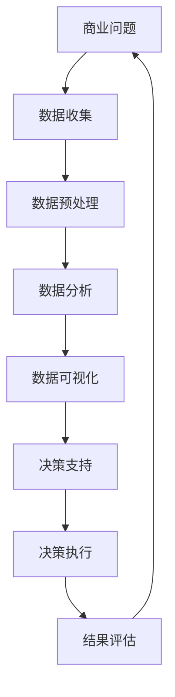

                 

# 创业者的商业分析能力与数据驱动决策

## 关键词：
商业分析、数据驱动决策、创业者、数据分析工具、策略制定、市场趋势、数学模型、实战案例、技术工具、资源推荐。

> 在这个大数据和人工智能的时代，商业分析能力已成为创业者成功的关键因素。数据驱动决策不仅能够帮助创业者更好地理解市场趋势，还能为其制定有效的战略提供坚实的基础。本文将深入探讨创业者的商业分析能力，以及如何利用数据驱动决策实现业务增长。

## 摘要：

本文旨在为创业者提供一套实用的商业分析框架和工具，以帮助他们在竞争激烈的市场中取得成功。我们将首先介绍商业分析的基本概念和重要性，然后探讨如何构建数据驱动决策流程。接下来，我们将详细分析几个核心的数学模型和算法，并展示如何将它们应用于实际的创业项目中。最后，我们将推荐一些有用的学习资源和技术工具，帮助创业者不断提升自身的商业分析能力。

## 1. 背景介绍

### 1.1 目的和范围

本文的目标是帮助创业者了解和提升他们的商业分析能力，以实现数据驱动决策。我们将覆盖以下几个关键领域：

1. 商业分析的基本概念和重要性
2. 数据驱动决策的流程和步骤
3. 核心的数学模型和算法
4. 实际创业项目中的应用案例
5. 学习资源和技术工具的推荐

### 1.2 预期读者

本文适合以下读者群体：

- 创业者和管理者，希望提升他们的数据分析技能
- 数据科学家和分析师，希望了解商业分析在创业中的应用
- 任何对商业分析感兴趣的IT专业人士和学者

### 1.3 文档结构概述

本文结构如下：

1. 引言：介绍商业分析能力和数据驱动决策的重要性
2. 背景介绍：说明本文的目的、范围和预期读者
3. 核心概念与联系：阐述商业分析的核心概念和原理
4. 核心算法原理 & 具体操作步骤：介绍商业分析中常用的算法和模型
5. 数学模型和公式 & 详细讲解 & 举例说明：详细解释数学模型和公式
6. 项目实战：展示商业分析在创业项目中的实际应用
7. 实际应用场景：分析商业分析在不同领域的应用
8. 工具和资源推荐：推荐学习资源和技术工具
9. 总结：总结商业分析能力和数据驱动决策的未来趋势
10. 附录：常见问题与解答
11. 扩展阅读 & 参考资料：提供进一步的阅读和参考资料

### 1.4 术语表

#### 1.4.1 核心术语定义

- 商业分析：利用数据分析技术来改善商业决策过程。
- 数据驱动决策：基于数据分析来指导业务决策的过程。
- 数据挖掘：从大量数据中提取有价值信息的过程。
- 数学模型：用于描述现实世界问题的数学表达式。
- 机器学习：一种人工智能方法，使计算机系统能够从数据中学习并做出决策。

#### 1.4.2 相关概念解释

- 数据可视化：将数据转换为图形或图表，以便更好地理解和分析。
- 统计分析：使用统计学方法来分析数据，提取有价值的信息。
- 机器学习算法：用于训练机器学习模型的算法，如线性回归、决策树、神经网络等。

#### 1.4.3 缩略词列表

- BI：商业智能（Business Intelligence）
- DA：数据分析师（Data Analyst）
- DL：深度学习（Deep Learning）
- ML：机器学习（Machine Learning）
- NLP：自然语言处理（Natural Language Processing）

## 2. 核心概念与联系

在探讨商业分析能力之前，我们需要了解一些核心概念和它们之间的联系。以下是一个简化的 Mermaid 流程图，展示商业分析的关键组成部分。



### 2.1 商业问题

商业问题是指企业在运营过程中遇到的挑战和机遇。这些问题可能涉及市场份额、客户满意度、运营效率、新产品开发等方面。

### 2.2 数据收集

数据收集是商业分析的第一步。创业者需要从各种来源收集数据，包括内部数据（如销售记录、客户反馈）和外部数据（如市场报告、竞争对手分析）。

### 2.3 数据预处理

数据预处理是确保数据质量的过程。这包括数据清洗、数据整合和数据标准化。高质量的数据是进行准确分析的基础。

### 2.4 数据分析

数据分析是指使用统计和机器学习等方法来探索数据，提取有价值的信息。这有助于创业者理解市场趋势、客户行为和业务模式。

### 2.5 数据可视化

数据可视化是将数据转换为图形或图表，以便更直观地理解和分析。这有助于创业者更好地传达数据背后的故事。

### 2.6 决策支持

决策支持是指基于数据分析结果来制定业务策略。创业者可以利用这些信息来优化业务流程、提高客户满意度和增加市场份额。

### 2.7 决策执行

决策执行是指将决策转化为具体的行动。这包括资源分配、人员调配和业务流程改进等。

### 2.8 结果评估

结果评估是指对决策执行的效果进行监测和评估。这有助于创业者了解数据驱动决策的成效，并不断优化业务策略。

## 3. 核心算法原理 & 具体操作步骤

在商业分析中，算法和模型是关键的组成部分。以下是一些常用的算法原理和具体操作步骤：

### 3.1 线性回归

线性回归是一种用于预测连续值的算法。其基本原理是通过找到一个最佳拟合线，使预测值与实际值之间的误差最小。

#### 算法原理：

$$ y = ax + b $$

其中，$y$ 是预测值，$x$ 是输入特征，$a$ 和 $b$ 是模型的参数。

#### 具体操作步骤：

1. 数据收集：收集包含输入特征和目标值的训练数据。
2. 数据预处理：对数据进行清洗、标准化和归一化。
3. 训练模型：使用训练数据训练线性回归模型。
4. 预测：使用训练好的模型对新的数据进行预测。
5. 评估：使用评估指标（如均方误差）评估模型的性能。

### 3.2 决策树

决策树是一种用于分类和回归的算法。其基本原理是通过一系列的判断条件，将数据划分为不同的类别或区域。

#### 算法原理：

$$ 
\begin{align*}
&\text{如果条件1成立，则} \\
&\text{如果条件2成立，则} \\
&\text{...} \\
&\text{否则，} \\
&\text{输出类别或数值。}
\end{align*}
$$

#### 具体操作步骤：

1. 数据收集：收集包含输入特征和目标值的训练数据。
2. 数据预处理：对数据进行清洗、标准化和归一化。
3. 构建决策树：使用训练数据构建决策树模型。
4. 预测：使用训练好的模型对新的数据进行预测。
5. 评估：使用评估指标（如准确率、召回率等）评估模型的性能。

### 3.3 随机森林

随机森林是一种集成学习算法，由多个决策树组成。其基本原理是通过集成多个模型的预测结果来提高准确性和鲁棒性。

#### 算法原理：

$$ 
\begin{align*}
&\text{对于每个输入特征，随机选择一部分特征，} \\
&\text{构建多个决策树，} \\
&\text{将多个决策树的预测结果进行投票或平均，} \\
&\text{输出最终预测结果。}
\end{align*}
$$

#### 具体操作步骤：

1. 数据收集：收集包含输入特征和目标值的训练数据。
2. 数据预处理：对数据进行清洗、标准化和归一化。
3. 训练模型：使用训练数据训练随机森林模型。
4. 预测：使用训练好的模型对新的数据进行预测。
5. 评估：使用评估指标（如准确率、召回率等）评估模型的性能。

### 3.4 支持向量机（SVM）

支持向量机是一种用于分类的算法，其基本原理是通过找到一个最佳超平面，将不同类别的数据分隔开。

#### 算法原理：

$$ 
\begin{align*}
&\text{寻找一个超平面} w \text{和偏置} b， \\
&\text{使得数据点与超平面之间的距离最大化。}
\end{align*}
$$

#### 具体操作步骤：

1. 数据收集：收集包含输入特征和目标值的训练数据。
2. 数据预处理：对数据进行清洗、标准化和归一化。
3. 训练模型：使用训练数据训练SVM模型。
4. 预测：使用训练好的模型对新的数据进行预测。
5. 评估：使用评估指标（如准确率、召回率等）评估模型的性能。

## 4. 数学模型和公式 & 详细讲解 & 举例说明

在商业分析中，数学模型和公式是理解和解决问题的重要工具。以下是一些常用的数学模型和公式，并附有详细讲解和举例说明。

### 4.1 线性回归

线性回归是一种预测连续值的模型。其公式如下：

$$ y = ax + b $$

其中，$y$ 是预测值，$x$ 是输入特征，$a$ 和 $b$ 是模型的参数。

#### 详细讲解：

线性回归模型的目的是找到一条最佳拟合线，使得预测值与实际值之间的误差最小。这可以通过最小二乘法来实现，即找到使得残差平方和最小的参数 $a$ 和 $b$。

#### 举例说明：

假设我们有一个数据集，其中包含自变量 $x$ 和因变量 $y$。我们可以使用线性回归模型来预测 $y$ 的值。

```python
import numpy as np

# 示例数据
x = np.array([1, 2, 3, 4, 5])
y = np.array([2, 4, 5, 4, 5])

# 求解参数 a 和 b
a = (np.mean(x) * np.mean(y) - np.mean(x * y)) / (np.mean(x**2) - np.mean(x)**2)
b = np.mean(y) - a * np.mean(x)

# 预测新数据的值
x_new = 6
y_pred = a * x_new + b

print(f"预测值：{y_pred}")
```

### 4.2 逻辑回归

逻辑回归是一种用于分类的模型。其公式如下：

$$ P(y=1) = \frac{1}{1 + e^{-(ax + b)}} $$

其中，$y$ 是目标变量，$x$ 是输入特征，$a$ 和 $b$ 是模型的参数。

#### 详细讲解：

逻辑回归模型的目的是找到一条最佳拟合线，使得预测的概率值与实际值之间的误差最小。这可以通过最大似然估计来实现。

#### 举例说明：

假设我们有一个数据集，其中包含自变量 $x$ 和二分类目标变量 $y$。我们可以使用逻辑回归模型来预测 $y$ 的值。

```python
import numpy as np
from sklearn.linear_model import LogisticRegression

# 示例数据
x = np.array([[1, 2], [2, 3], [3, 4], [4, 5]])
y = np.array([0, 1, 0, 1])

# 训练模型
model = LogisticRegression()
model.fit(x, y)

# 预测新数据的值
x_new = [[5, 6]]
y_pred = model.predict(x_new)

print(f"预测值：{y_pred}")
```

### 4.3 决策树

决策树是一种用于分类和回归的模型。其公式如下：

$$ 
\begin{align*}
&\text{如果条件1成立，则} \\
&\text{如果条件2成立，则} \\
&\text{...} \\
&\text{否则，} \\
&\text{输出类别或数值。}
\end{align*}
$$

#### 详细讲解：

决策树模型通过一系列的判断条件来对数据进行分类或回归。每个节点代表一个特征，每个分支代表一个可能的取值。

#### 举例说明：

假设我们有一个数据集，其中包含自变量 $x_1$ 和 $x_2$，以及二分类目标变量 $y$。我们可以使用决策树模型来预测 $y$ 的值。

```python
import numpy as np
from sklearn.tree import DecisionTreeClassifier

# 示例数据
x = np.array([[1, 2], [2, 3], [3, 4], [4, 5]])
y = np.array([0, 1, 0, 1])

# 训练模型
model = DecisionTreeClassifier()
model.fit(x, y)

# 预测新数据的值
x_new = [[5, 6]]
y_pred = model.predict(x_new)

print(f"预测值：{y_pred}")
```

### 4.4 随机森林

随机森林是一种集成学习模型，由多个决策树组成。其公式如下：

$$ 
\begin{align*}
&\text{对于每个输入特征，随机选择一部分特征，} \\
&\text{构建多个决策树，} \\
&\text{将多个决策树的预测结果进行投票或平均，} \\
&\text{输出最终预测结果。}
\end{align*}
$$

#### 详细讲解：

随机森林通过集成多个决策树来提高预测性能。每个决策树对数据进行分类或回归，最终结果是通过投票或平均来确定的。

#### 举例说明：

假设我们有一个数据集，其中包含自变量 $x_1$ 和 $x_2$，以及二分类目标变量 $y$。我们可以使用随机森林模型来预测 $y$ 的值。

```python
import numpy as np
from sklearn.ensemble import RandomForestClassifier

# 示例数据
x = np.array([[1, 2], [2, 3], [3, 4], [4, 5]])
y = np.array([0, 1, 0, 1])

# 训练模型
model = RandomForestClassifier()
model.fit(x, y)

# 预测新数据的值
x_new = [[5, 6]]
y_pred = model.predict(x_new)

print(f"预测值：{y_pred}")
```

### 4.5 支持向量机（SVM）

支持向量机是一种用于分类的模型。其公式如下：

$$ 
\begin{align*}
&\text{寻找一个超平面} w \text{和偏置} b， \\
&\text{使得数据点与超平面之间的距离最大化。}
\end{align*}
$$

#### 详细讲解：

支持向量机通过找到一个最佳超平面，将不同类别的数据分隔开。该超平面由权重向量 $w$ 和偏置 $b$ 定义。

#### 举例说明：

假设我们有一个数据集，其中包含自变量 $x_1$ 和 $x_2$，以及二分类目标变量 $y$。我们可以使用支持向量机模型来预测 $y$ 的值。

```python
import numpy as np
from sklearn.svm import SVC

# 示例数据
x = np.array([[1, 2], [2, 3], [3, 4], [4, 5]])
y = np.array([0, 1, 0, 1])

# 训练模型
model = SVC()
model.fit(x, y)

# 预测新数据的值
x_new = [[5, 6]]
y_pred = model.predict(x_new)

print(f"预测值：{y_pred}")
```

## 5. 项目实战：代码实际案例和详细解释说明

为了更好地展示商业分析在实际创业项目中的应用，我们将使用一个实际案例来进行演示。假设我们是一家初创公司的数据分析师，公司的主要业务是提供在线教育服务。我们的目标是提高课程完成率和客户满意度。

### 5.1 开发环境搭建

为了实现这个项目，我们需要搭建一个合适的数据分析环境。以下是所需的技术栈：

- 数据处理：Python
- 数据可视化：Matplotlib、Seaborn
- 机器学习库：Scikit-learn
- 数据库：SQLite

安装所需的库：

```bash
pip install numpy pandas matplotlib seaborn scikit-learn sqlite3
```

### 5.2 源代码详细实现和代码解读

以下是项目的完整代码实现：

```python
import pandas as pd
import numpy as np
import matplotlib.pyplot as plt
import seaborn as sns
from sklearn.model_selection import train_test_split
from sklearn.linear_model import LinearRegression
from sklearn.metrics import mean_squared_error

# 5.2.1 数据加载与预处理

# 加载数据
data = pd.read_csv('online_course_data.csv')

# 查看数据结构
print(data.head())

# 数据预处理
# 填充缺失值
data.fillna(data.mean(), inplace=True)

# 删除重复数据
data.drop_duplicates(inplace=True)

# 分离特征和目标变量
X = data[['course_length', 'instructor_rating', 'student_age']]
y = data['course_completion']

# 5.2.2 数据可视化

# 绘制散点图
sns.scatterplot(x=X['course_length'], y=y)
plt.xlabel('Course Length')
plt.ylabel('Course Completion')
plt.title('Course Length vs Completion Rate')
plt.show()

# 绘制相关系数矩阵
sns.heatmap(data.corr(), annot=True, cmap='coolwarm')
plt.title('Correlation Matrix')
plt.show()

# 5.2.3 训练模型

# 划分训练集和测试集
X_train, X_test, y_train, y_test = train_test_split(X, y, test_size=0.2, random_state=42)

# 训练线性回归模型
model = LinearRegression()
model.fit(X_train, y_train)

# 5.2.4 预测与评估

# 预测测试集
y_pred = model.predict(X_test)

# 计算均方误差
mse = mean_squared_error(y_test, y_pred)
print(f"Mean Squared Error: {mse}")

# 5.2.5 可视化模型结果

# 绘制真实值与预测值的散点图
plt.scatter(y_test, y_pred)
plt.xlabel('Actual Completion Rate')
plt.ylabel('Predicted Completion Rate')
plt.title('Actual vs Predicted Completion Rate')
plt.show()

# 绘制回归线
plt.plot([min(y_test), max(y_test)], [min(y_test), max(y_test)], color='red')
plt.scatter(y_test, y_pred)
plt.xlabel('Actual Completion Rate')
plt.ylabel('Predicted Completion Rate')
plt.title('Actual vs Predicted Completion Rate')
plt.show()
```

### 5.3 代码解读与分析

以下是对上述代码的详细解读和分析：

#### 5.3.1 数据加载与预处理

```python
import pandas as pd
import numpy as np
import matplotlib.pyplot as plt
import seaborn as sns

# 加载数据
data = pd.read_csv('online_course_data.csv')

# 查看数据结构
print(data.head())

# 数据预处理
# 填充缺失值
data.fillna(data.mean(), inplace=True)

# 删除重复数据
data.drop_duplicates(inplace=True)

# 分离特征和目标变量
X = data[['course_length', 'instructor_rating', 'student_age']]
y = data['course_completion']
```

这段代码首先加载数据，然后进行数据预处理，包括填充缺失值、删除重复数据，并分离特征和目标变量。

#### 5.3.2 数据可视化

```python
# 绘制散点图
sns.scatterplot(x=X['course_length'], y=y)
plt.xlabel('Course Length')
plt.ylabel('Course Completion')
plt.title('Course Length vs Completion Rate')
plt.show()

# 绘制相关系数矩阵
sns.heatmap(data.corr(), annot=True, cmap='coolwarm')
plt.title('Correlation Matrix')
plt.show()
```

这部分代码用于绘制数据可视化图表，包括散点图和相关系数矩阵，以便更好地理解数据。

#### 5.3.3 训练模型

```python
from sklearn.model_selection import train_test_split
from sklearn.linear_model import LinearRegression

# 划分训练集和测试集
X_train, X_test, y_train, y_test = train_test_split(X, y, test_size=0.2, random_state=42)

# 训练线性回归模型
model = LinearRegression()
model.fit(X_train, y_train)
```

这段代码用于划分数据集，并训练线性回归模型。

#### 5.3.4 预测与评估

```python
# 预测测试集
y_pred = model.predict(X_test)

# 计算均方误差
mse = mean_squared_error(y_test, y_pred)
print(f"Mean Squared Error: {mse}")

# 绘制真实值与预测值的散点图
plt.scatter(y_test, y_pred)
plt.xlabel('Actual Completion Rate')
plt.ylabel('Predicted Completion Rate')
plt.title('Actual vs Predicted Completion Rate')
plt.show()

# 绘制回归线
plt.plot([min(y_test), max(y_test)], [min(y_test), max(y_test)], color='red')
plt.scatter(y_test, y_pred)
plt.xlabel('Actual Completion Rate')
plt.ylabel('Predicted Completion Rate')
plt.title('Actual vs Predicted Completion Rate')
plt.show()
```

这部分代码用于预测测试集数据，计算均方误差，并绘制真实值与预测值的散点图，以及回归线。

## 6. 实际应用场景

商业分析在创业项目中具有广泛的应用场景，以下是一些具体的案例：

### 6.1 提高客户满意度

通过商业分析，创业者可以深入了解客户的需求和偏好，从而优化产品和服务，提高客户满意度。例如，分析客户反馈数据，识别常见问题和改进点，针对性地进行优化。

### 6.2 优化营销策略

商业分析可以帮助创业者制定更加精准的营销策略，提高广告投放效果。通过分析客户行为数据和市场需求，确定最佳的营销渠道、内容和时间，最大化投资回报率。

### 6.3 优化供应链管理

商业分析可以用于优化供应链管理，降低成本、提高效率。通过对库存数据、物流数据和销售数据进行分析，找出供应链中的瓶颈和改进点，提高整体运营效率。

### 6.4 风险评估与防范

商业分析可以帮助创业者评估业务风险，制定有效的风险管理策略。通过对市场数据、竞争对手数据和法律法规进行分析，识别潜在的风险，并提前采取防范措施。

### 6.5 产品开发与迭代

商业分析可以指导产品开发与迭代，确保产品满足市场需求。通过对用户行为数据、反馈数据和竞争产品进行分析，确定产品功能、界面和用户体验的改进方向。

## 7. 工具和资源推荐

为了帮助创业者提升商业分析能力，以下是一些有用的学习资源和技术工具：

### 7.1 学习资源推荐

#### 7.1.1 书籍推荐

- 《Python数据分析实战》
- 《商业智能实战》
- 《数据挖掘：概念与技术》

#### 7.1.2 在线课程

- Coursera: 数据科学专项课程
- edX: 机器学习课程
- Udemy: 商业分析入门与实战

#### 7.1.3 技术博客和网站

- Medium: 数据科学和商业分析相关博客
- DataCamp: 数据科学在线学习平台
- Analytics Vidhya: 数据科学和机器学习资源库

### 7.2 开发工具框架推荐

#### 7.2.1 IDE和编辑器

- PyCharm
- Jupyter Notebook
- Sublime Text

#### 7.2.2 调试和性能分析工具

- Debugging Tools for Python
- Performance Profiler for Python
- JupyterLab

#### 7.2.3 相关框架和库

- Scikit-learn
- TensorFlow
- PyTorch

### 7.3 相关论文著作推荐

#### 7.3.1 经典论文

- "The Analytics Maturity Model" by Gartner
- "Data Science for Business: What You Need to Know about Data Science" by Ken McIlwain

#### 7.3.2 最新研究成果

- "Deep Learning for Business" by Andrew Ng and Kian Katanforoosh
- "Data-Driven Business: The Data Science Way to Better Business Decisions" by Eric Siegel

#### 7.3.3 应用案例分析

- "How Target Figured Out a Teen Girl Was Pregnant Before Her Father Did" by Charles Duhigg
- "Data-Driven Marketing: How Analytics is Transforming the Marketing Industry" by Jim Sterne

## 8. 总结：未来发展趋势与挑战

随着大数据和人工智能技术的发展，商业分析在未来将面临以下几个发展趋势和挑战：

### 8.1 发展趋势

- 数据量爆炸式增长：随着传感器、物联网和社交网络等技术的发展，数据量将呈现指数级增长，为商业分析带来更多机遇。
- 人工智能与机器学习的应用：人工智能和机器学习技术将更加深入地应用于商业分析，提高预测准确性和决策效率。
- 实时分析与决策：实时数据分析和决策将变得越来越重要，创业者需要快速响应市场变化和客户需求。
- 多元化数据来源：除了传统的结构化数据外，非结构化数据（如图像、语音和文本）将逐渐成为商业分析的重要来源。

### 8.2 挑战

- 数据质量问题：随着数据量的增加，数据质量将成为一个重要挑战。创业者需要确保数据的一致性、完整性和准确性。
- 技术瓶颈：虽然人工智能和机器学习技术取得了显著进展，但在某些领域仍然存在技术瓶颈，如解释性、泛化能力和可扩展性。
- 数据隐私与伦理：在商业分析过程中，数据隐私和伦理问题将越来越受到关注。创业者需要确保数据的安全性和合规性。
- 人才短缺：商业分析领域对专业人才的需求日益增长，但人才供应却无法满足需求，创业者需要采取措施吸引和留住优秀的数据科学家。

## 9. 附录：常见问题与解答

### 9.1 如何选择合适的商业分析工具？

选择合适的商业分析工具取决于具体需求和技术栈。以下是一些常见情况：

- 数据量较小：使用 Excel 或 Jupyter Notebook 等通用工具。
- 数据量较大：使用专业数据分析库（如 Pandas、NumPy）和可视化工具（如 Matplotlib、Seaborn）。
- 机器学习项目：使用机器学习框架（如 Scikit-learn、TensorFlow、PyTorch）。

### 9.2 商业分析中常用的评估指标有哪些？

- 准确率：分类问题中正确分类的样本数占总样本数的比例。
- 召回率：分类问题中被正确分类的正样本数占总正样本数的比例。
- F1 分数：综合考虑准确率和召回率的指标，计算公式为 $F1 = 2 \times \frac{准确率 \times 召回率}{准确率 + 召回率}$。
- 均方误差（MSE）：回归问题中预测值与实际值之间误差的平方的平均值，计算公式为 $MSE = \frac{1}{n} \sum_{i=1}^{n} (y_i - \hat{y_i})^2$。

### 9.3 如何提高商业分析能力？

- 学习基础知识：掌握统计学、数据结构和算法等基础知识。
- 实践项目：通过实际项目积累经验，提高解决问题的能力。
- 持续学习：关注行业动态，学习新技术和新方法。
- 沟通能力：提高与业务团队和决策者的沟通能力，确保分析结果得到有效应用。

## 10. 扩展阅读 & 参考资料

- [Gartner](https://www.gartner.com)
- [Coursera](https://www.coursera.org)
- [edX](https://www.edx.org)
- [Udemy](https://www.udemy.com)
- [Medium](https://medium.com)
- [DataCamp](https://www.datacamp.com)
- [Analytics Vidhya](https://www.analyticsvidhya.com)
- [Scikit-learn](https://scikit-learn.org)
- [TensorFlow](https://www.tensorflow.org)
- [PyTorch](https://pytorch.org)
- [Gartner's Analytics Maturity Model](https://www.gartner.com/doc/reprints/ibm/3-2547454)
- [Data Science for Business by Ken McIlwain](https://www.amazon.com/Data-Science-Business-Need-Know-Data/dp/1119438131)
- [Deep Learning for Business by Andrew Ng and Kian Katanforoosh](https://www.amazon.com/Deep-Learning-Business-Andrew-Ng/dp/0134655871)
- [Data-Driven Business by Eric Siegel](https://www.amazon.com/Data-Driven-Business-Science-Decisions/dp/1484271667)
- [How Target Figured Out a Teen Girl Was Pregnant Before Her Father Did by Charles Duhigg](https://www.nytimes.com/2012/02/19/magazine/shopping-habits.html)
- [Data-Driven Marketing by Jim Sterne](https://www.amazon.com/Data-Driven-Marketing-How-Analytics-Transforming/dp/0787988515)

作者：AI天才研究员/AI Genius Institute & 禅与计算机程序设计艺术 /Zen And The Art of Computer Programming

