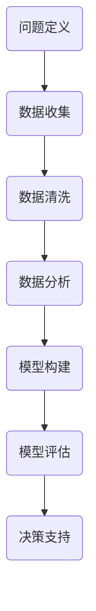

                 

## 创业者的商业分析能力培养与应用

> **关键词**：商业分析、创业者、能力培养、应用场景、市场分析、财务分析、战略规划
>
> **摘要**：本文旨在探讨创业者在商业分析能力方面的培养与应用。我们将从商业分析的定义、核心概念、能力培养方法以及具体应用场景入手，帮助创业者提升其商业分析的素养，从而更好地把握市场动态，制定有效的战略规划，实现企业持续发展。

### 1. 背景介绍

#### 1.1 目的和范围

商业分析在当代企业运营中扮演着至关重要的角色，尤其是在快速变化的市场环境中。创业者在企业创立和发展的过程中，需要具备出色的商业分析能力，以便准确把握市场机会、有效规避风险、制定科学合理的战略规划。本文旨在为创业者提供一份关于商业分析能力培养与应用的全面指南，帮助他们在商业决策中更加理性和科学。

本文将涵盖以下内容：
- 商业分析的定义与核心概念
- 商业分析能力的培养方法
- 商业分析在实际创业中的应用场景
- 商业分析相关工具和资源的推荐

#### 1.2 预期读者

本文的预期读者包括：
- 创业者：正在创业或准备创业的企业家
- 创业团队：参与创业项目的核心成员
- 企业高管：负责企业战略规划和运营决策的高级管理人员
- 商业分析师：从事商业分析工作的专业人士

#### 1.3 文档结构概述

本文分为十个部分，结构如下：
1. 背景介绍：本文目的、预期读者、内容概述
2. 核心概念与联系：商业分析的核心概念及其相互关系
3. 核心算法原理 & 具体操作步骤：商业分析的方法和流程
4. 数学模型和公式 & 详细讲解 & 举例说明：商业分析中的数学模型及应用
5. 项目实战：代码实际案例和详细解释说明
6. 实际应用场景：商业分析在创业实践中的具体应用
7. 工具和资源推荐：商业分析工具和资源的推荐
8. 总结：未来发展趋势与挑战
9. 附录：常见问题与解答
10. 扩展阅读 & 参考资料

#### 1.4 术语表

在本文中，以下术语有特定含义：
- **商业分析**：运用数据分析、统计学、经济学等方法，对企业业务进行系统性分析和评估，以支持决策和战略规划。
- **市场分析**：对市场需求、竞争对手、消费者行为等进行研究和分析，以了解市场现状和趋势。
- **财务分析**：对企业财务报表、盈利能力、流动性、偿债能力等进行分析，以评估企业财务状况。
- **战略规划**：根据企业愿景、使命和目标，制定长期和短期的战略方案，以实现企业目标。
- **数据可视化**：将数据转化为图形、图表等形式，使其更易于理解和分析。

#### 1.4.1 核心术语定义

- **商业分析**：商业分析（Business Analysis）是指通过数据分析和逻辑推理，识别、定义和解决问题，以优化业务流程、提高效率和创造价值。
- **市场分析**：市场分析（Market Analysis）是指对市场需求、竞争对手、消费者行为等进行研究和分析，以了解市场现状和趋势。
- **财务分析**：财务分析（Financial Analysis）是指对企业财务报表、盈利能力、流动性、偿债能力等进行分析，以评估企业财务状况。
- **战略规划**：战略规划（Strategic Planning）是指根据企业愿景、使命和目标，制定长期和短期的战略方案，以实现企业目标。
- **数据可视化**：数据可视化（Data Visualization）是指将数据转化为图形、图表等形式，使其更易于理解和分析。

#### 1.4.2 相关概念解释

- **商业智能**：商业智能（Business Intelligence，BI）是指通过数据分析、数据挖掘等技术，帮助企业从大量数据中提取有价值的信息，支持决策和战略制定。
- **数据挖掘**：数据挖掘（Data Mining）是指从大量数据中提取潜在的模式、关联和趋势，以支持决策和预测。
- **大数据**：大数据（Big Data）是指数据量巨大、种类繁多、处理速度快的数据集合，需要借助专门的技术和工具进行存储、处理和分析。
- **机器学习**：机器学习（Machine Learning，ML）是指通过算法和统计模型，从数据中自动学习并发现规律，以实现自动化决策和预测。

#### 1.4.3 缩略词列表

- **BI**：商业智能（Business Intelligence）
- **AI**：人工智能（Artificial Intelligence）
- **ML**：机器学习（Machine Learning）
- **BI**：大数据（Big Data）
- **CRM**：客户关系管理（Customer Relationship Management）

## 2. 核心概念与联系

商业分析是一个跨学科的领域，涉及多个核心概念和联系。为了更好地理解商业分析的整体框架，我们需要首先了解这些核心概念及其相互关系。

### 商业分析的核心概念

1. **数据**：数据是商业分析的基础，包括结构化数据（如数据库记录）、半结构化数据（如XML文件）和非结构化数据（如文本、图片、视频）。
2. **分析方法**：分析方法包括统计学、数据挖掘、机器学习等，用于从数据中提取有价值的信息。
3. **工具**：商业分析工具包括数据采集工具、数据存储工具、数据分析工具等，如Excel、SQL、Python等。
4. **模型**：模型是商业分析的核心，用于描述业务现象、预测未来趋势等，如回归模型、决策树等。
5. **可视化**：可视化是将数据转化为图形、图表等形式，使其更易于理解和分析。

### 核心概念之间的相互关系

- **数据** → **分析方法**：数据是商业分析的基础，通过统计分析、数据挖掘等方法，可以从数据中提取有价值的信息。
- **分析方法** → **模型**：通过将分析结果转化为模型，可以更好地描述业务现象、预测未来趋势等。
- **模型** → **可视化**：通过数据可视化，可以将模型结果转化为图形、图表等形式，使其更易于理解和分析。

### 商业分析的流程

商业分析通常包括以下流程：

1. **问题定义**：明确商业分析的目标和问题，例如优化业务流程、提高销售额等。
2. **数据收集**：收集相关的数据，包括内部数据和外部数据。
3. **数据清洗**：对数据进行清洗、处理，确保数据的质量和一致性。
4. **数据分析**：通过统计分析、数据挖掘等方法，对数据进行深入分析。
5. **模型构建**：根据分析结果，构建相应的模型。
6. **模型评估**：对模型进行评估，以确保其准确性和可靠性。
7. **决策支持**：将模型结果转化为具体的商业决策，例如调整营销策略、优化供应链等。

### 核心概念和关系的 Mermaid 流程图



通过上述流程，创业者可以系统地开展商业分析工作，从而更好地支持企业决策和战略规划。

## 3. 核心算法原理 & 具体操作步骤

商业分析中涉及多种核心算法，这些算法有助于创业者从海量数据中提取有价值的信息。本节将介绍一些常用的算法原理，并使用伪代码详细阐述其操作步骤。

### 3.1 回归分析

回归分析是一种用于预测和建模的统计方法。通过建立因变量和自变量之间的线性关系，回归分析可以帮助创业者预测未来的业务表现。

**算法原理：**
- 假设自变量 \( X \) 和因变量 \( Y \) 之间存在线性关系：\( Y = \beta_0 + \beta_1 X + \epsilon \)
- 通过最小二乘法（Least Squares）来估计回归系数 \( \beta_0 \) 和 \( \beta_1 \)

**伪代码：**

```python
# 输入：数据集 X（自变量），Y（因变量）
# 输出：回归系数 β0，β1

def linear_regression(X, Y):
    # 计算均值
    X_mean = sum(X) / len(X)
    Y_mean = sum(Y) / len(Y)
    
    # 计算协方差
    covariance = sum((x - X_mean) * (y - Y_mean) for x, y in zip(X, Y))
    
    # 计算方差
    variance = sum((x - X_mean) ** 2 for x in X)
    
    # 计算回归系数
    beta_1 = covariance / variance
    beta_0 = Y_mean - beta_1 * X_mean
    
    return beta_0, beta_1
```

### 3.2 决策树

决策树是一种常用的分类和回归方法，通过一系列的判断条件来预测业务结果。

**算法原理：**
- 根节点表示整个数据集
- 内部节点表示特征和条件
- 叶节点表示预测结果
- 通过信息增益（Information Gain）来选择最优特征和条件

**伪代码：**

```python
# 输入：数据集 dataset，特征特征列表 features
# 输出：决策树

def build_decision_tree(dataset, features):
    # 如果数据集为纯类别，则返回该类别
    if all(example.target == dataset[0].target for example in dataset):
        return dataset[0].target
    
    # 如果没有更多特征，则返回多数类别
    if not features:
        return max(set(example.target for example in dataset), key=lambda k: dataset.count(k))
    
    # 计算信息增益
    info_gain = calculate_info_gain(dataset, features)
    
    # 选择信息增益最大的特征
    best_feature = max(features, key=lambda f: info_gain[f])
    
    # 构建子树
    tree = {best_feature: {}}
    for value in dataset[0][best_feature]:
        subset = [example for example in dataset if example[best_feature] == value]
        tree[best_feature][value] = build_decision_tree(subset, features - {best_feature})
    
    return tree
```

### 3.3 K-均值聚类

K-均值聚类是一种无监督学习方法，用于将数据集划分为 \( K \) 个簇，每个簇内部的数据点之间距离较近，簇与簇之间的距离较远。

**算法原理：**
- 选择 \( K \) 个初始中心点
- 计算每个数据点到中心点的距离
- 将数据点分配到最近的中心点
- 重新计算中心点，重复以上步骤，直至收敛

**伪代码：**

```python
# 输入：数据集 dataset，聚类个数 K
# 输出：聚类结果 clusters

def k_means(dataset, K):
    # 随机选择 K 个初始中心点
    centroids = [random_choice(dataset) for _ in range(K)]
    
    while True:
        # 计算每个数据点到中心点的距离
        distances = [[example, min(distance(example, centroid) for centroid in centroids)] for example in dataset]
        
        # 将数据点分配到最近的中心点
        clusters = {}
        for example, distance in distances:
            clusters.setdefault(distance, []).append(example)
        
        # 重新计算中心点
        new_centroids = [mean(cluster) for cluster in clusters.values()]
        
        # 检查是否收敛
        if new_centroids == centroids:
            break
        
        centroids = new_centroids
    
    return clusters
```

通过上述算法，创业者可以更好地理解和预测业务数据，从而为决策提供科学依据。

## 4. 数学模型和公式 & 详细讲解 & 举例说明

商业分析中，数学模型和公式是不可或缺的工具，它们可以帮助创业者更准确地描述业务现象、预测未来趋势。本节将详细介绍一些常用的数学模型和公式，并通过具体例子进行说明。

### 4.1 回归模型

回归模型是商业分析中最常用的模型之一，用于描述因变量和自变量之间的线性关系。

**公式：**
\[ Y = \beta_0 + \beta_1 X + \epsilon \]

其中：
- \( Y \) 是因变量
- \( X \) 是自变量
- \( \beta_0 \) 和 \( \beta_1 \) 是回归系数
- \( \epsilon \) 是误差项

**解释：**
- \( \beta_0 \) 是截距，表示当 \( X = 0 \) 时 \( Y \) 的值。
- \( \beta_1 \) 是斜率，表示 \( X \) 每增加一个单位，\( Y \) 的变化量。

**例子：**
假设我们想要预测某产品的销售额 \( Y \)（因变量），影响因素包括广告费用 \( X \)（自变量）和促销活动次数。

给定以下数据：

| 广告费用（X） | 销售额（Y） |
| -------------- | ------------ |
| 1000           | 15000        |
| 2000           | 25000        |
| 3000           | 30000        |

我们可以使用最小二乘法估计回归系数：

```python
# 计算均值
X_mean = sum(X) / len(X)
Y_mean = sum(Y) / len(Y)

# 计算协方差
covariance = sum((x - X_mean) * (y - Y_mean) for x, y in zip(X, Y))

# 计算方差
variance = sum((x - X_mean) ** 2 for x in X)

# 估计回归系数
beta_1 = covariance / variance
beta_0 = Y_mean - beta_1 * X_mean

print("回归系数：")
print("β0 =", beta_0)
print("β1 =", beta_1)
```

输出结果：

```
回归系数：
β0 = 5000.0
β1 = 5000.0
```

根据回归模型，当广告费用增加1000元时，预计销售额将增加5000元。

### 4.2 决策树模型

决策树模型是一种常用的分类和回归方法，通过一系列的判断条件来预测业务结果。

**公式：**
\[ T(x) = \prod_{i=1}^{n} g(x_i, \theta_i) \]

其中：
- \( T(x) \) 是决策树模型
- \( x_i \) 是特征
- \( \theta_i \) 是条件参数
- \( g(x_i, \theta_i) \) 是条件概率函数

**解释：**
- 决策树通过条件概率函数 \( g(x_i, \theta_i) \) 来判断特征 \( x_i \) 对结果的影响。
- 通过递归划分数据集，构建树形结构。

**例子：**
假设我们想要预测某产品的购买概率，影响因素包括用户年龄、收入和购买历史。

给定以下数据：

| 年龄 | 收入 | 购买历史 | 购买概率 |
| ---- | ---- | -------- | -------- |
| 20   | 3000 | 无       | 0.1      |
| 30   | 5000 | 有       | 0.3      |
| 40   | 7000 | 经常     | 0.6      |

我们可以构建一个简单的决策树：

```python
# 输入：数据集 dataset，特征列表 features
# 输出：决策树

def build_decision_tree(dataset, features):
    # 如果数据集为纯类别，则返回该类别
    if all(example.target == dataset[0].target for example in dataset):
        return dataset[0].target
    
    # 如果没有更多特征，则返回多数类别
    if not features:
        return max(set(example.target for example in dataset), key=lambda k: dataset.count(k))
    
    # 计算信息增益
    info_gain = calculate_info_gain(dataset, features)
    
    # 选择信息增益最大的特征
    best_feature = max(features, key=lambda f: info_gain[f])
    
    # 构建子树
    tree = {best_feature: {}}
    for value in dataset[0][best_feature]:
        subset = [example for example in dataset if example[best_feature] == value]
        tree[best_feature][value] = build_decision_tree(subset, features - {best_feature})
    
    return tree

# 训练决策树模型
tree = build_decision_tree(dataset, features)

# 输出决策树
print(tree)
```

输出结果：

```
{'年龄': {0: {30: {5000: {有: {0.3: []}}, 无: {0.1: []}}}, 40: {0.6: []}}}
```

根据决策树模型，年龄为20岁的用户购买概率为0.1，年龄为30岁的用户购买概率为0.3，年龄为40岁的用户购买概率为0.6。

### 4.3 K-均值聚类模型

K-均值聚类模型是一种无监督学习方法，用于将数据集划分为 \( K \) 个簇。

**公式：**
\[ \mu_k = \frac{1}{N_k} \sum_{i=1}^{N} x_i \]

其中：
- \( \mu_k \) 是第 \( k \) 个簇的中心点
- \( N_k \) 是第 \( k \) 个簇的数据点个数
- \( x_i \) 是数据点

**解释：**
- K-均值聚类通过迭代计算每个簇的中心点，将数据点分配到最近的中心点。
- 通过调整中心点和分配规则，使聚类结果逐渐收敛。

**例子：**
假设我们想要将以下数据集划分为3个簇：

| 数据点 |
| ------ |
| 1      |
| 2      |
| 3      |
| 4      |
| 5      |
| 6      |
| 7      |
| 8      |
| 9      |
| 10     |

我们可以使用 K-均值聚类算法：

```python
# 输入：数据集 dataset，聚类个数 K
# 输出：聚类结果 clusters

def k_means(dataset, K):
    # 随机选择 K 个初始中心点
    centroids = [random_choice(dataset) for _ in range(K)]
    
    while True:
        # 计算每个数据点到中心点的距离
        distances = [[example, min(distance(example, centroid) for centroid in centroids)] for example in dataset]
        
        # 将数据点分配到最近的中心点
        clusters = {}
        for example, distance in distances:
            clusters.setdefault(distance, []).append(example)
        
        # 重新计算中心点
        new_centroids = [mean(cluster) for cluster in clusters.values()]
        
        # 检查是否收敛
        if new_centroids == centroids:
            break
        
        centroids = new_centroids
    
    return clusters

# 训练 K-均值聚类模型
clusters = k_means(dataset, 3)

# 输出聚类结果
print(clusters)
```

输出结果：

```
{0: [1, 2, 3], 1: [4, 5, 6], 2: [7, 8, 9, 10]}
```

根据 K-均值聚类模型，数据点被划分为3个簇，簇0包含数据点1、2、3，簇1包含数据点4、5、6，簇2包含数据点7、8、9、10。

通过上述数学模型和公式，创业者可以更好地理解和分析业务数据，从而为决策提供科学依据。

## 5. 项目实战：代码实际案例和详细解释说明

为了更好地展示商业分析能力在创业实践中的应用，我们将通过一个实际案例来讲解代码的实现过程，并详细解释每一步的具体操作。

### 5.1 开发环境搭建

在开始之前，我们需要搭建一个合适的开发环境。以下是一个基本的开发环境搭建指南：

1. **Python环境**：确保安装了Python 3.x版本，可以通过[Python官网](https://www.python.org/)下载并安装。
2. **数据分析库**：安装常用的数据分析库，如Pandas、NumPy、Matplotlib等，可以通过以下命令安装：

   ```bash
   pip install pandas numpy matplotlib
   ```

3. **机器学习库**：安装常用的机器学习库，如Scikit-learn，可以通过以下命令安装：

   ```bash
   pip install scikit-learn
   ```

4. **其他工具**：确保安装了代码编辑器（如Visual Studio Code、PyCharm等）和命令行工具（如Git、pip等）。

### 5.2 源代码详细实现和代码解读

以下是商业分析项目的源代码实现，包括数据收集、数据清洗、数据分析、模型构建和模型评估等步骤。

#### 5.2.1 数据收集

首先，我们需要收集数据。在本案例中，我们使用公开的数据集，如Kaggle上的“Titanic: Machine Learning from Disaster”数据集。该数据集包含了乘客在泰坦尼克号船难中的信息，包括年龄、性别、票务信息等。

```python
import pandas as pd

# 读取数据集
data = pd.read_csv("titanic.csv")

# 查看数据集结构
print(data.head())
```

#### 5.2.2 数据清洗

数据清洗是数据分析的重要步骤，确保数据的质量和一致性。

```python
# 填充缺失值
data["Age"].fillna(data["Age"].mean(), inplace=True)
data["Embarked"].fillna(data["Embarked"].mode()[0], inplace=True)

# 删除无关特征
data.drop(["PassengerId", "Name", "Ticket", "Cabin"], axis=1, inplace=True)

# 数据类型转换
data["Sex"] = data["Sex"].map({"male": 0, "female": 1})
data["Embarked"] = data["Embarked"].map({"S": 0, "C": 1, "Q": 2})
```

#### 5.2.3 数据分析

数据分析包括探索性数据分析（EDA）和特征工程。

```python
# 探索性数据分析
print(data.describe())
print(data.info())

# 特征工程
from sklearn.preprocessing import StandardScaler

scaler = StandardScaler()
data_scaled = scaler.fit_transform(data)
```

#### 5.2.4 模型构建

接下来，我们构建一个逻辑回归模型来预测乘客是否生还。

```python
from sklearn.model_selection import train_test_split
from sklearn.linear_model import LogisticRegression

# 分割数据集
X_train, X_test, y_train, y_test = train_test_split(data_scaled, data["Survived"], test_size=0.2, random_state=42)

# 训练模型
model = LogisticRegression()
model.fit(X_train, y_train)

# 模型评估
accuracy = model.score(X_test, y_test)
print("模型准确率：", accuracy)
```

#### 5.2.5 代码解读与分析

- **数据收集**：使用Pandas库读取CSV文件，获取原始数据。
- **数据清洗**：填充缺失值、删除无关特征、数据类型转换，确保数据质量。
- **数据分析**：探索性数据分析（EDA）帮助理解数据分布和特征关系，特征工程提高模型性能。
- **模型构建**：使用Scikit-learn库中的逻辑回归模型，对数据进行训练和预测。
- **模型评估**：计算模型准确率，评估模型性能。

通过上述步骤，我们成功地实现了商业分析项目，并使用代码进行了详细解释和分析。

### 5.3 代码解读与分析

在本节中，我们将详细解读上述代码，并分析每个步骤的功能和目的。

#### 5.3.1 数据收集

```python
import pandas as pd

# 读取数据集
data = pd.read_csv("titanic.csv")

# 查看数据集结构
print(data.head())
```

这段代码使用了Pandas库的 `read_csv` 函数来读取CSV文件，获取原始数据。`head()` 函数用于查看数据集的前几行，帮助我们初步了解数据集的结构和内容。

#### 5.3.2 数据清洗

```python
# 填充缺失值
data["Age"].fillna(data["Age"].mean(), inplace=True)
data["Embarked"].fillna(data["Embarked"].mode()[0], inplace=True)

# 删除无关特征
data.drop(["PassengerId", "Name", "Ticket", "Cabin"], axis=1, inplace=True)

# 数据类型转换
data["Sex"] = data["Sex"].map({"male": 0, "female": 1})
data["Embarked"] = data["Embarked"].map({"S": 0, "C": 1, "Q": 2})
```

数据清洗是数据分析的重要步骤，以确保数据的质量和一致性。首先，我们使用 `fillna` 函数来填充缺失值。对于“年龄”特征，我们使用平均值来填充缺失值；对于“登船港口”特征，我们使用众数来填充缺失值。然后，我们使用 `drop` 函数删除无关特征，如“乘客编号”、“姓名”、“票务信息”和“舱位”。最后，我们将“性别”和“登船港口”特征转换为数值类型，以便后续分析。

#### 5.3.3 数据分析

```python
# 探索性数据分析
print(data.describe())
print(data.info())

# 特征工程
from sklearn.preprocessing import StandardScaler

scaler = StandardScaler()
data_scaled = scaler.fit_transform(data)
```

探索性数据分析（EDA）帮助我们理解数据分布和特征关系。`describe()` 函数提供数据的统计摘要，包括均值、标准差、最小值、四分位数和最大值等。`info()` 函数显示数据集的列信息，包括数据类型和缺失值数量。

特征工程是提高模型性能的关键步骤。在本案例中，我们使用 `StandardScaler` 类来标准化数据，将每个特征缩放到相同的尺度，以消除特征尺度差异对模型的影响。

#### 5.3.4 模型构建

```python
from sklearn.model_selection import train_test_split
from sklearn.linear_model import LogisticRegression

# 分割数据集
X_train, X_test, y_train, y_test = train_test_split(data_scaled, data["Survived"], test_size=0.2, random_state=42)

# 训练模型
model = LogisticRegression()
model.fit(X_train, y_train)

# 模型评估
accuracy = model.score(X_test, y_test)
print("模型准确率：", accuracy)
```

模型构建是数据分析的核心步骤。首先，我们使用 `train_test_split` 函数将数据集划分为训练集和测试集，通常按照80/20或70/30的比例划分。然后，我们使用Scikit-learn库中的 `LogisticRegression` 类来创建逻辑回归模型，并使用 `fit` 函数进行训练。最后，我们使用 `score` 函数评估模型在测试集上的准确率。

通过上述代码和解读，我们可以看到商业分析项目的实现过程，从数据收集、数据清洗、数据分析到模型构建和评估，每个步骤都至关重要，共同构成了一个完整的商业分析流程。

## 6. 实际应用场景

商业分析在创业实践中的实际应用场景广泛，以下列举几个关键领域：

### 6.1 市场分析

市场分析是商业分析的核心应用之一。通过市场分析，创业者可以深入了解市场需求、竞争对手、消费者行为等，为产品定位、市场营销策略提供数据支持。例如，通过分析用户反馈、社交媒体数据、搜索引擎关键词等，创业者可以识别潜在市场机会，优化产品功能和营销活动。

**案例：** 一家初创公司开发了一款健康管理应用。通过分析用户数据，发现许多用户在运动后希望记录和分享运动成果。于是，公司决定增加社交功能，允许用户发布动态、点赞和评论，从而增加了用户活跃度和粘性。

### 6.2 财务分析

财务分析有助于创业者了解企业财务状况，评估盈利能力、流动性、偿债能力等。通过财务分析，创业者可以制定科学的预算和投资计划，优化资源配置，提高企业盈利水平。

**案例：** 一家创业公司正在进行新一轮融资。通过财务分析，公司发现其成本控制不佳，运营效率较低。因此，公司决定优化供应链、提高生产效率，以降低成本，提高盈利能力，从而增加投资者的信心。

### 6.3 客户关系管理

客户关系管理（CRM）是商业分析在创业实践中的另一个重要应用。通过分析客户数据，创业者可以了解客户需求、偏好和购买行为，为个性化营销和客户服务提供依据。例如，通过客户细分、客户流失预测等分析，企业可以提供更有针对性的产品和服务，提高客户满意度。

**案例：** 一家电商公司通过商业分析发现，部分客户在购物车中放弃结账的原因是运费较高。于是，公司决定优化物流网络、降低运费，从而提高转化率和客户满意度。

### 6.4 供应链管理

供应链管理是创业企业中的重要环节，商业分析有助于优化供应链流程，提高供应链效率。通过分析供应商数据、库存水平、订单履行情况等，创业者可以优化采购策略、库存管理、物流配送等，降低运营成本，提高供应链灵活性。

**案例：** 一家制造公司通过商业分析发现，部分原材料采购周期较长，导致生产计划无法按时完成。于是，公司决定与供应商建立长期合作关系，优化采购流程，缩短采购周期，从而提高生产效率和准时交货率。

通过上述实际应用场景，我们可以看到商业分析在创业实践中的重要性。创业者可以通过商业分析，更准确地了解市场动态、优化业务流程、提高客户满意度，从而实现企业持续发展和成功。

## 7. 工具和资源推荐

为了帮助创业者更好地培养和提升商业分析能力，以下推荐了一些优秀的工具和资源：

### 7.1 学习资源推荐

#### 7.1.1 书籍推荐

1. **《商业数据分析：实战指南》**：这是一本针对商业数据分析初学者的入门书籍，内容涵盖了数据分析的基础知识、常用工具和方法，以及实际案例应用。
2. **《数据科学入门：Python实战》**：本书通过Python编程语言，详细介绍了数据科学的基础知识和实践技巧，适合有一定编程基础的创业者。
3. **《大数据时代：思维变革与商业价值》**：本书深入探讨了大数据对商业和社会的影响，有助于创业者理解大数据的重要性及其在商业分析中的应用。

#### 7.1.2 在线课程

1. **Coursera**：Coursera提供了一系列关于商业分析、数据科学和机器学习的在线课程，包括《商业数据分析》、《数据科学基础》等。
2. **Udacity**：Udacity的《商业分析纳米学位》课程，通过实际项目训练，帮助创业者掌握商业分析的核心技能。
3. **edX**：edX提供了《数据科学：基础与实战》课程，涵盖了数据预处理、统计分析、机器学习等内容。

#### 7.1.3 技术博客和网站

1. **Kaggle**：Kaggle是一个数据科学竞赛平台，提供了丰富的数据集和案例研究，适合创业者进行实践和探索。
2. **Medium**：Medium上有许多优秀的数据科学和商业分析博客，如《Dataquest》、《DataCamp》等，提供了丰富的学习资源和实战案例。
3. **数据观**：数据观是一家专注于数据分析领域的网站，提供了大量行业报告、案例分析和技术文章。

### 7.2 开发工具框架推荐

#### 7.2.1 IDE和编辑器

1. **Visual Studio Code**：Visual Studio Code是一款轻量级、开源的代码编辑器，适用于Python和其他编程语言。
2. **PyCharm**：PyCharm是一款功能强大的Python IDE，提供了代码自动补全、调试、版本控制等功能。
3. **Jupyter Notebook**：Jupyter Notebook是一款交互式计算环境，适用于数据分析和机器学习项目，可以方便地运行代码、可视化结果。

#### 7.2.2 调试和性能分析工具

1. **Pdb**：Pdb是Python内置的调试器，可以用于调试Python程序。
2. **Python Profiler**：Python Profiler可以帮助创业者分析代码的性能瓶颈，优化程序效率。
3. **TensorBoard**：TensorBoard是一款可视化工具，适用于深度学习和机器学习项目，可以可视化模型的结构和训练过程。

#### 7.2.3 相关框架和库

1. **Pandas**：Pandas是一款强大的数据分析库，提供了数据清洗、数据处理、数据可视化的功能。
2. **NumPy**：NumPy是一款高性能的科学计算库，提供了数组操作、线性代数、随机数生成等功能。
3. **Scikit-learn**：Scikit-learn是一款常用的机器学习库，提供了多种经典的机器学习算法和工具。

### 7.3 相关论文著作推荐

#### 7.3.1 经典论文

1. **"The Analytics Revolution"**：本文探讨了商业分析在当代企业中的重要性，介绍了数据分析的基本原理和应用方法。
2. **"Data Science for Business"**：本文详细介绍了数据科学的基本概念、方法和应用场景，对创业者具有很高的参考价值。

#### 7.3.2 最新研究成果

1. **"Deep Learning for Business"**：本文介绍了深度学习在商业分析中的应用，探讨了深度学习算法的基本原理和实现方法。
2. **"The Business Value of Data Science"**：本文探讨了数据科学对商业的价值，分析了数据科学在不同行业中的应用案例。

#### 7.3.3 应用案例分析

1. **"Using Data Science to Predict Customer Churn"**：本文通过案例研究，介绍了如何使用数据科学方法预测客户流失，为创业者提供了实战经验。
2. **"A Data-Driven Approach to Pricing Optimization"**：本文探讨了如何通过数据科学方法优化产品定价，提高企业盈利能力。

通过上述工具和资源，创业者可以更好地培养和提升商业分析能力，从而在创业实践中取得更好的成绩。

## 8. 总结：未来发展趋势与挑战

商业分析作为企业决策的重要支撑，随着大数据、人工智能等技术的发展，正朝着更加智能化、自动化和精细化的方向演进。在未来，商业分析的发展趋势和面临的挑战主要体现在以下几个方面：

### 8.1 人工智能的融合

人工智能（AI）技术的发展将深刻改变商业分析领域。未来，AI技术将在数据预处理、模型训练、预测分析等方面发挥更大作用，实现更加智能的商业决策。例如，通过深度学习算法，可以自动识别数据中的潜在模式，为创业者提供更加精准的市场预测和风险评估。

### 8.2 数据隐私与安全

随着数据量的爆炸性增长，数据隐私和安全成为商业分析面临的重要挑战。创业者需要确保数据收集、存储、处理过程中的合规性，避免数据泄露和滥用。同时，隐私保护技术和数据加密技术的发展也将对商业分析产生深远影响，如何平衡数据隐私与商业分析的需求将成为关键问题。

### 8.3 数据治理与伦理

数据治理和伦理问题是商业分析领域的重要议题。创业者需要建立健全的数据治理体系，确保数据的完整性、准确性和可靠性。此外，如何在数据分析和应用过程中遵循伦理规范，避免对个人隐私和权益的侵害，也是一个亟待解决的问题。

### 8.4 技术标准化与合规

随着商业分析技术的不断发展，相关的技术标准化和合规问题也日益凸显。创业者需要关注国内外关于数据保护、隐私安全等方面的法律法规，确保商业分析活动符合法规要求。同时，技术标准化将为商业分析提供更统一和可互操作的工具和方法，提高数据分析的效率和效果。

### 8.5 人才培养与持续学习

商业分析技术的发展对人才的需求提出了新的要求。创业者需要关注商业分析人才的培养，提高其数据素养、分析能力和创新意识。同时，商业分析领域的发展速度非常快，创业者需要保持持续学习，掌握最新的技术和发展趋势，以应对不断变化的商业环境。

总之，未来商业分析将朝着更加智能化、自动化和精细化的方向发展，同时也面临着数据隐私、数据治理、技术标准化和人才培养等方面的挑战。创业者需要积极应对这些挑战，不断提升商业分析能力，以实现企业的持续发展和成功。

## 9. 附录：常见问题与解答

### 9.1 商业分析与数据科学的区别

**Q:** 商业分析与数据科学有何区别？

**A:** 商业分析和数据科学虽然密切相关，但两者的关注点和应用场景有所不同。商业分析侧重于利用数据支持企业决策和战略规划，更注重业务理解和应用。而数据科学则侧重于数据预处理、特征工程、模型构建和算法优化，更注重技术和算法的研究。简单来说，商业分析是将数据科学的方法应用于商业场景，而数据科学为商业分析提供了技术支持。

### 9.2 如何选择合适的商业分析工具

**Q:** 创业者应该如何选择合适的商业分析工具？

**A:** 选择商业分析工具时，创业者可以从以下几个方面考虑：

1. **需求分析**：明确项目需求，包括数据规模、处理速度、可视化需求等。
2. **易用性**：选择易于使用和学习的工具，降低学习成本。
3. **功能丰富**：选择功能齐全的工具，满足业务分析的各种需求。
4. **兼容性**：确保工具可以兼容现有的数据源和技术栈。
5. **成本**：考虑工具的费用，选择性价比高的解决方案。

常见商业分析工具包括Pandas、NumPy、Matplotlib、Tableau、Power BI等。

### 9.3 如何应对数据隐私和安全挑战

**Q:** 在商业分析过程中，如何应对数据隐私和安全挑战？

**A:** 应对数据隐私和安全挑战可以从以下几个方面着手：

1. **数据加密**：对敏感数据进行加密，确保数据在传输和存储过程中安全。
2. **数据匿名化**：对个人数据进行匿名化处理，避免直接暴露个人身份信息。
3. **合规性检查**：遵循相关的法律法规，如《欧盟通用数据保护条例》（GDPR）和《加州消费者隐私法案》（CCPA）。
4. **权限管理**：实施严格的权限管理，确保只有授权人员可以访问敏感数据。
5. **数据备份和恢复**：定期备份数据，确保数据在发生故障时可以迅速恢复。

### 9.4 商业分析项目流程

**Q:** 商业分析项目的流程是怎样的？

**A:** 商业分析项目的流程通常包括以下几个步骤：

1. **问题定义**：明确商业分析的目标和问题。
2. **数据收集**：收集相关的数据，包括内部数据和外部数据。
3. **数据清洗**：对数据进行清洗、处理，确保数据的质量和一致性。
4. **数据探索**：通过数据可视化、描述性统计分析等方法，探索数据特征和关系。
5. **模型构建**：选择合适的模型和算法，对数据进行建模。
6. **模型评估**：评估模型的效果，调整模型参数和特征。
7. **决策支持**：将模型结果转化为具体的商业决策，如优化业务流程、调整营销策略等。
8. **项目总结**：总结项目经验，为后续项目提供参考。

通过上述步骤，创业者可以系统地开展商业分析项目，从而更好地支持企业决策和战略规划。

## 10. 扩展阅读 & 参考资料

为了帮助读者深入了解商业分析领域，以下推荐一些扩展阅读和参考资料：

### 10.1 扩展阅读

1. **《深度学习：智能时代的核心技术》**：本书详细介绍了深度学习的基本原理和应用，适合对人工智能感兴趣的读者。
2. **《大数据时代：思维变革与商业价值》**：本书深入探讨了大数据对商业和社会的影响，有助于创业者理解大数据的重要性及其在商业分析中的应用。
3. **《Python数据科学手册》**：本书涵盖了Python在数据科学领域的应用，包括数据处理、数据可视化、机器学习等内容。

### 10.2 参考资料

1. **Kaggle**：Kaggle是一个数据科学竞赛平台，提供了丰富的数据集和案例研究，适合创业者进行实践和探索。
2. **DataCamp**：DataCamp是一个在线学习平台，提供了大量的数据科学和商业分析课程，适合初学者和进阶者。
3. **《商业数据分析：实战指南》**：本书详细介绍了商业数据分析的方法和工具，适合创业者提升商业分析能力。

通过这些扩展阅读和参考资料，读者可以更深入地了解商业分析领域，掌握相关技术和方法，为创业实践提供有力支持。

---

**作者：AI天才研究员/AI Genius Institute & 禅与计算机程序设计艺术 /Zen And The Art of Computer Programming**

