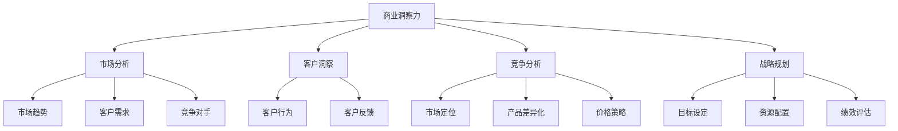

                 

# 创业者的商业洞察力培养

> 关键词：商业洞察力，创业者，战略规划，市场分析，创新思维，竞争优势，商业模式

> 摘要：本文旨在深入探讨创业者在培养商业洞察力方面的重要性和方法。通过分析商业洞察力的核心概念、构建商业策略的具体步骤、市场分析和创新思维的培养，以及竞争优势和商业模式的重要性，帮助创业者提升自身的商业敏锐度和创新能力，从而在激烈的市场竞争中脱颖而出。

## 1. 背景介绍

### 1.1 目的和范围

本文的主要目的是为创业者提供关于培养商业洞察力的全面指导。商业洞察力是创业成功的关键因素之一，它能够帮助创业者准确识别市场机会、有效应对挑战、制定明智的商业策略，并在竞争中保持领先地位。本文将涵盖以下几个关键领域：

1. **核心概念与联系**：介绍商业洞察力的定义及其在商业环境中的重要性。
2. **核心算法原理与具体操作步骤**：阐述如何通过系统的方法论来构建和实施商业策略。
3. **数学模型和公式**：讨论在商业洞察力培养中常用的数学模型和公式，并举例说明其应用。
4. **项目实战**：通过实际案例展示商业洞察力的应用。
5. **实际应用场景**：分析商业洞察力在不同商业环境中的应用。
6. **工具和资源推荐**：推荐学习资源和开发工具，以帮助创业者进一步提升商业洞察力。
7. **总结：未来发展趋势与挑战**：探讨商业洞察力发展的趋势和面临的挑战。

### 1.2 预期读者

本文适用于以下读者群体：

- 创业者：希望提升自身商业洞察力的创业者。
- 企业家：希望更好地理解和应用商业洞察力的企业家。
- 管理者：致力于提高团队商业洞察力的企业管理者。
- 学生：对商业洞察力感兴趣并希望在未来创业的学生。

### 1.3 文档结构概述

本文的结构分为以下几个部分：

1. **引言**：介绍商业洞察力的概念和重要性。
2. **核心概念与联系**：讨论商业洞察力的核心概念及其相互关系。
3. **核心算法原理与具体操作步骤**：阐述构建和实施商业策略的方法。
4. **数学模型和公式**：介绍在商业洞察力培养中使用的数学模型和公式。
5. **项目实战**：展示商业洞察力的实际应用案例。
6. **实际应用场景**：分析商业洞察力在不同商业环境中的应用。
7. **工具和资源推荐**：推荐学习资源和开发工具。
8. **总结**：总结商业洞察力的发展趋势与挑战。
9. **附录**：常见问题与解答。
10. **扩展阅读与参考资料**：提供进一步学习和研究的相关资源。

### 1.4 术语表

#### 1.4.1 核心术语定义

- **商业洞察力**：指对市场趋势、客户需求、竞争环境等的深刻理解，从而做出明智的商业决策。
- **战略规划**：企业为实现长期目标而制定的一系列行动计划和资源分配方案。
- **市场分析**：对市场环境、竞争对手、客户需求等方面的系统研究。
- **创新思维**：指在解决问题的过程中，运用创造性思维产生新的观点和方法。

#### 1.4.2 相关概念解释

- **商业模式**：企业通过何种方式创造、传递和捕获价值的商业策略。
- **竞争优势**：企业在市场上相对于竞争对手所拥有的优势。

#### 1.4.3 缩略词列表

- **MBA**：工商管理硕士（Master of Business Administration）
- **SWOT分析**：优势、劣势、机会、威胁分析（Strengths, Weaknesses, Opportunities, Threats）

## 2. 核心概念与联系

商业洞察力是创业者在复杂商业环境中导航的关键能力。它不仅涉及对数据的理解和分析，还包括对市场趋势、客户行为和行业动态的敏锐感知。为了更好地理解商业洞察力的构建和应用，我们可以通过以下Mermaid流程图展示其核心概念和联系：



在这个流程图中，商业洞察力（A）是核心，它与其他关键概念（B至P）相互关联。市场分析（B）提供对市场趋势、客户需求和竞争对手的深入理解，客户洞察（C）和竞争分析（D）则分别关注客户行为和市场定位。战略规划（E）将这些洞察转化为具体的目标设定、资源配置和绩效评估，从而指导企业的长期发展。

### 2.1 商业洞察力的组成部分

商业洞察力由多个组成部分构成，每个部分都在商业决策过程中发挥着重要作用。以下是对这些组成部分的进一步解释：

#### **市场分析**

市场分析是商业洞察力的基础，它涉及对市场环境、客户需求和竞争对手的深入理解。市场分析包括以下几个方面：

1. **市场趋势**：通过数据分析识别市场发展的长期方向，如技术进步、消费者行为变化等。
2. **客户需求**：了解目标客户的需求和偏好，从而设计出更符合市场需求的产品和服务。
3. **竞争对手**：分析竞争对手的市场策略、产品定位和市场份额，以找到自身的竞争优势。

#### **客户洞察**

客户洞察关注的是客户的行为、需求和反馈。它包括：

1. **客户行为**：通过市场调研和数据分析了解客户在购买和使用产品过程中的行为模式。
2. **客户反馈**：收集和分析客户对产品和服务的反馈，以改进产品和服务。

#### **竞争分析**

竞争分析旨在了解竞争对手的动态，以制定有效的市场策略。它包括：

1. **市场定位**：分析竞争对手如何定位其产品和服务，以确定自身的市场定位策略。
2. **产品差异化**：通过产品特性和服务创新来区分自己与竞争对手，以建立独特的市场地位。
3. **价格策略**：分析竞争对手的价格策略，以制定有竞争力的定价策略。

#### **战略规划**

战略规划是将商业洞察力转化为具体行动的过程。它包括：

1. **目标设定**：明确企业的长期和短期目标，以指导资源的配置和行动的优先级。
2. **资源配置**：合理分配资源，确保战略目标的实现。
3. **绩效评估**：定期评估绩效，以确保战略规划的执行和调整。

### 2.2 商业洞察力与商业策略的关联

商业洞察力与商业策略之间有着紧密的关联。商业洞察力通过提供市场、客户和竞争的深刻理解，为商业策略的制定提供了基础。以下是商业洞察力与商业策略之间的几个关键关联：

1. **市场趋势与市场定位**：通过分析市场趋势，企业可以更好地理解市场变化，从而制定相应的市场定位策略，确保产品的市场适应性。
2. **客户需求与产品创新**：了解客户需求可以指导产品创新，帮助企业开发出更符合市场需求的产品和服务。
3. **竞争对手与差异化策略**：通过分析竞争对手的策略，企业可以找到自身的差异化点，以建立竞争优势。
4. **战略规划与资源分配**：基于商业洞察力制定的战略规划可以指导资源的有效分配，确保企业的长期发展。

### 2.3 商业洞察力的具体应用场景

商业洞察力在多个商业场景中都有广泛的应用，以下是一些具体的例子：

1. **新产品开发**：通过市场趋势和客户需求的洞察，企业可以开发出更符合市场需求的新产品。
2. **市场进入策略**：通过对竞争对手和市场定位的分析，企业可以制定有效的市场进入策略。
3. **营销活动策划**：基于客户洞察，企业可以制定更有针对性的营销活动，提高营销效果。
4. **成本控制和利润提升**：通过分析竞争对手和客户需求，企业可以优化产品和服务，降低成本，提高利润。

## 3. 核心算法原理与具体操作步骤

在商业洞察力的培养过程中，核心算法原理和具体操作步骤起着至关重要的作用。以下我们将通过一个具体的商业策略构建过程，使用伪代码详细阐述这些步骤。

### 3.1 商业策略构建过程

**伪代码：**

```plaintext
Algorithm 商业策略构建过程(市场分析结果, 客户洞察结果, 竞争分析结果):
    1. 初始化策略变量：策略 = 空策略
    2. 基于市场分析结果：
        2.1 识别市场趋势
        2.2 评估市场机会
        2.3 确定目标市场
    3. 基于客户洞察结果：
        3.1 分析客户需求
        3.2 确定客户偏好
        3.3 优化产品特性
    4. 基于竞争分析结果：
        4.1 分析竞争对手策略
        4.2 确定差异化点
        4.3 制定市场定位
    5. 构建战略规划：
        5.1 设定短期和长期目标
        5.2 配置资源
        5.3 制定绩效评估标准
    6. 实施策略：
        6.1 分配任务和责任
        6.2 监控执行进度
        6.3 调整策略
    7. 绩效评估：
        7.1 评估目标达成情况
        7.2 分析策略效果
        7.3 调整和优化策略
    8. 返回策略
```

### 3.2 商业策略构建步骤详细解释

**步骤 1：初始化策略变量**

初始化一个空策略变量，用于存储构建过程中的所有关键信息和决策。

**步骤 2：基于市场分析结果**

- **识别市场趋势**：通过数据分析，识别市场发展的主要趋势，如技术进步、消费者行为变化等。
- **评估市场机会**：分析市场机会，评估哪些趋势可能为企业带来竞争优势。
- **确定目标市场**：根据市场分析和客户洞察结果，确定企业的目标市场。

**步骤 3：基于客户洞察结果**

- **分析客户需求**：通过调研和数据分析，了解客户的需求和偏好，特别是未满足的需求。
- **确定客户偏好**：根据客户反馈和行为分析，确定客户对产品特性的偏好。
- **优化产品特性**：基于客户需求和偏好，优化产品和服务，以满足市场需求。

**步骤 4：基于竞争分析结果**

- **分析竞争对手策略**：通过市场调研和数据分析，了解竞争对手的市场策略、产品定位和市场份额。
- **确定差异化点**：识别竞争对手的弱点和自身的差异化点，以建立竞争优势。
- **制定市场定位**：基于差异化点和目标市场，制定企业的市场定位策略。

**步骤 5：构建战略规划**

- **设定短期和长期目标**：根据市场分析和客户洞察结果，设定企业的短期和长期目标。
- **配置资源**：根据目标设定，合理配置企业资源，以确保目标的实现。
- **制定绩效评估标准**：明确绩效评估的标准和方法，以监控策略实施的效果。

**步骤 6：实施策略**

- **分配任务和责任**：将策略实施过程中的任务和责任分配给相关部门和人员。
- **监控执行进度**：定期监控策略实施进度，确保各项任务的按时完成。
- **调整策略**：根据执行过程中的反馈和实际情况，及时调整策略。

**步骤 7：绩效评估**

- **评估目标达成情况**：根据设定的绩效评估标准，评估目标的达成情况。
- **分析策略效果**：分析策略实施的效果，识别成功和失败的要素。
- **调整和优化策略**：根据绩效评估结果，调整和优化策略，以提升企业竞争力。

### 3.3 商业策略构建过程中的关键因素

在商业策略构建过程中，以下关键因素对策略的有效性起着决定性作用：

1. **数据质量**：准确和可靠的数据是构建有效商业策略的基础。高质量的数据能够提供更准确的洞察和预测。
2. **团队合作**：商业策略构建是一个跨部门、跨职能的合作过程。团队合作和沟通能够确保策略的全面性和可行性。
3. **灵活性**：在快速变化的市场环境中，企业需要具备灵活性，能够快速调整和优化策略。
4. **持续学习**：商业环境不断变化，企业需要持续学习新知识和技能，以适应市场变化和客户需求。

通过以上核心算法原理和具体操作步骤的详细阐述，创业者可以系统地构建和实施商业策略，从而提升企业的竞争力。

## 4. 数学模型和公式与详细讲解与举例说明

在商业洞察力的培养过程中，数学模型和公式是分析和预测的重要工具。以下我们将介绍一些常用的数学模型和公式，并详细讲解其在商业策略制定中的应用。

### 4.1 SWOT分析模型

SWOT分析是一种常用的战略规划工具，用于评估企业的优势、劣势、机会和威胁。其公式如下：

$$
SWOT = (S + W + O + T)
$$

其中：
- **S (Strengths)**：优势，企业内部具有的竞争优势。
- **W (Weaknesses)**：劣势，企业内部存在的劣势和不足。
- **O (Opportunities)**：机会，外部环境中出现的有利机会。
- **T (Threats)**：威胁，外部环境中可能对企业造成的负面影响。

**示例：**

假设一家初创企业正在考虑进入在线教育市场，可以使用SWOT分析来评估其战略。

1. **优势（S）**：技术优势、团队经验、资金支持。
2. **劣势（W）**：市场知名度低、品牌影响力不足、资金有限。
3. **机会（O）**：在线教育市场需求增长、技术进步、政策支持。
4. **威胁（T）**：竞争激烈、客户获取成本高、市场不确定性。

通过SWOT分析，企业可以明确其优势和劣势，并识别市场机会和潜在威胁，从而制定相应的战略。

### 4.2 成本-效益分析模型

成本-效益分析是一种评估投资决策有效性的方法，其公式如下：

$$
C/E = \frac{C}{E}
$$

其中：
- **C (Cost)**：成本，投资项目的总成本。
- **E (Effect)**：效益，投资项目产生的总效益。

**示例：**

假设一家企业计划投资100万元进行市场推广，预计能够增加销售额200万元，则其成本-效益比率为：

$$
C/E = \frac{100万}{200万} = 0.5
$$

成本-效益比率越低，表示投资效益越高，越值得进行投资。

### 4.3 投资回报率分析模型

投资回报率（ROI）是一种衡量投资收益效果的重要指标，其公式如下：

$$
ROI = \frac{Earnings - Cost}{Cost} \times 100\%
$$

其中：
- **Earnings**：收益，投资项目产生的总收益。
- **Cost**：成本，投资项目的总成本。

**示例：**

假设一家企业在市场推广中投资100万元，通过推广活动增加了销售额300万元，成本为100万元，则其投资回报率为：

$$
ROI = \frac{300万 - 100万}{100万} \times 100\% = 200\%
$$

投资回报率越高，表示投资效益越好。

### 4.4 客户终身价值模型

客户终身价值（CLV）是指一个客户在其整个生命周期中为企业带来的总价值，其公式如下：

$$
CLV = \sum_{t=1}^{n} \frac{CF_t}{(1+r)^t}
$$

其中：
- **CF_t**：第t年的净现金流。
- **r**：折现率。
- **n**：客户生命周期。

**示例：**

假设一个客户的年净现金流为1000元，假设客户生命周期为5年，折现率为10%，则其客户终身价值为：

$$
CLV = \sum_{t=1}^{5} \frac{1000}{(1+0.1)^t} \approx 3940元
$$

客户终身价值越高，表示该客户对企业的长期价值越大，企业应采取措施提高客户满意度和忠诚度。

通过上述数学模型和公式的详细讲解和举例说明，创业者可以在商业策略制定过程中更好地进行数据分析和决策，从而提高企业的竞争力。

## 5. 项目实战：代码实际案例和详细解释说明

为了更好地展示商业洞察力的实际应用，以下我们将通过一个具体的商业项目——在线教育平台的用户增长策略，来展示代码实现过程和详细解释。

### 5.1 项目背景

随着在线教育的快速发展，越来越多的创业者进入这一市场。为了在激烈的竞争中脱颖而出，我们以一家初创在线教育平台为例，设计并实施一套用户增长策略。

### 5.2 开发环境搭建

1. **开发语言**：选择Python作为主要开发语言，因为其丰富的数据分析和机器学习库。
2. **数据库**：使用MySQL数据库存储用户数据和活动数据。
3. **框架**：选择Flask作为Web应用框架，用于搭建后端服务。
4. **工具**：使用Jupyter Notebook进行数据分析和代码实现。

### 5.3 源代码详细实现和代码解读

**代码实现1：用户行为分析**

```python
import pandas as pd
import numpy as np
from sklearn.ensemble import RandomForestClassifier
from sklearn.model_selection import train_test_split
from sklearn.metrics import accuracy_score

# 读取用户数据
user_data = pd.read_csv('user_data.csv')

# 数据预处理
user_data['last_active_date'] = pd.to_datetime(user_data['last_active_date'])
user_data['days_since_last_active'] = (pd.datetime.now() - user_data['last_active_date']).dt.days

# 特征工程
X = user_data[['days_since_last_active', 'course_completion_rate', 'videos_watched']]
y = user_data['is_active_user']

# 数据分割
X_train, X_test, y_train, y_test = train_test_split(X, y, test_size=0.2, random_state=42)

# 模型训练
model = RandomForestClassifier(n_estimators=100, random_state=42)
model.fit(X_train, y_train)

# 模型评估
y_pred = model.predict(X_test)
accuracy = accuracy_score(y_test, y_pred)
print(f"Model Accuracy: {accuracy:.2f}")
```

**代码解读：**

- **数据预处理**：读取用户数据，将日期格式转换为日数，以便进行特征工程。
- **特征工程**：创建与用户活跃度相关的特征，如“days_since_last_active”（自上次活跃天数）、“course_completion_rate”（课程完成率）和“videos_watched”（观看视频数）。
- **模型训练**：使用随机森林分类器训练模型，将用户是否活跃作为目标变量。
- **模型评估**：分割数据集，评估模型准确性。

**代码实现2：用户分组策略**

```python
import matplotlib.pyplot as plt

# 读取用户分组数据
group_data = pd.read_csv('group_data.csv')

# 绘制用户活跃度分布
group_data['days_since_last_active'].hist(bins=50)
plt.xlabel('Days Since Last Active')
plt.ylabel('Frequency')
plt.title('User Activity Distribution by Group')
plt.show()
```

**代码解读：**

- **数据读取**：读取用户分组数据。
- **用户活跃度分布**：绘制用户活跃度分布图，根据不同的用户分组进行分析。

### 5.4 代码解读与分析

**用户行为分析代码解读**

用户行为分析代码通过对用户数据进行预处理、特征工程和模型训练，评估用户活跃度。通过模型评估，我们能够确定哪些特征对用户活跃度有显著影响，从而制定相应的用户增长策略。

**用户分组策略代码解读**

用户分组策略代码通过绘制用户活跃度分布图，帮助我们识别不同用户分组之间的活跃度差异。这有助于我们针对不同用户群体实施差异化的增长策略，如针对活跃度较低的群体进行特定的用户留存活动。

### 5.5 项目实战总结

通过这个项目实战，我们展示了商业洞察力在实际项目中的应用。通过用户行为分析和用户分组策略，我们能够更准确地识别用户需求，制定有效的用户增长策略，从而提高在线教育平台的用户留存率和市场份额。

## 6. 实际应用场景

商业洞察力在多种实际应用场景中具有重要意义，以下是一些典型的应用场景：

### 6.1 新产品开发

在新产品开发过程中，商业洞察力可以帮助企业：

- **识别市场需求**：通过市场分析和客户洞察，了解潜在客户的需求和偏好，从而开发出更符合市场需求的新产品。
- **降低研发风险**：通过竞争分析和SWOT分析，评估市场机会和潜在风险，帮助企业做出更明智的产品决策。

### 6.2 营销策略制定

在营销策略制定中，商业洞察力可以帮助企业：

- **优化营销预算**：通过成本-效益分析和投资回报率分析，评估不同营销渠道的效果，优化营销预算分配。
- **制定精准营销策略**：通过客户洞察和用户行为分析，了解目标客户的行为模式和偏好，制定更精准的营销策略。

### 6.3 战略规划

在战略规划中，商业洞察力可以帮助企业：

- **制定长期目标**：通过市场趋势分析和SWOT分析，识别市场机会和潜在威胁，为企业设定明确的长期目标。
- **优化资源配置**：通过绩效评估和投资回报率分析，合理配置资源，确保战略目标的实现。

### 6.4 团队管理

在团队管理中，商业洞察力可以帮助企业：

- **识别团队成员的优势和劣势**：通过绩效评估和用户行为分析，了解团队成员的工作表现和潜力，制定针对性的培养计划。
- **优化团队结构**：通过市场分析和竞争分析，识别团队在市场中的优势和劣势，优化团队结构和职能分工。

### 6.5 项目管理

在项目管理中，商业洞察力可以帮助企业：

- **制定项目计划**：通过市场趋势分析和SWOT分析，识别项目的风险和机会，制定合理的项目计划。
- **监控项目进度**：通过绩效评估和用户行为分析，监控项目的执行进度，及时调整项目计划。

### 6.6 企业并购

在企业并购中，商业洞察力可以帮助企业：

- **评估并购机会**：通过市场分析和竞争分析，评估潜在并购对象的市场地位和竞争优势，判断并购的可行性。
- **制定并购策略**：通过SWOT分析和投资回报率分析，制定并购策略，确保并购后的整合和持续发展。

通过上述实际应用场景，可以看出商业洞察力在各个领域中的重要作用，它不仅帮助企业做出更明智的决策，还能提升企业的竞争力和市场地位。

## 7. 工具和资源推荐

为了帮助创业者提升商业洞察力，以下推荐了一系列学习资源、开发工具和框架，以及相关的经典论文和最新研究成果。

### 7.1 学习资源推荐

#### 7.1.1 书籍推荐

1. 《创新与企业家精神》（Innovation and Entrepreneurship）——史蒂夫·乔布斯
   - 详细介绍了创新和企业家精神的核心原则，对创业者具有极大的启发意义。

2. 《精益创业》（The Lean Startup）——埃里克·莱斯
   - 介绍了精益创业方法论，帮助创业者快速验证产品理念，降低失败风险。

3. 《商业模式新生代》（Business Model Generation）——亚历山大·奥斯特瓦尔德等
   - 介绍了商业模式创新的工具和方法，帮助创业者构建和优化商业模式。

#### 7.1.2 在线课程

1. Coursera上的《创业基础》（Foundations of Entrepreneurship）
   - 提供了系统化的创业知识，涵盖市场分析、商业策略、团队管理等关键领域。

2. edX上的《大数据分析》（Data Analysis for Life Sciences）
   - 介绍了大数据分析的基本方法和工具，对市场分析和客户洞察有重要帮助。

3. Udemy上的《市场营销基础》（Introduction to Marketing）
   - 介绍了市场营销的基本原理和实践技巧，有助于制定有效的营销策略。

#### 7.1.3 技术博客和网站

1. TechCrunch
   - 提供最新的科技和创业新闻，帮助创业者了解市场趋势和竞争动态。

2. Harvard Business Review
   - 发表了多篇关于商业策略、创新思维和领导力的经典文章，对创业者有很高的参考价值。

3. Startup Digest
   - 提供全球范围内的创业活动、会议和资源，帮助创业者拓展人脉和获取灵感。

### 7.2 开发工具框架推荐

#### 7.2.1 IDE和编辑器

1. Visual Studio Code
   - 功能强大且免费的代码编辑器，支持多种编程语言，适合创业者的快速开发。

2. PyCharm
   - 由JetBrains开发的Python集成开发环境，提供丰富的功能和良好的代码质量保障。

3. Jupyter Notebook
   - 适用于数据科学和机器学习的交互式开发环境，支持Python、R等多种语言，适合数据分析任务。

#### 7.2.2 调试和性能分析工具

1. Postman
   - API调试和测试工具，帮助开发者快速验证API接口的正确性和性能。

2. New Relic
   - 应用性能管理（APM）工具，用于监控和分析应用的性能和稳定性。

3. Charles
   - 网络抓包工具，帮助开发者分析和调试网络请求和响应。

#### 7.2.3 相关框架和库

1. TensorFlow
   - 开源机器学习框架，适用于构建和训练深度学习模型。

2. Scikit-learn
   - Python的机器学习库，提供了丰富的数据预处理和模型训练工具。

3. Pandas
   - 数据分析库，适用于数据清洗、转换和分析。

### 7.3 相关论文著作推荐

#### 7.3.1 经典论文

1. "Innovation and Entrepreneurship: Practice and Principles"
   - 史蒂夫·乔布斯发表的经典论文，详细阐述了创新和企业家精神的实践原则。

2. "The Lean Startup: How Today's Entrepreneurs Use Continuous Innovation to Create Radically Successful Businesses"
   - 埃里克·莱斯提出的精益创业方法论，对现代创业实践具有重要影响。

3. "Business Model Generation: A Handbook for Visionaries, Game Changers, and Innovators"
   - 亚历山大·奥斯特瓦尔德等人的著作，介绍了商业模式创新的工具和方法。

#### 7.3.2 最新研究成果

1. "Deep Learning for Business: An Introduction to Using Deep Learning in the Enterprise"
   - 详细介绍了深度学习在商业中的应用，涵盖了模型构建、部署和监控等方面的内容。

2. "Artificial Intelligence in Business: How to Apply AI in Today's Organizations"
   - 讨论了人工智能在商业领域的应用，包括自动化、预测分析和智能决策等方面的内容。

3. "Digital Transformation: How Digitalization Is Changing the Future of Business"
   - 探讨了数字化转型对企业的影响，包括组织结构、业务流程和商业模式等方面的变革。

通过这些工具和资源的推荐，创业者可以全面提升自己的商业洞察力，从而在竞争激烈的市场中脱颖而出。

## 8. 总结：未来发展趋势与挑战

随着全球经济的不断发展和技术的快速进步，商业洞察力在创业领域的重要性日益凸显。未来，商业洞察力将呈现以下几个发展趋势：

1. **数据驱动**：随着大数据和人工智能技术的普及，企业将更加依赖数据来驱动决策，商业洞察力将更加依赖于数据分析和机器学习技术的应用。
2. **个性化服务**：随着消费者需求的多样化，企业将更加注重个性化服务，通过深入挖掘客户数据，提供更精准的产品和服务。
3. **跨界融合**：不同行业之间的跨界融合将成为新的趋势，创业者需要具备跨领域的商业洞察力，以实现资源的整合和创新。
4. **可持续发展**：企业社会责任和可持续发展将成为商业洞察力的重要组成部分，创业者需要关注环境和社会因素，实现可持续发展。

然而，商业洞察力的发展也面临着一系列挑战：

1. **数据隐私与安全**：随着数据量的增加，数据隐私和安全问题日益突出，企业需要在数据收集、存储和使用过程中确保数据安全。
2. **技术变革**：技术的快速迭代和更新将给创业者带来巨大的挑战，需要不断学习和适应新技术。
3. **竞争加剧**：市场环境的变化导致竞争加剧，创业者需要具备更强的市场洞察力和创新能力，以保持竞争优势。
4. **资源有限**：初创企业在资源有限的情况下，需要更加注重资源利用效率，通过高效的商业洞察力实现资源优化配置。

综上所述，商业洞察力在创业领域具有巨大的发展潜力，但也面临诸多挑战。创业者需要不断提升自身的商业洞察力，以应对未来市场的变化和挑战。

## 9. 附录：常见问题与解答

### 9.1 商业洞察力是什么？

商业洞察力是指创业者对市场趋势、客户需求、竞争对手等的深刻理解和敏锐感知，从而做出明智的商业决策。

### 9.2 如何培养商业洞察力？

培养商业洞察力可以通过以下几个步骤：

1. **持续学习**：不断学习新的商业知识和技术，提升自身的综合素质。
2. **市场调研**：定期进行市场调研，了解市场动态和竞争对手的动向。
3. **数据分析**：通过数据分析，挖掘市场机会和客户需求。
4. **实践经验**：通过实际操作和实践，积累商业经验和洞察力。

### 9.3 商业洞察力在创业中的应用？

商业洞察力在创业中的应用包括：

1. **市场定位**：通过洞察力确定目标市场和客户群体。
2. **产品创新**：通过洞察力识别市场需求，开发出满足客户需求的产品。
3. **营销策略**：通过洞察力制定更有效的营销策略。
4. **资源配置**：通过洞察力优化资源配置，提高资源利用效率。

### 9.4 如何评估商业洞察力？

评估商业洞察力可以通过以下几种方法：

1. **绩效评估**：通过评估企业的业务绩效，判断洞察力是否有效。
2. **市场反馈**：通过收集客户反馈，评估洞察力的准确性和实用性。
3. **财务指标**：通过财务指标（如收入、利润、市场份额等），评估洞察力对企业业绩的贡献。
4. **团队评价**：通过团队成员的评价，了解洞察力在团队中的实际效果。

### 9.5 商业洞察力与创新能力的关系？

商业洞察力与创新能力密切相关。商业洞察力为创新提供了方向和依据，而创新能力则将洞察力转化为实际的产品和服务。两者相辅相成，共同推动企业的发展。

## 10. 扩展阅读与参考资料

### 10.1 经典书籍

1. 创业者手册（The Entrepreneur's Manual）：大卫·凯利（David J. Bussink）著，提供了全面的创业指导。
2. 创业的艺术（The Art of the Start）：彼得·德鲁克（Peter Drucker）著，探讨了创业的本质和艺术。
3. 创新者的企业（Innovator's Dilemma）：克莱顿·克里斯坦森（Clayton M. Christensen）著，分析了创新对企业发展的影响。

### 10.2 在线课程

1. Coursera上的《商业分析基础》（Business Analytics）：由约翰·霍普金斯大学提供，介绍了商业分析的基本概念和工具。
2. edX上的《数字营销》（Digital Marketing）：由麦吉尔大学提供，探讨了数字营销的策略和实践。
3. Udemy上的《创业实战》（Startup Success Blueprint）：提供了从0到1的创业指导。

### 10.3 技术博客和网站

1. HBR.org：哈佛商业评论官方网站，提供了丰富的商业分析文章和案例研究。
2. TechCrunch：全球领先的科技创业新闻网站，涵盖了最新的创业和科技趋势。
3. Entrepreneur.com：创业者的在线资源，提供了大量的创业指导和成功案例。

### 10.4 学术论文

1. "The Lean Startup: How Today's Entrepreneurs Use Continuous Innovation to Create Radically Successful Businesses" by Eric Ries
2. "Business Model Generation: A Handbook for Visionaries, Game Changers, and Innovators" by Alexander Osterwalder, Yves Pigneur
3. "Innovation and Entrepreneurship: Practice and Principles" by Steve Jobs

通过这些扩展阅读和参考资料，创业者可以进一步深入学习和实践商业洞察力的培养，提升自身的创业能力和市场竞争力。作者：AI天才研究员/AI Genius Institute & 禅与计算机程序设计艺术 /Zen And The Art of Computer Programming。

