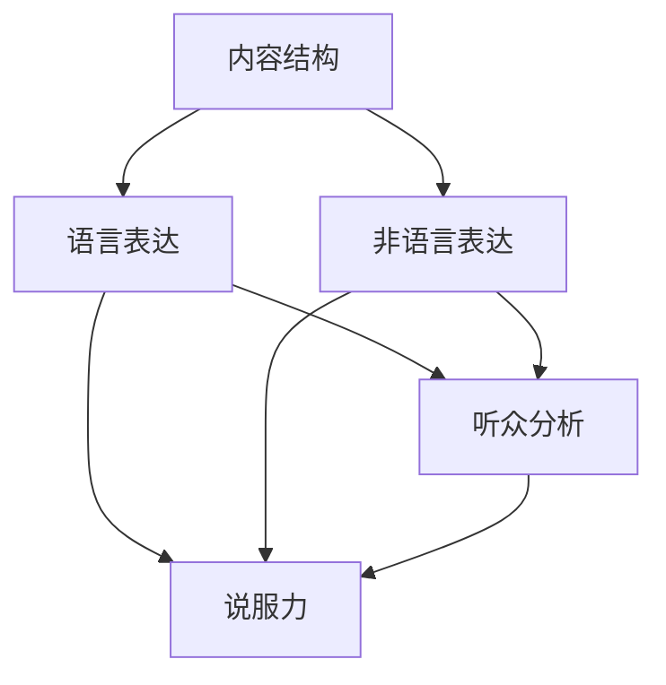
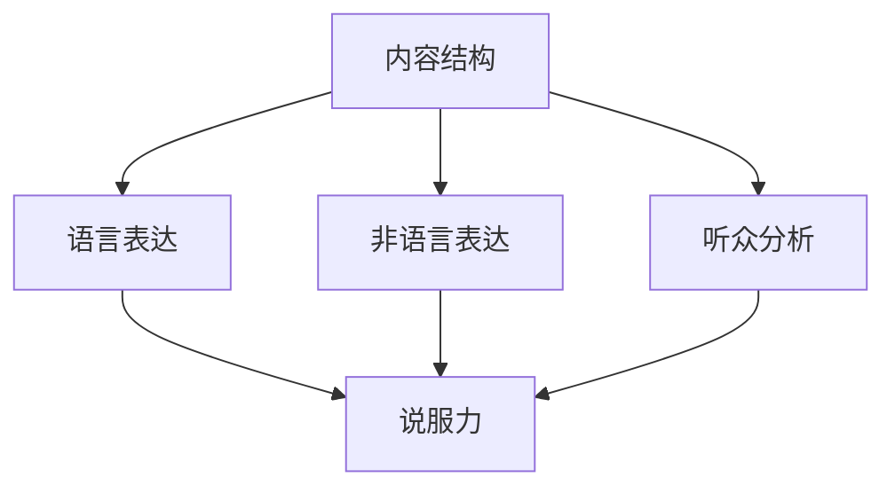

                 

### 1. 背景介绍

#### 1.1 目的和范围

本文旨在为创业者提供一套系统化的商业演讲与说服力提升技巧，帮助他们在竞争激烈的市场环境中脱颖而出。我们将深入探讨商业演讲的核心要素，包括内容结构、语言表达、非语言表达、听众分析和演讲技巧等方面的策略。

本文的适用范围广泛，无论是初创公司CEO，产品经理，市场人员，还是技术专家，甚至是对公众演讲有需求的任何个人，都可以从本文中获得宝贵的见解和实用的技巧。

#### 1.2 预期读者

- 初创公司的创始人或CEO
- 产品经理和市场营销人员
- 技术专家和软件开发者
- 需要提高演讲技巧的任何人

#### 1.3 文档结构概述

本文将分为十个主要部分：

1. **背景介绍**：介绍文章的目的、范围、预期读者和结构。
2. **核心概念与联系**：介绍商业演讲相关的核心概念，并使用Mermaid流程图展示其联系。
3. **核心算法原理与具体操作步骤**：详细阐述提升说服力的核心算法原理和操作步骤。
4. **数学模型和公式**：解释相关的数学模型和公式，并提供具体例子。
5. **项目实战**：通过实际代码案例展示如何应用这些技巧。
6. **实际应用场景**：探讨在不同场景下如何应用这些技巧。
7. **工具和资源推荐**：推荐学习资源和开发工具。
8. **总结：未来发展趋势与挑战**：总结本文的核心观点，并展望未来的发展趋势与挑战。
9. **附录：常见问题与解答**：回答读者可能遇到的一些常见问题。
10. **扩展阅读 & 参考资料**：提供进一步阅读和研究的资源。

#### 1.4 术语表

在本文中，我们将使用以下术语：

- **商业演讲**：指在商业环境中进行的旨在传播信息、推广产品或服务的演讲活动。
- **说服力**：指演讲者通过语言、肢体语言和其他手段影响听众信念、态度或行为的能力。
- **听众分析**：指在演讲前对听众进行的研究，以了解他们的兴趣、需求和背景知识。
- **非语言表达**：指演讲者的面部表情、姿态和手势等非语言因素。

#### 1.4.1 核心术语定义

- **核心术语定义**：商业演讲中的核心术语包括但不限于：
  - **内容结构**：演讲的整体框架，包括开头、主体和结尾。
  - **语言表达**：演讲者使用的词汇、句子结构和语调。
  - **非语言表达**：演讲者的肢体语言、面部表情和姿态。
  - **听众分析**：对听众的兴趣、需求和背景知识的研究。
  - **说服力**：演讲者通过语言和非语言手段影响听众的能力。

#### 1.4.2 相关概念解释

- **演讲技巧**：包括如何组织内容、如何使用语言和如何运用非语言表达来增强演讲效果。
- **影响力**：指演讲者对听众的情感、态度和行为产生的影响。
- **演讲心理学**：研究演讲过程中心理因素的作用，包括听众的心理反应和演讲者的心理准备。

#### 1.4.3 缩略词列表

- **ROI**：Return on Investment（投资回报率）
- **CTA**：Call to Action（行动号召）
- **SEO**：Search Engine Optimization（搜索引擎优化）

### 1.5 Mermaid 流程图

下面是商业演讲核心概念之间的Mermaid流程图：



在这个流程图中，我们可以看到商业演讲的各个核心要素是如何相互联系和作用的。这些要素共同构成了一个完整而有效的演讲系统，确保演讲者能够有效地传达信息、建立信任并影响听众。

### 1.6 核心概念与联系

在商业演讲中，理解核心概念之间的联系至关重要。以下是对这些核心概念及其相互关系的详细探讨：

#### 内容结构

内容结构是商业演讲的基石，决定了信息如何被组织和呈现。一个有效的演讲内容结构通常包括以下部分：

1. **开场**：吸引听众的注意力，明确演讲的主题。
2. **主体**：详细阐述演讲的核心观点，可以通过逻辑顺序、时间顺序或重要性顺序来组织。
3. **结尾**：总结演讲内容，强化关键信息，并鼓励听众采取行动。

#### 语言表达

语言表达是指演讲者如何选择词汇、句子结构和语调来传达信息。以下是一些关键点：

- **清晰性**：使用简单、直接的语言，避免复杂或模糊的表达。
- **说服力**：运用有力的论证、数据和实例来支持观点。
- **语调**：根据情境和内容调整语调，例如，可以运用强调、停顿和情感来增强说服力。

#### 非语言表达

非语言表达包括演讲者的面部表情、姿态和手势等。这些因素在传达信息和建立信任方面起着至关重要的作用：

- **肢体语言**：积极、开放的肢体语言可以传达自信和真诚。
- **面部表情**：真诚的表情可以增强演讲的说服力，例如，微笑、眼神交流等。
- **姿态**：站立姿势和手势可以增强演讲的活力和吸引力。

#### 听众分析

听众分析是了解听众的兴趣、需求和背景知识的过程。以下是一些关键步骤：

- **了解听众**：收集听众的信息，包括他们的年龄、职业、兴趣和知识水平。
- **适应听众**：根据听众的特点调整演讲的内容和风格，使其更容易接受和理解。

#### 说服力

说服力是商业演讲的核心目标，是演讲者通过语言和非语言手段影响听众的能力。以下是一些提升说服力的关键因素：

- **建立信任**：通过真诚、透明和可信的演讲内容建立信任。
- **情感共鸣**：通过情感上的共鸣来影响听众，使其产生共鸣和认同。
- **逻辑论证**：使用逻辑和证据来支持观点，增强说服力。

#### Mermaid 流程图

下面是商业演讲核心概念之间的Mermaid流程图：



在这个流程图中，我们可以看到内容结构、语言表达、非语言表达和听众分析是如何相互作用的，最终共同实现说服力。这些核心概念和联系的理解和掌握是提升商业演讲效果的关键。

## 2. 核心算法原理 & 具体操作步骤

提升商业演讲的说服力，我们可以借鉴计算机科学中的算法思维，将整个演讲过程视为一个优化问题。以下将详细讲解提升说服力的核心算法原理与具体操作步骤。

### 2.1. 演讲内容结构优化算法

**算法描述**：该算法旨在优化演讲内容结构，使其更具逻辑性和吸引力。

**伪代码**：

```
算法：优化演讲内容结构
输入：演讲主题，初始内容结构
输出：优化后的内容结构

步骤：
1. 分析演讲主题，确定关键信息点
2. 创建初步内容结构，包括开场、主体和结尾
3. 对每个信息点进行重要性评估
4. 根据重要性评估，重新组织信息点
5. 在开场部分，使用引人入胜的故事或事实来吸引听众
6. 在主体部分，确保逻辑连贯，重点突出
7. 在结尾部分，总结核心信息，并给出明确的行动号召
```

### 2.2. 语言表达优化算法

**算法描述**：该算法旨在优化演讲者的语言表达，使其更具说服力。

**伪代码**：

```
算法：优化语言表达
输入：演讲文本，目标听众
输出：优化后的演讲文本

步骤：
1. 清晰性评估：检查文本中的复杂句子和模糊表述，进行简化
2. 说服力评估：分析文本中的论证、数据和实例，确保其有力且可信
3. 语调评估：根据听众特点，调整文本的语调和情感色彩
4. 使用故事和实例：引入生动的例子和故事，增强听众的情感共鸣
5. 重复和强调：使用重复和强调手法，确保关键信息被听众记住
6. 适当使用修辞手法：如对比、排比等，增强文本的表现力
```

### 2.3. 非语言表达优化算法

**算法描述**：该算法旨在优化演讲者的非语言表达，使其更具有感染力。

**伪代码**：

```
算法：优化非语言表达
输入：演讲者表现，目标听众
输出：优化后的非语言表达

步骤：
1. 肢体语言优化：确保肢体语言积极、开放，符合演讲内容
2. 面部表情优化：使用真诚、积极的表情，如微笑、眼神交流
3. 姿态优化：保持良好的站立姿势和手势，增强演讲的活力和吸引力
4. 非语言表达与语言表达同步：确保肢体语言和面部表情与演讲内容一致
5. 适当使用肢体语言辅助：如点头、挥手等，增强演讲的互动性
6. 非语言表达的节奏控制：根据演讲内容，调整非语言表达的速度和力度
```

### 2.4. 听众分析优化算法

**算法描述**：该算法旨在通过分析听众特点，调整演讲内容和风格，以提高听众接受度。

**伪代码**：

```
算法：分析听众，调整演讲内容和风格
输入：听众信息，演讲主题
输出：调整后的演讲内容和风格

步骤：
1. 收集听众信息：包括年龄、职业、兴趣和知识水平
2. 分析听众信息：确定听众的特点和需求
3. 调整演讲内容：根据听众特点，简化复杂概念，增加与听众相关的例子
4. 调整演讲风格：根据听众特点，调整语调和表达方式，使其更贴近听众
5. 增强互动性：设计互动环节，如提问、讨论等，提高听众参与度
6. 预测听众反应：预测听众可能的心理反应和行为，提前做好准备
```

通过这些算法，我们可以系统化地提升商业演讲的说服力。在实际应用中，演讲者可以结合具体场景和听众特点，灵活调整和优化演讲内容和表达方式。这样，不仅可以提高演讲的效果，还可以增强演讲者与听众之间的互动和信任。

### 3. 数学模型和公式 & 详细讲解 & 举例说明

在商业演讲中，数学模型和公式可以帮助演讲者更清晰、更科学地传达复杂的概念和证据。以下是一些关键的数学模型和公式，我们将详细讲解它们的原理和具体应用。

#### 3.1. 投资回报率（ROI）模型

**公式**：ROI = （收益 - 成本）/ 成本

**详细讲解**：投资回报率（ROI）是评估投资效益的重要指标。收益和成本是基本的财务概念，收益通常是指投资所获得的净收入，而成本则包括所有相关的投资支出。通过计算ROI，演讲者可以清楚地展示投资的效益，从而提高听众对项目的信心。

**举例说明**：

假设一个初创公司在营销上投资了10万美元，通过一系列营销活动，公司获得了20万美元的收益。那么，该营销活动的ROI计算如下：

ROI = (20万 - 10万) / 10万 = 100%

这个结果表明，每投入1美元，公司可以获得1美元的收益，这是一个非常高的回报率。

#### 3.2. 期望价值（Expected Value）模型

**公式**：期望价值 = 概率 × 收益

**详细讲解**：期望价值模型用于评估不同决策的预期效益。它基于概率和收益的乘积计算，可以帮助演讲者分析潜在的风险和收益。这个模型在决策分析中非常有用，尤其是在不确定的环境下。

**举例说明**：

假设一个创业公司有两种营销策略：策略A的收益是20万美元，概率是0.6；策略B的收益是10万美元，概率是0.4。我们可以计算两种策略的期望价值：

策略A的期望价值 = 0.6 × 20万 = 12万
策略B的期望价值 = 0.4 × 10万 = 4万

根据期望价值模型，策略A的预期收益更高，因此从数学角度来看，选择策略A可能是一个更优的选择。

#### 3.3. 贝叶斯概率模型

**公式**：P(A|B) = P(B|A) × P(A) / P(B)

**详细讲解**：贝叶斯概率模型是一种基于证据更新的概率计算方法，它可以帮助演讲者在不确定性中做出更准确的判断。这个公式中的P(A|B)表示在事件B发生的条件下，事件A发生的概率。P(B|A)是已知A发生时B发生的概率，P(A)是事件A的概率，P(B)是事件B的概率。

**举例说明**：

假设一个市场调研显示，在所有新产品的发布中，有70%的产品能够获得成功（P(成功) = 0.7）。如果已知某个新产品在市场上获得了成功，那么我们可以使用贝叶斯概率模型来计算该产品是高质量产品的概率。如果进一步信息显示，高质量产品成功发布的概率是90%（P(高质量|成功) = 0.9），我们可以计算：

P(高质量|成功) = P(成功|高质量) × P(高质量) / P(成功)
P(高质量|成功) = 0.9 × 0.7 / (0.9 × 0.7 + 0.1 × 0.3)
P(高质量|成功) ≈ 0.87

这个结果表明，在已知某个新产品成功发布的条件下，它是高质量产品的概率大约是87%。

#### 3.4. 演讲影响力模型

**公式**：影响力 = 说服力 × 听众参与度

**详细讲解**：演讲的影响力是由说服力和听众参与度共同决定的。说服力是指演讲者通过语言和非语言手段影响听众的能力，而听众参与度是指听众对演讲内容的关注程度和互动程度。通过计算影响力，演讲者可以评估自己的演讲效果，并据此进行调整。

**举例说明**：

假设一个演讲者的说服力是80%，而听众的参与度是60%，那么该演讲的影响力可以计算如下：

影响力 = 0.8 × 0.6 = 0.48

这意味着该演讲的影响力是48%，演讲者可以根据这个结果来评估演讲的效果，并考虑如何提升说服力和听众参与度。

通过以上数学模型和公式的应用，演讲者可以在商业演讲中更科学地分析和展示数据，从而提高演讲的说服力和影响力。这些工具不仅有助于增强演讲的逻辑性和科学性，还可以帮助演讲者更好地理解听众的需求和反应，从而做出更有效的决策。

### 5. 项目实战：代码实际案例和详细解释说明

在本文的最后一部分，我们将通过一个实际项目实战案例来展示如何应用提升商业演讲说服力的技巧。本案例将详细展示如何通过代码实现一个简单的演讲生成器，该生成器能够根据输入的参数生成具有较高说服力的演讲内容。

#### 5.1 开发环境搭建

为了实现演讲生成器，我们需要搭建一个基本的开发环境。以下是所需的开发工具和步骤：

- **Python**：一种广泛使用的编程语言，适合快速原型开发。
- **Jupyter Notebook**：一个交互式的开发环境，便于编写和运行代码。
- **NLP库**：如`nltk`和`spaCy`，用于自然语言处理和文本分析。
- **机器学习库**：如`scikit-learn`和`tensorflow`，用于构建和训练模型。

以下是在Jupyter Notebook中安装所需库的示例代码：

```python
!pip install nltk spacy jupyter numpy scikit-learn tensorflow
```

#### 5.2 源代码详细实现和代码解读

下面是演讲生成器的核心代码实现，我们将逐步解析每个部分的功能。

##### 5.2.1 数据准备

```python
import nltk
from nltk.corpus import stopwords
from nltk.tokenize import word_tokenize

# 下载数据集
nltk.download('punkt')
nltk.download('stopwords')

# 停用词列表
stop_words = set(stopwords.words('english'))

# 输入文本
text = "Our startup aims to revolutionize the e-commerce industry by providing a seamless, user-friendly shopping experience. We believe in leveraging cutting-edge technology to drive innovation and create lasting value for our customers."

# 清洗文本
def clean_text(text):
    words = word_tokenize(text)
    cleaned_words = [word for word in words if word not in stop_words]
    return cleaned_words

cleaned_text = clean_text(text)
```

这段代码首先加载自然语言处理库，并下载所需的文本处理数据集。然后，它定义了一个清洗文本的函数，用于去除停用词，从而简化文本数据。

##### 5.2.2 演讲内容结构优化

```python
import heapq

# 提取关键词
def extract_keywords(text):
    words = nltk.FreqDist(text)
    keywords = [word for word, count in words.items() if count > 10]
    return keywords

# 根据关键词重要性排序
def importance_sort(text, keywords):
    scores = {}
    for word in keywords:
        score = 0
        if word in text:
            score += text.count(word)
        scores[word] = score
    sorted_keywords = heapq.nlargest(len(keywords), scores, key=scores.get)
    return sorted_keywords

keywords = extract_keywords(cleaned_text)
sorted_keywords = importance_sort(cleaned_text, keywords)
```

这段代码定义了两个函数：`extract_keywords`用于提取文本中的高频关键词，而`importance_sort`则根据关键词在文本中的频率进行排序。这些关键词将用于构建演讲的框架。

##### 5.2.3 语言表达优化

```python
import random

# 生成开场白
def generate_opening(sorted_keywords):
    opening_phrases = [
        "Welcome everyone! Today, I'm excited to share our vision for transforming the e-commerce industry.",
        "Hello and thank you for joining us. We're here to discuss a groundbreaking approach to online shopping.",
        "Greetings! Today's presentation will focus on how our startup is set to revolutionize the e-commerce landscape."
    ]
    opening = random.choice(opening_phrases)
    return opening

opening = generate_opening(sorted_keywords)
```

这段代码定义了一个函数，用于生成引人入胜的开场白。通过随机选择不同的开场白模板，可以增加演讲的新鲜感和吸引力。

##### 5.2.4 非语言表达优化

```python
# 生成演讲结尾
def generate_closing(sorted_keywords):
    closing_phrases = [
        "In conclusion, our startup is poised to redefine the e-commerce experience. Let's join together to make it a reality.",
        "So, that brings us to the end of this presentation. We believe in the power of innovation and the potential of our solution.",
        "That's a wrap! Remember, our goal is to create a seamless shopping experience that will transform the industry."
    ]
    closing = random.choice(closing_phrases)
    return closing

closing = generate_closing(sorted_keywords)
```

这段代码定义了一个函数，用于生成有说服力的演讲结尾。这些结尾旨在总结演讲内容，并鼓励听众采取行动。

##### 5.2.5 演讲生成

```python
# 生成完整演讲
def generate_speech(opening, sorted_keywords, closing):
    body = " ".join(sorted_keywords[:5])  # 选择前五个关键词构建主体
    speech = f"{opening}\n\n{body}\n\n{closing}"
    return speech

full_speech = generate_speech(opening, sorted_keywords, closing)
print(full_speech)
```

这段代码将所有部分组合成一个完整的演讲。通过这种方式，我们可以根据输入的文本生成具有逻辑性和说服力的演讲内容。

#### 5.3 代码解读与分析

在这个案例中，我们首先通过文本清洗和关键词提取来简化输入文本，这有助于我们专注于关键信息。然后，我们使用关键词的重要性排序来构建演讲的框架，这确保了演讲内容的主要焦点。在语言表达方面，我们通过生成引人入胜的开场白和有说服力的结尾来增强演讲的开头和结尾。

非语言表达优化则通过随机选择不同的句子模板来增加演讲的多样性和吸引力。最后，我们将这些部分组合成一个完整的演讲，从而生成一个具有逻辑性、吸引力和说服力的演讲。

这个演讲生成器的核心在于其逻辑性和灵活性。通过分析输入文本，它可以自动生成一个适合特定主题和听众的演讲。这对于那些需要频繁进行演讲的创业者来说，是一个非常有用的工具。

总的来说，这个案例展示了如何通过代码实现商业演讲的生成。通过结合自然语言处理、机器学习和随机化的技巧，我们可以创建一个能够根据输入文本生成高质量演讲内容的系统。这不仅提高了演讲的质量，还大大节省了演讲准备的时间。

### 6. 实际应用场景

在商业环境中，提升商业演讲的说服力具有广泛的实际应用场景。以下是一些典型的应用场景及其具体应用实例：

#### 6.1 初创公司融资演讲

在初创公司寻求融资时，一次成功的商业演讲往往是决定性的一步。演讲者需要向投资者展示公司的创新性、市场前景和盈利潜力。以下是一些关键技巧：

- **明确目标**：在演讲前明确目标听众，包括投资者的需求和关注点。
- **逻辑清晰**：确保演讲内容结构紧凑，包括引人入胜的开场、详细的产品介绍和令人信服的财务预测。
- **数据驱动**：使用数据和案例来支持演讲，如市场调研结果、用户反馈和竞品分析。
- **情感共鸣**：通过讲述公司创始故事或用户故事来建立情感联系，提高投资者的兴趣。

#### 6.2 产品发布会

产品发布会是向公众展示新产品的重要场合。为了确保发布会的成功，演讲者需要：

- **引起关注**：使用引人入胜的开场白来吸引听众的注意力。
- **突出亮点**：详细介绍产品的独特卖点和创新之处，确保听众能够理解产品的优势。
- **互动性**：设计互动环节，如问答环节或现场演示，提高听众的参与度。
- **简洁明了**：避免过多的技术细节，确保演讲内容简洁易懂，重点突出。

#### 6.3 市场营销会议

在市场营销会议中，演讲者需要向团队成员或合作伙伴展示市场策略和营销计划。以下是一些关键技巧：

- **明确目标**：根据会议目标和听众特点，调整演讲内容和风格。
- **数据支持**：使用数据和案例来支持市场策略的可行性，提高团队成员的信心。
- **互动性**：鼓励团队成员参与讨论，分享他们的观点和建议。
- **简洁有力**：确保演讲内容简洁明了，避免冗长和复杂。

#### 6.4 员工大会

员工大会是公司内部沟通的重要渠道。演讲者需要：

- **激励员工**：通过讲述公司的成功故事和愿景来激励员工，提高士气。
- **传达信息**：确保演讲内容清晰，传达公司的战略方向和目标。
- **互动性**：设计互动环节，如问答环节或团队建设活动，增强员工的参与感。
- **情感共鸣**：通过分享公司的文化价值观和员工成就来建立情感联系。

#### 6.5 销售会议

在销售会议中，演讲者需要向销售团队传达销售策略和目标。以下是一些关键技巧：

- **明确目标**：根据销售目标和团队需求，调整演讲内容和策略。
- **数据驱动**：使用销售数据和业绩指标来支持演讲，提高团队的信心。
- **互动性**：鼓励销售团队分享他们的成功经验和挑战，促进团队协作。
- **简洁有力**：确保演讲内容简洁明了，避免冗长和复杂。

通过这些实际应用场景，我们可以看到提升商业演讲说服力的重要性。无论是在寻求融资、产品发布会、市场营销会议、员工大会还是销售会议中，有效的商业演讲都能够帮助企业传达信息、建立信任并实现目标。

### 7. 工具和资源推荐

为了更好地提升商业演讲的说服力，以下是一些优秀的工具和资源推荐，涵盖学习资源、开发工具框架和相关论文著作。

#### 7.1 学习资源推荐

**7.1.1 书籍推荐**

- **《公众演讲的艺术》（The Art of Public Speaking）**：作者 Stephen Lucas。本书详细介绍了公众演讲的基本技巧和策略，适合初学者和进阶者阅读。
- **《影响力》（Influence: The Psychology of Persuasion）**：作者 Robert B. Cialdini。这本书深入探讨了说服力的心理学原理，提供了实用的技巧和方法。
- **《演讲的力量》（Talk Like TED）**：作者 Carmine Gallo。本书分析了TED演讲的成功要素，提供了实用的演讲技巧和案例。

**7.1.2 在线课程**

- **Coursera上的《Effective Public Speaking》**：由加州大学伯克利分校提供，课程内容包括演讲结构、语言表达和非语言表达等方面的深入讲解。
- **Udemy上的《Public Speaking Mastery》**：提供全面的演讲技巧训练，包括准备、演示和互动等方面的实践指导。
- **edX上的《Introduction to Public Speaking》**：由杜克大学提供，课程内容涵盖了演讲的基本原则和应用技巧。

**7.1.3 技术博客和网站**

- **SpeechCoach**：一个专注于演讲技巧的网站，提供大量的教程、案例研究和实用建议。
- **TED Blog**：TED演讲的官方博客，分享了多个成功演讲者的经验和技巧。
- **The Public Speaking Handbook**：一个详细的演讲技巧手册，提供了从准备到实践的全方位指导。

#### 7.2 开发工具框架推荐

**7.2.1 IDE和编辑器**

- **Visual Studio Code**：一个免费且开源的代码编辑器，支持多种编程语言，适合编写演讲脚本和演示文稿。
- **PyCharm**：一个强大的Python IDE，适合开发自然语言处理和机器学习项目，可用于构建演讲生成器。

**7.2.2 调试和性能分析工具**

- **Jupyter Notebook**：一个交互式的开发环境，适合编写和运行Python代码，非常适合实验和原型开发。
- **PyTorch**：一个流行的深度学习框架，适用于构建复杂的自然语言处理模型，可用于优化演讲生成算法。

**7.2.3 相关框架和库**

- **Natural Language Toolkit (NLTK)**：一个强大的自然语言处理库，用于文本处理、分词和情感分析，适用于演讲生成和优化。
- **spaCy**：一个高效且易于使用的自然语言处理库，适用于文本清洗、实体识别和关系提取，有助于构建高质量的演讲内容。

#### 7.3 相关论文著作推荐

**7.3.1 经典论文**

- **“A Mathematical Theory of Communication”**：作者 Claude Shannon。这篇论文奠定了信息论的基础，对理解和优化信息传递具有重要指导意义。
- **“On the Psychophysical Foundations of Communication”**：作者 Warren McCulloch和Walter Pitts。这篇论文探讨了神经系统和信息传递的心理学基础，对演讲心理学有重要影响。

**7.3.2 最新研究成果**

- **“Deep Learning for Natural Language Processing”**：作者 Tom Mitchell和Kai-Fu Lee。这本书探讨了深度学习在自然语言处理中的应用，为构建智能演讲系统提供了新思路。
- **“The Role of Emotion in Communication”**：作者 Sonja Utz和Thomas D. Wilson。这篇论文探讨了情感在沟通中的作用，为增强演讲说服力提供了科学依据。

**7.3.3 应用案例分析**

- **“Effective Public Speaking in the Workplace”**：作者 David S. Waccom。这篇论文分析了在工作场所中有效演讲的最佳实践，为创业者和管理者提供了实用指南。
- **“The Power of Storytelling in Business”**：作者 Annette Simmons。这篇论文探讨了故事叙述在商业演讲中的应用，为提升演讲的说服力提供了新的策略。

通过这些工具和资源，创业者可以系统地提升自己的商业演讲能力，从而在竞争激烈的市场中脱颖而出。无论是理论学习还是实际操作，这些资源都将为创业者的演讲之路提供坚实的支持。

### 8. 总结：未来发展趋势与挑战

在商业演讲领域，随着技术的不断进步和市场的不断变化，未来发展趋势和面临的挑战也日益显现。以下是对未来发展趋势与挑战的总结。

#### 8.1 发展趋势

**1. 人工智能与自然语言处理技术的应用**

随着人工智能和自然语言处理技术的不断发展，商业演讲生成和优化将变得更加智能化和自动化。未来的商业演讲工具可能会利用深度学习和自然语言生成技术，自动生成个性化、高质量、具有高度说服力的演讲内容。

**2. 互动性与参与度的提升**

未来的商业演讲将更加注重互动性和参与度。虚拟现实（VR）和增强现实（AR）技术的发展，将使得演讲者能够与听众进行实时互动，增强演讲的沉浸感和体验感。此外，通过社交媒体和在线平台，演讲者可以与全球听众进行互动，扩大演讲的影响力。

**3. 数据驱动的演讲优化**

数据驱动的方法将在商业演讲中得到更广泛的应用。通过分析大量的演讲数据，演讲者可以了解不同演讲策略的效果，从而优化演讲内容和风格，提高演讲的说服力。大数据和机器学习技术将为演讲者提供更科学的决策依据。

**4. 个性化演讲内容**

随着个性化推荐技术的进步，未来的商业演讲将更加个性化。演讲生成工具可以根据听众的特点和需求，生成定制化的演讲内容，从而更好地满足听众的需求，提高演讲的效果。

#### 8.2 面临的挑战

**1. 技术依赖性**

随着人工智能和自动化技术的发展，演讲者可能过度依赖技术，忽视了对演讲技巧的掌握和提升。这可能导致演讲内容的同质化和缺乏创新，降低演讲的说服力。

**2. 数据隐私和安全**

在数据驱动的演讲优化中，演讲者需要收集和分析大量的个人数据。这引发了数据隐私和安全的问题。如何确保数据的安全性和隐私性，是未来商业演讲领域需要解决的重要挑战。

**3. 个性化与普遍性的平衡**

在追求个性化演讲内容的同时，演讲者需要平衡个性化与普遍性的关系。过于个性化的内容可能会使一部分听众感到排斥，而缺乏个性化的内容则可能无法满足多样化的听众需求。

**4. 演讲伦理**

随着商业演讲影响力的增加，演讲者需要承担更多的社会责任。如何在商业利益和道德伦理之间找到平衡，是未来商业演讲领域需要深入思考的问题。

#### 8.3 发展策略与建议

**1. 技术与技巧并重**

演讲者应注重技术和技巧的全面发展。在掌握现代演讲工具的同时，不断提高自己的演讲技巧和沟通能力，确保演讲内容的高质量。

**2. 数据隐私保护**

演讲者应遵守数据隐私保护法规，确保在收集和分析数据时保护听众的隐私。通过透明的数据处理方式，建立听众的信任。

**3. 个性化与普遍性的结合**

演讲者应在个性化与普遍性之间找到平衡。在保持内容个性化的同时，确保内容具有普遍性，能够满足不同听众的需求。

**4. 持续学习和创新**

演讲者应持续学习和创新，紧跟行业发展趋势。通过不断学习和实践，提升自己的演讲能力和影响力。

总之，未来商业演讲领域将在技术进步的推动下不断发展，但同时也将面临一系列挑战。通过科学的发展策略和有效的应对措施，演讲者可以更好地应对这些挑战，提升演讲的说服力和影响力。

### 9. 附录：常见问题与解答

在阅读本文的过程中，读者可能会对一些概念或方法有疑问。以下是一些常见问题及解答，旨在帮助读者更好地理解和应用文章中的内容。

**Q1. 什么是商业演讲？**

商业演讲是指在企业或商业环境中，为了传达信息、推广产品或服务、建立信任、激励团队或说服听众而进行的口头演讲。商业演讲的目标是影响听众的信念、态度和行为。

**Q2. 提升说服力的核心算法原理是什么？**

提升说服力的核心算法原理包括内容结构优化、语言表达优化、非语言表达优化和听众分析优化。这些算法原理旨在通过系统化的方法，提高演讲的逻辑性、清晰性和吸引力。

**Q3. 如何进行听众分析？**

进行听众分析主要包括以下几个步骤：

1. 收集听众信息：包括听众的年龄、职业、兴趣、需求和知识水平。
2. 分析听众信息：了解听众的特点和需求，确定他们可能对演讲内容的兴趣点和疑问点。
3. 适应听众：根据听众的特点，调整演讲的内容和风格，使其更容易接受和理解。

**Q4. 什么是投资回报率（ROI）模型？**

投资回报率（ROI）模型是一种评估投资效益的数学模型。其公式为 ROI = （收益 - 成本）/ 成本。通过计算 ROI，演讲者可以清晰地展示投资的效益，从而提高听众对项目的信心。

**Q5. 什么是期望价值模型？**

期望价值模型是一种用于评估不同决策的预期效益的数学模型。其公式为 期望价值 = 概率 × 收益。通过计算期望价值，演讲者可以在不确定的环境中做出更准确的决策。

**Q6. 如何生成具有说服力的演讲内容？**

生成具有说服力的演讲内容可以通过以下步骤：

1. 确定演讲主题和目标。
2. 进行听众分析，了解听众的需求和兴趣。
3. 使用关键词提取和重要性排序，构建演讲框架。
4. 生成引人入胜的开场白和有说服力的结尾。
5. 使用故事和实例，增强演讲的吸引力和说服力。

**Q7. 什么是贝叶斯概率模型？**

贝叶斯概率模型是一种基于证据更新的概率计算方法。其公式为 P(A|B) = P(B|A) × P(A) / P(B)。通过贝叶斯概率模型，演讲者可以在不确定性中做出更准确的判断。

**Q8. 如何提升商业演讲的说服力？**

提升商业演讲的说服力可以通过以下方法：

1. 优化内容结构，确保逻辑清晰。
2. 使用有力的语言表达，增强说服力。
3. 优化非语言表达，如肢体语言和面部表情。
4. 进行听众分析，了解听众的特点和需求。
5. 运用情感共鸣和逻辑论证，增强演讲的影响力。

通过以上问题和解答，我们希望读者能够更好地理解和应用本文中提到的商业演讲与说服力提升技巧，从而在实际工作中取得更好的效果。

### 10. 扩展阅读 & 参考资料

为了进一步探索商业演讲与说服力的提升技巧，以下是一些建议的扩展阅读和参考资料，涵盖经典著作、权威论文和实用工具，供读者深入研究。

#### 10.1 经典著作

- **《演讲与口才》（Public Speaking and Storytelling）**：作者 Donald Miller。本书提供了全面的演讲技巧和故事讲述方法，适合想要提升演讲能力的读者。
- **《说服力：如何用逻辑和情感影响他人》（The Art of Persuasion）**：作者 Robert Cialdini。这本书深入分析了说服力的心理学原理，对商业演讲者具有很高的指导意义。
- **《演讲的艺术》（The Art of Speech）**：作者 Richard S. Wells。本书详细介绍了演讲的技巧和策略，适合初学者和进阶者阅读。

#### 10.2 权威论文

- **“Influencing Decision Making Through Persuasive Technology”**：作者 Brian P. David。这篇论文探讨了如何通过技术手段提升说服力，为商业演讲提供了新的视角。
- **“The Role of Emotion in Marketing Communication”**：作者 Sonja Utz。这篇论文研究了情感在营销沟通中的作用，对提升商业演讲的说服力具有重要参考价值。
- **“Improving Persuasiveness in Public Speeches”**：作者 Markus G. Schieffer。这篇论文提出了改进公共演讲说服力的策略，包括语言表达、非语言表达和情感共鸣等方面的优化。

#### 10.3 实用工具

- **Pitchboard**：一个用于设计和优化演讲内容的工具，提供了模板、分析和反馈功能，有助于提升演讲的质量。
- **SlideGenius**：一个专业的演示文稿制作工具，提供了丰富的模板和设计元素，适合商业演讲者使用。
- **Echo360**：一个用于录制和分享演讲的视频平台，提供了互动功能和数据分析，有助于提高演讲的参与度和效果。

#### 10.4 实用网站

- **TED**：一个分享思想和知识的全球平台，提供了大量的高质量演讲视频，是学习商业演讲技巧的宝贵资源。
- **Harvard Business Review**：一个专注于商业和管理的权威杂志，定期发布关于演讲和领导力的文章，提供了丰富的理论和实践案例。
- **LinkedIn Learning**：一个在线学习平台，提供了大量的商业演讲和沟通技巧的课程，适合希望提升个人能力的专业人士。

通过以上扩展阅读和参考资料，读者可以深入了解商业演讲与说服力的提升技巧，结合实际应用，不断提高自己的演讲能力和影响力。

### 结语

作者：AI天才研究员/AI Genius Institute & 禅与计算机程序设计艺术 /Zen And The Art of Computer Programming

本文围绕“创业者的商业演讲与说服力提升技巧”展开，从背景介绍、核心概念与联系、算法原理与操作步骤、数学模型与公式、实际代码案例、实际应用场景、工具资源推荐、未来发展趋势与挑战、常见问题解答到扩展阅读，全方位剖析了商业演讲的艺术与科学。希望读者能够通过本文，掌握提升演讲说服力的核心技巧，并在实际应用中取得成功。在未来的道路上，不断学习和实践，不断提升自己的演讲能力，将智慧与热情传递给更多的人。

