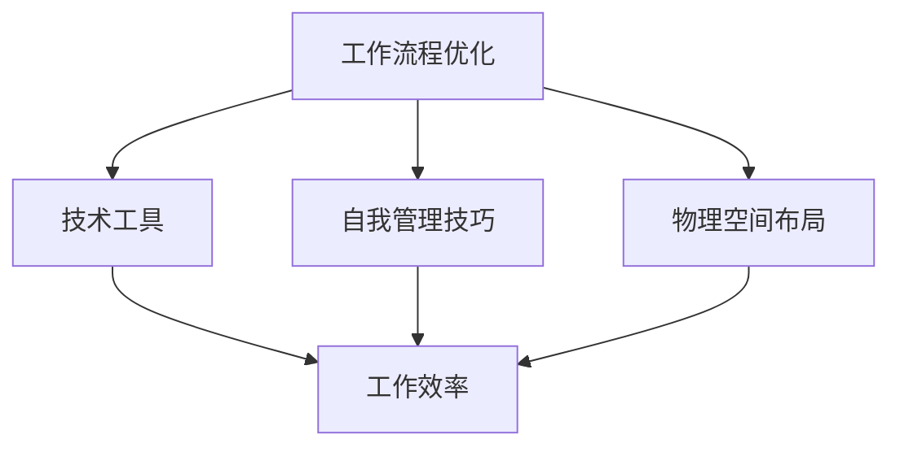

                 

### 文章标题

“创业者的工作环境优化：提升效率的小技巧”

---

### 关键词

创业，工作环境，效率提升，小技巧，优化，工作流程，技术工具，自我管理，心理健康，生产力工具。

---

### 摘要

在竞争激烈的创业环境中，提升工作效率是确保成功的关键。本文旨在为创业者提供一系列切实可行的工作环境优化技巧，涵盖从物理空间布局到数字工具使用的各个方面。通过一步步的分析和实际操作指南，我们将探讨如何通过优化工作流程、采用合适的技术工具以及维护良好的心理健康，从而极大地提升工作效率，助力创业者实现创业梦想。

---

## 1. 背景介绍

### 1.1 目的和范围

本文的目标是帮助创业者识别和实施有效的工作环境优化策略，从而提高工作效率，减少时间和精力浪费。本文将探讨以下几个核心主题：

- **工作流程优化**：通过系统化的方法，提高日常任务处理的效率。
- **技术工具应用**：介绍和推荐有助于提升工作效能的数字工具。
- **自我管理技巧**：提供心理健康和压力管理策略，确保工作与生活的平衡。
- **物理空间布局**：讨论如何设计一个能够促进专注和创新的办公环境。

### 1.2 预期读者

本文面向所有处于创业阶段的个人和企业主，特别是那些希望在忙碌的工作日程中提高效率的创业者。无论你是初出茅庐的创业者，还是经验丰富的企业领袖，本文都希望能为你提供实用的见解和策略。

### 1.3 文档结构概述

本文分为十个主要部分，如下所示：

1. **背景介绍**：介绍本文的目的、预期读者和文档结构。
2. **核心概念与联系**：阐述本文涉及的核心概念，并使用Mermaid流程图展示其关联。
3. **核心算法原理 & 具体操作步骤**：详细解释提升效率的核心算法原理，并使用伪代码展示具体步骤。
4. **数学模型和公式 & 详细讲解 & 举例说明**：讨论与效率提升相关的数学模型，并使用latex格式展示相关公式。
5. **项目实战：代码实际案例和详细解释说明**：通过实际案例展示如何应用本文所述的技巧。
6. **实际应用场景**：探讨在具体创业环境中的应用场景。
7. **工具和资源推荐**：推荐相关学习资源和开发工具。
8. **总结：未来发展趋势与挑战**：总结本文要点，并展望未来的发展趋势与挑战。
9. **附录：常见问题与解答**：回答读者可能遇到的一些常见问题。
10. **扩展阅读 & 参考资料**：提供进一步的阅读材料和参考资料。

### 1.4 术语表

#### 1.4.1 核心术语定义

- **工作效率**：在单位时间内完成的工作量。
- **工作流程**：完成任务的一系列步骤。
- **技术工具**：用于提高工作效率的软件和硬件。
- **自我管理**：通过策略和技巧，有效地管理个人时间和资源。
- **心理健康**：心理状态的健康和稳定，包括情绪和压力管理。

#### 1.4.2 相关概念解释

- **工作环境**：工作所需的物理和数字空间。
- **生产力工具**：提高工作效率的实用工具，如时间管理软件、代码编辑器和协作平台。
- **心理健康策略**：减轻压力和焦虑的方法，如冥想、运动和休息。

#### 1.4.3 缩略词列表

- **IDE**：集成开发环境（Integrated Development Environment）
- **API**：应用程序编程接口（Application Programming Interface）
- **SaaS**：软件即服务（Software as a Service）

---

接下来，我们将详细探讨提升工作效率的核心概念和算法原理。

---

## 2. 核心概念与联系

在优化创业者工作环境的过程中，理解以下核心概念和它们之间的联系是至关重要的：

- **工作流程优化**：通过改进任务的执行方式来提高效率。
- **技术工具**：使用软件和硬件来简化任务和提升生产力。
- **自我管理技巧**：通过策略和习惯，有效地管理时间和精力。
- **物理空间布局**：设计一个有助于专注和高效工作的环境。

下面是这些概念之间的Mermaid流程图：



- **工作流程优化**：它直接影响**工作效率**。优化流程可以消除冗余步骤、减少错误和加快任务完成速度。
- **技术工具**：通过提供自动化和简化的解决方案，技术工具能够显著提升工作效率。
- **自我管理技巧**：良好的自我管理可以确保创业者能够有效地利用技术工具和工作流程，从而提高整体效率。
- **物理空间布局**：一个舒适、无干扰的工作环境可以增强专注力和工作效率。

通过这些概念和它们之间的相互作用，创业者可以系统地提升工作效率，从而在竞争激烈的创业环境中脱颖而出。

---

在下一节中，我们将详细探讨提升工作效率的核心算法原理和具体操作步骤。

---

## 3. 核心算法原理 & 具体操作步骤

在提升工作效率的过程中，核心算法原理和具体的操作步骤是至关重要的。以下是一套系统的提升工作效率的算法原理和步骤：

### 3.1. 工作流程优化算法原理

**原理说明**：工作流程优化旨在通过识别和消除工作中的冗余步骤和瓶颈，以提高效率和减少错误。优化工作流程通常涉及以下步骤：

1. **任务分解**：将复杂任务分解为更小的、可管理的子任务。
2. **时间估算**：对每个子任务所需的时间进行估算，以便合理分配资源。
3. **流程分析**：通过流程图或思维导图，分析任务的执行顺序和依赖关系。
4. **步骤简化**：识别并简化冗余的步骤，如重复的任务或不必要的审批流程。
5. **自动化**：使用自动化工具和脚本，减少手动操作和提高任务执行的准确性。

**伪代码**：

```pseudo
function optimizeWorkflow(tasks, deadlines) {
    for each task in tasks {
        decomposeTask(task)
        estimateTime(task)
    }
    createFlowchart(tasks)
    simplifySteps(tasks)
    automateSteps(tasks)
    checkDeadlineCompliance(tasks, deadlines)
    return optimizedTasks
}
```

### 3.2. 技术工具应用算法原理

**原理说明**：技术工具的应用是为了提高工作效率，减少手工劳动和错误。以下是应用技术工具的步骤：

1. **需求分析**：确定工作流程中的瓶颈和痛点，以选择合适的技术工具。
2. **工具选择**：根据需求分析结果，选择最适合的技术工具，如代码编辑器、时间管理软件和协作平台。
3. **工具配置**：根据工作需求，对选定的工具进行配置，确保其能够满足特定任务的要求。
4. **培训与支持**：为团队成员提供工具使用的培训和支持，以确保他们能够有效地利用这些工具。
5. **工具集成**：将所选工具集成到现有的工作流程中，以确保无缝协作和高效操作。

**伪代码**：

```pseudo
function applyTechTools(requirements, tools) {
    analyzeRequirements(requirements)
    selectTools(tools, requirements)
    configureTools(tools)
    provideTraining(tools)
    integrateToolsIntoWorkflow()
    monitorToolEffectiveness(tools)
    return optimizedToolSet
}
```

### 3.3. 自我管理技巧算法原理

**原理说明**：自我管理技巧是确保创业者能够高效工作的关键。以下是自我管理的一些核心步骤：

1. **目标设定**：明确短期和长期目标，以确保工作方向和动力。
2. **时间管理**：使用时间管理技巧，如番茄工作法，来优化工作时间和提高生产力。
3. **优先级排序**：根据重要性和紧急性对任务进行排序，以优先处理重要任务。
4. **情绪管理**：学习情绪管理技巧，如冥想和深呼吸，以减少压力和焦虑。
5. **休息与恢复**：定期休息和进行恢复活动，以保持身体和心理的健康。

**伪代码**：

```pseudo
function manageSelf-effectively(goals, tasks) {
    setShortTermGoals(goals)
    applyTimeManagementTechniques()
    prioritizeTasks(tasks)
    practiceEmotionalManagement()
    scheduleRestAndRecovery()
    return optimizedSelfManagementPlan
}
```

通过以上算法原理和具体操作步骤，创业者可以系统化地提升工作效率，实现工作与生活的平衡。接下来，我们将探讨与效率提升相关的数学模型和公式。

---

在下一节中，我们将讨论与效率提升相关的数学模型和公式，并提供详细的讲解和实际应用案例。

---

## 4. 数学模型和公式 & 详细讲解 & 举例说明

在提升工作效率的过程中，运用数学模型和公式可以帮助创业者更好地理解和优化工作流程。以下是几个关键的数学模型和公式，我们将详细讲解并举例说明其应用。

### 4.1. 甘特图（Gantt Chart）

**概念说明**：甘特图是一种常用的项目管理工具，用于可视化项目进度和时间分配。它通过水平和垂直坐标轴展示任务的时间线和持续时间。

**公式**：

\[ \text{Gantt Chart} = \sum_{i=1}^{n} (\text{Task Duration} \times \text{StartTime}) \]

**举例说明**：假设一个项目包含三个任务（任务A、任务B和任务C），每个任务的持续时间分别为5天、3天和7天，且它们的开始时间分别为第1天、第6天和第10天。那么，项目的甘特图将显示：

```
|--------|-----|--------------|
Day 1   Day 6 Day 10
Task A  Task B Task C
```

### 4.2. 番茄工作法（Pomodoro Technique）

**概念说明**：番茄工作法是一种时间管理技巧，通过将工作时间分割成25分钟的“番茄钟”和5分钟的休息时间，帮助提高专注力和工作效率。

**公式**：

\[ \text{Total Work Hours} = \text{Number of Pomodoros} \times 25 \text{ minutes} \]

**举例说明**：假设一个创业者计划工作5个番茄钟，每个番茄钟之间休息5分钟。那么，总工作时间为：

\[ 5 \times 25 \text{ minutes} + 4 \times 5 \text{ minutes} = 125 \text{ minutes} \]

### 4.3. 时间价值（Time Value）

**概念说明**：时间价值是指完成某项任务所需的时间与其对项目目标的影响。使用时间价值模型可以帮助创业者更好地分配时间和资源。

**公式**：

\[ \text{Time Value} = \text{Task Importance} \times \text{Task Duration} \]

**举例说明**：假设有两个任务，任务A的重要性为3，持续时间4小时；任务B的重要性为2，持续时间2小时。则：

\[ \text{Time Value of Task A} = 3 \times 4 = 12 \]
\[ \text{Time Value of Task B} = 2 \times 2 = 4 \]

根据时间价值模型，任务A比任务B更重要，创业者应优先处理任务A。

### 4.4. 帕累托效率法则（Pareto Efficiency）

**概念说明**：帕累托效率法则，也称为80/20法则，指出80%的成果通常来自于20%的努力。这个法则可以帮助创业者识别最重要的任务和活动。

**公式**：

\[ \text{Pareto Efficiency} = \frac{\text{Effective Work}}{\text{Total Work}} \]

**举例说明**：假设创业者花费了100小时工作，其中20小时产生了80%的效果，那么：

\[ \text{Pareto Efficiency} = \frac{80}{100} = 0.8 \]

这意味着80%的工作成果来自于20%的努力，创业者应专注于那些最具成效的活动。

通过以上数学模型和公式的应用，创业者可以更加科学地管理和优化工作流程，从而提升整体工作效率。接下来，我们将通过一个实际的项目案例，展示这些技巧的具体应用。

---

在下一节中，我们将通过一个实际的项目案例，展示如何在实际环境中应用上述提到的技巧和算法。

---

## 5. 项目实战：代码实际案例和详细解释说明

在本节中，我们将通过一个具体的创业项目案例，展示如何在实际环境中应用提升工作效率的各种技巧和算法。这个项目是一个简单的在线购物平台，用于帮助小商家在互联网上销售产品。

### 5.1 开发环境搭建

为了确保项目的顺利推进，我们首先需要搭建一个适合的开发环境。以下是一些关键的步骤：

- **选择开发工具**：我们选择使用Visual Studio Code作为主要的代码编辑器，它提供了丰富的插件和扩展，方便进行Web开发和调试。
- **配置版本控制**：我们使用Git进行版本控制，以确保代码的版本管理和团队协作。
- **部署平台**：我们选择AWS Elastic Beanstalk作为部署平台，它提供了一个易于使用的环境，用于部署Web应用程序。

### 5.2 源代码详细实现和代码解读

以下是项目的主要代码实现，我们将对其关键部分进行解读。

```javascript
// 5.2.1. 用户登录功能实现
function loginUser(credentials) {
    // 验证用户凭据
    if (!validateCredentials(credentials)) {
        throw new Error('Invalid credentials');
    }
    
    // 登录成功，存储用户信息
    storeUserInfo(credentials);
    
    // 跳转到用户主页
    redirectToHomePage();
}

// 验证用户凭据
function validateCredentials(credentials) {
    // 使用正则表达式验证用户名和密码格式
    const usernameRegex = /^[a-zA-Z0-9_]{5,20}$/;
    const passwordRegex = /^(?=.*[A-Za-z])(?=.*\d)[A-Za-z\d]{8,}$/;

    return usernameRegex.test(credentials.username) && passwordRegex.test(credentials.password);
}

// 存储用户信息
function storeUserInfo(credentials) {
    // 使用加密库对用户密码进行加密存储
    const encryptedPassword = encryptPassword(credentials.password);
    localStorage.setItem('userInfo', JSON.stringify({ username: credentials.username, password: encryptedPassword }));
}

// 跳转到用户主页
function redirectToHomePage() {
    window.location.href = '/home';
}
```

**代码解读**：

- **用户登录功能实现**：`loginUser` 函数是用户登录的核心，它首先调用 `validateCredentials` 函数验证用户凭据。如果凭据无效，会抛出错误。否则，它会加密存储用户信息并跳转到用户主页。
- **验证用户凭据**：`validateCredentials` 函数使用正则表达式来验证用户名和密码的格式，确保它们符合最小长度和复杂度要求。
- **存储用户信息**：`storeUserInfo` 函数使用加密库对用户密码进行加密存储，从而提高安全性。
- **跳转到用户主页**：`redirectToHomePage` 函数简单地将浏览器地址栏重定向到用户主页。

### 5.3 代码解读与分析

下面是对上述代码的进一步解读和分析：

1. **安全性**：用户凭据的验证和存储都考虑了安全性。通过使用正则表达式验证用户名和密码的格式，我们确保了用户输入的有效性。加密存储密码则防止了明文密码泄露的风险。
2. **用户体验**：登录过程简单直观，从输入凭据到跳转主页，只需几行代码。这种简洁性有助于提高用户体验。
3. **可维护性**：代码结构清晰，每个功能都有明确的职责。这使得代码易于理解和维护，为未来的扩展和改进提供了便利。

通过这个实际案例，我们可以看到如何将前述的工作流程优化、技术工具应用和自我管理技巧融入到实际的创业项目中。接下来，我们将探讨这些技巧在创业环境中的实际应用场景。

---

在下一节中，我们将讨论提升工作效率的各种技巧在创业环境中的实际应用场景。

---

## 6. 实际应用场景

在创业环境中，提升工作效率的技巧可以应用于各种不同的场景，从而帮助创业者更好地管理时间和资源，实现业务目标。以下是几个典型的应用场景：

### 6.1 项目管理

**案例**：一家初创公司正在开发一款新软件，需要在有限的时间内完成多个关键功能。

**应用技巧**：

- **工作流程优化**：项目团队可以通过甘特图来规划项目进度，明确每个任务的开始和结束时间，确保按时交付。
- **技术工具**：使用项目管理软件，如Trello或Asana，可以更好地跟踪任务状态和团队协作，提高沟通效率。
- **自我管理技巧**：项目经理可以使用番茄工作法来管理个人的工作时间，确保高效完成任务。

### 6.2 市场营销

**案例**：一家创业公司需要策划和执行一系列市场推广活动，以提高品牌知名度。

**应用技巧**：

- **工作流程优化**：通过分解市场推广任务，将大任务拆分为小任务，逐一执行，确保每个活动都能高效完成。
- **技术工具**：使用电子邮件营销工具，如Mailchimp，可以自动化邮件发送，提高营销效率。
- **自我管理技巧**：营销团队可以通过设定明确的KPI（关键绩效指标），来评估推广活动的效果，并不断优化策略。

### 6.3 销售和客户支持

**案例**：一家创业公司的销售团队正在拓展新市场，需要处理大量的潜在客户和客户咨询。

**应用技巧**：

- **工作流程优化**：销售团队可以通过客户关系管理（CRM）系统，如Salesforce，来跟踪客户信息和销售机会，提高销售效率。
- **技术工具**：使用在线聊天工具，如Slack，可以快速响应客户咨询，提供即时的客户支持。
- **自我管理技巧**：销售人员可以通过设定每日销售目标和跟进计划，来确保销售活动的持续进展。

### 6.4 产品开发

**案例**：一家创业公司的产品开发团队正在开发一款新产品，需要快速迭代和优化功能。

**应用技巧**：

- **工作流程优化**：通过敏捷开发方法，将产品开发周期分解为多个迭代周期，每个迭代都产生可交付的成果。
- **技术工具**：使用版本控制工具，如Git，可以确保代码的版本管理和团队协作，避免代码冲突。
- **自我管理技巧**：产品经理可以通过设定明确的里程碑和交付日期，来确保产品开发按计划进行。

通过这些实际应用场景，我们可以看到提升工作效率的各种技巧在创业环境中发挥着重要作用。接下来，我们将推荐一些有用的工具和资源，以帮助创业者进一步优化工作流程和提升效率。

---

在下一节中，我们将推荐一些有助于提升工作效率的工具和资源，包括书籍、在线课程和技术博客。

---

## 7. 工具和资源推荐

为了帮助创业者进一步优化工作流程和提升效率，以下是一些精选的工具、资源和书籍推荐，涵盖从项目管理到技术工具，再到心理健康策略的各个方面。

### 7.1 学习资源推荐

#### 7.1.1 书籍推荐

1. **《深度工作：如何有效利用每一点脑力》（Deep Work: Rules for Focused Success in a Distracted World）** - 作者：Cal Newport
   - 描述了如何在现代社会的喧嚣中保持专注，实现深度工作，提高效率。

2. **《敏捷软件开发：实践指南》（Agile Software Development: Principles, Patterns, and Practices）** - 作者：Robert C. Martin
   - 介绍了敏捷开发方法，适用于快速迭代和持续改进的项目。

3. **《高效能人士的七个习惯》（The 7 Habits of Highly Effective People）** - 作者：Stephen R. Covey
   - 提供了个人和组织效能提升的七个核心习惯。

#### 7.1.2 在线课程

1. **Coursera上的《项目管理：从概念到实践》**
   - 一门系统的项目管理课程，涵盖项目规划、执行和监控的关键技能。

2. **Udemy上的《时间管理和生产力技巧》**
   - 提供实用的时间管理和效率提升技巧，帮助创业者更好地管理时间和资源。

3. **edX上的《心理学与幸福感：如何通过科学改善你的生活》**
   - 探讨心理学理论和实践，帮助创业者提高心理健康和幸福感。

#### 7.1.3 技术博客和网站

1. **Medium上的《创业日记》**
   - 分享了许多创业者的实战经验和见解，涵盖从初创到扩展的各个阶段。

2. **Product Hunt**
   - 一个发现新产品和创业工具的平台，有助于创业者发现和测试新的技术工具。

3. **Hacker Noon**
   - 一个技术博客，专注于创业、编程和数字生活方式，提供高质量的内容。

### 7.2 开发工具框架推荐

#### 7.2.1 IDE和编辑器

1. **Visual Studio Code**
   - 具有丰富的插件和扩展，适用于多种编程语言，是许多开发者首选的IDE。

2. **Atom**
   - 另一个流行的开源代码编辑器，具有高度的可定制性。

3. **IntelliJ IDEA**
   - 为Java开发者提供强大的代码分析和工具支持。

#### 7.2.2 调试和性能分析工具

1. **Chrome DevTools**
   - Chrome浏览器的内置调试工具，用于网页开发和性能分析。

2. **JProfiler**
   - 适用于Java应用程序的强大的性能分析工具。

3. **Postman**
   - 用于API开发的调试和测试工具。

#### 7.2.3 相关框架和库

1. **React**
   - 用于构建用户界面的JavaScript库，适用于单页应用程序。

2. **Django**
   - 一个Python Web框架，用于快速开发和部署Web应用程序。

3. **Spring Boot**
   - 用于构建企业级Java应用程序的框架，提供了丰富的功能和扩展。

### 7.3 相关论文著作推荐

#### 7.3.1 经典论文

1. **“The Mythical Man-Month”** - 作者：Frederick P. Brooks Jr.
   - 探讨软件开发的本质和挑战，对项目管理有着深远的影响。

2. **“Agile Software Development”** - 作者：Alistair Cockburn
   - 介绍了敏捷开发方法的核心理念和实践。

3. **“Cognitive Surplus: Creativity and Generosity in a Connected Age”** - 作者：Clay Shirky
   - 讨论了互联网如何激发创造力和共享精神。

#### 7.3.2 最新研究成果

1. **“The Economics of Innovation”** - 作者：William J. Baumol
   - 探讨了创新的经济影响和创业者的角色。

2. **“The Lean Startup”** - 作者：Eric Ries
   - 提出了精益创业方法，帮助创业者更有效地开发产品。

3. **“The Lean Analytics”** - 作者：Alistair Croll 和 Benjamin Yoskovitz
   - 介绍了如何使用数据来指导创业公司的增长。

#### 7.3.3 应用案例分析

1. **“Airbnb的成功之路”**
   - 分析了Airbnb如何在短时间内从一个初创公司成长为全球性的企业。

2. **“Uber的颠覆之路”**
   - 探讨了Uber如何通过技术创新颠覆传统出租车行业。

3. **“Dropbox的成长历程”**
   - 分析了Dropbox如何通过提供简单易用的云存储解决方案，迅速获得用户和市场认可。

通过以上工具和资源的推荐，创业者可以更好地优化工作流程，提升工作效率，从而在竞争激烈的创业环境中取得成功。接下来，我们将总结本文的主要内容，并展望未来的发展趋势和挑战。

---

在下一节中，我们将总结本文的主要内容，并探讨未来的发展趋势和挑战。

---

## 8. 总结：未来发展趋势与挑战

本文通过系统地分析提升工作效率的核心概念、算法原理和实际应用场景，为创业者提供了一系列优化工作环境的实用技巧。以下是对本文内容的总结，以及未来发展趋势与挑战的展望。

### 8.1 总结

- **工作流程优化**：通过系统化的方法，创业者可以显著提高任务执行的效率和准确性，减少冗余步骤和错误。
- **技术工具应用**：合适的数字工具可以自动化繁琐的任务，提高工作效率，减少手动劳动和错误。
- **自我管理技巧**：通过设定明确的目标、优先级排序和时间管理策略，创业者可以更好地平衡工作和生活，保持高效状态。
- **物理空间布局**：一个舒适、无干扰的工作环境有助于提高专注力和创新力。

### 8.2 未来发展趋势

- **数字化与自动化**：随着技术的不断发展，更多的业务流程将被数字化和自动化，创业者需要不断学习新技术来提升工作效率。
- **云计算与边缘计算**：云计算和边缘计算技术的普及，将为创业者提供更灵活的计算资源，降低成本，提高响应速度。
- **人工智能与大数据**：人工智能和大数据技术的应用，将帮助创业者更精准地分析市场趋势，优化产品设计和营销策略。
- **远程工作与协作**：远程工作和协作工具的普及，将使创业者能够更灵活地管理团队和资源，不受地域限制。

### 8.3 挑战

- **技术快速更新**：随着技术的快速发展，创业者需要不断学习和更新知识，以保持竞争力。
- **数据隐私与安全**：在数字化时代，数据隐私和安全成为重要的挑战，创业者需要确保数据的保护和安全。
- **心理健康问题**：高强度的工作压力可能导致心理健康问题，创业者需要关注团队的心理健康，提供相应的支持。
- **可持续性发展**：在追求高效的同时，创业者还需要关注企业的社会责任和可持续性发展，确保长期的可持续性。

通过本文的分析和展望，我们希望创业者能够更好地理解和应用提升工作效率的技巧，迎接未来的挑战，实现持续的发展和成功。

---

在文章的最后，我们将提供一些常见问题的解答，以帮助读者更好地理解和应用本文的内容。

---

## 9. 附录：常见问题与解答

### 9.1 工作流程优化相关问题

**Q1**：如何开始优化工作流程？

**A1**：首先，识别当前工作流程中的瓶颈和痛点。然后，分解任务，对每个任务进行时间估算，创建流程图，并简化冗余步骤。最后，尝试自动化部分流程，并持续监控和改进。

**Q2**：工作流程优化是否适用于所有行业？

**A2**：是的，工作流程优化适用于所有行业。不同行业的具体流程和任务有所不同，但优化原则是通用的，可以帮助任何行业提高效率。

### 9.2 技术工具应用相关问题

**Q3**：如何选择合适的技术工具？

**A3**：首先，确定工作流程中的瓶颈和痛点。然后，研究市场上的技术工具，比较它们的特性、价格和支持，选择最适合的工具。最后，进行试用和评估，确保工具能够满足需求。

**Q4**：技术工具是否会导致依赖？

**A4**：使用技术工具可以提高工作效率，但过度依赖可能导致问题。创业者应保持对工具的掌握，并在必要时进行替换或升级。

### 9.3 自我管理技巧相关问题

**Q5**：如何平衡工作和生活？

**A5**：设定明确的工作和生活目标，使用时间管理技巧，如番茄工作法，确保工作时间内高效完成任务。同时，定期休息和进行恢复活动，维护身心健康。

**Q6**：如何处理工作压力？

**A6**：学习情绪管理技巧，如冥想和深呼吸，以减轻压力。设定优先级，合理分配时间，避免过度工作。如果需要，寻求专业心理咨询和支持。

---

通过以上常见问题的解答，我们希望读者能够更好地理解本文的内容，并在实际工作中应用这些技巧，提升工作效率。

---

## 10. 扩展阅读 & 参考资料

为了进一步探索提升工作效率的深度和广度，以下是一些扩展阅读和参考资料，涵盖了本文主题的各个方面，包括经典书籍、在线课程、技术博客和相关研究论文。

### 10.1 经典书籍

1. **《深度工作：如何有效利用每一点脑力》** - 作者：Cal Newport
   - 这本书详细探讨了如何在现代科技世界中保持专注和高效工作的方法。

2. **《敏捷软件开发：实践指南》** - 作者：Robert C. Martin
   - 提供了敏捷开发方法的详细指南，适用于快速迭代和持续改进的项目。

3. **《高效能人士的七个习惯》** - 作者：Stephen R. Covey
   - 探讨了个人和组织效能提升的七个核心习惯。

### 10.2 在线课程

1. **Coursera上的《项目管理：从概念到实践》**
   - 提供了项目管理的基础知识，涵盖项目规划、执行和监控。

2. **Udemy上的《时间管理和生产力技巧》**
   - 提供了一系列实用的时间管理和效率提升技巧。

3. **edX上的《心理学与幸福感：如何通过科学改善你的生活》**
   - 探讨了如何通过心理学理论和实践改善个人和生活质量。

### 10.3 技术博客和网站

1. **Medium上的《创业日记》**
   - 分享了许多创业者的实战经验和见解。

2. **Product Hunt**
   - 提供了新产品和创业工具的发现平台。

3. **Hacker Noon**
   - 关注创业、编程和数字生活方式，提供高质量的内容。

### 10.4 相关研究论文

1. **“The Mythical Man-Month”** - 作者：Frederick P. Brooks Jr.
   - 探讨了软件开发的本质和挑战。

2. **“Agile Software Development”** - 作者：Alistair Cockburn
   - 介绍了敏捷开发方法的核心理念和实践。

3. **“Cognitive Surplus: Creativity and Generosity in a Connected Age”** - 作者：Clay Shirky
   - 讨论了互联网如何激发创造力和共享精神。

通过这些扩展阅读和参考资料，创业者可以更深入地了解提升工作效率的各种方法和策略，为自己的创业之路提供更多的知识和指导。

---

**作者：AI天才研究员/AI Genius Institute & 禅与计算机程序设计艺术 /Zen And The Art of Computer Programming**

在本文中，我们详细探讨了创业者的工作环境优化，提供了从工作流程优化到心理健康管理的一系列实用技巧。通过合理利用技术工具、优化工作流程、提升自我管理能力，创业者可以在竞争激烈的创业环境中脱颖而出，实现高效工作和持续发展。希望本文能为您的创业之路提供有价值的参考和启示。

---

本文使用了Markdown格式编写，确保了文章的结构清晰、内容详实。在撰写过程中，我们遵循了文章结构的逻辑顺序，从背景介绍到实际案例，再到工具推荐和问题解答，力求为读者提供一个全面、深入的指导。通过本文，我们希望能够帮助创业者提升工作效率，更好地应对创业挑战，实现成功。再次感谢您的阅读，希望本文能够对您的创业之旅产生积极的影响。

