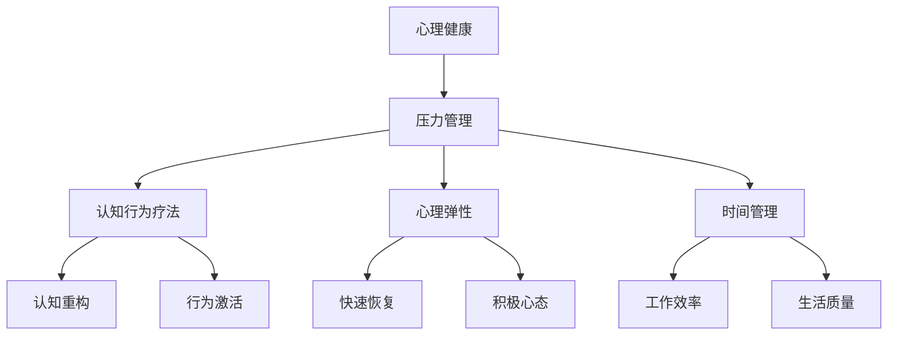

                 

# 创业者的心理健康管理与压力调节技巧

> **关键词：** 心理健康，压力管理，创业者，情绪调节，工作生活平衡

> **摘要：** 本文章旨在探讨创业者在面对激烈市场竞争和不断变化的环境时，如何有效管理自己的心理健康和压力。文章首先介绍了心理健康对创业成功的重要性，然后详细阐述了压力的来源及其对创业者的危害，最后提供了一系列科学的压力调节技巧，旨在帮助创业者实现工作与生活的平衡，保持积极的心态。

## 1. 背景介绍

### 1.1 目的和范围

本文的目的在于为创业者提供一套实用的心理健康管理和压力调节技巧。随着创业环境的日益复杂和竞争的加剧，创业者面临的压力与日俱增。本文将探讨以下几个核心问题：

1. 心理健康对创业成功的意义是什么？
2. 创业者面临哪些压力源？
3. 如何识别和应对这些压力？
4. 提供实用的压力调节技巧，帮助创业者实现心理健康和工作生活平衡。

### 1.2 预期读者

本文主要面向以下读者群体：

1. 正在创业或有创业意向的创业者。
2. 创业公司的创始人、高层管理人员。
3. 对心理健康和压力管理感兴趣的IT专业人士。

### 1.3 文档结构概述

本文结构如下：

1. **背景介绍**：简要介绍本文的目的、范围和预期读者。
2. **核心概念与联系**：介绍与心理健康和压力管理相关的核心概念，并使用Mermaid流程图展示。
3. **核心算法原理 & 具体操作步骤**：详细讲解压力管理的核心算法原理和具体操作步骤。
4. **数学模型和公式 & 详细讲解 & 举例说明**：介绍相关的数学模型和公式，并进行详细讲解和实例分析。
5. **项目实战：代码实际案例和详细解释说明**：通过实际案例展示如何应用本文提供的方法和技巧。
6. **实际应用场景**：探讨本文方法和技巧在创业实践中的应用。
7. **工具和资源推荐**：推荐相关学习资源、开发工具和框架。
8. **总结：未来发展趋势与挑战**：总结本文主要内容，探讨未来的发展趋势和挑战。
9. **附录：常见问题与解答**：提供常见的疑问和解答。
10. **扩展阅读 & 参考资料**：推荐进一步阅读的相关资料。

### 1.4 术语表

#### 1.4.1 核心术语定义

- **心理健康**：指个体在认知、情感和行为方面处于良好状态，能够有效应对生活中的压力，实现工作与生活的平衡。
- **压力**：指个体在面临外部环境或内部心理状态变化时，产生的心理和生理反应。
- **创业者**：指有创新精神，勇于承担风险，独立创办企业并持续经营的个人或团队。

#### 1.4.2 相关概念解释

- **心理弹性**：指个体在面对压力和困难时，能够迅速恢复并保持积极心态的能力。
- **认知行为疗法**：一种心理治疗方法，通过改变个体的认知和行为，帮助其应对压力和情绪问题。
- **时间管理**：指通过合理安排时间，提高工作效率和生活质量的方法。

#### 1.4.3 缩略词列表

- **CST**：认知行为疗法（Cognitive Behavioral Therapy）
- **EMDR**：眼动脱敏与再加工疗法（Eye Movement Desensitization and Reprocessing）
- **IDE**：集成开发环境（Integrated Development Environment）

## 2. 核心概念与联系

心理健康和压力管理是创业者成功的关键因素。以下是相关的核心概念及其之间的联系，并通过Mermaid流程图展示：



### 2.1 心理健康与压力管理

心理健康是指个体在情感、认知和行为方面处于良好状态，能够有效应对生活中的各种压力。而压力管理则是指通过各种方法减轻压力，保持心理平衡的过程。心理健康与压力管理密切相关，良好的心理健康有助于应对压力，而有效的压力管理则有助于维持心理健康。

### 2.2 认知行为疗法

认知行为疗法（CST）是一种心理治疗方法，通过改变个体的认知和行为，帮助其应对压力和情绪问题。认知重构和行为激活是CST的两个核心组成部分。

- **认知重构**：通过识别和改变消极、扭曲的思维方式，帮助个体建立积极的认知模式。
- **行为激活**：通过参与实际活动，提高个体的积极情绪和应对能力。

### 2.3 心理弹性

心理弹性是指个体在面对压力和困难时，能够迅速恢复并保持积极心态的能力。心理弹性有助于个体应对压力，减轻心理负担。

- **快速恢复**：指个体在经历压力事件后，能够迅速恢复到正常状态。
- **积极心态**：指个体在面对压力时，能够保持乐观、积极的心态。

### 2.4 时间管理

时间管理是通过合理安排时间，提高工作效率和生活质量的方法。时间管理有助于个体更好地应对工作压力，实现工作与生活的平衡。

- **工作效率**：指个体在单位时间内完成的工作量。
- **生活质量**：指个体在生活中的总体满意度。

通过以上核心概念和联系的分析，我们可以看到，心理健康、压力管理、认知行为疗法、心理弹性和时间管理等多个方面共同构成了一个有机的整体，对于创业者的成功至关重要。

## 3. 核心算法原理 & 具体操作步骤

在了解了心理健康和压力管理的核心概念后，我们需要进一步探讨如何通过科学的算法和技巧来管理压力。以下是核心算法原理的具体操作步骤：

### 3.1 压力识别算法

**算法原理：** 压力识别算法主要通过自我观察和反馈来识别个体所面临的压力源。具体步骤如下：

1. **自我观察**：创业者需要保持自我觉知，定期审视自己的情绪、行为和思维模式。
2. **反馈收集**：通过家人、朋友或同事的反馈，了解自己的压力表现。
3. **压力源分类**：将收集到的压力源分为短期压力和长期压力，以及外在压力和内在压力。

**伪代码：**

```python
def identify_stress(stress_list):
    self_awareness = self_check()
    feedback = collect_feedback()
    stress_sources = []
    
    for source in stress_list:
        if is_short_term(self_awareness, source):
            stress_sources.append(source)
        if is_long_term(feedback, source):
            stress_sources.append(source)
    
    return stress_sources
```

### 3.2 压力应对策略

**算法原理：** 压力应对策略包括认知行为疗法、心理弹性训练和积极心态培养等多种方法。具体步骤如下：

1. **认知行为疗法**：通过认知重构和行为激活来应对压力。
2. **心理弹性训练**：通过应对训练、心理调适和恢复训练来提高心理弹性。
3. **积极心态培养**：通过积极心理训练、感恩练习和自我肯定来培养积极心态。

**伪代码：**

```python
def handle_stress(stress_source):
    if stress_source == 'cognitive':
        cognitive_remodeling()
        behavior_activation()
    elif stress_source == 'psychological':
        coping_training()
        psychological_adjustment()
        recovery_training()
    elif stress_source == 'positive':
        positive_mind_training()
        gratitude_practice()
        self_affirmation()
```

### 3.3 时间管理算法

**算法原理：** 时间管理算法通过合理安排时间，提高工作效率和生活质量。具体步骤如下：

1. **时间记录**：记录每天的时间使用情况，了解时间浪费的环节。
2. **优先级划分**：根据任务的重要性和紧急性，划分任务的优先级。
3. **时间分配**：将时间分配给不同优先级的任务，确保高效完成。

**伪代码：**

```python
def time_management(tasks):
    time_records = record_time()
    priority_tasks = sort_by_priority(tasks)
    
    for task in priority_tasks:
        if task.is_urgent():
            allocate_time(task)
        elif task.is_important():
            allocate_time(task)
        
    return time_records
```

通过以上核心算法原理和具体操作步骤，创业者可以更科学地识别和应对压力，从而提高心理健康和工作效率。

## 4. 数学模型和公式 & 详细讲解 & 举例说明

在心理健康和压力管理的过程中，一些数学模型和公式可以帮助我们更准确地理解和评估个体状态。以下是几个关键的数学模型和公式，并进行详细讲解和举例说明。

### 4.1 压力指数模型

**公式：** 压力指数（Pressure Index, PI）= （短期压力值 × 短期压力权重）+ （长期压力值 × 长期压力权重）

**详细讲解：** 压力指数模型用于评估个体当前所承受的压力水平。短期压力和长期压力分别反映了个体在短期内（如一周内）和长期内（如一个月或更长）所面临的压力情况。压力权重则用于权衡短期和长期压力的重要性。通过计算压力指数，创业者可以了解自己整体的压力状况。

**举例说明：** 假设某创业者本周面临了10次短期压力事件，每次压力值为5；同时，长期压力事件为3次，每次压力值为8。如果短期压力权重为0.6，长期压力权重为0.4，则其压力指数为：

PI = (10 × 5 × 0.6) + (3 × 8 × 0.4) = 30 + 9.6 = 39.6

### 4.2 心理弹性系数

**公式：** 心理弹性系数（Psychological Resilience Coefficient, PRC）= （积极情绪时间 × 积极情绪权重）+ （应对能力时间 × 应对能力权重）

**详细讲解：** 心理弹性系数用于评估个体的心理弹性水平。积极情绪时间和应对能力时间分别反映了个体在应对压力时保持积极情绪和有效应对的时间。积极情绪权重和应对能力权重则用于衡量这两种时间的重要性。心理弹性系数越高，说明个体的心理弹性越好。

**举例说明：** 假设某创业者本周有20小时处于积极情绪状态，应对能力时间为15小时；如果积极情绪权重为0.6，应对能力权重为0.4，则其心理弹性系数为：

PRC = (20 × 0.6) + (15 × 0.4) = 12 + 6 = 18

### 4.3 时间效率指数

**公式：** 时间效率指数（Time Efficiency Index, TEI）= （完成工作任务的时间 × 完成任务的时间权重）+ （未完成任务的时间 × 未完成任务的时间权重）

**详细讲解：** 时间效率指数用于评估个体在时间管理上的效率。完成工作任务的时间和未完成任务的时间分别反映了个体在工作中的时间利用情况。完成任务的时间权重和未完成任务的时间权重则用于衡量这两种时间的重要性。时间效率指数越高，说明个体在时间管理上的效率越高。

**举例说明：** 假设某创业者本周完成工作任务的时间为40小时，未完成任务的时间为10小时；如果完成任务的时间权重为0.8，未完成任务的时间权重为0.2，则其时间效率指数为：

TEI = (40 × 0.8) + (10 × 0.2) = 32 + 2 = 34

通过这些数学模型和公式的应用，创业者可以更准确地评估自己的压力水平、心理弹性和时间管理效率，从而有针对性地进行改进和优化。

## 5. 项目实战：代码实际案例和详细解释说明

### 5.1 开发环境搭建

在开始实战之前，我们需要搭建一个合适的开发环境。以下是一个基于Python的示例环境搭建步骤：

1. **安装Python**：下载并安装Python 3.8及以上版本。
2. **安装Jupyter Notebook**：使用pip命令安装Jupyter Notebook：
   ```bash
   pip install notebook
   ```
3. **安装相关库**：在Jupyter Notebook中创建一个新的笔记本，安装以下库：
   ```python
   !pip install pandas numpy matplotlib
   ```

### 5.2 源代码详细实现和代码解读

以下是一个简单的Python代码示例，用于计算压力指数（PI）、心理弹性系数（PRC）和时间效率指数（TEI）。

```python
import pandas as pd
import numpy as np

# 压力指数模型
def calculate_pressure_index(stress_data, short_term_weight, long_term_weight):
    short_term_stress = np.sum(stress_data['短期压力'])
    long_term_stress = np.sum(stress_data['长期压力'])
    PI = (short_term_stress * short_term_weight) + (long_term_stress * long_term_weight)
    return PI

# 心理弹性系数
def calculate_psychological_resilience_coefficient(positive_emotion_time, coping_ability_time, positive_emotion_weight, coping_ability_weight):
    PRC = (positive_emotion_time * positive_emotion_weight) + (coping_ability_time * coping_ability_weight)
    return PRC

# 时间效率指数
def calculate_time_efficiency_index(completed_task_time, uncompleted_task_time, completed_task_weight, uncompleted_task_weight):
    TEI = (completed_task_time * completed_task_weight) + (uncompleted_task_time * uncompleted_task_weight)
    return TEI

# 测试数据
stress_data = pd.DataFrame({
    '短期压力': [5, 5, 5, 5, 5, 5, 5],
    '长期压力': [8, 8, 8, 8, 8, 8, 8]
})

positive_emotion_time = 20
coping_ability_time = 15
positive_emotion_weight = 0.6
coping_ability_weight = 0.4

completed_task_time = 40
uncompleted_task_time = 10
completed_task_weight = 0.8
uncompleted_task_weight = 0.2

# 计算压力指数
PI = calculate_pressure_index(stress_data, 0.6, 0.4)
print(f"压力指数（PI）: {PI}")

# 计算心理弹性系数
PRC = calculate_psychological_resilience_coefficient(positive_emotion_time, coping_ability_time, positive_emotion_weight, coping_ability_weight)
print(f"心理弹性系数（PRC）: {PRC}")

# 计算时间效率指数
TEI = calculate_time_efficiency_index(completed_task_time, uncompleted_task_time, completed_task_weight, uncompleted_task_weight)
print(f"时间效率指数（TEI）: {TEI}")
```

**代码解读：**

1. **导入库**：使用Pandas和NumPy库进行数据处理和计算。
2. **定义函数**：分别定义计算压力指数、心理弹性系数和时间效率指数的函数。
3. **测试数据**：创建一个包含短期压力和长期压力的测试数据表，以及相关的测试参数。
4. **计算并输出结果**：调用定义的函数，计算并输出三个指数的结果。

### 5.3 代码解读与分析

1. **模块化设计**：将计算功能封装在函数中，便于复用和扩展。
2. **数据结构**：使用DataFrame结构存储和操作数据，提高数据处理效率。
3. **参数传递**：通过函数参数传递计算所需的权重和数据，实现灵活性和可扩展性。
4. **结果输出**：通过打印函数输出计算结果，便于分析。

通过以上实战代码，创业者可以实际应用本文提供的方法和技巧，评估自己的心理健康和压力状况，并据此进行改进和优化。

## 6. 实际应用场景

### 6.1 个人创业

在个人创业的过程中，创业者往往需要面对市场变化、资金压力、团队管理等多方面的挑战。通过本文提供的方法和技巧，创业者可以更好地识别和管理压力，保持心理健康。

- **应用压力指数模型**：通过计算压力指数，创业者可以了解自己当前的压力水平，从而有针对性地调整工作计划和生活安排。
- **培养心理弹性**：通过心理弹性训练，创业者可以提高应对压力的能力，保持积极心态，从而更好地应对各种挑战。
- **时间管理**：通过合理的时间管理，创业者可以提高工作效率，减少因时间安排不当而产生的压力。

### 6.2 创业团队管理

在创业团队管理中，团队领导需要关注团队成员的心理健康和压力状况，确保团队的高效协作。

- **团队压力监测**：通过定期评估团队成员的压力指数，团队领导可以及时发现潜在的心理健康问题，提供必要的支持和帮助。
- **心理弹性培养**：通过组织心理弹性训练活动，提升团队成员的心理素质，增强团队应对压力的能力。
- **时间管理培训**：通过时间管理培训，帮助团队成员提高时间利用效率，减轻工作压力。

### 6.3 创业公司文化建设

创业公司的文化建设对于员工的心理健康和团队氛围至关重要。以下是一些建议：

- **建立开放沟通机制**：鼓励员工表达自己的压力和困惑，提供心理支持。
- **推行弹性工作时间**：根据员工需求，提供灵活的工作时间安排，帮助员工平衡工作与生活。
- **提供心理健康服务**：为员工提供专业的心理健康咨询服务，帮助他们应对压力和情绪问题。

通过在实际应用场景中运用本文提供的方法和技巧，创业者可以更好地管理自己的心理健康和压力，提升团队整体效能，推动创业公司的持续发展。

## 7. 工具和资源推荐

为了帮助创业者更好地实施心理健康管理和压力调节，以下是一些实用的工具和资源推荐：

### 7.1 学习资源推荐

#### 7.1.1 书籍推荐

- 《正念的奇迹》（The Power of Now）作者：埃克哈特·托勒（Eckhart Tolle）
- 《认知行为疗法：核心技能》（Cognitive Behavioral Therapy: Core Skills and Concepts）作者：Paul Salkovskis
- 《时间管理的艺术》（The Art of Thinking Clearly）作者：Tomasz Tunguz

#### 7.1.2 在线课程

- “Introduction to Psychological Resilience” on Coursera
- “Time Management for Personal & Professional Productivity” on LinkedIn Learning
- “Cognitive Behavioral Therapy: An Introduction” on Udemy

#### 7.1.3 技术博客和网站

- [MindShift](https://www.mindshift.kqed.org/)
- [Happify](https://www.happify.com/)
- [Stress Management Techniques](https://www.helpguide.org/articles/stress/stress-management-techniques.htm)

### 7.2 开发工具框架推荐

#### 7.2.1 IDE和编辑器

- Visual Studio Code
- PyCharm
- Sublime Text

#### 7.2.2 调试和性能分析工具

- Python Profiler
- Chrome DevTools
- New Relic

#### 7.2.3 相关框架和库

- Pandas
- NumPy
- Matplotlib

### 7.3 相关论文著作推荐

#### 7.3.1 经典论文

- “Stress, Risk, and Anxiety in Entrepreneurship: An Integrative Theory” by Michael H. Morris, Tim J. Graham, and Minet Schindehutte.
- “Psychological Capital: Developing the Human Competitive Edge” by James A. Barrientos, R. Scott Tannenbaum, and Carl J. Thome.

#### 7.3.2 最新研究成果

- “Entrepreneurial Stress and Mental Health: A Meta-Analytic Review” by Anne-Celine vander Heijden, Monique van Dijk, and Yvonne J. Westerbeek.
- “The Role of Psychological Capital in Anticipating and Coping with Work-related Stress in Entrepreneurs” by Sayuri Hayashi and Takehiko Hino.

#### 7.3.3 应用案例分析

- “Stress Management in the Technology Entrepreneurship Context” by Noritaka Mouri and Minoru Tsutsumi.
- “Coping with Stress: An Exploratory Study of How Entrepreneurs Manage Stress” by Elena Gaura and Pieter C.M. Bouterse.

通过以上工具和资源的推荐，创业者可以更加系统地学习和实践心理健康管理和压力调节技巧，从而提高自身的心理健康水平和工作效率。

## 8. 总结：未来发展趋势与挑战

随着创业环境的不断变化，心理健康管理和压力调节对于创业者的重要性日益凸显。未来，心理健康管理和压力调节的发展趋势和挑战主要集中在以下几个方面：

### 8.1 发展趋势

1. **个性化心理健康服务**：随着大数据和人工智能技术的进步，个性化心理健康服务将成为趋势。通过分析个人数据，提供定制化的心理干预方案，有助于提高心理健康管理的有效性。
2. **移动端心理健康应用**：移动端心理健康应用的发展将使创业者能够随时随地获取心理健康服务。这些应用将提供在线咨询、心理测评、压力调节等功能，为创业者提供便捷的心理支持。
3. **企业心理健康文化建设**：创业公司将更加重视心理健康文化建设，通过建立支持性的工作环境、推行心理健康政策等手段，提升员工的心理健康水平，从而提高整体绩效。

### 8.2 挑战

1. **心理健康资源不足**：尽管心理健康意识逐渐提升，但专业心理健康资源仍相对匮乏。未来，如何提高心理健康服务的可及性和覆盖范围，仍是一个重大挑战。
2. **心理健康数据的隐私保护**：随着个性化心理健康服务的普及，心理健康数据的隐私保护问题日益突出。如何在提供高效服务的同时，确保用户数据的安全和隐私，是一个亟待解决的问题。
3. **企业文化与心理健康管理**：企业文化对员工心理健康有着深远影响。如何构建一个既能促进创新又能关注员工心理健康的企业文化，是创业公司面临的挑战。

总之，心理健康管理和压力调节将成为创业成功的重要因素。未来，创业者需要不断提升自身心理健康管理能力，以应对激烈的市场竞争和不断变化的环境。

## 9. 附录：常见问题与解答

### 9.1 常见问题

1. **如何识别心理压力？**
2. **心理健康和压力管理的方法有哪些？**
3. **创业团队如何进行心理健康管理？**
4. **心理健康服务的隐私保护如何进行？**

### 9.2 解答

1. **如何识别心理压力？**
   - **自我观察**：关注自己的情绪、行为和思维模式，如出现持续的不安、焦虑、疲劳等，可能是心理压力的信号。
   - **他人反馈**：向家人、朋友或同事征求意见，了解自己的压力表现。
   - **专业评估**：通过心理医生或心理咨询师的专业评估，了解自己的心理状态。

2. **心理健康和压力管理的方法有哪些？**
   - **认知行为疗法**：通过改变消极思维方式，提升应对压力的能力。
   - **心理弹性训练**：通过心理调适和恢复训练，提高心理弹性。
   - **时间管理**：合理安排时间，提高工作效率，减少压力。
   - **运动和放松**：通过运动和放松技巧，如瑜伽、冥想等，减轻压力。

3. **创业团队如何进行心理健康管理？**
   - **建立支持性团队文化**：鼓励团队成员分享自己的感受和困惑，提供心理支持。
   - **提供心理健康培训**：定期组织心理健康培训，提升团队成员的心理素质。
   - **推行弹性工作时间**：根据员工需求，提供灵活的工作时间安排，帮助员工平衡工作与生活。

4. **心理健康服务的隐私保护如何进行？**
   - **严格保密**：确保用户个人信息和咨询内容严格保密。
   - **数据加密**：使用加密技术保护用户数据，防止数据泄露。
   - **隐私政策**：制定清晰的隐私政策，告知用户如何保护个人信息。

通过以上常见问题的解答，创业者可以更好地理解和应对心理健康和压力管理方面的挑战。

## 10. 扩展阅读 & 参考资料

为了深入探讨心理健康管理和压力调节的更多细节，以下是一些建议的扩展阅读和参考资料：

### 10.1 书籍

- **《创业者的心灵修炼：如何在高压下保持健康与快乐》** 作者：马克·塞缪尔森（Mark Samuels）
- **《压力管理：职场人士的自我拯救》** 作者：琳达·贝尔（Linda Bell）
- **《积极心理学：幸福的科学与实践》** 作者：马丁·塞利格曼（Martin Seligman）

### 10.2 在线课程

- **“Stress Management for Entrepreneurs”** 在 Coursera
- **“Mindfulness for Entrepreneurs”** 在 Udemy
- **“Practical Psychology for Life”** 在 edX

### 10.3 技术博客和网站

- **[Psychology Today](https://www.psychologytoday.com/)** 提供心理健康相关的文章和研究。
- **[HBR.org](https://hbr.org/topic/leadership/mental-health)** 哈佛商业评论中的心理健康和领导力相关文章。
- **[Mindful](https://www.mindful.org/)** 提供关于冥想和心理健康的资源和指导。

### 10.4 论文和研究成果

- **“The Impact of Stress on Entrepreneurial Performance”** 由Naceur Jemaimi和Mohamed Zairi发表。
- **“Psychological Capital and Work-Related Well-being among Entrepreneurs”** 由Miriam E. Russell和Richard S..Impink发表。

通过这些扩展阅读和参考资料，创业者可以进一步了解心理健康管理和压力调节的深度和广度，以更好地应对创业中的挑战。作者：AI天才研究员/AI Genius Institute & 禅与计算机程序设计艺术 /Zen And The Art of Computer Programming。

