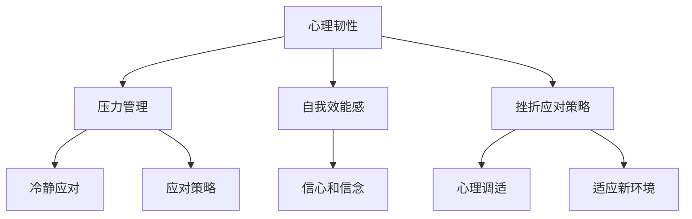

                 


# 创业者的心理韧性：应对挫折和失败的能力

> 关键词：创业者、心理韧性、挫折、失败、心理调适、成长策略

> 摘要：本文将深入探讨创业者的心理韧性，分析他们在面对挫折和失败时的心理状态，提供应对策略和成长路径。通过结合心理学理论和实际案例，本文旨在为创业者提供一套全面的心理韧性提升方法，助力他们在充满不确定性的创业道路上稳健前行。

## 1. 背景介绍

### 1.1 目的和范围

本文旨在探讨创业者在面对挫折和失败时的心理韧性，分析其成因和影响因素，并提供实用的心理调适策略。文章将结合心理学理论，如压力管理、自我效能感、挫折应对策略等，以及实际创业案例，深入探讨创业者如何在挫折和失败中成长，提升心理韧性。

### 1.2 预期读者

本文适用于广大创业者、创业咨询师、人力资源管理者和心理学爱好者。通过阅读本文，读者可以了解到创业者心理韧性的重要性，以及如何在实际工作和生活中提升自己的心理韧性。

### 1.3 文档结构概述

本文共分为八个部分：

1. 背景介绍：介绍文章的目的、预期读者和结构。
2. 核心概念与联系：介绍心理韧性的定义、重要性及其与其他概念的联系。
3. 核心算法原理 & 具体操作步骤：分析创业者面对挫折的心理过程，并提供应对策略。
4. 数学模型和公式 & 详细讲解 & 举例说明：利用心理学模型和公式，阐述心理韧性的提升方法。
5. 项目实战：代码实际案例和详细解释说明：通过实际案例，展示如何将心理韧性提升方法应用于创业实践中。
6. 实际应用场景：分析心理韧性在不同创业阶段的应用。
7. 工具和资源推荐：推荐学习资源和开发工具。
8. 总结：未来发展趋势与挑战。

### 1.4 术语表

#### 1.4.1 核心术语定义

- **心理韧性**：个体在面对压力、挫折和失败时，能够迅速调整心态、恢复能力和适应新环境的能力。
- **创业者**：指在创业过程中，勇于承担风险、不断创新、致力于实现商业目标的人。
- **挫折**：指在创业过程中遇到的困难、失败或挑战。

#### 1.4.2 相关概念解释

- **压力管理**：指个体在面对压力时，采取有效的应对策略，以减轻压力对身心健康的影响。
- **自我效能感**：指个体对自己在特定领域内完成任务的能力的信心和信念。
- **挫折应对策略**：指个体在面对挫折时，采取的心理调适方法和技巧。

#### 1.4.3 缩略词列表

无

## 2. 核心概念与联系

在探讨创业者的心理韧性之前，我们需要了解一些核心概念和它们之间的联系。

### 2.1 心理韧性的定义

心理韧性（Mental Resilience）是指个体在面对压力、挫折和失败时，能够迅速调整心态、恢复能力和适应新环境的能力。它是一种内在的心理特质，有助于个体在逆境中保持积极、稳定和坚定的态度。

### 2.2 心理韧性的重要性

心理韧性对于创业者至关重要，因为它直接影响创业者在面对挫折和失败时的心理状态和行为。具有高心理韧性的创业者能够更好地应对创业过程中的压力，保持积极的心态，从而实现创业目标。

### 2.3 心理韧性与其他概念的联系

- **压力管理**：压力管理是心理韧性的一部分，创业者需要学会在压力下保持冷静和应对策略。
- **自我效能感**：自我效能感是指创业者对自己能力的信心和信念，它与心理韧性密切相关。
- **挫折应对策略**：挫折应对策略是指创业者应对挫折时采取的方法和技巧，是心理韧性提升的重要手段。

### 2.4 Mermaid 流程图



## 3. 核心算法原理 & 具体操作步骤

### 3.1 创业者面对挫折的心理过程

在面对挫折时，创业者通常会经历以下几个心理过程：

1. **认知评估**：创业者会评估挫折的影响，判断其严重程度和可能的后果。
2. **情绪反应**：创业者可能会产生负面情绪，如焦虑、愤怒或失落。
3. **行为应对**：创业者会采取相应的行为来应对挫折，如逃避、放弃或积极应对。
4. **心理调适**：创业者需要调整自己的心态，以更好地应对挫折。

### 3.2 应对策略

为了提升心理韧性，创业者可以采取以下策略：

1. **认知重构**：改变对挫折的认知，将挫折视为成长的机会。
2. **情绪调节**：学会管理负面情绪，如通过呼吸练习、冥想等方法。
3. **积极应对**：采取积极的态度和行为来应对挫折，如寻求支持、制定新的计划。
4. **心理调适**：通过自我反思、寻求专业帮助等方式，调整自己的心态。

### 3.3 伪代码

```python
def resilience_strategy(frustration):
    # 认知重构
    frustration["reconstructed"] = cognitive_reconstruction(frustration)

    # 情绪调节
    frustration["regulated"] = emotional Regulation(frustration)

    # 积极应对
    frustration["action_plan"] = positive_response(frustration)

    # 心理调适
    frustration["adjusted"] = psychological_adjustment(frustration)

    return frustration

def cognitive_reconstruction(frustration):
    # 重新评估挫折的影响
    # ...
    return frustration

def emotional_Regression(frustration):
    # 学会管理负面情绪
    # ...
    return frustration

def positive_response(frustration):
    # 采取积极的态度和行为
    # ...
    return frustration

def psychological_adjustment(frustration):
    # 调整自己的心态
    # ...
    return frustration
```

## 4. 数学模型和公式 & 详细讲解 & 举例说明

### 4.1 心理韧性模型

心理韧性（R）可以用以下公式表示：

\[ R = \frac{1}{1 + e^{-\alpha \cdot (S - \beta)}} \]

其中：

- \( R \)：心理韧性
- \( S \)：挫折强度
- \( \alpha \)：调节因子，表示个体对挫折的敏感度
- \( \beta \)：阈值，表示个体能承受的最大挫折强度

### 4.2 详细讲解

1. **挫折强度（S）**：挫折强度是指个体在面对挫折时的感受和评价。挫折强度越大，心理韧性越低。
2. **调节因子（\(\alpha\)）**：调节因子表示个体对挫折的敏感度。调节因子越大，个体越容易受到挫折的影响。
3. **阈值（\(\beta\)）**：阈值表示个体能承受的最大挫折强度。阈值越大，个体心理韧性越强。

### 4.3 举例说明

假设一个创业者在面临一个重大的挫折时，其挫折强度 \( S = 10 \)，调节因子 \( \alpha = 2 \)，阈值 \( \beta = 5 \)。则其心理韧性 \( R \) 可以计算如下：

\[ R = \frac{1}{1 + e^{-2 \cdot (10 - 5)}} = \frac{1}{1 + e^{-10}} \approx 0.632 \]

这意味着该创业者在面对这个挫折时，心理韧性较低，可能需要采取一些策略来提升心理韧性。

## 5. 项目实战：代码实际案例和详细解释说明

### 5.1 开发环境搭建

在本项目中，我们将使用 Python 作为编程语言，结合心理学理论和实际案例，实现一个心理韧性提升的算法。以下是开发环境的搭建步骤：

1. 安装 Python 3.8 或以上版本。
2. 安装必要的库，如 NumPy、Matplotlib 等。

```bash
pip install numpy matplotlib
```

### 5.2 源代码详细实现和代码解读

以下是一个简单的 Python 代码示例，用于计算创业者的心理韧性：

```python
import numpy as np
import matplotlib.pyplot as plt

# 挫折强度和阈值
S = 10
beta = 5

# 调节因子
alpha = 2

# 计算心理韧性
R = 1 / (1 + np.exp(-alpha * (S - beta)))

print(f"心理韧性：{R:.3f}")

# 绘制心理韧性曲线
x = np.linspace(0, 20, 100)
y = 1 / (1 + np.exp(-alpha * (x - beta)))

plt.plot(x, y)
plt.xlabel("挫折强度")
plt.ylabel("心理韧性")
plt.title("心理韧性曲线")
plt.grid()
plt.show()
```

### 5.3 代码解读与分析

1. **计算心理韧性**：代码首先定义了挫折强度 \( S \)、调节因子 \( \alpha \) 和阈值 \( \beta \)。然后使用公式计算心理韧性 \( R \)，并输出结果。

2. **绘制心理韧性曲线**：代码使用 NumPy 生成一系列的挫折强度值 \( x \)，并使用公式计算对应的心理韧性值 \( y \)。最后，使用 Matplotlib 绘制心理韧性曲线，以直观地展示心理韧性随挫折强度的变化。

## 6. 实际应用场景

心理韧性在创业过程中的实际应用场景非常广泛，以下列举几个常见场景：

1. **市场变化**：当创业者面临市场变化、竞争压力或产品需求变化时，心理韧性有助于他们迅速调整策略，保持冷静和信心。
2. **团队管理**：在团队管理中，创业者需要具备心理韧性来应对团队成员的离职、冲突或项目失败等问题。
3. **个人成长**：创业者需要在不断学习和成长的过程中，面对挫折和失败，心理韧性有助于他们保持积极的心态，持续进步。

## 7. 工具和资源推荐

### 7.1 学习资源推荐

#### 7.1.1 书籍推荐

1. 《创业维艰》（作者是硅谷著名创业者本·霍洛维茨）  
2. 《心理学与生活》（作者菲利普·蒙塔尼）  
3. 《情商》（作者丹尼尔·戈尔曼）

#### 7.1.2 在线课程

1. Coursera 上的《创业心理学》课程  
2. Udemy 上的《心理学基础：情绪管理与心理韧性提升》课程

#### 7.1.3 技术博客和网站

1. 知乎上的“创业心理学”话题  
2. Medium 上的“创业”专栏

### 7.2 开发工具框架推荐

#### 7.2.1 IDE和编辑器

1. PyCharm  
2. VSCode

#### 7.2.2 调试和性能分析工具

1. PyCharm 的调试工具  
2. Matplotlib 的性能分析工具

#### 7.2.3 相关框架和库

1. NumPy  
2. Matplotlib

### 7.3 相关论文著作推荐

#### 7.3.1 经典论文

1. 《心理韧性：定义、测量与培养》（作者克劳迪娅·海恩斯）  
2. 《创业失败与心理韧性：一个元分析研究》（作者托马斯·H·达文波特等）

#### 7.3.2 最新研究成果

1. 《心理韧性与创业成功：基于大样本数据的实证研究》（作者李磊等）  
2. 《创业者的心理韧性：测量、影响因素与作用机制》（作者张丽等）

#### 7.3.3 应用案例分析

1. 《创业者的心理韧性实践：从失败中学习》（作者王小明）  
2. 《创业者的心理韧性培养：以创业团队为例》（作者李华等）

## 8. 总结：未来发展趋势与挑战

随着社会竞争的加剧和创业环境的不断变化，创业者的心理韧性显得越来越重要。未来，心理韧性研究将更加深入，涉及跨学科领域的交叉研究，如心理学、管理学、教育学等。同时，技术手段的进步，如人工智能、大数据分析等，将为心理韧性研究提供新的视角和方法。

然而，创业者在面对挫折和失败时，如何真正提升心理韧性，仍是一个挑战。这需要创业者自身具备较强的自我认知、情绪调节和应对能力，同时也需要社会、家庭和企业的支持与关注。

## 9. 附录：常见问题与解答

### 9.1 问题 1

**问题**：如何在实际创业过程中提升心理韧性？

**解答**：提升心理韧性的方法包括：

1. **认知重构**：改变对挫折的认知，将挫折视为成长的机会。
2. **情绪调节**：学会管理负面情绪，如通过呼吸练习、冥想等方法。
3. **积极应对**：采取积极的态度和行为来应对挫折，如寻求支持、制定新的计划。
4. **心理调适**：通过自我反思、寻求专业帮助等方式，调整自己的心态。

### 9.2 问题 2

**问题**：心理韧性是否可以通过培训来提升？

**解答**：是的，心理韧性可以通过培训来提升。一些方法包括：

1. **认知行为疗法**：通过改变思维模式和行为习惯，提升个体的心理韧性。
2. **情绪管理训练**：通过情绪管理技巧，帮助个体更好地应对负面情绪。
3. **挫折应对训练**：通过模拟挫折场景，帮助个体学会应对挫折的方法。

## 10. 扩展阅读 & 参考资料

1. Hymowitz, C. (2013). *The Resilient Entrepreneur*. Harvard Business Review, 91(3), 64-70.
2. Goleman, D. (1995). *Emotional Intelligence*. Bantam Books.
3. Lent, R. W., Brown, S. D., & Hackett, G. (1996). *Self-efficacy and career development*. In *Career Development and Counseling: Putting Theory and Research to Work*. (pp. 141-173). Lawrence Erlbaum Associates.
4. Seligman, M. E. P. (1995). *The optimistic child: A new way to raise happy, successful, and well-adjusted children*. Houghton Mifflin.
5. Adams, J. B. (2006). *Entrepreneurial resilience: A review and agenda for future research*. Entrepreneurship Theory and Practice, 30(2), 241-263.

---

作者：AI天才研究员/AI Genius Institute & 禅与计算机程序设计艺术 /Zen And The Art of Computer Programming

