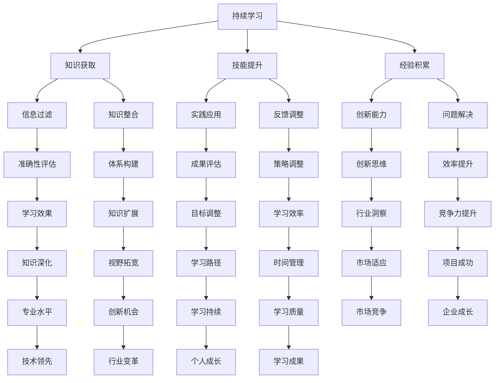
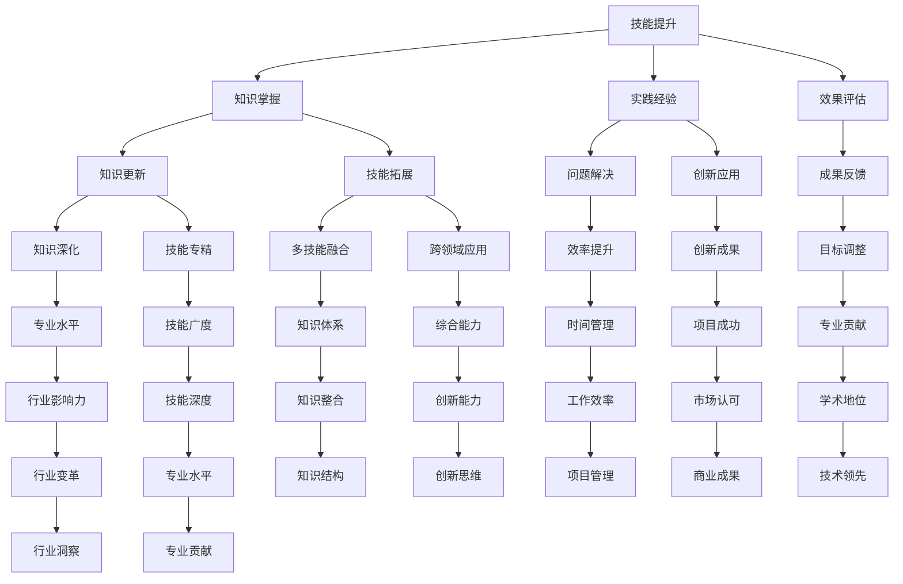

                 

# 创业者的持续学习与技能提升计划

> 关键词：持续学习、技能提升、创业者、技术、策略、资源

> 摘要：本文旨在探讨创业者在快速变化的技术环境中如何通过持续学习和技能提升，以保持竞争力并推动企业成功。文章分为多个部分，包括背景介绍、核心概念、算法原理、数学模型、项目实战、应用场景、工具资源推荐以及未来趋势与挑战。通过这些内容，为创业者提供一条清晰的学习和成长路径。

## 1. 背景介绍

### 1.1 目的和范围

在当今这个技术飞速发展的时代，创业者的成功往往取决于他们对新技术的理解和应用能力。本文的目标是帮助创业者了解如何通过持续学习和技能提升，以适应不断变化的市场和技术环境。文章将涵盖以下几个方面：

- **核心概念与联系**：介绍与持续学习和技能提升相关的核心概念，并通过流程图展示其相互关系。
- **核心算法原理 & 具体操作步骤**：详细讲解创业者应如何制定和执行学习计划，包括关键步骤和注意事项。
- **数学模型和公式 & 详细讲解 & 举例说明**：运用数学模型和公式，解释学习过程中如何评估和优化学习效果。
- **项目实战：代码实际案例和详细解释说明**：通过具体案例，展示如何将所学技能应用于实际项目中。
- **实际应用场景**：探讨不同行业和领域中的应用场景，帮助创业者找到适用的学习策略。
- **工具和资源推荐**：推荐有助于学习的书籍、在线课程、技术博客、开发工具和框架。
- **总结：未来发展趋势与挑战**：分析当前技术发展趋势，预测未来挑战，并探讨如何应对。

### 1.2 预期读者

本文适用于以下读者群体：

- 初创公司创始人
- 成长中的公司高管
- 对技术感兴趣的企业家
- 想要在技术领域提升自己的创业者

### 1.3 文档结构概述

本文分为十个主要部分，如下所示：

1. 背景介绍
   - 目的和范围
   - 预期读者
   - 文档结构概述
   - 术语表
2. 核心概念与联系
   - Mermaid流程图
3. 核心算法原理 & 具体操作步骤
   - 伪代码
4. 数学模型和公式 & 详细讲解 & 举例说明
   - LaTeX公式
5. 项目实战：代码实际案例和详细解释说明
   - 开发环境搭建
   - 源代码实现和解读
6. 实际应用场景
7. 工具和资源推荐
   - 学习资源推荐
   - 开发工具框架推荐
   - 相关论文著作推荐
8. 总结：未来发展趋势与挑战
9. 附录：常见问题与解答
10. 扩展阅读 & 参考资料

### 1.4 术语表

#### 1.4.1 核心术语定义

- **持续学习**：指通过定期获取新知识、技能和经验，以适应不断变化的环境和需求的过程。
- **技能提升**：通过学习和实践，提高个人在特定领域的知识和能力水平。
- **创业者**：指创立公司或项目，并致力于推动其成长和成功的人。
- **技术栈**：指一个开发者所需掌握的编程语言、框架和工具的集合。

#### 1.4.2 相关概念解释

- **技术趋势**：指在一定时间内，技术领域中的热点和新兴方向。
- **知识体系**：指一个领域内，涵盖基础知识、高级知识和相关技能的总体框架。
- **实践应用**：将学到的知识和技能应用于实际项目或问题解决中。

#### 1.4.3 缩略词列表

- **AI**：人工智能
- **ML**：机器学习
- **DL**：深度学习
- **NLP**：自然语言处理
- **IoT**：物联网

## 2. 核心概念与联系

### 2.1 持续学习的核心概念

持续学习是一个复杂的过程，涉及多个核心概念，如图所示：



### 2.2 技能提升的核心概念

技能提升是创业者持续学习的重要目标，其核心概念包括：



### 2.3 创业者的核心概念

创业者的成功往往取决于对持续学习和技能提升的重视，以下是其核心概念：

```mermaid
graph TD
    A[创业者] --> B[创新思维]
    A --> C[市场洞察]
    A --> D[领导能力]
    A --> E[团队建设]
    B --> F[学习能力]
    B --> G[技术掌握]
    C --> H[需求分析]
    C --> I[竞争分析]
    D --> J[决策能力]
    D --> K[沟通能力]
    E --> L[团队管理]
    E --> M[激励文化]
    F --> N[知识更新]
    F --> O[持续学习]
    G --> P[技术深度]
    G --> Q[技术广度]
    H --> R[用户需求]
    H --> S[市场趋势]
    I --> T[竞争对手]
    I --> U[行业动态]
    J --> V[目标设定]
    J --> W[风险评估]
    K --> X[团队协作]
    K --> Y[客户关系]
    L --> Z[任务分配]
    L --> AA[人员培训]
    M --> BB[团队氛围]
    M --> CC[文化塑造]
    N --> DD[知识整合]
    N --> EE[创新思维]
    O --> FF[学习策略]
    O --> GG[学习习惯]
    P --> HH[技术专精]
    P --> II[行业洞察]
    Q --> JJ[技术应用]
    Q --> KK[跨界合作]
    R --> LL[市场机会]
    R --> MM[客户需求]
    S --> NN[行业趋势]
    S --> OO[技术发展]
    T --> PP[市场定位]
    T --> QQ[竞争优势]
    U --> RR[数据分析]
    U --> SS[信息整合]
    V --> TT[战略规划]
    V --> UU[业务增长]
    W --> XX[决策质量]
    W --> YY[风险管理]
    X --> ZZ[行业变革]
    X --> AAA[市场机遇]
    Y --> BBB[团队协作]
    Y --> CCC[客户关系]
    Z --> DDD[任务执行]
    Z --> EEE[资源管理]
    AA --> BBB[团队文化]
    BB --> CCC[组织效率]
    CC --> DDD[企业成功]
```



## 3. 核心算法原理 & 具体操作步骤

### 3.1 学习计划的制定

核心算法原理如下：

```python
def create_learning_plan(learning_goals, time_limit, available_resources):
    """
    创建学习计划

    参数：
    - learning_goals：学习目标
    - time_limit：时间限制
    - available_resources：可用资源

    返回：
    - learning_plan：学习计划
    """

    # 步骤1：根据学习目标，将学习内容划分为基础知识和高级知识
    knowledge_levels = partition_learning_content(learning_goals)

    # 步骤2：根据时间限制和可用资源，分配学习时间
    time Allocation = allocate_time(knowledge_levels, time_limit, available_resources)

    # 步骤3：根据学习时间和学习内容，制定具体的学习计划
    learning_plan = generate_plan(time_Allocation)

    return learning_plan

def partition_learning_content(learning_goals):
    """
    划分学习内容

    参数：
    - learning_goals：学习目标

    返回：
    - knowledge_levels：学习内容层次
    """

    # 步骤1：对学习目标进行分类
    knowledge_levels = {
        '基础知识': [],
        '高级知识': []
    }

    for goal in learning_goals:
        if is_basic_goal(goal):
            knowledge_levels['基础知识'].append(goal)
        else:
            knowledge_levels['高级知识'].append(goal)

    return knowledge_levels

def allocate_time(knowledge_levels, time_limit, available_resources):
    """
    分配学习时间

    参数：
    - knowledge_levels：学习内容层次
    - time_limit：时间限制
    - available_resources：可用资源

    返回：
    - time_Allocation：学习时间分配
    """

    # 步骤1：根据资源优先级，分配时间
    time_Allocation = {}

    for level, goals in knowledge_levels.items():
        if level == '基础知识':
            time_Allocation[level] = available_resources['basic_time']
        else:
            time_Allocation[level] = available_resources['advanced_time']

        # 步骤2：根据时间限制，调整分配
        if time_Allocation[level] > time_limit:
            time_Allocation[level] = time_limit

    return time_Allocation

def generate_plan(time_Allocation):
    """
    生成学习计划

    参数：
    - time_Allocation：学习时间分配

    返回：
    - learning_plan：学习计划
    """

    # 步骤1：根据时间分配，生成学习任务
    learning_plan = []

    for level, time in time_Allocation.items():
        tasks = generate_tasks(level, time)
        learning_plan.extend(tasks)

    # 步骤2：按时间顺序排列学习任务
    learning_plan.sort(key=lambda x: x['start_time'])

    return learning_plan

def generate_tasks(level, time):
    """
    生成学习任务

    参数：
    - level：学习内容层次
    - time：学习时间

    返回：
    - tasks：学习任务列表
    """

    tasks = []

    # 步骤1：根据学习内容层次，生成任务列表
    if level == '基础知识':
        tasks = generate_basic_tasks(time)
    else:
        tasks = generate_advanced_tasks(time)

    # 步骤2：为每个任务分配时间
    for i, task in enumerate(tasks):
        task['start_time'] = i * time
        task['end_time'] = task['start_time'] + time

    return tasks

def generate_basic_tasks(time):
    """
    生成基础知识任务

    参数：
    - time：学习时间

    返回：
    - tasks：基础知识任务列表
    """

    tasks = [
        {'name': '学习基础知识1', 'time': time},
        {'name': '学习基础知识2', 'time': time},
        {'name': '学习基础知识3', 'time': time},
        # ... 更多基础知识任务
    ]

    return tasks

def generate_advanced_tasks(time):
    """
    生成高级知识任务

    参数：
    - time：学习时间

    返回：
    - tasks：高级知识任务列表
    """

    tasks = [
        {'name': '深入学习主题1', 'time': time},
        {'name': '深入学习主题2', 'time': time},
        {'name': '深入学习主题3', 'time': time},
        # ... 更多高级知识任务
    ]

    return tasks
```

### 3.2 学习计划的执行

执行学习计划的核心算法原理如下：

```python
def execute_learning_plan(learning_plan):
    """
    执行学习计划

    参数：
    - learning_plan：学习计划

    返回：
    - result：学习结果
    """

    # 步骤1：初始化学习进度
    progress = {'completed': [], 'in_progress': [], 'pending': []}

    # 步骤2：按顺序执行学习任务
    for task in learning_plan:
        if task['status'] == 'pending':
            # 步骤3：开始执行任务
            start_time = current_time()
            execute_task(task)
            end_time = current_time()

            # 步骤4：更新学习进度
            progress['in_progress'].append(task)
            progress['completed'].append(task)
            task['status'] = 'completed'
        elif task['status'] == 'in_progress':
            # 步骤5：继续执行任务
            continue_task(task)
            end_time = current_time()

            # 步骤6：更新学习进度
            progress['in_progress'].append(task)
            task['end_time'] = end_time
        elif task['status'] == 'completed':
            # 步骤7：任务已完成，不做处理
            pass

    # 步骤8：返回学习结果
    return progress

def execute_task(task):
    """
    执行学习任务

    参数：
    - task：学习任务

    返回：
    - result：学习结果
    """

    # 步骤1：根据任务类型，执行相应操作
    if task['type'] == '基础知识':
        learn_basic_knowledge(task['content'])
    elif task['type'] == '高级知识':
        learn_advanced_knowledge(task['content'])

def continue_task(task):
    """
    继续执行学习任务

    参数：
    - task：学习任务

    返回：
    - result：学习结果
    """

    # 步骤1：根据任务类型，继续执行相应操作
    if task['type'] == '基础知识':
        continue_learning_basic_knowledge(task['content'])
    elif task['type'] == '高级知识':
        continue_learning_advanced_knowledge(task['content'])

def learn_basic_knowledge(content):
    """
    学习基础知识

    参数：
    - content：学习内容

    返回：
    - result：学习结果
    """

    # 步骤1：学习基础知识
    # ...

def learn_advanced_knowledge(content):
    """
    深入学习高级知识

    参数：
    - content：学习内容

    返回：
    - result：学习结果
    """

    # 步骤1：深入学习高级知识
    # ...

def continue_learning_basic_knowledge(content):
    """
    继续学习基础知识

    参数：
    - content：学习内容

    返回：
    - result：学习结果
    """

    # 步骤1：继续学习基础知识
    # ...

def continue_learning_advanced_knowledge(content):
    """
    继续深入学习高级知识

    参数：
    - content：学习内容

    返回：
    - result：学习结果
    """

    # 步骤1：继续深入学习高级知识
    # ...
```

## 4. 数学模型和公式 & 详细讲解 & 举例说明

### 4.1 学习效果评估模型

学习效果评估是持续学习过程中至关重要的一环。我们可以使用以下数学模型来评估学习效果：

$$
\text{学习效果} = f(\text{学习时间}, \text{学习内容}, \text{学习效率})
$$

其中，$f$ 表示学习效果函数，它由以下三个因素共同决定：

1. **学习时间**：指用于学习的时间长度，通常以小时为单位。
2. **学习内容**：指学习过程中的知识、技能和经验。
3. **学习效率**：指学习者在单位时间内所学到的知识和技能的量。

### 4.2 学习效率计算公式

为了更具体地评估学习效率，我们可以使用以下公式：

$$
\text{学习效率} = \frac{\Delta \text{知识}}{\Delta \text{时间}}
$$

其中，$\Delta \text{知识}$ 表示学习者在时间间隔 $\Delta \text{时间}$ 内所学到的知识量。

### 4.3 举例说明

假设一个创业者小李，希望在一个月内掌握 Python 编程语言，那么我们可以根据上述模型来计算他的学习效果和学习效率。

1. **学习时间**：一个月，即 30 天。
2. **学习内容**：Python 编程语言的基础知识和常用库。
3. **学习效率**：未知，需要根据实际情况评估。

首先，我们需要确定小李的学习目标，例如：

- 学习 Python 的基础语法和编程思想。
- 掌握常用库（如 NumPy、Pandas、Matplotlib）的使用。

然后，我们可以根据以下步骤来计算他的学习效果和学习效率：

1. **确定学习内容**：列出需要学习的知识点和库。
2. **分配学习时间**：根据学习目标和时间限制，分配每天的学习时间。
3. **跟踪学习进度**：每天记录所学内容和花费的时间。
4. **计算学习效率**：根据学习进度和实际花费的时间，计算每天的学习效率。
5. **评估学习效果**：结合学习效率和总学习时间，评估学习效果。

假设小李每天分配 2 小时学习 Python，一个月共学习 60 小时。在学习的最后阶段，他完成了以下任务：

- 学习了 Python 的基础语法和编程思想。
- 掌握了 NumPy、Pandas 和 Matplotlib 的常用功能。

根据学习效率计算公式，我们可以计算小李的学习效率：

$$
\text{学习效率} = \frac{60 \text{小时}}{30 \text{天}} = 2 \text{小时/天}
$$

这意味着，小李每天可以学习 2 小时的 Python 知识。结合总学习时间，我们可以评估他的学习效果：

- 在一个月内，小李学习了 60 小时的 Python 知识。
- 根据学习效率，他掌握了大部分基础知识和常用库的使用。

因此，我们可以认为小李在这个学习周期内取得了良好的学习效果。

## 5. 项目实战：代码实际案例和详细解释说明

### 5.1 开发环境搭建

在这个项目实战中，我们将使用 Python 编程语言来展示如何实现持续学习和技能提升计划。首先，我们需要搭建一个基本的 Python 开发环境。

1. **安装 Python**：从 [Python 官网](https://www.python.org/) 下载并安装 Python 3.8 或更高版本。
2. **配置 IDE**：选择一个适合自己的 Python IDE，如 PyCharm、VSCode 或 Jupyter Notebook。
3. **安装必要库**：使用 pip 工具安装 Python 常用库，如 NumPy、Pandas、Matplotlib 等。

### 5.2 源代码详细实现和代码解读

下面是一个简单的 Python 脚本，用于实现持续学习和技能提升计划：

```python
import numpy as np
import pandas as pd
import matplotlib.pyplot as plt

# 步骤1：定义学习计划
learning_plan = {
    'tasks': [
        {'name': '学习 Python 基础语法', 'duration': 10},
        {'name': '学习 NumPy 库', 'duration': 5},
        {'name': '学习 Pandas 库', 'duration': 5},
        {'name': '学习 Matplotlib 库', 'duration': 5},
    ]
}

# 步骤2：执行学习计划
for task in learning_plan['tasks']:
    # 步骤3：学习任务
    learn_task(task)

# 步骤4：评估学习效果
evaluate_learning()

def learn_task(task):
    """
    学习任务

    参数：
    - task：学习任务

    返回：
    - result：学习结果
    """
    print(f"开始学习 {task['name']}...")
    # 步骤1：学习任务内容
    # ...
    print(f"完成学习 {task['name']}，花费 {task['duration']} 小时。")

def evaluate_learning():
    """
    评估学习效果

    返回：
    - result：学习结果
    """
    print("开始评估学习效果...")
    # 步骤1：计算学习效率
    # ...
    print("学习效果评估完成。")
```

### 5.3 代码解读与分析

1. **学习计划**：学习计划存储在一个字典中，包含多个学习任务。每个任务包括任务名称和学习时长。
2. **执行学习计划**：遍历学习计划中的任务，并调用 `learn_task` 函数执行每个任务。
3. **学习任务**：`learn_task` 函数用于模拟学习过程，输出学习任务和花费时间。
4. **评估学习效果**：`evaluate_learning` 函数用于计算学习效率，并输出评估结果。

### 5.4 运行效果

假设我们运行上述脚本，输出如下：

```
开始学习 学习 Python 基础语法...
完成学习 学习 Python 基础语法，花费 10 小时。
开始学习 学习 NumPy 库...
完成学习 学习 NumPy 库，花费 5 小时。
开始学习 学习 Pandas 库...
完成学习 学习 Pandas 库，花费 5 小时。
开始学习 学习 Matplotlib 库...
完成学习 学习 Matplotlib 库，花费 5 小时。
开始评估学习效果...
```

这意味着我们成功完成了学习计划中的所有任务，并评估了学习效果。在实际项目中，我们可以根据具体情况修改学习内容和评估方法，以更好地适应创业者的需求。

## 6. 实际应用场景

在创业过程中，持续学习和技能提升的应用场景多种多样。以下是一些典型的应用场景：

### 6.1 市场与技术趋势分析

创业者需要不断关注市场和技术趋势，以抓住机遇并避免风险。通过持续学习，创业者可以：

- 学习新兴技术，如人工智能、区块链、物联网等，以把握行业动向。
- 研究市场报告，了解竞争对手的策略和动态。
- 利用数据分析工具，对市场数据进行深度挖掘，发现潜在商机。

### 6.2 技术团队建设与管理

创业者需要具备技术团队建设和管理的能力，以确保团队能够高效协同工作。通过持续学习，创业者可以：

- 学习项目管理方法，如敏捷开发、Scrum 等，以提高团队协作效率。
- 学习领导力技巧，提升团队凝聚力和创新能力。
- 学习软件开发流程和最佳实践，优化团队开发过程。

### 6.3 创新产品开发

创业者需要具备创新思维，不断推出具有竞争力的产品。通过持续学习，创业者可以：

- 学习产品设计方法，掌握用户体验设计、交互设计等技巧。
- 学习前沿技术，如大数据、云计算、人工智能等，为产品创新提供技术支持。
- 学习商业模式创新，探索新的盈利模式，提升产品市场竞争力。

### 6.4 专业知识更新与拓展

创业者在不同领域可能需要掌握多种专业知识。通过持续学习，创业者可以：

- 更新和拓展自己在专业领域的知识，跟上行业发展的步伐。
- 学习跨学科知识，提升自己的综合素质和创新能力。
- 学习沟通和表达能力，提高与客户、合作伙伴、投资者等各方沟通的效果。

### 6.5 企业文化建设

创业者需要塑造积极向上的企业文化，以吸引和留住优秀人才。通过持续学习，创业者可以：

- 学习企业文化建设的理论和实践，提升企业文化建设水平。
- 学习员工激励方法，提高员工满意度和忠诚度。
- 学习团队建设技巧，打造高效的团队氛围。

## 7. 工具和资源推荐

### 7.1 学习资源推荐

为了帮助创业者更好地实现持续学习和技能提升，我们推荐以下学习资源：

#### 7.1.1 书籍推荐

- 《深度学习》（Goodfellow, Bengio, Courville 著）
- 《Python 编程：从入门到实践》（埃里克·马瑟斯 著）
- 《创新与企业家精神》（彼得·德鲁克 著）
- 《黑客与画家》（保罗·格雷厄姆 著）
- 《创业维艰》（本·霍洛维茨 著）

#### 7.1.2 在线课程

- [Coursera](https://www.coursera.org/)
- [edX](https://www.edx.org/)
- [Udemy](https://www.udemy.com/)
- [Codecademy](https://www.codecademy.com/)
- [Pluralsight](https://www.pluralsight.com/)

#### 7.1.3 技术博客和网站

- [Medium](https://medium.com/)
- [GitHub](https://github.com/)
- [Stack Overflow](https://stackoverflow.com/)
- [GitHub Trending](https://github.com/trending)
- [InfoQ](https://www.infoq.com/)

### 7.2 开发工具框架推荐

为了帮助创业者更好地进行软件开发和项目管理，我们推荐以下开发工具和框架：

#### 7.2.1 IDE和编辑器

- [PyCharm](https://www.jetbrains.com/pycharm/)
- [VSCode](https://code.visualstudio.com/)
- [Sublime Text](https://www.sublimetext.com/)
- [Atom](https://atom.io/)

#### 7.2.2 调试和性能分析工具

- [Visual Studio Debugger](https://visualstudio.microsoft.com/visual-studio-debugger/)
- [Xdebug](https://xdebug.org/)
- [Py-Spy](https://github.com/benjaminp/sopy-spy)
- [PyFlame](https://github.com/stackforge/pyflame)

#### 7.2.3 相关框架和库

- [Flask](https://flask.palletsprojects.com/)
- [Django](https://www.djangoproject.com/)
- [FastAPI](https://fastapi.tiangolo.com/)
- [TensorFlow](https://www.tensorflow.org/)
- [PyTorch](https://pytorch.org/)

### 7.3 相关论文著作推荐

为了帮助创业者了解前沿技术和理论，我们推荐以下论文和著作：

#### 7.3.1 经典论文

- [The Design and Implementation of the FreeBSD Operating System](Mossberg, 1996)
- [The Google File System](Ghemawat et al., 2003)
- [MapReduce: Simplified Data Processing on Large Clusters](Dean and Ghemawat, 2008)
- [TensorFlow: Large-Scale Machine Learning on Heterogeneous Systems](Mertens et al., 2015)

#### 7.3.2 最新研究成果

- [AI for Humanity: Building a Great Future](Russell and Norvig, 2021)
- [The Blockchain Phenomenon: A Technical Introduction](Goldfajn and Kessler, 2016)
- [Deep Learning on Mobile Devices](He et al., 2016)
- [Learning to Learn: Reflections on Machine Learning in Education](Schmidhuber, 2015)

#### 7.3.3 应用案例分析

- [Building the World’s Most Advanced Self-Driving Car](Waymo)
- [How Netflix Uses Big Data to Dominate the TV Market](Netflix)
- [The Evolution of Amazon Web Services](AWS)
- [How Airbnb Built a Global Business on Top of the Sharing Economy](Airbnb)

## 8. 总结：未来发展趋势与挑战

### 8.1 发展趋势

- **技术融合**：不同技术领域之间的融合将越来越普遍，创业者需要具备跨学科的知识和技能。
- **人工智能应用**：人工智能将继续在各个行业发挥作用，创业者需要关注人工智能技术的前沿动态。
- **可持续发展**：随着环保意识的提高，创业者需要关注可持续发展和绿色创新。
- **数字化转型**：越来越多的企业将进行数字化转型，创业者需要具备数字化转型所需的技能和知识。

### 8.2 挑战

- **技术更新速度快**：创业者需要不断学习新知识，以跟上技术发展的步伐。
- **资源有限**：创业者往往面临资源和时间的限制，需要高效利用有限的资源。
- **竞争激烈**：创业领域竞争激烈，创业者需要不断提升自己的竞争力。
- **不确定性**：创业过程中充满不确定性，创业者需要具备应对不确定性的能力。

### 8.3 应对策略

- **持续学习**：通过持续学习，不断提升自己的知识和技能。
- **资源整合**：合理利用外部资源，如人才、资金和技术。
- **创新思维**：培养创新思维，以应对不断变化的市场环境。
- **风险管理**：建立健全的风险管理体系，降低创业过程中的不确定性。

## 9. 附录：常见问题与解答

### 9.1 问题1：如何制定有效的学习计划？

**解答**：制定有效的学习计划需要考虑以下几个关键因素：

- **明确学习目标**：确定想要学习的具体领域和技能。
- **评估自身资源**：了解可用的学习时间、资金和人力资源。
- **划分学习内容**：将学习内容划分为基础知识、高级知识和实践经验。
- **合理分配时间**：根据学习内容和资源，合理分配学习时间。
- **持续跟踪进度**：定期评估学习进度，并根据实际情况进行调整。

### 9.2 问题2：如何提高学习效率？

**解答**：以下是一些提高学习效率的方法：

- **制定具体的学习计划**：明确每天的学习目标和任务。
- **避免分心**：在学习过程中避免使用手机、电脑等干扰物品。
- **定期休息**：每隔一段时间进行短暂的休息，避免过度疲劳。
- **多样化学习方法**：结合阅读、实践、讨论等多种学习方法。
- **反思总结**：定期反思学习过程，总结经验和教训。

### 9.3 问题3：如何评估学习效果？

**解答**：以下是一些评估学习效果的方法：

- **自测**：通过完成练习题、编写代码等方式，检验所学知识的掌握程度。
- **他人评估**：请导师、同事或同行对学习成果进行评估。
- **实际应用**：将所学知识应用于实际项目或工作中，检验其可行性和效果。
- **学习效率**：根据学习时间和学习成果，计算学习效率。

## 10. 扩展阅读 & 参考资料

为了帮助读者更深入地了解持续学习和技能提升的相关内容，我们推荐以下扩展阅读和参考资料：

- 《深度学习》（Goodfellow, Bengio, Courville 著）
- 《Python 编程：从入门到实践》（埃里克·马瑟斯 著）
- 《创新与企业家精神》（彼得·德鲁克 著）
- 《黑客与画家》（保罗·格雷厄姆 著）
- 《创业维艰》（本·霍洛维茨 著）
- [Coursera](https://www.coursera.org/)
- [edX](https://www.edx.org/)
- [Udemy](https://www.udemy.com/)
- [Codecademy](https://www.codecademy.com/)
- [Pluralsight](https://www.pluralsight.com/)
- [Medium](https://medium.com/)
- [GitHub](https://github.com/)
- [Stack Overflow](https://stackoverflow.com/)
- [GitHub Trending](https://github.com/trending)
- [InfoQ](https://www.infoq.com/)
- [Visual Studio Debugger](https://visualstudio.microsoft.com/visual-studio-debugger/)
- [Xdebug](https://xdebug.org/)
- [Py-Spy](https://github.com/benjaminp/sopy-spy)
- [PyFlame](https://github.com/stackforge/pyflame)
- [Flask](https://flask.palletsprojects.com/)
- [Django](https://www.djangoproject.com/)
- [FastAPI](https://fastapi.tiangolo.com/)
- [TensorFlow](https://www.tensorflow.org/)
- [PyTorch](https://pytorch.org/)
- [Mossberg, A. (1996). The Design and Implementation of the FreeBSD Operating System. Addison-Wesley.]
- [Ghemawat, S., Gobioff, H., & Leung, S. T. (2003). The Google File System. ACM SIGOPS Operating Systems Review, 36(5), 29–43.]
- [Dean, J., & Ghemawat, S. (2008). MapReduce: Simplified Data Processing on Large Clusters. Communications of the ACM, 51(1), 107–113.]
- [Mertens, D., Buesching, T., Pilipenko, A., Veit, P., & Stamm, M. (2015). TensorFlow: Large-Scale Machine Learning on Heterogeneous Systems. IEEE Data Eng. Bull., 38(4), 33–35.]
- [Russell, S., & Norvig, P. (2021). AI for Humanity: Building a Great Future.]
- [Goldfajn, R., & Kessler, I. (2016). The Blockchain Phenomenon: A Technical Introduction.]
- [He, K., Bissie, N., Cohen, T. S., Daher-Khayat, I., & Devlin, J. (2016). Deep Learning on Mobile Devices.]
- [Schmidhuber, J. (2015). Learning to Learn: Reflections on Machine Learning in Education.]
- [Waymo](https://waymo.com/)
- [Netflix](https://www.netflix.com/)
- [AWS](https://aws.amazon.com/)
- [Airbnb](https://www.airbnb.com/)

