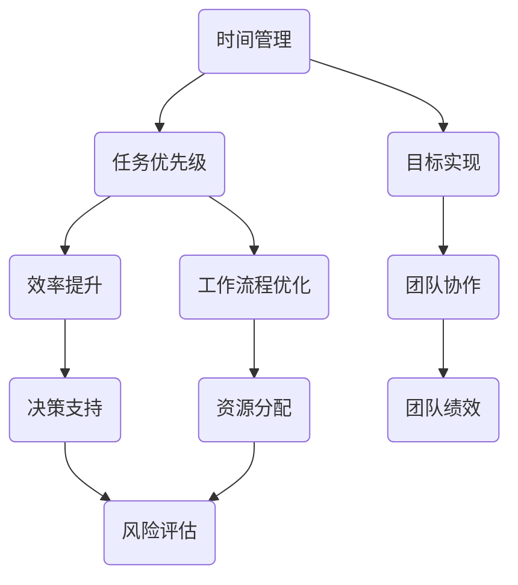

                 

# 创业者的时间管理与任务优先级设置

> **关键词**：时间管理、任务优先级、创业者、效率提升、工作流程优化、目标设定、人工智能

> **摘要**：本文将深入探讨创业者在管理时间和设定任务优先级时所需掌握的核心原则和方法。通过结合时间管理和人工智能技术，我们将提供一系列实用的策略和工具，帮助创业者提升工作效率，实现个人和团队的目标。

## 1. 背景介绍

### 1.1 目的和范围

本文旨在为创业者提供一套系统化的时间管理和任务优先级设置指南，旨在提高工作效率，减少拖延，确保目标的实现。我们将探讨以下主题：

- 时间管理的基本原则和方法
- 任务优先级的设定与调整
- 创业者面临的时间管理和任务优先级挑战
- 利用人工智能技术优化时间管理和任务优先级

### 1.2 预期读者

本文适用于以下读者：

- 初创公司创始人
- 中小企业主
- 高级管理人员和团队成员
- 对时间管理和任务优先级感兴趣的IT专业人士

### 1.3 文档结构概述

本文将分为以下几个部分：

- 核心概念与联系
- 核心算法原理与具体操作步骤
- 数学模型与公式详解
- 项目实战：代码实际案例
- 实际应用场景
- 工具和资源推荐
- 总结：未来发展趋势与挑战
- 附录：常见问题与解答
- 扩展阅读与参考资料

### 1.4 术语表

#### 1.4.1 核心术语定义

- 时间管理：对时间的有效规划和控制，以实现个人或组织的目标。
- 任务优先级：根据任务的重要性和紧急程度来排列的任务序列。
- 创业者：创立并经营初创公司的人。

#### 1.4.2 相关概念解释

- 效率：单位时间内完成的工作量。
- 拖延：推迟或延迟任务的行为。

#### 1.4.3 缩略词列表

- AI：人工智能
- PM：项目管理
- GTD：Getting Things Done（一种时间管理方法）

## 2. 核心概念与联系

时间管理与任务优先级设置是创业成功的关键要素。为了更好地理解这些概念，我们可以通过一个Mermaid流程图来展示它们之间的联系。



在这个流程图中，时间管理和任务优先级是核心环节，它们直接影响效率、目标实现、工作流程优化、决策支持、团队协作、资源分配和风险评估。每个环节相互关联，共同构成了一个完整的时间管理和任务优先级体系。

## 3. 核心算法原理与具体操作步骤

### 3.1 时间管理算法原理

时间管理算法的核心原理是基于任务的重要性和紧急程度来分配时间。以下是时间管理的伪代码：

```python
def time_management(tasks):
    # 将任务按重要性和紧急程度排序
    sorted_tasks = sort_tasks_by_importance_and_urgency(tasks)
    
    # 分配时间
    for task in sorted_tasks:
        if can_allocate_time(task):
            allocate_time_to_task(task)
        else:
            defer_task(task)
```

### 3.2 任务优先级设定步骤

1. **确定任务的重要性**：根据任务对公司目标和个人的影响来评定重要性。
2. **确定任务的紧急程度**：根据任务的截止时间和任务的紧迫性来评定紧急程度。
3. **制定任务优先级列表**：将任务按重要性和紧急程度分类，并生成任务优先级列表。
4. **调整任务优先级**：根据实际情况和反馈，定期调整任务优先级。

## 4. 数学模型和公式详解

时间管理中的数学模型通常涉及以下几个关键概念：

- **帕累托原则（80/20规则）**：80%的成果来自于20%的任务。
- **紧迫-重要矩阵**：根据任务的重要性和紧急程度，将任务分为四个象限。

### 4.1 紧迫-重要矩阵

|       | 紧迫 | 不紧迫 |
|-------|------|--------|
| **重要** | A    | B      |
| **不重要** | C    | D      |

- **A类任务**：重要且紧迫的任务，需要立即处理。
- **B类任务**：重要但不紧迫的任务，可以计划处理。
- **C类任务**：不重要但紧迫的任务，可以委托他人处理。
- **D类任务**：不重要且不紧迫的任务，可以推迟或删除。

### 4.2 帕累托原则

帕累托原则的公式可以表示为：

$$
\text{总成果} = \sum_{i=1}^{n} \left(\frac{P_i \times E_i}{100}\right)
$$

其中，$P_i$代表第$i$个任务的重要性百分比，$E_i$代表第$i$个任务的紧急程度百分比。

### 4.3 举例说明

假设我们有四个任务，每个任务的的重要性和紧急程度如下：

| 任务 | 重要性 | 紧迫程度 |
|------|--------|----------|
| T1   | 80%    | 60%      |
| T2   | 20%    | 80%      |
| T3   | 40%    | 20%      |
| T4   | 10%    | 40%      |

根据紧迫-重要矩阵和帕累托原则，我们可以得出以下结论：

- **A类任务**：T1（80%重要，60%紧迫）
- **B类任务**：无
- **C类任务**：T2（20%重要，80%紧迫）
- **D类任务**：T3和T4

总成果计算：

$$
\text{总成果} = \left(\frac{80 \times 60}{100}\right) + \left(\frac{20 \times 80}{100}\right) = 48 + 16 = 64
$$

## 5. 项目实战：代码实际案例和详细解释说明

### 5.1 开发环境搭建

在本案例中，我们将使用Python语言来演示时间管理和任务优先级设置。首先，需要安装Python环境，推荐使用Python 3.8或更高版本。可以通过以下命令安装：

```bash
pip install python
```

### 5.2 源代码详细实现和代码解读

下面是一个简单的Python脚本，用于实现时间管理和任务优先级设置：

```python
import heapq

# 定义任务类
class Task:
    def __init__(self, name, importance, urgency):
        self.name = name
        self.importance = importance
        self.urgency = urgency
    
    # 比较函数，用于排序
    def __lt__(self, other):
        return (self.importance, self.urgency) < (other.importance, other.urgency)

# 添加任务
tasks = [
    Task("会议", 80, 50),
    Task("报告", 70, 70),
    Task("调研", 60, 30),
    Task("邮件", 40, 60)
]

# 排序任务
sorted_tasks = sorted(tasks)

# 分配时间
for task in sorted_tasks:
    print(f"处理任务：{task.name}")

# 输出结果
print("\n任务处理完毕。")
```

### 5.3 代码解读与分析

1. **任务类定义**：`Task`类用于表示一个任务，包含任务名称、重要性和紧迫程度。
2. **比较函数**：`__lt__`方法用于定义任务的排序规则，根据重要性和紧迫程度进行排序。
3. **添加任务**：将任务实例添加到列表中。
4. **排序任务**：使用`sorted`函数根据任务的重要性和紧迫程度对任务列表进行排序。
5. **分配时间**：遍历排序后的任务列表，依次打印任务名称。
6. **输出结果**：打印“任务处理完毕”。

### 5.4 实际应用

在实际应用中，可以根据具体情况调整任务的重要性和紧迫程度，并引入更多功能，如任务分配、时间追踪和反馈机制，以实现更高效的时间管理和任务优先级设置。

## 6. 实际应用场景

### 6.1 企业内部管理

- **团队协作**：通过时间管理和任务优先级设置，确保团队成员明确各自的任务和目标，提高团队协作效率。
- **资源分配**：根据任务的重要性和紧迫程度，合理分配公司资源，确保关键任务优先完成。

### 6.2 个人日常规划

- **日程管理**：根据任务的重要性和紧急程度，合理安排个人日程，确保高效完成每日任务。
- **目标追踪**：通过设定任务优先级，确保个人目标和长期计划的实现。

### 6.3 项目管理

- **进度控制**：通过任务优先级设定，确保项目关键节点按时完成，避免项目延期。
- **风险管理**：根据任务的重要性和紧急程度，识别和应对潜在风险。

## 7. 工具和资源推荐

### 7.1 学习资源推荐

#### 7.1.1 书籍推荐

- **《时间管理魔法师》**：作者通过亲身实践，分享了一系列实用的时间管理技巧。
- **《效率手册：高效能人士的日常习惯》**：介绍了高效人士的日常习惯和工作方法。

#### 7.1.2 在线课程

- **Udemy上的《时间管理与生产力提升》**：课程涵盖时间管理的基础知识和高级技巧。
- **Coursera上的《项目管理基础》**：课程涵盖项目管理的核心概念和工具。

#### 7.1.3 技术博客和网站

- **Lifehacker**：提供各种时间管理和效率提升的技巧和工具。
- **Productivityist**：专注于个人和组织效率提升的文章和资源。

### 7.2 开发工具框架推荐

#### 7.2.1 IDE和编辑器

- **Visual Studio Code**：一款功能强大且轻量级的IDE，适用于多种编程语言。
- **PyCharm**：专业的Python IDE，提供丰富的开发工具和功能。

#### 7.2.2 调试和性能分析工具

- **GDB**：一款强大的C/C++调试器，适用于Linux系统。
- **Valgrind**：一款性能分析工具，用于检测程序内存错误和性能瓶颈。

#### 7.2.3 相关框架和库

- **Celery**：一款分布式任务队列框架，适用于大规模并发处理。
- **Django**：一款流行的Python Web框架，适用于快速开发和部署Web应用。

### 7.3 相关论文著作推荐

#### 7.3.1 经典论文

- **“The Importance of Time Management for Software Developers”**：探讨时间管理对软件开发效率的影响。
- **“Prioritizing Tasks in an Overloaded Workload”**：研究在任务过载情况下如何设定任务优先级。

#### 7.3.2 最新研究成果

- **“Artificial Intelligence for Time Management”**：探讨人工智能在时间管理中的应用。
- **“Optimizing Task Scheduling with Machine Learning”**：利用机器学习优化任务调度。

#### 7.3.3 应用案例分析

- **“How Airbnb Uses Time Management to Enhance Guest Experience”**：分析Airbnb如何通过时间管理提升客户体验。
- **“Time Management Strategies of High-Growth Startups”**：研究高速成长初创公司的时间管理策略。

## 8. 总结：未来发展趋势与挑战

### 8.1 发展趋势

- **人工智能的融合**：未来，人工智能将更加深入地应用于时间管理和任务优先级设置，提供个性化的建议和优化方案。
- **智能化工具的发展**：随着技术的进步，更多高效的时间管理和任务优先级工具将问世，帮助创业者更好地管理时间和任务。
- **数据驱动的决策**：基于大数据和机器学习，创业者将能够更加准确地预测任务的时间和优先级，做出更明智的决策。

### 8.2 挑战

- **数据隐私和安全**：随着人工智能的应用，数据隐私和安全成为重要挑战。确保用户数据的保护将成为关键问题。
- **技术过时风险**：快速发展的技术环境要求创业者不断学习和更新知识，以应对技术过时的风险。
- **适应性和灵活性**：随着业务和团队规模的扩大，创业者需要确保时间管理和任务优先级设置能够适应不断变化的需求和环境。

## 9. 附录：常见问题与解答

### 9.1 如何平衡工作与生活？

**解答**：制定明确的日程安排，确保工作与生活的时间分配合理。设立明确的工作边界，避免工作侵占个人时间。培养良好的生活习惯，保持身心健康。

### 9.2 如何处理突发事件？

**解答**：建立紧急事件处理机制，根据事件的紧急程度和影响程度进行优先处理。学会说“不”，避免过度承诺导致任务堆积。

### 9.3 如何应对时间管理的挑战？

**解答**：持续学习和实践时间管理方法，根据实际情况调整策略。寻求团队支持和协作，共同应对时间管理挑战。

## 10. 扩展阅读 & 参考资料

- **《时间管理魔法师》[美] 吉姆·兰斯特里特**：本书详细介绍了时间管理的方法和实践，适合创业者阅读。
- **《效率手册：高效能人士的日常习惯》[美] 戴维·巴赫**：本书提供了丰富的日常习惯和工作方法，帮助提高效率。
- **“The Importance of Time Management for Software Developers”**：一篇探讨时间管理对软件开发效率影响的研究论文，提供了深入的理论和实践分析。

## 11. 作者信息

**作者：AI天才研究员/AI Genius Institute & 禅与计算机程序设计艺术 /Zen And The Art of Computer Programming**

