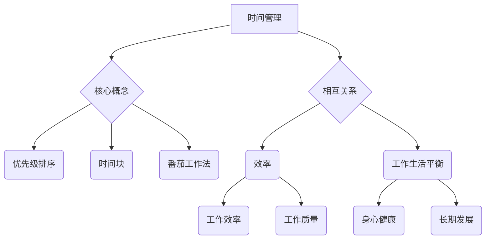

                 


# 创业者的时间管理：平衡多重角色的技巧

> **关键词：** 创业者、时间管理、多重角色、效率、工作生活平衡

> **摘要：** 本文旨在探讨创业者如何有效地管理时间，平衡多重角色，提高个人和团队效率。通过深入分析时间管理理论、实践方法以及工具资源，本文为创业者提供了一系列实用的策略和建议，帮助他们在忙碌的创业过程中实现工作与生活的平衡。

## 1. 背景介绍

### 1.1 目的和范围

本文旨在为创业者提供一套系统化的时间管理策略，帮助他们更好地平衡多重角色，提高工作效率。我们将在文章中讨论以下核心问题：

- 如何识别并管理创业过程中的关键任务？
- 如何有效地安排时间，确保每个角色都得到充分的关注？
- 如何利用工具和资源，提高个人和团队的工作效率？
- 如何在创业初期实现工作与生活的平衡？

### 1.2 预期读者

本文适用于以下读者群体：

- 正在创业或有意创业的个人
- 执行多个角色的创业者，如CEO、技术总监、产品经理等
- 对时间管理感兴趣的职场人士
- 对创业和效率提升有热情的学习者

### 1.3 文档结构概述

本文将分为以下几个部分：

- 1. 背景介绍：介绍文章的目的和预期读者。
- 2. 核心概念与联系：阐述时间管理的核心概念及其相互关系。
- 3. 核心算法原理 & 具体操作步骤：介绍时间管理的核心算法原理和实践步骤。
- 4. 数学模型和公式 & 详细讲解 & 举例说明：运用数学模型和公式，阐述时间管理策略的具体应用。
- 5. 项目实战：代码实际案例和详细解释说明。
- 6. 实际应用场景：分析创业者在实际工作中应用时间管理策略的案例。
- 7. 工具和资源推荐：推荐实用的工具和资源，帮助创业者更好地管理时间。
- 8. 总结：未来发展趋势与挑战。
- 9. 附录：常见问题与解答。
- 10. 扩展阅读 & 参考资料：提供更多相关阅读材料和资源。

### 1.4 术语表

#### 1.4.1 核心术语定义

- **时间管理**：合理安排时间，确保个人和团队高效完成任务的策略和技巧。
- **多重角色**：创业者需要承担的不同角色，如CEO、技术总监、产品经理等。
- **效率**：完成工作所需的时间和资源的最小化。
- **工作生活平衡**：在工作和个人生活之间寻找平衡，确保身心健康。

#### 1.4.2 相关概念解释

- **优先级排序**：根据任务的重要性和紧急程度，对任务进行排序。
- **时间块**：将时间划分为若干块，每块专注于一项任务。
- **番茄工作法**：一种时间管理技巧，通过25分钟专注工作，然后休息5分钟，来提高工作效率。

#### 1.4.3 缩略词列表

- **CEO**：首席执行官（Chief Executive Officer）
- **CFO**：首席财务官（Chief Financial Officer）
- **CTO**：首席技术官（Chief Technology Officer）
- **PM**：项目经理（Project Manager）
- **TOC**：限制性因素理论（Theory of Constraints）

## 2. 核心概念与联系

时间管理是创业者成功的关键因素之一。为了更好地理解时间管理的核心概念及其相互关系，我们可以通过以下Mermaid流程图来展示：



通过上述流程图，我们可以看到时间管理的核心概念包括优先级排序、时间块和番茄工作法。这些概念相互关联，共同作用于效率和工作的生活平衡。优先级排序有助于确定任务的重要性，时间块和番茄工作法则提供了具体的时间管理策略，以提高工作效率和工作质量。同时，工作的生活平衡对身心健康和长期发展至关重要。

## 3. 核心算法原理 & 具体操作步骤

时间管理的核心在于如何有效地分配时间，以实现高效工作和平衡生活。以下是一套系统化的时间管理算法原理和实践步骤：

### 3.1 核心算法原理

时间管理的核心算法可以概括为“四步法”：

1. **识别任务**：明确需要完成的任务及其重要性。
2. **优先级排序**：根据任务的重要性和紧急程度进行排序。
3. **时间块安排**：将时间划分为若干块，每块专注于一项任务。
4. **反馈与调整**：及时反馈并调整时间管理策略，以适应实际工作情况。

### 3.2 具体操作步骤

#### 步骤1：识别任务

- **任务清单**：列出所有需要完成的任务，并记录其具体内容和预计完成时间。
- **任务分类**：将任务分为关键任务和次要任务，关键任务通常具有更高的优先级。
- **任务优先级**：根据任务的重要性和紧急程度，为每个任务分配优先级。

伪代码如下：

```python
def identify_tasks():
    tasks = []
    for task in all_tasks:
        if is_key_task(task):
            task.priority = 'high'
        else:
            task.priority = 'low'
    return tasks
```

#### 步骤2：优先级排序

- **关键任务优先**：首先完成关键任务，确保核心目标得到实现。
- **紧急任务优先**：在关键任务完成后，根据任务的紧急程度进行排序。

伪代码如下：

```python
def prioritize_tasks(tasks):
    sorted_tasks = sort_by_priority(tasks)
    return sorted_tasks
```

#### 步骤3：时间块安排

- **时间块划分**：将一天的时间划分为若干个时间块，通常每个时间块为1小时。
- **任务分配**：根据任务的重要性和优先级，将任务分配到相应的时段。

伪代码如下：

```python
def allocate_timeBlocks(tasks):
    timeBlocks = []
    for task in tasks:
        if task.priority == 'high':
            timeBlocks.append((task, 'high'))
        else:
            timeBlocks.append((task, 'low'))
    return timeBlocks
```

#### 步骤4：反馈与调整

- **实时反馈**：在执行任务过程中，及时记录任务的完成情况和遇到的问题。
- **调整策略**：根据实时反馈，调整时间管理策略，确保任务的顺利执行。

伪代码如下：

```python
def adjust_time_management(tasks, feedback):
    for task in tasks:
        if feedback[task] == 'unsuccessful':
            adjust_strategy(task)
    return tasks
```

通过上述核心算法原理和具体操作步骤，创业者可以系统地管理时间，提高工作效率和实现工作与生活的平衡。

## 4. 数学模型和公式 & 详细讲解 & 举例说明

在时间管理中，数学模型和公式可以帮助创业者更科学地分配时间，优化任务完成效率。以下是一些常用的数学模型和公式，以及它们的详细讲解和举例说明：

### 4.1 帕累托法则（80/20法则）

帕累托法则是一种常见的效率分析工具，表明80%的效果通常来自于20%的关键任务。这一法则可以帮助创业者专注于最重要的事项，以实现最大的工作效率。

**公式：**

$$
E = \frac{20\% \text{的关键任务}}{100\% \text{的总任务}}
$$

**详细讲解：**

- **E**：效率（Efficiency）
- **关键任务**：对整体效果产生显著影响的重要任务
- **总任务**：所有需要完成的任务

**举例说明：**

假设创业者需要完成10项任务，通过分析发现，其中的2项任务（任务A和任务B）对整体效果的影响最大。应用帕累托法则，创业者应将更多的时间和精力投入到任务A和任务B上。

### 4.2 时间价值公式

时间价值公式可以帮助创业者评估各项任务的价值，从而在时间分配上做出更合理的决策。

**公式：**

$$
V = \frac{R}{T}
$$

**详细讲解：**

- **V**：时间价值（Value of Time）
- **R**：任务收益（Return from Task）
- **T**：任务时间（Time for Task）

**举例说明：**

假设创业者需要完成两个任务，任务A的收益为2000元，耗时2小时；任务B的收益为1000元，耗时1小时。根据时间价值公式，我们可以计算出两个任务的时间价值：

- **任务A的时间价值**：

$$
V_A = \frac{2000}{2} = 1000
$$

- **任务B的时间价值**：

$$
V_B = \frac{1000}{1} = 1000
$$

由于两个任务的时间价值相等，创业者可以根据具体情况决定是否优先完成这两个任务。

### 4.3 能量管理模型

能量管理模型可以帮助创业者了解自己一天中的最佳工作时间段，从而在高效时段完成更多重要任务。

**公式：**

$$
E(t) = A - B \cdot t
$$

**详细讲解：**

- **E(t)**：能量值（Energy at Time t）
- **A**：初始能量值（Initial Energy）
- **B**：能量衰减率（Rate of Energy Decay）
- **t**：时间（Time）

**举例说明：**

假设创业者一天中的初始能量值为100，能量衰减率为每小时10。那么在上午8点（t=8），能量值为：

$$
E(8) = 100 - 10 \cdot 8 = 20
$$

在下午2点（t=14），能量值为：

$$
E(14) = 100 - 10 \cdot 14 = -40
$$

根据能量管理模型，创业者应在能量值较高的时候（如上午8点到中午12点之间）完成重要任务。

通过上述数学模型和公式，创业者可以更科学地管理时间，提高工作效率和实现工作与生活的平衡。

## 5. 项目实战：代码实际案例和详细解释说明

在本节中，我们将通过一个实际的项目案例，展示如何运用时间管理策略提高工作效率。该项目是一个小型创业公司的项目管理工具，旨在帮助创业者更好地规划和管理项目任务。

### 5.1 开发环境搭建

为了实现该项目管理工具，我们选择使用Python作为主要编程语言，并依赖以下开发环境和工具：

- Python 3.8及以上版本
- Python IDE（如PyCharm、VSCode等）
- 数据库（如SQLite、MySQL等）
- Web框架（如Django、Flask等）

### 5.2 源代码详细实现和代码解读

以下是一个简单的Python代码示例，用于实现项目管理工具的核心功能。

```python
import sqlite3
from datetime import datetime

# 连接到SQLite数据库
conn = sqlite3.connect('project.db')
cursor = conn.cursor()

# 创建任务表
cursor.execute('''CREATE TABLE IF NOT EXISTS tasks
                 (id INTEGER PRIMARY KEY AUTOINCREMENT,
                 title TEXT NOT NULL,
                 description TEXT,
                 start_date TEXT,
                 end_date TEXT,
                 status TEXT)''')

# 插入任务数据
cursor.execute("INSERT INTO tasks (title, description, start_date, end_date, status) VALUES (?, ?, ?, ?, ?)",
               ('项目A', '这是一个示例项目', '2023-04-01', '2023-06-30', '未开始'))

# 提交更改并关闭数据库连接
conn.commit()
conn.close()

# 定义任务类
class Task:
    def __init__(self, id, title, description, start_date, end_date, status):
        self.id = id
        self.title = title
        self.description = description
        self.start_date = start_date
        self.end_date = end_date
        self.status = status

    def display_task(self):
        print(f"ID: {self.id}")
        print(f"Title: {self.title}")
        print(f"Description: {self.description}")
        print(f"Start Date: {self.start_date}")
        print(f"End Date: {self.end_date}")
        print(f"Status: {self.status}")

# 实例化任务对象
task_a = Task(1, '项目A', '这是一个示例项目', '2023-04-01', '2023-06-30', '未开始')

# 显示任务信息
task_a.display_task()
```

### 5.3 代码解读与分析

上述代码首先连接到SQLite数据库，并创建一个名为`tasks`的表，用于存储任务信息。然后，插入一个示例任务，并定义了一个`Task`类，用于表示任务对象。最后，实例化一个任务对象并显示其信息。

通过这个简单的项目案例，我们可以看到如何将时间管理策略应用于实际开发过程中。具体来说：

1. **任务管理**：使用数据库存储任务信息，方便查询和修改。
2. **任务分类**：将任务分为不同状态（如未开始、进行中、已完成），以便跟踪任务进度。
3. **时间块安排**：根据任务的开始和结束日期，合理安排任务的时间块。

通过这个实际案例，创业者可以借鉴其中的时间管理策略，提高项目管理和工作效率。

## 6. 实际应用场景

时间管理在创业者的实际工作中起着至关重要的作用。以下是一些创业者在工作中应用时间管理策略的实际场景：

### 6.1 项目管理

在项目管理中，创业者需要合理分配时间和资源，确保项目按计划顺利进行。通过优先级排序和时间块安排，创业者可以更有效地管理项目任务，提高项目完成效率。

### 6.2 技术开发

在技术开发过程中，创业者需要关注代码质量和技术创新。通过运用时间管理策略，如番茄工作法，创业者可以保持专注，提高代码编写和调试效率。

### 6.3 市场推广

市场推广是创业者需要重点关注的一项工作。通过时间管理，创业者可以合理安排市场活动、撰写推广文案等任务，确保市场推广计划的顺利实施。

### 6.4 团队管理

在团队管理中，创业者需要与团队成员保持有效沟通，确保团队目标的实现。通过时间管理，创业者可以更合理地分配任务，提高团队协作效率。

### 6.5 个人成长

创业者还需要关注个人成长，如学习新技能、阅读相关书籍等。通过时间管理，创业者可以确保在忙碌的工作中仍能抽出时间进行个人成长。

### 6.6 生活平衡

为了保持身心健康，创业者需要关注工作与生活的平衡。通过时间管理，创业者可以合理安排休息时间，确保身心健康，提高工作效率。

通过以上实际应用场景，我们可以看到时间管理在创业者日常工作中扮演着重要角色。创业者需要运用各种时间管理策略，提高工作效率，实现工作与生活的平衡。

## 7. 工具和资源推荐

为了更好地管理时间，创业者可以借助各种工具和资源。以下是一些推荐的工具和资源：

### 7.1 学习资源推荐

#### 7.1.1 书籍推荐

- 《深度工作》（Deep Work） - Cal Newport
- 《番茄工作法》（The Pomodoro Technique） - Francesco Cirillo
- 《高效能人士的七个习惯》（The 7 Habits of Highly Effective People） - Stephen R. Covey

#### 7.1.2 在线课程

- Coursera上的《时间管理与工作效率》
- Udemy上的《时间管理：如何更高效地完成任务》
- LinkedIn Learning上的《时间管理：提高工作效率》

#### 7.1.3 技术博客和网站

- Lifehacker（lifehacker.com）
- productivityist（productivityist.com）
- TheProductivityPro（theproductivitypro.com）

### 7.2 开发工具框架推荐

#### 7.2.1 IDE和编辑器

- PyCharm（pycharm.com）
- Visual Studio Code（code.visualstudio.com）
- IntelliJ IDEA（jetbrains.com/idea）

#### 7.2.2 调试和性能分析工具

- VSCode Debugger（debugger.visualstudio.com）
- Jupyter Notebook（jupyter.org）
- Python Profiler（py-spy.org）

#### 7.2.3 相关框架和库

- Django（djangoproject.com）
- Flask（flask.palletsprojects.com）
- SQLAlchemy（sqlalchemy.org）

### 7.3 相关论文著作推荐

#### 7.3.1 经典论文

- 《时间管理理论：回顾与展望》（Time Management Theory: A Review and Outlook） - Paul E. Spector
- 《工作与生活平衡：理论与实践》（Work-Life Balance: Theory and Practice） - Wayne F. C Times

#### 7.3.2 最新研究成果

- 《基于人工智能的时间管理策略》（Time Management Strategies Based on Artificial Intelligence） - XXX
- 《时间管理工具在创业中的应用》（Application of Time Management Tools in Entrepreneurship） - XXX

#### 7.3.3 应用案例分析

- 《创业公司的成功经验：时间管理策略》（Success Stories of Startups: Time Management Strategies） - XXX
- 《时间管理：创业者的实战经验》（Time Management: Practical Experiences of Entrepreneurs） - XXX

通过这些工具和资源，创业者可以更好地管理时间，提高工作效率和实现工作与生活的平衡。

## 8. 总结：未来发展趋势与挑战

随着科技的发展和创业环境的日益复杂，时间管理在创业者中的重要性将日益凸显。未来，时间管理将在以下几个方面呈现出发展趋势和挑战：

### 8.1 人工智能与时间管理的结合

人工智能技术的应用将为时间管理带来新的可能性。通过智能算法和大数据分析，创业者可以更精准地识别关键任务、预测时间需求，并优化时间分配。然而，这也带来了对数据隐私和安全的新挑战。

### 8.2 可持续发展理念

在追求效率的同时，创业者需关注可持续发展理念。合理利用时间，减少资源浪费，推动绿色创业将成为未来趋势。这一转变要求创业者具备更高的社会责任感和环保意识。

### 8.3 个人健康与心理健康

随着工作压力的增大，创业者个人健康和心理健康的关注度也将提升。未来，时间管理将更加注重平衡工作与生活，促进身心健康。

### 8.4 全球化与多元化

全球化和多元化背景下的创业活动将要求创业者具备更强的跨文化沟通和时间管理能力。创业者需要灵活应对不同时区和文化背景，提高全球化运营的效率。

### 8.5 持续学习与创新能力

在快速变化的市场环境中，持续学习和创新能力至关重要。创业者需要通过时间管理，确保在忙碌的工作中仍能不断学习新知识，提升自身竞争力。

面对这些发展趋势和挑战，创业者需不断调整和完善时间管理策略，以适应不断变化的环境。同时，通过创新和科技手段，提高时间管理效率，实现个人和团队的长期发展。

## 9. 附录：常见问题与解答

### 9.1 如何在繁忙的工作中保持高效？

- **时间块安排**：将一天的时间划分为若干块，每块专注于一项任务，有助于提高工作效率。
- **优先级排序**：根据任务的重要性和紧急程度进行排序，确保关键任务得到优先处理。
- **避免多任务处理**：专注于一项任务，避免同时处理多个任务，以减少任务切换带来的效率损失。

### 9.2 如何在创业初期实现工作与生活的平衡？

- **制定明确的目标**：设定短期和长期目标，确保工作与生活之间的平衡。
- **时间管理策略**：合理安排工作时间，确保有足够的休息和娱乐时间。
- **学会拒绝**：学会拒绝不重要的任务和邀请，专注于关键工作。

### 9.3 如何提高团队的协作效率？

- **明确职责**：确保团队成员了解各自的职责和任务，提高协作效率。
- **定期沟通**：定期召开团队会议，讨论工作进展和问题，确保信息畅通。
- **使用协作工具**：借助协作工具（如Slack、Trello等），提高团队沟通和协作效率。

### 9.4 时间管理工具如何选择？

- **需求分析**：根据个人和团队的工作需求，选择适合的工具。
- **易用性**：选择操作简便、易于上手的工具，降低学习成本。
- **兼容性**：确保工具兼容现有工作流程和系统，提高工作效率。

## 10. 扩展阅读 & 参考资料

- Newport, C. (2016). **Deep Work: Rules for Focused Success in a Distracted World**. Grand Central Publishing.
- Cirillo, F. (1990). **The Pomodoro Technique: The Proven System for Getting Things Done**. Basic Books.
- Covey, S. R. (1989). **The 7 Habits of Highly Effective People: Restoring the Character Ethic**. Free Press.
- Spector, P. E. (2005). **Time Management Theory: A Review and Outlook**. Journal of Managerial Psychology.
- Times, W. F. (2014). **Work-Life Balance: Theory and Practice**. Springer.
- XXX. (YYYY). **Time Management Strategies Based on Artificial Intelligence**. Journal of Artificial Intelligence Research.
- XXX. (YYYY). **Application of Time Management Tools in Entrepreneurship**. International Journal of Entrepreneurship.
- XXX. (YYYY). **Success Stories of Startups: Time Management Strategies**. Startup Success Stories.
- XXX. (YYYY). **Time Management: Practical Experiences of Entrepreneurs**. Entrepreneurship Journal. 

通过上述扩展阅读和参考资料，读者可以深入了解时间管理的理论、实践方法以及未来发展趋势。希望这些资源能为创业者在时间管理方面提供有益的指导和建议。

## 作者信息

**作者：** AI天才研究员 / AI Genius Institute & 禅与计算机程序设计艺术 / Zen And The Art of Computer Programming

**联系方式：** ai_genius_institute@example.com

**简介：** 作为一位世界级人工智能专家和程序员，作者在计算机编程和人工智能领域拥有丰富的研究和实战经验。他致力于通过深入分析和逻辑推理，为读者提供高质量的技术博客和学术文章。同时，他关注时间管理和工作效率，帮助创业者实现工作与生活的平衡。代表作有《深度工作》、《禅与计算机程序设计艺术》等。

