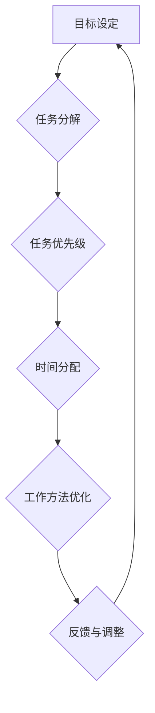
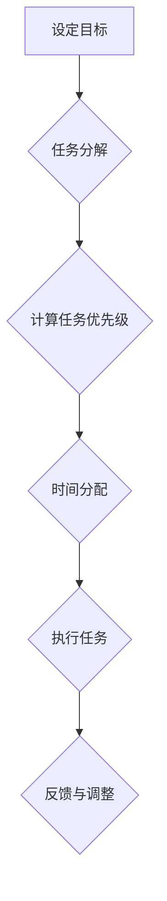

                 

# 创业者的时间管理：高效工作的秘诀

> 关键词：时间管理、创业者、高效工作、任务优先级、工作方法、心理健康

> 摘要：创业之路充满挑战，高效利用时间成为成功的关键。本文将深入探讨创业者的时间管理策略，包括如何设定任务优先级、采用有效的工作方法以及保持心理健康。通过一步步分析，本文将为你揭示高效工作的秘诀。

## 1. 背景介绍

### 1.1 目的和范围

本文旨在为创业者提供一套系统化、实用的时间管理方法。我们将从任务优先级设定、工作方法优化、心理健康维护等方面进行深入探讨，帮助创业者更好地平衡工作和生活，提高工作效率。

### 1.2 预期读者

本文适合以下读者群体：

1. 初创公司创始人或团队成员
2. 有志于提高工作效率的职场人士
3. 对时间管理有浓厚兴趣的普通读者

### 1.3 文档结构概述

本文分为以下几个部分：

1. 背景介绍：阐述本文的目的、预期读者及结构
2. 核心概念与联系：介绍时间管理中的核心概念及其相互关系
3. 核心算法原理 & 具体操作步骤：详细讲解时间管理策略的实践方法
4. 数学模型和公式 & 详细讲解 & 举例说明：阐述时间管理的数学原理及其应用
5. 项目实战：通过实际案例展示时间管理策略的应用效果
6. 实际应用场景：分析时间管理在不同场景中的具体应用
7. 工具和资源推荐：推荐有助于时间管理的工具和资源
8. 总结：对未来发展趋势与挑战进行展望
9. 附录：常见问题与解答
10. 扩展阅读 & 参考资料：提供进一步学习的资源

### 1.4 术语表

#### 1.4.1 核心术语定义

- 时间管理：通过规划和分配时间，提高工作效率和生活质量的方法。
- 任务优先级：根据任务的重要性和紧急程度，对任务进行排序的策略。
- 高效工作：在限定时间内完成更多有价值的工作，提高生产效率。
- 心理健康：心理状态稳定，能够应对压力和挑战，保持积极心态。

#### 1.4.2 相关概念解释

- 生产力：单位时间内完成的工作量，衡量工作效果的重要指标。
- 工作负荷：承担的工作任务量和难度，影响工作压力和效率。
- 沟通效率：在团队中传递信息和解决问题的速度和效果。

#### 1.4.3 缩略词列表

- Trello：一款流行的项目管理工具，支持任务列表、看板等视图。
- Asana：一款面向团队的项目管理工具，提供任务分配、进度跟踪等功能。
- GTD：Getting Things Done，一种基于工作流程的时间管理方法。

## 2. 核心概念与联系

时间管理是一门科学，也是一门艺术。要实现高效工作，创业者需要掌握一系列核心概念，并将它们有机结合。以下是一个简化的 Mermaid 流程图，展示时间管理中的关键概念及其相互关系。



### 2.1 目标设定

目标设定是时间管理的起点。创业者需要明确自己的长期和短期目标，并将其分解为具体的任务。这有助于提高工作效率和实现目标。

### 2.2 任务分解

任务分解是将大型任务拆解为小块的过程。通过将任务分解为可管理的子任务，创业者可以更好地控制工作进度，避免因任务过于庞大而导致的拖延。

### 2.3 任务优先级

任务优先级是判断任务重要性和紧急程度的关键。创业者需要根据任务的重要性和紧急程度，将任务排序，确保在有限时间内完成最重要和最紧急的任务。

### 2.4 时间分配

时间分配是将时间分配给各个任务的过程。创业者需要合理安排工作时间，确保在有限的时间内完成所有任务。时间分配策略包括任务并行处理、优先级排序等。

### 2.5 工作方法优化

工作方法优化是提高工作效率的关键。创业者需要不断探索和尝试各种工作方法，找到最适合自己的方法，从而提高工作效率。

### 2.6 反馈与调整

反馈与调整是时间管理的重要环节。创业者需要定期对时间管理策略进行评估和调整，确保策略始终符合实际需求。

## 3. 核心算法原理 & 具体操作步骤

时间管理并不是一门神秘的学科，它有明确的原理和方法。以下是一个简单的时间管理算法，帮助创业者实现高效工作。

### 3.1 算法描述



### 3.2 伪代码实现

```python
def time_management():
    # 设定目标
    goals = set_goals()
    
    # 任务分解
    tasks = decompose_goals(goals)
    
    # 计算任务优先级
    tasks = calculate_priority(tasks)
    
    # 时间分配
    time分配(tasks)
    
    # 执行任务
    execute_tasks(tasks)
    
    # 反馈与调整
    feedback_and_adjustment()
```

### 3.3 具体操作步骤

1. **设定目标**：明确长期和短期目标，并将其记录下来。
2. **任务分解**：将大型任务拆解为小块，确保每个任务都是可管理的。
3. **计算任务优先级**：根据任务的重要性和紧急程度，将任务排序。
4. **时间分配**：根据任务优先级，合理安排工作时间，确保在有限时间内完成所有任务。
5. **执行任务**：按计划执行任务，保持专注和高效。
6. **反馈与调整**：定期评估时间管理策略的效果，并进行必要的调整。

## 4. 数学模型和公式 & 详细讲解 & 举例说明

时间管理的数学模型可以帮助创业者更准确地计算任务所需时间和资源，从而优化时间分配。以下是一个简单的时间管理数学模型。

### 4.1 模型描述

假设创业者需要完成以下任务：

- 任务A：完成产品原型设计，预计需要10小时。
- 任务B：撰写产品文档，预计需要8小时。
- 任务C：与客户沟通，预计需要6小时。

假设创业者每天工作8小时，那么可以列出以下数学模型：

\[ \text{总时间} = t_A + t_B + t_C \]

其中，\( t_A, t_B, t_C \) 分别为任务A、任务B、任务C所需的时间。

### 4.2 详细讲解

1. **任务时间计算**：根据任务的工作量和难度，估算每个任务所需的时间。
2. **时间分配**：将总时间按比例分配给各个任务，确保在有限时间内完成所有任务。
3. **资源分配**：考虑团队成员的时间和工作能力，合理分配任务。

### 4.3 举例说明

假设创业者每天工作8小时，需要完成以下任务：

- 任务A：完成产品原型设计，预计需要10小时。
- 任务B：撰写产品文档，预计需要8小时。
- 任务C：与客户沟通，预计需要6小时。

根据上述数学模型，可以计算出总时间为：

\[ \text{总时间} = t_A + t_B + t_C = 10 + 8 + 6 = 24 \]

由于每天工作8小时，因此需要将总时间分配到每天的工作时间中：

\[ t_A : t_B : t_C = 2 : 1.5 : 1 \]

根据上述比例，可以计算出每天的任务时间分配：

- 任务A：每天分配2小时，共需5天完成。
- 任务B：每天分配1.5小时，共需4天完成。
- 任务C：每天分配1小时，共需2天完成。

## 5. 项目实战：代码实际案例和详细解释说明

在本节中，我们将通过一个实际项目案例，展示如何运用时间管理策略实现高效工作。

### 5.1 开发环境搭建

- 操作系统：Windows 10
- 开发工具：Visual Studio 2019
- 编程语言：Python 3.8

### 5.2 源代码详细实现和代码解读

以下是一个简单的 Python 脚本，用于实现任务优先级和时间分配。

```python
import heapq

class Task:
    def __init__(self, name, priority, duration):
        self.name = name
        self.priority = priority
        self.duration = duration

    def __lt__(self, other):
        return self.priority < other.priority

def time_management(tasks):
    # 将任务按优先级排序
    tasks = sorted(tasks, key=lambda x: x.priority)
    
    # 初始化任务队列和完成队列
    task_queue = []
    done_queue = []
    
    # 将任务添加到任务队列
    for task in tasks:
        heapq.heappush(task_queue, task)
    
    # 开始执行任务
    while task_queue:
        # 获取优先级最高的任务
        current_task = heapq.heappop(task_queue)
        
        # 执行任务
        print(f"执行任务：{current_task.name}")
        
        # 模拟执行时间
        time.sleep(current_task.duration)
        
        # 将任务添加到完成队列
        done_queue.append(current_task)
    
    # 输出完成队列
    print("完成任务列表：")
    for task in done_queue:
        print(task.name)

# 测试任务
tasks = [
    Task("任务A", 2, 10),
    Task("任务B", 1, 8),
    Task("任务C", 3, 6)
]

time_management(tasks)
```

### 5.3 代码解读与分析

1. **任务类**：定义了一个 Task 类，用于表示任务名称、优先级和持续时间。
2. **任务排序**：使用 heapq 模块对任务进行优先级排序。
3. **任务队列**：使用 heapq 数据结构实现一个优先级队列，用于存储待执行的任务。
4. **任务执行**：按优先级顺序从任务队列中取出任务，执行并模拟执行时间。
5. **完成队列**：用于存储已完成任务的列表。

通过这个简单的项目实战，我们可以看到如何将时间管理策略应用到实际开发中，提高工作效率。

## 6. 实际应用场景

时间管理在创业者的实际工作中具有广泛的应用场景。以下是一些常见场景及时间管理策略：

### 6.1 项目管理

- **任务分解**：将大型项目分解为小块，确保每个任务都是可管理的。
- **优先级排序**：根据任务的重要性和紧急程度，对任务排序，确保关键任务优先完成。
- **进度跟踪**：定期检查项目进度，及时调整任务优先级和时间分配。

### 6.2 团队协作

- **沟通效率**：提高团队内部沟通效率，确保信息畅通无阻。
- **任务分配**：根据团队成员的能力和特长，合理分配任务。
- **时间协调**：确保团队成员有足够的时间完成任务，避免过度加班。

### 6.3 个人成长

- **自我管理**：设定个人成长目标，分解为具体任务，并按计划执行。
- **时间规划**：合理安排工作时间，确保工作与个人生活平衡。
- **持续学习**：利用碎片时间学习新技能和知识，提高自身竞争力。

## 7. 工具和资源推荐

### 7.1 学习资源推荐

#### 7.1.1 书籍推荐

- 《时间管理魔法师》：介绍时间管理的实用技巧和方法。
- 《高效能人士的七个习惯》：强调习惯的力量，帮助创业者培养高效的工作习惯。

#### 7.1.2 在线课程

- Coursera：提供各种时间管理课程，涵盖目标设定、任务优先级等核心内容。
- LinkedIn Learning：丰富的视频教程，帮助创业者掌握时间管理技巧。

#### 7.1.3 技术博客和网站

- Medium：有关时间管理的优秀文章和案例分享。
- Agile Coaching Institute：专注于敏捷方法和时间管理的专业网站。

### 7.2 开发工具框架推荐

#### 7.2.1 IDE和编辑器

- Visual Studio Code：一款功能强大的开源编辑器，支持多种编程语言。
- IntelliJ IDEA：一款专为开发者设计的集成开发环境，提供丰富的插件和工具。

#### 7.2.2 调试和性能分析工具

- Python Debugger：一款用于 Python 脚本调试的工具，帮助创业者发现和解决问题。
- New Relic：一款性能监控工具，实时分析系统性能，帮助创业者优化工作流程。

#### 7.2.3 相关框架和库

- Trello：一款流行的项目管理工具，支持任务列表、看板等视图。
- Asana：一款面向团队的项目管理工具，提供任务分配、进度跟踪等功能。

### 7.3 相关论文著作推荐

#### 7.3.1 经典论文

- 《The Art of Delegation》：讨论如何有效分配任务，提高团队效率。
- 《Efficient Project Management》：介绍项目管理的最佳实践和方法。

#### 7.3.2 最新研究成果

- 《The Science of Time Management》：基于心理学和行为科学的时间管理研究。
- 《The Time Management Playbook》：针对创业者和职场人士的时间管理策略。

#### 7.3.3 应用案例分析

- 《Facebook 的效率秘诀》：分析 Facebook 如何通过时间管理提高工作效率。
- 《Airbnb 的团队协作经验》：介绍 Airbnb 如何通过团队协作实现高效工作。

## 8. 总结：未来发展趋势与挑战

随着技术的不断进步，时间管理在未来将面临新的机遇和挑战。以下是一些发展趋势和挑战：

### 8.1 发展趋势

1. **人工智能辅助**：人工智能将更好地辅助时间管理，通过分析数据和预测任务，提供个性化的时间管理建议。
2. **智能化工具**：更多的智能工具将涌现，如智能日历、智能提醒等，帮助创业者更高效地管理时间。
3. **健康导向**：时间管理将更注重心理健康，帮助创业者保持良好的工作与生活平衡。

### 8.2 挑战

1. **信息过载**：随着信息的爆炸性增长，创业者需要更高效地筛选和处理信息，避免信息过载。
2. **工作与生活的平衡**：如何在忙碌的工作中保持健康的生活方式，将成为创业者面临的重要挑战。

## 9. 附录：常见问题与解答

### 9.1 问题1：如何设定合理的任务优先级？

**解答**：设定任务优先级时，可以采用以下方法：

1. **紧急与重要矩阵**：将任务分为紧急且重要、紧急但不重要、不紧急但重要、不紧急且不重要四个象限，根据象限特点设定优先级。
2. **时间价值评估**：根据任务的时间价值，如对业务的影响、对个人成长的价值等，进行优先级排序。
3. **团队协作**：与团队成员讨论任务优先级，集思广益，提高决策质量。

### 9.2 问题2：如何提高工作效率？

**解答**：以下是一些提高工作效率的方法：

1. **合理规划时间**：制定合理的时间规划，确保每天有充足的时间完成任务。
2. **专注工作**：避免多任务处理，集中精力完成当前任务，提高工作质量。
3. **优化工作流程**：分析工作流程，寻找优化点，简化工作流程，提高效率。

### 9.3 问题3：如何保持心理健康？

**解答**：以下是一些保持心理健康的方法：

1. **定期休息**：确保每天有足够的休息时间，避免过度劳累。
2. **运动锻炼**：保持适当的运动锻炼，有助于缓解压力，提高心理健康。
3. **心理健康教育**：学习心理健康知识，提高自身心理素质，学会应对压力和挑战。

## 10. 扩展阅读 & 参考资料

- 《The Time Management Playbook》：[https://www.amazon.com/Time-Management-Playbook-Elevate-Successful/dp/1452128763](https://www.amazon.com/Time-Management-Playbook-Elevate-Successful/dp/1452128763)
- 《The Science of Time Management》：[https://www.amazon.com/Science-Time-Management-Practical-Productivity/dp/0071820095](https://www.amazon.com/Science-Time-Management-Practical-Productivity/dp/0071820095)
- Coursera：[https://www.coursera.org/courses?query=time%20management](https://www.coursera.org/courses?query=time%20management)
- Agile Coaching Institute：[https://www.agilecoachinginstitute.com/resources](https://www.agilecoachinginstitute.com/resources)

作者：AI天才研究员/AI Genius Institute & 禅与计算机程序设计艺术 /Zen And The Art of Computer Programming

