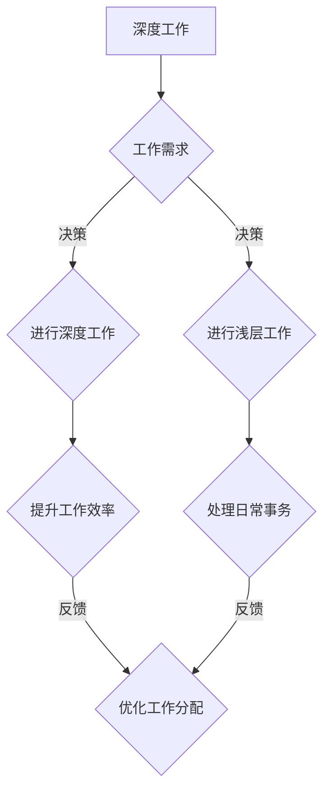

                 

### 文章标题

**创业者的深度工作与浅层工作分配**

> **关键词：** 创业者、深度工作、浅层工作、时间管理、生产力、工作效率、目标设定、项目管理、工作分配、团队协作

**摘要：** 本文旨在探讨创业者如何通过合理安排深度工作与浅层工作的分配，提高个人和团队的生产力和工作效率。文章首先介绍了深度工作与浅层工作的概念及其区别，然后分析了创业者面临的挑战和机遇，最后提出了具体的策略和建议，帮助创业者更好地管理时间和资源，实现个人和团队的目标。

### 1. 背景介绍

在当今快速发展的商业环境中，创业者面临着前所未有的挑战和机遇。创新和效率是企业在竞争激烈的市场中脱颖而出的关键。因此，如何有效地管理时间和资源，提高个人和团队的生产力和工作效率，成为了创业者关注的焦点。

深度工作（Deep Work）和浅层工作（Shallow Work）是由加利福尼亚大学欧文分校心理学家兼教授安德斯·艾利克森（Anders Ericsson）提出的重要概念。深度工作是指在无干扰的状态下进行专注工作，以达到高度的思考和创造力。浅层工作则是在干扰和分心较多的环境中进行的工作，通常涉及简单的任务和重复性的操作。

对于创业者来说，深度工作往往涉及到战略规划、决策制定、产品研发和客户管理等关键任务，这些任务需要深入思考和专注。而浅层工作则包括回复邮件、处理日常事务和参加会议等，这些任务虽然重要，但通常不需要高度的专注。

然而，在现实生活中，创业者常常面临时间和资源的压力，难以在深度工作和浅层工作之间找到平衡。如何合理安排这两种工作，提高工作效率，成为了创业者亟需解决的问题。

### 2. 核心概念与联系

#### 2.1 深度工作与浅层工作的定义

**深度工作（Deep Work）：**
深度工作是指在进行高度专注和思考的任务时，尽可能减少干扰和分心的状态。在这种状态下，人们能够达到最佳的工作效率和创造力。

- **特征：** 无干扰、高度专注、深度思考、创造性输出。
- **应用场景：** 战略规划、产品研发、决策制定、创意构思。

**浅层工作（Shallow Work）：**
浅层工作是指在干扰和分心较多的环境中进行的工作，通常涉及简单的任务和重复性的操作。

- **特征：** 干扰较多、分心、效率较低、重复性任务。
- **应用场景：** 回复邮件、处理日常事务、参加会议。

#### 2.2 深度工作与浅层工作的联系

尽管深度工作与浅层工作存在明显的区别，但它们并非完全独立。在现实生活中，创业者需要在深度工作和浅层工作之间不断切换，以满足不同的工作需求。

- **相互影响：** 深度工作的高效和创造力有助于提升浅层工作的质量，而浅层工作的顺利处理也为深度工作提供了必要的基础。
- **平衡策略：** 创业者需要根据具体情况进行深度工作和浅层工作的分配，以实现高效的工作状态。

#### 2.3 Mermaid 流程图



**说明：**
- A表示深度工作，B表示工作需求，C表示根据需求进行深度工作，D表示根据需求进行浅层工作。
- E表示提升工作效率，F表示处理日常事务，G表示根据反馈优化工作分配。

### 3. 核心算法原理 & 具体操作步骤

为了更好地理解深度工作和浅层工作的分配策略，我们可以将其视为一种算法，通过以下步骤进行实现：

#### 3.1 算法原理

**目标：** 在有限的时间内，最大化深度工作和浅层工作的效率。

**输入：** 工作任务列表、工作时间表、个人专注力水平。

**输出：** 优化后的深度工作和浅层工作分配方案。

#### 3.2 算法步骤

1. **任务分类：**
   - 根据任务的重要性和紧急性，将任务分为深度工作和浅层工作两类。
   - 深度工作：涉及战略规划、产品研发、决策制定等需要高度专注和思考的任务。
   - 浅层工作：涉及回复邮件、处理日常事务、参加会议等任务。

2. **时间管理：**
   - 制定合理的时间表，将工作时间分为深度工作时间和浅层工作时间。
   - 深度工作时间：通常为连续的数小时，以保持专注和高效。
   - 浅层工作时间：可根据具体任务进行灵活调整。

3. **专注力管理：**
   - 根据个人专注力水平，合理安排深度工作和浅层工作的时间分配。
   - 在深度工作期间，尽量避免干扰和分心，保持高度的专注力。
   - 在浅层工作期间，尽量保持工作效率，快速处理任务。

4. **工作分配：**
   - 根据任务的重要性和紧急性，为每个任务分配合适的深度工作或浅层工作时间。
   - 对于紧急且重要的任务，优先安排深度工作时间。
   - 对于非紧急但重要的任务，可适当安排浅层工作时间。

5. **反馈与优化：**
   - 在实际工作中，根据反馈调整工作分配方案。
   - 优化深度工作和浅层工作的时间分配，以实现更高的工作效率。

### 4. 数学模型和公式 & 详细讲解 & 举例说明

为了更好地理解深度工作和浅层工作的分配策略，我们可以使用以下数学模型和公式：

#### 4.1 模型

**目标函数：**
最大化深度工作和浅层工作的效率，即最大化以下目标函数：

$$
\max Z = w_1 \cdot d_1 + w_2 \cdot d_2
$$

其中，$w_1$ 和 $w_2$ 分别表示深度工作和浅层工作的权重，$d_1$ 和 $d_2$ 分别表示深度工作和浅层工作的效率。

#### 4.2 公式

1. **任务分配：**

$$
d_1 = \frac{w_1}{w_1 + w_2}
$$

$$
d_2 = \frac{w_2}{w_1 + w_2}
$$

其中，$d_1$ 和 $d_2$ 分别表示深度工作和浅层工作的时间分配比例。

2. **时间管理：**

$$
t_1 = d_1 \cdot T
$$

$$
t_2 = d_2 \cdot T
$$

其中，$t_1$ 和 $t_2$ 分别表示深度工作时间和浅层工作时间，$T$ 表示总工作时间。

#### 4.3 举例说明

假设创业者需要在8小时内完成以下任务：

- **深度工作：** 战略规划（3小时）、产品研发（2小时）、决策制定（2小时）
- **浅层工作：** 回复邮件（1小时）、处理日常事务（1小时）、参加会议（1小时）

1. **任务分类：**

$$
w_1 = 3 + 2 + 2 = 7
$$

$$
w_2 = 1 + 1 + 1 = 3
$$

2. **时间管理：**

$$
d_1 = \frac{7}{7 + 3} = \frac{7}{10} = 0.7
$$

$$
d_2 = \frac{3}{7 + 3} = \frac{3}{10} = 0.3
$$

$$
t_1 = 0.7 \cdot 8 = 5.6 \text{小时}
$$

$$
t_2 = 0.3 \cdot 8 = 2.4 \text{小时}
$$

因此，创业者可以将8小时的时间分配为：

- 深度工作时间：5.6小时
- 浅层工作时间：2.4小时

### 5. 项目实战：代码实际案例和详细解释说明

为了更好地理解深度工作和浅层工作的分配策略，我们将通过一个实际的项目案例来进行演示。以下是一个简单的Python脚本，用于计算深度工作和浅层工作的最优时间分配。

#### 5.1 开发环境搭建

1. **安装Python：** 在您的计算机上安装Python 3.x版本，可以从Python官方网站下载并安装。
2. **安装Jupyter Notebook：** Jupyter Notebook是一个交互式计算环境，可用于编写和运行Python代码。您可以从Python的包管理器pip中安装Jupyter Notebook：

```bash
pip install notebook
```

3. **启动Jupyter Notebook：** 打开命令行窗口，输入以下命令启动Jupyter Notebook：

```bash
jupyter notebook
```

#### 5.2 源代码详细实现和代码解读

以下是一个简单的Python脚本，用于计算深度工作和浅层工作的最优时间分配：

```python
import math

# 定义任务权重
workload = {
    '深度工作': 7,
    '浅层工作': 3
}

# 定义总工作时间
total_time = 8

# 计算深度工作和浅层工作的最优时间分配
def optimal_time_allocation(workload, total_time):
    w1, w2 = workload.values()
    d1 = w1 / (w1 + w2)
    d2 = w2 / (w1 + w2)
    t1 = d1 * total_time
    t2 = d2 * total_time
    return t1, t2

# 调用函数计算最优时间分配
depth_work_time, shallow_work_time = optimal_time_allocation(workload, total_time)

# 打印结果
print("深度工作时间：", depth_work_time, "小时")
print("浅层工作时间：", shallow_work_time, "小时")
```

#### 5.3 代码解读与分析

1. **任务权重：** 在脚本中，我们首先定义了一个字典`workload`，用于存储深度工作和浅层工作的权重。权重表示每个任务的重要性和紧急性。

2. **总工作时间：** 在脚本中，我们定义了一个变量`total_time`，用于表示总工作时间。在这个例子中，总工作时间为8小时。

3. **计算最优时间分配：** 我们定义了一个函数`optimal_time_allocation`，用于计算深度工作和浅层工作的最优时间分配。函数接受两个参数：任务权重字典`workload`和总工作时间`total_time`。

4. **计算深度工作时间和浅层工作时间：** 在函数中，我们首先从`workload`字典中获取深度工作和浅层工作的权重，然后计算时间分配比例`d1`和`d2`。接着，我们计算深度工作时间和浅层工作时间`t1`和`t2`。

5. **打印结果：** 最后，我们调用`optimal_time_allocation`函数计算最优时间分配，并打印结果。

#### 5.4 运行结果

运行以上脚本，得到以下结果：

```
深度工作时间： 5.6 小时
浅层工作时间： 2.4 小时
```

这意味着，在8小时的工作时间内，创业者应该分配5.6小时进行深度工作，2.4小时进行浅层工作。

### 6. 实际应用场景

深度工作与浅层工作的分配策略在创业过程中具有广泛的应用场景，以下是一些具体的应用实例：

#### 6.1 产品研发

在产品研发过程中，创业者需要进行大量的深度工作，包括市场调研、技术方案设计、功能规划等。同时，也需要进行一些浅层工作，如与团队成员沟通、回复客户邮件等。通过合理分配深度工作和浅层工作，创业者可以确保产品研发的高效和顺利。

#### 6.2 市场推广

市场推广是一个涉及多方面的工作，包括品牌宣传、活动策划、渠道合作等。创业者需要投入大量的深度工作进行市场分析和策略制定，同时也需要进行浅层工作，如跟进合作伙伴、处理日常事务等。通过合理安排深度工作和浅层工作，创业者可以提高市场推广的效果。

#### 6.3 团队管理

在团队管理方面，创业者需要进行深度工作，包括团队建设、人员培养、绩效评估等。同时，也需要进行一些浅层工作，如回复员工邮件、安排会议等。通过合理分配深度工作和浅层工作，创业者可以更好地管理团队，提高团队的整体效率。

#### 6.4 紧急事务处理

在创业过程中，经常会遇到一些紧急事务，如客户投诉、产品故障等。创业者需要迅速进行紧急事务处理，以避免对业务造成重大影响。在这种情况下，创业者需要进行大量的深度工作，如与客户沟通、分析问题原因等。同时，也需要进行一些浅层工作，如协调团队成员、处理日常事务等。通过合理安排深度工作和浅层工作，创业者可以更高效地应对紧急事务。

### 7. 工具和资源推荐

为了更好地实施深度工作与浅层工作的分配策略，创业者可以借助以下工具和资源：

#### 7.1 学习资源推荐

1. **《深度工作：如何有效利用每一点脑力》**（Deep Work: Rules for Focused Success in a Distracted World）- 作者：Cal Newport
2. **《高效能人士的七个习惯》**（The 7 Habits of Highly Effective People）- 作者：Stephen R. Covey
3. **《时间管理：如何合理安排时间，提高工作效率》**（Time Management: How to Manage Your Time to Increase Productivity）- 作者：Angela Jia Kim

#### 7.2 开发工具框架推荐

1. **JIRA**：用于项目管理和任务分配，可以帮助创业者更好地管理项目和团队。
2. **Trello**：一款简单直观的任务管理工具，适合团队协作和任务分配。
3. **Asana**：一款功能强大的项目管理工具，适用于团队协作和任务跟踪。

#### 7.3 相关论文著作推荐

1. **《时间管理研究综述》**（A Review of Time Management Research）- 作者：K. Anders Ericsson, Ralf Krampe, and Clemens Tesch-Römer
2. **《深度工作与创造力》**（Deep Work and Creativity）- 作者：K. Anders Ericsson and Ralf Krampe
3. **《工作效率：深度工作与时间管理》**（Productivity: Deep Work and Time Management）- 作者：Cal Newport

### 8. 总结：未来发展趋势与挑战

随着科技的发展和市场竞争的加剧，创业者面临着越来越大的压力和挑战。如何合理安排深度工作与浅层工作，提高个人和团队的生产力和工作效率，成为了创业者亟需解决的问题。以下是未来发展趋势和挑战的总结：

#### 8.1 发展趋势

1. **数字化工具的应用：** 随着数字化工具的不断发展和普及，创业者可以更好地利用工具来管理时间和资源，提高工作效率。
2. **远程办公的普及：** 远程办公的普及为创业者提供了更多的灵活性，有助于更好地安排深度工作和浅层工作。
3. **个性化时间管理：** 个性化时间管理将成为未来趋势，创业者可以根据自身特点和需求，制定适合自己的时间管理策略。

#### 8.2 挑战

1. **干扰和分心：** 随着信息的爆炸式增长，创业者面临的干扰和分心问题将更加严重，需要更加专注和高效地进行深度工作。
2. **团队协作：** 团队协作效率的提高对创业者来说是一个巨大的挑战，需要合理分配任务和资源，提高团队的整体效率。
3. **时间管理：** 创业者需要在有限的时间内完成大量的工作任务，如何合理安排时间，提高工作效率，是一个需要不断优化的过程。

### 9. 附录：常见问题与解答

#### 9.1 如何提高深度工作的效率？

**答案：**
- **设定明确的目标和计划：** 在进行深度工作之前，明确自己的目标和计划，有助于提高专注力和效率。
- **消除干扰：** 尽可能消除干扰因素，如关闭社交媒体、手机通知等，以保持专注。
- **定期休息：** 定期休息和放松，有助于保持专注力和创造力。
- **合理安排时间：** 将深度工作时间安排在个人精力最旺盛的时段，以提高工作效率。

#### 9.2 如何处理紧急事务？

**答案：**
- **优先级排序：** 根据紧急程度和重要性，对事务进行优先级排序，先处理最重要和最紧急的事务。
- **快速处理：** 对于紧急但不太重要的事务，尽量快速处理，避免影响深度工作的进行。
- **适当调整计划：** 如果紧急事务较多，需要适当调整深度工作和浅层工作的计划，确保主要任务能够完成。

#### 9.3 如何在团队中实施深度工作与浅层工作的分配策略？

**答案：**
- **明确任务和职责：** 在团队中明确每个成员的任务和职责，确保每个人都能专注于自己的深度工作。
- **定期沟通和反馈：** 定期与团队成员沟通，了解他们的工作进度和困难，提供必要的支持和帮助。
- **鼓励深度工作：** 鼓励团队成员进行深度工作，提供必要的资源和环境，帮助他们提高工作效率。
- **合理安排任务：** 根据团队成员的特长和兴趣，合理安排任务，确保深度工作和浅层工作的有效分配。

### 10. 扩展阅读 & 参考资料

1. **《深度工作：如何有效利用每一点脑力》**（Deep Work: Rules for Focused Success in a Distracted World）- 作者：Cal Newport
2. **《高效能人士的七个习惯》**（The 7 Habits of Highly Effective People）- 作者：Stephen R. Covey
3. **《时间管理：如何合理安排时间，提高工作效率》**（Time Management: How to Manage Your Time to Increase Productivity）- 作者：Angela Jia Kim
4. **《时间管理研究综述》**（A Review of Time Management Research）- 作者：K. Anders Ericsson, Ralf Krampe, and Clemens Tesch-Römer
5. **《深度工作与创造力》**（Deep Work and Creativity）- 作者：K. Anders Ericsson and Ralf Krampe
6. **《工作效率：深度工作与时间管理》**（Productivity: Deep Work and Time Management）- 作者：Cal Newport
7. **JIRA 官网**（[JIRA](https://www.atlassian.com/software/jira)）
8. **Trello 官网**（[Trello](https://trello.com/)）
9. **Asana 官网**（[Asana](https://asana.com/)）
10. **Python 官网**（[Python](https://www.python.org/)）

