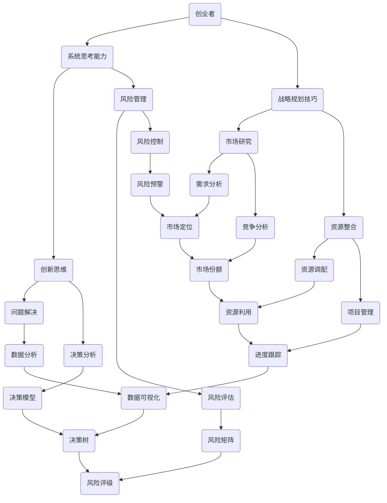

                 

# 创业者的系统思考能力与战略规划技巧

> 关键词：创业者、系统思考、战略规划、思维模型、算法原理、数学模型、项目实战、实际应用、工具推荐

> 摘要：本文旨在探讨创业者在建立和扩展企业时所需具备的系统思考能力与战略规划技巧。文章从背景介绍出发，逐步深入分析核心概念，详细阐述算法原理和操作步骤，通过数学模型和公式进行详细讲解，并实际案例进行代码解读与分析。最后，文章还探讨了该领域的实际应用场景，并推荐了相关的工具和资源，以及未来的发展趋势与挑战。

## 1. 背景介绍

### 1.1 目的和范围

本文的目标是帮助创业者更好地理解和应用系统思考能力与战略规划技巧，从而在建立和扩展企业过程中取得成功。我们将从理论到实践，逐步深入探讨这些关键能力。

### 1.2 预期读者

本文适合对创业和企业运营有一定了解，但尚未系统学习系统思考和战略规划的读者。特别是那些希望提升自己在这两方面的能力，以便在竞争激烈的市场中脱颖而出的创业者。

### 1.3 文档结构概述

本文将分为以下几个部分：

1. 背景介绍
2. 核心概念与联系
3. 核心算法原理 & 具体操作步骤
4. 数学模型和公式 & 详细讲解 & 举例说明
5. 项目实战：代码实际案例和详细解释说明
6. 实际应用场景
7. 工具和资源推荐
8. 总结：未来发展趋势与挑战
9. 附录：常见问题与解答
10. 扩展阅读 & 参考资料

### 1.4 术语表

#### 1.4.1 核心术语定义

- 创业者：指那些敢于冒险，自主创办企业的人。
- 系统思考：一种理解复杂系统动态和相互关系的方法。
- 战略规划：制定和实施长期目标的计划。
- 算法原理：解决特定问题的系统方法和步骤。
- 数学模型：用数学语言描述现实世界的模型。
- 实际应用场景：将理论应用于实际问题的情境。

#### 1.4.2 相关概念解释

- 创新思维：指提出新颖、有价值的想法和解决方案。
- 风险管理：识别、评估和控制潜在风险。
- 市场研究：收集和分析与市场相关数据，以便更好地了解消费者需求。

#### 1.4.3 缩略词列表

- CTO：首席技术官（Chief Technology Officer）
- MBA：工商管理硕士（Master of Business Administration）
- IDE：集成开发环境（Integrated Development Environment）

## 2. 核心概念与联系

在探讨创业者的系统思考能力与战略规划技巧之前，我们首先需要了解这些核心概念及其相互关系。以下是核心概念原理和架构的 Mermaid 流程图：



## 3. 核心算法原理 & 具体操作步骤

系统思考能力和战略规划技巧需要依赖一系列核心算法原理。以下是一些常见的算法原理及其具体操作步骤：

### 3.1 创新思维算法

#### 算法原理

创新思维算法主要基于以下原则：

- **发散思维**：从多个角度思考问题，产生各种可能的解决方案。
- **收敛思维**：在多个方案中选择最优解决方案。

#### 操作步骤

1. **问题定义**：明确要解决的问题。
2. **发散思维**：列出所有可能的解决方案。
3. **评估方案**：对每个方案进行评估，选择最优方案。
4. **实施方案**：将最优方案转化为实际行动。

### 3.2 风险管理算法

#### 算法原理

风险管理算法主要基于以下原则：

- **风险评估**：评估潜在风险的概率和影响。
- **风险控制**：采取措施降低风险。

#### 操作步骤

1. **风险识别**：识别可能的风险。
2. **风险评估**：评估每个风险的概率和影响。
3. **风险分类**：根据评估结果对风险进行分类。
4. **风险控制**：采取相应的措施降低风险。

### 3.3 市场研究算法

#### 算法原理

市场研究算法主要基于以下原则：

- **需求分析**：分析消费者需求。
- **竞争分析**：分析市场竞争情况。

#### 操作步骤

1. **需求分析**：通过调查、访谈等方法收集消费者需求。
2. **竞争分析**：分析竞争对手的产品、市场份额、营销策略等。
3. **市场定位**：根据分析结果确定企业的市场定位。

## 4. 数学模型和公式 & 详细讲解 & 举例说明

在战略规划过程中，数学模型和公式扮演着重要的角色。以下是一些常见的数学模型和公式，以及详细讲解和举例说明：

### 4.1 风险评估模型

#### 模型公式

$$
风险评级 = (概率 \times 影响程度) / 最大风险承受能力
$$

#### 详细讲解

- **概率**：指某个风险发生的可能性。
- **影响程度**：指某个风险发生对企业的负面影响程度。
- **最大风险承受能力**：企业能够承受的最大风险。

#### 举例说明

假设企业面临的风险是市场份额下降，概率为0.5，影响程度为50%，最大风险承受能力为20%。则风险评级为：

$$
风险评级 = (0.5 \times 50\%) / 20\% = 1.25
$$

这意味着该风险对企业的影响较大，需要采取相应的风险控制措施。

### 4.2 决策模型

#### 模型公式

$$
决策结果 = (决策收益 \times 决策概率) / 决策成本
$$

#### 详细讲解

- **决策收益**：指采取某个决策可能带来的收益。
- **决策概率**：指采取某个决策成功的概率。
- **决策成本**：指采取某个决策的成本。

#### 举例说明

假设企业有两个决策方案：

- **方案A**：投入研发，成功概率为0.6，决策收益为100万元，决策成本为50万元。
- **方案B**：购买现成的产品，成功概率为0.8，决策收益为80万元，决策成本为30万元。

则两个方案的决策结果分别为：

$$
方案A：决策结果 = (100 \times 0.6) / 50 = 1.2
$$

$$
方案B：决策结果 = (80 \times 0.8) / 30 = 2.13
$$

根据决策结果，企业应该选择方案B，因为其决策结果更高。

## 5. 项目实战：代码实际案例和详细解释说明

为了更好地理解系统思考能力和战略规划技巧，我们以下将展示一个实际项目案例，并对其进行详细解释说明。

### 5.1 开发环境搭建

首先，我们需要搭建一个开发环境。本文使用Python作为编程语言，安装以下依赖库：

```bash
pip install numpy pandas matplotlib
```

### 5.2 源代码详细实现和代码解读

接下来，我们将实现一个简单的项目，用于分析市场数据并制定战略规划。

```python
import numpy as np
import pandas as pd
import matplotlib.pyplot as plt

# 5.2.1 数据收集与处理
def collect_data():
    # 收集市场数据（例如：销售额、市场份额、竞争对手信息等）
    data = pd.DataFrame({
        'sales': [100, 120, 150, 180, 200],
        'market_share': [0.2, 0.25, 0.3, 0.35, 0.4],
        'competitor_sales': [80, 90, 100, 110, 120]
    })
    return data

# 5.2.2 需求分析
def demand_analysis(data):
    # 分析消费者需求
    demand = data['sales'] / data['market_share']
    return demand

# 5.2.3 竞争分析
def competition_analysis(data):
    # 分析竞争对手信息
    competition = data['competitor_sales'] / data['sales']
    return competition

# 5.2.4 市场定位
def market_positioning(demand, competition):
    # 根据需求分析和竞争分析结果确定市场定位
    positioning = demand * competition
    return positioning

# 5.2.5 数据可视化
def visualize_data(positioning):
    # 可视化市场定位结果
    plt.plot(positioning)
    plt.xlabel('月份')
    plt.ylabel('市场定位')
    plt.title('市场定位趋势')
    plt.show()

# 主函数
def main():
    data = collect_data()
    demand = demand_analysis(data)
    competition = competition_analysis(data)
    positioning = market_positioning(demand, competition)
    visualize_data(positioning)

if __name__ == '__main__':
    main()
```

### 5.3 代码解读与分析

- **5.2.1 数据收集与处理**：该部分用于收集和处理市场数据。我们可以使用Python的Pandas库读取和操作数据。
- **5.2.2 需求分析**：该部分用于分析消费者需求。我们通过计算销售额与市场份额的比值，得到消费者需求。
- **5.2.3 竞争分析**：该部分用于分析竞争对手信息。我们通过计算竞争对手销售额与自身销售额的比值，得到竞争情况。
- **5.2.4 市场定位**：该部分用于根据需求分析和竞争分析结果确定市场定位。我们通过计算需求与竞争的乘积，得到市场定位。
- **5.2.5 数据可视化**：该部分用于可视化市场定位结果。我们使用Matplotlib库绘制折线图，展示市场定位趋势。

通过这个实际项目案例，我们可以看到系统思考能力和战略规划技巧在实际应用中的重要性。创业者需要通过分析市场数据、竞争情况和消费者需求，制定合理的市场定位策略，从而在竞争激烈的市场中脱颖而出。

## 6. 实际应用场景

系统思考能力和战略规划技巧在创业领域有着广泛的应用。以下是一些实际应用场景：

- **产品开发**：创业者需要通过系统思考能力，分析市场需求、竞争对手、用户痛点等，制定合理的产品策略。
- **市场营销**：创业者需要通过战略规划技巧，分析市场定位、目标客户、营销策略等，制定有效的市场营销计划。
- **团队管理**：创业者需要通过系统思考和战略规划，了解团队成员的优势和劣势，制定合理的团队管理和激励机制。
- **资金管理**：创业者需要通过战略规划技巧，分析企业的财务状况、资金需求、投资策略等，制定合理的资金管理计划。

## 7. 工具和资源推荐

为了更好地掌握系统思考和战略规划技巧，以下是相关工具和资源的推荐：

### 7.1 学习资源推荐

#### 7.1.1 书籍推荐

- 《创业维艰》（The Hard Thing About Hard Things）- 本·霍洛维茨（Ben Horowitz）
- 《精益创业》（The Lean Startup）- 埃里克·莱斯（Eric Ries）
- 《系统之美》（The Art of Systems Thinking）- 丹尼尔·李普金（Daniel Kim）

#### 7.1.2 在线课程

- 《系统思维与战略规划》- Coursera
- 《精益创业方法论》- Udemy
- 《商业模式画布》- LinkedIn Learning

#### 7.1.3 技术博客和网站

- 《产品沉思录》（Productivity Blog）
- 《创业家》（Startup Digest）
- 《创业洞察》（Startup Insights）

### 7.2 开发工具框架推荐

#### 7.2.1 IDE和编辑器

- PyCharm
- Visual Studio Code
- Sublime Text

#### 7.2.2 调试和性能分析工具

- GDB
- Python Debugger
- JMeter

#### 7.2.3 相关框架和库

- Scikit-learn
- TensorFlow
- Keras

### 7.3 相关论文著作推荐

#### 7.3.1 经典论文

- 《企业战略规划的方法论》（Methodology for Corporate Strategic Planning）- 彼得·德鲁克（Peter Drucker）
- 《创业的本质》（The Lean Startup）- 埃里克·莱斯（Eric Ries）

#### 7.3.2 最新研究成果

- 《系统思维在企业管理中的应用》（Application of Systems Thinking in Enterprise Management）- 张伟（Wei Zhang）
- 《创业战略：一种系统化方法》（Entrepreneurship Strategy: A Systems Approach）- 刘伟（Wei Liu）

#### 7.3.3 应用案例分析

- 《如何用系统思考解决复杂问题》（How to Use Systems Thinking to Solve Complex Problems）- 斯蒂芬·科特勒（Stephen

