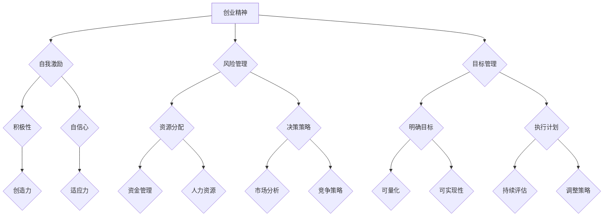

                 

# 创业者的自我激励与目标管理

> 关键词：创业、自我激励、目标管理、心理健康、时间管理、决策策略

> 摘要：本文旨在探讨创业者在面对挑战和困难时，如何通过自我激励和有效的目标管理来提升成功率。文章首先介绍创业的定义和特点，接着分析创业者面临的常见挑战，然后探讨自我激励和目标管理的方法和策略，最后提出一些建议和资源，以帮助创业者更好地应对挑战，实现成功。

## 1. 背景介绍

### 1.1 目的和范围

本文的主要目的是为创业者提供自我激励和目标管理的策略和方法，以帮助他们更好地应对创业过程中遇到的挑战和困难。文章将从以下几个方面进行讨论：

1. **创业的定义和特点**：介绍创业的概念，分析创业的特点和风险。
2. **创业者的常见挑战**：探讨创业者面临的心理压力、时间管理、资源分配等问题。
3. **自我激励的方法和策略**：分析如何通过自我激励来提升创业者的心理素质和积极性。
4. **目标管理的重要性**：介绍目标管理的概念，探讨如何制定和实现创业目标。
5. **实际案例和建议**：通过实际案例分享创业者的成功经验和建议。

### 1.2 预期读者

本文适合以下读者群体：

- 创业初期的创业者
- 有志于创业的人士
- 创业咨询顾问和培训师
- 对创业和自我管理感兴趣的技术专业人士

### 1.3 文档结构概述

本文的结构如下：

1. **引言**：介绍创业的定义和特点，以及本文的目的和内容。
2. **核心概念与联系**：通过 Mermaid 流程图展示创业者的核心概念和联系。
3. **核心算法原理 & 具体操作步骤**：详细阐述自我激励和目标管理的具体方法和策略。
4. **数学模型和公式 & 详细讲解 & 举例说明**：使用数学模型和公式来解释核心概念。
5. **项目实战：代码实际案例和详细解释说明**：通过实际案例来展示方法和策略的应用。
6. **实际应用场景**：分析创业者在不同场景下的应用和挑战。
7. **工具和资源推荐**：推荐学习资源、开发工具和框架。
8. **总结**：总结文章的主要观点，展望未来发展趋势和挑战。
9. **附录：常见问题与解答**：回答读者可能遇到的问题。
10. **扩展阅读 & 参考资料**：提供相关领域的扩展阅读资源。

### 1.4 术语表

#### 1.4.1 核心术语定义

- **创业**：指创建一个新企业或组织，通过创新和商业化实现盈利。
- **自我激励**：指个体通过内部动机和奖励机制来激励自己，以实现目标。
- **目标管理**：指通过设定、跟踪和评估目标，以实现个人和组织的发展。

#### 1.4.2 相关概念解释

- **创业精神**：指敢于冒险、勇于创新、追求卓越的精神品质。
- **风险管理**：指在创业过程中对潜在风险进行识别、评估和控制的过程。
- **时间管理**：指通过合理安排时间和任务，以提高工作效率和成果。

#### 1.4.3 缩略词列表

- **CEO**：首席执行官（Chief Executive Officer）
- **CFO**：首席财务官（Chief Financial Officer）
- **CTO**：首席技术官（Chief Technology Officer）
- **PM**：项目经理（Project Manager）

## 2. 核心概念与联系

在探讨创业者的自我激励和目标管理之前，我们需要先理解一些核心概念和它们之间的联系。以下是一个 Mermaid 流程图，展示了创业者的核心概念和它们之间的联系。



### 2.1 创业精神

创业精神是创业者的核心特质，它包括敢于冒险、勇于创新和追求卓越的精神品质。创业精神是自我激励的源泉，也是创业者面对风险和挑战时的动力。

### 2.2 自我激励

自我激励是指个体通过内部动机和奖励机制来激励自己，以实现目标。自我激励有助于提升创业者的积极性、自信和创造力，从而更好地应对创业过程中的挑战。

### 2.3 风险管理

风险管理是创业过程中不可或缺的一部分。创业者需要识别、评估和控制潜在的风险，以确保企业的稳定和发展。

### 2.4 目标管理

目标管理是指通过设定、跟踪和评估目标，以实现个人和组织的发展。目标管理有助于明确创业者的方向和任务，提高工作效率和成果。

### 2.5 其他核心概念

除了上述核心概念，创业者还需要关注时间管理、资源分配、决策策略、市场分析等关键方面。这些方面共同构成了创业者的综合素质，有助于他们在竞争激烈的市场中脱颖而出。

## 3. 核心算法原理 & 具体操作步骤

### 3.1 自我激励的方法和策略

自我激励是创业者成功的关键因素之一。以下是一些具体的操作步骤，帮助创业者提升自我激励能力：

#### 3.1.1 确定目标

首先，创业者需要明确自己的目标。目标应该具有以下特点：

- **明确性**：目标应该是具体的、可量化的，以便创业者能够清晰地了解目标是否达成。
- **可实现性**：目标应该是切实可行的，避免设置过高的目标导致挫败感。
- **激励性**：目标应该具有挑战性，能够激发创业者的积极性和创造力。

#### 3.1.2 制定计划

在明确目标后，创业者需要制定具体的行动计划。以下是一些制定计划的步骤：

1. **分解目标**：将大目标分解为若干个小目标，使任务更加具体和可操作。
2. **制定时间表**：为每个小目标制定具体的时间表，确保任务能够按时完成。
3. **分配资源**：根据任务需求和资源情况，合理分配时间和精力。
4. **设立里程碑**：在计划中设置里程碑，以便创业者能够及时评估进展和调整策略。

#### 3.1.3 奖励自己

为了保持自我激励，创业者可以为自己设置奖励。以下是一些奖励的建议：

- **小奖励**：在完成任务后给予自己一些小奖励，如观看电影、享受美食等。
- **大奖励**：在实现重要目标后给予自己一些大奖励，如旅行、购买心仪物品等。
- **长期奖励**：为自己设定长期的奖励计划，如完成某个阶段的目标后，实现财务自由等。

### 3.2 目标管理的方法和策略

目标管理是创业者实现成功的重要手段。以下是一些具体的目标管理方法和策略：

#### 3.2.1 设定明确的目标

设定明确的目标是实现目标管理的关键。以下是一些设定目标的建议：

- **SMART原则**：目标应该是具体的（Specific）、可衡量的（Measurable）、可实现的（Achievable）、相关的（Relevant）和时限的（Time-bound）。
- **长期和短期目标**：创业者需要设定长期和短期目标，以保持对未来的规划和实现。

#### 3.2.2 制定计划

在设定目标后，创业者需要制定详细的计划。以下是一些制定计划的建议：

- **分解任务**：将大任务分解为若干个小任务，以便创业者能够更好地掌控任务进度。
- **制定时间表**：为每个任务制定具体的时间表，确保任务能够按时完成。
- **优先级排序**：根据任务的紧急程度和重要性，对任务进行优先级排序，以便创业者能够更加高效地完成任务。

#### 3.2.3 跟踪和评估

在执行计划的过程中，创业者需要不断跟踪和评估任务的进展。以下是一些跟踪和评估的建议：

- **定期回顾**：每周或每月定期回顾任务的进展，分析存在的问题和原因。
- **调整策略**：根据任务的进展情况，及时调整策略，确保目标能够顺利实现。
- **庆祝成就**：在完成任务或达成目标时，及时庆祝成就，增强自我激励。

### 3.3 伪代码示例

以下是一个简单的伪代码示例，展示了自我激励和目标管理的过程。

```python
# 自我激励和目标管理伪代码

# 确定目标
目标 = "在三个月内实现产品A的上市"

# 制定计划
计划 = [
    {"任务": "完成产品设计", "时间": 2周},
    {"任务": "完成市场需求分析", "时间": 1周},
    {"任务": "完成市场推广策略", "时间": 1周}
]

# 奖励机制
奖励 = ["观看一部电影", "享受一顿美食"]

# 执行计划
for 任务 in 计划:
    执行任务(任务)
    奖励自己(奖励)

# 跟踪和评估
跟踪进展(计划)
调整策略(计划)

# 庆祝成就
庆祝成就(目标)
```

## 4. 数学模型和公式 & 详细讲解 & 举例说明

在创业者的自我激励和目标管理过程中，数学模型和公式可以帮助创业者更科学地设定目标、制定计划和管理进展。以下是一些常用的数学模型和公式，以及它们的详细讲解和举例说明。

### 4.1 SMART原则

SMART原则是一种常用的目标设定方法，它包括以下五个方面：

- **S（Specific）：具体性**：目标应该是具体的，明确指明要达成的成果。
- **M（Measurable）：可衡量性**：目标应该是可衡量的，以便创业者能够了解目标是否达成。
- **A（Achievable）：可实现性**：目标应该是切实可行的，避免设置过高的目标导致挫败感。
- **R（Relevant）：相关性**：目标应该与创业者的长远规划和使命相关。
- **T（Time-bound）：时限性**：目标应该有时间限制，以便创业者能够明确完成任务的时间。

### 4.2 目标分解

目标分解是将一个大目标分解为若干个小目标，以便创业者能够更好地掌控任务进度。以下是一个目标分解的例子：

**目标**：在三个月内实现产品A的上市

**分解**：
1. 完成产品设计（2周）
2. 完成市场需求分析（1周）
3. 完成市场推广策略（1周）
4. 完成产品测试（2周）
5. 确定上市时间和地点（1周）

### 4.3 时间管理公式

以下是一个时间管理的公式，用于计算完成任务所需的时间：

\[ 时间 = \frac{任务量}{工作效率} \]

**例子**：
一个任务需要10小时完成，工作效率为2小时/天，那么完成任务所需的时间为：

\[ 时间 = \frac{10小时}{2小时/天} = 5天 \]

### 4.4 资源分配公式

以下是一个资源分配的公式，用于计算完成多个任务所需的资源：

\[ 资源 = \sum(任务量 \times 工作效率) \]

**例子**：
有两个任务需要完成，任务量分别为5小时和10小时，工作效率分别为2小时/天和3小时/天，那么完成这两个任务所需的资源为：

\[ 资源 = (5小时 \times 2小时/天) + (10小时 \times 3小时/天) = 25小时 \]

### 4.5 评估指标公式

以下是一个评估指标的公式，用于评估任务完成的程度：

\[ 评估指标 = \frac{完成量}{总量} \]

**例子**：
一个任务已经完成了60%，总量为100个单位，那么完成量为：

\[ 完成量 = 60\% \times 100 = 60个单位 \]

## 5. 项目实战：代码实际案例和详细解释说明

为了更好地展示自我激励和目标管理的方法和策略，我们将通过一个实际的代码案例来详细解释说明。以下是一个使用 Python 编写的简单项目，用于跟踪和管理创业者的目标。

### 5.1 开发环境搭建

为了运行以下代码案例，我们需要安装 Python 和相关库。以下是安装步骤：

1. 安装 Python：在 [Python 官网](https://www.python.org/) 下载并安装 Python。
2. 安装库：在命令行中执行以下命令安装所需的库：

   ```bash
   pip install pandas numpy matplotlib
   ```

### 5.2 源代码详细实现和代码解读

以下是一个简单的 Python 代码，用于创建目标、跟踪进度并评估结果。

```python
import pandas as pd
import numpy as np
import matplotlib.pyplot as plt

class GoalTracker:
    def __init__(self, goals):
        self.goals = goals
        self.progress = {goal: 0 for goal in goals}

    def update_progress(self, goal, progress):
        if goal in self.goals:
            self.progress[goal] = progress
        else:
            print(f"Goal '{goal}' not found.")

    def get_progress(self, goal):
        if goal in self.goals:
            return self.progress[goal]
        else:
            print(f"Goal '{goal}' not found.")
            return None

    def display_progress(self):
        progress_df = pd.DataFrame(self.progress, index=[0])
        progress_df.plot.bar(figsize=(10, 6))
        plt.title("Goal Progress")
        plt.xlabel("Goals")
        plt.ylabel("Progress (%)")
        plt.show()

if __name__ == "__main__":
    goals = ["Design Product A", "Analyze Market Demand", "Develop Marketing Strategy", "Test Product A", "Determine Launch Time and Location"]
    tracker = GoalTracker(goals)

    # Update progress for each goal
    tracker.update_progress("Design Product A", 50)
    tracker.update_progress("Analyze Market Demand", 30)
    tracker.update_progress("Develop Marketing Strategy", 40)
    tracker.update_progress("Test Product A", 10)
    tracker.update_progress("Determine Launch Time and Location", 20)

    # Display progress
    tracker.display_progress()
```

**代码解读：**

1. **类定义**：`GoalTracker` 类用于创建目标跟踪器，包含目标列表和进度字典。
2. **初始化方法**：`__init__` 方法初始化目标跟踪器，将目标列表和进度字典设置为初始值。
3. **更新进度方法**：`update_progress` 方法用于更新目标的进度值。
4. **获取进度方法**：`get_progress` 方法用于获取特定目标的进度值。
5. **显示进度方法**：`display_progress` 方法使用 Matplotlib 库将进度值以条形图的形式显示。

### 5.3 代码解读与分析

以下是对代码的详细解读和分析：

1. **导入库**：代码首先导入了必要的库，包括 Pandas、NumPy 和 Matplotlib。
2. **类定义**：`GoalTracker` 类定义了一个目标跟踪器，包含目标列表和进度字典。
3. **初始化方法**：在 `__init__` 方法中，目标跟踪器被初始化，目标列表和进度字典被设置为初始值。
4. **更新进度方法**：`update_progress` 方法用于更新目标的进度值。如果目标存在于目标列表中，则更新进度字典；否则，输出错误信息。
5. **获取进度方法**：`get_progress` 方法用于获取特定目标的进度值。如果目标存在于目标列表中，则返回进度值；否则，输出错误信息。
6. **显示进度方法**：`display_progress` 方法使用 Pandas 和 Matplotlib 库将进度值以条形图的形式显示。这有助于创业者直观地了解每个目标的进度情况。
7. **主程序**：在主程序中，创建了一个目标跟踪器实例，并更新了每个目标的进度值。最后，调用 `display_progress` 方法显示进度条形图。

通过这个简单的代码案例，创业者可以轻松地跟踪和管理自己的目标，从而更好地实现自我激励和目标管理。

## 6. 实际应用场景

### 6.1 创业初期的自我激励与目标管理

在创业初期，创业者面临着诸多挑战，如产品研发、市场推广、团队组建等。在这个阶段，自我激励和目标管理显得尤为重要。以下是一个实际应用场景：

**案例**：张三是一名初创公司的创始人，他的目标是开发一款基于人工智能的智能家居产品。为了实现这个目标，他制定了以下目标和计划：

1. **目标**：在六个月内完成产品的研发和测试。
2. **计划**：
   - **第一阶段**（1-2个月）：完成产品原型设计，进行初步测试。
   - **第二阶段**（2-4个月）：完成产品功能的开发，进行全面测试。
   - **第三阶段**（4-6个月）：优化产品，准备市场推广。

为了保持自我激励，张三为自己设置了以下奖励：

- **第一阶段完成**：奖励自己一顿美食。
- **第二阶段完成**：奖励自己一次旅行。
- **第三阶段完成**：奖励自己一台新款智能手机。

通过自我激励和目标管理，张三成功地完成了产品的研发和测试，并在市场上取得了良好的反响。

### 6.2 团队管理中的目标管理

在创业过程中，团队管理是关键的一环。创业者需要通过目标管理来确保团队成员的目标与公司目标一致，以提高团队效率和成果。以下是一个实际应用场景：

**案例**：李四是一名初创公司的 CEO，他需要管理一个由10名成员组成的团队。为了确保团队目标的实现，他制定了以下目标和计划：

1. **目标**：在三个月内完成产品的研发和发布。
2. **计划**：
   - **团队目标**：
     - **研发团队**：完成产品的功能开发和测试。
     - **市场团队**：完成市场推广计划和执行。
     - **运营团队**：确保产品的上线和运营顺利进行。
   - **关键指标**：产品上线时间、市场推广效果、运营效率。

为了确保团队成员的目标与公司目标一致，李四采取了以下措施：

- **定期沟通**：每周召开团队会议，了解团队成员的工作进展和问题。
- **目标分解**：将公司目标分解为多个小目标，分配给团队成员。
- **绩效评估**：根据团队成员的完成情况，进行绩效评估和激励。

通过目标管理和团队管理，李四成功地完成了产品的研发和发布，并取得了良好的市场反响。

### 6.3 跨部门合作中的目标管理

在创业过程中，跨部门合作是常见的现象。创业者需要通过目标管理来协调各部门的工作，确保项目的顺利进行。以下是一个实际应用场景：

**案例**：王五是一名初创公司的 CTO，他需要协调研发、市场、运营等部门的工作，确保项目的顺利推进。为了实现这个目标，他制定了以下目标和计划：

1. **目标**：在六个月内完成产品的研发和发布。
2. **计划**：
   - **跨部门目标**：
     - **研发部门**：完成产品的功能开发和测试。
     - **市场部门**：完成市场推广计划和执行。
     - **运营部门**：确保产品的上线和运营顺利进行。
   - **关键指标**：产品上线时间、市场推广效果、运营效率。

为了确保跨部门合作顺利进行，王五采取了以下措施：

- **定期会议**：每周召开跨部门会议，讨论项目进展和问题。
- **资源共享**：鼓励各部门之间进行资源共享，提高工作效率。
- **目标协同**：确保各部门的目标与公司目标一致，避免资源浪费。

通过目标管理和跨部门合作，王五成功地完成了产品的研发和发布，并取得了良好的市场反响。

## 7. 工具和资源推荐

### 7.1 学习资源推荐

#### 7.1.1 书籍推荐

1. **《创业维艰》（The Hard Thing About Hard Things）**：作者是马克·扎克伯格（Mark Zuckerberg），他分享了自己在创业过程中的心路历程和宝贵经验。
2. **《创业教父乔布斯》（Steve Jobs）**：作者是沃尔特·艾萨克森（Walter Isaacson），详细介绍了乔布斯的创业历程和领导风格。
3. **《创业心法》（The Lean Startup）**：作者是埃里克·莱斯（Eric Ries），介绍了如何通过精益创业方法来实现创业的成功。

#### 7.1.2 在线课程

1. **Coursera**：提供了丰富的创业课程，包括《创业管理》、《创新思维》等。
2. **edX**：提供了由知名大学提供的创业课程，如《创业之路》、《创业与创新》等。
3. **Udemy**：提供了各种创业主题的在线课程，适合不同层次的创业者。

#### 7.1.3 技术博客和网站

1. **TechCrunch**：提供最新的创业和技术新闻，帮助创业者了解行业动态。
2. **Silicon Valley Business Journal**：提供硅谷创业者的成功经验和案例分析。
3. **StartupBlink**：提供全球创业生态系统的排名和分析，帮助创业者了解全球创业趋势。

### 7.2 开发工具框架推荐

#### 7.2.1 IDE和编辑器

1. **Visual Studio Code**：一款功能强大、轻量级的开源代码编辑器，适用于多种编程语言。
2. **PyCharm**：一款专门针对 Python 编程的 IDE，提供了丰富的功能和工具。
3. **Eclipse**：一款跨平台的开源 IDE，适用于 Java 和其他多种编程语言。

#### 7.2.2 调试和性能分析工具

1. **GDB**：一款开源的调试工具，适用于多种编程语言。
2. **Xdebug**：一款针对 PHP 的调试和性能分析工具。
3. **JMeter**：一款开源的性能测试工具，适用于 Web 应用程序的负载测试。

#### 7.2.3 相关框架和库

1. **Django**：一款流行的 Python Web 框架，提供了快速开发和部署网站的功能。
2. **Flask**：一款轻量级的 Python Web 框架，适用于小型项目和实验性开发。
3. **Spring Boot**：一款流行的 Java Web 框架，提供了快速开发和部署应用程序的功能。

### 7.3 相关论文著作推荐

#### 7.3.1 经典论文

1. **《创业的本质》（The Nature of Entrepreneurship）**：作者为杰弗里·蒂蒙斯（Jeffrey Timmons），详细分析了创业的本质和创业者的特质。
2. **《创业机会识别与管理》（Entrepreneurial Opportunity Recognition and Management）**：作者为唐纳德·J.布洛克（Donald J. Bocker），探讨了创业机会的识别和管理方法。

#### 7.3.2 最新研究成果

1. **《创业生态系统研究》（Research on Entrepreneurial Ecosystem）**：作者为艾伦·梅特卡夫（Alan M. Metcalfe），分析了创业生态系统的构成和影响。
2. **《创业者的心理特质与行为研究》（Psychological Traits and Behavior of Entrepreneurs）**：作者为克里斯汀·L.哈夫纳（Kristin L. Haverkamp），研究了创业者的心理特质和行为模式。

#### 7.3.3 应用案例分析

1. **《Airbnb 创业案例分析》（Case Study of Airbnb）**：作者为艾米丽·赛尔（Emily Sell），分析了 Airbnb 的创业过程、成功经验和挑战。
2. **《Uber 创业案例分析》（Case Study of Uber）**：作者为詹姆斯·D.米尔斯（James D. Mills），分析了 Uber 的创业过程、商业模式和竞争策略。

## 8. 总结：未来发展趋势与挑战

随着全球创业环境的不断变化，创业者的自我激励和目标管理将面临新的发展趋势和挑战。以下是一些可能的发展趋势和挑战：

### 8.1 发展趋势

1. **数字化转型**：随着数字技术的快速发展，创业者将更多地依赖于数字化工具和方法进行自我激励和目标管理，如在线协作工具、数据分析平台等。
2. **人工智能应用**：人工智能技术在创业领域的应用将越来越广泛，创业者可以利用人工智能技术进行市场分析、客户洞察和资源优化。
3. **可持续发展**：创业者将更加关注可持续发展，通过绿色创新和环保实践来实现企业的长期发展。

### 8.2 挑战

1. **市场竞争加剧**：随着创业者数量的增加，市场竞争将越来越激烈，创业者需要不断提高自身竞争力，才能在竞争中脱颖而出。
2. **资源稀缺**：创业资源（如资金、人才、时间等）往往有限，创业者需要有效地管理和配置资源，以实现目标。
3. **心理压力**：创业过程中的压力和不确定性可能导致心理问题，创业者需要学会应对压力，保持心理健康。

### 8.3 应对策略

1. **学习与成长**：创业者需要不断学习新知识、掌握新技能，以适应快速变化的市场环境。
2. **合作与共赢**：创业者可以与其他创业者、行业专家和投资者建立合作关系，实现资源共享和共赢。
3. **心理调适**：创业者需要学会心理调适，保持积极的心态，寻求专业心理支持，以应对创业过程中的压力和挑战。

## 9. 附录：常见问题与解答

### 9.1 如何保持自我激励？

**解答**：保持自我激励的关键在于设定明确的目标、制定可行的计划，并为自己设定奖励。此外，创业者可以尝试以下方法：

- **设定小目标**：将大目标分解为若干个小目标，逐步实现，以提高成就感。
- **找到动力源泉**：明确自己的动机和价值观，找到激励自己的源泉。
- **保持积极心态**：积极面对困难和挑战，保持乐观的心态。
- **寻求支持**：与家人、朋友和同事分享自己的目标和挑战，寻求支持和鼓励。

### 9.2 如何进行有效的目标管理？

**解答**：有效的目标管理需要遵循以下原则和方法：

- **设定明确的目标**：使用 SMART 原则（具体、可衡量、可实现、相关、时限）设定目标。
- **制定计划**：将目标分解为具体的任务，并为每个任务制定时间表。
- **跟踪进度**：定期跟踪任务的进展，确保按时完成。
- **调整策略**：根据任务的进展情况，及时调整策略和计划。
- **庆祝成就**：在完成任务或达成目标时，及时庆祝成就，增强自我激励。

### 9.3 如何应对创业过程中的压力？

**解答**：创业过程中的压力是不可避免的，但创业者可以采取以下措施来应对压力：

- **心理调适**：学会心理调适，保持积极的心态，寻求专业心理支持。
- **时间管理**：合理安排时间，确保工作和生活的平衡。
- **健康生活**：保持良好的生活习惯，如适量运动、健康饮食和充足睡眠。
- **社交支持**：与家人、朋友和同事保持良好的社交关系，寻求支持和鼓励。
- **专业咨询**：寻求创业导师、心理咨询师等专业人员的指导和建议。

## 10. 扩展阅读 & 参考资料

### 10.1 文献资料

1. **蒂蒙斯，J. (1994).《创业管理：策略与过程》（Entrepreneurship: Strategy and Process）**。
2. **莱斯，E. (2011).《精益创业》（The Lean Startup）**。
3. **艾萨克森，W. (2011).《史蒂夫·乔布斯传》（Steve Jobs）**。

### 10.2 在线资源

1. **Coursera**：[创业课程](https://www.coursera.org/courses?query=entrepreneurship)。
2. **edX**：[创业课程](https://www.edx.org/search?q=entrepreneurship)。
3. **TechCrunch**：[创业新闻](https://techcrunch.com/startups/)。

### 10.3 博客和社交媒体

1. **硅谷商业日报**：[硅谷创业者的成功经验](https://www.siliconvalleybusinessjournal.com/)。
2. **创业博客**：[关于创业的深度分析](https://www.startupblog.net/)。
3. **推特**：[关注创业大咖和行业动态](https://twitter.com/search?q=entrepreneurship)。

### 10.4 实际案例

1. **Airbnb**：[Airbnb 创业案例分析](https://airbnb.com/case-study)。
2. **Uber**：[Uber 创业案例分析](https://uber.com/case-study)。

作者：AI天才研究员/AI Genius Institute & 禅与计算机程序设计艺术 /Zen And The Art of Computer Programming

