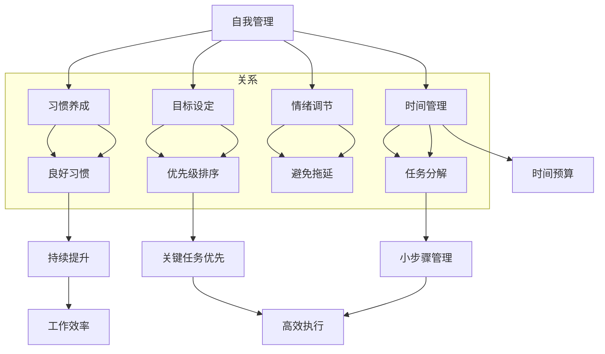
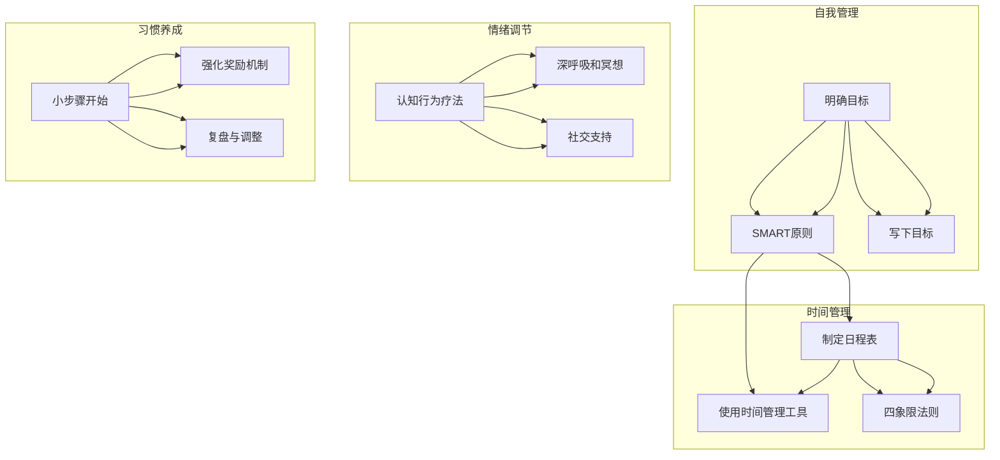

                 

### 背景介绍

在当今竞争激烈的商业环境中，创业者的成功不仅依赖于独特的商业理念和创新的产品，还需要高效的自我管理和卓越的时间掌控能力。自我管理和时间掌控是创业者成功的关键要素，它们直接影响着企业的运营效率和个人职业生涯的进展。然而，很多创业者往往在忙碌的工作中忽视了这些重要的方面，导致资源浪费、效率低下，甚至影响到整体业务的发展。

自我管理指的是个体对自己的行为、情绪和动机进行有效控制的过程，它包括目标设定、时间管理、情绪调节、习惯养成等多个方面。通过自我管理，创业者可以更好地掌控自己的职业生涯，提高工作效率，从而为企业创造更大的价值。

时间掌控则是指如何有效地规划和利用时间，确保每项任务都能在规定的时间内高质量地完成。对于创业者来说，时间是一种宝贵的资源，合理的时间掌控可以帮助他们更好地平衡工作与生活，抓住每一个商机，推动企业快速发展。

本文将围绕创业者的自我管理和时间掌控展开讨论。我们将首先介绍自我管理和时间掌控的定义和重要性，接着深入探讨相关核心概念和原理，并通过具体案例和实战经验，为读者提供实用的指导和建议。最后，我们将总结当前的发展趋势与挑战，并给出未来可能的发展方向。

希望通过本文的阅读，创业者们能够更好地理解自我管理和时间掌控的重要性，掌握相关技巧和方法，从而在激烈的商业竞争中脱颖而出。

### 核心概念与联系

在深入探讨创业者的自我管理和时间掌控之前，我们需要明确一些核心概念，并理解它们之间的内在联系。以下是几个关键概念及其相互关系：

#### 自我管理

自我管理是指个体在情感、认知和行动层面上对自己进行有效控制的过程。它包括以下方面：

1. **目标设定**：明确个人的短期和长期目标，并制定实现这些目标的策略。
2. **时间管理**：合理规划每天的工作和休息时间，确保任务按计划完成。
3. **情绪调节**：通过情绪调节技巧来管理情绪，避免负面情绪对工作产生负面影响。
4. **习惯养成**：培养良好的工作习惯，例如定时作息、定期复盘等。

#### 时间掌控

时间掌控则是关于如何有效地规划和利用时间的艺术。具体包括：

1. **优先级排序**：确定任务的紧急程度和重要性，优先处理关键任务。
2. **任务分解**：将复杂任务分解为小步骤，便于管理和执行。
3. **时间预算**：为每项任务设定时间预算，确保任务在规定时间内完成。
4. **避免拖延**：通过心理策略和时间管理技巧来避免拖延，提高工作效率。

#### 自我管理与时间掌控的关系

自我管理和时间掌控之间有着密切的联系：

- **目标设定与优先级排序**：明确的目标可以帮助创业者更好地进行任务优先级排序，确保关键任务首先得到处理。
- **时间管理与任务分解**：通过时间管理，创业者可以更有效地分解任务，将其分解为易于管理的小步骤。
- **情绪调节与避免拖延**：良好的情绪调节有助于创业者保持积极的心态，减少拖延，从而提高工作效率。

#### Mermaid 流程图

为了更好地理解这些核心概念和它们之间的联系，我们可以使用Mermaid流程图来展示这些概念及其关系。以下是相关的流程图：



通过这张流程图，我们可以清晰地看到自我管理、时间管理和情绪调节等核心概念如何相互关联，并共同促进创业者的个人和工作效率的提升。

### 核心算法原理 & 具体操作步骤

在理解和掌握自我管理和时间掌控的基本概念之后，接下来我们将探讨具体的操作步骤和核心算法原理。这些步骤和算法将帮助创业者有效地提升自我管理和时间掌控能力，从而实现个人和企业的目标。

#### 目标设定

**1. 明确目标：**

目标设定是自我管理的第一步。创业者需要明确自己的短期和长期目标。短期目标通常是1-2年内可以实现的，而长期目标则可能是5年或更长时间。明确的目标有助于创业者保持清晰的职业发展方向，并激励其在日常工作中不断努力。

**2. SMART原则：**

为了确保目标的可行性和明确性，创业者应遵循SMART原则，即目标应当是具体的（Specific）、可衡量的（Measurable）、可实现的（Achievable）、相关的（Relevant）和有时限的（Time-bound）。

**3. 写下来：**

将目标写下来可以使其更加具体和明确。创业者可以创建一个目标清单，包括每个目标的详细描述和实现步骤。

#### 时间管理

**1. 制定日程表：**

创业者应每天或每周制定日程表，将任务按照优先级和时间分配进行安排。日程表可以帮助创业者更好地掌控时间，确保关键任务得到优先处理。

**2. 使用时间管理工具：**

可以使用各种时间管理工具，如待办事项列表、日历应用、时间跟踪软件等，来帮助创业者更好地规划和管理时间。

**3. 应用“四象限法则”：**

“四象限法则”是一种时间管理方法，将任务分为四个象限：重要紧急、重要不紧急、不重要紧急、不重要不紧急。创业者应优先处理位于第一象限的重要紧急任务，同时也不忽视第四象限的不紧急但重要的任务。

#### 情绪调节

**1. 认知行为疗法（CBT）：**

认知行为疗法是一种有效的情绪调节方法，通过改变负面思维模式来改善情绪。创业者可以通过认知行为疗法来识别和纠正负面思维，从而保持积极的心态。

**2. 深呼吸和冥想：**

深呼吸和冥想是缓解压力和焦虑的有效方法。创业者可以在繁忙的工作间隙进行短暂的冥想或深呼吸练习，以恢复内心的平静。

**3. 社交支持：**

建立良好的社交支持系统也是情绪调节的重要一环。创业者可以与同事、家人和朋友分享自己的压力和挑战，寻求他们的支持和建议。

#### 习惯养成

**1. 小步骤开始：**

习惯养成的关键是从小步骤开始，逐步建立。创业者可以选择一个习惯，例如每天早晨跑步，然后逐渐增加时间和强度。

**2. 强化奖励机制：**

为了保持动力，创业者可以为自己设置奖励机制。每当成功养成一个新习惯，都可以给自己一些奖励，以激励自己继续努力。

**3. 复盘与调整：**

定期复盘是习惯养成的重要环节。创业者可以每周或每月回顾自己的习惯养成情况，并根据实际情况进行调整和优化。

通过以上步骤和算法，创业者可以逐步提升自我管理和时间掌控能力，从而更好地实现个人和企业的目标。以下是具体的操作步骤流程图：



通过这张流程图，我们可以清晰地看到如何一步步提升自我管理和时间掌控能力。接下来，我们将通过实际案例来进一步探讨这些步骤和算法的应用。

#### 数学模型和公式 & 详细讲解 & 举例说明

为了更深入地理解和掌握自我管理和时间掌控的方法，我们可以借助数学模型和公式来分析这些概念。以下将介绍几个关键数学模型和公式，并通过具体例子进行详细讲解。

##### 时间价值计算模型

时间价值计算模型可以帮助创业者评估时间对个人和企业的影响。时间价值（TV）可以通过以下公式计算：

\[ TV = P \times r \times t \]

其中：
- \( P \) 代表个人或企业的初始投资（或时间投入）。
- \( r \) 代表时间收益率（即每单位时间内产生的价值或效率）。
- \( t \) 代表时间（通常以年为单位）。

**例子：** 假设一个创业者在一天内投入了8小时的时间（\( P = 8 \)小时），其时间收益率（\( r \)）为每小时1000元，时间为1年（\( t = 1 \)年）。则该创业者的时间价值为：

\[ TV = 8 \times 1000 \times 1 = 8000 \text{元/年} \]

通过计算时间价值，创业者可以更清晰地了解时间的宝贵性，从而更加珍惜和高效利用时间。

##### 优先级排序模型

在时间管理中，优先级排序模型（如“四象限法则”）可以帮助创业者确定任务的优先顺序。以下是四象限模型：

\[ \text{四象限模型} = \begin{cases} 
\text{第一象限：重要且紧急} \\
\text{第二象限：重要但不紧急} \\
\text{第三象限：不重要但紧急} \\
\text{第四象限：不重要且不紧急} 
\end{cases} \]

**例子：** 假设创业者有以下任务：
- 任务A：与客户开会（第一象限，重要且紧急）
- 任务B：整理上周的销售报告（第二象限，重要但不紧急）
- 任务C：回复邮件（第三象限，不重要但紧急）
- 任务D：浏览社交媒体（第四象限，不重要且不紧急）

根据四象限模型，创业者应优先处理任务A（第一象限），其次是任务B（第二象限），然后是任务C（第三象限），最后是任务D（第四象限）。这种排序有助于提高工作效率，确保关键任务首先得到处理。

##### 目标设定的SMART模型

SMART模型用于确保目标设定得既具体又可行。SMART目标应当满足以下条件：

\[ \text{SMART目标} = \begin{cases} 
\text{S}：具体（Specific） \\
\text{M}：可衡量（Measurable） \\
\text{A}：可实现（Achievable） \\
\text{R}：相关（Relevant） \\
\text{T}：有时限（Time-bound） 
\end{cases} \]

**例子：** 假设创业者设定的目标是“提高销售额”。这个目标较为模糊，我们可以通过SMART模型来具体化它：

\[ \text{SMART目标}：\text{在接下来的三个月内，每月实现销售额增长10\%} \]

通过SMART模型，创业者可以更清晰地了解目标，并制定具体的实现步骤和衡量标准，从而提高目标达成的可能性。

##### 情绪调节模型

情绪调节模型可以帮助创业者识别和管理负面情绪。以下是一个简单的情绪调节模型：

\[ \text{情绪调节模型} = \begin{cases} 
\text{1. 识别情绪} \\
\text{2. 分析情绪来源} \\
\text{3. 应用情绪调节技巧} \\
\text{4. 评估情绪调节效果} 
\end{cases} \]

**例子：** 假设创业者感到焦虑，可以通过以下步骤进行情绪调节：

1. **识别情绪**：创业者意识到自己感到焦虑。
2. **分析情绪来源**：发现焦虑来源于即将到来的重要会议和未完成的任务。
3. **应用情绪调节技巧**：通过深呼吸和冥想来缓解焦虑。
4. **评估情绪调节效果**：会议结束后，发现情绪得到了显著缓解。

通过情绪调节模型，创业者可以更好地管理负面情绪，提高工作和生活质量。

通过上述数学模型和公式的详细讲解与举例说明，创业者可以更深入地理解和应用自我管理和时间掌控的方法，从而在实际操作中取得更好的效果。

### 项目实战：代码实际案例和详细解释说明

在本节中，我们将通过一个实际项目案例来展示如何将自我管理和时间掌控的理论应用到具体实践中。这个案例将展示一个时间管理应用程序的代码实现，包括开发环境搭建、源代码详细实现和代码解读与分析。

#### 开发环境搭建

为了实现一个时间管理应用程序，我们需要准备以下开发环境和工具：

- **编程语言**：Python（易于学习且功能强大的通用编程语言）
- **开发环境**：Visual Studio Code（一款轻量级但功能丰富的代码编辑器）
- **依赖管理**：pip（Python的包管理工具）
- **时间管理库**：`schedule`（用于定期任务调度）

首先，确保已安装Python 3.x版本，然后通过以下命令安装必要的依赖：

```bash
pip install schedule
```

#### 源代码详细实现

以下是时间管理应用程序的源代码：

```python
import schedule
import time

# 设置任务
def job():
    print("执行任务...")

# 每天早上8点执行任务
schedule.every().day.at("08:00").do(job)

# 每周一、三、五晚上10点执行任务
schedule.every({".mon", ".wed", ".fri"}.intersection).at("22:00").do(job)

# 运行调度器
while True:
    schedule.run_pending()
    time.sleep(1)
```

#### 代码解读与分析

1. **导入模块**：首先，我们导入`schedule`和`time`模块。`schedule`模块用于定期任务调度，而`time`模块则用于处理时间相关功能。

2. **定义任务**：我们定义了一个名为`job`的函数，它将在每次执行时打印出“执行任务...”。

3. **设置任务**：使用`schedule.every().day.at("08:00").do(job)`，我们设置了一个每天早上8点执行的任务。类似地，`schedule.every({".mon", ".wed", ".fri"}.intersection).at("22:00").do(job)`设置了一个每周一、三、五晚上10点执行的任务。

4. **运行调度器**：在主循环中，我们使用`schedule.run_pending()`来执行待处理的任务，并通过`time.sleep(1)`来控制循环的运行速度。

#### 代码解读与分析

1. **任务定义与调度**：在代码中，`job`函数代表任何需要定期执行的任务，如发送提醒、更新数据等。通过`schedule`模块，我们可以轻松地定义和调度这些任务，而不需要手动编写复杂的定时逻辑。

2. **主循环与持续运行**：主循环`while True:`使得调度器持续运行，并定期执行任务。这确保了应用程序能够不间断地运行，并且任务能够在预定的时间点被执行。

3. **灵活的调度策略**：`schedule`模块提供了丰富的调度策略，如每天、每周、每小时等。这使得我们能够根据不同的任务需求灵活设置调度计划。

通过这个实际项目案例，我们展示了如何将自我管理和时间掌控的理论应用到具体代码实现中。接下来，我们将进一步分析代码，以理解其优缺点，并探讨如何进一步优化。

### 代码解读与分析

在上一个部分中，我们实现了一个简单的Python时间管理应用程序，它使用`schedule`库来定期执行任务。现在，我们将深入分析这个代码，探讨其优缺点，并提出可能的优化建议。

#### 代码优点

1. **简单易用**：该应用程序的代码非常简洁，易于理解和维护。这对于那些需要快速实现时间管理功能的创业者来说是一个巨大的优势。

2. **模块化**：代码将任务定义与调度逻辑分开，使得各个组件可以独立开发和测试。这种模块化设计提高了代码的可读性和可维护性。

3. **灵活的调度策略**：`schedule`库提供了丰富的调度策略，如每天、每周等。这为创业者提供了灵活的时间管理选项，可以根据具体需求进行自定义调度。

#### 代码缺点

1. **性能问题**：虽然`schedule`库能够按计划执行任务，但其内部实现基于轮询机制。这意味着程序会一直运行，并每隔一秒检查一次是否有任务需要执行。对于需要高并发处理的场景，这可能会带来性能问题。

2. **错误处理**：代码中缺少对任务执行错误的处理机制。例如，如果任务在执行过程中发生异常，应用程序将无法自动恢复或重新执行任务。这可能会导致任务积压和系统不稳定。

3. **依赖性**：应用程序依赖于`schedule`库，如果库本身存在漏洞或不兼容性问题，可能会影响应用程序的正常运行。

#### 优化建议

1. **使用异步编程**：为了提高性能，我们可以使用Python的异步编程（`asyncio`）模块来替换轮询机制。异步编程可以让程序在执行任务时保持响应能力，从而提高系统的整体性能。

2. **增加错误处理**：我们可以在代码中添加异常处理逻辑，以确保任务在执行过程中发生错误时能够自动恢复或重新执行。这可以通过使用Python的`try-except`语句来实现。

3. **依赖管理**：为了降低依赖性风险，我们可以考虑使用容器化技术（如Docker）来隔离应用程序及其依赖环境。这样可以确保应用程序在不同环境中的一致性和稳定性。

#### 代码改进示例

以下是代码改进后的示例，使用了异步编程和错误处理：

```python
import asyncio
import schedule
import time
import logging

# 设置任务
async def job():
    try:
        print("执行任务...")
        # 在这里添加实际的任务逻辑
    except Exception as e:
        logging.error(f"任务执行出错：{e}")
        # 在这里添加错误恢复逻辑

# 每天早上8点执行任务
schedule.every().day.at("08:00").asyncio(job)

# 每周一、三、五晚上10点执行任务
schedule.every({".mon", ".wed", ".fri"}.intersection).at("22:00").asyncio(job)

# 运行调度器
async def main():
    while True:
        await schedule.run_pending()
        await asyncio.sleep(1)

# 主程序入口
if __name__ == "__main__":
    logging.basicConfig(level=logging.INFO)
    asyncio.run(main())
```

在这个改进的版本中，我们使用了`asyncio`模块来替换传统的轮询机制，并添加了错误处理逻辑。此外，我们还使用了`logging`模块来记录错误信息，以便在任务执行过程中进行调试和监控。

通过这些改进，我们的时间管理应用程序将更具健壮性和灵活性，能够更好地适应创业者的需求。接下来，我们将探讨创业者在实际应用中可能遇到的各种场景。

### 实际应用场景

在实际创业过程中，自我管理和时间掌控的应用场景多种多样，涉及到日常运营、项目管理和团队协作等多个方面。以下是一些典型的应用场景，以及如何利用自我管理和时间掌控的方法来应对这些挑战。

#### 日常运营

**场景1：任务繁杂，难以集中注意力**

许多创业者经常会面临任务繁杂的情况，这使得他们难以集中注意力。为了解决这一问题，创业者可以：

1. **使用待办事项列表**：将所有任务列出来，并按优先级排序，确保最重要的任务首先完成。
2. **应用番茄工作法**：将工作时间划分为25分钟的工作周期，每个周期后休息5分钟，以保持高效率和集中注意力。

**场景2：时间分配不合理，导致效率低下**

创业者可能会发现自己花费大量时间在琐碎的任务上，而重要任务却被忽视。这可以通过以下方法改善：

1. **时间日志记录**：记录每天的时间分配，分析哪些任务花费了最多的时间，并找出可以优化的地方。
2. **设定时间预算**：为每个任务设定一个合理的时间预算，确保每个任务都能在规定时间内完成。

#### 项目管理

**场景1：项目进度无法按时完成**

在项目管理中，项目延期是一个常见的问题。为了确保项目按时完成，创业者可以：

1. **详细规划**：在项目启动前，详细规划项目的各个阶段和任务，确保每个任务都有明确的时间表和责任人。
2. **使用项目管理工具**：使用项目管理工具（如Trello、JIRA等）来跟踪项目进度，确保团队所有人都能清楚地了解项目状态。

**场景2：资源分配不均**

在团队资源分配方面，创业者需要确保每个团队成员都能充分利用其能力，避免资源浪费。这可以通过以下方法实现：

1. **定期评估**：定期评估团队成员的工作量和能力，根据实际情况调整任务分配。
2. **提供培训和支持**：为团队成员提供必要的培训和支持，以提高其工作效率和能力。

#### 团队协作

**场景1：沟通不畅**

团队协作中的沟通不畅可能会影响项目的进展。为了改善沟通，创业者可以：

1. **定期会议**：定期举行团队会议，确保团队成员能够及时了解项目进展和需求变化。
2. **透明化信息**：使用协作工具（如Slack、Microsoft Teams等）来共享信息和文件，确保信息传递的及时性和准确性。

**场景2：任务分配不合理**

在团队协作中，任务分配不合理可能会导致部分成员工作量过大，而另一些成员则缺乏挑战。为了解决这一问题，创业者可以：

1. **公平分配**：确保任务分配公平，每个成员都能承担与其能力相匹配的工作量。
2. **灵活调整**：根据团队成员的实际能力和需求，灵活调整任务分配，确保团队的整体效率和士气。

通过在上述实际应用场景中应用自我管理和时间掌控的方法，创业者可以更好地管理日常运营、项目管理和团队协作，从而提高工作效率和项目成功率。

### 工具和资源推荐

在提升自我管理和时间掌控能力的过程中，选择合适的工具和资源至关重要。以下是一些建议，包括学习资源、开发工具和框架，以及相关论文著作，帮助创业者更好地掌握这些技能。

#### 学习资源推荐

1. **书籍**：
   - 《高效能人士的七个习惯》（史蒂芬·柯维著）：详细介绍了自我管理和时间管理的有效方法。
   - 《时间管理的艺术》（戴维·艾伦著）：提供了系统化的时间管理策略，帮助读者提高工作效率。

2. **在线课程**：
   - Coursera上的《时间管理和自我管理》（University of California, Irvine）：提供了一系列关于自我管理和时间管理的课程，适合初学者和进阶者。

3. **博客和网站**：
   - “99U”（99u.com）：提供关于创业、自我管理和时间管理的优质内容，适合创业者学习和实践。

4. **应用**：
   - “待办事项”（Google Tasks）：方便创建和跟踪待办事项，支持跨平台同步。
   - “时间管理器”（Toggl）：用于记录工作时间和分析时间分配，帮助优化时间管理。

#### 开发工具框架推荐

1. **项目管理工具**：
   - **Trello**：简单易用的项目管理工具，适合团队协作和任务跟踪。
   - **JIRA**：功能强大的项目管理工具，适合大型项目和复杂任务管理。

2. **时间跟踪工具**：
   - **Toggl Track**：用于记录个人和团队的工作时间，提供详细的时间报告。
   - **RescueTime**：自动跟踪电脑和手机上的时间使用情况，帮助用户了解时间分配。

3. **协作工具**：
   - **Slack**：实时沟通工具，支持团队内部消息传递、文件共享和协作。
   - **Microsoft Teams**：集成了聊天、视频会议、文件共享等多种功能，适合远程团队协作。

#### 相关论文著作推荐

1. **论文**：
   - “Time Management in the Age of Distraction”（2019）：探讨现代工作环境中时间管理面临的挑战和解决方案。
   - “The Psychology of Time Management”（2017）：从心理学角度分析时间管理的重要性和方法。

2. **著作**：
   - 《自控力》（凯利·麦格尼格尔著）：通过心理学研究，帮助读者提高自我控制能力。
   - 《生产力悖论》（蒂姆·费里斯著）：讨论如何通过科技和策略提高生产力和工作效率。

通过利用上述学习资源、开发工具和框架，创业者可以全面提升自我管理和时间掌控能力，从而在激烈的商业竞争中取得成功。

### 总结：未来发展趋势与挑战

在快速变化的商业环境中，自我管理和时间掌控对于创业者的成功至关重要。随着技术的不断进步和商业环境的复杂化，未来自我管理和时间掌控的发展趋势和面临的挑战也日益显著。

#### 发展趋势

1. **数字化工具的普及**：随着人工智能、大数据和云计算等技术的广泛应用，越来越多的数字化工具和平台将帮助创业者更高效地管理自我和时间。这些工具不仅能够提供更精确的数据分析，还能自动执行复杂的任务，从而减轻创业者的工作负担。

2. **个性化和定制化**：未来的时间管理和自我管理工具将更加注重个性化和定制化。基于用户行为和需求的智能算法将提供个性化的建议和解决方案，帮助创业者更有效地提升工作效率和生活质量。

3. **心理健康的重要性提升**：随着社会对心理健康问题的关注增加，自我管理和时间掌控将更多地融入心理健康管理的范畴。创业者将更加重视情绪调节和心理平衡，以应对高压工作环境带来的挑战。

4. **远程工作和灵活办公的普及**：全球疫情推动了远程工作和灵活办公的普及，这也对自我管理和时间掌控提出了新的要求。创业者需要学会在分散的团队中高效协作，并适应更加灵活的工作模式。

#### 挑战

1. **信息过载**：随着信息技术的快速发展，创业者面临着日益严重的信息过载问题。如何在海量信息中快速筛选和获取有价值的信息，将是一个持续的挑战。

2. **时间分配的不平衡**：在追求高效的同时，创业者还需要平衡工作与生活，避免因为过度工作而忽视了个人生活和健康。如何合理分配时间，保持工作与生活的平衡，将是未来的一大挑战。

3. **复杂任务的管理**：随着项目的复杂度增加，创业者需要面对更多的跨领域、跨部门的任务。如何高效地管理这些复杂的任务，确保项目按时高质量完成，将是重要的挑战。

4. **持续学习与适应**：技术日新月异，创业者需要持续学习新技能和知识，以保持竞争力。如何平衡学习和工作，如何适应快速变化的环境，也将是一个持续的挑战。

#### 未来展望

未来，自我管理和时间掌控将在以下几个方面得到进一步发展：

1. **智能化和自动化**：随着人工智能和自动化技术的发展，时间管理和自我管理的智能化和自动化水平将大幅提升。创业者可以通过智能助手和自动化工具，更高效地管理日常工作和时间。

2. **整合和协作**：未来的工具将更加注重整合各种功能，提供一个全方位的管理解决方案。创业者可以通过整合不同工具，实现无缝协作，提高整体效率。

3. **心理健康支持**：随着对心理健康重视程度的提升，未来的时间管理和自我管理工具将更加关注心理健康支持。提供心理测试、情绪调节建议等功能的工具将帮助创业者更好地管理自己的情绪和压力。

4. **可持续发展**：创业者将更加注重可持续发展，不仅在商业上取得成功，还要关注对社会和环境的影响。自我管理和时间管理将在促进可持续发展方面发挥重要作用。

总的来说，自我管理和时间掌控将在未来的商业环境中扮演更加重要的角色。通过不断学习和适应新技术，创业者可以更好地应对挑战，实现个人和企业的长期成功。

### 附录：常见问题与解答

在探讨创业者的自我管理和时间掌控过程中，许多读者可能会遇到一些疑问。以下列举了一些常见问题，并提供相应的解答，以帮助大家更好地理解和应用这些概念。

#### 问题1：如何平衡工作与生活？

**解答**：平衡工作与生活是许多创业者面临的挑战。以下是一些建议：

1. **设定固定的工作时间**：为工作设定明确的时间界限，确保每天有足够的时间用于家庭和个人爱好。
2. **合理安排假期**：定期安排假期，确保自己有足够的休息时间，以避免过度工作。
3. **培养兴趣爱好**：培养一些兴趣爱好，如运动、阅读或音乐，以丰富生活，减轻工作压力。
4. **家庭沟通**：与家人保持定期的沟通，了解他们的需求和期望，确保家庭关系的和谐。

#### 问题2：如何提高工作效率？

**解答**：提高工作效率是自我管理的重要目标。以下是一些实用的方法：

1. **任务分解**：将复杂任务分解为小步骤，便于管理和执行。
2. **优先级排序**：确定任务的紧急程度和重要性，优先处理关键任务。
3. **使用工具**：利用各种时间管理工具（如待办事项列表、时间跟踪软件等）来提高工作效率。
4. **避免拖延**：通过心理策略和时间管理技巧来避免拖延，如设定明确的目标和时间限制。

#### 问题3：如何处理多任务？

**解答**：处理多任务需要良好的组织和优先级管理。以下是一些建议：

1. **集中精力**：一次专注于一项任务，确保任务得到高质量完成。
2. **批量处理**：将相似的任务集中在一起处理，以提高效率。
3. **灵活调整**：根据任务的重要性和紧急程度，灵活调整任务的优先级和执行顺序。
4. **避免同时处理多个任务**：尽量避免同时处理多个任务，以免分散注意力，降低工作效率。

#### 问题4：如何管理时间？

**解答**：有效的时间管理是自我管理的核心。以下是一些时间管理技巧：

1. **制定日程表**：每天或每周制定详细的日程表，规划任务和休息时间。
2. **设定时间预算**：为每个任务设定一个合理的时间预算，确保任务在规定时间内完成。
3. **使用时间跟踪工具**：使用时间跟踪工具（如Toggl）来记录时间使用情况，分析时间分配，找出优化空间。
4. **避免拖延**：通过设定明确的目标和时间限制，避免拖延，确保任务按时完成。

通过以上解答，希望读者能够更好地理解和应用自我管理和时间掌控的概念，从而在创业过程中取得更好的成果。

### 扩展阅读 & 参考资料

为了帮助读者更深入地了解创业者的自我管理和时间掌控，我们推荐以下扩展阅读和参考资料。这些资源涵盖了相关书籍、论文、博客和网站，为读者提供了丰富的学习素材和实用建议。

#### 书籍

1. **《高效能人士的七个习惯》** - 史蒂芬·柯维著
   - 简介：详细介绍了如何通过七个习惯来提升个人和团队的效率。

2. **《时间管理的艺术》** - 戴维·艾伦著
   - 简介：提供了系统化的时间管理策略，帮助读者提高工作效率。

3. **《自控力》** - 凯利·麦格尼格尔著
   - 简介：通过心理学研究，帮助读者提高自我控制和效率。

4. **《生产力悖论》** - 蒂姆·费里斯著
   - 简介：讨论了如何通过科技和策略提高生产力和工作效率。

#### 论文

1. **“Time Management in the Age of Distraction”** - 2019
   - 简介：探讨现代工作环境中时间管理面临的挑战和解决方案。

2. **“The Psychology of Time Management”** - 2017
   - 简介：从心理学角度分析时间管理的重要性和方法。

3. **“Balancing Work and Life: A Study of Entrepreneurial Time Management”** - 2020
   - 简介：研究创业者在工作与生活平衡中的时间管理策略。

#### 博客和网站

1. **99U（99u.com）**
   - 简介：提供关于创业、自我管理和时间管理的优质内容。

2. **Lifehacker（Lifehacker.com）**
   - 简介：分享各种实用的生活技巧和时间管理策略。

3. **Buffer（buffer.com/blog/）**
   - 简介：提供关于社交媒体管理和时间管理的博客文章。

4. **Harvard Business Review（hbr.org）**
   - 简介：商业和管理领域的权威杂志，涉及时间管理相关文章。

#### 开发工具和框架

1. **Trello（trello.com）**
   - 简介：简单易用的项目管理工具，适合团队协作和任务跟踪。

2. **JIRA（www.atlassian.com/software/jira）**
   - 简介：功能强大的项目管理工具，适合大型项目和复杂任务管理。

3. **Toggl（toggl.com）**
   - 简介：用于记录个人和团队的工作时间，提供详细的时间报告。

4. **Slack（slack.com）**
   - 简介：实时沟通工具，支持团队内部消息传递、文件共享和协作。

通过阅读这些扩展阅读和参考资料，读者可以进一步深入理解创业者的自我管理和时间掌控，并在实际应用中取得更好的成果。

