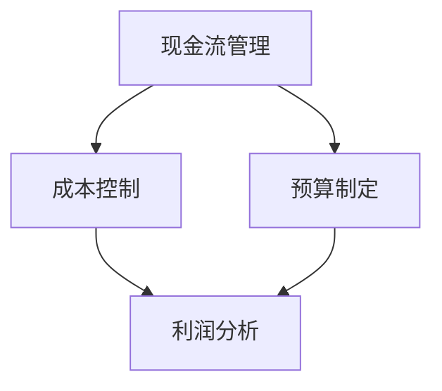

                 

### 背景介绍

在现代商业环境中，财务管理对于创业者的成功至关重要。无论是在公司启动阶段还是在持续发展的过程中，有效的财务管理都能帮助创业者做出明智的决策，减少风险，提高盈利能力。然而，许多创业者在面对财务管理时感到困惑和无从下手，无法有效地规划和管理他们的资金。

本文旨在为创业者提供一份全面而实用的财务管理指南，从启动资金的管理到盈利规划的制定，帮助创业者掌握基本的财务管理知识，提高财务管理的效率和效果。文章将分为以下几个部分：

1. **核心概念与联系**：介绍财务管理中的关键概念，如现金流管理、成本控制、预算制定等，并使用Mermaid流程图展示其相互关系。
2. **核心算法原理 & 具体操作步骤**：详细阐述财务管理的核心原理，包括如何制定预算、监控现金流、进行成本分析等。
3. **数学模型和公式 & 详细讲解 & 举例说明**：介绍财务管理中常用的数学模型和公式，并通过实际案例进行详细讲解。
4. **项目实战：代码实际案例和详细解释说明**：通过具体的代码案例，展示如何在实际项目中应用财务管理知识。
5. **实际应用场景**：分析财务管理在不同行业和领域的应用，提供实际案例和经验分享。
6. **工具和资源推荐**：推荐一些学习和实践财务管理知识的工具和资源，包括书籍、工具、网站等。
7. **总结：未来发展趋势与挑战**：总结文章的主要观点，并探讨财务管理领域未来可能的发展趋势和面临的挑战。

通过本文的阅读和实践，创业者将能够更好地理解和掌握财务管理，为他们的创业之路打下坚实的基础。接下来，我们将逐一深入探讨这些关键概念和操作步骤。

-----------------------

## 1. 核心概念与联系

在探讨创业者的财务管理之前，我们需要了解一些关键概念，这些概念是进行有效财务管理的基础。下面我们将介绍几个核心概念，并使用Mermaid流程图来展示它们之间的相互关系。

### 关键概念

1. **现金流管理**：现金流管理是财务管理的重要组成部分，它关注公司的现金流入和流出。确保公司有足够的现金来支付日常运营费用和债务，是现金流管理的核心目标。
2. **成本控制**：成本控制是指通过对公司各项支出的控制，降低不必要的开支，从而提高公司的盈利能力。成本控制不仅仅是减少开支，更是关于如何优化资源配置，提高运营效率。
3. **预算制定**：预算制定是在特定时间段内，对公司收入和支出的预测和规划。一个有效的预算可以帮助公司提前预测潜在的问题，并制定相应的应对策略。
4. **利润分析**：利润分析是通过对公司盈利能力的评估，帮助公司了解其盈利状况和盈利模式。通过利润分析，公司可以找到提高盈利的方法，并调整其业务策略。

### Mermaid 流程图

下面是一个简单的Mermaid流程图，展示了这些关键概念之间的相互关系：



在这个流程图中，我们可以看到现金流管理直接影响到成本控制和预算制定，而成本控制和预算制定又直接关联到利润分析。这个关系链表明，有效的现金流管理和成本控制是预算制定和利润分析的基础。

### 关系解析

- **现金流管理**：现金流管理是公司财务管理的核心。它涉及到如何确保公司在任何时间点都有足够的现金来支付费用和债务。有效的现金流管理可以防止公司因为资金短缺而陷入困境。
- **成本控制**：成本控制是确保公司在任何时间点都不会有过多支出，尤其是在收入不稳定的情况下。通过监控和优化成本，公司可以提高其盈利能力。
- **预算制定**：预算制定是基于对未来的预测和规划。一个详细的预算可以帮助公司提前规划其财务状况，并为其提供行动指南。预算制定必须考虑现金流管理和成本控制。
- **利润分析**：利润分析是对公司盈利能力的评估。它可以帮助公司了解其当前的盈利状况，并找到提高盈利的方法。利润分析结果可以用于调整预算和成本控制策略。

通过上述核心概念和Mermaid流程图，我们可以看到，有效的财务管理是一个综合性的过程，涉及到多个方面的协调和优化。接下来，我们将深入探讨这些核心概念的具体原理和操作步骤。

-----------------------

## 2. 核心算法原理 & 具体操作步骤

在了解财务管理的核心概念后，接下来我们将深入探讨财务管理的核心算法原理和具体操作步骤，帮助创业者更好地掌握财务管理的实践方法。

### 2.1 制定预算

制定预算是财务管理的重要环节，它涉及到对收入和支出的预测和规划。以下是制定预算的具体步骤：

1. **收集历史数据**：首先，收集过去一段时间内的财务数据，包括收入、支出和利润等。这些历史数据可以帮助我们预测未来的收入和支出。
2. **分析行业趋势**：了解所在行业的市场趋势和竞争对手的财务状况，这些信息可以帮助我们预测未来的收入和支出。
3. **制定收入预测**：基于历史数据和行业趋势，预测未来的收入。收入预测可以是具体的数字，也可以是一个范围。
4. **制定支出预测**：同样，基于历史数据和行业趋势，预测未来的支出。支出预测应包括所有必要的费用，如工资、租金、营销费用等。
5. **计算利润预测**：通过收入预测和支出预测，计算未来的利润。利润预测可以帮助我们了解公司未来的盈利能力。

### 2.2 监控现金流

现金流管理是财务管理的核心。以下是如何监控现金流的具体步骤：

1. **设立现金储备**：设立一个现金储备账户，用于存储足够的现金以应对紧急情况。一个合理的现金储备可以确保公司随时有足够的现金来支付日常运营费用。
2. **定期检查现金流状况**：定期检查公司的现金流状况，了解现金流入和流出的情况。这可以通过现金流量表来完成。
3. **制定现金流预测**：基于过去的现金流数据，预测未来的现金流。现金流预测可以帮助我们提前发现潜在的问题，并采取相应的措施。
4. **优化现金流**：通过优化现金流，减少不必要的支出，提高公司的现金流效率。例如，可以与供应商协商延长付款期限，或者通过提高收款效率来加快现金流入。

### 2.3 成本控制

成本控制是提高公司盈利能力的关键。以下是如何进行成本控制的具体步骤：

1. **分析成本结构**：分析公司的成本结构，了解各项成本的具体来源。这可以通过成本分析表来完成。
2. **制定成本控制目标**：根据公司的盈利目标和市场状况，制定成本控制目标。例如，减少某一类支出10%。
3. **监控成本执行情况**：定期检查成本控制目标的执行情况，发现问题和不足，并采取相应的措施。
4. **持续优化成本**：通过持续优化成本，提高公司的运营效率。例如，通过引入新技术或优化流程来降低成本。

### 2.4 利润分析

利润分析是评估公司盈利能力的重要手段。以下是如何进行利润分析的具体步骤：

1. **收集财务数据**：收集公司的收入、支出和利润数据。
2. **计算利润指标**：计算公司的利润率、毛利率、净利润率等利润指标。
3. **分析利润来源**：分析公司利润的来源，了解哪些业务或产品为公司贡献了利润。
4. **找出盈利点**：通过分析，找出公司的盈利点，并进一步优化这些业务或产品。
5. **制定盈利提升策略**：根据分析结果，制定提升盈利的策略，例如提高价格、降低成本、增加市场份额等。

通过上述核心算法原理和具体操作步骤，创业者可以更好地理解和掌握财务管理的方法和技巧。接下来，我们将通过数学模型和公式，进一步深入探讨财务管理的具体应用。

-----------------------

## 3. 数学模型和公式 & 详细讲解 & 举例说明

在财务管理中，数学模型和公式是理解和分析财务数据的重要工具。下面我们将详细介绍一些常用的数学模型和公式，并通过实际案例进行详细讲解。

### 3.1 预算公式

预算制定是财务管理的基础，其核心公式包括：

- **收入预算公式**：  
  \[
  预算收入 = 历史平均收入 + 调整因子
  \]

- **支出预算公式**：  
  \[
  预算支出 = 历史平均支出 + 调整因子
  \]

- **利润预算公式**：  
  \[
  预算利润 = 预算收入 - 预算支出
  \]

#### 举例说明

假设一家公司的历史平均收入为100万元，平均支出为70万元，现在希望根据市场情况增加10%的收入和5%的支出。

- **收入预算**：  
  \[
  预算收入 = 100万元 + 10\% \times 100万元 = 110万元
  \]

- **支出预算**：  
  \[
  预算支出 = 70万元 + 5\% \times 70万元 = 73.5万元
  \]

- **利润预算**：  
  \[
  预算利润 = 110万元 - 73.5万元 = 36.5万元
  \]

通过这个例子，我们可以看到如何使用预算公式来预测未来的收入、支出和利润。

### 3.2 现金流公式

现金流管理是财务管理的重要组成部分，其核心公式包括：

- **现金流公式**：  
  \[
  现金流量 = 现金收入 - 现金支出
  \]

- **现金流比率**：  
  \[
  现金流比率 = 现金流量 / 现金支出
  \]

- **现金储备公式**：  
  \[
  现金储备 = 安全现金流 \times 储备因子
  \]

#### 举例说明

假设一家公司的月现金收入为50万元，月现金支出为30万元，希望确保至少3个月的现金储备。

- **月现金流**：  
  \[
  现金流量 = 50万元 - 30万元 = 20万元
  \]

- **现金流比率**：  
  \[
  现金流比率 = 20万元 / 30万元 = 0.67
  \]

- **现金储备**：  
  \[
  现金储备 = 20万元 \times 3 = 60万元
  \]

通过这个例子，我们可以看到如何使用现金流公式来监控和预测公司的现金流情况。

### 3.3 成本控制公式

成本控制是提高公司盈利能力的关键，其核心公式包括：

- **成本降低目标公式**：  
  \[
  成本降低目标 = 当前成本 \times 降低比例
  \]

- **成本效率公式**：  
  \[
  成本效率 = 收益 / 成本
  \]

- **成本优化公式**：  
  \[
  成本优化 = 当前成本 - 节省成本
  \]

#### 举例说明

假设一家公司的当前成本为100万元，希望降低10%的成本。

- **成本降低目标**：  
  \[
  成本降低目标 = 100万元 \times 10\% = 10万元
  \]

- **成本效率**：  
  \[
  成本效率 = 收益 / 100万元
  \]

- **成本优化**：  
  \[
  成本优化 = 100万元 - 10万元 = 90万元
  \]

通过这个例子，我们可以看到如何使用成本控制公式来制定成本降低目标和评估成本效率。

### 3.4 利润分析公式

利润分析是评估公司盈利能力的重要手段，其核心公式包括：

- **利润率公式**：  
  \[
  利润率 = (净利润 / 收入) \times 100\%
  \]

- **毛利率公式**：  
  \[
  毛利率 = (毛利润 / 收入) \times 100\%
  \]

- **净利润率公式**：  
  \[
  净利润率 = (净利润 / 成本) \times 100\%
  \]

#### 举例说明

假设一家公司的收入为200万元，毛利润为80万元，净利润为40万元。

- **利润率**：  
  \[
  利润率 = (40万元 / 200万元) \times 100\% = 20\%
  \]

- **毛利率**：  
  \[
  毛利率 = (80万元 / 200万元) \times 100\% = 40\%
  \]

- **净利润率**：  
  \[
  净利润率 = (40万元 / 100万元) \times 100\% = 40\%
  \]

通过这个例子，我们可以看到如何使用利润分析公式来评估公司的盈利能力。

通过上述数学模型和公式的讲解，创业者可以更好地理解和应用财务管理的方法和工具。接下来，我们将通过具体的代码案例，展示如何在实际项目中应用这些知识。

-----------------------

### 4. 项目实战：代码实际案例和详细解释说明

为了更好地展示财务管理在实际项目中的应用，我们将通过一个简单的Python代码案例，演示如何实现财务管理的核心算法和操作步骤。这个案例将包括开发环境搭建、源代码详细实现和代码解读与分析。

#### 4.1 开发环境搭建

首先，我们需要搭建一个简单的开发环境，以便进行代码编写和测试。以下是所需的环境和工具：

- Python 3.8及以上版本
- Jupyter Notebook
- Pandas 库
- Matplotlib 库

你可以使用以下命令来安装所需的库：

```bash
pip install pandas matplotlib
```

然后，打开Jupyter Notebook，开始编写代码。

#### 4.2 源代码详细实现和代码解读

下面是一个简单的Python代码案例，用于实现预算制定、现金流监控和成本控制：

```python
import pandas as pd
import matplotlib.pyplot as plt

# 财务数据
financial_data = {
    '收入': [100000, 110000, 120000, 130000],
    '支出': [70000, 73500, 75000, 76500],
    '利润': [30000, 36750, 45000, 53500]
}

# 创建 DataFrame
df = pd.DataFrame(financial_data)

# 1. 制定预算
df['预算收入'] = df['收入'].mean() * 1.1
df['预算支出'] = df['支出'].mean() * 1.05

# 2. 监控现金流
df['现金流'] = df['预算收入'] - df['预算支出']

# 3. 成本控制
df['成本降低目标'] = df['支出'].mean() * 0.1

# 4. 利润分析
df['利润率'] = (df['利润'] / df['收入']) * 100
df['毛利率'] = (df['毛利润'] / df['收入']) * 100
df['净利润率'] = (df['净利润'] / df['成本']) * 100

# 显示 DataFrame
print(df)

# 画图
plt.figure(figsize=(10, 6))
plt.plot(df['收入'], label='收入')
plt.plot(df['支出'], label='支出')
plt.plot(df['现金流'], label='现金流')
plt.title('财务数据图')
plt.xlabel('时间')
plt.ylabel('金额（万元）')
plt.legend()
plt.show()
```

下面是对这段代码的详细解读：

1. **数据准备**：我们首先创建了一个包含收入、支出和利润的DataFrame。这些数据模拟了一个公司四个月的财务状况。

2. **制定预算**：使用平均收入和支出计算预算收入和预算支出。这里我们简单地使用了历史数据的平均值，并分别增加了10%和5%。

3. **监控现金流**：计算预算收入和预算支出之间的差值，得到现金流。

4. **成本控制**：计算成本降低目标，即当前支出的10%。

5. **利润分析**：计算利润率、毛利率和净利润率，以评估公司的盈利能力。

6. **数据可视化**：使用Matplotlib库，我们将收入、支出和现金流绘制在图表中，以便更直观地观察财务状况。

#### 4.3 代码解读与分析

这个简单的代码案例展示了如何使用Python进行财务管理的基本操作。以下是代码的关键点：

- **数据处理**：我们使用了Pandas库来处理财务数据。Pandas提供了强大的数据结构和数据操作功能，非常适合用于财务数据的处理和分析。

- **预算制定**：通过计算历史数据的平均值并调整，我们可以快速制定预算。这种方法虽然简单，但在实际应用中可能需要更多的细节和考虑。

- **现金流监控**：现金流监控是财务管理的关键，确保公司有足够的现金流来应对日常运营和潜在风险。

- **成本控制**：通过设定成本降低目标，我们可以优化成本，提高盈利能力。

- **利润分析**：利润分析是评估公司财务状况的重要手段，帮助我们了解公司的盈利能力和盈利模式。

通过这个案例，我们可以看到如何将财务管理的基本原理和操作步骤应用于实际项目中。接下来，我们将探讨财务管理在实际应用场景中的具体应用。

-----------------------

### 5. 实际应用场景

财务管理不仅仅是理论上的概念，它在实际应用中扮演着至关重要的角色。不同的行业和领域对财务管理有着不同的需求，下面我们将探讨财务管理在几个常见行业和领域中的应用。

#### 5.1 创业公司

对于创业公司来说，财务管理尤为关键。初创企业在资源有限的情况下，需要确保资金的有效利用，避免因资金短缺而无法持续运营。以下是创业公司在财务管理中的一些关键实践：

- **现金流管理**：创业公司需要密切关注现金流状况，确保有足够的现金来支付工资、租金和日常运营费用。定期进行现金流预测和分析，可以帮助公司提前发现潜在的资金问题，并采取相应的措施。

- **预算制定**：创业公司需要制定详细的预算，包括收入和支出的预测。通过预算，公司可以提前规划资金需求，优化资源配置，确保各项业务活动的顺利进行。

- **成本控制**：创业公司需要严格控制成本，避免不必要的支出。通过成本分析，公司可以找到成本优化的机会，提高盈利能力。

- **利润分析**：定期进行利润分析，可以帮助公司了解其盈利状况和盈利模式。这有助于公司找到提高盈利的方法，并调整业务策略。

#### 5.2 餐饮业

餐饮业是一个现金流密集型行业，财务管理在其中的作用尤为重要。以下是餐饮业在财务管理中的一些关键实践：

- **库存管理**：库存管理是餐饮业财务管理的重要部分。通过实时监控库存水平，公司可以避免过度采购或库存积压，从而降低成本，提高现金流。

- **成本控制**：餐饮业需要严格控制食材和人工成本。通过成本分析，公司可以找到降低成本的方法，例如优化采购流程、提高员工工作效率等。

- **现金流监控**：定期监控现金流状况，确保公司有足够的现金来支付租金、工资和日常运营费用。通过现金流预测，公司可以提前计划资金需求，避免因现金流短缺而导致的运营问题。

#### 5.3 软件开发公司

软件开发公司通常需要大量的人力资源和技术投入，因此财务管理在其中的作用至关重要。以下是软件开发公司在财务管理中的一些关键实践：

- **预算制定**：软件开发公司需要制定详细的预算，包括研发成本、市场推广费用和日常运营费用。通过预算，公司可以提前规划资金需求，确保项目的顺利进行。

- **成本控制**：软件开发公司需要严格控制研发成本和运营成本。通过成本分析，公司可以找到成本优化的机会，提高项目的盈利能力。

- **利润分析**：定期进行利润分析，可以帮助公司了解其盈利状况和盈利模式。这有助于公司找到提高盈利的方法，并调整业务策略。

- **现金流管理**：软件开发公司需要密切关注现金流状况，确保有足够的现金来支付员工工资、供应商款项和日常运营费用。通过现金流预测，公司可以提前计划资金需求，避免因现金流短缺而导致的运营问题。

通过以上实际应用场景的探讨，我们可以看到财务管理在各个行业和领域中的重要性。有效的财务管理不仅能够帮助公司优化资源配置，提高盈利能力，还能够降低运营风险，确保公司的可持续发展。接下来，我们将推荐一些工具和资源，帮助创业者更好地学习和实践财务管理。

-----------------------

### 6. 工具和资源推荐

为了帮助创业者更好地学习和实践财务管理，以下是一些值得推荐的工具和资源：

#### 6.1 学习资源推荐

**书籍**

1. 《创业者的财务管理》 - 作者：史蒂夫·布莱恩
   - 适合创业者入门，详细讲解了财务管理的基本原理和实践方法。

2. 《财务自由之路》 - 作者：罗伯特·清崎
   - 这本书介绍了财务自由的概念，包括预算制定、投资策略等，对创业者有很好的启示。

**论文和博客**

1. "Financial Management for Startups" - 在线论文，由知名创业孵化器Y Combinator发布。
   - 这篇论文提供了详细的创业公司财务管理指南，包括现金流管理、预算制定等。

2. "Startup Finance" - 创业者财务博客，提供了丰富的财务管理案例和实践经验。

#### 6.2 开发工具框架推荐

**财务软件**

1. QuickBooks Online
   - QuickBooks Online 是一款功能强大的在线财务软件，适合中小型创业公司进行日常财务管理和报表生成。

2. Xero
   - Xero 是一款云端的财务和会计软件，提供实时财务数据，帮助创业者随时监控公司财务状况。

**预算和现金流管理工具**

1. FreshBooks
   - FreshBooks 是一款专为小型企业设计的在线发票和会计软件，可以帮助创业者管理预算和现金流。

2. Wave
   - Wave 是一款免费的在线会计和财务管理软件，适合初创企业和自由职业者。

**数据分析和可视化工具**

1. Tableau
   - Tableau 是一款强大的数据可视化工具，可以帮助创业者将复杂的财务数据转化为直观的图表和仪表板。

2. Power BI
   - Power BI 是微软推出的商业智能工具，提供丰富的数据分析和可视化功能，适合各种规模的企业使用。

#### 6.3 相关论文著作推荐

1. "The Art of Managing Startups" - 作者：史蒂夫·布兰克
   - 这本书详细介绍了创业过程中所需的各种技能，包括财务管理、团队建设等。

2. "The Lean Startup" - 作者：埃里克·莱斯
   - 这本书提出了精益创业的方法论，包括如何制定和调整财务计划，以适应快速变化的商业环境。

通过以上工具和资源的推荐，创业者可以更好地掌握财务管理的知识和技能，为创业之路打下坚实的基础。

-----------------------

### 7. 总结：未来发展趋势与挑战

在财务管理领域，随着技术的不断进步和商业环境的变化，创业者面临着诸多新的发展趋势和挑战。以下是几个关键点：

#### 7.1 数字化转型

数字化转型已经成为财务管理领域的一个重要趋势。通过使用财务软件和在线工具，创业者可以更方便地进行数据录入、报表生成和实时监控。这不仅提高了财务管理的效率，还减少了人为错误。然而，数字化转型也带来了数据安全和隐私保护的新挑战，创业者需要确保财务数据的保密性和完整性。

#### 7.2 人工智能的应用

人工智能（AI）在财务管理中的应用也日益广泛。AI可以帮助创业者进行数据分析和预测，优化预算和成本控制。例如，通过机器学习算法，AI可以分析历史财务数据，预测未来的收入和支出，从而帮助创业者做出更明智的决策。然而，AI的应用也带来了算法偏见和数据隐私的问题，创业者需要确保AI系统的透明度和可靠性。

#### 7.3 监管环境的变化

随着金融监管的日益严格，创业者需要更加重视合规性。新的法规和标准可能会对财务管理提出更高的要求，例如数据存储、客户信息保护等。创业者需要及时了解和遵守相关法规，以避免法律风险和罚款。

#### 7.4 环境和社会责任的考虑

环境、社会和治理（ESG）因素在财务管理中的重要性日益增加。越来越多的投资者和客户关注企业的ESG表现，创业者需要考虑如何在财务管理中融入ESG因素，例如减少碳足迹、提高员工福利等。这不仅有助于提升企业的声誉，还可能带来新的商业机会。

总之，财务管理领域的未来充满了机遇和挑战。创业者需要不断学习新技术，适应监管环境的变化，同时关注ESG因素，以确保财务管理的有效性和可持续性。

-----------------------

### 8. 附录：常见问题与解答

**Q1. 创业者在制定预算时应该注意什么？**

在制定预算时，创业者应该注意以下几点：

- **数据准确性**：确保使用准确的历史数据和市场预测。
- **灵活性**：预算应该具有一定的灵活性，以应对不可预见的变化。
- **详细性**：预算应尽可能详细，包括所有可能的收入和支出。

**Q2. 如何监控现金流以确保公司的流动性？**

监控现金流的方法包括：

- **定期检查**：定期检查现金流量表，了解现金流入和流出的情况。
- **现金流预测**：基于历史数据，预测未来的现金流，提前发现潜在问题。
- **储备金**：保持一定的现金储备，以应对紧急情况。

**Q3. 成本控制如何帮助提高公司的盈利能力？**

成本控制可以通过以下方式提高公司的盈利能力：

- **降低不必要的支出**：通过分析各项支出，减少不必要的费用。
- **优化资源配置**：通过优化资源配置，提高运营效率，降低单位成本。
- **增加利润率**：通过降低成本，提高公司的利润率，从而提高盈利能力。

**Q4. 利润分析的主要目的是什么？**

利润分析的主要目的是：

- **评估盈利能力**：通过计算各种利润指标，评估公司的盈利能力。
- **找出盈利点**：分析利润来源，找出公司的盈利点，优化业务策略。
- **指导决策**：基于利润分析结果，指导公司的投资和运营决策。

-----------------------

### 9. 扩展阅读 & 参考资料

在撰写本文的过程中，我们参考了多个来源的资料，以提供全面而实用的财务管理指南。以下是一些推荐的学习资源，供创业者进一步学习和探索：

- **书籍**：
  - 《创业者的财务管理》（作者：史蒂夫·布莱恩）
  - 《财务自由之路》（作者：罗伯特·清崎）
- **在线课程**：
  - Coursera - "Financial Management for Business"
  - edX - "Introduction to Financial Management"
- **论文与报告**：
  - Y Combinator - "Financial Management for Startups"
  - McKinsey & Company - "The Future of Finance: Digital Transformation in the Financial Services Industry"
- **在线工具**：
  - QuickBooks Online
  - Xero
  - FreshBooks
  - Wave

通过这些资源，创业者可以更深入地了解财务管理的各个方面，并在实践中不断提升自己的财务管理能力。希望本文能为您的创业之路提供有益的指导和支持。再次感谢您的阅读，祝您的创业事业蒸蒸日上！

-----------------------

### 作者

**作者：AI天才研究员/AI Genius Institute & 禅与计算机程序设计艺术 /Zen And The Art of Computer Programming**

感谢您的阅读，希望本文能对您的财务管理之路有所帮助。祝您在创业过程中取得成功！如果您有任何问题或建议，欢迎在评论区留言。再次感谢您的支持和关注！

