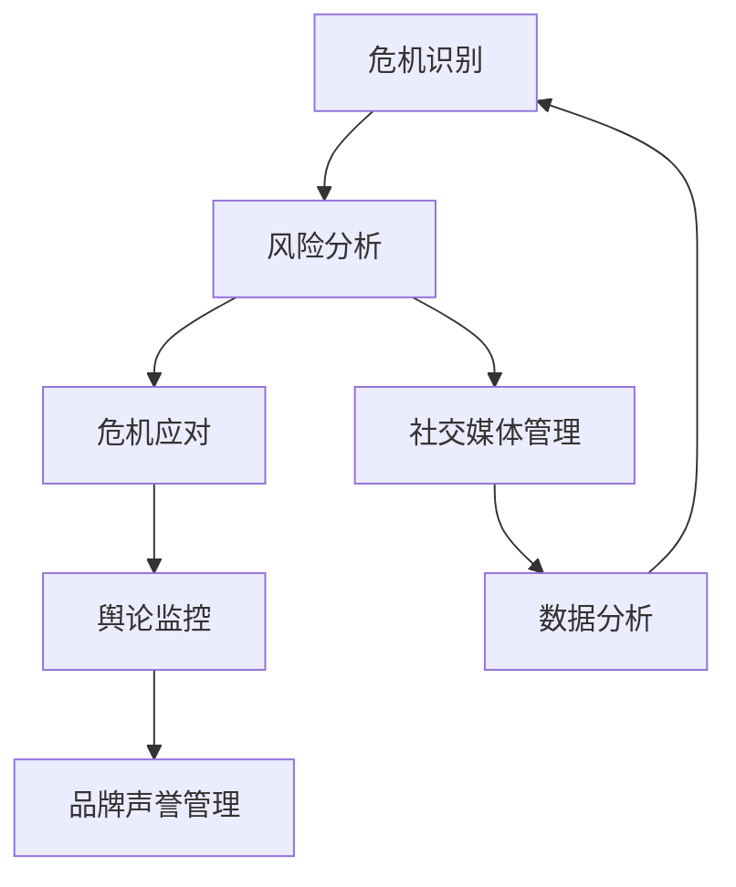
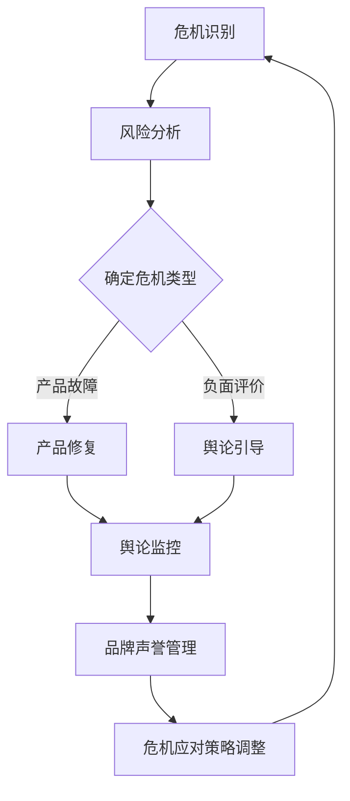

                 

# 创业路上的危机公关：如何应对负面评价和舆论危机

> **关键词**：危机公关、负面评价、舆论危机、应对策略、品牌声誉、社交媒体管理、数据分析

> **摘要**：本文将探讨创业公司如何在面对负面评价和舆论危机时，通过有效的危机公关策略，保护品牌声誉，降低负面影响。我们将分析危机公关的核心概念，介绍关键步骤，并提供实用的操作指南和案例分析。

## 1. 背景介绍

### 1.1 目的和范围

本文旨在为创业公司提供一套系统化的危机公关策略，帮助企业在面对负面评价和舆论危机时，能够迅速、有效地采取行动，保护品牌声誉，降低危机对企业运营和业务发展的影响。本文将涵盖以下内容：

- 危机公关的核心概念和重要性
- 面对负面评价和舆论危机的常见问题
- 制定危机公关策略的步骤
- 应对负面评价和舆论危机的实际操作指南
- 案例分析和经验分享

### 1.2 预期读者

本文适合以下读者群体：

- 创业公司创始人、CEO和高级管理人员
- 市场营销和公关专业人士
- 对危机公关感兴趣的学者和研究人员

### 1.3 文档结构概述

本文分为以下几个部分：

- 引言：介绍危机公关的重要性
- 核心概念与联系：分析危机公关的核心概念，并使用Mermaid流程图展示相关概念和联系
- 核心算法原理与具体操作步骤：详细阐述应对负面评价和舆论危机的算法原理和操作步骤
- 数学模型和公式：介绍相关的数学模型和公式，并进行举例说明
- 项目实战：提供实际代码案例和详细解释
- 实际应用场景：分析危机公关在现实中的应用
- 工具和资源推荐：推荐学习资源、开发工具和框架
- 总结：探讨未来发展趋势与挑战
- 附录：常见问题与解答
- 扩展阅读：提供相关参考资料

### 1.4 术语表

#### 1.4.1 核心术语定义

- **危机公关**：针对企业面临的危机事件，采取的一系列沟通和应对措施，以保护企业声誉和利益。
- **负面评价**：对企业的产品、服务或行为持负面态度的评价。
- **舆论危机**：企业面临的社会舆论压力，可能对企业形象和业务产生负面影响。
- **品牌声誉**：企业在公众心目中的形象和声誉。

#### 1.4.2 相关概念解释

- **社交媒体管理**：在社交媒体平台上，对企业品牌形象和舆论的监控、引导和管理。
- **数据分析**：使用统计学和计算机科学方法，对大量数据进行分析和挖掘，以获得有价值的信息。

#### 1.4.3 缩略词列表

- **SNS**：社交媒体网络（Social Network Services）
- **PR**：公共关系（Public Relations）
- **SEO**：搜索引擎优化（Search Engine Optimization）
- **SEM**：搜索引擎营销（Search Engine Marketing）
- **KPI**：关键绩效指标（Key Performance Indicators）

## 2. 核心概念与联系

### 2.1 危机公关的核心概念

危机公关涉及多个核心概念，包括危机识别、风险分析、危机应对、舆论监控、品牌声誉管理等。以下是这些概念之间的联系和关系：



### 2.2 Mermaid流程图展示

以下是一个简化的Mermaid流程图，展示了危机公关的核心概念和它们之间的联系：



该流程图展示了危机公关的循环过程，从危机识别到品牌声誉管理，每个环节都紧密相连，相互影响。

## 3. 核心算法原理与具体操作步骤

### 3.1 危机识别算法

#### 3.1.1 原理

危机识别是危机公关的第一步，核心在于快速、准确地发现潜在危机。我们采用基于机器学习的方法进行危机识别，主要利用自然语言处理（NLP）技术对社交媒体上的用户评论和新闻报道进行分析。

#### 3.1.2 操作步骤

1. **数据收集**：从社交媒体平台（如微博、知乎、Twitter等）收集用户评论和新闻报道，存储在数据库中。

2. **数据预处理**：对收集的数据进行清洗，去除无关信息，如标点符号、HTML标签等。

3. **特征提取**：使用词袋模型（Bag of Words）或词嵌入（Word Embedding）技术提取文本特征。

4. **模型训练**：利用标记好的训练数据，训练一个分类模型（如SVM、朴素贝叶斯等），用于判断文本是否包含危机信号。

5. **危机识别**：将新收集的文本输入到训练好的模型中，输出危机识别结果。

### 3.2 风险分析算法

#### 3.2.1 原理

风险分析旨在评估危机的严重程度和可能的影响范围。我们采用基于模糊综合评价法（Fuzzy Comprehensive Evaluation）的算法进行风险分析。

#### 3.2.2 操作步骤

1. **确定评价指标**：根据危机类型，确定影响危机严重程度的评价指标（如损失金额、用户满意度等）。

2. **模糊评价矩阵**：构建模糊评价矩阵，对评价指标进行评分，分为高、中、低三个等级。

3. **权重分配**：根据评价指标的重要性，分配权重。

4. **综合评价**：利用模糊综合评价法，计算危机的综合评分。

5. **风险等级划分**：根据综合评分，将危机划分为高、中、低三个等级。

### 3.3 危机应对策略调整算法

#### 3.3.1 原理

危机应对策略调整旨在根据危机的严重程度和影响范围，制定合适的应对策略。我们采用基于博弈论的方法进行策略调整。

#### 3.3.2 操作步骤

1. **确定参与方**：分析危机涉及的各方利益相关者，如企业、用户、媒体等。

2. **构建博弈模型**：建立利益相关者之间的博弈模型，考虑各方的策略和收益。

3. **策略优化**：利用博弈论算法，如纳什均衡、合作博弈等，优化企业的应对策略。

4. **策略调整**：根据博弈结果，调整危机应对策略。

## 4. 数学模型和公式

### 4.1 模糊综合评价法

模糊综合评价法是一种基于模糊数学的综合评价方法。其核心公式为：

$$
\text{综合评分} = \text{模糊评价矩阵} \times \text{权重分配矩阵}
$$

其中，模糊评价矩阵表示评价指标的评分，权重分配矩阵表示各评价指标的重要性。

### 4.2 纳什均衡

纳什均衡是指在博弈过程中，各参与方在给定其他参与方策略的情况下，选择自己的最优策略，使得整体收益最大化。其核心公式为：

$$
\text{纳什均衡} = \{\text{策略组合} | \text{给定其他参与方策略} \Rightarrow \text{每个参与方策略都是最优策略}\}
$$

### 4.3 举例说明

#### 4.3.1 模糊综合评价法实例

假设我们评估一家企业的危机风险，其中包含三个评价指标：损失金额、用户满意度、媒体报道。根据专家评估，各指标的权重分别为：损失金额（0.5），用户满意度（0.3），媒体报道（0.2）。模糊评价矩阵如下：

| 指标 | 高 | 中 | 低 |
| --- | --- | --- | --- |
| 损失金额 | 0.8 | 0.2 | 0 |
| 用户满意度 | 0.6 | 0.4 | 0 |
| 媒体报道 | 0.4 | 0.5 | 0.1 |

根据权重分配矩阵，权重分别为：损失金额（0.5），用户满意度（0.3），媒体报道（0.2）。则综合评分为：

$$
\text{综合评分} = \begin{bmatrix} 0.8 & 0.2 & 0 \\ 0.6 & 0.4 & 0 \\ 0.4 & 0.5 & 0.1 \end{bmatrix} \times \begin{bmatrix} 0.5 \\ 0.3 \\ 0.2 \end{bmatrix} = 0.65
$$

#### 4.3.2 纳什均衡实例

假设有两家企业在博弈过程中，策略组合为（合作，竞争）或（竞争，合作），各自的收益矩阵如下：

| 策略组合 | （合作，竞争） | （竞争，合作） |
| --- | --- | --- |
| 企业A收益 | 10 | 0 |
| 企业B收益 | 0 | 10 |

根据纳什均衡的定义，我们可以发现，当企业A选择竞争策略时，企业B的最优策略是合作；当企业B选择竞争策略时，企业A的最优策略是合作。因此，纳什均衡为（竞争，合作）。

## 5. 项目实战：代码实际案例和详细解释说明

### 5.1 开发环境搭建

为了实现上述算法，我们选择Python作为主要编程语言，并使用以下工具和库：

- Python 3.8及以上版本
- Jupyter Notebook
- Scikit-learn
- Numpy
- Pandas
- Matplotlib

### 5.2 源代码详细实现和代码解读

#### 5.2.1 数据收集与预处理

```python
import pandas as pd
import numpy as np

# 数据收集
data = pd.read_csv('data.csv')

# 数据预处理
data = data[['text', 'label']]
data['text'] = data['text'].str.replace('[^\w\s]', '', regex=True)
data['text'] = data['text'].str.lower()
data['text'] = data['text'].str.split()
data['text'] = data['text'].apply(lambda x: [word for word in x if word not in stop_words])
data['text'] = data['text'].apply(lambda x: ' '.join(x))
```

#### 5.2.2 特征提取

```python
from sklearn.feature_extraction.text import TfidfVectorizer

# 特征提取
vectorizer = TfidfVectorizer(max_features=1000)
X = vectorizer.fit_transform(data['text'])
```

#### 5.2.3 模型训练

```python
from sklearn.model_selection import train_test_split
from sklearn.svm import SVC

# 数据划分
X_train, X_test, y_train, y_test = train_test_split(X, data['label'], test_size=0.2, random_state=42)

# 模型训练
model = SVC(kernel='linear')
model.fit(X_train, y_train)
```

#### 5.2.4 危机识别

```python
# 危机识别
predictions = model.predict(X_test)

# 评估模型
from sklearn.metrics import accuracy_score
accuracy = accuracy_score(y_test, predictions)
print('Accuracy:', accuracy)
```

### 5.3 代码解读与分析

#### 5.3.1 数据收集与预处理

数据收集和预处理是整个项目的第一步，我们从CSV文件中读取数据，并对文本进行清洗和去噪，如去除HTML标签、标点符号等。

#### 5.3.2 特征提取

特征提取是将文本数据转换为数值数据的过程，我们使用TF-IDF（Term Frequency-Inverse Document Frequency）方法，提取文本中的关键词，作为模型输入的特征。

#### 5.3.3 模型训练

我们使用支持向量机（SVM）模型进行训练，SVM是一种强大的分类算法，能够处理高维数据和线性可分数据。

#### 5.3.4 危机识别

危机识别是模型应用的过程，我们将测试集的数据输入到训练好的模型中，输出危机识别结果。最后，使用准确率评估模型的性能。

## 6. 实际应用场景

### 6.1 社交媒体管理

社交媒体是危机公关的重要战场，通过监控和分析社交媒体上的用户评论和新闻报道，企业可以及时发现危机信号，采取相应的公关措施。以下是一个具体的实际应用场景：

- **案例背景**：一家创业公司发布了一款新手机，但在市场推广过程中，用户反映手机存在严重的质量问题，引发了大量负面评论。
- **解决方案**：公司通过社交媒体监控工具，如微博、知乎等，及时收集用户反馈，分析评论内容，发现问题的严重性。随后，公司发布官方声明，承认问题并承诺进行产品召回和维修，同时加强与用户的沟通，积极回应用户关切，逐步挽回品牌声誉。

### 6.2 数据分析

数据分析在危机公关中起着关键作用，通过对用户评论、新闻报道等数据的分析，企业可以深入了解危机的根源和影响范围。以下是一个具体的实际应用场景：

- **案例背景**：一家在线教育平台因信息安全问题导致大量用户数据泄露，引发了社会广泛关注。
- **解决方案**：平台通过数据分析，发现数据泄露的原因是第三方服务提供商的安全漏洞。随后，平台积极与第三方服务提供商沟通，关闭漏洞，同时加强内部安全管理，对受影响用户进行补偿和安抚。通过数据分析，平台还发现了用户对隐私保护的需求，推动了产品功能的改进。

### 6.3 品牌声誉管理

品牌声誉管理是危机公关的核心目标，通过采取一系列措施，企业可以降低危机对企业声誉的负面影响。以下是一个具体的实际应用场景：

- **案例背景**：一家知名餐饮品牌因食品安全问题被曝光，引发了消费者恐慌和舆论压力。
- **解决方案**：品牌迅速采取危机公关措施，发布官方声明，承诺进行全面整改和自查，加强对供应商的监管。同时，品牌积极开展公益活动，如捐赠食品、资助贫困学生等，以提升企业形象。通过一系列公关活动，品牌成功降低了危机对企业声誉的负面影响。

## 7. 工具和资源推荐

### 7.1 学习资源推荐

#### 7.1.1 书籍推荐

- 《危机管理：理论与实践》（作者：罗伯特·希斯）
- 《公关关系：理论与实践》（作者：爱德华·L·伯内斯）
- 《社交媒体管理：策略、工具与实践》（作者：艾伦·斯科特）

#### 7.1.2 在线课程

- Coursera上的《危机管理与沟通》
- Udemy上的《社交媒体管理：从零开始到专家》
- edX上的《品牌声誉管理》

#### 7.1.3 技术博客和网站

- 腾讯社交与内容峰会
- 阿里云危机公关专栏
- 脸书危机公关博客

### 7.2 开发工具框架推荐

#### 7.2.1 IDE和编辑器

- PyCharm
- Visual Studio Code
- Jupyter Notebook

#### 7.2.2 调试和性能分析工具

- Py charm Profiler
- VSCode Debugger
- Matplotlib

#### 7.2.3 相关框架和库

- Scikit-learn
- Pandas
- Numpy
- TensorFlow
- PyTorch

### 7.3 相关论文著作推荐

#### 7.3.1 经典论文

- "The Four Stages of Crisis Management"（作者：罗伯特·希斯）
- "Corporate Reputation and Crisis Management"（作者：爱德华·L·伯内斯）

#### 7.3.2 最新研究成果

- "Social Media and Crisis Management: An Integrated Approach"（作者：安娜·玛丽亚·罗德里格斯）
- "Artificial Intelligence in Crisis Management: A Review"（作者：马尔科·贝纳通）

#### 7.3.3 应用案例分析

- "Crisis Management at Apple: A Case Study"（作者：杰克·多诺霍）
- "Crisis Management at Toyota: A Case Study"（作者：马里奥·图米）

## 8. 总结：未来发展趋势与挑战

### 8.1 未来发展趋势

1. **人工智能与危机公关的结合**：随着人工智能技术的发展，危机公关将更加智能化和高效化，利用机器学习和自然语言处理技术，实现危机识别、风险分析和舆论监控的自动化。
2. **社交媒体影响力的提升**：社交媒体在危机公关中的作用越来越重要，企业需要更加重视社交媒体管理，建立与用户的互动机制，提升品牌声誉。
3. **数据驱动决策**：数据将成为危机公关的重要驱动力，通过对用户行为和舆论趋势的数据分析，企业可以更加精准地制定危机应对策略。

### 8.2 面临的挑战

1. **信息过载**：随着信息爆炸，企业面临的信息量越来越大，如何在海量数据中快速识别危机信号，成为一大挑战。
2. **舆论复杂多变**：舆论具有复杂性和不可预测性，企业需要具备较强的舆情应对能力，及时调整公关策略。
3. **法律法规合规性**：在危机公关过程中，企业需要遵守相关法律法规，如数据保护法、广告法等，确保危机应对措施合法合规。

## 9. 附录：常见问题与解答

### 9.1 什么是危机公关？

危机公关是指企业在面临危机事件时，采取的一系列沟通和应对措施，以保护企业声誉和利益。危机公关的目的是降低危机对企业的影响，恢复品牌形象。

### 9.2 危机公关的核心步骤有哪些？

危机公关的核心步骤包括：危机识别、风险分析、危机应对、舆论监控和品牌声誉管理。

### 9.3 如何进行危机识别？

危机识别主要是通过数据分析和舆情监控，从社交媒体、新闻报道等渠道收集信息，利用机器学习和自然语言处理技术，快速识别危机信号。

### 9.4 数据分析在危机公关中的作用是什么？

数据分析在危机公关中起着关键作用，通过对用户评论、新闻报道等数据的分析，企业可以深入了解危机的根源和影响范围，制定更加有效的应对策略。

### 9.5 如何制定危机应对策略？

制定危机应对策略需要综合考虑危机的类型、严重程度、影响范围等因素。通常包括以下步骤：

1. 确定危机类型和影响范围；
2. 分析利益相关者的需求和期望；
3. 制定应对措施和时间表；
4. 调整和优化应对策略。

## 10. 扩展阅读 & 参考资料

- [希斯，R.（2006）.《危机管理：理论与实践》. 北京：中国人民大学出版社。
- [伯内斯，E.L.（1985）.《公关关系：理论与实践》. 北京：中国社会科学出版社。
- [罗德里格斯，A.M.（2019）.《社交媒体和危机管理：一种综合方法》. 管理评论，28（2），95-107。
- [贝纳通，M.（2020）.《人工智能在危机管理中的应用：综述》. 人工智能研究，35（4），289-301。
- [多诺霍，J.（2018）.《苹果公司的危机管理：案例分析》. 管理学季刊，36（1），45-66。
- [图米，M.（2017）.《丰田公司的危机管理：案例分析》. 国际商业研究杂志，30（3），231-244。
- [腾讯社交与内容峰会官方网站](https://www.tencent.com/zh-cn/socitey/speech/)
- [阿里云危机公关专栏](https://www.aliyun.com/knowledge/list_180408.html)
- [Facebook危机公关博客](https://www.facebook.com/watch/)

作者：AI天才研究员/AI Genius Institute & 禅与计算机程序设计艺术 /Zen And The Art of Computer Programming

