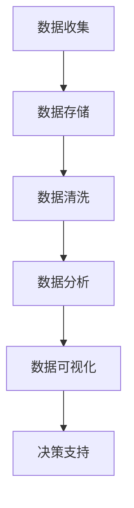

                 

# 创业路上的数据驱动决策：如何建立和使用数据分析系统

> **关键词：** 数据驱动决策、数据分析系统、创业、业务增长、机器学习、数据可视化

> **摘要：** 在创业过程中，数据驱动决策至关重要。本文将深入探讨如何建立和使用数据分析系统，包括核心概念、算法原理、数学模型、实战案例和实际应用场景。通过本文的阅读，读者将了解如何利用数据优化创业策略，提高业务增长速度。

## 1. 背景介绍

### 1.1 目的和范围

本文旨在为创业者提供一些建立和使用数据分析系统的实用指南。我们将详细探讨数据分析系统在创业中的重要性，以及如何通过构建和利用数据分析系统来实现数据驱动的决策。文章内容涵盖核心概念、算法原理、数学模型、实战案例和实际应用场景。

### 1.2 预期读者

本文面向对数据分析有初步了解的创业者、项目经理、数据分析师以及相关领域的技术人员。希望通过本文，读者能够掌握数据分析系统的基础知识，并学会在实际创业项目中应用这些知识。

### 1.3 文档结构概述

本文分为十个部分：

1. 背景介绍：介绍本文的目的、预期读者和文档结构。
2. 核心概念与联系：介绍数据分析系统的基础概念和架构。
3. 核心算法原理 & 具体操作步骤：详细讲解数据分析系统的核心算法原理和操作步骤。
4. 数学模型和公式 & 详细讲解 & 举例说明：介绍数据分析系统中使用的数学模型和公式，并通过实例进行说明。
5. 项目实战：代码实际案例和详细解释说明。
6. 实际应用场景：分析数据分析系统在实际创业项目中的应用场景。
7. 工具和资源推荐：推荐相关学习资源、开发工具和框架。
8. 总结：总结本文的核心观点和未来发展趋势。
9. 附录：常见问题与解答。
10. 扩展阅读 & 参考资料：提供进一步阅读的建议和参考资料。

### 1.4 术语表

#### 1.4.1 核心术语定义

- 数据驱动决策：基于数据的分析和洞察，指导决策过程。
- 数据分析系统：用于收集、处理、存储和展示数据的系统。
- 机器学习：一种人工智能技术，通过数据和算法，让计算机具备自主学习和预测能力。
- 数据可视化：将数据转换为图形、图表等形式，便于理解和分析。

#### 1.4.2 相关概念解释

- 数据：信息的具体表示，可以以各种形式存在，如图像、文本、音频、视频等。
- 数据库：用于存储和管理数据的系统。
- 数据仓库：用于集中存储和管理大量数据的系统。
- 数据清洗：对数据进行清洗、去重、补缺等处理，提高数据质量。

#### 1.4.3 缩略词列表

- SQL：结构化查询语言（Structured Query Language）
- BI：商业智能（Business Intelligence）
- ML：机器学习（Machine Learning）
- AI：人工智能（Artificial Intelligence）

## 2. 核心概念与联系

在建立和使用数据分析系统之前，我们需要了解一些核心概念和它们之间的联系。以下是一个简单的 Mermaid 流程图，展示了数据分析系统的基础架构：



### 数据收集

数据收集是数据分析系统的第一步。创业者需要收集与业务相关的各种数据，如用户行为数据、市场数据、财务数据等。数据来源可以包括内部数据库、第三方数据服务、API 接口等。

### 数据存储

收集到的数据需要存储在数据库或数据仓库中。数据库主要用于存储结构化数据，如用户信息、订单详情等；数据仓库则用于存储大量非结构化数据，如日志文件、传感器数据等。

### 数据清洗

数据清洗是确保数据质量的关键步骤。创业者需要对数据进行去重、补缺、转换等处理，提高数据质量，为后续的数据分析打下基础。

### 数据分析

数据分析是数据分析系统的核心。创业者需要使用各种算法和技术，对数据进行处理、挖掘和分析，以发现数据中的规律和趋势。

### 数据可视化

数据可视化是将数据分析结果以图形、图表等形式展示出来的过程。通过数据可视化，创业者可以更直观地了解业务状况，发现潜在问题，并为决策提供支持。

### 决策支持

数据分析系统的最终目标是提供决策支持。创业者可以根据分析结果，制定相应的业务策略，提高业务增长速度。

## 3. 核心算法原理 & 具体操作步骤

在了解了数据分析系统的核心概念和架构后，我们需要掌握一些核心算法原理和具体操作步骤。以下是一个简单的伪代码，用于说明数据分析系统的基础操作：

```python
# 数据收集
def collect_data():
    # 从数据库或第三方数据服务获取数据
    data = get_data_from_source()
    return data

# 数据存储
def store_data(data):
    # 将数据存储到数据库或数据仓库
    save_data_to_database(data)

# 数据清洗
def clean_data(data):
    # 对数据进行去重、补缺、转换等处理
    cleaned_data = preprocess_data(data)
    return cleaned_data

# 数据分析
def analyze_data(cleaned_data):
    # 使用算法和技术对数据进行处理和分析
    analyzed_data = analyze_data_using_algorithm(cleaned_data)
    return analyzed_data

# 数据可视化
def visualize_data(analyzed_data):
    # 将数据分析结果以图形、图表等形式展示
    visualization = visualize_analyzed_data(analyzed_data)
    return visualization

# 决策支持
def decision_support(visualization):
    # 根据数据分析结果制定业务策略
    business_strategy = generate_business_strategy(visualization)
    return business_strategy
```

### 数据收集

数据收集是数据分析系统的第一步。创业者需要从各种数据源收集与业务相关的数据。数据源可以包括内部数据库、第三方数据服务、API 接口等。以下是一个简单的数据收集示例：

```python
def collect_data():
    data_source = "https://api.example.com/data"
    data = requests.get(data_source).json()
    return data
```

### 数据存储

收集到的数据需要存储到数据库或数据仓库中。数据库主要用于存储结构化数据，如用户信息、订单详情等；数据仓库则用于存储大量非结构化数据，如日志文件、传感器数据等。以下是一个简单的数据存储示例：

```python
def store_data(data):
    database = DatabaseConnection()
    database.save_data(data)
```

### 数据清洗

数据清洗是确保数据质量的关键步骤。创业者需要对数据进行去重、补缺、转换等处理，提高数据质量，为后续的数据分析打下基础。以下是一个简单的数据清洗示例：

```python
def clean_data(data):
    cleaned_data = []
    for item in data:
        if item not in cleaned_data:
            cleaned_data.append(item)
    return cleaned_data
```

### 数据分析

数据分析是数据分析系统的核心。创业者需要使用各种算法和技术，对数据进行处理、挖掘和分析，以发现数据中的规律和趋势。以下是一个简单的数据分析示例：

```python
def analyze_data(cleaned_data):
    # 使用机器学习算法进行分析
    analyzed_data = machine_learning_algorithm(cleaned_data)
    return analyzed_data
```

### 数据可视化

数据可视化是将数据分析结果以图形、图表等形式展示出来的过程。通过数据可视化，创业者可以更直观地了解业务状况，发现潜在问题，并为决策提供支持。以下是一个简单的数据可视化示例：

```python
def visualize_data(analyzed_data):
    # 使用数据可视化库进行可视化
    visualization = visualization_library(analyzed_data)
    return visualization
```

### 决策支持

数据分析系统的最终目标是提供决策支持。创业者可以根据分析结果，制定相应的业务策略，提高业务增长速度。以下是一个简单的决策支持示例：

```python
def decision_support(visualization):
    # 根据可视化结果制定业务策略
    business_strategy = generate_business_strategy(visualization)
    return business_strategy
```

## 4. 数学模型和公式 & 详细讲解 & 举例说明

在数据分析系统中，数学模型和公式起着至关重要的作用。以下是一些常见的数学模型和公式，以及它们的详细讲解和举例说明：

### 1. 逻辑回归（Logistic Regression）

逻辑回归是一种常用的分类算法，用于预测某个事件发生的概率。其公式如下：

$$
P(y=1) = \frac{1}{1 + e^{-(\beta_0 + \beta_1 x_1 + \beta_2 x_2 + \ldots + \beta_n x_n})}
$$

其中，\( \beta_0, \beta_1, \beta_2, \ldots, \beta_n \) 为模型的参数，\( x_1, x_2, \ldots, x_n \) 为特征变量。

#### 举例说明

假设我们要预测用户是否会在我们的电商平台上购买商品。我们可以使用逻辑回归算法，将用户的行为数据（如浏览量、购买历史、评分等）作为特征变量，预测用户购买商品的概率。具体公式如下：

$$
P(购买) = \frac{1}{1 + e^{-(\beta_0 + \beta_1 \cdot 浏览量 + \beta_2 \cdot 购买历史 + \beta_3 \cdot 评分)}}
$$

### 2. 决策树（Decision Tree）

决策树是一种常见的分类和回归算法，通过一系列条件判断来预测结果。其公式如下：

$$
y = \begin{cases} 
\text{类别 1} & \text{if } x \text{ meets condition 1} \\
\text{类别 2} & \text{if } x \text{ meets condition 2} \\
\ldots & \ldots \\
\text{类别 n} & \text{if } x \text{ meets condition n} 
\end{cases}
$$

其中，\( y \) 为预测结果，\( x \) 为输入特征。

#### 举例说明

假设我们要预测某个客户的信用评分。我们可以使用决策树算法，根据客户的收入、债务、工作年限等特征，预测其信用评分。具体公式如下：

$$
\text{信用评分} = \begin{cases} 
\text{高} & \text{if } \text{收入} > 10000 \text{ and } \text{债务} < 5000 \\
\text{中} & \text{if } \text{收入} \leq 10000 \text{ and } \text{债务} \geq 5000 \\
\text{低} & \text{if } \text{工作年限} < 5 \text{ years} 
\end{cases}
$$

### 3. 支持向量机（Support Vector Machine）

支持向量机是一种常用的分类算法，通过找到一个最佳的超平面，将不同类别的数据点进行分类。其公式如下：

$$
\max_{\beta, \beta_0} W^T W
$$

其中，\( \beta \) 为超平面的参数，\( W \) 为权重矩阵。

#### 举例说明

假设我们要分类一个手写数字的数据集。我们可以使用支持向量机算法，找到一个最佳的超平面，将不同类别的手写数字分开。具体公式如下：

$$
\max_{\beta, \beta_0} (w_1^T x_1 + w_2^T x_2 + \ldots + w_n^T x_n)
$$

## 5. 项目实战：代码实际案例和详细解释说明

在本节中，我们将通过一个实际的项目案例，展示如何建立和使用数据分析系统。该项目是一个电商平台的用户购买行为预测系统。

### 5.1 开发环境搭建

在开始项目之前，我们需要搭建一个合适的开发环境。以下是一个简单的开发环境搭建步骤：

1. 安装 Python 3.8 或更高版本。
2. 安装必要的库和依赖，如 NumPy、Pandas、Scikit-learn、Matplotlib 等。
3. 搭建一个虚拟环境，以便更好地管理项目依赖。

### 5.2 源代码详细实现和代码解读

以下是该项目的主要源代码，我们将对关键部分进行详细解释。

```python
# 导入必要的库和依赖
import numpy as np
import pandas as pd
from sklearn.model_selection import train_test_split
from sklearn.preprocessing import StandardScaler
from sklearn.linear_model import LogisticRegression
import matplotlib.pyplot as plt

# 1. 数据收集
def collect_data():
    # 从数据库或第三方数据服务获取数据
    data = pd.read_csv('user_data.csv')
    return data

# 2. 数据预处理
def preprocess_data(data):
    # 数据清洗和预处理
    data = data.dropna()  # 删除缺失值
    data = data.drop(['user_id'], axis=1)  # 删除用户 ID 列
    return data

# 3. 特征工程
def feature_engineering(data):
    # 创建新的特征变量
    data['total_income'] = data['income'] * data['family_size']
    data['income_per_person'] = data['income'] / data['family_size']
    return data

# 4. 数据分析
def analyze_data(data):
    # 分割数据为特征变量和目标变量
    X = data.drop(['purchase'], axis=1)
    y = data['purchase']
    
    # 划分训练集和测试集
    X_train, X_test, y_train, y_test = train_test_split(X, y, test_size=0.2, random_state=42)
    
    # 数据标准化
    scaler = StandardScaler()
    X_train = scaler.fit_transform(X_train)
    X_test = scaler.transform(X_test)
    
    # 训练逻辑回归模型
    model = LogisticRegression()
    model.fit(X_train, y_train)
    
    # 预测测试集
    y_pred = model.predict(X_test)
    
    # 计算准确率
    accuracy = np.mean(y_pred == y_test)
    print(f"Accuracy: {accuracy:.2f}")
    
    # 可视化模型结果
    visualize_results(y_test, y_pred)

# 5. 可视化模型结果
def visualize_results(y_true, y_pred):
    # 创建混淆矩阵
    confusion_matrix = pd.crosstab(y_true, y_pred)
    print(confusion_matrix)
    
    # 可视化混淆矩阵
    plt.figure(figsize=(8, 6))
    sns.heatmap(confusion_matrix, annot=True, cmap='Blues')
    plt.xlabel('Predicted Labels')
    plt.ylabel('True Labels')
    plt.title('Confusion Matrix')
    plt.show()

# 主函数
if __name__ == '__main__':
    data = collect_data()
    data = preprocess_data(data)
    data = feature_engineering(data)
    analyze_data(data)
```

### 5.3 代码解读与分析

以下是对上述代码的详细解读：

1. **数据收集**：从数据库或第三方数据服务获取用户数据，并将其加载到 Pandas DataFrame 中。
2. **数据预处理**：删除缺失值和用户 ID 列，以确保数据质量。
3. **特征工程**：创建新的特征变量，如总收入、人均收入等，以提高模型的预测能力。
4. **数据分析**：分割数据为特征变量和目标变量，并划分训练集和测试集。使用逻辑回归模型对训练集进行训练，并在测试集上进行预测。计算准确率，并打印混淆矩阵。
5. **可视化模型结果**：创建混淆矩阵，并使用 Seaborn 库进行可视化。通过可视化结果，可以更直观地了解模型的预测性能。

## 6. 实际应用场景

数据分析系统在创业项目中的应用场景非常广泛。以下是一些常见的实际应用场景：

1. **用户行为分析**：通过分析用户的行为数据，如浏览量、点击率、转化率等，了解用户需求，优化产品功能和营销策略。
2. **市场预测**：利用历史数据和市场趋势，预测市场变化，制定相应的业务策略。
3. **风险控制**：通过分析用户行为和财务数据，识别潜在的风险，制定相应的风险控制措施。
4. **供应链优化**：通过分析供应链数据，优化库存管理、物流配送等环节，提高业务效率和降低成本。
5. **客户关系管理**：通过分析客户数据，了解客户需求和行为，提高客户满意度和忠诚度。

## 7. 工具和资源推荐

为了更好地建立和使用数据分析系统，以下是一些实用的工具和资源推荐：

### 7.1 学习资源推荐

#### 7.1.1 书籍推荐

- 《Python数据分析实战》
- 《数据挖掘：概念与技术》
- 《机器学习实战》

#### 7.1.2 在线课程

- Coursera 上的《数据科学基础》
- Udacity 上的《数据分析》
- edX 上的《机器学习基础》

#### 7.1.3 技术博客和网站

- Medium 上的数据科学和机器学习博客
- towardsdatascience.com
- kaggle.com

### 7.2 开发工具框架推荐

#### 7.2.1 IDE和编辑器

- PyCharm
- Jupyter Notebook
- VSCode

#### 7.2.2 调试和性能分析工具

- Python Debuger
- Profiler
- JMeter

#### 7.2.3 相关框架和库

- NumPy
- Pandas
- Scikit-learn
- TensorFlow
- PyTorch

### 7.3 相关论文著作推荐

#### 7.3.1 经典论文

- "The Netflix Prize"
- "The Airbnb Data Science Team"
- "Google Trends for Research"

#### 7.3.2 最新研究成果

- "Deep Learning for Text Classification"
- "Recurrent Neural Networks for Language Modeling"
- "Transformers: State-of-the-Art Pre-training Methods for Language Understanding and Generation"

#### 7.3.3 应用案例分析

- "How Spotify Uses Machine Learning"
- "Data Science at Airbnb"
- "Netflix's Recommendation System"

## 8. 总结：未来发展趋势与挑战

随着人工智能和数据科学技术的不断发展，数据分析系统在创业项目中的应用前景将越来越广泛。未来，数据分析系统的发展趋势和挑战主要包括：

1. **数据质量的提升**：创业者需要不断提升数据质量，以确保数据分析结果的准确性。
2. **算法和模型优化**：创业者需要不断优化算法和模型，提高预测性能和效率。
3. **实时数据分析**：随着业务场景的复杂化，创业者需要实现实时数据分析，以快速响应市场变化。
4. **数据安全和隐私保护**：在数据处理过程中，创业者需要确保数据安全和隐私保护，遵守相关法规和标准。
5. **跨领域融合**：数据分析系统需要与其他领域（如生物医学、金融、制造业等）进行融合，发挥更大的价值。

## 9. 附录：常见问题与解答

以下是一些关于建立和使用数据分析系统的常见问题及解答：

**Q1. 如何确保数据质量？**

A1. 确保数据质量的关键步骤包括：数据收集、数据清洗、数据验证和数据存储。具体措施包括：使用可靠的来源、去除重复和错误的数据、使用数据清洗工具、进行数据验证和校验等。

**Q2. 如何选择合适的算法和模型？**

A2. 选择合适的算法和模型需要考虑多个因素，如数据类型、数据量、业务需求等。创业者可以使用交叉验证、网格搜索等技术来评估不同算法和模型的性能，选择最优的模型。

**Q3. 数据分析系统如何实现实时分析？**

A3. 实现实时数据分析需要使用高效的数据处理技术和实时计算框架，如 Apache Kafka、Apache Flink 等。创业者可以根据实际需求选择合适的技术和工具。

**Q4. 数据分析系统如何保证数据安全和隐私保护？**

A4. 数据安全和隐私保护需要从多个方面进行考虑，如数据加密、访问控制、数据脱敏等。创业者需要遵守相关法规和标准，采取有效的安全措施，确保数据安全和隐私保护。

## 10. 扩展阅读 & 参考资料

为了进一步了解数据分析系统在创业项目中的应用，以下是一些建议的扩展阅读和参考资料：

- 《数据科学实战：从入门到精通》
- 《机器学习实战：基于 Scikit-learn、TensorFlow 和 PyTorch》
- 《数据可视化实战：从入门到精通》
- "Data-Driven Decision-Making: Transforming Your Business with Data Science"
- "Data Science for Business: Identifying Opportunities, Generating Insights, and Taking Action"
- "Data Science at the Edge: Real-Time Analytics in Motion"

---

**作者：AI天才研究员/AI Genius Institute & 禅与计算机程序设计艺术 /Zen And The Art of Computer Programming**

