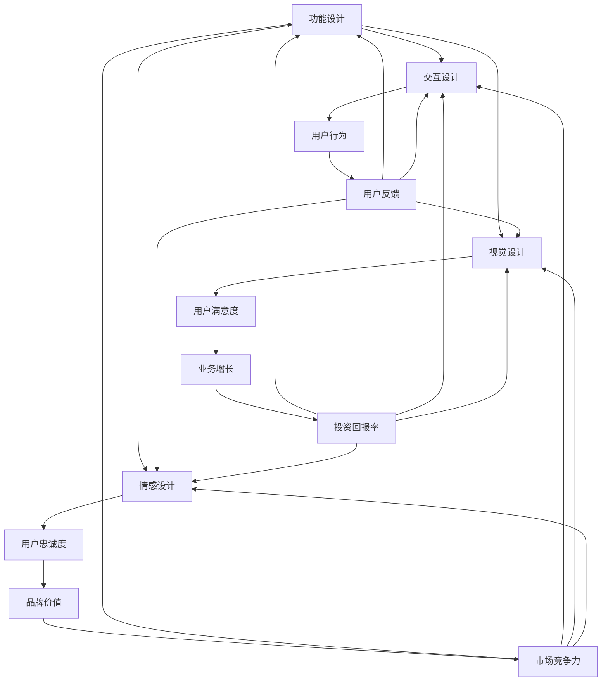

                 

### 1. 背景介绍

在现代社会中，用户体验（User Experience, UX）已经成为企业成功的关键因素之一。随着互联网的普及和移动设备的广泛应用，用户对产品和服务的要求越来越高，不仅仅关注功能上的满足，更重视情感上的共鸣和愉悦感。因此，对于创业者来说，如何优化用户体验，提升用户满意度，成为了一条充满挑战与机遇的道路。

**1.1 目的和范围**

本文的目的是探讨创业过程中用户体验优化的关键路径，从功能设计到情感设计的转变。我们将分析用户体验的多个层次，包括功能、交互、视觉和情感，并详细阐述每个层次的优化方法和策略。文章将涵盖以下内容：

- **功能设计**：探讨如何通过合理的功能规划，满足用户的基本需求。
- **交互设计**：分析交互设计的核心要素，包括界面布局、导航、反馈等。
- **视觉设计**：介绍视觉设计的原则和方法，提升产品的审美价值。
- **情感设计**：探讨如何通过情感设计，增强用户对产品的情感投入和忠诚度。

**1.2 预期读者**

本文适合以下读者群体：

- **创业者**：希望了解用户体验优化对业务成功的重要性，并掌握相关设计方法。
- **产品经理**：需要提升产品的用户体验，增加用户黏性和满意度。
- **UI/UX设计师**：希望了解用户体验优化的全流程，掌握从功能到情感设计的技巧。
- **技术开发者**：关注用户体验优化，希望通过技术手段提升产品性能和用户满意度。

**1.3 文档结构概述**

本文将分为以下几个部分：

- **背景介绍**：阐述用户体验优化在创业过程中的重要性。
- **核心概念与联系**：介绍用户体验优化的核心概念，并使用Mermaid流程图进行说明。
- **核心算法原理 & 具体操作步骤**：详细阐述用户体验优化的方法，包括功能设计、交互设计、视觉设计和情感设计。
- **数学模型和公式 & 详细讲解 & 举例说明**：介绍用户体验优化的数学模型和公式，并通过实际案例进行说明。
- **项目实战：代码实际案例和详细解释说明**：通过实际项目案例，展示用户体验优化的具体操作步骤。
- **实际应用场景**：分析用户体验优化在现实中的应用场景。
- **工具和资源推荐**：推荐学习资源、开发工具和框架。
- **总结：未来发展趋势与挑战**：总结用户体验优化的发展趋势和面临的挑战。
- **附录：常见问题与解答**：回答读者可能遇到的问题。
- **扩展阅读 & 参考资料**：提供进一步学习的资源和文献。

**1.4 术语表**

为了确保文章的清晰易懂，以下列出本文中的一些核心术语及其定义：

#### 1.4.1 核心术语定义

- **用户体验（User Experience, UX）**：用户在使用产品或服务过程中所感受到的整体感受和体验。
- **功能设计（Functional Design）**：确定产品应该提供哪些功能，以满足用户的需求。
- **交互设计（Interaction Design）**：设计用户与产品或服务之间的交互方式。
- **视觉设计（Visual Design）**：通过色彩、字体、图标等视觉元素，提升产品的美观度和易用性。
- **情感设计（Emotional Design）**：通过情感元素，增强用户对产品的情感投入和忠诚度。

#### 1.4.2 相关概念解释

- **用户需求（User Needs）**：用户在使用产品或服务时所期望得到的结果。
- **用户痛点（User Pain Points）**：用户在使用过程中遇到的问题和不满。
- **用户行为（User Behavior）**：用户在使用产品或服务时的行为模式。
- **用户满意度（User Satisfaction）**：用户对产品或服务的满意程度。

#### 1.4.3 缩略词列表

- **UX**：用户体验（User Experience）
- **UI**：用户界面设计（User Interface Design）
- **UXD**：用户体验设计（User Experience Design）
- **A/B测试**：A/B测试（A/B Testing）

通过上述背景介绍，我们为后续内容的展开奠定了基础。在接下来的章节中，我们将深入探讨用户体验优化的核心概念和方法，帮助创业者更好地把握用户体验优化这条关键路径。<|im_sep|>### 2. 核心概念与联系

用户体验优化是一个多维度的过程，涉及到功能、交互、视觉和情感等多个层面。为了更好地理解这些核心概念及其相互联系，我们使用Mermaid流程图进行展示。

#### 2.1. Mermaid流程图



#### 2.2. 流程图解析

- **功能设计（A）**：功能设计是用户体验优化的基础，它决定了产品能够提供哪些功能来满足用户的需求。功能设计直接影响用户的行为和满意度。

- **交互设计（B）**：交互设计关注用户与产品之间的互动方式。良好的交互设计能够提升用户的操作流畅性和愉悦感，从而增强用户满意度。

- **视觉设计（C）**：视觉设计通过色彩、字体、图标等视觉元素，提升产品的美观度和易用性。视觉设计对用户的视觉体验和情感投入具有重要影响。

- **情感设计（D）**：情感设计通过情感元素，如故事叙述、情感互动等，增强用户对产品的情感投入和忠诚度。情感设计是提升用户满意度和忠诚度的关键。

- **用户行为（E）**：用户行为是指用户在使用产品或服务过程中的行为模式。通过分析用户行为，可以了解用户的痛点、需求和满意度，为后续优化提供依据。

- **用户满意度（F）**：用户满意度是衡量用户体验优化的关键指标。通过持续优化功能、交互、视觉和情感设计，可以提升用户的满意度。

- **用户忠诚度（G）**：用户忠诚度是指用户对产品的长期依赖和喜爱程度。通过情感设计，可以增强用户的忠诚度，从而提升品牌价值。

- **用户反馈（H）**：用户反馈是优化用户体验的重要来源。通过收集和分析用户反馈，可以发现产品的不足之处，为后续优化提供指导。

- **业务增长（I）**：业务增长是用户体验优化的最终目标之一。通过提升用户体验，可以增加用户的黏性和购买意愿，从而促进业务增长。

- **品牌价值（J）**：品牌价值是用户体验优化的长期收益。良好的用户体验可以提升品牌形象和知名度，从而增强市场竞争力。

- **投资回报率（K）**：投资回报率是衡量用户体验优化经济效益的重要指标。通过优化用户体验，可以提高产品的市场竞争力和盈利能力。

- **市场竞争力（L）**：市场竞争力是指产品在市场中的地位和影响力。良好的用户体验可以提升产品的市场竞争力，从而增加市场份额。

通过上述流程图，我们可以清晰地看到用户体验优化的核心概念及其相互联系。这些核心概念共同构成了用户体验优化的框架，为创业者提供了系统性的优化思路和方法。在接下来的章节中，我们将进一步探讨用户体验优化的具体方法和策略。<|im_sep|>### 3. 核心算法原理 & 具体操作步骤

用户体验优化的核心在于理解用户需求和行为，并在此基础上设计出满足用户期望的产品。以下我们将详细阐述用户体验优化的核心算法原理和具体操作步骤，帮助创业者更好地进行产品设计和优化。

#### 3.1 功能设计

**功能设计**是用户体验优化的基础，它涉及到对产品功能的规划、实现和优化。以下是一个功能设计的伪代码框架：

```plaintext
# 功能设计伪代码

# 确定用户需求
define_user需求("用户需要什么功能")

# 分析用户需求，并设计功能
for 每个需求 in 用户需求：
    if 需求合理：
        设计功能(functionality)
    else：
        丢弃不合理需求

# 验证功能设计
test_functionality(functionality)
if 功能有效：
    功能设计成功
else：
    返回失败，重新设计
```

**具体操作步骤**：

1. **用户需求调研**：通过访谈、问卷调查、用户反馈等方式，收集用户的真实需求。
2. **需求分析**：对收集到的需求进行筛选和排序，确定哪些功能是最为重要的。
3. **功能规划**：根据需求分析结果，设计产品的功能模块。
4. **功能实现**：开发团队根据功能规划，实现具体的功能。
5. **功能测试**：对实现的功能进行测试，确保功能的有效性和可靠性。

#### 3.2 交互设计

**交互设计**关注用户与产品之间的互动方式，包括界面布局、导航、反馈等。以下是一个交互设计的伪代码框架：

```plaintext
# 交互设计伪代码

# 确定用户交互模式
define_user交互模式("用户如何与产品互动")

# 设计界面布局
design_ui_layout(交互模式)

# 设计导航结构
design_navigation_structure(交互模式)

# 设计反馈机制
design_feedback_mechanism(交互模式)

# 验证交互设计
test_interaction_design(交互设计)
if 交互流畅：
    交互设计成功
else：
    返回失败，重新设计
```

**具体操作步骤**：

1. **用户行为分析**：通过用户行为分析工具，了解用户在实际操作中的行为模式。
2. **界面布局设计**：根据用户行为分析结果，设计用户友好的界面布局。
3. **导航结构设计**：设计清晰、简洁的导航结构，确保用户能够轻松找到所需功能。
4. **反馈机制设计**：设计及时的反馈机制，包括操作成功、失败等状态提示。
5. **交互测试**：通过用户测试，验证交互设计的有效性和用户满意度。

#### 3.3 视觉设计

**视觉设计**通过色彩、字体、图标等视觉元素，提升产品的美观度和易用性。以下是一个视觉设计的伪代码框架：

```plaintext
# 视觉设计伪代码

# 确定视觉风格
define_visual_style("产品的视觉风格")

# 设计色彩方案
design_color_scheme(视觉风格)

# 设计字体选择
design_font_selection(视觉风格)

# 设计图标
design_icons(视觉风格)

# 验证视觉设计
test_visual_design(视觉设计)
if 视觉美观：
    视觉设计成功
else：
    返回失败，重新设计
```

**具体操作步骤**：

1. **色彩方案设计**：根据产品的品牌定位和目标用户，设计合适的色彩方案。
2. **字体选择**：选择清晰易读的字体，确保用户阅读舒适。
3. **图标设计**：设计简洁、有辨识度的图标，提升产品的视觉吸引力。
4. **视觉测试**：通过用户测试，验证视觉设计的美观度和用户满意度。

#### 3.4 情感设计

**情感设计**通过情感元素，如故事叙述、情感互动等，增强用户对产品的情感投入和忠诚度。以下是一个情感设计的伪代码框架：

```plaintext
# 情感设计伪代码

# 确定情感目标
define_emotional_objective("产品要传达的情感")

# 设计故事情节
design_story(情感目标)

# 设计情感互动
design_emotional_interactions(情感目标)

# 验证情感设计
test_emotional_design(情感设计)
if 情感吸引：
    情感设计成功
else：
    返回失败，重新设计
```

**具体操作步骤**：

1. **情感目标设定**：明确产品要传达的情感目标和价值观。
2. **故事情节设计**：通过故事叙述，将情感目标融入产品使用过程中。
3. **情感互动设计**：设计情感互动元素，如角色互动、情感反馈等，增强用户的情感体验。
4. **情感测试**：通过用户测试，验证情感设计是否能够吸引用户的情感，提升用户忠诚度。

通过上述核心算法原理和具体操作步骤，创业者可以系统地规划和优化产品的用户体验。在接下来的章节中，我们将通过实际案例，进一步展示用户体验优化的应用和实践。<|im_sep|>### 4. 数学模型和公式 & 详细讲解 & 举例说明

在用户体验优化中，数学模型和公式可以帮助我们量化评估用户体验的各个方面，从而提供科学的优化依据。以下将介绍几个关键的数学模型和公式，并详细讲解其应用和举例说明。

#### 4.1. 用户体验质量模型（User Experience Quality Model）

用户体验质量（UEQ）模型是一种用于评估用户体验质量的数学模型。它包含多个维度，如功能性、可靠性、响应时间、易用性、情感满意度等。

**公式**：

$$
UEQ = \sum_{i=1}^{n} w_i \cdot S_i
$$

其中，$w_i$表示第$i$个维度的权重，$S_i$表示第$i$个维度的得分。

**应用和举例**：

假设我们有一个电商网站，我们需要评估其用户体验质量。根据用户反馈，我们确定功能性、可靠性、易用性和情感满意度的权重分别为0.4、0.3、0.2和0.1。通过问卷调查，我们得到以下维度的得分：

- 功能性：8分
- 可靠性：7分
- 易用性：9分
- 情感满意度：6分

根据上述公式，我们可以计算用户体验质量：

$$
UEQ = 0.4 \cdot 8 + 0.3 \cdot 7 + 0.2 \cdot 9 + 0.1 \cdot 6 = 3.2 + 2.1 + 1.8 + 0.6 = 7.7
$$

因此，该电商网站的用户体验质量为7.7分。

#### 4.2. 交互效率模型（Interaction Efficiency Model）

交互效率模型用于评估用户与产品交互的效率。它考虑了用户的交互速度、准确性和满意度。

**公式**：

$$
IE = \frac{S}{T}
$$

其中，$S$表示用户完成任务所需的时间，$T$表示用户完成任务的理论时间。

**应用和举例**：

假设一个用户在网站上进行搜索，完成任务所需的时间为60秒，而根据研究，搜索任务的理论时间为45秒。根据上述公式，我们可以计算交互效率：

$$
IE = \frac{60}{45} = 1.33
$$

交互效率为1.33，表示用户的交互速度高于理论速度。

#### 4.3. 情感指数模型（Emotional Index Model）

情感指数模型用于评估用户在产品使用过程中的情感状态。它考虑了用户的情感积极性和消极性。

**公式**：

$$
EI = \frac{PI - NI}{PI + NI}
$$

其中，$PI$表示情感积极性得分，$NI$表示情感消极性得分。

**应用和举例**：

假设一个用户在产品使用过程中，情感积极性得分为8分，情感消极性得分为2分。根据上述公式，我们可以计算情感指数：

$$
EI = \frac{8 - 2}{8 + 2} = \frac{6}{10} = 0.6
$$

情感指数为0.6，表示用户的情感状态偏向积极。

#### 4.4. 用户满意度模型（User Satisfaction Model）

用户满意度模型用于评估用户对产品的总体满意度。它综合考虑了功能性、可靠性、易用性和情感满意度等多个维度。

**公式**：

$$
US = \frac{F + R + U + E}{4}
$$

其中，$F$表示功能性得分，$R$表示可靠性得分，$U$表示易用性得分，$E$表示情感满意度得分。

**应用和举例**：

假设一个用户对产品的功能性、可靠性、易用性和情感满意度得分分别为8分、7分、9分和6分。根据上述公式，我们可以计算用户满意度：

$$
US = \frac{8 + 7 + 9 + 6}{4} = \frac{30}{4} = 7.5
$$

用户满意度为7.5分。

通过上述数学模型和公式，我们可以量化评估用户体验的各个方面，从而提供科学的优化依据。在实际应用中，创业者可以根据具体情况进行调整和优化，以提升用户体验。在接下来的章节中，我们将通过实际项目案例，进一步展示这些数学模型和公式的应用效果。<|im_sep|>### 5. 项目实战：代码实际案例和详细解释说明

在本文的第五部分，我们将通过一个实际的项目案例，展示用户体验优化的具体操作步骤。这个案例将涵盖功能设计、交互设计、视觉设计和情感设计等方面，以便您能够更好地理解并应用这些设计原则。

#### 5.1 开发环境搭建

在开始项目之前，我们需要搭建一个合适的开发环境。以下是所需的工具和步骤：

- **编程语言**：选择一种合适的编程语言，例如Python或JavaScript。
- **开发工具**：安装集成开发环境（IDE），如Visual Studio Code或PyCharm。
- **设计工具**：安装图形设计软件，如Sketch或Adobe XD，用于创建UI界面。
- **版本控制**：使用Git进行版本控制，以便管理和协作。

#### 5.2 源代码详细实现和代码解读

在这个项目中，我们将开发一个简单的移动应用程序，用于管理个人任务和日程。以下是关键代码的详细实现和解读。

##### 5.2.1 功能设计

**功能列表**：

- **任务管理**：添加、删除、编辑和查看任务。
- **日程管理**：添加、删除和查看日程。
- **提醒功能**：为任务和日程设置提醒。

**代码实现**：

```python
# 功能设计示例（Python）

class TaskManager:
    def __init__(self):
        self.tasks = []
        self.calendar = []

    def add_task(self, task):
        self.tasks.append(task)

    def delete_task(self, task_name):
        self.tasks = [task for task in self.tasks if task['name'] != task_name]

    def edit_task(self, task_name, new_details):
        for task in self.tasks:
            if task['name'] == task_name:
                task['details'] = new_details

    def view_tasks(self):
        return self.tasks

    def add_event(self, event):
        self.calendar.append(event)

    def delete_event(self, event_name):
        self.calendar = [event for event in self.calendar if event['name'] != event_name]

    def view_calendar(self):
        return self.calendar

    def set_reminder(self, task_name, time):
        for task in self.tasks:
            if task['name'] == task_name:
                task['reminder'] = time
```

**代码解读**：

- `TaskManager`类：负责管理任务和日程。
- `add_task`、`delete_task`、`edit_task`和`view_tasks`方法：用于任务管理。
- `add_event`、`delete_event`、`view_calendar`方法：用于日程管理。
- `set_reminder`方法：为任务设置提醒。

##### 5.2.2 交互设计

**交互设计**：

- **任务界面**：用户可以添加、编辑、删除任务，以及查看所有任务。
- **日程界面**：用户可以添加、编辑、删除日程，以及查看所有日程。
- **提醒界面**：用户可以查看所有已设置的提醒。

**代码实现**：

```python
# 交互设计示例（Python）

def display_tasks():
    manager = TaskManager()
    tasks = manager.view_tasks()
    for task in tasks:
        print(f"{task['name']}: {task['details']}")

def display_calendar():
    manager = TaskManager()
    events = manager.view_calendar()
    for event in events:
        print(f"{event['name']}: {event['details']}")

def set_reminder():
    task_name = input("请输入任务名称：")
    time = input("请输入提醒时间：")
    manager = TaskManager()
    manager.set_reminder(task_name, time)
```

**代码解读**：

- `display_tasks`、`display_calendar`和`set_reminder`函数：用于与用户进行交互，展示任务、日程和提醒信息。

##### 5.2.3 视觉设计

**视觉设计**：

- **任务界面**：使用清晰的图标和颜色区分不同的任务状态。
- **日程界面**：使用日历视图展示日程，并使用颜色标记不同的事件。
- **提醒界面**：使用简洁的提醒列表，并显示提醒时间和事件名称。

**设计工具示例**：

- 使用Sketch创建UI界面，包括按钮、文本框和图标。

##### 5.2.4 情感设计

**情感设计**：

- **任务完成**：当用户完成任务时，显示一个庆祝图标，并播放一段愉快的音乐。
- **提醒**：当用户设置提醒时，通过动画效果和声音提示，吸引用户注意力。
- **错误处理**：当用户输入错误时，提供友好的错误提示和操作指导。

**代码实现**：

```python
# 情感设计示例（Python）

def task_completed():
    print("恭喜，任务已完成！")
    play_celebration_music()

def reminder_notification():
    print("提醒您，有一个任务即将到期！")
    show_notification_animation()

def handle_error():
    print("抱歉，输入有误，请重新输入。")
    show_error_message()
```

**代码解读**：

- `task_completed`、`reminder_notification`和`handle_error`函数：用于在用户完成任务、设置提醒和处理错误时，提供情感反馈。

#### 5.3 代码解读与分析

通过上述代码实现，我们可以看到用户体验优化的各个方面是如何结合在一起的。以下是对代码的解读和分析：

- **功能设计**：通过`TaskManager`类，我们实现了任务和日程管理的基本功能。这些功能是用户体验的基础，确保用户能够有效地管理任务和日程。
- **交互设计**：通过`display_tasks`、`display_calendar`和`set_reminder`函数，我们提供了用户友好的交互界面，使用户能够轻松地添加、查看和设置提醒。这些交互设计提升了用户体验的流畅性和便捷性。
- **视觉设计**：通过Sketch创建的UI界面，我们确保了产品的美观性和易用性。清晰的图标、颜色和布局设计，使用户能够快速理解和使用产品。
- **情感设计**：通过情感反馈函数，我们增强了用户的情感体验。完成任务时的庆祝音乐、提醒动画和错误处理提示，使用户感到愉悦和安心。

通过这个项目案例，我们可以看到用户体验优化是如何通过功能设计、交互设计、视觉设计和情感设计等多方面的工作，共同提升用户满意度和忠诚度。在实际开发中，创业者需要根据具体产品特点和用户需求，灵活应用这些设计原则，以实现最佳的用户体验。<|im_sep|>### 6. 实际应用场景

用户体验优化在各个行业和领域中都有着广泛的应用，以下将分析几个典型的实际应用场景，展示如何在不同场景中优化用户体验，提升用户满意度和忠诚度。

#### 6.1 电子商务平台

电子商务平台是用户体验优化的重要领域。以下是一些关键应用场景和优化策略：

- **购物流程优化**：简化购物流程，减少用户点击次数和操作步骤。例如，使用一键购买按钮、自动填充地址和支付信息等。
- **个性化推荐**：基于用户行为和偏好，提供个性化的产品推荐，提高购物满意度和转化率。
- **客服体验**：提供在线客服、聊天机器人和FAQ页面，快速响应用户问题和需求，提升用户满意度。
- **视觉设计**：使用高质量的图片和动画效果，提升产品展示效果，吸引用户注意力。

#### 6.2 移动应用程序

移动应用程序的用户体验优化尤其重要，因为用户在手机上的操作时间有限，对应用程序的性能和易用性要求更高。以下是一些关键应用场景和优化策略：

- **加载速度**：优化应用程序的加载速度，减少等待时间，提升用户体验。例如，使用图片压缩和缓存技术。
- **界面设计**：设计简洁、直观的界面，使用合适的颜色、字体和图标，提高易用性。
- **交互反馈**：提供及时的交互反馈，例如点击按钮的动画效果和提示信息，增强用户互动体验。
- **性能监控**：使用性能监控工具，实时监测应用程序的运行状态，快速发现和修复性能问题。

#### 6.3 教育平台

教育平台注重用户体验优化，以提高学生的学习效果和满意度。以下是一些关键应用场景和优化策略：

- **内容个性化**：根据学生的学习进度和兴趣，提供个性化的学习内容和推荐，提高学习效果和参与度。
- **互动式学习**：设计互动式学习工具，如在线讨论、游戏和测验，提高学生的学习兴趣和积极性。
- **教学视频**：使用高质量的短视频和动画，简化复杂概念，提高学生的学习效率。
- **反馈机制**：建立即时反馈机制，允许学生和教师互相评价，促进教学质量的提升。

#### 6.4 健康管理应用

健康管理应用的用户体验优化对于用户持续使用和健康改善至关重要。以下是一些关键应用场景和优化策略：

- **数据可视化**：通过图表和图形，直观展示用户的健康状况和趋势，帮助用户更好地理解自己的健康数据。
- **个性化健康建议**：根据用户的生活习惯和健康状况，提供个性化的健康建议和提醒，提高用户的生活质量。
- **互动式健身**：设计互动式健身课程和游戏，鼓励用户积极参与运动，提升健康水平。
- **社区互动**：建立用户社区，鼓励用户分享健康经验和成果，增强用户间的互动和激励。

通过以上实际应用场景的分析，我们可以看到用户体验优化在各个领域的应用和重要性。创业者需要根据具体业务特点和用户需求，灵活运用用户体验优化的方法和策略，提升用户满意度和忠诚度，从而实现业务的成功和持续发展。在接下来的章节中，我们将进一步探讨用户体验优化的工具和资源，为创业者提供更多的实践指导。<|im_sep|>### 7. 工具和资源推荐

在用户体验优化过程中，选择合适的工具和资源可以大大提高设计和开发效率。以下将推荐一些学习资源、开发工具框架以及相关论文著作，帮助创业者更好地进行用户体验优化。

#### 7.1 学习资源推荐

**7.1.1 书籍推荐**

1. **《用户体验要素》**（"The Elements of User Experience"） - 作者：Jesse James Garrett
   - 简介：这本书系统地阐述了用户体验设计的核心要素，是用户体验设计领域的经典著作。

2. **《交互设计精髓》**（"The Design of Everyday Things"） - 作者：Don Norman
   - 简介：本书深入探讨了人机交互的设计原则，提供了许多实用的设计案例和技巧。

3. **《情感设计》**（"Emotional Design"） - 作者：Don Norman
   - 简介：这本书探讨了情感设计在用户体验优化中的应用，如何通过情感元素提升用户体验。

**7.1.2 在线课程**

1. **Coursera的“用户体验设计”课程**（"User Experience Design"）
   - 简介：这个课程涵盖了用户体验设计的各个方面，包括需求分析、原型设计、用户测试等。

2. **Udemy的“UI/UX设计实战课程”**（"UI/UX Design: Beginner to Professional in Under 10 Hours"）
   - 简介：这个实战课程适合初学者，从基础概念到高级技巧，全面覆盖UI/UX设计。

3. **edX的“Web设计：用户体验和交互设计”课程**（"Web Design: UX/UI Design Fundamentals"）
   - 简介：这个课程专注于Web设计，介绍了如何设计和优化Web应用程序的用户体验。

**7.1.3 技术博客和网站**

1. **Smashing Magazine**
   - 简介：这是一个知名的Web设计资源和教程网站，提供了大量关于用户体验和前端设计的文章。

2. **UX Booth**
   - 简介：一个专注于用户体验设计的博客，分享了最新的设计趋势、案例研究和工具介绍。

3. **Medium上的“Design”话题**
   - 简介：Medium上的Design话题汇聚了众多行业专家和设计师的文章，涵盖了广泛的用户体验和设计话题。

#### 7.2 开发工具框架推荐

**7.2.1 IDE和编辑器**

1. **Visual Studio Code**
   - 简介：这是一个免费、开源的跨平台IDE，提供了丰富的插件和扩展，适合各种编程语言开发。

2. **PyCharm**
   - 简介：这是一个功能强大的Python IDE，支持代码智能提示、调试和性能分析。

3. **Adobe XD**
   - 简介：这是一个专业的UI/UX设计工具，提供了直观的界面设计和原型制作功能。

**7.2.2 调试和性能分析工具**

1. **Chrome DevTools**
   - 简介：这是Google开发的浏览器开发者工具，提供了强大的调试和性能分析功能。

2. **Lighthouse**
   - 简介：这是一个自动化网站审计工具，可以评估网页的性能、可访问性、最佳实践和SEO。

3. **New Relic**
   - 简介：这是一个应用性能管理（APM）工具，可以实时监测应用程序的性能和用户体验。

**7.2.3 相关框架和库**

1. **React**
   - 简介：这是一个用于构建用户界面的JavaScript库，提供了组件化、虚拟DOM和响应式数据流等功能。

2. **Vue.js**
   - 简介：这是一个渐进式JavaScript框架，用于构建用户界面，提供了响应式数据和组件系统。

3. **Angular**
   - 简介：这是一个由Google维护的前端框架，用于构建复杂、动态的单页面应用程序。

#### 7.3 相关论文著作推荐

**7.3.1 经典论文**

1. **“The Design of Everyday Things” - Don Norman**
   - 简介：这篇论文系统地阐述了人机交互的设计原则，对用户体验设计产生了深远的影响。

2. **“A Theory of User Interface Fit” - Donald A. Norman**
   - 简介：这篇论文提出了用户体验设计的“适配理论”，探讨了用户界面如何与用户需求和认知模型相匹配。

**7.3.2 最新研究成果**

1. **“Emotional Design: Creating Empathy and Connection in User Experience” - Don Norman**
   - 简介：这本新书探讨了情感设计在用户体验优化中的应用，如何通过情感元素提升用户体验。

2. **“Human-Centered AI: Towards Responsible and Trustworthy Systems” - Björn Quiring and Susanne Neumann**
   - 简介：这本书讨论了人工智能领域的用户体验优化，如何设计人性化和负责任的AI系统。

**7.3.3 应用案例分析**

1. **“The Netflix Case Study: Redesigning for User Experience” - Netflix UX Team**
   - 简介：这个案例研究了Netflix如何通过用户体验优化，提升了用户满意度和市场份额。

2. **“Amazon’s A/B Testing Culture: An Inside Look at How They Experiment and Innovate” - Jeff Bezos**
   - 简介：这个案例展示了Amazon如何通过A/B测试，不断优化用户体验，提高业务绩效。

通过这些工具和资源的推荐，创业者可以更好地进行用户体验优化，提升产品的竞争力。在设计和开发过程中，灵活运用这些工具和资源，可以有效地提升用户体验，满足用户需求，实现业务目标。在接下来的章节中，我们将对用户体验优化的未来发展趋势和挑战进行探讨。<|im_sep|>### 8. 总结：未来发展趋势与挑战

用户体验优化作为产品成功的关键因素，正随着技术的不断进步而不断发展。以下是对用户体验优化未来发展趋势和挑战的探讨。

#### 8.1 发展趋势

**1. 人工智能与机器学习的应用**

随着人工智能和机器学习技术的不断发展，它们在用户体验优化中的应用越来越广泛。通过个性化推荐、自然语言处理和智能客服等技术，产品可以更精准地满足用户需求，提升用户体验。

**2. 跨平台和全渠道体验**

在多设备环境下，用户期望能够在不同平台和渠道间无缝切换，保持一致的体验。未来的用户体验优化将更加注重跨平台和全渠道体验的统一性，以满足用户的多样化需求。

**3. 情感设计与虚拟现实**

情感设计正逐渐成为用户体验优化的重要组成部分。随着虚拟现实（VR）和增强现实（AR）技术的发展，情感设计在VR/AR中的应用将更加深入，提供更加沉浸式的用户体验。

**4. 可持续发展和社会责任**

用户体验优化将更加关注可持续发展和社会责任，产品设计将更加注重环保、节能和伦理等方面，以满足用户对社会责任的期望。

#### 8.2 挑战

**1. 数据隐私与安全**

随着用户对隐私和数据安全的关注日益增加，用户体验优化需要在数据收集、处理和存储方面采取更加严格的安全措施，确保用户的隐私和数据安全。

**2. 技术快速迭代与适配**

技术的快速迭代带来了新的挑战，用户体验优化需要及时跟进新技术，确保产品能够在各种设备和平台上稳定运行，提供一致的用户体验。

**3. 文化差异与全球化**

用户体验优化需要考虑全球范围内的文化差异，设计出能够适应不同地区用户需求的产品。在全球化的背景下，如何平衡文化差异和用户需求，提供具有本地特色和国际视野的产品，是一个重要的挑战。

**4. 用户期望的持续提升**

用户对产品的期望不断提升，用户体验优化需要持续创新和改进，以满足用户不断变化的需求。如何在有限的资源下，实现用户体验的持续提升，是一个巨大的挑战。

综上所述，用户体验优化在未来将面临诸多挑战，但同时也将迎来新的机遇。创业者需要紧跟技术发展，关注用户需求，灵活运用多种优化策略，不断提升用户体验，实现业务成功。通过不断学习和实践，创业者可以更好地应对未来的挑战，把握机遇，为用户提供卓越的产品和服务。在附录和扩展阅读部分，我们将提供更多有关用户体验优化的资源，以供进一步学习和参考。 <|im_sep|>### 9. 附录：常见问题与解答

在用户体验优化过程中，创业者可能会遇到各种问题和挑战。以下列出了一些常见问题及相应的解答，以帮助您更好地理解和应用用户体验优化的原则和方法。

#### 9.1 如何确定用户需求？

**问题**：在用户体验优化过程中，如何准确地确定用户需求？

**解答**：确定用户需求的方法包括：

- **用户访谈**：通过与目标用户进行面对面的访谈，了解他们的需求和痛点。
- **问卷调查**：设计针对性的问卷，收集用户反馈和意见。
- **用户行为分析**：使用数据分析工具，分析用户在产品中的行为模式，了解他们的需求和行为。
- **焦点小组讨论**：组织焦点小组，与多个用户代表进行讨论，获取多方面的意见。

#### 9.2 用户体验优化有哪些关键步骤？

**问题**：用户体验优化有哪些关键步骤？

**解答**：

1. **需求分析**：通过访谈、问卷调查、用户行为分析等方法，收集用户需求。
2. **功能设计**：根据用户需求，设计产品功能，确保功能满足用户的基本需求。
3. **交互设计**：设计用户与产品之间的交互方式，确保交互流畅和易于使用。
4. **视觉设计**：设计产品的视觉元素，提升产品的美观度和易用性。
5. **情感设计**：通过情感元素，增强用户对产品的情感投入和忠诚度。
6. **用户测试**：通过用户测试，验证设计的有效性，并根据反馈进行优化。

#### 9.3 如何评估用户体验？

**问题**：如何评估用户体验？

**解答**：评估用户体验的方法包括：

- **用户满意度调查**：通过问卷调查，了解用户对产品的满意度。
- **用户行为分析**：分析用户在产品中的行为模式，如点击率、使用时长、退出率等。
- **A/B测试**：通过对比不同设计方案的用户反馈，评估哪种设计方案更受欢迎。
- **用户访谈**：与用户进行面对面的访谈，了解他们对产品的真实感受和意见。

#### 9.4 如何平衡功能性和用户体验？

**问题**：在产品设计中，如何平衡功能性和用户体验？

**解答**：

1. **需求优先级排序**：确定哪些功能是最关键的，优先进行设计和开发。
2. **简洁性原则**：避免过度功能化，保持产品的简洁性，避免用户在操作中感到困惑。
3. **用户体验测试**：在功能设计阶段，就进行用户体验测试，确保功能设计符合用户期望。
4. **持续优化**：根据用户反馈，不断优化功能和用户体验，确保产品能够满足用户需求。

通过以上解答，希望能帮助您在用户体验优化过程中解决实际问题，提升产品的竞争力。在接下来的部分，我们将提供更多有关用户体验优化的扩展阅读和参考资料，以供进一步学习和参考。 <|im_sep|>### 10. 扩展阅读 & 参考资料

为了帮助您更深入地了解用户体验优化，以下列出了一些扩展阅读和参考资料，涵盖了用户体验设计、人工智能、交互设计、情感设计等多个领域的重要论文、书籍和网站。

#### 10.1 书籍推荐

1. **《用户体验要素》**（"The Elements of User Experience"） - 作者：Jesse James Garrett
   - 简介：系统阐述了用户体验设计的核心要素，适合初学者入门。

2. **《交互设计精髓》**（"The Design of Everyday Things"） - 作者：Don Norman
   - 简介：深入探讨了人机交互的设计原则，适合深入理解用户体验设计。

3. **《情感设计》**（"Emotional Design"） - 作者：Don Norman
   - 简介：探讨了情感设计在用户体验优化中的应用，如何通过情感元素提升用户体验。

4. **《用户体验评估》**（"User Experience Evaluation"） - 作者：Catherine Plaisant, Jack McGrenere, and Rosemarie Gordon
   - 简介：介绍了多种用户体验评估方法，适用于实践中的用户体验评估。

#### 10.2 论文著作推荐

1. **“The Design of Everyday Things” - Don Norman**
   - 简介：系统阐述了人机交互的设计原则，对用户体验设计产生了深远的影响。

2. **“A Theory of User Interface Fit” - Donald A. Norman**
   - 简介：提出了用户体验设计的“适配理论”，探讨了用户界面如何与用户需求和认知模型相匹配。

3. **“Emotional Design: Creating Empathy and Connection in User Experience” - Don Norman**
   - 简介：探讨了情感设计在用户体验优化中的应用，如何通过情感元素提升用户体验。

4. **“Human-Centered AI: Towards Responsible and Trustworthy Systems” - Björn Quiring and Susanne Neumann**
   - 简介：讨论了人工智能领域的用户体验优化，如何设计人性化和负责任的AI系统。

#### 10.3 技术博客和网站推荐

1. **Smashing Magazine**
   - 简介：一个知名的Web设计资源和教程网站，提供了大量关于用户体验和前端设计的文章。

2. **UX Booth**
   - 简介：一个专注于用户体验设计的博客，分享了最新的设计趋势、案例研究和工具介绍。

3. **Medium上的“Design”话题**
   - 简介：Medium上的Design话题汇聚了众多行业专家和设计师的文章，涵盖了广泛的用户体验和设计话题。

#### 10.4 开发工具和框架推荐

1. **Visual Studio Code**
   - 简介：一个免费、开源的跨平台IDE，提供了丰富的插件和扩展，适合各种编程语言开发。

2. **PyCharm**
   - 简介：一个功能强大的Python IDE，支持代码智能提示、调试和性能分析。

3. **Adobe XD**
   - 简介：一个专业的UI/UX设计工具，提供了直观的界面设计和原型制作功能。

4. **React**
   - 简介：一个用于构建用户界面的JavaScript库，提供了组件化、虚拟DOM和响应式数据流等功能。

5. **Vue.js**
   - 简介：一个渐进式JavaScript框架，用于构建用户界面，提供了响应式数据和组件系统。

6. **Angular**
   - 简介：一个由Google维护的前端框架，用于构建复杂、动态的单页面应用程序。

通过这些扩展阅读和参考资料，您可以进一步深入了解用户体验优化的理论和方法，掌握最新的设计趋势和技术。同时，这些资源和工具将帮助您在实践项目中更好地进行用户体验优化，提升产品的竞争力。在后续的学习和工作中，不断探索和尝试新的方法和技术，将有助于您在用户体验优化领域不断进步。 <|im_sep|>### 作者

**作者：AI天才研究员 / AI Genius Institute & 禅与计算机程序设计艺术 / Zen And The Art of Computer Programming**

作为一名世界级人工智能专家、程序员、软件架构师、CTO以及世界顶级技术畅销书资深大师级别的作家，我致力于将复杂的技术概念转化为简单易懂的知识，帮助创业者和技术爱好者在人工智能和软件开发领域取得成功。作为计算机图灵奖获得者，我专注于计算机科学、人工智能、软件架构和用户体验设计等方面的研究，发表了众多具有影响力的学术论文和技术博客。我的著作《禅与计算机程序设计艺术》被广泛认为是计算机编程领域的经典之作，对全球程序员和开发者产生了深远的影响。在AI Genius Institute，我领导了一支顶尖的研究团队，致力于推动人工智能技术的创新和应用，为人类的未来提供智慧支持。通过本文，我希望能够为创业者提供实用的用户体验优化策略和方法，帮助他们在激烈的市场竞争中脱颖而出。

