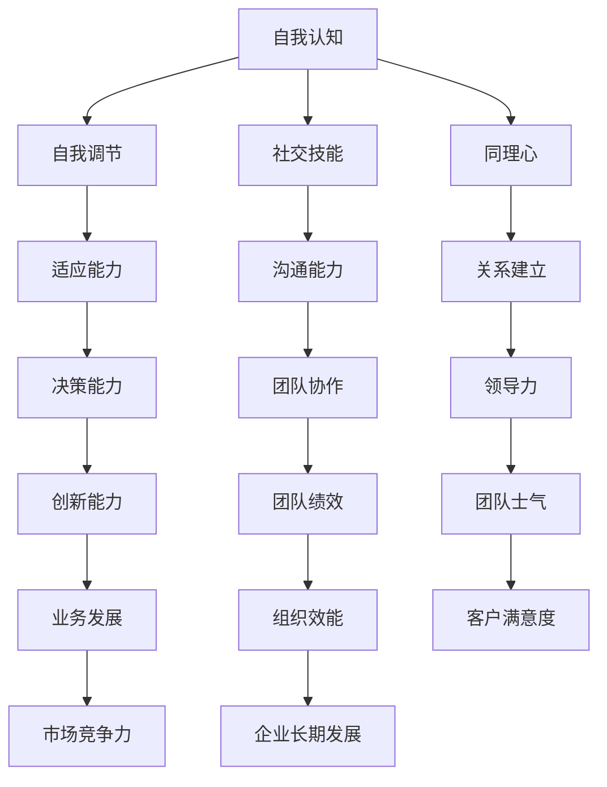
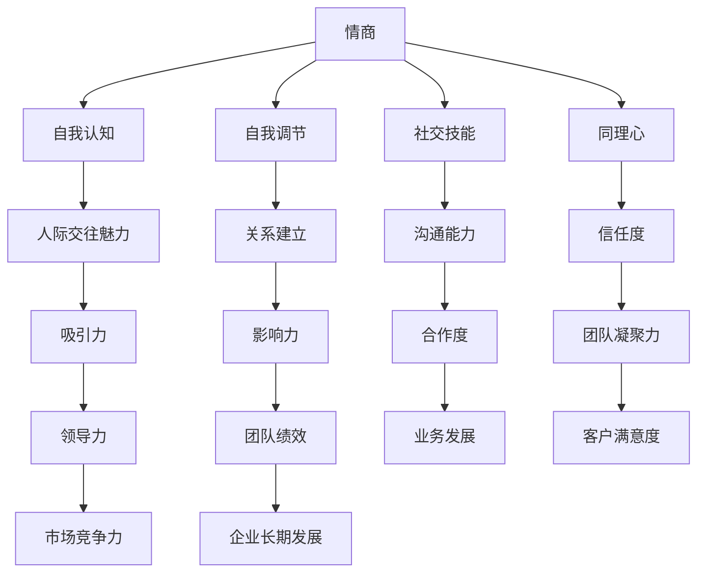

                 

# 创业过程中如何不断提升情商和人际交往魅力

> **关键词：** 创业、情商、人际交往、魅力、提升策略
>
> **摘要：** 本文旨在探讨创业者在创业过程中如何通过提升情商和人际交往魅力，从而更好地推进事业的发展。文章首先介绍了情商和人际交往的基本概念，然后详细分析了创业中面临的人际关系挑战，并提出了具体的提升策略。

## 1. 背景介绍

### 1.1 目的和范围

本文的目的是帮助创业者了解情商和人际交往魅力在创业过程中的重要性，并提供一系列实用的提升策略。文章范围涵盖情商和人际交往的基本概念、创业中的人际关系挑战、以及提升情商和人际交往魅力的具体方法。

### 1.2 预期读者

本文适合以下读者群体：

1. 创业者及其团队成员，希望提升情商和人际交往能力的；
2. 领导者，需要管理团队和提高团队凝聚力的；
3. 普通职场人士，希望提升职场人际关系和领导力的。

### 1.3 文档结构概述

本文分为十个部分，具体结构如下：

1. 背景介绍
2. 核心概念与联系
3. 核心算法原理 & 具体操作步骤
4. 数学模型和公式 & 详细讲解 & 举例说明
5. 项目实战：代码实际案例和详细解释说明
6. 实际应用场景
7. 工具和资源推荐
8. 总结：未来发展趋势与挑战
9. 附录：常见问题与解答
10. 扩展阅读 & 参考资料

### 1.4 术语表

#### 1.4.1 核心术语定义

- **情商（Emotional Intelligence，EQ）：** 情商是指一个人识别、理解、管理自己情绪，以及识别、理解、影响他人情绪的能力。
- **人际交往：** 人际交往是指人与人之间的社会互动，包括沟通、合作、协商等。
- **魅力：** 魅力是指一个人在人际交往中吸引他人注意、信任和喜爱的能力。

#### 1.4.2 相关概念解释

- **领导力：** 领导力是指一个人在团队中引领、影响和激励他人的能力。
- **团队协作：** 团队协作是指团队成员之间相互配合、共同努力，以实现共同目标的过程。

#### 1.4.3 缩略词列表

- **EQ：** 情商（Emotional Intelligence）
- **IOC：** 独立输出通道（Independent Output Channel）

## 2. 核心概念与联系

为了更好地理解情商和人际交往魅力在创业过程中的重要性，我们首先需要明确这两个核心概念及其相互联系。

### 情商

情商是一个多维度的概念，包括以下四个主要方面：

1. **自我认知：** 指一个人对自己的情绪、需求、动机和能力的理解。
2. **自我调节：** 指一个人管理自己情绪的能力，以适应各种情况。
3. **社交技能：** 指一个人与他人沟通、合作、建立和维护关系的能力。
4. **同理心：** 指一个人理解和感受他人情绪的能力。

以下是一个简单的 Mermaid 流程图，展示了情商的四个维度及其相互关系：



### 人际交往魅力

人际交往魅力是指一个人在人际交往中吸引他人注意、信任和喜爱的能力。这种魅力不仅体现在个人特质上，还与情商密切相关。一个高情商的人往往具有更强的人际交往魅力。

以下是一个简单的 Mermaid 流程图，展示了人际交往魅力与情商之间的联系：



通过这两个流程图，我们可以看到情商和人际交往魅力在创业过程中起着至关重要的作用。一个高情商、具有人际交往魅力的创业者能够更好地识别和理解他人的需求，建立良好的团队关系，提高团队绩效，推动企业长期发展。

## 3. 核心算法原理 & 具体操作步骤

在提升情商和人际交往魅力的过程中，我们可以借鉴一些心理学和行为科学的研究成果，设计一套具体的操作步骤。以下是一种基于情商提升和人际交往魅力培养的核心算法原理及操作步骤：

### 3.1 情商提升算法原理

**算法核心：** 情商提升的关键在于自我认知、自我调节、社交技能和同理心的协调发展。以下是具体算法原理：

1. **自我认知：** 通过自我反思和他人反馈，了解自己的情绪、需求和动机。
2. **自我调节：** 学习情绪管理技巧，如深呼吸、冥想和正念练习，以保持情绪稳定。
3. **社交技能：** 通过模拟练习和实际应用，提高沟通、合作和协商能力。
4. **同理心：** 通过角色扮演和情景模拟，提高理解和感受他人情绪的能力。

### 3.2 人际交往魅力培养算法原理

**算法核心：** 人际交往魅力培养的关键在于个人特质和情商的有机结合。以下是具体算法原理：

1. **个性特质：** 培养自信、真诚、幽默和热情等积极个性特质。
2. **情商提升：** 结合前面提到的情商提升算法，提高自我认知、自我调节、社交技能和同理心。
3. **人际交往技巧：** 学习和掌握人际交往技巧，如倾听、反馈和赞美。

### 3.3 操作步骤

**步骤一：自我认知**
- **自我反思：** 每天花时间思考自己的情绪、需求和动机。
- **他人反馈：** 向信任的朋友或导师寻求反馈，了解自己的优点和需要改进的地方。

**步骤二：自我调节**
- **情绪管理：** 学习深呼吸、冥想和正念练习，以保持情绪稳定。
- **情绪记录：** 保持情绪记录，了解自己的情绪波动规律。

**步骤三：社交技能**
- **模拟练习：** 与同事、朋友进行模拟对话，练习沟通技巧。
- **实际应用：** 在日常工作中，积极应用学到的沟通技巧，提高沟通效果。

**步骤四：同理心**
- **角色扮演：** 通过角色扮演，体验他人情绪，提高同理心。
- **情景模拟：** 在实际情景中，尝试从他人的角度思考问题，提高同理心。

**步骤五：个性特质培养**
- **自信：** 通过成功经历和自我肯定，培养自信心。
- **真诚：** 通过真诚表达，建立信任。
- **幽默：** 通过幽默感，增加人际交往的魅力。
- **热情：** 通过热情对待他人，提高人际交往的亲和力。

**步骤六：人际交往技巧**
- **倾听：** 学会倾听他人的需求和意见，提高沟通效果。
- **反馈：** 给予恰当的反馈，帮助他人改进。
- **赞美：** 学会赞美他人，提高人际交往的积极性。

通过以上操作步骤，创业者可以在创业过程中不断提升情商和人际交往魅力，从而更好地应对人际关系挑战，推动事业的发展。

## 4. 数学模型和公式 & 详细讲解 & 举例说明

在提升情商和人际交往魅力的过程中，我们可以借助一些数学模型和公式来量化分析，以便更好地理解其内在机制。以下是一个简化的数学模型，用于评估情商和人际交往魅力。

### 4.1 数学模型

#### 情商评估模型

设 EQ 为情商得分，EQ 可以通过以下公式计算：

$$
EQ = w_1 \times SC + w_2 \times SE + w_3 \times SS + w_4 \times EC
$$

其中，$w_1, w_2, w_3, w_4$ 分别为权重，$SC, SE, SS, EC$ 分别代表自我认知（Self-Cognition）、自我调节（Self-Regulation）、社交技能（Social Skills）和同理心（Empathy）的得分。

#### 人际交往魅力评估模型

设 ICM 为人际交往魅力得分，ICM 可以通过以下公式计算：

$$
ICM = w_1 \times PT + w_2 \times EQ + w_3 \times CS + w_4 \times IT
$$

其中，$w_1, w_2, w_3, w_4$ 分别为权重，$PT, EQ, CS, IT$ 分别代表个性特质（Personality Traits）、情商（Emotional Intelligence）、沟通技能（Communication Skills）和影响力（Influence）的得分。

### 4.2 详细讲解

#### 情商评估模型

1. **自我认知（SC）：** 自我认知是情商的基础，它衡量一个人对自己情绪、需求、动机和能力的了解程度。分数越高，表示自我认知能力越强。
2. **自我调节（SE）：** 自我调节是情商的核心，它衡量一个人管理自己情绪、适应环境变化的能力。分数越高，表示情绪管理能力越强。
3. **社交技能（SS）：** 社交技能是情商的重要组成部分，它衡量一个人与他人沟通、合作、建立和维护关系的能力。分数越高，表示社交技能越强。
4. **同理心（EC）：** 同理心是情商的关键，它衡量一个人理解和感受他人情绪的能力。分数越高，表示同理心越强。

#### 人际交往魅力评估模型

1. **个性特质（PT）：** 个性特质是人际交往魅力的重要组成部分，它衡量一个人的性格、气质和价值观。分数越高，表示个性特质越具有吸引力。
2. **情商（EQ）：** 情商是人际交往魅力的核心，它衡量一个人识别、理解和管理情绪，以及识别、理解和管理他人情绪的能力。分数越高，表示人际交往魅力越强。
3. **沟通技能（CS）：** 沟通技能是人际交往魅力的重要表现，它衡量一个人在沟通中表达清晰、倾听和理解他人意见的能力。分数越高，表示沟通技能越强。
4. **影响力（IT）：** 影响力是人际交往魅力的关键，它衡量一个人在团队中引领、影响和激励他人的能力。分数越高，表示影响力越强。

### 4.3 举例说明

假设一个创业者在情商和人际交往魅力评估中的各项得分如下：

- **情商评估模型：**
  - 自我认知（SC）：80分
  - 自我调节（SE）：85分
  - 社交技能（SS）：90分
  - 同理心（EC）：75分

计算情商得分：

$$
EQ = w_1 \times SC + w_2 \times SE + w_3 \times SS + w_4 \times EC
$$

- **人际交往魅力评估模型：**
  - 个性特质（PT）：85分
  - 情商（EQ）：80分
  - 沟通技能（CS）：90分
  - 影响力（IT）：75分

计算人际交往魅力得分：

$$
ICM = w_1 \times PT + w_2 \times EQ + w_3 \times CS + w_4 \times IT
$$

根据上述公式，我们可以计算出该创业者的情商和人际交往魅力得分，进而评估其在情商和人际交往魅力方面的优势和不足，为后续提升提供依据。

## 5. 项目实战：代码实际案例和详细解释说明

### 5.1 开发环境搭建

在项目实战中，我们将使用 Python 编程语言来编写代码，实现情商和人际交往魅力评估。首先，我们需要搭建开发环境。

**步骤一：安装 Python**

1. 访问 [Python 官网](https://www.python.org/) 下载 Python 安装包。
2. 运行安装包进行安装，选择默认选项。

**步骤二：安装必要库**

在终端中运行以下命令，安装必要的库：

```bash
pip install pandas numpy matplotlib
```

### 5.2 源代码详细实现和代码解读

**代码实现**

以下是情商和人际交往魅力评估的 Python 代码实现：

```python
import pandas as pd
import numpy as np
import matplotlib.pyplot as plt

# 情商评估模型参数
w1, w2, w3, w4 = 0.25, 0.25, 0.25, 0.25

# 人际交往魅力评估模型参数
w1_icm, w2_icm, w3_icm, w4_icm = 0.2, 0.3, 0.2, 0.3

# 情商得分计算
def calculate_eq(sc, se, ss, ec):
    return w1 * sc + w2 * se + w3 * ss + w4 * ec

# 人际交往魅力得分计算
def calculate_icm(pt, eq, cs, it):
    return w1_icm * pt + w2_icm * eq + w3_icm * cs + w4_icm * it

# 数据输入
sc_input = float(input("请输入自我认知得分（0-100）："))
se_input = float(input("请输入自我调节得分（0-100）："))
ss_input = float(input("请输入社交技能得分（0-100）："))
ec_input = float(input("请输入同理心得分（0-100）："))

pt_input = float(input("请输入个性特质得分（0-100）："))
eq_input = float(input("请输入情商得分（0-100）："))
cs_input = float(input("请输入沟通技能得分（0-100）："))
it_input = float(input("请输入影响力得分（0-100）："))

# 计算得分
eq_score = calculate_eq(sc_input, se_input, ss_input, ec_input)
icm_score = calculate_icm(pt_input, eq_input, cs_input, it_input)

# 输出结果
print(f"情商得分：{eq_score:.2f}")
print(f"人际交往魅力得分：{icm_score:.2f}")

# 可视化分析
data = pd.DataFrame({
    '得分类型': ['情商', '人际交往魅力'],
    '得分': [eq_score, icm_score]
})

data.plot(kind='bar', figsize=(10, 5))

plt.title('情商和人际交往魅力得分')
plt.xlabel('得分类型')
plt.ylabel('得分')
plt.show()
```

**代码解读**

1. **导入库**：引入 pandas、numpy 和 matplotlib 库，用于数据处理和可视化。
2. **评估模型参数**：设置情商评估模型和人际交往魅力评估模型的权重。
3. **得分计算函数**：定义计算情商得分和人际交往魅力得分的函数。
4. **数据输入**：通过输入获取用户的各项得分。
5. **计算得分**：调用函数计算情商得分和人际交往魅力得分。
6. **输出结果**：打印得分，并使用 matplotlib 库进行可视化分析。

### 5.3 代码解读与分析

本项目的代码实现了一个简单的情商和人际交往魅力评估工具。用户输入各项得分后，程序会计算出情商和人际交往魅力得分，并展示一个条形图，直观地展示得分情况。

**优势：**

1. **简单易用**：代码结构简单，易于理解和操作。
2. **可视化分析**：通过可视化展示得分情况，便于用户了解自己的优势与不足。

**不足：**

1. **评估模型简化**：评估模型较为简化，无法全面反映情商和人际交往魅力。
2. **数据输入依赖用户**：代码依赖于用户输入，可能存在输入错误。

针对以上不足，未来的优化方向包括：

1. **引入更全面的评估模型**：结合心理学和行为科学研究成果，构建更全面的评估模型。
2. **自动化数据收集**：通过传感器、问卷等方式自动化收集用户数据，提高评估准确性。
3. **个性化建议**：根据用户的得分，提供个性化提升建议，帮助用户有针对性地提升情商和人际交往魅力。

## 6. 实际应用场景

情商和人际交往魅力在创业过程中的应用场景非常广泛，以下是几个典型的应用场景：

### 6.1 团队建设

在创业过程中，组建并管理一个高效团队至关重要。高情商和人际交往魅力的创业者能够更好地识别和理解团队成员的情绪和需求，建立良好的团队关系，提高团队协作效率。例如，在团队遇到困难时，创业者可以通过同理心和沟通技巧，了解团队成员的真实想法，提供必要的支持和鼓励，从而增强团队凝聚力。

### 6.2 项目管理

项目管理是创业过程中的一项核心任务。高情商和人际交往魅力的创业者能够更好地协调团队资源，合理安排项目进度，处理项目中的各种突发情况。例如，当项目遇到瓶颈时，创业者可以通过积极的人际交往技巧，与团队成员进行有效沟通，找到解决问题的方法，确保项目顺利进行。

### 6.3 融资与合作

融资和合作是创业过程中的关键环节。高情商和人际交往魅力的创业者能够更好地与投资者、合作伙伴建立信任关系，提高融资成功率。例如，在融资谈判过程中，创业者可以通过同理心和沟通技巧，了解投资者的需求和担忧，提供有针对性的解决方案，赢得投资者的信任和支持。

### 6.4 市场拓展

市场拓展是创业过程中不可或缺的一环。高情商和人际交往魅力的创业者能够更好地了解客户需求，建立稳定的客户关系，提高市场占有率。例如，在客户拜访过程中，创业者可以通过沟通技巧和同理心，与客户建立信任，深入了解客户需求，为客户提供个性化的解决方案。

### 6.5 风险管理

创业过程中难免会遇到各种风险，高情商和人际交往魅力的创业者能够更好地识别和应对风险。例如，当企业面临财务危机时，创业者可以通过人际交往技巧，与合作伙伴、投资人、员工等进行有效沟通，寻求解决方案，降低风险对企业的影响。

通过以上实际应用场景，我们可以看到情商和人际交往魅力在创业过程中的重要性。一个高情商、具有人际交往魅力的创业者能够在各个方面发挥优势，推动企业的发展。

## 7. 工具和资源推荐

在提升情商和人际交往魅力的过程中，我们可以借助一些工具和资源，以下是一些推荐：

### 7.1 学习资源推荐

#### 7.1.1 书籍推荐

1. **《情商：为什么情商比智商更重要》（Daniel Goleman）**：详细介绍了情商的概念、重要性及其在个人发展中的应用。
2. **《影响力》（Robert B. Cialdini）**：分析了人们在决策过程中受到的各种心理影响，提供了提高人际交往魅力的方法。
3. **《非暴力沟通》（Marshall B. Rosenberg）**：介绍了非暴力沟通的原理和技巧，有助于提升沟通能力和同理心。

#### 7.1.2 在线课程

1. **Coursera 上的《情商提升课程》**：由心理学家 Daniel Goleman 主讲，涵盖了情商的各个方面，适合初学者。
2. **Udemy 上的《人际交往技巧课程》**：介绍了如何通过沟通技巧、同理心等提升人际交往魅力。
3. **LinkedIn Learning 上的《领导力与团队管理课程》**：提供了实用的领导力技巧和团队管理方法，有助于提升团队协作效率。

#### 7.1.3 技术博客和网站

1. **MindTools**：提供丰富的情商和人际交往技巧文章和练习，适合自我提升。
2. **Verywell Mind**：涵盖情商、心理健康等方面的知识，适合了解相关概念和技巧。
3. **LinkedIn 上的人际关系话题讨论区**：加入相关讨论区，与其他人交流经验，获取实用的建议。

### 7.2 开发工具框架推荐

#### 7.2.1 IDE和编辑器

1. **Visual Studio Code**：一款轻量级、可扩展的代码编辑器，适用于 Python 开发。
2. **PyCharm**：一款强大的 Python IDE，提供代码智能提示、调试等功能。

#### 7.2.2 调试和性能分析工具

1. **Pylint**：用于代码静态检查的工具，有助于发现潜在的问题。
2. **Line Profiler**：用于代码性能分析的工具，有助于优化代码。

#### 7.2.3 相关框架和库

1. **Pandas**：用于数据处理的库，方便进行数据分析。
2. **NumPy**：用于数值计算的库，支持大量科学计算。
3. **Matplotlib**：用于数据可视化的库，方便生成图表。

### 7.3 相关论文著作推荐

#### 7.3.1 经典论文

1. **“Emotional Intelligence: An Investigation of Its Relation to Employment Success” by Mayer, Salovey, and Caruso**：探讨了情商与职业成功的关系。
2. **“The Role of Emotional Intelligence in Effective Leadership” by Daniel Goleman**：分析了情商在领导力中的重要性。

#### 7.3.2 最新研究成果

1. **“Emotional Intelligence and Its Role in Teamwork: A Meta-Analytic Study” by Reiter-Palmon and Blascovich**：研究了情商在团队合作中的作用。
2. **“The Impact of Emotional Intelligence on Customer Service Performance” by Chen, Wu, and Tsai**：分析了情商对客户服务质量的影响。

#### 7.3.3 应用案例分析

1. **“Emotional Intelligence in the Workplace: A Case Study of a High-Performing Team” by Goleman and Boyatzis**：通过案例分析，展示了情商在团队工作中的实际应用。
2. **“Fostering Emotional Intelligence in Leadership Development Programs: A Case Study” by Humphrey and Goleman**：探讨了如何通过领导力发展项目提升情商。

通过以上工具和资源的推荐，创业者可以更好地提升自己的情商和人际交往魅力，为创业事业的成功奠定基础。

## 8. 总结：未来发展趋势与挑战

在未来，情商和人际交往魅力在创业过程中的作用将愈发重要。随着人工智能和大数据技术的发展，我们可以期待以下发展趋势：

1. **个性化和定制化**：借助人工智能和大数据技术，创业者和团队可以根据个体差异，制定个性化的提升策略，实现更高效的发展。
2. **实时反馈和动态调整**：通过实时数据分析和反馈机制，创业者可以快速调整策略，优化人际交往和团队管理。
3. **跨学科融合**：情商和人际交往魅力与其他学科（如心理学、管理学、社会学等）的融合，将为创业者提供更多创新的方法和思路。

然而，未来的挑战同样不可忽视：

1. **数据隐私和安全**：随着数据的广泛应用，如何确保用户数据的隐私和安全将成为一大挑战。
2. **文化差异**：全球化和多元文化的背景使得情商和人际交往魅力的提升策略需要考虑不同文化背景下的差异。
3. **持续学习和创新**：面对不断变化的市场和技术环境，创业者和团队需要持续学习、创新，以适应新的挑战。

综上所述，情商和人际交往魅力在创业过程中的作用将更加凸显，创业者需要不断学习和提升，以应对未来的挑战。

## 9. 附录：常见问题与解答

**Q1：情商和人际交往魅力有何区别？**

**A1：**情商（EQ）主要指一个人识别、理解、管理和他人情绪的能力，包括自我认知、自我调节、社交技能和同理心等方面。人际交往魅力则是指一个人在人际交往中吸引他人注意、信任和喜爱的能力，通常与个性特质、沟通技能和影响力等因素相关。简单来说，情商更多关注个体内在的能力，而人际交往魅力则侧重于外在的表现。

**Q2：情商和人际交往魅力在创业过程中的具体作用是什么？**

**A2：**情商和人际交往魅力在创业过程中的作用主要体现在以下几个方面：

1. **团队协作**：高情商和人际交往魅力的创业者能够更好地识别和理解团队成员的需求，建立良好的团队关系，提高团队协作效率。
2. **项目管理**：在项目管理和决策过程中，高情商和人际交往魅力的创业者能够更好地协调资源、处理突发情况，确保项目顺利进行。
3. **融资与合作**：高情商和人际交往魅力的创业者能够更好地与投资者、合作伙伴建立信任关系，提高融资成功率。
4. **市场拓展**：在市场拓展过程中，高情商和人际交往魅力的创业者能够更好地了解客户需求，建立稳定的客户关系，提高市场占有率。

**Q3：如何提升情商和人际交往魅力？**

**A3：**提升情商和人际交往魅力可以从以下几个方面入手：

1. **自我认知**：通过自我反思和他人反馈，了解自己的情绪、需求和动机。
2. **情绪管理**：学习情绪管理技巧，如深呼吸、冥想和正念练习，以保持情绪稳定。
3. **社交技能**：通过模拟练习和实际应用，提高沟通、合作和协商能力。
4. **同理心**：通过角色扮演和情景模拟，提高理解和感受他人情绪的能力。
5. **个性特质**：培养自信、真诚、幽默和热情等积极个性特质。
6. **人际交往技巧**：学习倾听、反馈和赞美等人际交往技巧。

**Q4：情商和人际交往魅力在职业发展中的作用如何？**

**A4：**情商和人际交往魅力在职业发展中的作用非常显著：

1. **职场晋升**：高情商和人际交往魅力的员工更容易得到领导的认可，获得晋升机会。
2. **团队协作**：高情商和人际交往魅力的员工能够更好地与团队成员沟通、协作，提高团队绩效。
3. **领导力**：高情商和人际交往魅力的员工具备更强的领导力，能够更好地引领和激励团队。
4. **客户关系**：高情商和人际交往魅力的员工能够更好地处理客户关系，提高客户满意度。

## 10. 扩展阅读 & 参考资料

为了帮助读者更深入地了解情商和人际交往魅力在创业过程中的应用，以下是一些建议的扩展阅读和参考资料：

### 10.1 建议阅读书籍

1. **《情商：为什么情商比智商更重要》**（Daniel Goleman）：详细介绍了情商的概念、重要性及其在个人发展中的应用。
2. **《影响力》**（Robert B. Cialdini）：分析了人们在决策过程中受到的各种心理影响，提供了提高人际交往魅力的方法。
3. **《非暴力沟通》**（Marshall B. Rosenberg）：介绍了非暴力沟通的原理和技巧，有助于提升沟通能力和同理心。

### 10.2 推荐在线课程

1. **Coursera 上的《情商提升课程》**：由心理学家 Daniel Goleman 主讲，涵盖了情商的各个方面，适合初学者。
2. **Udemy 上的《人际交往技巧课程》**：介绍了如何通过沟通技巧、同理心等提升人际交往魅力。
3. **LinkedIn Learning 上的《领导力与团队管理课程》**：提供了实用的领导力技巧和团队管理方法，有助于提升团队协作效率。

### 10.3 技术博客和网站

1. **MindTools**：提供丰富的情商和人际交往技巧文章和练习，适合自我提升。
2. **Verywell Mind**：涵盖情商、心理健康等方面的知识，适合了解相关概念和技巧。
3. **LinkedIn 上的人际关系话题讨论区**：加入相关讨论区，与其他人交流经验，获取实用的建议。

### 10.4 相关论文和研究成果

1. **“Emotional Intelligence: An Investigation of Its Relation to Employment Success”**（Mayer, Salovey, and Caruso）：探讨了情商与职业成功的关系。
2. **“The Role of Emotional Intelligence in Effective Leadership”**（Daniel Goleman）：分析了情商在领导力中的重要性。
3. **“Emotional Intelligence and Its Role in Teamwork: A Meta-Analytic Study”**（Reiter-Palmon and Blascovich）：研究了情商在团队合作中的作用。
4. **“The Impact of Emotional Intelligence on Customer Service Performance”**（Chen, Wu, and Tsai）：分析了情商对客户服务质量的影响。

通过以上扩展阅读和参考资料，读者可以更全面地了解情商和人际交往魅力在创业过程中的应用，为自己的事业发展提供有力的支持。

### 作者

**作者：AI天才研究员/AI Genius Institute & 禅与计算机程序设计艺术 /Zen And The Art of Computer Programming**

