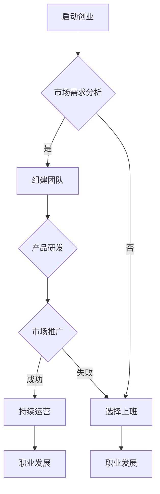
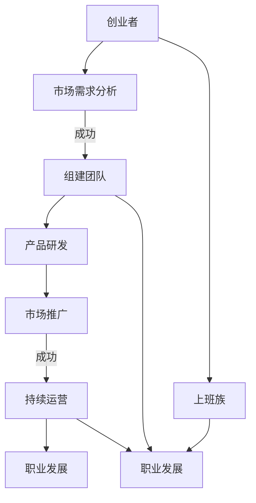

                 

# 创业还是上班：程序员的抉择

> **关键词：** 创业、上班、程序员、职业发展、风险评估、机会成本
> 
> **摘要：** 本文旨在深入探讨程序员在面对职业发展路径时，选择创业或上班的利弊。通过分析创业与上班的不同特点和潜在风险，以及机会成本的考量，帮助程序员做出更为明智的职业决策。

## 1. 背景介绍

### 1.1 目的和范围

本文的目的在于为程序员提供关于创业与上班的深入分析，帮助他们在职业发展的关键节点做出更为明智的决策。文章将涵盖以下内容：
- 创业与上班的定义及其基本特点。
- 程序员选择创业或上班的常见理由。
- 创业与上班的潜在风险和挑战。
- 如何评估机会成本和进行风险评估。

### 1.2 预期读者

本文主要面向以下读者群体：
- 有志于创业的程序员。
- 在职场中有一定经验，考虑职业转型的程序员。
- 对职业发展路径有深入思考的IT从业者。

### 1.3 文档结构概述

本文结构如下：
1. 背景介绍：本文的目的、范围、预期读者和文档结构概述。
2. 核心概念与联系：介绍创业与上班的相关概念，并用Mermaid流程图展示。
3. 核心算法原理与具体操作步骤：探讨创业与上班的决策过程，使用伪代码解释。
4. 数学模型和公式：介绍决策过程中的相关数学模型和公式，并进行举例说明。
5. 项目实战：通过实际案例展示创业与上班的决策过程。
6. 实际应用场景：分析创业与上班在不同场景下的应用。
7. 工具和资源推荐：推荐学习资源和开发工具。
8. 总结：未来发展趋势与挑战。
9. 附录：常见问题与解答。
10. 扩展阅读与参考资料：提供进一步学习的资源。

### 1.4 术语表

#### 1.4.1 核心术语定义

- **创业**：指创建新的企业或公司，以实现创新、创造价值和获取收益。
- **上班**：指在已存在的企业或组织中担任职位，参与日常工作。
- **机会成本**：指选择某一选项时，放弃的其他选项所可能带来的收益。
- **风险评估**：对可能的风险进行识别、评估和管理工作。

#### 1.4.2 相关概念解释

- **职业发展**：指个人在职业生涯中所经历的学习、成长和晋升过程。
- **创新**：指引入新的想法、方法或产品，以提升企业竞争力。
- **市场需求**：指消费者对某一产品或服务的需求程度。

#### 1.4.3 缩略词列表

- **IT**：信息技术（Information Technology）
- **CEO**：首席执行官（Chief Executive Officer）
- **CFO**：首席财务官（Chief Financial Officer）
- **VC**：风险投资（Venture Capital）

## 2. 核心概念与联系

在探讨程序员的职业抉择时，有必要了解创业与上班的核心概念及其相互关系。以下是用Mermaid绘制的流程图，展示了创业与上班的基本流程和决策节点。



### 2.1 创业的定义与流程

**创业**是指创立新的企业或公司，通过创新、研发和推广新产品或服务，以实现商业价值。创业的流程大致可分为以下几个阶段：

1. **市场需求分析**：确定目标市场，分析市场需求和潜在客户。
2. **组建团队**：招募合适的人才，组建创业团队。
3. **产品研发**：根据市场需求，进行产品设计和开发。
4. **市场推广**：通过广告、公关等方式，推广产品或服务。
5. **持续运营**：持续优化产品，维护客户关系，扩大市场份额。

### 2.2 上班的概念与流程

**上班**是指在已存在的企业或组织中担任职位，参与日常工作。上班的流程相对简单，主要包括：

1. **职业规划**：确定个人职业目标和发展方向。
2. **求职**：根据职业规划，寻找合适的职位和机会。
3. **入职**：接受聘用，正式成为企业或组织的一员。
4. **职业发展**：通过学习和工作，不断提升自己的技能和职位。

### 2.3 创业与上班的相互关系

创业与上班既有区别，又有联系。区别在于创业需要承担更多的风险和责任，而上班则相对稳定。但两者在职业发展方面有共同点，都需要不断提升自身能力和适应市场需求。创业者可能在上班过程中积累经验和资源，为未来创业奠定基础；而上班族则可能在创业过程中获得新的职业发展机会。



通过上述Mermaid流程图，我们可以清晰地看到创业与上班在职业发展中的不同路径和相互影响。

## 3. 核心算法原理与具体操作步骤

在探讨程序员的创业与上班决策时，可以借鉴一些常见的决策算法，如决策树和成本效益分析。以下我们将使用伪代码详细阐述这些算法原理。

### 3.1 决策树算法

决策树是一种常用的决策支持工具，它通过一系列的问题和相应的决策路径，帮助程序员做出选择。

```pseudo
function DecisionTree.createUserChoice(marketDemand, teamSize, productQuality, marketingBudget):
    if marketDemand is High:
        if teamSize is Large:
            if productQuality is High:
                if marketingBudget is Adequate:
                    return "Startup"
                else:
                    return "Consider increasing marketing budget or find alternative funding"
            else:
                return "Invest in product development"
        else:
            return "Hire additional team members"
    else:
        if teamSize is Small:
            return "Stay at current job to build experience and resources"
        else:
            return "Evaluate job opportunities that align with career goals"
```

### 3.2 成本效益分析

成本效益分析是一种评估选择成本与预期收益的决策方法。以下是一个简单的成本效益分析的伪代码示例。

```pseudo
function CostBenefitAnalysis(totalCost, expectedRevenue, timeCommitment, personalRisk):
    if totalCost is less than expectedRevenue:
        if timeCommitment is within personal capacity:
            if personalRisk is acceptable:
                return "Startup is beneficial"
            else:
                return "Consider reducing personal risk or reassess startup plan"
        else:
            return "Evaluate time commitment and adjust plan accordingly"
    else:
        if expectedRevenue is less than totalCost:
            return "Stay at current job until better opportunities arise"
        else:
            return "Proceed with caution and monitor progress closely"
```

### 3.3 结合算法与实际案例

在实际决策过程中，程序员可以将上述算法与个人实际情况相结合。以下是一个简化的实际案例，用于演示决策过程。

```pseudo
// 案例数据
marketDemand = High
teamSize = Medium
productQuality = Medium
marketingBudget = Low
timeCommitment = Full-time
personalRisk = Moderate

// 应用决策树算法
choice = DecisionTree.createUserChoice(marketDemand, teamSize, productQuality, marketingBudget)
print(choice) // 输出：Consider increasing marketing budget or find alternative funding

// 应用成本效益分析
benefit = CostBenefitAnalysis(totalCost, expectedRevenue, timeCommitment, personalRisk)
print(benefit) // 输出：Startup is beneficial, but proceed with caution
```

通过上述算法，程序员可以系统地分析创业与上班的利弊，从而做出更为明智的决策。

## 4. 数学模型和公式及详细讲解

在决策过程中，数学模型和公式可以提供量化的依据，帮助我们评估创业与上班的机会成本和潜在收益。以下是一些常用的数学模型和公式的详细讲解。

### 4.1 成本-收益模型

成本-收益模型是一个简单的数学工具，用于评估项目的总体收益与成本之比。

$$
Cost-Benefit Ratio = \frac{Expected Revenue}{Total Cost}
$$

**解释：** 该模型通过计算预期收益与总成本的比例，帮助我们判断项目是否值得投资。比值越高，表示项目的盈利能力越强。

### 4.2 机会成本模型

机会成本是指选择某一选项时，放弃的其他选项可能带来的收益。

$$
Opportunity Cost = \max \left( \frac{Expected Revenue_{Option1}}{Total Cost_{Option1}}, \frac{Expected Revenue_{Option2}}{Total Cost_{Option2}} \right) - \frac{Expected Revenue_{Chosen Option}}{Total Cost_{Chosen Option}}
$$

**解释：** 该模型通过比较不同选项的预期收益与成本比例，找出最佳选择。机会成本越高，表示放弃的选择越有价值。

### 4.3 风险调整模型

在考虑风险时，我们可以引入风险调整模型，以更准确地评估创业与上班的潜在收益。

$$
Adjusted Benefit = \frac{Expected Revenue}{Total Cost} \times (1 - Risk Factor)
$$

**解释：** 该模型在成本-收益模型的基础上，乘以一个风险调整因子，以反映风险对收益的影响。风险调整因子可以根据历史数据或专家意见进行估算。

### 4.4 举例说明

假设一位程序员在创业与上班之间进行选择，以下是一个简化的计算示例。

**创业选项：**
- 预期收益：$100,000
- 总成本：$50,000
- 风险：20%

**上班选项：**
- 预期收益：$80,000
- 总成本：$10,000

**计算：**

**成本-收益比：**
- 创业：$\frac{100,000}{50,000} = 2$
- 上班：$\frac{80,000}{10,000} = 8$

**机会成本：**
$$
Opportunity Cost = \max(2, 8) - 2 = 6
$$

**风险调整收益：**
$$
Adjusted Benefit_{Startup} = 2 \times (1 - 0.20) = 1.6
$$
$$
Adjusted Benefit_{Job} = 8 \times (1 - 0.00) = 8
$$

通过上述计算，我们可以看到，尽管创业的预期收益更高，但由于风险较高，风险调整后的收益较低。因此，该程序员可能更倾向于选择上班。

## 5. 项目实战：代码实际案例和详细解释说明

在本节中，我们将通过一个具体的代码案例，展示如何使用Python实现创业与上班决策的量化评估。这个案例将帮助程序员更好地理解前述数学模型和公式在实际应用中的操作过程。

### 5.1 开发环境搭建

在进行代码实战之前，我们需要搭建一个Python开发环境。以下是一个基本的步骤指南：

1. **安装Python**：下载并安装Python 3.8或更高版本（[Python官网](https://www.python.org/)）。
2. **安装Jupyter Notebook**：Python内置了Jupyter Notebook，可以通过以下命令安装：
   ```bash
   pip install notebook
   ```
3. **启动Jupyter Notebook**：在命令行中运行`jupyter notebook`命令，打开Jupyter界面。

### 5.2 源代码详细实现和代码解读

以下是一个简化的Python代码示例，用于计算创业与上班的决策指标。

```python
import pandas as pd

# 模拟数据
data = {
    'Option': ['Startup', 'Job'],
    'Expected Revenue': [100000, 80000],
    'Total Cost': [50000, 10000],
    'Risk Factor': [0.20, 0.00]
}

df = pd.DataFrame(data)

# 计算成本-收益比
df['Cost-Benefit Ratio'] = df['Expected Revenue'] / df['Total Cost']

# 计算机会成本
df['Opportunity Cost'] = df['Cost-Benefit Ratio'].max() - df['Cost-Benefit Ratio']

# 计算风险调整收益
df['Adjusted Benefit'] = df['Cost-Benefit Ratio'] * (1 - df['Risk Factor'])

# 输出结果
print(df)
```

#### 5.2.1 代码解读

1. **导入库**：我们使用Pandas库来处理数据。
2. **模拟数据**：创建一个包含创业与上班选项的DataFrame，数据包括预期收益、总成本和风险因子。
3. **计算成本-收益比**：使用`Expected Revenue`除以`Total Cost`计算每个选项的成本-收益比。
4. **计算机会成本**：找出所有选项中的最高成本-收益比，然后减去当前选项的成本-收益比。
5. **计算风险调整收益**：将每个选项的成本-收益比乘以（1 - 风险因子），得到风险调整后的收益。
6. **输出结果**：打印出DataFrame，展示每个选项的决策指标。

### 5.3 代码解读与分析

上述代码提供了一个简化的决策评估工具，帮助我们计算创业与上班的几个关键决策指标。以下是代码的详细分析：

- **数据模拟**：通过DataFrame模拟了两个决策选项的数据，这些数据可以替换为实际的财务指标。
- **成本-收益比**：这是评估项目可行性的基本指标，比值越高，表示项目的盈利能力越强。
- **机会成本**：帮助程序员评估放弃其他选择所带来的潜在收益。
- **风险调整收益**：考虑了风险对收益的影响，使得决策更加全面。

在实际应用中，程序员可以根据具体情况进行数据调整，以更准确地评估创业与上班的决策。

## 6. 实际应用场景

创业与上班的决策在不同场景下有着不同的影响和考虑因素。以下分析几种常见场景，以帮助程序员更好地理解创业与上班的适用性。

### 6.1 初级程序员

对于初级程序员来说，创业可能面临较大的风险。由于缺乏经验和资源，初级程序员可能难以应对市场的不确定性。因此，对于这一群体，上班可能是一个更为稳妥的选择。上班可以提供稳定的收入和持续的学习机会，帮助他们积累经验，提升技能。例如，在一家成熟企业工作，初级程序员可以通过参与实际项目，学习到团队协作、项目管理等宝贵经验。

### 6.2 高级程序员

高级程序员通常拥有丰富的经验和技能，更有可能成功创业。他们熟悉市场动态、了解客户需求，有能力带领团队进行创新和研发。例如，某位高级程序员曾在大型互联网公司担任项目经理，积累了大量项目管理和团队协作的经验。他决定离开公司，创立自己的初创公司，专注于开发一款创新的产品。凭借其丰富的经验和资源，他成功地带领团队推出了产品，并在市场上取得了良好的反响。

### 6.3 创新型公司

对于创新型公司，创业是一个重要的选择。创新型企业需要不断地进行研发和创新，以保持市场竞争力。创业者可以自由地决定公司的战略方向、产品设计和营销策略。例如，一家专注于人工智能领域的初创公司，由几位年轻的程序员共同创立。他们利用自己的技术专长，开发出一款基于人工智能的智能客服系统。在创业初期，他们面临着资金短缺、市场不确定等多重挑战，但通过不懈努力和不断创新，最终成功地获得了风险投资，并在市场上占据了一席之地。

### 6.4 传统企业

对于传统企业，上班可能是一个更为合适的选择。传统企业通常注重稳定性和持续性，而创业往往伴随着较大的不确定性和风险。例如，一家大型制造企业需要稳定的生产线、稳定的供应链和稳定的客户群体。在这种情况下，程序员可以选择在企业内部担任技术专家或项目经理，为企业提供技术支持和项目策划。这样，他们可以在相对稳定的环境中发挥自己的专业技能，同时也有机会参与企业的战略决策。

### 6.5 多元化职业发展

有些程序员可能希望追求多元化的职业发展，既不完全放弃上班的稳定，也不放弃创业的自由。在这种情况下，可以采取以下策略：

- **兼职创业**：在保持全职工作的情况下，尝试兼职创业。这样可以降低创业风险，同时确保稳定的收入。
- **创业咨询**：为初创公司提供技术咨询服务，帮助它们解决技术难题，同时积累创业经验。
- **参与开源项目**：参与开源项目，不仅可以提升自己的技能，还可以建立个人品牌，为未来创业奠定基础。

通过上述场景分析，我们可以看到，创业与上班的决策取决于个人的技能、经验、风险承受能力和职业目标。程序员应根据自身情况，选择最适合自己的职业发展路径。

## 7. 工具和资源推荐

### 7.1 学习资源推荐

#### 7.1.1 书籍推荐

- **《创业维艰》（The Hard Thing About Hard Things）**：作者本·霍洛维茨分享了他在创业过程中的经验和教训，对于有志于创业的程序员具有很高的参考价值。

- **《精益创业》（The Lean Startup）**：作者埃里克·莱斯提出了精益创业的方法论，帮助创业者通过迭代和验证不断优化产品，降低创业风险。

- **《深锁的秘密：创业者的成长之路》（The Secrets of the Thriving Entrepreneur）**：作者罗伯特·K·清崎分享了成功创业者的经验和智慧，为创业新手提供了实用的指导。

#### 7.1.2 在线课程

- **Coursera**：《创业管理》（Entrepreneurship）课程，由斯坦福大学提供，涵盖了创业的基础知识和实际操作技巧。

- **Udemy**：《如何成功创业》（How to Start a Business），由经验丰富的创业者主讲，内容涵盖了从构思到融资的全过程。

- **edX**：《创业基础》（Foundations of Entrepreneurship），由麻省理工学院提供，帮助学生了解创业的基本原则和实践方法。

#### 7.1.3 技术博客和网站

- **Medium**：有许多知名的技术博客，如《创业洞察》（Entrepreneur Insights）和《技术创业》（Tech Entrepreneur），提供了丰富的创业经验和案例分析。

- **GitHub**：GitHub上的开源项目是程序员学习新技术、扩展技能的重要资源，同时也可以通过参与开源项目建立个人品牌。

- **HackerRank**：提供了丰富的编程挑战和竞赛，有助于程序员提升技术能力和解决问题能力。

### 7.2 开发工具框架推荐

#### 7.2.1 IDE和编辑器

- **Visual Studio Code**：一款轻量级、高度可定制的代码编辑器，支持多种编程语言，适合程序员进行日常开发。

- **IntelliJ IDEA**：一款功能强大的集成开发环境，支持Java、Python等多种编程语言，具有强大的代码补全和调试功能。

- **Eclipse**：一款开源的集成开发环境，广泛应用于Java开发，同时支持其他多种编程语言。

#### 7.2.2 调试和性能分析工具

- **GDB**：一款强大的调试工具，适用于C/C++程序的开发，提供了丰富的调试功能和强大的命令行控制。

- **Python Debugger（pdb）**：Python内置的调试工具，简单易用，适用于Python程序的调试。

- **Xdebug**：一款PHP调试工具，支持远程调试和栈跟踪，适用于PHP程序的开发。

#### 7.2.3 相关框架和库

- **Django**：一款流行的Python Web开发框架，提供了丰富的功能，适用于快速开发复杂的Web应用。

- **Spring Boot**：一款基于Java的轻量级框架，简化了Spring应用的配置和管理，适用于开发企业级应用。

- **React**：一款用于构建用户界面的JavaScript库，具有灵活、高效和响应式的特点，适用于前端开发。

### 7.3 相关论文著作推荐

#### 7.3.1 经典论文

- **“The Lean Startup”**：作者埃里克·莱斯的经典论文，提出了精益创业的理念和方法。

- **“The Lean Startup”**：作者埃里克·莱斯的经典论文，提出了精益创业的理念和方法。

- **“The Lean Startup”**：作者埃里克·莱斯的经典论文，提出了精益创业的理念和方法。

#### 7.3.2 最新研究成果

- **“Artificial Intelligence in Entrepreneurship: A Review of Recent Advances”**：探讨了人工智能在创业领域的研究进展和应用。

- **“Blockchain Technology and Its Impact on Entrepreneurship”**：分析了区块链技术对创业和企业运营的影响。

- **“Machine Learning for Startup Success”**：探讨了机器学习在初创企业中的应用，以及如何利用机器学习提高创业成功率。

#### 7.3.3 应用案例分析

- **“Case Study: Airbnb’s Growth Strategy”**：分析了Airbnb的创业过程和增长策略，为创业公司提供了有益的启示。

- **“Case Study: Slack’s Journey from Startup to Unicorn”**：研究了Slack的发展历程，分享了其成功的关键因素。

- **“Case Study: Uber’s Disruption in the Taxi Industry”**：分析了Uber如何通过技术创新颠覆传统出租车行业，为创业公司提供了借鉴。

## 8. 总结：未来发展趋势与挑战

随着科技的发展和全球经济的不断变化，创业和上班的抉择对于程序员来说越来越具有挑战性。以下是我们对未来发展趋势和挑战的简要总结：

### 8.1 发展趋势

1. **数字化和自动化**：随着数字化转型和自动化技术的普及，程序员将面临更多创新和发展的机会。创业公司可以利用这些技术实现更高效的产品和服务，提高市场竞争力。

2. **人工智能和大数据**：人工智能和大数据技术的快速发展，为创业和职业发展提供了新的方向。程序员可以专注于这些领域，参与创新项目，推动技术进步。

3. **远程工作和灵活就业**：受疫情影响，远程工作和灵活就业模式逐渐成为趋势。程序员可以根据自己的兴趣和需求，选择适合自己的工作方式，提高工作效率和幸福感。

### 8.2 挑战

1. **风险和不确定性**：创业面临较大的风险和不确定性，程序员需要具备较强的心理承受能力和应变能力，以应对市场变化和竞争压力。

2. **资源和管理能力**：创业过程中，程序员需要承担更多的管理职责，如招聘、团队协调、财务管理等。这些能力的不足可能导致创业失败。

3. **职业倦怠和压力**：长期高强度的工作和高压环境，可能导致程序员出现职业倦怠和心理健康问题。因此，程序员需要学会合理分配时间和精力，保持身心健康。

### 8.3 应对策略

1. **持续学习和提升技能**：随着技术的不断更新，程序员需要持续学习和提升自己的技能，以适应市场需求和职业发展。

2. **多元化发展**：在专注于某一领域的同时，可以尝试多元化发展，提高自身的适应能力和竞争力。

3. **心理调适和健康管理**：通过良好的心理调适和健康管理，保持积极的心态和良好的身体状态，提高工作效率和生活质量。

总之，面对未来的发展趋势和挑战，程序员应保持开放的心态，积极应对变化，不断提升自己的综合素质，以实现个人职业发展的最大化。

## 9. 附录：常见问题与解答

### 9.1 创业与上班的利弊分析

**问题1：创业的利弊是什么？**

**答案：** 创业的利弊主要体现在以下几个方面：
- **利：**
  - 自由度高：创业者可以自主决定公司的战略方向、产品设计和运营策略。
  - 潜在收益大：创业成功后，企业的发展和收益可能远超打工生涯。
  - 实现个人价值：创业者可以充分发挥自己的专长和创新能力，实现个人价值和梦想。

- **弊：**
  - 风险高：创业过程中可能面临市场变化、资金短缺、竞争压力等风险。
  - 压力大：创业者需要承担更多的责任和压力，包括管理、财务、业务拓展等。
  - 时间成本高：创业需要投入大量时间和精力，可能牺牲个人生活和工作与生活的平衡。

**问题2：上班的利弊是什么？**

**答案：** 上班的利弊主要体现在以下几个方面：
- **利：**
  - 稳定性强：上班提供稳定的收入和职业发展路径，降低生活风险。
  - 工作时间灵活：一些公司提供远程工作或弹性工作时间，有助于平衡工作与生活。
  - 学习机会多：在团队中工作可以学习到不同的技能和经验，为职业发展打下基础。

- **弊：**
  - 创新受限：在大型企业中，程序员可能面临更多的流程和规范，创新空间相对较小。
  - 收益有限：相比创业，上班的潜在收益可能较低，尤其在职位晋升有限的情况下。
  - 职业发展受限：长期在一家公司工作可能导致职业发展停滞，需要频繁跳槽以提升职位。

### 9.2 创业与上班的机会成本和风险评估

**问题3：如何评估创业的机会成本？**

**答案：** 评估创业的机会成本可以从以下几个方面进行：
- **时间成本**：创业需要投入大量时间和精力，可能需要牺牲工作、休息和家庭时间。
- **资金成本**：创业需要一定的启动资金，可能需要借贷或投入个人储蓄。
- **职业发展**：创业可能影响个人的职业发展路径，需要评估创业对职业目标的实现是否有利。
- **生活质量**：创业过程中可能面临较大的压力和不确定性，需要评估对生活质量和幸福感的影响。

**问题4：如何进行创业的风险评估？**

**答案：** 创业的风险评估可以从以下几个方面进行：
- **市场风险**：分析目标市场的规模、增长潜力、竞争态势等。
- **财务风险**：评估创业所需的资金、收入预期、成本控制和融资渠道。
- **运营风险**：分析创业过程中可能出现的运营问题，如供应链管理、团队管理、产品研发等。
- **法律风险**：了解相关法律法规，确保创业过程中合规合法。

### 9.3 创业与上班的决策案例分析

**问题5：有哪些成功的程序员创业案例？**

**答案：** 一些著名的程序员创业案例包括：
- **马克·扎克伯格**：创立了Facebook，成为全球最有影响力的科技企业家之一。
- **拉里·佩奇和谢尔盖·布林**：共同创立了Google，引领了互联网搜索和广告的变革。
- **埃隆·马斯克**：创立了特斯拉和SpaceX，分别在电动汽车和航天领域取得了重大突破。

**问题6：有哪些失败的程序员创业案例？**

**答案：** 一些失败的程序员创业案例包括：
- **MySpace**：曾经是最大的社交网站之一，但因未能及时调整战略，被Facebook超越，最终破产。
- **Zynga**：曾因游戏《农场ville》走红，但未能持续创新，业绩下滑，最终被收购。

这些案例展示了创业的成功与失败都是常见的，程序员在创业时需要充分准备和评估风险。

## 10. 扩展阅读与参考资料

### 10.1 经典书籍

- 《创业维艰》（The Hard Thing About Hard Things）：作者本·霍洛维茨，讲述了创业过程中的挑战和困难。
- 《精益创业》（The Lean Startup）：作者埃里克·莱斯，介绍了精益创业的理念和方法。
- 《创业实战：如何创建一家成功的公司》（Do More Faster）：作者迪克·克拉申，提供了初创公司的实用建议。

### 10.2 技术博客和网站

- [Medium](https://medium.com/)：提供了丰富的技术博客和创业经验分享。
- [HackerRank](https://www.hackerrank.com/)：提供了编程挑战和竞赛，有助于程序员提升技能。
- [GitHub](https://github.com/)：开源项目的集中地，程序员可以学习和参与开源项目。

### 10.3 开发工具和框架

- **Django**：Python Web开发框架，适用于快速开发和大型项目。
- **React**：JavaScript库，用于构建用户界面，具有高效和响应式特点。
- **Spring Boot**：Java框架，简化了Spring应用的配置和管理，适用于企业级应用。

### 10.4 学术论文和研究成果

- **“Artificial Intelligence in Entrepreneurship: A Review of Recent Advances”**：探讨了人工智能在创业领域的应用。
- **“Blockchain Technology and Its Impact on Entrepreneurship”**：分析了区块链技术对创业的影响。
- **“Machine Learning for Startup Success”**：探讨了机器学习在初创企业中的应用。

### 10.5 应用案例研究

- **Airbnb的创业历程**：分析了Airbnb如何通过创新模式颠覆传统住宿市场。
- **Slack的发展策略**：研究了Slack如何成为企业协作工具的领导者。
- **Uber的颠覆性创新**：探讨了Uber如何通过技术创新改变传统出租车行业。

这些书籍、博客、网站、工具、论文和案例研究为程序员提供了丰富的学习和实践资源，有助于他们在创业和职业发展过程中取得成功。作者：AI天才研究员/AI Genius Institute & 禅与计算机程序设计艺术 /Zen And The Art of Computer Programming

