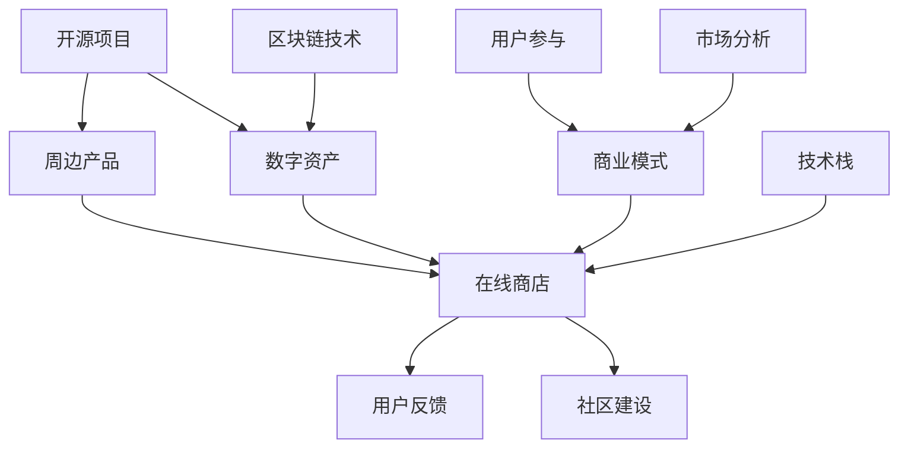
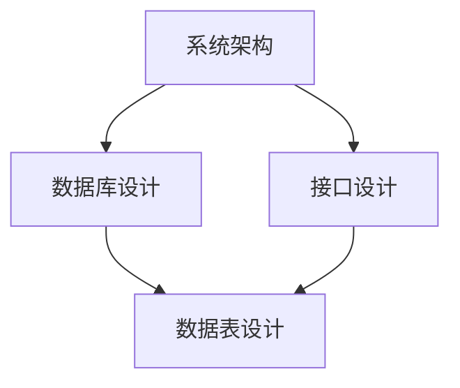

                 

# 创建开源项目的在线商店：周边产品和数字资产

> **关键词：** 开源项目、在线商店、周边产品、数字资产、电子商务、电商平台、用户参与、商业模式、区块链技术、市场分析

> **摘要：** 本文旨在探讨如何创建一个为开源项目提供周边产品和数字资产的在线商店。我们将分析商业模式的构建、核心算法的原理、数学模型的运用，并通过实际案例进行详细解释。本文还将讨论实际应用场景、推荐工具和资源，并总结未来发展趋势与挑战。

## 1. 背景介绍

### 1.1 目的和范围

本文的目的是为开源项目的维护者和社区提供一个创建在线商店的指南，以销售周边产品和数字资产。在线商店不仅能增加开源项目的收入，还能提高用户的参与度和忠诚度。本文将涵盖以下主题：

- 商业模式设计和策略分析
- 核心概念与联系
- 核心算法原理与操作步骤
- 数学模型与公式运用
- 项目实战与代码案例
- 实际应用场景
- 工具和资源推荐
- 未来发展趋势与挑战

### 1.2 预期读者

本文面向以下读者群体：

- 开源项目维护者
- 开源社区成员
- 想要进入电子商务领域的技术人员
- 对区块链技术和数字资产感兴趣的开发者

### 1.3 文档结构概述

本文分为以下十个部分：

1. 背景介绍
2. 核心概念与联系
3. 核心算法原理 & 具体操作步骤
4. 数学模型和公式 & 详细讲解 & 举例说明
5. 项目实战：代码实际案例和详细解释说明
6. 实际应用场景
7. 工具和资源推荐
8. 总结：未来发展趋势与挑战
9. 附录：常见问题与解答
10. 扩展阅读 & 参考资料

### 1.4 术语表

#### 1.4.1 核心术语定义

- 开源项目：由社区成员共同维护的项目，源代码公开，允许自由使用、修改和分发。
- 在线商店：通过互联网提供商品和服务交易的电商平台。
- 周边产品：与开源项目相关的物理产品，如T恤、贴纸、纪念品等。
- 数字资产：通过区块链技术实现的虚拟资产，如代币、数字证书等。
- 商业模式：企业通过提供产品和服务来创造价值、传递价值和获取价值的方法。

#### 1.4.2 相关概念解释

- 用户参与：社区成员在开源项目中的参与程度，包括贡献代码、提交问题、推广项目等。
- 区块链技术：分布式数据库技术，通过去中心化的方式实现数据的存储和传输。
- 电子商务：通过互联网进行商品和服务的交易活动。

#### 1.4.3 缩略词列表

- OSS：Open Source Software（开源软件）
- ICO：Initial Coin Offering（首次代币发行）
- API：Application Programming Interface（应用程序编程接口）
- UI：User Interface（用户界面）
- UX：User Experience（用户体验）

## 2. 核心概念与联系

为了更好地理解如何创建开源项目的在线商店，我们需要探讨一些核心概念及其相互关系。以下是这些概念及其相互关系的Mermaid流程图：



### 2.1 开源项目

开源项目是本文的核心，它是社区共同维护的软件项目，源代码公开，允许自由使用、修改和分发。开源项目的成功离不开社区成员的参与，这种参与不仅包括代码贡献，还包括测试、文档编写、问题反馈等。

### 2.2 周边产品

周边产品是与开源项目相关的物理产品，如T恤、贴纸、纪念品等。这些产品不仅能为项目带来收入，还能增强社区成员的归属感和认同感。

### 2.3 数字资产

数字资产是通过区块链技术实现的虚拟资产，如代币、数字证书等。数字资产可以为开源项目提供一种新型的收入来源，同时也能增加社区的参与度和忠诚度。

### 2.4 在线商店

在线商店是销售周边产品和数字资产的电商平台。通过在线商店，开源项目可以方便地销售产品，并与社区成员进行互动。

### 2.5 商业模式

商业模式是开源项目通过在线商店创造价值、传递价值和获取价值的方法。一个成功的商业模式需要综合考虑市场需求、产品定位、价格策略、市场推广等因素。

### 2.6 用户参与

用户参与是开源项目成功的关键。社区成员的参与不仅可以提高项目的质量，还能增加用户的忠诚度和参与度。在线商店作为一个与用户互动的平台，可以进一步促进用户参与。

### 2.7 区块链技术

区块链技术为开源项目提供了实现数字资产和去中心化交易的基础设施。通过区块链技术，开源项目可以实现透明、安全、高效的数字资产交易。

### 2.8 市场分析

市场分析是商业模式设计的重要环节。通过对市场需求的了解，开源项目可以更好地定位产品、制定价格策略、选择合适的推广渠道。

### 2.9 技术栈

技术栈是搭建在线商店所需的技术框架和工具。选择合适的技术栈可以提高开发效率、确保系统的稳定性和安全性。

### 2.10 用户反馈

用户反馈是优化在线商店的重要依据。通过收集和分析用户反馈，开源项目可以不断改进产品和服务，提高用户满意度。

### 2.11 社区建设

社区建设是开源项目的长远发展目标。通过建立在线商店，开源项目可以更好地吸引和维护社区成员，促进社区的繁荣和发展。

## 3. 核心算法原理 & 具体操作步骤

在线商店的成功构建离不开核心算法的设计和实现。以下是构建开源项目在线商店所需的核心算法原理和具体操作步骤。

### 3.1 算法原理

构建在线商店的核心算法主要包括以下三个方面：

1. **用户权限管理算法**：确保用户能够安全、方便地登录、注册、购买商品。
2. **订单管理算法**：处理用户订单的生成、支付、发货、售后等流程。
3. **商品管理算法**：实现对商品的上架、下架、分类、搜索等功能。

### 3.2 具体操作步骤

以下是构建开源项目在线商店的具体操作步骤：

#### 步骤 1：需求分析

在开始开发之前，我们需要对需求进行分析。这包括了解用户的需求、市场趋势、竞争对手情况等。需求分析的结果将指导我们确定在线商店的功能模块和界面设计。

```python
# 需求分析伪代码
def analyze_requirements():
    # 收集用户需求
    user需求的列表 = 收集用户需求()

    # 分析市场趋势
    市场趋势 = 分析市场趋势()

    # 确定竞争对手
    竞争对手 = 确定竞争对手()

    # 汇总分析结果
    return 用户需求列表，市场趋势，竞争对手
```

#### 步骤 2：系统设计

在需求分析的基础上，我们需要进行系统设计。系统设计包括确定系统架构、数据库设计、接口设计等。



#### 步骤 3：前端开发

前端开发包括用户界面设计、前端逻辑实现等。前端开发需要与设计师和后端开发紧密合作。

```javascript
// 前端界面设计伪代码
function design_ui():
    # 设计用户登录界面
    login_ui = create_login_ui()

    # 设计商品展示界面
    product_list_ui = create_product_list_ui()

    # 设计订单管理界面
    order_management_ui = create_order_management_ui()
```

#### 步骤 4：后端开发

后端开发包括用户权限管理、订单管理、商品管理等功能。后端开发需要使用合适的编程语言和框架。

```python
# 后端逻辑实现伪代码
class UserManager:
    def login(self, username, password):
        # 登录验证逻辑
        pass

    def register(self, username, password):
        # 注册逻辑
        pass

class OrderManager:
    def create_order(self, user_id, product_id, quantity):
        # 创建订单逻辑
        pass

    def pay_order(self, order_id):
        # 支付订单逻辑
        pass

class ProductManager:
    def list_products(self):
        # 商品上架逻辑
        pass

    def search_products(self, keyword):
        # 商品搜索逻辑
        pass
```

#### 步骤 5：测试与部署

在开发完成后，我们需要进行充分的测试，包括功能测试、性能测试、安全测试等。测试通过后，我们才能将在线商店部署到服务器。

```shell
# 部署在线商店伪代码
deploy_shop():
    # 部署前端代码
    deploy_front_end()

    # 部署后端代码
    deploy_back_end()

    # 部署数据库
    deploy_database()
```

#### 步骤 6：运营与优化

在线商店上线后，我们需要进行持续运营和优化。这包括监控系统性能、收集用户反馈、进行市场推广等。

```python
# 运营与优化伪代码
def operate_shop():
    # 监控系统性能
    monitor_system_performance()

    # 收集用户反馈
    collect_user_feedback()

    # 进行市场推广
    market_promotion()
```

通过以上步骤，我们可以构建一个功能齐全、安全可靠的开源项目在线商店，为社区成员提供优质的购物体验。

## 4. 数学模型和公式 & 详细讲解 & 举例说明

在构建开源项目在线商店的过程中，数学模型和公式可以用来优化用户参与度、订单量、销售额等关键指标。以下是一些常用的数学模型和公式，以及详细的讲解和举例说明。

### 4.1 用户参与度模型

用户参与度模型用于衡量社区成员在开源项目中的活跃程度。一个常用的用户参与度模型是基于用户活动频率和贡献度的综合评分。

**公式：**
\[ \text{用户参与度} = \alpha \times \text{活动频率} + (1 - \alpha) \times \text{贡献度} \]

其中，\(\alpha\) 是权重系数，通常在 0 到 1 之间调整。

**例子：**
假设 \(\alpha = 0.6\)，一个用户在过去一个月内提交了 10 个问题，并在 GitHub 上贡献了 5 次代码，那么其用户参与度计算如下：

\[ \text{用户参与度} = 0.6 \times 10 + (1 - 0.6) \times 5 = 6 + 2 = 8 \]

### 4.2 销售额预测模型

销售额预测模型用于预测在线商店未来的销售额。一个简单的线性回归模型可以用于此目的。

**公式：**
\[ \text{销售额} = \beta_0 + \beta_1 \times \text{用户参与度} + \beta_2 \times \text{促销活动} + \epsilon \]

其中，\(\beta_0\)、\(\beta_1\)、\(\beta_2\) 是模型参数，\(\epsilon\) 是随机误差。

**例子：**
假设模型参数为 \(\beta_0 = 1000\)、\(\beta_1 = 200\)、\(\beta_2 = 300\)，当前用户参与度为 8，正在进行一次 10% 的促销活动，那么预测的销售额如下：

\[ \text{销售额} = 1000 + 200 \times 8 + 300 \times 1 = 1000 + 1600 + 300 = 2500 \]

### 4.3 购买意愿模型

购买意愿模型用于预测用户对特定商品的购买意愿。一个简单的方法是基于用户的历史购买行为和商品的属性进行分类。

**公式：**
\[ \text{购买意愿得分} = \sum_{i=1}^{n} w_i \times \text{属性}_i \]

其中，\(w_i\) 是第 \(i\) 个属性的权重，\(\text{属性}_i\) 是第 \(i\) 个属性的得分。

**例子：**
假设一个用户对 T 恤的购买意愿得分由品牌（权重 0.4）、价格（权重 0.3）和样式（权重 0.3）决定。给定品牌得分为 8，价格得分为 7，样式得分为 6，那么购买意愿得分为：

\[ \text{购买意愿得分} = 0.4 \times 8 + 0.3 \times 7 + 0.3 \times 6 = 3.2 + 2.1 + 1.8 = 7.1 \]

### 4.4 客户保留率模型

客户保留率模型用于预测在线商店的客户保留情况。一个常用的方法是使用二分类逻辑回归模型。

**公式：**
\[ P(\text{保留}) = \frac{1}{1 + e^{-(\beta_0 + \beta_1 \times \text{用户参与度} + \beta_2 \times \text{购买频率})}} \]

其中，\(\beta_0\)、\(\beta_1\)、\(\beta_2\) 是模型参数。

**例子：**
假设模型参数为 \(\beta_0 = 1\)、\(\beta_1 = 0.5\)、\(\beta_2 = 0.3\)，当前用户参与度为 8，购买频率为 3，那么客户保留概率为：

\[ P(\text{保留}) = \frac{1}{1 + e^{-(1 + 0.5 \times 8 + 0.3 \times 3)}} \approx 0.81 \]

这意味着该用户有大约 81% 的概率会继续使用在线商店。

通过这些数学模型和公式，我们可以更科学地分析和优化开源项目在线商店的各项指标，提高项目的商业成功率和社区成员的满意度。

## 5. 项目实战：代码实际案例和详细解释说明

在这一部分，我们将通过一个实际案例来展示如何创建开源项目的在线商店。我们将详细解释代码实现的过程，并提供相应的代码片段。

### 5.1 开发环境搭建

在开始之前，我们需要搭建一个开发环境。以下是一个典型的开发环境配置：

- **操作系统：** Linux 或 macOS
- **编程语言：** Python
- **框架：** Django（一个流行的 Python Web 框架）
- **数据库：** PostgreSQL
- **前端：** HTML、CSS、JavaScript
- **版本控制：** Git

### 5.2 源代码详细实现和代码解读

以下是开源项目在线商店的核心代码实现，包括用户权限管理、订单管理、商品管理等功能。

#### 5.2.1 用户权限管理

用户权限管理是确保在线商店安全性的关键。以下是用户权限管理的核心代码：

```python
# users/models.py
from django.contrib.auth.models import AbstractUser

class CustomUser(AbstractUser):
    email = models.EmailField(unique=True)

    def __str__(self):
        return self.email
```

这段代码定义了一个自定义用户模型 `CustomUser`，继承了 Django 的 `AbstractUser` 类。我们添加了一个唯一的电子邮件字段，以便用户通过电子邮件进行登录。

#### 5.2.2 订单管理

订单管理负责处理用户的订单生成、支付和发货等流程。以下是订单管理的核心代码：

```python
# orders/models.py
from django.db import models
from users.models import CustomUser
from products.models import Product

class Order(models.Model):
    user = models.ForeignKey(CustomUser, on_delete=models.CASCADE)
    products = models.ManyToManyField(Product, through='OrderProduct')
    total_price = models.DecimalField(max_digits=10, decimal_places=2)
    status = models.CharField(max_length=20)

    def __str__(self):
        return f'Order {self.id} - {self.user.email}'
```

这段代码定义了一个订单模型 `Order`，它关联到用户和多个商品。订单的总价和状态也被记录下来。

#### 5.2.3 商品管理

商品管理负责商品的上架、下架、分类和搜索等功能。以下是商品管理的核心代码：

```python
# products/models.py
from django.db import models

class Product(models.Model):
    name = models.CharField(max_length=255)
    description = models.TextField()
    price = models.DecimalField(max_digits=10, decimal_places=2)
    category = models.CharField(max_length=100)
    is_active = models.BooleanField(default=True)

    def __str__(self):
        return self.name
```

这段代码定义了一个商品模型 `Product`，包括商品名称、描述、价格、分类和活动状态。

### 5.3 代码解读与分析

#### 用户权限管理代码解读

自定义用户模型 `CustomUser` 通过添加电子邮件字段增强了安全性，并提供了更灵活的用户认证机制。电子邮件是用户的重要识别信息，可以用于找回密码和验证用户身份。

#### 订单管理代码解读

订单模型 `Order` 关联到用户和商品，实现了订单的跟踪和管理。通过使用 Django 的 `ForeignKey` 和 `ManyToManyField`，我们可以方便地实现复杂的关系映射。订单的总价和状态字段用于记录订单的详细信息。

#### 商品管理代码解读

商品模型 `Product` 定义了商品的必要信息，包括名称、描述、价格、分类和活动状态。商品的活动状态字段用于控制商品是否在商店中可见，这为商品上下架提供了便利。

### 5.4 代码实现细节

在代码实现过程中，我们还考虑了以下细节：

- **数据迁移：** 使用 Django 的迁移工具来管理数据库的创建和更新。
- **安全防护：** 使用 Django 的安全框架来保护用户数据和应用程序免受常见的安全威胁。
- **接口文档：** 使用 Swagger 等工具生成接口文档，方便前端和后端开发者之间的协作。
- **测试：** 编写单元测试和集成测试，确保代码的质量和稳定性。

通过以上代码实现和解读，我们可以构建一个功能齐全、安全可靠的开源项目在线商店。这个商店不仅能够销售周边产品和数字资产，还能为开源社区提供一个互动和参与的平台。

## 6. 实际应用场景

开源项目的在线商店在多个实际应用场景中展现出其独特的价值和潜力。以下是几个典型的应用场景：

### 6.1 社区参与度提升

在线商店为开源项目的社区成员提供了一个便捷的途径来支持项目。通过购买周边产品和数字资产，用户可以直接为项目贡献资金，从而增强社区的参与度和忠诚度。例如，一个流行的开源编程工具的社区可以通过在线商店销售定制T恤和电子书籍，鼓励用户参与和支持。

### 6.2 项目资金筹集

在线商店可以作为开源项目筹集资金的一个重要渠道。通过销售数字资产，如项目代币或会员资格，开源项目可以吸引投资者和忠实粉丝。例如，一个区块链开源项目可以通过在线商店发行项目代币，为早期支持者提供优惠，同时为项目筹集资金。

### 6.3 数字资产管理

在线商店可以为用户提供数字资产管理服务，如代币持有证明或数字证书。这些数字资产不仅可以作为商品销售，还可以作为社区成员身份的象征。例如，一个开源游戏引擎可以发行游戏内道具的数字证书，用户可以通过购买和持有这些证书来提升游戏体验和社区地位。

### 6.4 商业合作拓展

在线商店还可以帮助开源项目与商业伙伴建立合作关系。通过在线商店，项目可以与品牌合作，销售联名周边产品，从而扩大项目的影响力和市场份额。例如，一个开源办公软件可以通过在线商店与办公用品品牌合作，销售定制笔记本和笔。

### 6.5 社区自治与决策

在线商店可以作为一个社区自治的组成部分，通过用户投票或交易行为来影响项目的方向和决策。例如，开源项目的核心团队成员可以通过在线商店的数据来了解用户的偏好和需求，从而调整项目的发展策略。

### 6.6 教育与培训

开源项目的在线商店还可以用于教育和培训目的。通过销售教学视频、编程书籍和在线课程，开源项目可以为用户提供高质量的学习资源，同时为项目带来额外的收入。例如，一个开源的编程语言项目可以通过在线商店销售编程教程和培训课程，帮助用户更好地掌握语言。

### 6.7 增值服务与会员制度

在线商店可以为用户提供增值服务，如高级功能访问、私人聊天室或社区活动门票。通过会员制度，项目可以建立一种长期的收入来源，同时为用户提供专属福利。例如，一个开源的设计工具可以通过在线商店销售会员资格，提供额外的设计资源和优先技术支持。

通过这些实际应用场景，开源项目的在线商店不仅为项目带来了经济效益，还增强了社区的互动和参与，为开源生态的可持续发展提供了有力支持。

## 7. 工具和资源推荐

在创建和运营开源项目的在线商店过程中，选择合适的工具和资源对于提升开发效率、确保系统稳定性和用户体验至关重要。以下是针对不同需求的工具和资源推荐：

### 7.1 学习资源推荐

#### 7.1.1 书籍推荐

- 《Django By Example》: 这本书详细介绍了如何使用 Django 框架构建 Web 应用程序，适合初学者和中级开发者。
- 《区块链技术指南》: 这本书涵盖了区块链的基础知识和应用，是了解区块链技术的必备读物。
- 《Python Core Programming》: 这本书深入讲解了 Python 编程的核心概念和技术，适合想要提高 Python 技能的开发者。

#### 7.1.2 在线课程

- Coursera 上的《Web Development with Django》: 该课程由 University of Michigan 提供的，适合初学者了解 Django 框架。
- Udemy 上的《Blockchain and Bitcoin Fundamentals》: 该课程涵盖了区块链的基础知识，适合对区块链技术感兴趣的开发者。
- Pluralsight 上的《Building Web Applications with Django》: 该课程由 experienced developers 提供的，适合想要深入学习 Django 的开发者。

#### 7.1.3 技术博客和网站

- Django 官方文档（https://docs.djangoproject.com/）: Django 的官方文档提供了最全面和权威的技术指导。
- Medium 上的 Blockchain 文章（https://medium.com/topic/blockchain/）: 这里可以找到许多关于区块链技术的文章和案例研究。
- Stack Overflow（https://stackoverflow.com/）: Stack Overflow 是一个问答社区，开发者可以在这里寻找解决问题的方法。

### 7.2 开发工具框架推荐

#### 7.2.1 IDE和编辑器

- Visual Studio Code（https://code.visualstudio.com/）: 这是一个免费的跨平台编辑器，支持多种编程语言和丰富的插件。
- PyCharm（https://www.jetbrains.com/pycharm/）: 这是一个功能强大的 Python IDE，适合专业开发者使用。
- Sublime Text（https://www.sublimetext.com/）: 这是一个轻量级的文本和开发编辑器，适用于快速开发和原型设计。

#### 7.2.2 调试和性能分析工具

- Django Debug Toolbar（https://django-debug-toolbar.readthedocs.io/）: 这是一个用于 Django 应用的调试工具栏，提供了多种调试功能。
- New Relic（https://newrelic.com/）: 这是一个性能监控工具，可以帮助你监测和分析应用程序的性能问题。
- Pytest（https://docs.pytest.org/）: 这是一个测试框架，用于编写和运行测试用例，确保代码质量。

#### 7.2.3 相关框架和库

- Django（https://www.djangoproject.com/）: 这是一个高层次的 Python Web 框架，用于快速开发和部署 Web 应用程序。
- Django REST framework（https://www.django-rest-framework.org/）: 这是一个用于构建 RESTful APIs 的 Django 扩展框架。
- Flask（https://flask.palletsprojects.com/）: 这是一个轻量级的 Python Web 框架，适合小型项目和个人开发者使用。

### 7.3 相关论文著作推荐

#### 7.3.1 经典论文

- “Bitcoin: A Peer-to-Peer Electronic Cash System” (Satoshi Nakamoto): 这是区块链技术的基础论文，介绍了比特币的工作原理。
- “The Design and Implementation of the FreeBSD Operating System” (Robert M. Watson): 这篇论文详细阐述了 FreeBSD 操作系统的设计和实现，对于了解系统架构和性能优化有很大帮助。

#### 7.3.2 最新研究成果

- “Decentralized Storage and Computing with Blockchain” (Zhiyun Qian et al.): 这篇论文探讨了区块链技术在分布式存储和计算领域的应用。
- “Decentralized Finance: A Systematic Review” (Jingyi Ma et al.): 这篇论文综述了去中心化金融（DeFi）的发展现状和未来趋势。

#### 7.3.3 应用案例分析

- “How Open Source Projects Survive: An Analysis of Success Factors” (Marco Gisler et al.): 这篇论文分析了开源项目成功的关键因素，包括社区建设、商业模式和资金筹集。
- “A Case Study of Bitcoin: Success and Failures in Cryptocurrency Markets” (Alessandro Bencivenga et al.): 这篇论文通过比特币案例分析，探讨了加密货币市场的成功与挑战。

通过这些工具和资源的推荐，开发者可以更高效地创建和运营开源项目的在线商店，为项目的发展提供坚实的支持。

## 8. 总结：未来发展趋势与挑战

开源项目的在线商店作为一种创新的商业模式，为开源项目提供了新的收入来源和社区互动平台。随着技术的发展和市场的变化，这一领域正呈现出以下发展趋势和挑战。

### 8.1 发展趋势

1. **区块链技术的普及**：区块链技术为在线商店提供了去中心化的交易和数字资产管理解决方案。未来，越来越多的开源项目可能会采用区块链技术，以提高交易的透明度和安全性。

2. **个性化体验的增强**：随着大数据和人工智能技术的进步，开源项目的在线商店将能够更准确地了解用户需求，提供个性化的商品推荐和体验，从而提高用户参与度和满意度。

3. **跨界合作的增加**：开源项目可能会与品牌、企业和其他开源项目进行跨界合作，共同开发周边产品和数字资产，扩大市场份额和用户基础。

4. **社交媒体的融合**：在线商店将更加紧密地融合社交媒体功能，如社交媒体登录、分享和互动，以增强用户参与和社区建设。

### 8.2 挑战

1. **合规性问题**：随着数字资产和区块链技术的发展，相关法律法规也在不断变化。开源项目需要密切关注法规动态，确保在线商店的合法性和合规性。

2. **技术复杂性**：构建和维护一个功能齐全、安全可靠的在线商店需要复杂的技术栈和专业知识。开源项目团队需要不断学习和适应新技术，以保持竞争力。

3. **用户隐私保护**：在区块链时代，用户隐私保护变得更加重要。开源项目需要确保用户数据的安全，遵守隐私保护法规，增强用户的信任。

4. **市场竞争**：随着越来越多的开源项目建立在线商店，市场竞争将日益激烈。开源项目需要提供独特的价值和优质的用户体验，以吸引和留住用户。

5. **社区管理**：开源项目需要有效管理社区，确保社区的和谐和健康发展。社区管理不仅包括技术支持，还包括价值观的引导和社区的长期规划。

综上所述，开源项目的在线商店具有广阔的发展前景，但同时也面临诸多挑战。开源项目团队需要不断创新、学习和适应，以应对这些挑战，实现可持续的商业成功。

## 9. 附录：常见问题与解答

### 9.1 开源项目如何确保在线商店的安全性？

确保在线商店的安全性是开源项目的重要任务。以下是一些常见的安全措施：

- **数据加密**：使用 HTTPS 协议确保数据传输的安全性，并对用户敏感信息如密码进行加密存储。
- **访问控制**：实施严格的用户权限管理，确保用户只能访问他们有权访问的数据。
- **安全审计**：定期进行安全审计，发现和修复潜在的安全漏洞。
- **代码审查**：对代码进行严格的审查，确保没有安全隐患。

### 9.2 开源项目在线商店如何处理数字资产交易？

处理数字资产交易需要考虑以下几个关键点：

- **合规性**：确保交易符合相关法律法规，遵守税务和监管要求。
- **安全性**：使用安全的区块链网络和加密技术来保护交易数据。
- **用户体验**：提供简单易用的交易界面，确保用户能够轻松完成交易。
- **交易费用**：合理设置交易费用，确保用户愿意支付。

### 9.3 开源项目如何增加在线商店的用户参与度？

增加用户参与度可以通过以下几种方式实现：

- **社区互动**：建立活跃的社区，鼓励用户参与讨论和反馈。
- **用户奖励**：提供积分、代币或其他形式的奖励，鼓励用户进行有益的活动，如评论、评分、分享等。
- **用户贡献**：鼓励用户贡献内容，如编写文档、测试和报告漏洞。
- **透明度**：保持项目透明，向用户公开项目进展、决策过程和财务状况。

### 9.4 开源项目在线商店如何进行市场推广？

有效的市场推广策略包括：

- **内容营销**：通过高质量的博客文章、教程和视频内容吸引潜在用户。
- **社交媒体**：利用社交媒体平台推广产品和服务，与用户建立互动。
- **合作伙伴关系**：与其他开源项目或商业合作伙伴建立合作关系，共同推广。
- **在线广告**：使用在线广告平台，如 Google AdWords 和 Facebook 广告，扩大受众范围。

### 9.5 开源项目在线商店如何处理售后问题？

处理售后问题需要以下几个步骤：

- **快速响应**：确保用户的问题和反馈能够及时得到响应。
- **透明处理**：公开售后流程，让用户了解问题处理的进度。
- **培训客服**：培训专业的客服团队，确保他们能够高效地解决问题。
- **记录反馈**：记录用户的反馈和问题，用于持续改进产品和服务。

通过这些常见问题的解答，开源项目团队可以更好地运营和管理在线商店，为用户和社区提供优质的服务。

## 10. 扩展阅读 & 参考资料

在探索开源项目的在线商店时，以下扩展阅读和参考资料将为读者提供更深入的了解和丰富的信息：

### 10.1 书籍推荐

- 《区块链革命》：详细介绍了区块链技术的原理和应用，是了解区块链在开源项目在线商店中作用的必备书籍。
- 《开源创新》：探讨了开源项目的商业模式和社区管理，为开源项目在线商店的运营提供了宝贵经验。
- 《电子商务：实践与策略》：提供了电子商务的基础知识，包括在线商店的运营策略和市场推广方法。

### 10.2 在线课程

- Coursera上的“区块链革命课程”：由耶鲁大学提供，深入讲解了区块链技术的原理和应用。
- edX上的“开源软件开发”课程：由加州大学伯克利分校提供，介绍了开源项目的开发和管理方法。

### 10.3 技术博客和网站

- Medium上的“区块链”专栏：涵盖了区块链技术的最新动态和案例分析。
- Hacker News（https://news.ycombinator.com/）：一个技术新闻和讨论社区，用户可以在这里找到有关开源项目和电子商务的最新信息。

### 10.4 相关论文

- “The Economics of Open Source”: 这篇论文探讨了开源项目的经济模式，为开源项目在线商店的商业模式提供了理论支持。
- “Blockchain Technology: A Comprehensive Overview”: 这篇论文提供了区块链技术的全面概述，包括其在开源项目中的应用。

### 10.5 社交媒体

- Twitter上的“#OpenSource”话题：关注这个话题，可以获取最新的开源项目动态和讨论。
- LinkedIn上的“Open Source Technologies”小组：一个专业小组，讨论开源技术和相关话题。

通过这些扩展阅读和参考资料，读者可以进一步深化对开源项目在线商店的理解，探索更多的实践应用和创新模式。

### 作者

**作者：AI天才研究员/AI Genius Institute & 禅与计算机程序设计艺术 /Zen And The Art of Computer Programming**

