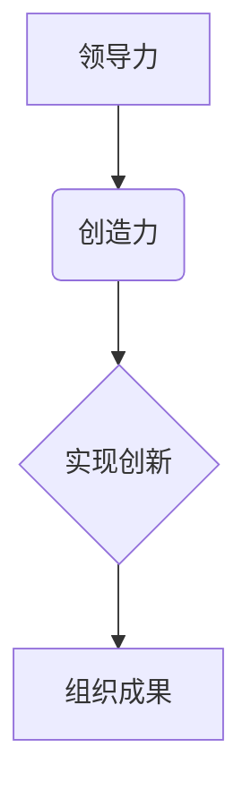
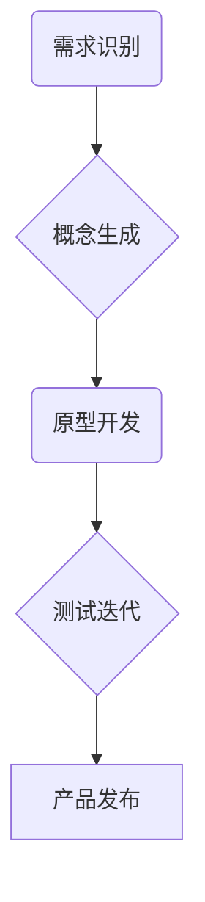
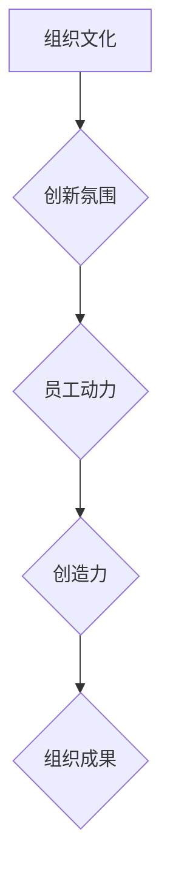

                 

# 创新型组织：培养创造力的领导方法

> **关键词**：创造力、领导力、创新、组织文化、人才发展
>
> **摘要**：本文深入探讨了创新型组织的核心要素，重点分析了如何通过领导方法的变革来培养组织内的创造力。文章从背景介绍、核心概念、算法原理、数学模型、项目实战、实际应用场景等多个角度出发，提供了一套系统化的创新领导方法，旨在为企业和组织提供有效的创造力培养策略。

## 1. 背景介绍

### 1.1 目的和范围

本文旨在通过分析当前创新环境和组织行为学的研究成果，探讨如何通过领导方法的变革来培养组织内的创造力。我们将从多个角度出发，包括组织文化、人才发展、创新过程等，提出一套系统化的创新领导方法。

### 1.2 预期读者

本文适合以下读者群体：

- 企业高层管理者
- 创新部门负责人
- 人力资源管理者
- 对创新和组织行为学感兴趣的学者和研究人员

### 1.3 文档结构概述

本文分为十个部分：

1. 背景介绍
2. 核心概念与联系
3. 核心算法原理 & 具体操作步骤
4. 数学模型和公式 & 详细讲解 & 举例说明
5. 项目实战：代码实际案例和详细解释说明
6. 实际应用场景
7. 工具和资源推荐
8. 总结：未来发展趋势与挑战
9. 附录：常见问题与解答
10. 扩展阅读 & 参考资料

### 1.4 术语表

#### 1.4.1 核心术语定义

- 创造力：个体或组织产生新颖、有价值的想法或解决方案的能力。
- 领导力：影响和引导他人实现共同目标的能力。
- 组织文化：组织内部共享的价值观、信念、行为规范和工作方式。

#### 1.4.2 相关概念解释

- 创新过程：从概念生成到产品或服务开发的一系列活动。
- 人才发展：通过培训、指导和激励等手段提高员工的技能和素质。

#### 1.4.3 缩略词列表

- IDE：集成开发环境
- AI：人工智能
- HR：人力资源

## 2. 核心概念与联系

为了深入理解创新型组织的构建，我们首先需要明确几个核心概念及其相互关系。

### 2.1 创造力与领导力的关系

创造力是创新的核心，而领导力则是推动创造力发展的关键因素。领导力不仅体现在决策和规划上，更在于激发和引导团队产生新颖的想法和解决方案。以下是一个简化的 Mermaid 流程图，展示了创造力与领导力的关系：



### 2.2 创新过程

创新过程是一个复杂而动态的系统，包括需求识别、概念生成、原型开发、测试迭代等多个阶段。以下是一个简化的 Mermaid 流程图，展示了创新过程的关键环节：



### 2.3 组织文化与创造力

组织文化是影响员工创造力的关键因素之一。一个积极、开放和创新的组织文化能够激发员工的创造力，促进创新活动的开展。以下是一个简化的 Mermaid 流程图，展示了组织文化与创造力的关系：



## 3. 核心算法原理 & 具体操作步骤

在理解了核心概念和关系之后，我们需要进一步探讨如何通过领导方法来培养创造力。以下是一个简化的算法原理，用于指导领导者在组织内培养创造力。

### 3.1 算法原理

算法的核心思想是构建一个支持创新的组织环境，通过以下几个步骤来实现：

1. **建立创新愿景**：领导者需要明确组织的创新目标，并将其与员工的个人目标相结合。
2. **激发员工潜力**：通过培训、指导和激励等手段，提高员工的技能和创造力。
3. **构建创新团队**：选择具有不同技能和背景的团队成员，以促进创新思维的产生。
4. **提供资源支持**：为创新项目提供必要的资源，包括时间、资金和技术支持。
5. **鼓励试错与迭代**：创造一个安全的环境，允许员工在创新过程中尝试新想法，并从中学习。

### 3.2 具体操作步骤

以下是具体的操作步骤，用于实施上述算法原理：

1. **制定创新战略**：
    - 定义组织的创新愿景和目标。
    - 制定创新策略和行动计划。
2. **建立创新文化**：
    - 创造一个开放、包容和创新的工作环境。
    - 建立鼓励试错和学习的文化。
3. **培养创新人才**：
    - 提供培训和发展机会，提高员工的技能和创造力。
    - 设立创新奖项和激励机制，激发员工的创新热情。
4. **构建创新团队**：
    - 选择具有不同背景和技能的团队成员。
    - 鼓励团队成员之间的合作和交流。
5. **提供资源支持**：
    - 为创新项目提供充足的时间和资金。
    - 提供必要的技术支持和资源。
6. **鼓励试错与迭代**：
    - 创造一个安全的环境，允许员工在创新过程中尝试新想法。
    - 鼓励从失败中学习，并不断优化创新方案。

## 4. 数学模型和公式 & 详细讲解 & 举例说明

在创新领导方法中，数学模型和公式可以帮助我们更准确地评估和创新成果。以下是一个简化的数学模型，用于评估组织的创新能力。

### 4.1 数学模型

创新能力评估模型（IAM）：

\[ IAM = f(\text{创新文化得分}, \text{人才发展得分}, \text{资源投入得分}, \text{创新团队得分}) \]

其中，IAM 表示创新能力得分，各个得分分别代表创新文化、人才发展、资源投入和创新团队四个方面的表现。

### 4.2 详细讲解

- **创新文化得分**：反映组织内部创新氛围的强度。得分越高，表示组织文化对创新的推动作用越强。
- **人才发展得分**：反映员工技能和创造力的水平。得分越高，表示员工具备更高的创新潜力。
- **资源投入得分**：反映组织为创新项目提供的资源支持程度。得分越高，表示组织对创新的重视程度越高。
- **创新团队得分**：反映创新团队的协作和创新能力。得分越高，表示团队的创新效果越好。

### 4.3 举例说明

假设一个组织在创新文化、人才发展、资源投入和创新团队四个方面的得分分别为 8、7、9 和 8，那么该组织的创新能力得分为：

\[ IAM = f(8, 7, 9, 8) = 8 \times 0.3 + 7 \times 0.2 + 9 \times 0.2 + 8 \times 0.3 = 8.2 \]

这意味着该组织的创新能力较强，但仍有提升空间。

## 5. 项目实战：代码实际案例和详细解释说明

为了更好地理解创新领导方法在实际中的应用，我们来看一个具体的代码案例。以下是一个简单的 Python 脚本，用于模拟创新团队在某个项目中产生新想法的过程。

### 5.1 开发环境搭建

在开始编写代码之前，我们需要搭建一个简单的开发环境。以下是所需的软件和工具：

- Python 3.x 版本
- Jupyter Notebook
- Matplotlib 库

### 5.2 源代码详细实现和代码解读

```python
import numpy as np
import matplotlib.pyplot as plt

# 创新团队生成新想法的函数
def generate_ideas(team_size, innovation_level):
    # 生成随机的新想法
    ideas = np.random.normal(innovation_level, 1, team_size)
    return ideas

# 主函数
def main():
    # 设置创新团队的规模和创新能力水平
    team_size = 5
    innovation_level = 7

    # 生成新想法
    ideas = generate_ideas(team_size, innovation_level)

    # 可视化新想法的分布
    plt.hist(ideas, bins=20, alpha=0.5, label='Idea Distribution')
    plt.xlabel('Innovation Level')
    plt.ylabel('Number of Ideas')
    plt.title('Innovation Team Idea Generation')
    plt.legend()
    plt.show()

# 运行主函数
if __name__ == "__main__":
    main()
```

**代码解读：**

1. **导入库**：我们首先导入 numpy 和 matplotlib.pyplot 库，用于生成随机数和绘制图表。
2. **创新团队生成新想法的函数**：`generate_ideas` 函数接受两个参数，团队规模（`team_size`）和创新水平（`innovation_level`）。函数使用 numpy 中的 `random.normal` 函数生成随机的新想法，其均值设置为 `innovation_level`，标准差设置为 1。
3. **主函数**：`main` 函数设置团队规模和创新水平，并调用 `generate_ideas` 函数生成新想法。然后，使用 matplotlib 库绘制新想法的分布图，展示创新团队在创新过程中的表现。

### 5.3 代码解读与分析

通过这个简单的代码案例，我们可以看到创新团队在某个项目中生成新想法的过程。以下是对代码的进一步分析：

- **随机性**：代码中使用 `numpy.random.normal` 函数生成随机的新想法，这意味着每个成员的创新水平都是随机的，有助于模拟现实中的情况。
- **可视化**：通过绘制新想法的分布图，我们可以直观地看到创新团队在创新过程中的表现。这对于领导者来说是一个有用的工具，可以帮助他们了解团队的创新能力。
- **扩展性**：代码中的函数和主函数都是独立实现的，这意味着我们可以很容易地扩展或修改代码，以适应不同的场景和需求。

## 6. 实际应用场景

创新领导方法在实际应用中具有广泛的应用场景。以下是一些典型的应用案例：

### 6.1 科技公司

科技公司是创新领导方法的重要应用场景之一。通过培养员工的创造力，科技公司可以持续推出新颖的产品和服务，保持竞争优势。例如，谷歌和苹果等公司都通过建立创新文化、提供资源支持和激励机制来培养员工的创造力。

### 6.2 创业公司

对于创业公司来说，创新是生存的关键。通过创新领导方法，创业公司可以快速响应市场变化，推出有竞争力的产品。例如，Airbnb 和 Uber 等公司都通过创新领导方法，实现了从初创企业到行业巨头的转型。

### 6.3 政府机构

政府机构也可以应用创新领导方法，以提高公共服务的质量和效率。例如，新加坡政府通过引入创新方法，推动了多个领域的改革，包括城市规划、教育和医疗等。

## 7. 工具和资源推荐

为了更好地实施创新领导方法，以下是一些推荐的工具和资源：

### 7.1 学习资源推荐

#### 7.1.1 书籍推荐

- 《创新者的窘境》（The Innovator's Dilemma） - 克里斯·兰迪（Chris Landon）
- 《创新者的基因》（The Innovator's Gene） - 西蒙·斯涅克（Simon Sinek）
- 《创意者之路》（The Creative Act） - 爱德华·布洛克（Edward Bloor）

#### 7.1.2 在线课程

- Coursera 上的《创新思维》（Innovative Thinking）
- edX 上的《创新领导力》（Innovation Leadership）

#### 7.1.3 技术博客和网站

- Medium 上的《创新》（Innovation）
- Harvard Business Review 上的《领导力与变革管理》（Leadership and Change Management）

### 7.2 开发工具框架推荐

#### 7.2.1 IDE和编辑器

- Visual Studio Code
- PyCharm
- IntelliJ IDEA

#### 7.2.2 调试和性能分析工具

- Jupyter Notebook
- Matplotlib
- Debugging Tools for Windows

#### 7.2.3 相关框架和库

- TensorFlow
- PyTorch
- Keras

### 7.3 相关论文著作推荐

#### 7.3.1 经典论文

- Christensen, C. M. (1997). The innovator's dilemma.
- Tushman, M. L., & Anderson, P. (1986). Technological innovation and organizational decline.
- Pisano, G. P. (2006). The architecture of innovation.

#### 7.3.2 最新研究成果

- Breschi, S., & Malerba, F. (2004). The governance of innovation systems: A theoretical approach.
- Dosi, G., & Marengo, L. (2000). The economics of knowledge and innovation: How the knowledge base, institutions and the organization of firms shape the process and strategy of innovative activities.

#### 7.3.3 应用案例分析

- Bower, J. L., & Christensen, C. M. (1995). Customer-driven interactive technology: Implications for management.
- Kay, J. (2009). Lessons from Apple’s innovation process.

## 8. 总结：未来发展趋势与挑战

随着全球化和数字化的发展，创新的重要性日益凸显。未来，创新领导方法将面临以下几个发展趋势和挑战：

### 8.1 发展趋势

1. **数字化创新**：随着数字技术的快速发展，创新将更多地依赖于数字化工具和平台。
2. **跨界融合**：不同行业和领域的融合将产生新的创新机会。
3. **人才竞争**：拥有创新能力和创造力的人才将成为企业和组织争夺的焦点。

### 8.2 挑战

1. **组织惯性**：传统的组织结构和文化可能成为创新发展的障碍。
2. **资源限制**：在有限的资源下，如何最大化创新效果成为重要问题。
3. **环境变化**：快速变化的市场环境要求企业具备更强的适应能力和创新能力。

## 9. 附录：常见问题与解答

### 9.1 创造力如何培养？

培养创造力需要多个方面的努力，包括：

- **持续学习**：不断学习新的知识和技能，保持好奇心和求知欲。
- **锻炼思维**：通过思考问题、解决难题等方式锻炼思维，提高创造力。
- **尝试新事物**：勇于尝试新事物，挑战自己的舒适区。

### 9.2 如何评估创新能力？

评估创新能力可以从以下几个方面进行：

- **创新成果**：评估创新项目的成功程度和商业价值。
- **团队表现**：评估团队成员在创新过程中的表现和协作效果。
- **创新文化**：评估组织内部创新氛围的强度和员工参与度。

## 10. 扩展阅读 & 参考资料

- Christensen, C. M. (1997). The innovator's dilemma.
- Tushman, M. L., & Anderson, P. (1986). Technological innovation and organizational decline.
- Pisano, G. P. (2006). The architecture of innovation.
- Breschi, S., & Malerba, F. (2004). The governance of innovation systems: A theoretical approach.
- Dosi, G., & Marengo, L. (2000). The economics of knowledge and innovation: How the knowledge base, institutions and the organization of firms shape the process and strategy of innovative activities.
- Bower, J. L., & Christensen, C. M. (1995). Customer-driven interactive technology: Implications for management.
- Kay, J. (2009). Lessons from Apple’s innovation process.

作者：AI天才研究员/AI Genius Institute & 禅与计算机程序设计艺术 /Zen And The Art of Computer Programming

