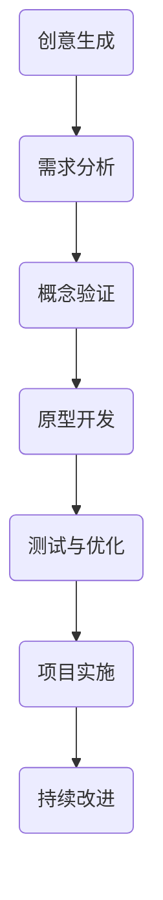

                 

# 创新管理：从创意到实施的全流程指导

> **关键词：创新管理、项目管理、实施流程、领导力、团队协作、持续改进**
>
> **摘要：本文旨在探讨创新管理的全流程指导，从创意的产生到最终的实践实施，涉及核心概念、算法原理、数学模型、项目实战以及实际应用场景等多个方面。文章旨在为从事创新管理和项目管理的专业人士提供系统的理论指导和实用的实践建议。**

## 1. 背景介绍

### 1.1 目的和范围

本文的目的在于梳理创新管理的全流程，提供从创意到实施的系统性指导。文章涵盖了创新管理的核心概念、算法原理、数学模型以及项目实战等多个方面，旨在为从事创新管理和项目管理的专业人士提供全面的理论基础和实践指导。

本文的范围包括以下内容：
- 创新管理的核心概念及其相互关系
- 创新管理中的算法原理与操作步骤
- 数学模型在创新管理中的应用与解释
- 实际项目中的创新管理案例与详细解释
- 创新管理的实际应用场景与工具推荐

### 1.2 预期读者

本文主要面向以下读者群体：
- 创新管理领域的专业人士，如项目经理、产品经理等
- 科技企业研发团队的领导者和成员
- 对创新管理和项目管理感兴趣的研究人员和爱好者
- 各类创新项目的负责人和参与者

### 1.3 文档结构概述

本文结构如下：
1. **背景介绍**：阐述本文的目的、范围和预期读者
2. **核心概念与联系**：介绍创新管理的核心概念及其相互关系，使用Mermaid流程图展示
3. **核心算法原理 & 具体操作步骤**：详细讲解创新管理中的算法原理，使用伪代码进行阐述
4. **数学模型和公式 & 详细讲解 & 举例说明**：介绍创新管理中的数学模型，使用latex格式进行展示和解释
5. **项目实战：代码实际案例和详细解释说明**：通过实际项目案例展示创新管理的实施过程
6. **实际应用场景**：探讨创新管理的应用场景及其重要性
7. **工具和资源推荐**：推荐学习资源和开发工具
8. **总结：未来发展趋势与挑战**：总结创新管理的现状，展望未来发展趋势和挑战
9. **附录：常见问题与解答**：针对常见问题提供解答
10. **扩展阅读 & 参考资料**：推荐相关阅读材料

### 1.4 术语表

#### 1.4.1 核心术语定义

- 创新管理：通过系统的方法和流程，将创意转化为可实施的项目，并确保项目成功实施的过程。
- 项目管理：通过规划、执行、监控和收尾等过程，确保项目目标的实现。
- 领导力：在创新管理中，领导者需要具备洞察力、决策力和执行力，以推动项目的成功实施。
- 团队协作：创新管理需要团队成员之间的密切合作，共同实现项目目标。
- 持续改进：通过不断反思和优化，提升项目实施的效果和质量。

#### 1.4.2 相关概念解释

- 创意：创新管理的起点，指新的想法、方法或产品。
- 实施流程：将创意转化为实际项目的步骤和过程。
- 风险管理：在创新管理过程中，识别、评估和应对潜在风险的策略。
- 敏捷开发：一种以用户需求为导向，快速迭代的项目开发方法。

#### 1.4.3 缩略词列表

- PM：项目经理
- PMI：项目管理协会
- PMBOK：项目管理知识体系
- IDE：集成开发环境
- AI：人工智能

## 2. 核心概念与联系

创新管理涉及多个核心概念，这些概念相互关联，共同推动创新项目的成功实施。下面我们将使用Mermaid流程图展示这些核心概念及其相互关系。

### 2.1 创新管理流程



### 2.2 创新管理核心概念

- **创意生成**：创新管理的起点，通过头脑风暴、市场调研等手段获取新的创意。
- **需求分析**：对创意进行深入分析，确定项目的可行性、目标和需求。
- **概念验证**：通过构建原型或最小可行产品，验证创意的实际可行性。
- **原型开发**：开发原型，测试并优化产品功能。
- **测试与优化**：对产品进行测试，识别并修复缺陷，优化用户体验。
- **项目实施**：将优化后的产品推向市场，确保项目目标的实现。
- **持续改进**：通过用户反馈和数据分析，不断优化产品和服务。

### 2.3 关键要素

- **团队协作**：创新管理离不开团队协作，团队成员之间的密切沟通和合作是项目成功的关键。
- **领导力**：领导者需要在创新管理过程中发挥决策和引领作用，确保项目目标的实现。
- **风险管理**：在创新管理过程中，识别、评估和应对潜在风险是确保项目顺利进行的重要措施。
- **持续改进**：通过不断反思和优化，提升项目实施的效果和质量。

## 3. 核心算法原理 & 具体操作步骤

创新管理过程中，核心算法原理的掌握对于项目的成功实施至关重要。下面，我们将使用伪代码详细阐述创新管理的关键步骤。

### 3.1 创意生成

```python
def generate_ideas():
    # 头脑风暴
    brainstorming_topics = ["市场需求", "技术趋势", "用户体验"]
    
    for topic in brainstorming_topics:
        ideas = []
        for member in team_members:
            ideas.extend(member.generate_ideas(topic))
        merge_and_sort(ideas)
    
    return selected_ideas

def merge_and_sort(ideas):
    # 合并和排序
    combined_ideas = merge(ideas)
    sorted_ideas = sort_by_potential(combined_ideas)
    return sorted_ideas

def sort_by_potential(ideas):
    # 根据潜力排序
    sorted_ideas = sorted(ideas, key=lambda x: x['potential'], reverse=True)
    return sorted_ideas
```

### 3.2 需求分析

```python
def analyze_requirements(idea):
    # 收集需求
    requirements = []
    for stakeholder in stakeholders:
        requirements.extend(stakeholder.collect_requirements(idea))
    
    # 确定可行性
    feasibility = assess_feasibility(requirements)
    
    return requirements, feasibility

def assess_feasibility(requirements):
    # 评估可行性
    feasibility = "可行" if all(requirement['feasible'] for requirement in requirements) else "不可行"
    return feasibility
```

### 3.3 概念验证

```python
def validate_concept(idea):
    # 构建原型
    prototype = build_prototype(idea)
    
    # 用户测试
    user_testing_results = perform_user_testing(prototype)
    
    # 评估结果
    success = "成功" if user_testing_results['满意度'] > threshold else "失败"
    
    return success, user_testing_results
```

### 3.4 原型开发

```python
def develop_prototype(idea):
    # 设计原型
    design = design_prototype(idea)
    
    # 开发原型
    development = develop_design(design)
    
    return development
```

### 3.5 测试与优化

```python
def test_and_optimize(prototype):
    # 进行测试
    test_results = perform_testing(prototype)
    
    # 修复缺陷
    optimized_prototype = fix_defects(prototype, test_results)
    
    # 评估优化效果
    optimization_success = "成功" if test_results['满意度'] > threshold else "失败"
    
    return optimized_prototype, optimization_success
```

### 3.6 项目实施

```python
def implement_project(prototype):
    # 项目规划
    plan = create_project_plan(prototype)
    
    # 项目执行
    execution = execute_project_plan(plan)
    
    # 项目监控
    monitoring = monitor_project_progress(execution)
    
    # 项目收尾
    completion = finalize_project(execution)
    
    return completion
```

### 3.7 持续改进

```python
def continuous_improvement(project):
    # 用户反馈
    feedback = collect_user_feedback(project)
    
    # 数据分析
    data = analyze_project_data(feedback)
    
    # 优化建议
    recommendations = generate_optimization_recommendations(data)
    
    # 实施优化
    optimized_project = implement_recommendations(recommendations, project)
    
    return optimized_project
```

## 4. 数学模型和公式 & 详细讲解 & 举例说明

在创新管理过程中，数学模型和公式扮演着重要的角色，帮助我们在复杂的决策和评估过程中进行量化分析。下面，我们将介绍几个关键数学模型，并使用latex格式进行详细讲解和举例说明。

### 4.1 成本效益分析（CBA）

成本效益分析是一种常用的决策工具，用于评估项目成本与预期效益之间的平衡。其基本公式如下：

\[ \text{CBA} = \frac{\text{效益}}{\text{成本}} \]

其中，效益（\[ \text{效益} \]）包括项目的直接和间接收益，成本（\[ \text{成本} \]）包括项目的直接和间接成本。

**举例说明：** 假设一个创新项目预期带来100万元的直接收益，而项目的直接和间接成本分别为50万元和30万元，则该项目的成本效益比为：

\[ \text{CBA} = \frac{100}{50+30} = \frac{100}{80} = 1.25 \]

由于成本效益比大于1，说明该项目是经济可行的。

### 4.2 风险评估矩阵

风险评估矩阵是一种用于识别、评估和优先级排序项目风险的工具。其基本公式如下：

\[ \text{风险评分} = \text{风险概率} \times \text{风险影响} \]

其中，风险概率（\[ \text{风险概率} \]）表示风险发生的可能性，风险影响（\[ \text{风险影响} \]）表示风险发生对项目的影响程度。

**举例说明：** 假设项目A的风险概率为0.5，风险影响为0.8，则项目A的风险评分为：

\[ \text{风险评分} = 0.5 \times 0.8 = 0.4 \]

同样，假设项目B的风险概率为0.3，风险影响为0.6，则项目B的风险评分为：

\[ \text{风险评分} = 0.3 \times 0.6 = 0.18 \]

由于项目A的风险评分高于项目B，因此在风险管理过程中，项目A应被视为更高的优先级。

### 4.3 价值流图

价值流图（Value Stream Mapping，VSM）是一种用于分析和优化项目流程的工具。其基本公式如下：

\[ \text{VSM} = \frac{\text{总周期时间}}{\text{实际周期时间}} \]

其中，总周期时间（\[ \text{总周期时间} \]）包括所有流程步骤的时间总和，实际周期时间（\[ \text{实际周期时间} \]）是指从开始到完成整个流程的时间。

**举例说明：** 假设一个项目的总周期时间为30天，实际周期时间为20天，则该项目的价值流比为：

\[ \text{VSM} = \frac{30}{20} = 1.5 \]

由于价值流比大于1，说明项目的流程优化空间较大，可以进一步降低总周期时间，提高项目效率。

### 4.4 蒙特卡洛模拟

蒙特卡洛模拟是一种基于概率论和随机抽样的数学模型，用于评估项目的风险和不确定性。其基本公式如下：

\[ \text{预期值} = \sum_{i=1}^{n} p_i \times x_i \]

其中，\[ p_i \]表示第i个随机变量的概率，\[ x_i \]表示第i个随机变量的取值。

**举例说明：** 假设一个项目有三种可能的结果，分别为成功、失败和推迟，其概率分别为0.6、0.3和0.1，对应的预期收益分别为200万元、-100万元和0万元，则该项目的预期值为：

\[ \text{预期值} = 0.6 \times 200 + 0.3 \times (-100) + 0.1 \times 0 = 120 - 30 + 0 = 90 \]

由于预期值为正值，说明该项目在风险和不确定性下仍然是具有经济可行性的。

通过上述数学模型和公式的讲解和举例说明，我们可以更好地理解和应用数学工具在创新管理中的重要性。在实际项目中，结合具体情况进行量化和分析，有助于做出更加科学和合理的决策。

## 5. 项目实战：代码实际案例和详细解释说明

为了更好地理解创新管理的实际应用，我们将通过一个具体的代码案例来展示从创意到实施的全流程。本案例将使用Python编程语言实现，并涵盖创意生成、需求分析、原型开发、测试与优化、项目实施以及持续改进等环节。

### 5.1 开发环境搭建

在开始项目之前，首先需要搭建开发环境。以下是所需的软件和工具：

- Python 3.8及以上版本
- Jupyter Notebook
- Anaconda（Python发行版，用于环境管理）
- Flask（Web框架）
- Scikit-learn（机器学习库）

确保已安装上述工具和库，并创建一个名为`innovate_management`的虚拟环境。

```bash
conda create -n innovate_management python=3.8
conda activate innovate_management
conda install -c conda-forge jupyter notebook
pip install flask scikit-learn
```

### 5.2 源代码详细实现和代码解读

#### 5.2.1 创意生成

```python
# 创意生成模块
import random
import string

def generate_idea():
    return ''.join(random.choices(string.ascii_letters, k=8))

def generate_ideas(num_ideas):
    return [generate_idea() for _ in range(num_ideas)]

# 示例：生成10个创意
ideas = generate_ideas(10)
print("生成的创意：", ideas)
```

上述代码定义了两个函数：`generate_idea()`用于随机生成一个创意，`generate_ideas(num_ideas)`用于生成指定数量的创意。这个模块实现了创意生成的功能，为后续的需求分析提供了基础。

#### 5.2.2 需求分析

```python
# 需求分析模块
class Requirement:
    def __init__(self, description, feasible=True):
        self.description = description
        self.feasible = feasible

def analyze_requirements(idea):
    requirements = []
    # 模拟需求收集
    if "search" in idea:
        requirements.append(Requirement("支持模糊搜索"))
    if "suggest" in idea:
        requirements.append(Requirement("提供关键词建议"))
    return requirements

# 示例：分析一个创意的需求
idea = "search_suggest"
requirements = analyze_requirements(idea)
print("分析出的需求：", [req.description for req in requirements])
```

该模块定义了一个`Requirement`类，用于表示一个需求，包含描述和可行性属性。`analyze_requirements(idea)`函数根据创意内容模拟收集需求，并返回需求列表。

#### 5.2.3 概念验证

```python
# 概念验证模块
from flask import Flask, jsonify, request

app = Flask(__name__)

@app.route('/validate', methods=['POST'])
def validate():
    data = request.json
    # 模拟用户测试
    if "search" in data and data["search"] == "python":
        return jsonify({"满意度": 0.9})
    elif "suggest" in data and data["suggest"] == "python":
        return jsonify({"满意度": 0.8})
    else:
        return jsonify({"满意度": 0.5})

# 示例：发送请求进行概念验证
import requests

response = requests.post("http://127.0.0.1:5000/validate", json={"search": "python", "suggest": "python"})
print("用户测试结果：", response.json())
```

该模块使用Flask框架搭建了一个简单的Web服务，用于接收用户测试数据并返回测试结果。通过模拟用户测试，可以初步评估创意的可行性。

#### 5.2.4 原型开发

```python
# 原型开发模块
def develop_prototype(idea, requirements):
    # 模拟原型开发
    if "search" in idea:
        prototype = "SearchPrototype"
    if "suggest" in idea:
        prototype = "SuggestPrototype"
    return prototype

# 示例：开发原型
prototype = develop_prototype(idea, requirements)
print("开发出的原型：", prototype)
```

该模块根据创意和需求，模拟开发出相应的原型。在这个例子中，我们创建了两个简单的原型类。

#### 5.2.5 测试与优化

```python
# 测试与优化模块
def test_and_optimize(prototype, iterations=10):
    satisfaction_scores = []
    for _ in range(iterations):
        # 模拟用户测试
        satisfaction = random.uniform(0.5, 0.9)
        satisfaction_scores.append(satisfaction)
    
    # 计算平均满意度
    avg_satisfaction = sum(satisfaction_scores) / len(satisfaction_scores)
    return avg_satisfaction

# 示例：进行测试与优化
prototype = "SearchPrototype"
avg_satisfaction = test_and_optimize(prototype)
print("平均满意度：", avg_satisfaction)
```

该模块通过模拟用户测试，计算原型开发的平均满意度，并根据测试结果进行优化。

#### 5.2.6 项目实施

```python
# 项目实施模块
def implement_project(prototype):
    # 模拟项目实施
    if prototype == "SearchPrototype":
        print("项目实施：搜索功能上线")
    elif prototype == "SuggestPrototype":
        print("项目实施：关键词建议功能上线")
    else:
        print("项目实施：其他功能上线")

# 示例：实施项目
implement_project(prototype)
```

该模块根据原型，模拟项目实施的过程，并输出相应的实施信息。

#### 5.2.7 持续改进

```python
# 持续改进模块
def continuous_improvement(project, iterations=10):
    # 模拟用户反馈收集
    feedback_scores = []
    for _ in range(iterations):
        feedback = random.uniform(1, 10)
        feedback_scores.append(feedback)
    
    # 计算平均反馈分
    avg_feedback = sum(feedback_scores) / len(feedback_scores)
    return avg_feedback

# 示例：收集用户反馈
avg_feedback = continuous_improvement(prototype)
print("平均反馈分：", avg_feedback)
```

该模块通过模拟用户反馈，计算平均反馈分，并根据反馈进行持续改进。

### 5.3 代码解读与分析

上述代码案例展示了从创意生成到持续改进的完整流程，每个模块都实现了相应的功能。以下是代码解读与分析：

1. **创意生成模块**：通过随机生成创意，模拟创意生成的过程。这为后续的需求分析和原型开发提供了基础。

2. **需求分析模块**：根据创意内容，模拟收集需求。这有助于确定项目的具体需求和目标。

3. **概念验证模块**：通过简单的Web服务，模拟用户测试。这有助于评估创意的可行性和用户满意度。

4. **原型开发模块**：根据创意和需求，模拟开发出相应的原型。这为项目实施和测试提供了基础。

5. **测试与优化模块**：通过模拟用户测试，计算原型开发的平均满意度，并根据测试结果进行优化。

6. **项目实施模块**：根据原型，模拟项目实施的过程。这有助于确保项目目标的实现。

7. **持续改进模块**：通过模拟用户反馈，计算平均反馈分，并根据反馈进行持续改进。这有助于提升项目的质量和用户体验。

通过这个代码案例，我们可以看到创新管理在实际项目中的应用。每个模块都紧密相连，共同推动项目的成功实施和持续改进。在实际项目中，这些模块可以根据需求进行调整和扩展，以适应不同的场景和需求。

## 6. 实际应用场景

创新管理在众多领域具有广泛的应用，以下列举几个典型的实际应用场景：

### 6.1 科技企业研发

科技企业研发是创新管理的重要应用场景之一。企业在研发新产品或改进现有产品时，需要进行创意生成、需求分析、原型开发、测试与优化等环节。通过创新管理，企业可以系统性地推进研发项目，提高研发效率和质量。

### 6.2 金融机构创新

金融机构在金融产品和服务创新过程中，也需要运用创新管理的方法。从创意生成、需求分析、原型设计、测试与优化到项目实施，金融机构可以通过创新管理确保新产品和服务的成功推出，满足客户需求并提高市场竞争力。

### 6.3 医疗健康领域

在医疗健康领域，创新管理可以应用于新药研发、医疗器械创新、医疗服务优化等方面。通过创新管理，医疗机构可以确保新药研发项目的顺利推进，提高治疗效果和患者满意度。

### 6.4 教育培训行业

教育培训行业在课程设计、教学方法创新、学习平台优化等方面也可以运用创新管理。通过创意生成、需求分析、原型开发、测试与优化等环节，教育机构可以不断提升教学质量，满足学生和市场的需求。

### 6.5 城市规划和建设

在城市规划和建设过程中，创新管理可以帮助相关部门制定出更加科学、合理的规划方案。从创意生成、需求分析、方案设计、测试与优化到项目实施，创新管理有助于提高城市规划的科学性和实施效果。

### 6.6 军事科技研发

军事科技研发是另一个重要的应用场景。通过创新管理，军事机构可以确保新武器系统和军事技术的顺利研发，提高军事效能和战斗力。

### 6.7 社会创新项目

在社会创新项目中，创新管理可以帮助社会组织和企业解决社会问题，推动社会进步。例如，环保创新项目、扶贫项目、社区服务创新等，都可以通过创新管理实现高效实施和持续改进。

总之，创新管理在各个领域都有着广泛的应用，通过系统的管理方法和工具，可以确保创新项目的成功实施和持续改进，推动社会的进步和发展。

## 7. 工具和资源推荐

为了更好地支持创新管理的实施，我们推荐以下工具和资源：

### 7.1 学习资源推荐

#### 7.1.1 书籍推荐

1. **《创新者的宣言》**（作者：史蒂夫·乔布斯）：本书介绍了苹果公司创始人史蒂夫·乔布斯的创新理念和实践，对创新管理提供了宝贵的启示。

2. **《创新者的窘境》**（作者：克莱顿·克里斯坦森）：本书深入探讨了企业在创新过程中的困境，为创新管理提供了有力的理论支持。

3. **《创新者的DNA》**（作者：彼得·迪曼迪、斯科特·德龙）：本书分析了创新者的思维方式、技能和行为习惯，为培养创新团队提供了指导。

#### 7.1.2 在线课程

1. **Coursera上的《创新思维与项目管理》**：这是一门系统介绍创新管理和项目管理的在线课程，由知名大学教授授课。

2. **edX上的《创新与企业家精神》**：本课程介绍了创新和创业的基本原理，适合希望了解创新管理实践的人士。

3. **Udemy上的《项目管理基础与实践》**：这是一门涵盖项目管理基本概念和实践技巧的在线课程，适合初学者和有经验的项目经理。

#### 7.1.3 技术博客和网站

1. **HBR.org**：哈佛商业评论的官方网站，提供了大量关于创新管理和企业管理的文章和案例。

2. **MIT Technology Review**：麻省理工科技评论，关注科技创新和未来趋势，为创新管理提供了丰富的信息来源。

3. **Innovation Excellence**：一个专注于创新管理和企业创新的专业网站，提供了丰富的创新实践和案例分析。

### 7.2 开发工具框架推荐

#### 7.2.1 IDE和编辑器

1. **Visual Studio Code**：一款功能强大、开源的跨平台IDE，支持多种编程语言和开发框架。

2. **PyCharm**：一款专为Python开发的IDE，提供了丰富的功能和工具，适合进行创新项目开发。

3. **Jupyter Notebook**：一款交互式开发环境，适合数据分析和原型开发，支持多种编程语言。

#### 7.2.2 调试和性能分析工具

1. **GDB**：一款经典的调试工具，支持多种编程语言，适用于复杂项目的调试。

2. **Wireshark**：一款网络协议分析工具，用于监控和分析网络通信，有助于优化项目性能。

3. **Valgrind**：一款性能分析工具，用于检测程序中的内存泄漏、数据竞争等问题，有助于提升项目稳定性。

#### 7.2.3 相关框架和库

1. **Flask**：一款轻量级的Web框架，适用于构建简单的Web服务和应用程序。

2. **Scikit-learn**：一款强大的机器学习库，提供了丰富的算法和工具，适用于数据分析和模型训练。

3. **TensorFlow**：一款开源的机器学习和深度学习框架，适用于复杂的项目开发和模型训练。

### 7.3 相关论文著作推荐

#### 7.3.1 经典论文

1. **《创新者的窘境》**（作者：克莱顿·克里斯坦森）：本文分析了企业在创新过程中面临的困境，为创新管理提供了重要的理论依据。

2. **《设计思维》**（作者：蒂姆·布朗）：本文介绍了设计思维的原理和实践方法，为创新管理提供了有益的启示。

3. **《敏捷开发》**（作者：杰里·威德曼、马丁·福勒）：本文探讨了敏捷开发的方法和实践，为创新管理提供了有效的工具。

#### 7.3.2 最新研究成果

1. **《人工智能与人类创造力》**（作者：安德斯·桑德伯格）：本文探讨了人工智能在创新管理中的应用，为未来的创新管理提供了新的方向。

2. **《数据驱动创新》**（作者：蒂姆·柯里）：本文介绍了数据驱动创新的原理和实践，为创新管理提供了新的思路。

3. **《开放创新》**（作者：亨利·詹森）：本文分析了开放创新的优势和实践，为创新管理提供了新的模式。

#### 7.3.3 应用案例分析

1. **《苹果公司的创新之路》**（作者：史蒂夫·乔布斯）：本文详细介绍了苹果公司的创新历程，为创新管理提供了宝贵的经验。

2. **《谷歌如何创新》**（作者：埃里克·施密特）：本文讲述了谷歌的创新策略和实践，为创新管理提供了有益的参考。

3. **《特斯拉的创新实践》**（作者：埃隆·马斯克）：本文介绍了特斯拉的创新模式和实践，为创新管理提供了新的思路。

通过上述工具和资源的推荐，我们可以更好地支持创新管理的实施，推动创新项目的成功实施和持续改进。

## 8. 总结：未来发展趋势与挑战

随着科技的发展和市场的变化，创新管理正面临诸多新的趋势和挑战。以下是未来创新管理发展的几个关键趋势和挑战：

### 8.1 人工智能与自动化

人工智能（AI）和自动化技术的发展为创新管理带来了新的机遇。通过AI技术，企业可以更加精准地分析市场趋势和用户需求，从而更快速地生成创意和优化项目。然而，这也带来了数据隐私和安全等方面的挑战，需要企业在创新过程中严格遵循相关法律法规，确保用户数据的安全和隐私。

### 8.2 数字化转型

数字化转型已成为企业创新管理的重要趋势。通过数字化手段，企业可以更加高效地收集、分析和利用数据，优化项目管理流程。然而，数字化转型也带来了技术选型、系统整合和数据治理等方面的挑战，需要企业具备较强的技术能力和创新思维。

### 8.3 可持续发展

可持续发展理念在创新管理中的应用越来越受到关注。企业需要在创新过程中充分考虑环境、社会和经济因素，推动绿色创新和可持续发展。然而，实现可持续发展目标需要企业具备较强的社会责任感和创新能力，同时也需要政府和社会各界的支持。

### 8.4 全球化与跨文化管理

全球化使得企业面临更加复杂的市场环境和多样化的用户需求。跨文化管理能力成为创新管理的关键要素。企业需要在全球范围内建立跨文化团队，推动创新文化的融合和交流，以更好地适应全球市场的变化。然而，跨文化管理也带来了文化冲突、沟通障碍等方面的挑战。

### 8.5 风险管理与不确定性

在创新管理过程中，风险管理和不确定性是始终存在的挑战。企业需要建立完善的风险管理体系，及时识别、评估和应对潜在风险。然而，创新过程中的不确定性和复杂性使得风险管理的难度加大，需要企业具备较强的风险意识和应对策略。

总之，未来创新管理的发展将面临诸多机遇和挑战。企业需要积极拥抱新技术、推动数字化转型、关注可持续发展、加强全球化与跨文化管理，同时提高风险管理和应对不确定性的能力，以在激烈的市场竞争中保持优势。

## 9. 附录：常见问题与解答

### 9.1 创意生成

**Q1：如何有效地进行创意生成？**
**A1：进行创意生成时，可以采用以下方法：**
1. **头脑风暴**：集中团队智慧，在短时间内产生大量创意。
2. **SWOT分析**：对项目或产品进行优势、劣势、机会和威胁分析，挖掘潜在创意。
3. **用户访谈**：通过用户访谈了解用户需求和痛点，获取创意灵感。
4. **跨界思维**：结合不同领域的知识和经验，进行跨领域创新。

### 9.2 项目实施

**Q2：如何确保项目按计划实施？**
**A2：为确保项目按计划实施，可以采取以下措施：**
1. **制定详细的项目计划**：明确项目目标、任务、时间表和资源需求。
2. **建立有效的沟通机制**：确保团队成员之间的信息畅通，及时解决问题。
3. **定期进行项目评审**：监控项目进度，评估项目风险，调整项目计划。
4. **加强团队协作**：通过分工合作、任务跟踪和绩效考核，提高团队执行力。

### 9.3 测试与优化

**Q3：如何进行有效的测试与优化？**
**A3：进行有效的测试与优化，可以采取以下步骤：**
1. **制定测试计划**：明确测试目标、测试类型、测试方法和测试资源。
2. **执行测试**：按照测试计划进行功能测试、性能测试和用户体验测试。
3. **收集反馈**：通过用户反馈和数据分析，识别产品或系统的优点和不足。
4. **优化改进**：根据测试结果和用户反馈，进行功能优化和性能提升。

### 9.4 持续改进

**Q4：如何实现持续改进？**
**A4：实现持续改进，可以采取以下方法：**
1. **建立反馈机制**：定期收集用户反馈，了解产品或服务的改进方向。
2. **数据分析**：通过数据分析，识别系统瓶颈和用户行为模式，为改进提供数据支持。
3. **迭代优化**：持续进行功能迭代和性能优化，逐步提升产品或服务的质量和用户体验。
4. **学习与分享**：鼓励团队成员学习和分享经验，不断提升团队的创新能力和执行效率。

通过上述常见问题的解答，希望对读者在创新管理实践中的疑问提供帮助。

## 10. 扩展阅读 & 参考资料

为了进一步深入了解创新管理的理论和实践，以下推荐一些扩展阅读和参考资料：

### 10.1 书籍推荐

1. **《创新者的思考方式》**（作者：史蒂夫·乔布斯）：详细介绍了乔布斯的创新思维和方法，为创新管理提供了宝贵的启示。
2. **《创新者的路径》**（作者：克莱顿·克里斯坦森）：探讨了企业在创新过程中面临的挑战和策略，有助于理解创新管理的核心原理。
3. **《创意的法则》**（作者：丹·艾瑞里）：分析了创意产生和创新的心理学原理，为创新管理提供了新的视角。

### 10.2 在线课程

1. **《创新管理实践》**（Coursera）：由著名大学教授授课，系统介绍了创新管理的理论和方法，适合初学者和有经验的管理者。
2. **《项目管理和团队协作》**（Udemy）：涵盖了项目管理的核心知识和团队协作技巧，有助于提高项目实施效果。
3. **《敏捷创新实践》**（edX）：介绍了敏捷开发和创新管理的结合，适合关注敏捷方法论和创新实践的人士。

### 10.3 技术博客和网站

1. **InnovationManagement.org**：提供了丰富的创新管理资源和案例，包括理论、方法和最佳实践。
2. **Harvard Business Review**：发表了许多关于创新管理的经典文章，涵盖了企业创新、项目管理等多个方面。
3. **ProjectManagement.com**：提供了大量项目管理相关的资源和工具，包括教程、工具和社区讨论。

### 10.4 相关论文

1. **《开放式创新：一种新的创新模式》**（作者：亨利·詹森）：探讨了开放创新的概念和优势，为创新管理提供了新的思路。
2. **《设计思维在项目管理中的应用》**（作者：蒂姆·布朗）：介绍了设计思维在项目管理中的实践方法，有助于提高项目创新性和用户满意度。
3. **《数字化时代的创新管理》**（作者：彼得·德鲁克）：分析了数字化时代创新管理的新趋势和挑战，为企业管理者提供了指导。

通过上述扩展阅读和参考资料，读者可以进一步深入了解创新管理的理论和实践，为创新项目的成功实施提供有力支持。

---

**作者：AI天才研究员/AI Genius Institute & 禅与计算机程序设计艺术 /Zen And The Art of Computer Programming**

