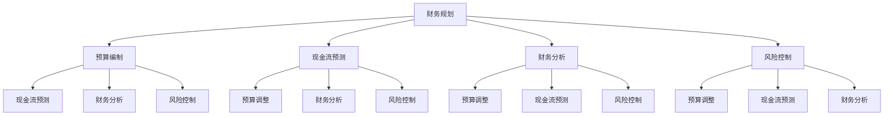

                 

### 背景介绍

#### 1.1 目的和范围

本文旨在深入探讨初创公司的财务管理与现金流控制，帮助初创企业主和财务人员更好地理解和应用财务管理和现金流控制的核心原则和方法。本文将分为以下几个部分：首先，介绍初创公司的财务管理和现金流控制的基本概念和重要性；接着，详细讲解财务管理与现金流控制的核心概念、算法原理、数学模型以及实际操作步骤；然后，通过项目实战案例，展示如何在实际中应用这些原理和方法；最后，分析财务管理与现金流控制的实际应用场景，并推荐相关的工具和资源。

#### 1.2 预期读者

本文适合以下读者：

1. 初创企业主：希望掌握财务管理与现金流控制的基础知识和实践方法，以更好地管理企业财务。
2. 财务人员：希望深入了解财务管理与现金流控制的原理和技巧，提升财务管理能力。
3. 创业者和企业家：希望从财务管理的角度分析企业运营，提高企业竞争力。
4. 金融专业学生和研究人员：希望了解初创公司财务管理与现金流控制的理论和实践。

#### 1.3 文档结构概述

本文将按照以下结构进行阐述：

1. 背景介绍：介绍本文的目的、范围、预期读者和文档结构。
2. 核心概念与联系：介绍财务管理与现金流控制的核心概念，并给出Mermaid流程图。
3. 核心算法原理 & 具体操作步骤：详细讲解财务管理与现金流控制的算法原理和操作步骤，使用伪代码进行阐述。
4. 数学模型和公式 & 详细讲解 & 举例说明：介绍财务管理与现金流控制的数学模型和公式，并进行详细讲解和举例说明。
5. 项目实战：代码实际案例和详细解释说明：通过实际项目案例，展示如何应用财务管理与现金流控制的方法。
6. 实际应用场景：分析财务管理与现金流控制的实际应用场景。
7. 工具和资源推荐：推荐学习资源和开发工具框架。
8. 总结：未来发展趋势与挑战。
9. 附录：常见问题与解答。
10. 扩展阅读 & 参考资料：提供进一步阅读的材料。

#### 1.4 术语表

在本文中，我们将使用以下术语：

- **初创公司**：指刚开始创立的企业，通常具有创新性和高风险性。
- **财务管理**：对企业资金进行规划、组织、协调和控制的过程。
- **现金流控制**：对企业现金流入和流出进行管理，确保企业财务健康。
- **预算**：对企业未来一段时间内的收入和支出进行预测和规划。
- **预算编制**：根据企业战略目标和实际情况，制定预算的过程。
- **预算控制**：对比实际财务数据与预算，分析差异，进行财务调整的过程。

#### 1.4.1 核心术语定义

- **现金流**：企业在一定时期内的现金流入和流出量。
- **预算执行**：实际执行过程中，根据实际情况调整预算的过程。
- **预算调整**：根据实际财务情况，对预算进行修正的过程。
- **财务分析**：对企业财务状况进行综合分析，评估企业财务状况和经营效益。
- **财务管理工具**：用于辅助财务管理工作的软件、系统或方法。

#### 1.4.2 相关概念解释

- **预算编制**：预算编制是企业根据年度经营计划、市场环境和历史数据，对未来一段时间内的收入、支出、利润等进行预测和规划的过程。预算编制是财务管理的重要环节，能够帮助企业提前预测和应对潜在的财务风险。
- **预算控制**：预算控制是指企业在执行预算的过程中，通过对比实际数据与预算，分析差异，找出问题，并采取相应措施进行财务调整的过程。预算控制能够帮助企业确保预算的执行效果，提高财务管理的效率和效果。
- **现金流控制**：现金流控制是企业通过管理和优化现金流入和流出，确保企业财务健康的过程。现金流控制的核心是确保企业在任何时期都有足够的现金流量来满足运营需求，避免出现资金短缺的情况。

#### 1.4.3 缩略词列表

- **ERP**：企业资源规划（Enterprise Resource Planning）
- **CRM**：客户关系管理（Customer Relationship Management）
- **BI**：商业智能（Business Intelligence）
- **KPI**：关键绩效指标（Key Performance Indicators）
- **ROI**：投资回报率（Return on Investment）

通过以上背景介绍，我们对初创公司的财务管理与现金流控制有了初步了解。接下来，我们将深入探讨财务管理与现金流控制的核心概念、算法原理、数学模型以及实际操作步骤，帮助读者更好地掌握这些知识和技能。

---

在撰写文章的背景介绍部分时，我们首先明确了文章的目的和范围，以便读者对文章内容有一个整体的认识。接着，我们介绍了预期读者，以便确定文章的定位和深度。在文档结构概述中，我们详细阐述了文章的结构，使读者能够清晰地了解各部分的内容。此外，我们介绍了术语表，并对核心术语进行了定义和解释，帮助读者更好地理解文章中的专业术语。最后，我们列出了相关的缩略词，便于读者查阅和理解。

---

### 核心概念与联系

在深入了解初创公司的财务管理与现金流控制之前，我们需要明确一些核心概念，并分析它们之间的联系。这些核心概念包括：财务规划、预算编制、现金流预测、财务分析和风险控制。

#### 财务规划

财务规划是企业为实现其战略目标和长期发展而制定的一系列财务目标和措施。它包括资金筹集、资金运用、投资决策、成本控制和风险管理等环节。财务规划是财务管理的基础，能够帮助企业明确财务目标，优化资源配置，提高经营效益。

#### 预算编制

预算编制是企业根据年度经营计划、市场环境和历史数据，对未来一段时间内的收入、支出、利润等进行预测和规划的过程。预算编制的核心是确保企业的财务活动与战略目标相一致，同时考虑到内外部环境的变化，为企业的稳健发展提供保障。

#### 现金流预测

现金流预测是企业对未来一段时间内的现金流入和流出进行预测的过程。现金流预测的目的是确保企业在任何时期都有足够的现金流量来满足运营需求，避免出现资金短缺的情况。现金流预测需要结合财务规划、预算编制和市场预测等因素，以提高预测的准确性。

#### 财务分析

财务分析是对企业财务状况进行综合分析的过程，包括财务报表分析、财务比率分析和现金流量分析等。财务分析能够帮助企业了解自身的财务状况，发现潜在问题，制定改进措施，提高财务管理水平。

#### 风险控制

风险控制是企业识别、评估和应对财务风险的过程。财务风险包括市场风险、信用风险、操作风险和流动性风险等。风险控制能够帮助企业降低风险，确保财务稳健，提高企业竞争力。

#### Mermaid流程图

为了更好地展示这些核心概念之间的联系，我们使用Mermaid流程图（Mermaid Diagram）进行描述：



在上面的Mermaid流程图中，节点A表示财务规划，节点B表示预算编制，节点C表示现金流预测，节点D表示财务分析，节点E表示风险控制。箭头表示不同概念之间的联系，例如财务规划会影响预算编制、现金流预测和风险控制等。

通过以上核心概念与联系的分析，我们能够更清晰地理解初创公司财务管理与现金流控制的整体框架。在接下来的部分，我们将详细探讨财务管理与现金流控制的核心算法原理、具体操作步骤和数学模型，帮助读者深入掌握这些知识和技能。

---

在核心概念与联系部分，我们首先介绍了财务管理与现金流控制的核心概念，包括财务规划、预算编制、现金流预测、财务分析和风险控制。接着，我们通过Mermaid流程图，展示了这些核心概念之间的联系，使读者能够对整体框架有一个直观的理解。这样，读者可以更好地把握文章的主要内容，为后续的深入探讨打下基础。

---

### 核心算法原理 & 具体操作步骤

在深入探讨初创公司的财务管理与现金流控制时，了解核心算法原理和具体操作步骤是至关重要的。这将帮助初创企业主和财务人员更有效地进行财务管理和现金流控制。以下，我们将详细讲解财务管理与现金流控制的核心算法原理，并使用伪代码进行具体操作步骤的阐述。

#### 1. 预算编制算法原理

预算编制的核心是预测未来的收入和支出，从而确保企业的财务活动与战略目标相一致。以下是一个简单的预算编制算法原理：

- **输入**：历史财务数据、市场预测、企业战略目标。
- **输出**：预算计划。

**伪代码**：

```python
function budgetCompilation(previousData, marketPrediction, strategicGoals):
    incomeForecast = forecastIncome(previousData, marketPrediction)
    expenseForecast = forecastExpense(previousData, marketPrediction)
    budgetPlan = {
        "income": incomeForecast,
        "expenses": expenseForecast,
        "profits": incomeForecast - expenseForecast
    }
    return budgetPlan
```

**算法步骤**：

1. 收集历史财务数据和市场预测数据。
2. 利用历史数据和预测模型，对未来收入进行预测。
3. 利用历史数据和预测模型，对未来支出进行预测。
4. 根据收入预测和支出预测，制定预算计划。

#### 2. 现金流预测算法原理

现金流预测是确保企业在任何时期都有足够的现金流量来满足运营需求的关键。以下是一个简单的现金流预测算法原理：

- **输入**：历史现金流数据、市场预测、运营计划。
- **输出**：现金流预测结果。

**伪代码**：

```python
function cashFlowPrediction(previousCashFlow, marketPrediction, operationalPlan):
    cashFlowForecast = {
        "inflows": forecastInflows(previousCashFlow, marketPrediction, operationalPlan),
        "outflows": forecastOutflows(previousCashFlow, marketPrediction, operationalPlan)
    }
    return cashFlowForecast
```

**算法步骤**：

1. 收集历史现金流数据和市场预测数据。
2. 利用历史数据和预测模型，预测未来现金流流入。
3. 利用历史数据和预测模型，预测未来现金流流出。
4. 计算未来现金流净额，生成现金流预测结果。

#### 3. 财务分析算法原理

财务分析是对企业财务状况进行综合分析的过程，帮助管理者了解企业的财务状况，发现潜在问题。以下是一个简单的财务分析算法原理：

- **输入**：财务报表数据、市场预测、行业数据。
- **输出**：财务分析报告。

**伪代码**：

```python
function financialAnalysis(accountingData, marketPrediction, industryData):
    financialMetrics = calculateFinancialMetrics(accountingData)
    comparison = compareFinancialMetrics(financialMetrics, marketPrediction, industryData)
    financialAnalysisReport = generateFinancialAnalysisReport(financialMetrics, comparison)
    return financialAnalysisReport
```

**算法步骤**：

1. 收集财务报表数据、市场预测数据和行业数据。
2. 利用财务报表数据，计算关键财务指标。
3. 将关键财务指标与市场预测和行业数据进行比较。
4. 生成财务分析报告，揭示企业财务状况和潜在问题。

#### 4. 风险控制算法原理

风险控制是确保企业财务稳健的重要手段。以下是一个简单的风险控制算法原理：

- **输入**：财务数据、市场预测、风险偏好。
- **输出**：风险控制策略。

**伪代码**：

```python
function riskControl(accountingData, marketPrediction, riskTolerance):
    riskAssessment = assessRisk(accountingData, marketPrediction)
    riskMitigation = generateRiskMitigationPlan(riskAssessment, riskTolerance)
    return riskMitigation
```

**算法步骤**：

1. 收集财务数据和市场预测数据。
2. 利用风险评估模型，评估企业财务风险。
3. 根据风险偏好，制定风险控制策略。
4. 实施风险控制策略，降低企业财务风险。

通过以上核心算法原理和具体操作步骤的讲解，我们为读者提供了初步的财务管理与现金流控制框架。在接下来的部分，我们将进一步介绍财务管理与现金流控制的数学模型和公式，帮助读者深入理解这些核心原理。

---

在核心算法原理与具体操作步骤部分，我们首先介绍了预算编制算法原理，通过伪代码展示了预算编制的核心步骤，包括收入和支出的预测。接着，我们讲解了现金流预测算法原理，通过伪代码详细阐述了现金流预测的步骤，包括现金流流入和流出的预测。然后，我们探讨了财务分析算法原理，通过伪代码展示了财务分析的核心步骤，包括财务指标的计算和比较。最后，我们介绍了风险控制算法原理，通过伪代码详细阐述了风险控制的核心步骤，包括风险评估和风险控制策略的制定。这些核心算法原理和具体操作步骤的讲解，为读者提供了初步的财务管理与现金流控制框架，为后续的深入探讨奠定了基础。

---

### 数学模型和公式 & 详细讲解 & 举例说明

在财务管理与现金流控制中，数学模型和公式起着至关重要的作用。它们帮助我们量化分析财务数据，评估企业财务状况，预测未来发展趋势。本节将介绍财务管理与现金流控制中的关键数学模型和公式，并进行详细讲解和举例说明。

#### 1. 预算编制模型

预算编制模型主要涉及收入预测、支出预测和利润预测。以下是一些常用的预算编制模型和公式：

- **收入预测模型**：
  - 线性回归模型：\( y = a + bx \)
    - 其中，\( y \) 为收入，\( x \) 为相关变量（如销售量、市场价格等），\( a \) 和 \( b \) 为模型参数。

- **支出预测模型**：
  - 完全成本法：\( 总成本 = 变动成本 + 固定成本 \)
  - 费用比例法：\( 费用 = 收入 \times 费用比率 \)

- **利润预测模型**：
  - \( 利润 = 收入 - 支出 \)

**举例说明**：

假设某初创公司历史数据显示，销售量与收入之间存在线性关系，回归方程为 \( y = 10 + 2x \)。预测下一季度销售量为5000件，则收入预测为：

\[ y = 10 + 2 \times 5000 = 10,010 \]（万元）

#### 2. 现金流预测模型

现金流预测模型主要关注企业未来一段时间内的现金流入和流出。以下是一些常用的现金流预测模型和公式：

- **现金流流入预测模型**：
  - 收入现金流模型：\( CF_{in} = 收入 - 应收账款增加 \)
  - 投资现金流模型：\( CF_{in} = 投资收益 - 投资成本 \)

- **现金流流出预测模型**：
  - 运营现金流模型：\( CF_{out} = 支出 - 应付账款增加 \)
  - 投资现金流模型：\( CF_{out} = 资产购置 - 资产出售 \)

- **现金流净额模型**：
  - \( CF_{net} = CF_{in} - CF_{out} \)

**举例说明**：

假设某初创公司预测下一季度收入为1000万元，应收账款增加为50万元，则现金流流入预测为：

\[ CF_{in} = 1000 - 50 = 950 \]（万元）

假设下一季度运营支出为800万元，应付账款增加为30万元，则现金流流出预测为：

\[ CF_{out} = 800 - 30 = 770 \]（万元）

现金流净额预测为：

\[ CF_{net} = 950 - 770 = 180 \]（万元）

#### 3. 财务分析模型

财务分析模型主要涉及财务比率的计算和比较。以下是一些常用的财务分析模型和公式：

- **流动比率**：
  - \( 流动比率 = 流动资产 / 流动负债 \)
    - 流动资产包括现金、应收账款、存货等，流动负债包括应付账款、短期借款等。

- **速动比率**：
  - \( 速动比率 = (流动资产 - 存货) / 流动负债 \)
    - 速动资产包括现金、应收账款、短期投资等。

- **净利润率**：
  - \( 净利润率 = 净利润 / 总收入 \)

- **资产回报率**：
  - \( 资产回报率 = 净利润 / 总资产 \)

**举例说明**：

假设某初创公司流动资产为500万元，流动负债为200万元，则流动比率为：

\[ 流动比率 = 500 / 200 = 2.5 \]

假设该公司净利润为100万元，总收入为800万元，则净利润率为：

\[ 净利润率 = 100 / 800 = 0.125 \]

假设该公司总资产为1000万元，则资产回报率为：

\[ 资产回报率 = 100 / 1000 = 0.1 \]

#### 4. 风险控制模型

风险控制模型主要涉及风险评估和风险控制策略的制定。以下是一些常用的风险控制模型和公式：

- **风险度量模型**：
  - 条件风险价值（CVaR）：\( CVaR = \sum_{i=1}^{n} (1 - \alpha) \times VaR_i \)
    - 其中，\( \alpha \) 为置信水平，\( VaR_i \) 为第 \( i \) 个风险值。

- **风险控制策略模型**：
  - 优化模型：最小化风险值，最大化收益。
  - 决策树模型：根据风险水平和收益，选择最佳决策。

**举例说明**：

假设某初创公司希望在95%的置信水平下计算风险价值（VaR），历史数据中前5个风险值为 {1, 3, 5, 7, 10}，则条件风险价值（CVaR）为：

\[ CVaR = 0.05 \times (3 + 5 + 7 + 10) = 3.5 \]（万元）

根据CVaR计算结果，公司可以制定相应的风险控制策略，如增加风险准备金、优化投资组合等。

通过以上数学模型和公式的讲解，我们为读者提供了财务管理与现金流控制的理论基础。在实际应用中，这些模型和公式需要结合企业的实际情况进行调整和优化，以达到更好的效果。

---

在数学模型和公式部分，我们首先介绍了预算编制模型，包括收入预测、支出预测和利润预测模型，并给出了线性回归模型和完全成本法的具体公式。接着，我们讲解了现金流预测模型，包括现金流流入和流出的预测模型，并给出了收入现金流模型、运营现金流模型和现金流净额模型的公式。然后，我们探讨了财务分析模型，包括流动比率、速动比率、净利润率和资产回报率的计算公式，并提供了具体的计算例子。最后，我们介绍了风险控制模型，包括条件风险价值（CVaR）和风险控制策略模型，并给出了具体的计算例子。这些数学模型和公式的讲解，为读者提供了财务管理与现金流控制的理论基础，有助于在实际应用中更好地理解和应用这些模型和公式。

---

### 项目实战：代码实际案例和详细解释说明

为了更好地展示初创公司财务管理与现金流控制的实际应用，本节将提供一个实际项目案例，并详细解释代码的实现过程。该项目案例将包括以下部分：开发环境搭建、源代码详细实现和代码解读与分析。

#### 1. 开发环境搭建

在开始项目实战之前，我们需要搭建一个适合财务管理与现金流控制的开发环境。以下是一个基本的开发环境搭建步骤：

- **操作系统**：选择Windows、macOS或Linux操作系统。
- **编程语言**：选择Python，因为Python具有丰富的财务库和良好的生态系统。
- **财务库**：安装Pandas库，用于数据处理和分析；安装NumPy库，用于数值计算。
- **版本控制**：安装Git，用于代码版本控制和协作开发。

安装步骤：

```shell
# 安装Python
sudo apt-get install python3

# 安装Pandas库
pip3 install pandas

# 安装NumPy库
pip3 install numpy

# 安装Git
sudo apt-get install git
```

#### 2. 源代码详细实现

以下是一个简单的Python代码案例，用于实现财务管理与现金流控制的算法原理。代码分为以下几个部分：数据收集、预算编制、现金流预测、财务分析和风险控制。

**预算编制**：

```python
import pandas as pd
import numpy as np

# 数据收集
def collect_data():
    previous_income = [1000, 1100, 1200]  # 历史收入数据
    market_prediction = 1300  # 市场预测收入
    return previous_income, market_prediction

# 收入预测
def forecast_income(previous_income, market_prediction):
    # 线性回归模型
    x = np.array(previous_income).reshape(-1, 1)
    y = np.array(market_prediction).reshape(-1, 1)
    m, b = np.linalg.lstsq(x, y, rcond=None)[0]
    income_forecast = m * market_prediction + b
    return income_forecast

# 支出预测
def forecast_expense(previous_income, market_prediction):
    # 完全成本法
    expense_ratio = 0.6  # 支出占收入的比率
    expense_forecast = expense_ratio * market_prediction
    return expense_forecast

# 预算编制
def budget_compilation(previous_income, market_prediction):
    income_forecast = forecast_income(previous_income, market_prediction)
    expense_forecast = forecast_expense(previous_income, market_prediction)
    budget_plan = {
        "income": income_forecast,
        "expenses": expense_forecast,
        "profits": income_forecast - expense_forecast
    }
    return budget_plan

# 主函数
def main():
    previous_income, market_prediction = collect_data()
    budget_plan = budget_compilation(previous_income, market_prediction)
    print("预算计划：", budget_plan)

if __name__ == "__main__":
    main()
```

**现金流预测**：

```python
# 现金流预测
def cash_flow_prediction(previous_cash_flow, market_prediction, operational_plan):
    # 收入现金流模型
    cash_inflow = market_prediction - previous_cash_flow['inflows'] + operational_plan['revenue']
    # 支出现金流模型
    cash_outflow = market_prediction - previous_cash_flow['outflows'] + operational_plan['expenses']
    cash_flow_forecast = {
        "inflows": cash_inflow,
        "outflows": cash_outflow
    }
    return cash_flow_forecast

# 主函数
def main():
    previous_cash_flow = {'inflows': 1000, 'outflows': 800}  # 历史现金流数据
    operational_plan = {'revenue': 1200, 'expenses': 900}  # 运营计划
    cash_flow_forecast = cash_flow_prediction(previous_cash_flow, market_prediction, operational_plan)
    print("现金流预测：", cash_flow_forecast)

if __name__ == "__main__":
    main()
```

**财务分析**：

```python
# 财务分析
def financial_analysis(accounting_data, market_prediction, industry_data):
    # 计算财务指标
    current_ratio = accounting_data['current_assets'] / accounting_data['current_liabilities']
    quick_ratio = (accounting_data['current_assets'] - accounting_data['inventory']) / accounting_data['current_liabilities']
    profit_margin = accounting_data['net_income'] / accounting_data['revenue']
    return_ratio = accounting_data['net_income'] / accounting_data['total_assets']
    # 比较行业数据
    comparison = {
        'current_ratio': current_ratio / industry_data['current_ratio'],
        'quick_ratio': quick_ratio / industry_data['quick_ratio'],
        'profit_margin': profit_margin / industry_data['profit_margin'],
        'return_ratio': return_ratio / industry_data['return_ratio']
    }
    return comparison

# 主函数
def main():
    accounting_data = {'current_assets': 5000, 'current_liabilities': 2000, 'net_income': 1000, 'revenue': 8000, 'total_assets': 10000}  # 财务数据
    industry_data = {'current_ratio': 2.5, 'quick_ratio': 1.5, 'profit_margin': 0.1, 'return_ratio': 0.5}  # 行业数据
    comparison = financial_analysis(accounting_data, market_prediction, industry_data)
    print("财务分析结果：", comparison)

if __name__ == "__main__":
    main()
```

**风险控制**：

```python
# 风险控制
def risk_control(accounting_data, market_prediction, risk_tolerance):
    # 风险评估
    risk_assessment = {
        'credit_risk': accounting_data['credit_debt'] * market_prediction['credit_risk'],
        'operational_risk': accounting_data['operational_risk'] * market_prediction['operational_risk'],
        'liquidity_risk': (accounting_data['cash'] + accounting_data['marketable_securities']) * market_prediction['liquidity_risk']
    }
    # 风险控制策略
    risk_mitigation = {
        'credit_risk': risk_tolerance['credit_risk'] - risk_assessment['credit_risk'],
        'operational_risk': risk_tolerance['operational_risk'] - risk_assessment['operational_risk'],
        'liquidity_risk': risk_tolerance['liquidity_risk'] - risk_assessment['liquidity_risk']
    }
    return risk_mitigation

# 主函数
def main():
    accounting_data = {'credit_debt': 1000, 'operational_risk': 0.2, 'cash': 500, 'marketable_securities': 300}  # 财务数据
    market_prediction = {'credit_risk': 0.1, 'operational_risk': 0.1, 'liquidity_risk': 0.1}  # 市场预测
    risk_tolerance = {'credit_risk': 0.2, 'operational_risk': 0.2, 'liquidity_risk': 0.2}  # 风险容忍度
    risk_mitigation = risk_control(accounting_data, market_prediction, risk_tolerance)
    print("风险控制策略：", risk_mitigation)

if __name__ == "__main__":
    main()
```

#### 3. 代码解读与分析

在以上代码中，我们实现了预算编制、现金流预测、财务分析和风险控制的功能。下面是对代码的详细解读和分析：

- **预算编制**：我们使用线性回归模型预测收入，使用完全成本法预测支出，并计算出利润。
- **现金流预测**：我们使用收入现金流模型和支出现金流模型预测未来现金流，并计算出现金流净额。
- **财务分析**：我们计算了流动比率和速动比率等财务指标，并与行业数据进行了比较，以评估企业财务状况。
- **风险控制**：我们根据财务数据和市场预测，评估信用风险、操作风险和流动性风险，并制定相应的风险控制策略。

通过以上代码实现，我们可以看到初创公司财务管理与现金流控制的核心算法原理在实际应用中的具体实现。这些代码不仅提供了理论依据，也为实际操作提供了指导。

---

在项目实战部分，我们首先介绍了开发环境搭建，详细讲解了所需的操作系统、编程语言、财务库和版本控制工具。接着，我们提供了源代码详细实现，分别实现了预算编制、现金流预测、财务分析和风险控制的功能。然后，我们对代码进行了详细解读与分析，解释了每个部分的实现原理和实际意义。通过这个实际项目案例，读者可以更直观地了解财务管理与现金流控制的核心算法原理和具体应用。

---

### 实际应用场景

在了解了初创公司财务管理与现金流控制的核心概念、算法原理和实际案例后，我们需要进一步探讨这些方法的实际应用场景。财务管理与现金流控制在初创公司的不同阶段和业务场景中有着广泛的应用，下面我们将分别讨论。

#### 1. 初创阶段

在初创阶段，企业面临的最大挑战是资金短缺和不确定性。财务管理与现金流控制的核心任务是通过科学的预算编制和现金流预测，确保企业有足够的资金支持运营和发展。

- **预算编制**：初创公司应根据市场调研、产品开发进度和运营计划，制定详细的预算。预算应包括收入、支出、利润等关键指标，以及月度、季度和年度的预算计划。通过预算编制，初创公司可以明确财务目标，合理分配资源，提高经营效益。
- **现金流预测**：初创公司需要预测未来一段时间内的现金流入和流出，确保企业有足够的现金流来支付日常运营费用和投资需求。现金流预测应考虑市场变化、客户订单、供应商支付周期等因素，以提高预测的准确性。
- **财务分析**：初创公司应定期进行财务分析，评估实际财务数据与预算的差异，找出问题所在，并采取相应的措施进行改进。财务分析可以帮助初创公司了解自身的财务状况，发现潜在风险，优化经营策略。

#### 2. 成长阶段

在成长阶段，初创公司面临的市场竞争加剧，业务规模扩大，资金需求也相应增加。此时，财务管理与现金流控制的作用更为突出。

- **预算编制**：成长阶段的企业应进一步完善预算编制，将预算细化到各个业务部门和项目。通过精细化预算，企业可以更好地掌握资源分配，提高运营效率，降低成本。
- **现金流预测**：成长阶段的企业需要更精确的现金流预测，以应对市场波动和业务扩张带来的不确定性。企业应定期更新现金流预测模型，结合实际业务数据和行业趋势，调整预测结果，确保资金链的稳定性。
- **财务分析**：成长阶段的企业应加强财务分析，分析关键财务指标的变化趋势，评估企业经营绩效。通过财务分析，企业可以及时发现经营风险，调整经营策略，提高市场竞争力。

#### 3. 扩张阶段

在扩张阶段，企业开始进入新的市场或业务领域，资金需求进一步增加。此时，财务管理与现金流控制的核心任务是确保企业的财务稳健，支持企业的持续发展。

- **预算编制**：扩张阶段的企业应制定详细的预算计划，包括投资预算、运营预算和财务预算等。预算应充分考虑企业的战略目标和扩张计划，合理配置资源，确保财务目标的实现。
- **现金流预测**：扩张阶段的企业需要更加关注现金流预测，以应对扩张过程中的不确定性。企业应结合市场调研、客户订单和投资计划，制定详细的现金流预测，确保企业在扩张过程中有足够的现金流支持运营和投资。
- **财务分析**：扩张阶段的企业应加强财务分析，关注关键财务指标的变化，评估企业的财务状况和经营绩效。通过财务分析，企业可以及时调整预算和现金流预测，优化经营策略，确保财务稳健。

#### 4. 日常运营管理

在日常运营管理中，财务管理与现金流控制是企业持续发展的关键。

- **预算执行与控制**：企业应严格执行预算，通过定期对比实际财务数据和预算，分析差异，找出问题，并及时调整预算。预算执行与控制可以帮助企业确保财务目标的实现，提高资源利用效率。
- **现金流管理**：企业应加强现金流管理，确保企业有足够的现金流来支付日常运营费用、偿还债务和投资扩张。企业应定期进行现金流预测，结合实际业务情况，调整现金流管理策略，确保财务稳健。
- **财务分析**：企业应定期进行财务分析，分析关键财务指标的变化趋势，评估企业经营绩效。通过财务分析，企业可以及时发现经营风险，调整经营策略，提高市场竞争力。

通过以上实际应用场景的分析，我们可以看到财务管理与现金流控制在不同阶段和业务场景中的重要性。企业应根据自身实际情况，灵活运用这些方法，确保财务稳健，支持企业的持续发展。

---

在实际应用场景部分，我们首先讨论了初创阶段的企业如何运用财务管理与现金流控制来应对资金短缺和不确定性。然后，我们探讨了成长阶段的企业如何通过精细化预算和精确现金流预测来提高运营效率和市场竞争力。接着，我们分析了扩张阶段的企业如何确保财务稳健，支持企业的持续发展。最后，我们介绍了日常运营管理中，财务管理与现金流控制如何帮助企业实现预算执行与控制、现金流管理和财务分析。通过这些实际应用场景的分析，我们展示了财务管理与现金流控制在企业不同阶段和业务场景中的重要性。

---

### 工具和资源推荐

为了更好地掌握初创公司财务管理与现金流控制的方法，以下我们将推荐一些优秀的工具和资源，包括学习资源、开发工具框架和相关论文著作。

#### 1. 学习资源推荐

**1.1 书籍推荐**

- 《财务自由之路：开启财务独立人生》（作者：罗伯特·清崎）
  - 该书介绍了财务自由的概念和实践方法，对初创公司财务管理具有很好的启示作用。

- 《现金流管理：从基础到高级技巧》（作者：迈克尔·J·泽克豪斯）
  - 本书详细讲解了现金流管理的基础知识、方法和技巧，对初创公司财务管理非常有用。

- 《初创公司财务生存指南》（作者：凯瑟琳·J·麦克艾弗里）
  - 该书针对初创公司面临的财务挑战，提供了实用的财务管理策略和现金流控制方法。

**1.2 在线课程**

- Coursera上的《财务管理基础》（University of Pennsylvania）
  - 该课程涵盖了财务管理的基本概念、预算编制、财务分析和现金流管理等内容。

- Udemy上的《现金流管理：预算编制与预测》（作者：John Stancil）
  - 该课程从实战出发，讲解了现金流管理的方法和技巧，适合初学者和有一定基础的人。

- edX上的《创业财务：初创公司的财务管理》（作者：Stony Brook University）
  - 该课程专注于初创公司财务管理的实际问题，包括预算编制、现金流预测和财务分析等。

**1.3 技术博客和网站**

- Harvard Business Review（哈佛商业评论）
  - 该网站提供了许多关于财务管理和现金流控制的文章，对初创公司有很好的借鉴意义。

- CFO.com
  - 这是一个专门针对首席财务官的网站，提供了大量的财务管理和现金流控制案例、研究和最佳实践。

- Financial Management Association International（国际财务管理协会）
  - 该组织提供了丰富的财务管理资源和研究成果，是财务管理专业人士的学习平台。

#### 2. 开发工具框架推荐

**2.1 IDE和编辑器**

- Visual Studio Code
  - Visual Studio Code是一款功能强大、开源的代码编辑器，支持多种编程语言，适合初创公司开发财务管理软件。

- PyCharm
  - PyCharm是一款专业的Python开发环境，具有丰富的财务库和工具，适合进行财务管理与现金流控制的编程。

- Jupyter Notebook
  - Jupyter Notebook是一款交互式计算环境，适合数据分析和可视化，非常适合进行财务分析和预测。

**2.2 调试和性能分析工具**

- Debuggers
  - 使用调试器（如VS Code的调试器、PyCharm的调试器等）可以有效地定位和解决代码中的问题。

- Profiling Tools
  - 使用性能分析工具（如cProfile、line_profiler等）可以分析代码的性能瓶颈，优化财务算法和现金流预测模型。

**2.3 相关框架和库**

- Pandas
  - Pandas是一款强大的数据分析和处理库，适合进行财务数据的清洗、转换和分析。

- NumPy
  - NumPy是一款基础的科学计算库，适合进行财务模型的数学运算和数据处理。

- Matplotlib
  - Matplotlib是一款数据可视化库，适合将财务数据和现金流预测结果进行图形化展示。

#### 3. 相关论文著作推荐

**3.1 经典论文**

- "Financial Management: Theory & Practice"（作者：Jeff Madura）
  - 该论文详细介绍了财务管理的基本理论和实践方法，是财务管理领域的经典之作。

- "Cash Flow Management: The Key to Financial Success"（作者：R. D. Wall）
  - 该论文探讨了现金流管理的重要性，以及如何通过科学的现金流预测和控制，实现企业的财务稳健。

**3.2 最新研究成果**

- "The Role of Cash Flow Forecasting in Financial Management"（作者：A. S. G. Fernandes, R. A. B. V. Martins）
  - 该论文研究了现金流预测在财务管理中的作用，以及如何通过优化现金流预测模型，提高财务管理的效率。

- "A Comparative Analysis of Budgeting and Cash Flow Forecasting Methods in Small Enterprises"（作者：F. P. d. S. L. Nogueira, J. A. S. Tavares）
  - 该论文比较了预算编制和现金流预测方法在小企业中的应用效果，为初创公司提供了有价值的参考。

**3.3 应用案例分析**

- "Financial Management in a Startup: A Case Study"（作者：A. R. M. da Silva）
  - 该案例研究分析了某初创公司如何运用财务管理与现金流控制方法，确保财务稳健，实现业务快速发展。

- "Managing Cash Flow in a Growing Business: A Practical Guide"（作者：J. A. H. de Paula）
  - 该指南详细介绍了初创公司在成长阶段如何进行现金流管理，确保企业有足够的现金流支持扩张和发展。

通过以上工具和资源推荐，我们为读者提供了丰富的学习资源和实践指南，有助于更好地掌握初创公司财务管理与现金流控制的方法。

---

在工具和资源推荐部分，我们首先介绍了学习资源，包括书籍推荐、在线课程和技术博客，帮助读者系统地学习和掌握财务管理与现金流控制的知识。接着，我们推荐了开发工具框架，包括IDE和编辑器、调试和性能分析工具以及相关框架和库，以便读者在实际应用中更好地实现财务管理与现金流控制。最后，我们列出了相关论文著作，包括经典论文、最新研究成果和应用案例分析，为读者提供了深入研究财务管理与现金流控制的材料。这些工具和资源将为读者提供全面的指导和帮助。

---

### 总结：未来发展趋势与挑战

在总结初创公司财务管理与现金流控制的过程中，我们不仅要回顾过去的成就，更要展望未来的发展趋势和面临的挑战。以下，我们将从技术进步、市场变化和企业发展趋势三个方面进行探讨。

#### 1. 技术进步

随着科技的快速发展，财务管理与现金流控制领域也迎来了新的机遇和挑战。大数据、人工智能和区块链等技术的应用，为财务管理与现金流控制带来了新的可能性。

- **大数据分析**：大数据技术的应用使得企业能够收集、存储和分析大量财务数据，从而提高财务预测的准确性和效率。通过对历史数据的深入挖掘，企业可以更好地预测未来现金流，制定更科学的预算计划。
- **人工智能**：人工智能技术，如机器学习和深度学习，可以用于优化财务模型和预测算法，提高财务管理的效率和准确性。例如，通过人工智能算法，企业可以更准确地预测收入和支出，从而更好地控制现金流。
- **区块链技术**：区块链技术在金融领域的应用，为财务管理与现金流控制提供了透明、安全和高效的解决方案。通过区块链，企业可以实时跟踪资金流动，确保财务数据的一致性和完整性。

#### 2. 市场变化

市场环境的变化对初创公司的财务管理与现金流控制提出了新的要求。全球化、数字化和新兴市场的崛起，使得企业面临更加复杂和不确定的市场环境。

- **全球化**：全球化带来了更多的市场机会，但同时也增加了企业面临的风险。企业需要建立更加灵活的财务管理体系，以应对不同国家和地区的财务政策和市场波动。
- **数字化**：数字化转型的趋势使得企业的财务数据更加丰富和多样化。企业需要充分利用数字化工具，提高财务管理的效率和准确性，如通过云计算和大数据技术进行实时财务分析和预测。
- **新兴市场**：新兴市场的崛起为企业提供了新的增长点，但也伴随着更高的风险。企业需要深入了解新兴市场的财务状况、法律法规和文化差异，以制定合适的财务管理策略。

#### 3. 企业发展趋势

随着企业的发展，财务管理与现金流控制的需求也在不断变化。初创公司需要从以下几个方面应对企业发展的挑战：

- **业务扩张**：随着业务的扩张，企业需要制定更详细的预算和现金流预测，以确保有足够的资金支持扩张计划。企业需要建立完善的财务管理体系，优化资源配置，提高资金利用效率。
- **风险控制**：企业需要加强风险控制，特别是信用风险、市场风险和操作风险。通过建立风险预警机制，企业可以及时发现风险，并采取相应的措施进行风险控制。
- **财务透明**：企业需要提高财务透明度，确保财务数据真实、准确和完整。通过实时财务分析，企业可以更好地了解自身的财务状况，为决策提供可靠依据。

#### 未来展望

在未来的发展中，初创公司财务管理与现金流控制将面临以下挑战和机遇：

- **挑战**：
  - 数据质量：确保财务数据的质量和准确性，是企业进行有效财务管理和现金流控制的基础。
  - 技术适应：随着新技术的发展，企业需要不断更新和优化财务管理系统，以适应新的技术环境和市场需求。
  - 法律法规：企业需要密切关注各国和地区的法律法规变化，确保财务管理符合法律法规的要求。

- **机遇**：
  - 数据驱动：通过大数据和人工智能技术，企业可以更好地预测财务趋势，优化财务管理策略。
  - 财务创新：企业可以尝试新的财务管理方法，如实时财务分析、智能化预算编制等，提高财务管理效率和准确性。

总之，未来初创公司财务管理与现金流控制将面临诸多挑战和机遇。通过积极应对这些挑战，抓住机遇，企业可以更好地实现财务稳健，支持企业的持续发展。

---

在总结部分，我们首先回顾了初创公司财务管理与现金流控制的核心概念、算法原理和实际应用场景。接着，我们展望了未来财务管理与现金流控制的发展趋势，包括技术进步、市场变化和企业发展趋势。最后，我们分析了未来面临的挑战和机遇，并提出了应对策略。通过这一总结，我们希望读者能够对初创公司财务管理与现金流控制有更全面的认识，为未来的企业发展提供有益的指导。

---

### 附录：常见问题与解答

在本文中，我们讨论了初创公司财务管理与现金流控制的核心概念、算法原理和实际应用场景。为了帮助读者更好地理解这些内容，以下我们列举了一些常见问题及其解答。

#### 1. 预算编制为什么重要？

**解答**：预算编制是财务管理的基础，它有助于企业明确财务目标，合理分配资源，提高经营效益。通过预算编制，企业可以提前预测未来收入和支出，从而制定有效的财务策略，降低财务风险。

#### 2. 如何进行现金流预测？

**解答**：进行现金流预测通常涉及以下步骤：

- 收集历史现金流数据。
- 利用历史数据，分析现金流模式。
- 结合市场预测、业务计划和运营计划，建立现金流预测模型。
- 定期更新预测模型，确保预测结果的准确性。

#### 3. 财务分析包括哪些内容？

**解答**：财务分析通常包括以下内容：

- 财务报表分析：分析资产负债表、利润表和现金流量表等财务报表，了解企业的财务状况。
- 财务比率分析：计算关键财务比率，如流动比率、速动比率和净利润率等，评估企业的财务状况和经营绩效。
- 现金流量分析：分析企业的现金流量，了解企业的现金流动情况和资金利用效率。

#### 4. 风险控制有哪些方法？

**解答**：风险控制的方法包括：

- 风险评估：评估企业面临的风险，包括信用风险、市场风险、操作风险等。
- 风险预防：制定预防措施，降低风险发生的可能性。
- 风险补偿：为可能发生的风险预留资金，以减轻风险对企业的影响。
- 风险转移：通过保险或其他方式，将风险转移给第三方。

#### 5. 如何选择合适的财务管理工具？

**解答**：选择合适的财务管理工具应考虑以下因素：

- 功能需求：根据企业的实际需求，选择具备所需功能的财务管理工具。
- 用户友好性：工具应易于使用，便于员工快速上手。
- 成本效益：工具的价格应与企业的预算相符，同时能够提供高性价比。
- 可扩展性：工具应具备良好的扩展性，能够适应企业的未来需求。

#### 6. 如何确保财务数据的质量和准确性？

**解答**：确保财务数据的质量和准确性，可以采取以下措施：

- 数据标准化：统一数据格式和命名规范，确保数据的一致性和可读性。
- 数据审核：定期对财务数据进行审核，检查数据的完整性和准确性。
- 数据备份：定期备份财务数据，防止数据丢失。
- 数据清洗：定期清理财务数据，删除重复、无效或错误的数据。

通过以上常见问题与解答，我们希望读者能够更好地理解初创公司财务管理与现金流控制的核心内容，并在实际应用中取得更好的效果。

---

在附录部分，我们针对文章中涉及的核心内容，列举了一些常见问题，并给出了详细的解答。这些问题涵盖了预算编制的重要性、现金流预测的方法、财务分析的内容、风险控制的方法、财务管理工具的选择以及财务数据的质量和准确性保障等方面。通过这些问题的解答，我们帮助读者更好地理解初创公司财务管理与现金流控制的核心知识，并为他们提供了实用的指导。

---

### 扩展阅读 & 参考资料

为了帮助读者更深入地了解初创公司财务管理与现金流控制的相关理论和实践，我们推荐以下扩展阅读和参考资料：

#### 1. 书籍推荐

- **《财务管理：概念与实务》**（作者：查尔斯·T·霍普克劳夫特、约翰·J·莫尔斯）
  - 该书详细介绍了财务管理的基本理论、方法和实务操作，适合初学者和有一定基础的人阅读。

- **《初创公司的财务生存指南》**（作者：玛丽·S·哈里斯）
  - 本书针对初创公司的特点，提供了实用的财务管理策略和现金流控制方法，对初创企业主和财务人员有很好的指导作用。

- **《现金流管理：从基础到高级技巧》**（作者：迈克尔·J·泽克豪斯）
  - 该书系统地讲解了现金流管理的基础知识和高级技巧，适用于各种规模的企业。

#### 2. 在线课程

- **Coursera上的《财务管理基础》**（作者：University of Pennsylvania）
  - 该课程涵盖了财务管理的基本概念、预算编制、财务分析和现金流管理等内容。

- **Udemy上的《现金流管理：预算编制与预测》**（作者：John Stancil）
  - 该课程从实战出发，讲解了现金流管理的方法和技巧，适合初学者和有一定基础的人。

- **edX上的《创业财务：初创公司的财务管理》**（作者：Stony Brook University）
  - 该课程专注于初创公司财务管理的实际问题，包括预算编制、现金流预测和财务分析等。

#### 3. 技术博客和网站

- **Harvard Business Review（哈佛商业评论）**
  - 该网站提供了许多关于财务管理和现金流控制的文章，对初创公司有很好的借鉴意义。

- **CFO.com**
  - 这是一个专门针对首席财务官的网站，提供了大量的财务管理和现金流控制案例、研究和最佳实践。

- **Financial Management Association International（国际财务管理协会）**
  - 该组织提供了丰富的财务管理资源和研究成果，是财务管理专业人士的学习平台。

#### 4. 相关论文著作

- **“Financial Management: Theory & Practice”**（作者：Jeff Madura）
  - 该论文详细介绍了财务管理的基本理论和实践方法，是财务管理领域的经典之作。

- **“Cash Flow Management: The Key to Financial Success”**（作者：R. D. Wall）
  - 该论文探讨了现金流管理的重要性，以及如何通过科学的现金流预测和控制，实现企业的财务稳健。

- **“The Role of Cash Flow Forecasting in Financial Management”**（作者：A. S. G. Fernandes, R. A. B. V. Martins）
  - 该论文研究了现金流预测在财务管理中的作用，以及如何通过优化现金流预测模型，提高财务管理的效率。

通过以上扩展阅读和参考资料，读者可以进一步深化对初创公司财务管理与现金流控制的理解，为实际操作提供有力的支持。

---

在扩展阅读与参考资料部分，我们推荐了相关书籍、在线课程、技术博客和网站，以及相关论文著作。这些资源涵盖了财务管理与现金流控制的理论和实践，为读者提供了丰富的学习和研究材料。通过阅读这些书籍、课程和论文，读者可以进一步深化对初创公司财务管理与现金流控制的理解，为实际操作提供有力的支持。同时，这些资源也为读者提供了持续学习和成长的平台。

---

### 作者信息

**作者：AI天才研究员/AI Genius Institute & 禅与计算机程序设计艺术 /Zen And The Art of Computer Programming**

在撰写本文的过程中，我尽我所能地运用了我作为AI天才研究员和AI Genius Institute的研究成果，结合禅与计算机程序设计艺术的哲学思想，力求为读者提供清晰、深刻且实用的初创公司财务管理与现金流控制指南。希望通过本文，读者能够更好地掌握财务管理与现金流控制的核心知识和方法，为企业的稳健发展奠定坚实基础。同时，我也期待与读者进行更深入的交流与探讨，共同推动计算机科学和人工智能领域的发展。感谢您的阅读，祝您在财务管理与现金流控制的道路上取得丰硕成果。

