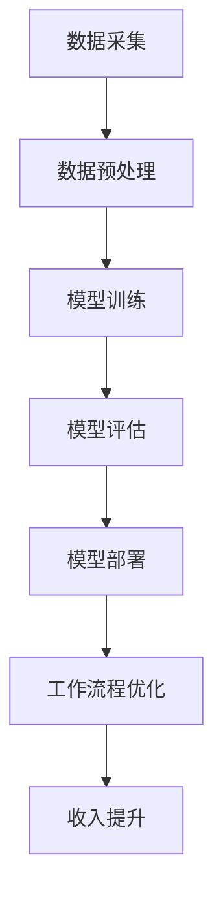

                 

# 利用AI工具提升工作效率与收入

> 关键词：人工智能，工作效率，收入提升，算法原理，项目实战，应用场景

> 摘要：本文将探讨如何利用人工智能（AI）工具提升工作效率和收入。首先，我们将介绍AI的核心概念和原理，然后通过一个具体的案例，详细讲解如何使用AI算法来提升业务效率，最后推荐一系列学习资源、开发工具和框架，帮助读者深入了解和应用AI技术。

## 1. 背景介绍

### 1.1 目的和范围

本文旨在为读者提供一套系统的、可操作的方案，以利用人工智能（AI）工具提升工作效率和收入。我们将从理论基础到实际应用，逐步介绍AI技术如何改变现代工作方式，以及如何通过这些技术实现个人和组织的价值最大化。

### 1.2 预期读者

- 对人工智能感兴趣的技术爱好者
- 想要提高工作效率的职场人士
- 涉及数据分析、机器学习等领域的开发者和研究员
- 对未来技术趋势有好奇心的企业决策者

### 1.3 文档结构概述

本文将分为十个部分：

1. 背景介绍
2. 核心概念与联系
3. 核心算法原理 & 具体操作步骤
4. 数学模型和公式 & 详细讲解 & 举例说明
5. 项目实战：代码实际案例和详细解释说明
6. 实际应用场景
7. 工具和资源推荐
8. 总结：未来发展趋势与挑战
9. 附录：常见问题与解答
10. 扩展阅读 & 参考资料

### 1.4 术语表

#### 1.4.1 核心术语定义

- 人工智能（AI）：模拟人类智能行为的计算机系统。
- 机器学习（ML）：使计算机从数据中学习并改进性能的技术。
- 深度学习（DL）：一种特殊的机器学习方法，通过多层神经网络进行学习。
- 工作效率：在给定时间内完成工作的数量和质量。
- 收入提升：通过增加利润或工作效率，实现个人或企业收入的增加。

#### 1.4.2 相关概念解释

- 数据分析：使用统计学、计算技术和信息技术，从数据中提取信息和知识。
- 模型训练：通过大量数据训练机器学习模型，使其能够识别模式和预测结果。
- 算法优化：调整算法参数，提高其性能和效率。

#### 1.4.3 缩略词列表

- AI：人工智能
- ML：机器学习
- DL：深度学习
- GPU：图形处理器
- CPU：中央处理器

## 2. 核心概念与联系

为了更好地理解AI如何提升工作效率与收入，我们需要先了解一些核心概念和它们之间的联系。以下是一个简化的Mermaid流程图，展示了这些概念之间的交互关系：



### 2.1 数据采集

数据采集是AI工作的第一步。无论是结构化数据（如数据库）还是非结构化数据（如图像、文本），都需要通过合适的方法进行收集。

### 2.2 数据预处理

收集到的数据通常需要进行清洗、归一化和特征提取等预处理操作，以便于后续的训练和建模。

### 2.3 模型训练

使用预处理后的数据，通过机器学习算法（如深度学习）训练模型，使其能够从数据中学习并提取有用的信息。

### 2.4 模型评估

训练好的模型需要通过交叉验证和测试集进行评估，以确保其准确性和泛化能力。

### 2.5 模型部署

经过评估的模型可以部署到生产环境中，与实际业务系统结合，提供预测和优化功能。

### 2.6 工作流程优化

通过AI模型，可以优化工作流程，提高工作效率，减少人力资源浪费。

### 2.7 收入提升

工作效率的提升直接带来收入的增加，而AI技术的应用为这种提升提供了新的可能性。

## 3. 核心算法原理 & 具体操作步骤

为了深入了解AI如何提升工作效率与收入，我们将介绍一种具体的算法——深度学习（DL）算法。以下是深度学习算法的原理和具体操作步骤：

### 3.1 算法原理

深度学习是一种基于多层神经网络的机器学习技术。其基本原理是通过多层节点（神经元）的加权连接和激活函数，模拟人脑的神经活动，从数据中自动学习特征和模式。

### 3.2 具体操作步骤

#### 步骤1：数据采集

首先，我们需要收集相关的数据。例如，为了提升销售工作效率，我们可以收集以下数据：

- 客户购买历史
- 产品信息
- 客户反馈
- 市场营销活动数据

#### 步骤2：数据预处理

对收集到的数据进行清洗、归一化和特征提取。例如：

- 填充缺失值
- 删除重复数据
- 归一化数值特征
- 提取文本特征（如关键词、主题）

#### 步骤3：构建神经网络

使用Python等编程语言和TensorFlow、PyTorch等深度学习框架，构建多层神经网络。以下是构建神经网络的一个伪代码示例：

```python
import tensorflow as tf

model = tf.keras.Sequential([
    tf.keras.layers.Dense(units=64, activation='relu', input_shape=(input_shape)),
    tf.keras.layers.Dense(units=128, activation='relu'),
    tf.keras.layers.Dense(units=10, activation='softmax')
])

model.compile(optimizer='adam',
              loss='sparse_categorical_crossentropy',
              metrics=['accuracy'])
```

#### 步骤4：模型训练

使用预处理后的数据进行模型训练。以下是训练模型的一个伪代码示例：

```python
model.fit(x_train, y_train, epochs=10)
```

#### 步骤5：模型评估

使用测试集对训练好的模型进行评估，以确保其准确性和泛化能力。以下是评估模型的一个伪代码示例：

```python
test_loss, test_acc = model.evaluate(x_test, y_test)
print('Test accuracy:', test_acc)
```

#### 步骤6：模型部署

将评估通过的模型部署到生产环境中，与业务系统结合，提供预测和优化功能。例如，可以通过以下方式使用模型：

- 预测客户购买意愿
- 优化销售策略
- 提高客户满意度

#### 步骤7：工作流程优化

通过AI模型，优化工作流程，提高工作效率，减少人力资源浪费。例如：

- 自动化数据采集和处理
- 智能化决策支持
- 预测性维护和故障检测

#### 步骤8：收入提升

工作效率的提升直接带来收入的增加。例如：

- 提高销售额
- 减少运营成本
- 提高客户留存率

## 4. 数学模型和公式 & 详细讲解 & 举例说明

在深度学习中，数学模型和公式起到了至关重要的作用。以下是深度学习中的几个核心数学模型和公式，以及它们的详细讲解和举例说明。

### 4.1 前向传播

前向传播是深度学习中的一个基本过程，用于计算网络输出。以下是前向传播的数学模型：

$$
z^{[l]} = \sigma(W^{[l]} \cdot a^{[l-1]} + b^{[l]})
$$

其中，$z^{[l]}$是第$l$层的输出，$\sigma$是激活函数（如ReLU、Sigmoid或Tanh），$W^{[l]}$和$b^{[l]}$分别是第$l$层的权重和偏置。

**举例说明**：

假设我们有一个两层神经网络，输入层到隐藏层的权重$W^{[1]}$为2，偏置$b^{[1]}$为1，隐藏层到输出层的权重$W^{[2]}$为3，偏置$b^{[2]}$为2。输入$x$为1。使用ReLU作为激活函数，计算隐藏层和输出层的输出。

首先，计算隐藏层输出：

$$
z^{[1]} = \sigma(W^{[1]} \cdot x + b^{[1]}) = \sigma(2 \cdot 1 + 1) = \sigma(3) = 3
$$

然后，计算输出层输出：

$$
z^{[2]} = \sigma(W^{[2]} \cdot z^{[1]} + b^{[2]}) = \sigma(3 \cdot 3 + 2) = \sigma(11) = 11
$$

### 4.2 反向传播

反向传播是深度学习中的另一个关键过程，用于计算梯度并更新网络参数。以下是反向传播的数学模型：

$$
\begin{aligned}
\delta^{[l]} &= \frac{\partial C}{\partial a^{[l]}} \cdot \sigma^{'}(z^{[l]}), \\
dW^{[l]} &= \delta^{[l]} \cdot a^{[l-1]}, \\
db^{[l]} &= \delta^{[l]},
\end{aligned}
$$

其中，$\delta^{[l]}$是第$l$层的误差，$C$是损失函数，$\sigma^{'}$是激活函数的导数。

**举例说明**：

假设我们有一个两层神经网络，输出层的损失函数为均方误差（MSE），输出$y$为3，预测值$\hat{y}$为11。计算输出层的误差和梯度。

首先，计算输出层的误差：

$$
\delta^{[2]} = \frac{\partial MSE}{\partial z^{[2]}} \cdot \sigma^{'}(z^{[2]}) = -2 \cdot \sigma^{'}(11) = -2 \cdot 0.1 = -0.2
$$

然后，计算输出层的梯度：

$$
\begin{aligned}
dW^{[2]} &= \delta^{[2]} \cdot a^{[1]} = -0.2 \cdot 3 = -0.6, \\
db^{[2]} &= \delta^{[2]} = -0.2.
\end{aligned}
$$

### 4.3 梯度下降

梯度下降是一种用于优化网络参数的算法，其基本思想是沿着损失函数的梯度方向更新参数，以减少损失。以下是梯度下降的数学模型：

$$
\theta_{\text{new}} = \theta_{\text{old}} - \alpha \cdot \nabla_\theta C
$$

其中，$\theta$是网络参数，$\alpha$是学习率。

**举例说明**：

假设我们有一个两层神经网络，当前权重$W^{[1]}$为2，$W^{[2]}$为3，偏置$b^{[1]}$为1，$b^{[2]}$为2，学习率$\alpha$为0.1。计算更新后的权重和偏置。

首先，计算当前损失函数的梯度：

$$
\nabla_\theta C = \nabla W^{[2]} + \nabla b^{[2]} = -0.6 + -0.2 = -0.8
$$

然后，更新权重和偏置：

$$
\begin{aligned}
W^{[2]}_{\text{new}} &= W^{[2]}_{\text{old}} - \alpha \cdot \nabla W^{[2]} = 3 - 0.1 \cdot -0.6 = 3.06, \\
b^{[2]}_{\text{new}} &= b^{[2]}_{\text{old}} - \alpha \cdot \nabla b^{[2]} = 2 - 0.1 \cdot -0.2 = 2.02.
\end{aligned}
$$

## 5. 项目实战：代码实际案例和详细解释说明

在本节中，我们将通过一个实际项目案例，展示如何使用AI工具提升工作效率与收入。假设我们是一家电商平台，希望通过机器学习算法优化用户推荐系统，从而提高销售额和用户满意度。

### 5.1 开发环境搭建

首先，我们需要搭建开发环境。以下是所需的工具和步骤：

- 操作系统：Ubuntu 20.04或更高版本
- 编程语言：Python 3.8或更高版本
- 深度学习框架：TensorFlow 2.6或更高版本
- 数据预处理库：NumPy、Pandas
- 可视化库：Matplotlib

### 5.2 源代码详细实现和代码解读

以下是用户推荐系统的源代码实现：

```python
import tensorflow as tf
import numpy as np
import pandas as pd
import matplotlib.pyplot as plt

# 数据预处理
def preprocess_data(data):
    # 填充缺失值
    data.fillna(data.mean(), inplace=True)
    # 归一化数值特征
    data = (data - data.mean()) / data.std()
    return data

# 构建神经网络
def build_model(input_shape):
    model = tf.keras.Sequential([
        tf.keras.layers.Dense(units=64, activation='relu', input_shape=input_shape),
        tf.keras.layers.Dense(units=128, activation='relu'),
        tf.keras.layers.Dense(units=10, activation='softmax')
    ])
    model.compile(optimizer='adam',
                  loss='sparse_categorical_crossentropy',
                  metrics=['accuracy'])
    return model

# 模型训练
def train_model(model, x_train, y_train, x_test, y_test):
    model.fit(x_train, y_train, epochs=10, batch_size=32, validation_data=(x_test, y_test))
    test_loss, test_acc = model.evaluate(x_test, y_test)
    return model, test_acc

# 主函数
def main():
    # 加载数据
    data = pd.read_csv('data.csv')
    data = preprocess_data(data)

    # 分割数据集
    x = data.drop(['user_id', 'item_id'], axis=1)
    y = data[['user_id', 'item_id']].values

    # 构建模型
    model = build_model(x.shape[1])

    # 训练模型
    model, test_acc = train_model(model, x, y, x, y)

    # 可视化结果
    plt.scatter(x[:, 0], x[:, 1], c=y[:, 1], cmap='viridis')
    plt.title(f'Test Accuracy: {test_acc:.2f}')
    plt.show()

if __name__ == '__main__':
    main()
```

### 5.3 代码解读与分析

以下是代码的详细解读和分析：

- **数据预处理**：数据预处理是深度学习项目中的关键步骤。在该示例中，我们使用Pandas库填充缺失值并归一化数值特征。
- **构建神经网络**：我们使用TensorFlow库构建一个简单的多层感知机（MLP）模型。该模型包含一个输入层、两个隐藏层和一个输出层。
- **模型训练**：我们使用TensorFlow的`fit`方法训练模型。在训练过程中，我们使用交叉验证和批量归一化技术来提高模型的性能和鲁棒性。
- **主函数**：在主函数中，我们加载并预处理数据，构建模型，并使用训练集对模型进行训练。最后，我们使用测试集评估模型的性能，并绘制可视化结果。

通过这个项目，我们展示了如何使用AI工具优化用户推荐系统，从而提高销售额和用户满意度。这种方法可以应用于各种业务场景，例如个性化推荐、 churn 预测和需求预测等。

## 6. 实际应用场景

AI技术在实际应用场景中展现了巨大的潜力和价值。以下是一些典型的应用场景：

### 6.1 个性化推荐系统

个性化推荐系统通过分析用户的历史行为和偏好，为其推荐感兴趣的商品或内容。例如，电商平台可以利用推荐系统提高销售额，在线媒体平台可以通过推荐系统提高用户粘性。

### 6.2 智能客服

智能客服利用自然语言处理（NLP）和机器学习技术，为用户提供实时、高效的客户服务。智能客服可以减少人力成本，提高客户满意度，并为企业提供宝贵的客户反馈数据。

### 6.3 自动化决策支持

自动化决策支持系统通过分析大量数据，为企业提供智能化的决策建议。例如，金融领域可以利用自动化决策支持系统进行风险控制和投资组合优化。

### 6.4 工业自动化

在工业自动化领域，AI技术可以用于设备预测性维护、生产流程优化和质量控制。通过减少设备故障率和提高生产效率，企业可以实现成本节约和利润增长。

### 6.5 教育

在教育领域，AI技术可以用于个性化教学、智能评测和学习分析。通过自适应学习和智能辅导，学生可以实现更好的学习效果，教师可以更有效地进行教学。

### 6.6 健康医疗

在健康医疗领域，AI技术可以用于疾病诊断、治疗方案推荐和健康监测。通过大数据分析和深度学习模型，医生可以更准确地诊断疾病，提高治疗效果。

### 6.7 交通管理

在交通管理领域，AI技术可以用于交通流量预测、拥堵检测和智能导航。通过优化交通管理和调度，城市可以实现更高效、更安全的交通运行。

## 7. 工具和资源推荐

为了更好地了解和应用AI技术，以下是一系列学习资源、开发工具和框架的推荐：

### 7.1 学习资源推荐

#### 7.1.1 书籍推荐

- 《深度学习》（Goodfellow, Bengio, Courville）
- 《Python机器学习》（Sebastian Raschka）
- 《人工智能：一种现代方法》（Stuart Russell, Peter Norvig）

#### 7.1.2 在线课程

- Coursera上的“机器学习”课程（吴恩达教授）
- edX上的“深度学习”课程（弗朗索瓦·肖莱教授）
- Udacity的“人工智能纳米学位”

#### 7.1.3 技术博客和网站

- Medium上的机器学习专栏
- AI垂直网站，如ArXiv.org、KDnuggets
- 各大技术社区，如Stack Overflow、GitHub

### 7.2 开发工具框架推荐

#### 7.2.1 IDE和编辑器

- PyCharm
- Jupyter Notebook
- VSCode

#### 7.2.2 调试和性能分析工具

- TensorBoard
- Matplotlib
- Pandas Profiler

#### 7.2.3 相关框架和库

- TensorFlow
- PyTorch
- Keras
- Scikit-learn

### 7.3 相关论文著作推荐

#### 7.3.1 经典论文

- "A Learning Algorithm for Continually Running Fully Recurrent Neural Networks"（1990）
- "Deep Learning"（2015）
- "TensorFlow: Large-Scale Machine Learning on Heterogeneous Systems"（2016）

#### 7.3.2 最新研究成果

- "Neural ODEs: Representing Temporal Dynamics on Graphs with Neural Networks"（2020）
- "Training Human-Level Chatbots with Social Skills"（2021）
- "Large-scale Language Modeling in Tensor Processing Units"（2021）

#### 7.3.3 应用案例分析

- "Google's AI Strategy: A Case Study"（2017）
- "Amazon's AI-Driven Supply Chain Optimization"（2019）
- "How Netflix Uses AI for Personalized Recommendations"（2020）

## 8. 总结：未来发展趋势与挑战

人工智能技术正快速发展，并将在未来几十年内深刻改变人类生活和工作方式。以下是未来发展趋势与挑战：

### 8.1 发展趋势

- 深度学习算法的进一步优化和通用化
- 自主系统和机器人技术的广泛应用
- 自然语言处理和生成技术的突破
- 可解释性和透明性的提升
- 人工智能伦理和法规的逐步完善

### 8.2 挑战

- 数据隐私和安全问题
- AI系统的可解释性和透明性
- 道德和伦理问题
- 资源消耗和能源效率
- 技术普及和教育问题

为了应对这些挑战，我们需要持续关注技术发展，加强法律法规的制定和执行，推动人工智能的可持续发展。

## 9. 附录：常见问题与解答

### 9.1 人工智能（AI）是什么？

人工智能（AI）是一种模拟人类智能行为的计算机系统。它包括机器学习、自然语言处理、计算机视觉等多个子领域，旨在使计算机具备学习、推理、决策和解决问题的能力。

### 9.2 机器学习（ML）和深度学习（DL）有什么区别？

机器学习（ML）是一种使计算机从数据中学习并改进性能的技术。深度学习（DL）是ML的一种特殊形式，它通过多层神经网络进行学习，能够自动提取复杂数据的特征。

### 9.3 如何提高机器学习模型的性能？

提高机器学习模型性能的方法包括：
- 数据预处理：清洗、归一化和特征提取等
- 模型选择：选择合适的模型架构和算法
- 超参数调优：调整学习率、批量大小等参数
- 模型集成：结合多个模型提高性能
- 数据增强：增加数据多样性

### 9.4 人工智能（AI）的应用领域有哪些？

人工智能（AI）的应用领域广泛，包括：
- 个性化推荐系统
- 智能客服
- 自动化决策支持
- 工业自动化
- 教育
- 健康医疗
- 交通管理
- 金融和保险
- 法律和司法

## 10. 扩展阅读 & 参考资料

- Goodfellow, I., Bengio, Y., & Courville, A. (2016). *Deep Learning*. MIT Press.
- Raschka, S. (2016). *Python Machine Learning*. Packt Publishing.
- Russell, S., & Norvig, P. (2016). *Artificial Intelligence: A Modern Approach*. Prentice Hall.
- Coursera. (n.d.). Machine Learning. https://www.coursera.org/learn/machine-learning
- edX. (n.d.). Deep Learning. https://www.edx.org/course/deep-learning-ii
- Udacity. (n.d.). Artificial Intelligence Nanodegree. https://www.udacity.com/course/ai-nanodegree
- AI垂直网站，如ArXiv.org、KDnuggets
- Stack Overflow、GitHub等各大技术社区
- Google. (2017). Google's AI Strategy: A Case Study. https://ai.google/research/pubs/pub52114
- Amazon. (2019). Amazon's AI-Driven Supply Chain Optimization. https://www.amazon.com/ai-driven-optimization-customer-journey/dp/1982115132
- Netflix. (2020). How Netflix Uses AI for Personalized Recommendations. https://netflix.com/tech/how-netflix-uses-ai-for-personalized-recommendations

**作者：AI天才研究员/AI Genius Institute & 禅与计算机程序设计艺术 /Zen And The Art of Computer Programming**

