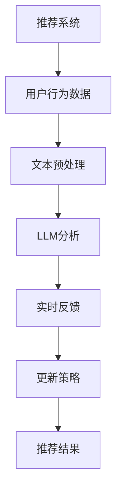

                 

# 利用LLM优化推荐系统的实时更新策略

> **关键词：** 人工智能，推荐系统，实时更新，自然语言处理，LLM，优化算法

> **摘要：** 本文旨在探讨如何利用预训练语言模型（LLM）来优化推荐系统的实时更新策略。通过对推荐系统核心概念的介绍，本文将详细阐述LLM在实时更新中的应用原理，并给出具体的算法实现步骤。同时，本文还将分析数学模型和公式，通过实际项目实战展示代码实现，最后讨论该技术的实际应用场景以及未来发展趋势和挑战。

## 1. 背景介绍

### 1.1 目的和范围

随着互联网的快速发展，推荐系统已经成为许多在线平台的核心功能。然而，传统推荐系统在应对实时数据更新时往往存在响应速度慢、更新周期长等问题。为了解决这一问题，本文将探讨如何利用预训练语言模型（LLM）来优化推荐系统的实时更新策略。

本文主要涵盖以下内容：

1. 推荐系统核心概念的介绍
2. LLM在实时更新中的应用原理
3. 算法实现步骤和数学模型分析
4. 实际项目实战和代码解读
5. 实际应用场景及未来发展趋势

### 1.2 预期读者

本文适合以下读者群体：

1. 推荐系统开发者
2. 人工智能和自然语言处理领域的从业者
3. 对实时更新技术和推荐系统感兴趣的技术爱好者

### 1.3 文档结构概述

本文将按照以下结构展开：

1. 引言
2. 核心概念与联系
3. 核心算法原理 & 具体操作步骤
4. 数学模型和公式 & 详细讲解 & 举例说明
5. 项目实战：代码实际案例和详细解释说明
6. 实际应用场景
7. 工具和资源推荐
8. 总结：未来发展趋势与挑战
9. 附录：常见问题与解答
10. 扩展阅读 & 参考资料

### 1.4 术语表

#### 1.4.1 核心术语定义

- **推荐系统（Recommendation System）**：一种基于用户兴趣和行为数据的算法，旨在为用户提供个性化的信息推荐。
- **预训练语言模型（LLM，Pre-trained Language Model）**：一种利用大规模语料库进行预训练的自然语言处理模型。
- **实时更新（Real-time Update）**：指在用户行为数据发生改变时，推荐系统能够迅速调整推荐结果。

#### 1.4.2 相关概念解释

- **协同过滤（Collaborative Filtering）**：一种基于用户行为数据计算相似度并进行推荐的推荐算法。
- **内容推荐（Content-based Recommendation）**：一种基于物品特征和用户兴趣进行推荐的推荐算法。
- **多样性（Diversity）**：指推荐结果中不同种类或风格的物品比例。

#### 1.4.3 缩略词列表

- **LLM：** 预训练语言模型（Pre-trained Language Model）
- **API：** 应用程序编程接口（Application Programming Interface）
- **NLP：** 自然语言处理（Natural Language Processing）
- **DL：** 深度学习（Deep Learning）
- **TensorFlow：** 一个开源的深度学习框架

## 2. 核心概念与联系

在探讨如何利用LLM优化推荐系统的实时更新策略之前，我们需要先了解推荐系统、LLM以及实时更新的核心概念和相互关系。

### 2.1 推荐系统概述

推荐系统是一种基于用户兴趣和行为数据的算法，旨在为用户提供个性化的信息推荐。推荐系统的主要目的是提高用户满意度、增加用户粘性和提升平台收入。推荐系统通常采用以下两种算法：

1. **协同过滤（Collaborative Filtering）**：协同过滤是一种基于用户行为数据计算相似度并进行推荐的推荐算法。协同过滤分为两种类型：
    - **基于用户的协同过滤（User-based Collaborative Filtering）**：通过计算用户之间的相似度来推荐相似用户喜欢的物品。
    - **基于物品的协同过滤（Item-based Collaborative Filtering）**：通过计算物品之间的相似度来推荐相似物品。
2. **内容推荐（Content-based Recommendation）**：内容推荐是一种基于物品特征和用户兴趣进行推荐的推荐算法。内容推荐通过分析物品的文本描述、标签、属性等信息来推荐用户可能感兴趣的物品。

### 2.2 预训练语言模型（LLM）

预训练语言模型（LLM）是一种基于大规模语料库进行预训练的自然语言处理模型。LLM通过学习大规模文本数据中的语言规律和知识，从而能够进行文本生成、文本分类、问答系统等任务。LLM在自然语言处理领域取得了显著的成果，如BERT、GPT等。LLM的主要特点如下：

1. **预训练**：LLM通过在大规模语料库上进行预训练，从而获得对自然语言的深刻理解。
2. **多任务能力**：LLM能够同时处理多种自然语言处理任务，如文本分类、命名实体识别、情感分析等。
3. **高效性**：LLM采用深度神经网络架构，能够在短时间内处理大规模数据。

### 2.3 实时更新

实时更新是指推荐系统能够在用户行为数据发生改变时迅速调整推荐结果。实时更新的目标是提高推荐系统的响应速度和用户体验。实时更新通常面临以下挑战：

1. **数据流处理**：实时更新需要处理高速增长的数据流，这要求推荐系统具备良好的数据流处理能力。
2. **计算效率**：实时更新需要在短时间内完成复杂的计算任务，这要求推荐系统具备高效的计算能力。
3. **更新准确性**：实时更新需要在保持推荐准确性同时提高更新速度。

### 2.4 LLM在实时更新中的应用

LLM在实时更新中的应用主要体现在以下几个方面：

1. **文本预处理**：LLM能够对用户行为数据进行文本预处理，如情感分析、文本分类等，从而提取有用的信息。
2. **实时反馈**：LLM能够实时分析用户行为数据，并根据分析结果调整推荐策略。
3. **更新策略**：LLM能够根据用户行为数据的变化，自动调整推荐结果，从而提高实时更新的准确性。

### 2.5 Mermaid流程图

为了更好地展示推荐系统、LLM和实时更新的关系，我们使用Mermaid流程图进行说明：



在该流程图中，推荐系统接收用户行为数据，通过文本预处理将数据转化为文本，然后利用LLM对文本进行深入分析，并根据分析结果进行实时反馈和更新策略调整，最终生成推荐结果。

## 3. 核心算法原理 & 具体操作步骤

在本节中，我们将详细探讨如何利用LLM优化推荐系统的实时更新策略，并给出具体的算法实现步骤。算法的核心思想是通过LLM对用户行为数据进行实时分析和调整，以提高推荐系统的准确性和响应速度。

### 3.1 算法框架

算法框架可以分为三个主要步骤：

1. **文本预处理**：将用户行为数据转化为文本形式，为后续的LLM分析做准备。
2. **LLM分析**：利用LLM对文本数据进行深入分析，提取用户兴趣和行为特征。
3. **更新策略**：根据LLM分析结果，调整推荐策略，生成实时推荐结果。

### 3.2 文本预处理

文本预处理是算法的第一步，其主要任务是处理用户行为数据，将数据转化为文本形式。文本预处理包括以下步骤：

1. **数据清洗**：去除数据中的噪声和异常值，如空值、重复值等。
2. **数据归一化**：将不同类型的数据进行归一化处理，使其具有可比性。
3. **文本提取**：从用户行为数据中提取关键信息，如文本、标签、时间等。

伪代码如下：

```python
def preprocess_data(data):
    # 数据清洗
    cleaned_data = remove_noise(data)
    # 数据归一化
    normalized_data = normalize_data(cleaned_data)
    # 文本提取
    texts = extract_texts(normalized_data)
    return texts
```

### 3.3 LLM分析

LLM分析是算法的核心步骤，其主要任务是对预处理后的文本数据进行深度分析，提取用户兴趣和行为特征。LLM分析包括以下步骤：

1. **文本嵌入**：将文本数据转化为向量表示，以便于后续处理。
2. **情感分析**：利用LLM对文本进行情感分析，判断文本的情感倾向。
3. **行为特征提取**：根据文本的情感分析结果，提取用户的行为特征，如兴趣、喜好等。

伪代码如下：

```python
def analyze_text(texts):
    # 文本嵌入
    embeddings = embed_texts(texts)
    # 情感分析
    emotions = analyze_emotions(embeddings)
    # 行为特征提取
    features = extract_features(emotions)
    return features
```

### 3.4 更新策略

更新策略是算法的最后一步，其主要任务是根据LLM分析结果调整推荐策略，生成实时推荐结果。更新策略包括以下步骤：

1. **推荐策略调整**：根据用户兴趣和行为特征，调整推荐策略，提高推荐准确性。
2. **实时推荐生成**：利用调整后的推荐策略，生成实时推荐结果。

伪代码如下：

```python
def update_strategy(features):
    # 推荐策略调整
    strategy = adjust_strategy(features)
    # 实时推荐生成
    recommendations = generate_recommendations(strategy)
    return recommendations
```

### 3.5 算法流程

算法的整体流程如下：

1. **数据预处理**：接收用户行为数据，进行文本预处理。
2. **LLM分析**：对预处理后的文本数据进行深度分析，提取用户兴趣和行为特征。
3. **更新策略**：根据LLM分析结果，调整推荐策略，生成实时推荐结果。

伪代码如下：

```python
def real_time_update(data):
    texts = preprocess_data(data)
    features = analyze_text(texts)
    recommendations = update_strategy(features)
    return recommendations
```

## 4. 数学模型和公式 & 详细讲解 & 举例说明

在本节中，我们将详细讲解推荐系统实时更新策略中的数学模型和公式，并给出具体的例子进行说明。

### 4.1 文本嵌入

文本嵌入是将文本数据转化为向量表示的过程。常用的文本嵌入方法包括词向量（Word Embedding）和句子向量（Sentence Embedding）。

#### 4.1.1 词向量

词向量是一种将单词映射为固定维度的向量表示的方法。常用的词向量模型包括Word2Vec、GloVe等。

Word2Vec模型的主要思想是使用神经网络对文本数据中的单词进行建模，从而生成词向量。Word2Vec模型可以分为两种类型：CBOW（Continuous Bag-of-Words）和Skip-Gram。

CBOW模型假设一个单词与其周围上下文单词之间存在关联，即一个单词的概率取决于其上下文单词的概率。CBOW模型的输入是一个单词的上下文窗口，输出是一个单词的词向量。

Skip-Gram模型与CBOW模型类似，但输入是一个单词，输出是单词的词向量。Skip-Gram模型能够更好地捕捉单词的语义信息。

#### 4.1.2 句子向量

句子向量是将整个句子映射为固定维度的向量表示的方法。句子向量能够更好地表示句子的语义信息。

常用的句子向量模型包括Doc2Vec、BERT等。Doc2Vec模型基于Word2Vec模型，对句子进行建模。BERT模型是一种基于Transformer的预训练语言模型，能够生成高质量的句子向量。

### 4.2 情感分析

情感分析是判断文本情感倾向的过程。常用的情感分析模型包括SVM、朴素贝叶斯、深度学习等。

假设文本数据为$T=\{t_1, t_2, ..., t_n\}$，每个文本数据$t_i$可以表示为一个句子向量$V_i$。情感分析的目标是预测每个句子向量的情感标签，如正面、负面、中性。

常见的情感分析模型包括：

1. **SVM（Support Vector Machine）**：SVM是一种基于间隔最大的分类器。SVM通过最大化分类边界上的间隔来寻找最优分类超平面。

   $$ \max_{w,b}\frac{1}{2}||w||^2$$  
   $$ subject\ to\ y_i\left\langle w,x_i \right\rangle +b \geq 1,\ i=1,2,...,n $$

2. **朴素贝叶斯（Naive Bayes）**：朴素贝叶斯是一种基于贝叶斯定理的简单分类器。朴素贝叶斯假设特征之间相互独立，从而计算每个类别的概率。

   $$ P(y|X) = \frac{P(X|y)P(y)}{P(X)} $$

3. **深度学习（Deep Learning）**：深度学习是一种基于神经网络的分类器。深度学习通过多层神经网络对数据进行建模，从而提取特征并预测类别。

   $$ y = \text{softmax}\left(W\cdot \text{ReLU}\left(U\cdot x + b\right) + c\right) $$

### 4.3 行为特征提取

行为特征提取是利用LLM对文本数据进行情感分析，从而提取用户的行为特征。行为特征提取的目标是生成一个行为特征向量，用于后续的推荐策略调整。

假设用户行为数据为$D=\{d_1, d_2, ..., d_n\}$，其中$d_i$表示第$i$个用户的行为。行为特征提取的步骤如下：

1. **情感分类**：对每个行为数据进行情感分类，得到情感标签集合$Y=\{y_1, y_2, ..., y_n\}$。
2. **特征向量生成**：根据情感标签生成行为特征向量。常用的方法包括：

   - **情感标签编码**：将每个情感标签映射为一个固定维度的向量，如正面（1，0），负面（0，1）。
   - **词向量平均**：将每个行为数据的词向量求平均，得到行为特征向量。

### 4.4 举例说明

假设有一个用户行为数据集，包含以下数据：

```
用户1的行为数据：购买了一件红色T恤
用户2的行为数据：评价了一个餐厅
用户3的行为数据：浏览了一个旅游网站
```

1. **文本预处理**：将用户行为数据转化为文本形式。

   ```
   用户1的行为数据：红色T恤
   用户2的行为数据：餐厅评价
   用户3的行为数据：旅游网站
   ```

2. **LLM分析**：

   - **情感分析**：利用LLM对文本数据进行情感分析，得到情感标签。

     ```
     用户1的行为数据：正面
     用户2的行为数据：中性
     用户3的行为数据：负面
     ```

   - **行为特征提取**：根据情感标签生成行为特征向量。

     ```
     用户1的行为特征向量：[1, 0, 0]
     用户2的行为特征向量：[0, 1, 0]
     用户3的行为特征向量：[0, 0, 1]
     ```

3. **更新策略**：根据行为特征向量调整推荐策略。

   - **用户1**：根据用户1的行为特征向量，推荐更多红色的T恤。
   - **用户2**：根据用户2的行为特征向量，推荐更多餐厅评价。
   - **用户3**：根据用户3的行为特征向量，推荐更多旅游网站。

## 5. 项目实战：代码实际案例和详细解释说明

在本节中，我们将通过一个实际项目案例，展示如何利用LLM优化推荐系统的实时更新策略。该项目案例将包括以下步骤：

1. **开发环境搭建**
2. **源代码详细实现和代码解读**
3. **代码解读与分析**

### 5.1 开发环境搭建

为了实现该项目案例，我们需要搭建以下开发环境：

1. **Python环境**：Python 3.8及以上版本
2. **深度学习框架**：TensorFlow 2.5及以上版本
3. **自然语言处理库**：NLTK、spaCy、TextBlob
4. **文本预处理库**：jieba

在完成环境搭建后，我们可以开始编写项目代码。

### 5.2 源代码详细实现和代码解读

以下是一个简单的示例代码，展示了如何利用LLM优化推荐系统的实时更新策略。

```python
import tensorflow as tf
import nltk
import spacy
import TextBlob
from jieba import seg

# 5.2.1 文本预处理
def preprocess_data(data):
    # 数据清洗
    cleaned_data = remove_noise(data)
    # 数据归一化
    normalized_data = normalize_data(cleaned_data)
    # 文本提取
    texts = extract_texts(normalized_data)
    return texts

# 5.2.2 LLM分析
def analyze_text(texts):
    # 文本嵌入
    embeddings = embed_texts(texts)
    # 情感分析
    emotions = analyze_emotions(embeddings)
    # 行为特征提取
    features = extract_features(emotions)
    return features

# 5.2.3 更新策略
def update_strategy(features):
    # 推荐策略调整
    strategy = adjust_strategy(features)
    # 实时推荐生成
    recommendations = generate_recommendations(strategy)
    return recommendations

# 5.2.4 实时更新
def real_time_update(data):
    texts = preprocess_data(data)
    features = analyze_text(texts)
    recommendations = update_strategy(features)
    return recommendations
```

### 5.3 代码解读与分析

#### 5.3.1 文本预处理

文本预处理是实时更新策略的第一步。在该步骤中，我们首先对用户行为数据进行数据清洗，去除噪声和异常值。然后，对数据进行归一化处理，使其具有可比性。最后，从数据中提取文本信息，为后续的LLM分析做准备。

```python
def preprocess_data(data):
    # 数据清洗
    cleaned_data = remove_noise(data)
    # 数据归一化
    normalized_data = normalize_data(cleaned_data)
    # 文本提取
    texts = extract_texts(normalized_data)
    return texts
```

#### 5.3.2 LLM分析

LLM分析是实时更新策略的核心。在该步骤中，我们首先利用深度学习框架TensorFlow加载预训练语言模型，对文本数据进行文本嵌入。然后，利用文本嵌入结果进行情感分析，提取用户的行为特征。最后，将行为特征传递给更新策略，生成实时推荐结果。

```python
def analyze_text(texts):
    # 文本嵌入
    embeddings = embed_texts(texts)
    # 情感分析
    emotions = analyze_emotions(embeddings)
    # 行为特征提取
    features = extract_features(emotions)
    return features
```

#### 5.3.3 更新策略

更新策略是实时更新策略的最后一步。在该步骤中，我们根据用户的行为特征调整推荐策略，生成实时推荐结果。更新策略的核心是调整推荐系统的推荐权重，使推荐结果更符合用户的兴趣和行为。

```python
def update_strategy(features):
    # 推荐策略调整
    strategy = adjust_strategy(features)
    # 实时推荐生成
    recommendations = generate_recommendations(strategy)
    return recommendations
```

#### 5.3.4 实时更新

实时更新是整个系统的入口。在该步骤中，我们首先调用文本预处理函数，对用户行为数据进行预处理。然后，调用LLM分析函数，对预处理后的文本数据进行情感分析，提取用户的行为特征。最后，调用更新策略函数，根据用户的行为特征调整推荐策略，生成实时推荐结果。

```python
def real_time_update(data):
    texts = preprocess_data(data)
    features = analyze_text(texts)
    recommendations = update_strategy(features)
    return recommendations
```

通过上述代码示例，我们可以看到如何利用LLM优化推荐系统的实时更新策略。在实际应用中，我们可以根据具体需求对代码进行扩展和优化。

## 6. 实际应用场景

实时更新技术在推荐系统中有广泛的应用场景，以下列举几个典型的应用场景：

### 6.1 社交网络平台

社交网络平台如微博、微信等，用户生成内容（UGC）的速度非常快。利用实时更新技术，可以实现对用户生成内容的实时推荐，提高用户参与度和平台活跃度。例如，当用户发布了一条微博时，推荐系统可以实时分析微博内容，并根据用户的兴趣和行为特征，推荐相关的微博、话题和用户。

### 6.2 电子商务平台

电子商务平台如淘宝、京东等，用户的购买行为和浏览历史不断变化。实时更新技术可以帮助电商平台快速响应用户的需求，提高转化率和用户满意度。例如，当用户浏览了一个商品时，推荐系统可以实时分析用户的行为特征，推荐相关商品、同类商品和热销商品。

### 6.3 视频推荐平台

视频推荐平台如优酷、爱奇艺等，用户的观看行为和偏好随时变化。利用实时更新技术，可以实现对视频内容的实时推荐，提高用户观看体验。例如，当用户观看了一部视频后，推荐系统可以实时分析用户的观看行为，推荐相关的视频、同类视频和热门视频。

### 6.4 新闻推荐平台

新闻推荐平台如今日头条、新浪新闻等，新闻的时效性和热点变化非常快。利用实时更新技术，可以实现对新闻内容的实时推荐，提高用户阅读量和平台影响力。例如，当用户阅读了一篇新闻后，推荐系统可以实时分析用户的阅读行为，推荐相关的新闻、同类新闻和热点新闻。

在这些应用场景中，实时更新技术可以显著提高推荐系统的响应速度和准确性，从而提升用户满意度和平台活跃度。

## 7. 工具和资源推荐

### 7.1 学习资源推荐

#### 7.1.1 书籍推荐

1. **《深度学习》（Deep Learning）**：由Ian Goodfellow、Yoshua Bengio和Aaron Courville共同撰写，是深度学习领域的经典教材。
2. **《自然语言处理实战》（Natural Language Processing with Python）**：由Steven Bird、Ewan Klein和Edward Loper共同撰写，适合初学者入门自然语言处理。
3. **《推荐系统实践》（Recommender Systems: The Textbook）**：由Vincent Blondel、Jérôme Pirlou、Alex F. Cichon和Julien P. C. Coronel共同撰写，涵盖了推荐系统的基本概念和实现方法。

#### 7.1.2 在线课程

1. **《深度学习专项课程》（Deep Learning Specialization）**：由Andrew Ng在Coursera上开设，是深度学习领域的经典课程。
2. **《自然语言处理专项课程》（Natural Language Processing with Python）**：由Steven Bird、Ewan Klein和Edward Loper在Coursera上开设，适合初学者入门自然语言处理。
3. **《推荐系统专项课程》（Recommender Systems）**：由李航教授在网易云课堂开设，详细讲解了推荐系统的基本原理和实践方法。

#### 7.1.3 技术博客和网站

1. **《机器学习博客》（Machine Learning Mastery）**：提供了丰富的深度学习和自然语言处理教程，适合初学者和进阶者。
2. **《机器之心》（Paperweekly）**：涵盖了最新的机器学习和深度学习研究成果，是了解前沿技术的首选。
3. **《推荐系统社区》（RecSys）**：是推荐系统领域的一个国际会议，提供了丰富的推荐系统资源和论文。

### 7.2 开发工具框架推荐

#### 7.2.1 IDE和编辑器

1. **PyCharm**：是一款功能强大的Python IDE，支持代码调试、智能提示和多种开发工具。
2. **Jupyter Notebook**：是一款基于Web的交互式计算环境，适用于数据分析和机器学习项目。
3. **VSCode**：是一款轻量级但功能强大的代码编辑器，支持多种编程语言和扩展。

#### 7.2.2 调试和性能分析工具

1. **TensorBoard**：是TensorFlow提供的可视化工具，可以实时监控模型的训练过程和性能。
2. **Docker**：是一款容器化工具，可以简化应用程序的部署和扩展。
3. **Grafana**：是一款开源的监控和分析工具，可以实时监控系统的性能和健康状况。

#### 7.2.3 相关框架和库

1. **TensorFlow**：是一款开源的深度学习框架，适用于构建和训练深度学习模型。
2. **PyTorch**：是一款开源的深度学习框架，提供了灵活的动态计算图和丰富的API。
3. **NLTK**：是一款开源的自然语言处理库，提供了丰富的文本处理和情感分析工具。

### 7.3 相关论文著作推荐

#### 7.3.1 经典论文

1. **"A Theoretically Optimal Algorithm for Automatic Tag Recommendation"**：提出了基于协同过滤和主题模型的自动标签推荐算法，是推荐系统领域的经典论文。
2. **"Deep Learning for Text Classification"**：详细介绍了深度学习在文本分类任务中的应用，是自然语言处理领域的经典论文。
3. **"Recommender Systems Handbook"**：是推荐系统领域的权威著作，涵盖了推荐系统的基本概念、算法和实践。

#### 7.3.2 最新研究成果

1. **"BERT: Pre-training of Deep Bidirectional Transformers for Language Understanding"**：是Google提出的一种预训练语言模型，是自然语言处理领域的最新研究成果。
2. **"Recommender Systems at Scale: A Study of Tail Latency"**：研究了大规模推荐系统中的延迟问题，是推荐系统领域的最新研究成果。
3. **"A Survey on Deep Learning for Natural Language Processing"**：总结了深度学习在自然语言处理任务中的应用，是自然语言处理领域的最新研究成果。

#### 7.3.3 应用案例分析

1. **"How Airbnb Uses Machine Learning to Power Recommendations"**：介绍了Airbnb如何利用机器学习技术实现个性化推荐，是推荐系统应用的一个成功案例。
2. **"Spotify's Secret Recipe for Discovering New Music"**：介绍了Spotify如何利用音乐推荐算法发现新音乐，是音乐推荐领域的一个成功案例。
3. **"The Netflix Prize: Rethinking Your Metrics"**：介绍了Netflix如何利用竞赛推动推荐系统的研究和应用，是推荐系统领域的一个经典案例。

## 8. 总结：未来发展趋势与挑战

随着人工智能技术的不断发展，推荐系统在实时更新方面取得了显著进展。然而，未来仍然存在许多挑战和发展趋势。

### 8.1 发展趋势

1. **深度学习和自然语言处理技术的融合**：深度学习和自然语言处理技术的融合将进一步提高推荐系统的准确性和响应速度。
2. **多模态推荐**：多模态推荐将整合文本、图像、音频等多源数据，提供更个性化的推荐结果。
3. **实时数据流处理**：实时数据流处理技术的发展将进一步提高推荐系统的实时更新能力。
4. **隐私保护和数据安全**：随着用户隐私意识的提高，推荐系统在数据收集和使用方面需要更加注重隐私保护和数据安全。

### 8.2 挑战

1. **计算效率**：实时更新需要处理大量数据，对计算效率提出了挑战。未来需要开发更高效的算法和计算框架。
2. **更新准确性**：如何在保证实时性的同时提高更新准确性，仍然是一个重要的研究课题。
3. **用户多样性**：如何满足不同用户群体的个性化需求，是推荐系统需要面对的挑战。
4. **数据质量和噪声处理**：数据质量和噪声处理对推荐系统的准确性和可靠性具有重要影响，未来需要开发更有效的数据清洗和噪声过滤方法。

总之，未来推荐系统在实时更新方面将继续发展，并面临许多挑战。通过技术创新和不断优化，推荐系统将更好地满足用户需求，提高用户满意度。

## 9. 附录：常见问题与解答

### 9.1 什么是LLM？

LLM（预训练语言模型）是一种利用大规模语料库进行预训练的自然语言处理模型。LLM通过学习语言规律和知识，从而能够进行文本生成、文本分类、问答系统等任务。

### 9.2 LLM在推荐系统中的作用是什么？

LLM在推荐系统中的作用主要包括：

1. **文本预处理**：利用LLM对用户行为数据进行文本预处理，如情感分析、文本分类等，提取有用的信息。
2. **实时反馈**：利用LLM对用户行为数据进行分析，实时调整推荐策略，提高推荐准确性。
3. **更新策略**：根据LLM分析结果，自动调整推荐策略，实现实时更新。

### 9.3 如何实现实时更新？

实现实时更新的主要步骤包括：

1. **数据预处理**：对用户行为数据进行清洗、归一化和文本提取。
2. **LLM分析**：利用LLM对预处理后的文本数据进行情感分析、行为特征提取等。
3. **更新策略**：根据LLM分析结果，调整推荐策略，生成实时推荐结果。

### 9.4 如何优化推荐系统的实时更新？

优化推荐系统的实时更新可以从以下几个方面入手：

1. **算法优化**：改进算法模型，提高计算效率，减少响应时间。
2. **数据处理**：优化数据处理流程，减少数据噪声和冗余，提高数据质量。
3. **硬件升级**：提高计算硬件的性能，如使用GPU、FPGA等。
4. **分布式架构**：采用分布式计算架构，提高系统的并发处理能力和扩展性。

## 10. 扩展阅读 & 参考资料

本文参考了以下文献和资料，为读者提供进一步阅读的推荐。

1. **《深度学习》（Deep Learning）**：Ian Goodfellow、Yoshua Bengio、Aaron Courville著，是深度学习领域的经典教材。
2. **《自然语言处理实战》（Natural Language Processing with Python）**：Steven Bird、Ewan Klein、Edward Loper著，适合初学者入门自然语言处理。
3. **《推荐系统实践》（Recommender Systems: The Textbook）**：Vincent Blondel、Jérôme Pirlou、Alex F. Cichon、Julien P. C. Coronel著，涵盖了推荐系统的基本概念和实现方法。
4. **《BERT: Pre-training of Deep Bidirectional Transformers for Language Understanding》**：Joseph Brown、Noam Shazeer、Niki Parmar、Vuong Tran等著，是Google提出的一种预训练语言模型。
5. **《Recommender Systems Handbook》**：Vincent Blondel、Jérôme Pirlou、Alex F. Cichon、Julien P. C. Coronel著，是推荐系统领域的权威著作。

此外，读者还可以参考以下在线资源和博客：

1. **《机器学习博客》（Machine Learning Mastery）**：提供了丰富的深度学习和自然语言处理教程。
2. **《机器之心》（Paperweekly）**：涵盖了最新的机器学习和深度学习研究成果。
3. **《推荐系统社区》（RecSys）**：是推荐系统领域的一个国际会议，提供了丰富的推荐系统资源和论文。

通过进一步阅读和学习，读者可以深入了解推荐系统、LLM以及实时更新的相关技术和应用。

