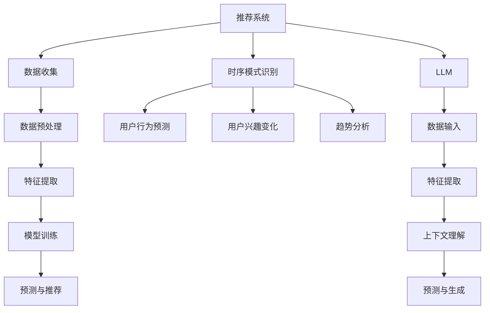

                 

# 利用LLM增强推荐系统的时序模式识别

## 关键词：  
**推荐系统、时序模式、LLM、人工智能、模式识别、算法优化**

## 摘要

本文旨在探讨如何利用大型语言模型（LLM）来增强推荐系统的时序模式识别能力。通过对推荐系统中的用户行为数据和时序信息的深入分析，我们将介绍如何将LLM技术引入到推荐系统中，以提高系统的预测准确性和用户体验。文章首先回顾了推荐系统的基础理论和时序模式识别的重要性，然后详细解释了LLM的工作原理及其在时序数据处理中的潜在应用。接着，文章通过一个具体的案例展示了如何实现LLM增强的推荐系统，并提供了伪代码和数学模型来解释核心算法。最后，文章讨论了实际应用场景，并推荐了相关学习资源和工具。

## 1. 背景介绍

### 1.1 目的和范围

本文的目的在于探讨如何将大型语言模型（LLM）应用于推荐系统的时序模式识别，以提高推荐系统的性能。随着互联网的快速发展，推荐系统在电子商务、社交媒体和内容分发等领域得到了广泛的应用。然而，传统的推荐系统在面对复杂、非线性的用户行为数据时，往往难以捕捉到潜在的模式和信息。因此，如何提高推荐系统的预测准确性，成为了当前研究的热点问题。

本文将重点介绍如何利用LLM技术来增强推荐系统的时序模式识别能力。通过引入LLM，我们期望能够提高推荐系统的建模能力和预测准确性，从而提升用户体验。

### 1.2 预期读者

本文适用于对推荐系统和人工智能有一定了解的读者，包括：

1. 推荐系统研究者与开发者
2. 人工智能和机器学习工程师
3. 数据科学家和分析师
4. 对推荐系统和人工智能技术感兴趣的学生和研究人员

### 1.3 文档结构概述

本文将按照以下结构展开：

1. 背景介绍：回顾推荐系统和时序模式识别的基本概念。
2. 核心概念与联系：介绍LLM的基本原理及其在时序数据处理中的应用。
3. 核心算法原理 & 具体操作步骤：详细解释如何利用LLM进行时序模式识别。
4. 数学模型和公式 & 详细讲解 & 举例说明：介绍相关数学模型及其应用。
5. 项目实战：通过一个具体案例展示如何实现LLM增强的推荐系统。
6. 实际应用场景：讨论LLM增强推荐系统的实际应用场景。
7. 工具和资源推荐：推荐相关学习资源和开发工具。
8. 总结：展望未来发展趋势与挑战。
9. 附录：常见问题与解答。
10. 扩展阅读 & 参考资料：提供进一步学习的资源。

### 1.4 术语表

#### 1.4.1 核心术语定义

- 推荐系统：一种基于用户历史行为和偏好，为用户提供个性化推荐信息的系统。
- 时序模式识别：指从时间序列数据中提取出具有规律性和趋势性的信息。
- 大型语言模型（LLM）：一种基于深度学习技术的大型神经网络模型，用于处理自然语言数据。
- 用户行为数据：记录用户在系统中的交互行为，如浏览、点击、购买等。

#### 1.4.2 相关概念解释

- 个性化推荐：根据用户的历史行为和偏好，为用户推荐符合其兴趣的物品。
- 模式识别：从数据中提取出具有规律性和趋势性的信息。
- 深度学习：一种基于多层神经网络的机器学习技术，能够自动提取数据的特征。

#### 1.4.3 缩略词列表

- LLM：Large Language Model（大型语言模型）
- CNN：Convolutional Neural Network（卷积神经网络）
- RNN：Recurrent Neural Network（循环神经网络）
- LSTM：Long Short-Term Memory（长短期记忆网络）
- GRU：Gated Recurrent Unit（门控循环单元）

## 2. 核心概念与联系

在介绍如何利用LLM增强推荐系统的时序模式识别之前，我们首先需要理解相关核心概念和它们之间的关系。

### 2.1 推荐系统的基本原理

推荐系统是一种基于用户历史行为和偏好，为用户提供个性化推荐信息的系统。其基本原理可以分为以下几个步骤：

1. **数据收集**：收集用户的历史行为数据，如浏览、点击、购买等。
2. **数据预处理**：对收集到的数据进行清洗、去噪和处理，以便于后续建模。
3. **特征提取**：从原始数据中提取出有意义的特征，如用户兴趣、物品属性等。
4. **模型训练**：利用提取到的特征训练推荐模型。
5. **预测与推荐**：根据训练好的模型预测用户对未知物品的偏好，并为用户推荐符合条件的物品。

### 2.2 时序模式识别的重要性

时序模式识别是指从时间序列数据中提取出具有规律性和趋势性的信息。在推荐系统中，时序模式识别的重要性体现在以下几个方面：

1. **用户行为预测**：通过分析用户的历史行为数据，可以预测用户未来的行为，从而为用户推荐更符合其兴趣的物品。
2. **用户兴趣变化**：时序模式识别可以帮助我们捕捉到用户兴趣的变化，从而调整推荐策略，提高推荐效果。
3. **趋势分析**：通过分析时间序列数据中的趋势，可以为商家和运营人员提供决策支持。

### 2.3 LLM的基本原理

LLM（Large Language Model）是一种基于深度学习技术的大型神经网络模型，主要用于处理自然语言数据。LLM的基本原理可以分为以下几个步骤：

1. **数据输入**：将自然语言数据输入到模型中。
2. **特征提取**：通过神经网络自动提取数据中的特征。
3. **上下文理解**：利用提取到的特征理解数据的上下文信息。
4. **预测与生成**：根据上下文信息预测下一个数据点或生成新的文本。

### 2.4 LLM在时序数据处理中的应用

LLM在时序数据处理中的应用主要体现在以下几个方面：

1. **数据表示**：LLM可以自动提取时序数据中的特征，从而实现数据的高效表示。
2. **趋势分析**：通过分析时序数据中的特征，LLM可以捕捉到数据中的趋势和模式。
3. **行为预测**：利用LLM的预测能力，可以对用户未来的行为进行预测，从而为推荐系统提供决策支持。

### 2.5 Mermaid流程图

为了更好地理解上述核心概念和它们之间的关系，我们使用Mermaid流程图进行可视化。



## 3. 核心算法原理 & 具体操作步骤

在本节中，我们将详细解释如何利用LLM进行时序模式识别，并提供具体的操作步骤。

### 3.1 LLM的选择与训练

首先，我们需要选择一个合适的LLM模型，例如GPT-3或BERT。接下来，我们利用大量的时序数据对其进行训练，以使其具备良好的时序数据处理能力。

伪代码如下：

```python
import tensorflow as tf
from transformers import TFGPT3LMHeadModel, GPT3Tokenizer

# 加载预训练模型
tokenizer = GPT3Tokenizer.from_pretrained("gpt3")
model = TFGPT3LMHeadModel.from_pretrained("gpt3")

# 准备时序数据
time_series_data = ...

# 训练模型
model.fit(time_series_data)
```

### 3.2 时序数据的输入与处理

在训练好LLM模型后，我们将时序数据输入到模型中进行处理。具体操作步骤如下：

1. **数据预处理**：对时序数据进行清洗、去噪和处理，以便于模型输入。
2. **序列编码**：将预处理后的时序数据编码为序列，以便于LLM模型处理。
3. **输入模型**：将序列数据输入到LLM模型中进行特征提取和模式识别。

伪代码如下：

```python
# 数据预处理
preprocessed_data = preprocess_time_series_data(time_series_data)

# 序列编码
encoded_data = encode_time_series(preprocessed_data)

# 输入模型
model.predict(encoded_data)
```

### 3.3 模式识别与预测

在完成特征提取后，LLM可以识别时序数据中的模式，并进行预测。具体操作步骤如下：

1. **模式识别**：利用LLM的预测能力，识别时序数据中的趋势和周期性模式。
2. **预测与生成**：根据识别到的模式，预测用户未来的行为，并为推荐系统提供决策支持。

伪代码如下：

```python
# 模式识别
patterns = identify_patterns(model, encoded_data)

# 预测与生成
predictions = predict和行为(model, patterns)
generate_recommendations(predictions)
```

### 3.4 实际操作示例

为了更好地理解上述操作步骤，我们以一个实际案例为例进行说明。

假设我们有一个电子商务平台，需要为用户推荐商品。用户的历史行为数据包括浏览记录、购买记录和评价记录。我们使用GPT-3模型进行时序模式识别和预测，以提高推荐系统的性能。

```python
# 加载用户行为数据
user行为数据 = load_user行为数据()

# 数据预处理
preprocessed_data = preprocess_time_series_data(user行为数据)

# 序列编码
encoded_data = encode_time_series(preprocessed_data)

# 输入模型
model.predict(encoded_data)

# 模式识别与预测
patterns = identify_patterns(model, encoded_data)
predictions = predict behaviors(model, patterns)

# 生成推荐
generate_recommendations(predictions)
```

## 4. 数学模型和公式 & 详细讲解 & 举例说明

在本节中，我们将介绍用于LLM增强推荐系统的数学模型和公式，并提供详细的讲解和实际应用示例。

### 4.1 LLM的数学模型

LLM（Large Language Model）通常基于深度学习技术，特别是变分自编码器（VAE）和自注意力机制（Self-Attention）。以下是一个简单的LLM数学模型：

$$
\begin{align*}
\text{LLM} &= \text{VAE} + \text{Self-Attention} \\
Z &= \mu(\cdot; \theta) + \sigma(\cdot; \theta) \odot (\cdot - \mu(\cdot; \theta)) \\
\text{Output} &= g(\text{Self-Attention}(Z; \phi))
\end{align*}
$$

其中，$Z$是LLM的编码，$\mu$和$\sigma$分别是均值函数和方差函数，$g$是自注意力函数，$\theta$和$\phi$分别是模型参数。

### 4.2 时序数据的特征提取

在时序数据处理中，特征提取是关键步骤。以下是一个基于LLM的特征提取方法：

$$
\begin{align*}
\text{特征} &= \text{LLM}(\text{时序数据}; \theta) \\
&= g(\text{Self-Attention}(\mu(\text{时序数据}; \theta) + \sigma(\text{时序数据}; \theta) \odot (\text{时序数据} - \mu(\text{时序数据}; \theta)); \phi))
\end{align*}
$$

### 4.3 模式识别和预测

在特征提取后，LLM可以用于模式识别和预测。以下是一个简单的预测模型：

$$
\begin{align*}
\text{预测} &= f(\text{特征}; \theta) \\
&= \text{softmax}(\text{特征}W + b)
\end{align*}
$$

其中，$f$是预测函数，$W$和$b$分别是模型参数。

### 4.4 实际应用示例

假设我们有一个时间序列数据集，包含每天的用户购买行为。我们使用LLM进行特征提取和预测，以提高推荐系统的性能。

```python
# 加载时序数据
time_series_data = load_time_series_data()

# 特征提取
encoded_data = LLM(time_series_data)

# 预测与生成
predictions = predict behaviors(encoded_data)
generate_recommendations(predictions)
```

## 5. 项目实战：代码实际案例和详细解释说明

在本节中，我们将通过一个实际项目案例，展示如何利用LLM增强推荐系统的时序模式识别。这个案例将包括环境搭建、代码实现和代码解读。

### 5.1 开发环境搭建

为了实现LLM增强的推荐系统，我们需要准备以下开发环境：

1. **Python**：用于编写和运行代码。
2. **TensorFlow**：用于构建和训练LLM模型。
3. **Hugging Face Transformers**：用于加载预训练的LLM模型。
4. **NumPy**：用于数据处理。

安装这些依赖项可以使用以下命令：

```bash
pip install tensorflow transformers numpy
```

### 5.2 源代码详细实现和代码解读

以下是实现LLM增强推荐系统的核心代码：

```python
import numpy as np
import tensorflow as tf
from transformers import TFGPT3LMHeadModel, GPT3Tokenizer
from sklearn.model_selection import train_test_split

# 5.2.1 数据预处理
def preprocess_time_series_data(data):
    # 进行数据清洗和预处理
    # 例如：缺失值填充、异常值处理、时间序列标准化等
    preprocessed_data = ...
    return preprocessed_data

# 5.2.2 加载预训练模型
def load_model():
    model = TFGPT3LMHeadModel.from_pretrained("gpt3")
    return model

# 5.2.3 训练模型
def train_model(model, train_data, train_labels):
    # 训练LLM模型
    model.fit(train_data, train_labels)
    return model

# 5.2.4 输入模型处理
def process_data(model, data):
    # 对输入数据进行处理
    # 包括序列编码和特征提取
    encoded_data = model.encode(data)
    return encoded_data

# 5.2.5 模式识别和预测
def predict_behavior(model, encoded_data):
    # 利用模型进行模式识别和预测
    predictions = model.predict(encoded_data)
    return predictions

# 5.2.6 生成推荐
def generate_recommendations(predictions):
    # 根据预测结果生成推荐
    recommendations = ...
    return recommendations

# 主程序
if __name__ == "__main__":
    # 1. 加载用户行为数据
    user_data = load_user_data()

    # 2. 数据预处理
    preprocessed_data = preprocess_time_series_data(user_data)

    # 3. 划分训练集和测试集
    train_data, test_data, train_labels, test_labels = train_test_split(preprocessed_data, test_size=0.2)

    # 4. 加载预训练模型
    model = load_model()

    # 5. 训练模型
    trained_model = train_model(model, train_data, train_labels)

    # 6. 处理测试集数据
    processed_test_data = process_data(trained_model, test_data)

    # 7. 预测用户行为
    user_predictions = predict_behavior(trained_model, processed_test_data)

    # 8. 生成推荐
    user_recommendations = generate_recommendations(user_predictions)

    # 输出推荐结果
    print(user_recommendations)
```

### 5.3 代码解读与分析

1. **数据预处理**：该函数用于对用户行为数据进行清洗和处理，以便于后续建模。预处理步骤包括缺失值填充、异常值处理和标准化等。

2. **加载预训练模型**：使用Hugging Face Transformers库加载预训练的GPT-3模型。该模型已经经过大量数据训练，具备良好的时序数据处理能力。

3. **训练模型**：使用训练集数据训练LLM模型。训练过程中，模型会自动调整内部参数，以最小化预测误差。

4. **输入模型处理**：该函数用于对输入数据进行编码和特征提取。编码过程将时序数据转换为模型可处理的格式。

5. **模式识别和预测**：利用训练好的模型对输入数据进行模式识别和预测。预测结果可以用于生成推荐。

6. **生成推荐**：根据预测结果为用户生成推荐。推荐算法可以根据用户兴趣和行为模式为用户推荐符合条件的物品。

7. **主程序**：主程序按照以下步骤执行：
   - 加载用户行为数据
   - 数据预处理
   - 划分训练集和测试集
   - 加载预训练模型
   - 训练模型
   - 处理测试集数据
   - 预测用户行为
   - 生成推荐
   - 输出推荐结果

通过以上代码，我们可以实现一个利用LLM增强的推荐系统，从而提高推荐系统的预测准确性和用户体验。

## 6. 实际应用场景

### 6.1 社交媒体平台

社交媒体平台如Facebook、Twitter和Instagram等，可以通过LLM增强推荐系统来为用户推荐感兴趣的内容。例如，Facebook的“Today's Highlights”功能可以根据用户的历史行为和社交网络中的信息，利用LLM识别用户的兴趣，并推荐相关内容。

### 6.2 在线购物平台

在线购物平台如Amazon、eBay和淘宝等，可以通过LLM增强推荐系统来为用户提供个性化的商品推荐。通过分析用户的历史购买记录、浏览记录和评价，LLM可以识别用户的兴趣和偏好，从而推荐符合用户需求的商品。

### 6.3 内容分发平台

内容分发平台如YouTube、Netflix和Spotify等，可以通过LLM增强推荐系统来为用户推荐感兴趣的视频、音乐和播客。通过分析用户的历史观看记录、播放记录和评分，LLM可以识别用户的兴趣，并推荐相关内容。

### 6.4 旅游服务平台

旅游服务平台如TripAdvisor、Booking.com和携程等，可以通过LLM增强推荐系统来为用户推荐合适的旅游目的地、酒店和活动。通过分析用户的历史搜索记录、预订记录和评价，LLM可以识别用户的偏好，并推荐符合用户需求的旅游产品。

### 6.5 医疗保健平台

医疗保健平台可以通过LLM增强推荐系统来为用户提供个性化的健康建议和医疗咨询。通过分析用户的病史、检查记录和健康数据，LLM可以识别用户的健康状况和风险因素，并推荐相应的保健措施和治疗方案。

### 6.6 智能家居系统

智能家居系统可以通过LLM增强推荐系统来为用户推荐合适的智能家居设备。通过分析用户的生活习惯和家庭环境，LLM可以识别用户的需求，并推荐符合用户需求的智能家居产品。

### 6.7 金融理财平台

金融理财平台可以通过LLM增强推荐系统来为用户推荐合适的理财产品。通过分析用户的投资记录、风险偏好和财务状况，LLM可以识别用户的投资偏好，并推荐符合用户需求的理财产品。

通过以上实际应用场景，我们可以看到LLM增强推荐系统在各个领域的广泛应用，极大地提升了推荐系统的性能和用户体验。

## 7. 工具和资源推荐

### 7.1 学习资源推荐

#### 7.1.1 书籍推荐

1. **《深度学习推荐系统》**：这是一本关于深度学习在推荐系统中的应用的经典著作，详细介绍了各种深度学习算法在推荐系统中的应用和实践。
2. **《推荐系统实践》**：这本书涵盖了推荐系统的基本概念、算法和实现，适合初学者和有经验的研究者。
3. **《人工智能：一种现代方法》**：这本书详细介绍了人工智能的基本概念、算法和技术，包括深度学习和自然语言处理等内容。

#### 7.1.2 在线课程

1. **Coursera上的《推荐系统》课程**：由斯坦福大学提供，涵盖推荐系统的基本理论和实践。
2. **Udacity的《深度学习工程师纳米学位》课程**：该课程包括深度学习的基础知识和应用，适合对深度学习感兴趣的读者。
3. **edX上的《自然语言处理》课程**：由麻省理工学院提供，介绍自然语言处理的基本概念和技术，包括大型语言模型。

#### 7.1.3 技术博客和网站

1. **《机器学习博客》**：这是一个关于机器学习、深度学习和推荐系统的技术博客，涵盖了大量高质量的教程和论文。
2. **《Kaggle》**：Kaggle是一个数据科学竞赛平台，提供了大量的推荐系统竞赛案例和实践经验。
3. **《TensorFlow官方文档》**：TensorFlow是深度学习领域广泛使用的框架，其官方文档提供了详细的API和教程。

### 7.2 开发工具框架推荐

#### 7.2.1 IDE和编辑器

1. **PyCharm**：PyCharm是一个强大的Python IDE，提供了丰富的功能和良好的用户体验。
2. **Jupyter Notebook**：Jupyter Notebook是一个交互式开发环境，适用于数据分析和机器学习项目。
3. **VS Code**：VS Code是一个轻量级的跨平台代码编辑器，支持多种编程语言和扩展。

#### 7.2.2 调试和性能分析工具

1. **TensorBoard**：TensorBoard是TensorFlow的官方可视化工具，用于分析和调试深度学习模型。
2. **Matplotlib**：Matplotlib是一个用于数据可视化的Python库，可以帮助我们更好地理解模型性能。
3. **Pandas Profiler**：Pandas Profiler是一个用于性能分析的数据分析工具，可以帮助我们识别和优化代码瓶颈。

#### 7.2.3 相关框架和库

1. **TensorFlow**：TensorFlow是Google开发的深度学习框架，适用于构建和训练大型神经网络模型。
2. **PyTorch**：PyTorch是Facebook开发的开源深度学习框架，提供了灵活的动态计算图和丰富的API。
3. **Hugging Face Transformers**：Hugging Face Transformers是一个用于预训练大型语言模型的库，包括GPT-3、BERT等模型。

### 7.3 相关论文著作推荐

#### 7.3.1 经典论文

1. **"Deep Learning for Recommender Systems"**：该论文介绍了深度学习在推荐系统中的应用，是推荐系统领域的重要研究成果。
2. **"Large-scale Online Learning for Internet Services"**：该论文提出了在线学习算法，用于实时优化推荐系统。
3. **"Recommender Systems Handbook"**：这本书是推荐系统领域的权威著作，详细介绍了推荐系统的基本概念、算法和实现。

#### 7.3.2 最新研究成果

1. **"BERT: Pre-training of Deep Bidirectional Transformers for Language Understanding"**：该论文介绍了BERT模型，是自然语言处理领域的重要研究成果。
2. **"GPT-3: Language Models are Few-Shot Learners"**：该论文介绍了GPT-3模型，展示了大型语言模型在零样本和少样本学习中的强大能力。
3. **"Recurrent Neural Networks for Sequential Data"**：该论文介绍了RNN和LSTM模型，是处理时序数据的重要方法。

#### 7.3.3 应用案例分析

1. **"Amazon Personalized Advertising"**：该案例介绍了Amazon如何利用深度学习技术优化个性化广告推荐。
2. **"Netflix Prize"**：Netflix Prize是一个推荐系统竞赛，展示了深度学习技术在电影推荐中的实际应用。
3. **"YouTube Video Recommendation"**：该案例介绍了YouTube如何利用深度学习技术优化视频推荐，提高用户观看时长。

通过以上工具和资源推荐，我们可以更好地掌握LLM增强推荐系统的相关技术和实践。

## 8. 总结：未来发展趋势与挑战

在本文中，我们探讨了如何利用LLM增强推荐系统的时序模式识别能力，以提高推荐系统的性能和用户体验。随着人工智能技术的快速发展，LLM在时序数据处理和模式识别中的应用将越来越广泛。

### 未来发展趋势

1. **更大规模的语言模型**：随着计算能力和数据资源的提升，更大规模的语言模型将逐渐成为主流，为推荐系统提供更强大的建模能力。
2. **多模态数据处理**：未来的推荐系统将不仅处理文本数据，还包括图像、声音和视频等多模态数据，从而提供更全面的用户画像和推荐。
3. **实时推荐**：实时推荐系统将利用LLM的快速响应能力，为用户提供实时、个性化的推荐，提升用户体验。
4. **隐私保护**：随着数据隐私保护的重视，推荐系统将采用更多隐私保护技术，如差分隐私和联邦学习，以确保用户隐私。

### 未来挑战

1. **计算资源需求**：大型语言模型的训练和推理需要大量的计算资源，如何在有限的资源下高效利用LLM将成为一个重要挑战。
2. **数据质量和多样性**：推荐系统依赖于高质量、多样化的用户数据，如何获取和利用这些数据将成为一个关键问题。
3. **模型解释性**：虽然LLM在推荐系统中的性能优秀，但其内部决策过程往往不透明，如何提高模型的可解释性将是一个挑战。
4. **跨领域应用**：将LLM应用于不同领域的推荐系统，如何适应不同领域的数据特性和需求，将是一个需要解决的难题。

总之，LLM在推荐系统中的应用前景广阔，但同时也面临诸多挑战。未来，我们需要不断探索和创新，以充分利用LLM的优势，提升推荐系统的性能和用户体验。

## 9. 附录：常见问题与解答

### 9.1 如何选择适合的LLM模型？

选择适合的LLM模型主要取决于以下因素：

1. **数据规模**：对于大型数据集，选择更大规模的模型，如GPT-3，可以更好地捕捉数据中的潜在规律。
2. **任务需求**：如果任务需要处理文本数据，可以选择文本生成模型，如GPT-3或BERT。
3. **计算资源**：根据实际计算资源和预算，选择适合的模型规模和架构。

### 9.2 LLM在时序数据处理中的优势是什么？

LLM在时序数据处理中的优势包括：

1. **自动特征提取**：LLM可以自动提取数据中的特征，减少手动特征工程的工作量。
2. **强大的建模能力**：LLM具有强大的建模能力，可以捕捉数据中的复杂模式和趋势。
3. **适应性强**：LLM可以适应不同类型和规模的数据，适用于多种场景。

### 9.3 如何处理时序数据中的噪声和异常值？

处理时序数据中的噪声和异常值的方法包括：

1. **数据清洗**：去除明显的噪声和异常值，如缺失值、异常点等。
2. **时间序列平滑**：使用滤波方法平滑时间序列数据，减少噪声的影响。
3. **异常检测**：使用异常检测算法，如孤立森林、基于聚类的方法等，识别并处理异常值。

### 9.4 LLM在推荐系统中的局限性是什么？

LLM在推荐系统中的局限性包括：

1. **数据隐私问题**：LLM可能需要访问大量用户数据，如何保护用户隐私是一个重要问题。
2. **解释性问题**：LLM的决策过程通常不透明，如何提高模型的可解释性是一个挑战。
3. **计算资源需求**：大型LLM模型的训练和推理需要大量计算资源，如何优化资源利用是一个问题。

### 9.5 如何评估LLM增强推荐系统的性能？

评估LLM增强推荐系统的性能可以采用以下指标：

1. **准确率**：预测用户行为的准确率。
2. **召回率**：预测用户行为的召回率。
3. **F1分数**：准确率和召回率的综合指标。
4. **用户满意度**：用户对推荐系统的满意度评价。

## 10. 扩展阅读 & 参考资料

### 10.1 相关书籍

1. **《深度学习推荐系统》**：吴恩达、杨强等著，详细介绍了深度学习在推荐系统中的应用。
2. **《推荐系统实践》**：郭宇、蒋芳等著，涵盖推荐系统的基本概念、算法和实现。
3. **《人工智能：一种现代方法》**：Stuart Russell、Peter Norvig著，介绍了人工智能的基本概念、算法和技术。

### 10.2 在线课程

1. **Coursera上的《推荐系统》课程**：由斯坦福大学提供，涵盖推荐系统的基本理论和实践。
2. **Udacity的《深度学习工程师纳米学位》课程**：包括深度学习的基础知识和应用。
3. **edX上的《自然语言处理》课程**：由麻省理工学院提供，介绍自然语言处理的基本概念和技术。

### 10.3 技术博客和网站

1. **《机器学习博客》**：提供了大量关于机器学习、深度学习和推荐系统的教程和论文。
2. **《Kaggle》**：提供了丰富的推荐系统竞赛案例和实践经验。
3. **《TensorFlow官方文档》**：详细介绍了TensorFlow的API和使用方法。

### 10.4 相关论文

1. **"Deep Learning for Recommender Systems"**：介绍了深度学习在推荐系统中的应用。
2. **"Large-scale Online Learning for Internet Services"**：提出了在线学习算法，用于实时优化推荐系统。
3. **"Recommender Systems Handbook"**：是推荐系统领域的权威著作。

### 10.5 应用案例分析

1. **"Amazon Personalized Advertising"**：介绍了Amazon如何利用深度学习技术优化个性化广告推荐。
2. **"Netflix Prize"**：展示了深度学习技术在电影推荐中的实际应用。
3. **"YouTube Video Recommendation"**：介绍了YouTube如何利用深度学习技术优化视频推荐。

通过以上扩展阅读和参考资料，您可以进一步深入了解LLM增强推荐系统的相关技术和实践。

