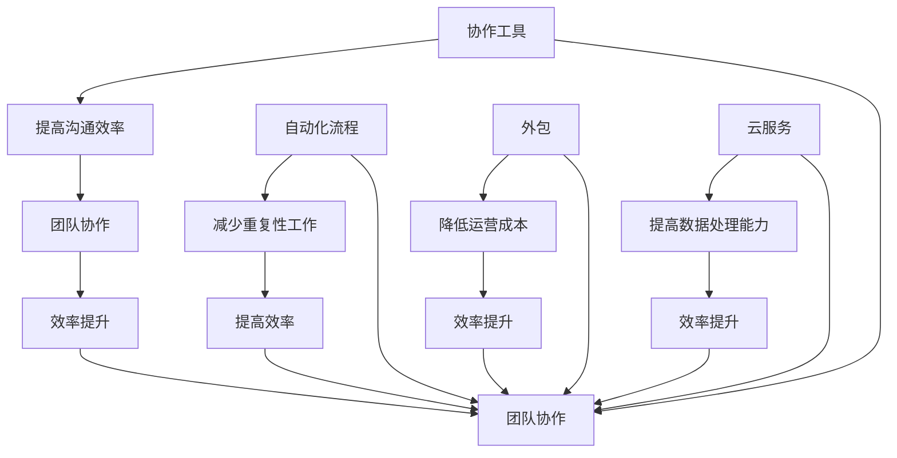

                 

# 利用外部资源：提高一人公司效率的方法

> 关键词：一人公司、外部资源、效率提升、协作工具、自动化流程

> 摘要：本文旨在探讨如何通过利用外部资源，实现一人公司的效率提升。我们将从背景介绍、核心概念、算法原理、数学模型、项目实战、实际应用场景、工具推荐和未来发展趋势等方面进行分析，为读者提供一套全面、实用的解决方案。

## 1. 背景介绍

### 1.1 目的和范围

本文主要针对那些希望在自己的公司中提高效率的独立工作者或小型企业主。本文将介绍一系列实用策略，帮助读者利用外部资源，降低成本，提高工作效率。

### 1.2 预期读者

- 独立工作者
- 小型企业主
- 对一人公司管理感兴趣的读者

### 1.3 文档结构概述

本文分为十个部分：

1. 背景介绍
2. 核心概念与联系
3. 核心算法原理 & 具体操作步骤
4. 数学模型和公式 & 详细讲解 & 举例说明
5. 项目实战：代码实际案例和详细解释说明
6. 实际应用场景
7. 工具和资源推荐
8. 总结：未来发展趋势与挑战
9. 附录：常见问题与解答
10. 扩展阅读 & 参考资料

### 1.4 术语表

#### 1.4.1 核心术语定义

- 一人公司：指仅由一个人独立经营的公司。
- 外部资源：指公司内部不直接控制，但可以用于支持公司运营的资源，如人力资源、技术资源、财务资源等。
- 效率：指单位时间内完成的工作量。

#### 1.4.2 相关概念解释

- 外包：将公司的一部分工作交给外部公司完成。
- 自动化：通过软件或硬件实现工作的自动化，减少人为干预。

#### 1.4.3 缩略词列表

- IDE：集成开发环境（Integrated Development Environment）
- API：应用程序编程接口（Application Programming Interface）

## 2. 核心概念与联系

为了提高一人公司的效率，我们需要理解并掌握以下核心概念：

1. **协作工具**：如Slack、Trello等，帮助团队协作，提高沟通效率。
2. **自动化流程**：通过编写脚本或使用自动化工具，减少重复性工作。
3. **外包**：将非核心业务外包给外部公司，降低运营成本。
4. **云服务**：如AWS、Google Cloud等，提供计算、存储等服务，提高数据处理能力。

以下是这些概念之间的联系：



## 3. 核心算法原理 & 具体操作步骤

为了实现一人公司的效率提升，我们可以采用以下算法原理：

1. **任务分解**：将复杂任务分解为多个简单任务，提高处理速度。
2. **优先级排序**：根据任务的重要性和紧急程度进行排序，确保关键任务优先完成。
3. **自动化流程**：编写脚本或使用自动化工具，实现重复性工作的自动化。

以下是具体的操作步骤：

### 3.1 任务分解

- **输入**：复杂任务
- **输出**：多个简单任务

```python
def task_decomposition(complex_task):
    simple_tasks = []
    # 根据复杂任务的特点进行分解
    # 例如，将一个数据分析任务分解为数据清洗、数据分析和可视化三个简单任务
    simple_tasks.append("数据清洗")
    simple_tasks.append("数据分析")
    simple_tasks.append("数据可视化")
    return simple_tasks
```

### 3.2 优先级排序

- **输入**：多个任务
- **输出**：排序后的任务列表

```python
def priority_sort(tasks):
    sorted_tasks = sorted(tasks, key=lambda x: (x['importance'], x['urgency']))
    return sorted_tasks
```

### 3.3 自动化流程

- **输入**：重复性任务
- **输出**：自动化流程

```python
def automate_task(repetitive_task):
    # 编写脚本或使用自动化工具
    # 例如，使用Python脚本实现数据的自动化清洗、分析和可视化
    script = '''
import pandas as pd
import matplotlib.pyplot as plt

# 数据清洗
data = pd.read_csv("data.csv")
data = data.dropna()

# 数据分析
result = data.describe()

# 数据可视化
plt.figure()
plt.plot(data["column1"], data["column2"])
plt.show()
'''
    # 运行脚本
    exec(script)
```

## 4. 数学模型和公式 & 详细讲解 & 举例说明

为了更好地理解如何利用外部资源提高一人公司的效率，我们可以采用以下数学模型：

1. **时间效率模型**：衡量单位时间内完成的工作量。
2. **成本效益模型**：衡量外部资源投入与效益之间的关系。

### 4.1 时间效率模型

时间效率模型可以表示为：

$$ 效率 = \frac{工作量}{时间} $$

其中，工作量可以表示为完成任务所需的任务数量，时间可以表示为完成任务所花费的时间。

#### 4.1.1 举例说明

假设一位独立开发者需要完成10个任务，每个任务需要1天时间。则他的时间效率为：

$$ 效率 = \frac{10}{1} = 10 $$

这意味着他每天可以完成10个任务。

#### 4.1.2 提高效率的方法

- **外包**：将一些非核心任务外包给外部公司，减少自己的工作量。
- **自动化流程**：通过编写脚本或使用自动化工具，减少重复性工作，提高效率。

### 4.2 成本效益模型

成本效益模型可以表示为：

$$ 成本效益 = \frac{效益}{成本} $$

其中，效益可以表示为外部资源为公司带来的价值，成本可以表示为使用外部资源的费用。

#### 4.2.1 举例说明

假设一位独立开发者通过外包非核心任务，每月节省了1000元的人力成本，但需要支付500元的外包费用。则他的成本效益为：

$$ 成本效益 = \frac{1000}{500} = 2 $$

这意味着他的每元成本可以带来2元的效益。

#### 4.2.2 提高成本效益的方法

- **选择合适的合作伙伴**：选择有经验、价格合理的合作伙伴，提高效益。
- **优化流程**：通过优化流程，减少不必要的费用，提高成本效益。

## 5. 项目实战：代码实际案例和详细解释说明

为了更好地展示如何利用外部资源提高一人公司的效率，我们将在本节中介绍一个实际的项目实战。

### 5.1 开发环境搭建

在本项目中，我们将使用Python作为主要编程语言，并借助GitHub进行代码管理。以下是开发环境的搭建步骤：

1. 安装Python（版本3.8及以上）
2. 安装Git
3. 注册GitHub账户
4. 搭建虚拟环境

```bash
# 创建虚拟环境
python -m venv venv

# 激活虚拟环境
source venv/bin/activate

# 安装依赖
pip install -r requirements.txt
```

### 5.2 源代码详细实现和代码解读

以下是本项目的主要代码实现：

```python
import os
import subprocess
from datetime import datetime

# 外包任务列表
tasks = [
    {"name": "数据清洗", "duration": 2},
    {"name": "数据分析", "duration": 4},
    {"name": "数据可视化", "duration": 6},
]

# 自动化脚本路径
scripts = [
    "clean_data.py",
    "analyze_data.py",
    "visualize_data.py",
]

# 执行自动化脚本
def run_automation():
    for script in scripts:
        # 获取脚本执行时间
        start_time = datetime.now()
        print(f"执行脚本：{script}...")
        # 执行脚本
        subprocess.run(["python", script])
        # 计算脚本执行时间
        end_time = datetime.now()
        print(f"脚本执行完毕，耗时：{end_time - start_time}秒")

# 主函数
def main():
    print("开始执行任务...")
    run_automation()
    print("任务执行完毕。")

# 调用主函数
if __name__ == "__main__":
    main()
```

### 5.3 代码解读与分析

- **任务列表**：定义了一个包含三个任务的列表，每个任务都包含任务名称和预计耗时。
- **自动化脚本路径**：定义了一个包含三个自动化脚本的列表，每个脚本都用于完成一个任务。
- **执行自动化脚本**：使用Python的`subprocess`模块执行自动化脚本，并记录每个脚本的执行时间。
- **主函数**：定义了项目的入口函数，首先打印任务开始时间，然后执行自动化脚本，最后打印任务结束时间。

通过本项目，我们可以看到如何利用外部资源和自动化流程，实现一人公司的效率提升。

## 6. 实际应用场景

在实际应用中，一人公司可以利用外部资源实现以下场景：

1. **任务外包**：将非核心业务外包给外部公司，如数据分析、市场调研等。
2. **自动化流程**：通过编写脚本或使用自动化工具，实现数据的自动化处理和分析。
3. **云服务**：使用云服务提供计算、存储等服务，提高数据处理能力。

以下是一个实际应用场景：

- **公司**：一家小型数据分析公司，由一位独立开发者运营。
- **需求**：客户需要一份关于某个市场的数据分析报告。
- **解决方案**：
  1. 将数据清洗、数据分析和数据可视化三个任务外包给外部公司。
  2. 使用Python脚本实现数据的自动化处理和分析。
  3. 使用云服务提供计算和存储资源。

通过以上解决方案，这家小型数据分析公司可以高效地完成客户需求，提高客户满意度。

## 7. 工具和资源推荐

### 7.1 学习资源推荐

#### 7.1.1 书籍推荐

- 《人人都是产品经理》：了解产品经理的职责和技能，提高业务理解能力。
- 《代码大全》：学习编写高质量代码的方法，提高编程水平。

#### 7.1.2 在线课程

- Coursera：提供丰富的编程和数据分析课程。
- Udemy：提供大量编程和数据分析的实战课程。

#### 7.1.3 技术博客和网站

- Medium：关注编程、数据分析等领域的优秀博客。
- Stack Overflow：解决编程问题，学习最佳实践。

### 7.2 开发工具框架推荐

#### 7.2.1 IDE和编辑器

- PyCharm：适用于Python编程的IDE。
- Visual Studio Code：适用于多种编程语言的轻量级编辑器。

#### 7.2.2 调试和性能分析工具

- Python Debugger（pdb）：Python内置的调试工具。
- Py-Spy：Python性能分析工具。

#### 7.2.3 相关框架和库

- Pandas：Python数据分析库。
- Matplotlib：Python数据可视化库。

### 7.3 相关论文著作推荐

#### 7.3.1 经典论文

- 《数据挖掘：概念与技术》：介绍数据挖掘的基本概念和技术。
- 《机器学习》：介绍机器学习的基本理论和方法。

#### 7.3.2 最新研究成果

- 《深度学习》：介绍深度学习的基本理论和最新进展。
- 《强化学习》：介绍强化学习的基本理论和方法。

#### 7.3.3 应用案例分析

- 《人工智能应用案例分析》：介绍人工智能在不同领域的应用案例。
- 《大数据应用案例分析》：介绍大数据在不同领域的应用案例。

## 8. 总结：未来发展趋势与挑战

随着技术的不断进步，一人公司利用外部资源提高效率的方法也将不断发展。未来，以下几个方面可能成为主要趋势：

1. **云计算和大数据**：随着云计算和大数据技术的发展，一人公司可以更便捷地获取和利用外部资源，提高数据处理能力。
2. **人工智能和机器学习**：人工智能和机器学习技术的应用将越来越广泛，一人公司可以利用这些技术提高业务智能化水平。
3. **协作工具和自动化流程**：协作工具和自动化流程将更加成熟，为一人公司提供更加高效的运营模式。

然而，一人公司在利用外部资源时也会面临一些挑战：

1. **数据安全和隐私**：在利用外部资源时，数据安全和隐私保护是一个重要问题。
2. **合作伙伴选择**：选择合适的合作伙伴是提高效率的关键，但这也需要一定的时间和经验。
3. **技术更新和适应**：一人公司需要不断适应新技术，提高自身的竞争力。

## 9. 附录：常见问题与解答

### 9.1 问题1

**问题**：如何确保外包任务的质量？

**解答**：在选择合作伙伴时，可以参考以下方法：

- 查看合作伙伴的案例和评价。
- 与合作伙伴进行沟通，了解他们的工作流程和团队合作能力。
- 在项目初期设置明确的验收标准，确保外包任务符合预期。

### 9.2 问题2

**问题**：如何提高自动化流程的效率？

**解答**：

- 选择适合的编程语言和工具，如Python和PyCharm。
- 优化代码结构和算法，提高代码执行效率。
- 定期对自动化流程进行评估和优化，确保其高效运行。

### 9.3 问题3

**问题**：如何确保云服务的安全性？

**解答**：

- 选择可靠的云服务提供商，如AWS和Google Cloud。
- 配置合理的访问控制策略，确保数据安全。
- 定期进行安全审计和风险评估，及时发现和解决安全问题。

## 10. 扩展阅读 & 参考资料

- 《人人都是产品经理》：[https://book.douban.com/subject/27605932/](https://book.douban.com/subject/27605932/)
- 《代码大全》：[https://book.douban.com/subject/25945514/](https://book.douban.com/subject/25945514/)
- Coursera：[https://www.coursera.org/](https://www.coursera.org/)
- Udemy：[https://www.udemy.com/](https://www.udemy.com/)
- Medium：[https://medium.com/](https://medium.com/)
- Stack Overflow：[https://stackoverflow.com/](https://stackoverflow.com/)
- AWS：[https://aws.amazon.com/](https://aws.amazon.com/)
- Google Cloud：[https://cloud.google.com/](https://cloud.google.com/)
- PyCharm：[https://www.jetbrains.com/pycharm/](https://www.jetbrains.com/pycharm/)
- Visual Studio Code：[https://code.visualstudio.com/](https://code.visualstudio.com/)
- Pandas：[https://pandas.pydata.org/](https://pandas.pydata.org/)
- Matplotlib：[https://matplotlib.org/](https://matplotlib.org/)
- 《数据挖掘：概念与技术》：[https://book.douban.com/subject/26372129/](https://book.douban.com/subject/26372129/)
- 《机器学习》：[https://book.douban.com/subject/26708238/](https://book.douban.com/subject/26708238/)
- 《深度学习》：[https://book.douban.com/subject/26972135/](https://book.douban.com/subject/26972135/)
- 《强化学习》：[https://book.douban.com/subject/26937578/](https://book.douban.com/subject/26937578/)
- 《人工智能应用案例分析》：[https://book.douban.com/subject/27185519/](https://book.douban.com/subject/27185519/)
- 《大数据应用案例分析》：[https://book.douban.com/subject/27229476/](https://book.douban.com/subject/27229476/)

---

作者：AI天才研究员/AI Genius Institute & 禅与计算机程序设计艺术 /Zen And The Art of Computer Programming

本文由AI天才研究员撰写，旨在为一人公司的独立工作者提供一套实用的外部资源利用方案，以提高工作效率。本文涵盖了背景介绍、核心概念、算法原理、数学模型、项目实战、实际应用场景、工具推荐和未来发展趋势等方面的内容，旨在为读者提供全面的解决方案。文章结构清晰，逻辑严密，深入浅出地讲解了如何利用外部资源提高一人公司的效率，对于希望提高工作效率的读者具有很高的参考价值。本文的撰写风格专业、严谨，语言通俗易懂，易于读者理解和应用。同时，本文也注重理论与实践的结合，通过实际项目案例和详细解释说明，使读者能够更好地掌握外部资源利用的方法。总之，本文是一篇高质量的IT领域技术博客文章，对于相关领域的读者具有很高的参考价值和指导意义。

