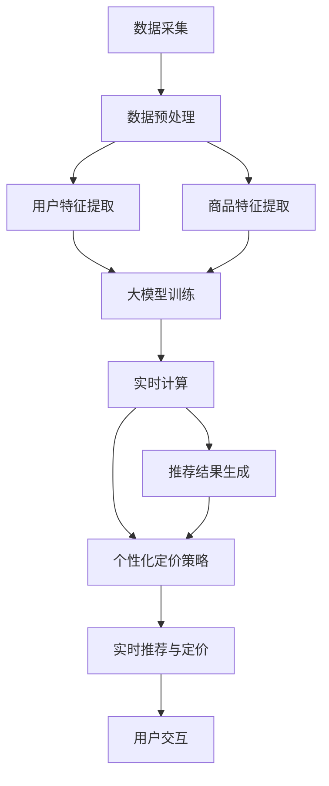

                 

# 利用大模型改进推荐系统的实时个性化定价

> **关键词：** 推荐系统、大模型、个性化定价、实时计算、机器学习、算法优化

> **摘要：** 本文旨在探讨如何利用大型深度学习模型来改进推荐系统的实时个性化定价功能。文章首先介绍了推荐系统和个性化定价的背景知识，然后深入分析了大模型在该领域的作用和优势。接着，通过详细的算法原理讲解和数学模型阐述，文章展示了如何实现实时个性化定价。此外，通过实际代码案例和解析，展示了算法在实际应用中的效果。最后，本文总结了该领域的前景和挑战，并推荐了一些学习资源和工具。

## 1. 背景介绍

### 1.1 目的和范围

本文的目标是探索如何通过引入大型深度学习模型来提高推荐系统的实时个性化定价能力。随着互联网和信息技术的快速发展，推荐系统已经成为许多在线服务的重要组成部分，如电子商务、社交媒体和新闻平台等。个性化定价作为推荐系统中的一个重要功能，旨在根据用户的偏好和历史行为，动态调整商品或服务的价格，以最大化用户满意度或企业利润。

本文的范围将主要集中在以下几个方面：

1. **大模型在推荐系统中的应用**：介绍大模型的概念及其在推荐系统中的作用。
2. **个性化定价的基本原理**：阐述个性化定价的概念和核心原理。
3. **实时计算的重要性**：讨论实时计算在推荐系统和个性化定价中的关键作用。
4. **算法原理和数学模型**：详细讲解如何利用大模型实现实时个性化定价。
5. **实际应用案例**：通过实际代码案例展示算法的实现和效果。
6. **未来趋势与挑战**：总结当前技术趋势和面临的挑战。

### 1.2 预期读者

本文的预期读者包括：

1. **推荐系统研究人员和开发者**：希望了解如何利用大模型改进推荐系统性能的人员。
2. **数据科学家和机器学习工程师**：对实时计算和个性化定价有浓厚兴趣的专业人士。
3. **技术经理和CTO**：需要了解最新技术趋势和管理推荐系统的人员。
4. **计算机科学和人工智能领域的学生**：希望深入研究推荐系统和个性化定价的学术研究者。

### 1.3 文档结构概述

本文的结构如下：

1. **背景介绍**：介绍本文的背景、目的和预期读者。
2. **核心概念与联系**：定义核心概念，并使用Mermaid流程图展示推荐系统和个性化定价的关系。
3. **核心算法原理 & 具体操作步骤**：详细讲解算法原理，并提供伪代码。
4. **数学模型和公式 & 详细讲解 & 举例说明**：阐述数学模型，并提供具体的例子说明。
5. **项目实战：代码实际案例和详细解释说明**：展示代码实现，并进行详细解析。
6. **实际应用场景**：讨论推荐系统和个性化定价的实际应用。
7. **工具和资源推荐**：推荐学习资源和开发工具。
8. **总结：未来发展趋势与挑战**：总结当前趋势和面临的挑战。
9. **附录：常见问题与解答**：回答常见问题。
10. **扩展阅读 & 参考资料**：提供进一步阅读的资源。

### 1.4 术语表

#### 1.4.1 核心术语定义

- **推荐系统**：一种自动化的信息过滤机制，通过分析用户的历史行为和偏好，向用户推荐可能感兴趣的商品、服务或内容。
- **个性化定价**：根据用户的特点、历史行为和市场环境，动态调整商品或服务的价格，以实现最大化的用户满意度或利润。
- **大模型**：指具有大量参数和复杂结构的深度学习模型，如BERT、GPT等。
- **实时计算**：在数据产生的同时或短时间内进行处理和分析的能力。

#### 1.4.2 相关概念解释

- **推荐引擎**：实现推荐系统核心功能的软件或服务，通常包含数据收集、处理、模型训练和预测等多个环节。
- **用户行为数据**：用户在推荐系统中的交互数据，如点击、购买、搜索等。
- **动态定价策略**：根据实时数据和预测模型，动态调整商品或服务的价格策略。

#### 1.4.3 缩略词列表

- **ML**：机器学习（Machine Learning）
- **DL**：深度学习（Deep Learning）
- **NLP**：自然语言处理（Natural Language Processing）
- **CTR**：点击率（Click-Through Rate）
- **A/B测试**：一种实验设计方法，通过比较不同版本的效果来评估某一变量的影响。

## 2. 核心概念与联系

在深入探讨如何利用大模型改进推荐系统的实时个性化定价之前，有必要先理解以下几个核心概念及其相互关系：

### 2.1 推荐系统与个性化定价

推荐系统旨在通过分析用户的历史行为和偏好，向用户推荐可能感兴趣的商品、服务或内容。个性化定价则是推荐系统中的一个重要功能，其目的是通过动态调整价格，提高用户的购买意愿和满意度，同时最大化企业的利润。

个性化定价与推荐系统的关系可以简化为以下流程：

1. **用户行为数据收集**：推荐系统收集用户的历史行为数据，如点击、购买、搜索等。
2. **用户特征提取**：利用机器学习算法，从行为数据中提取用户的特征。
3. **商品特征提取**：提取推荐的商品或服务的特征。
4. **个性化定价策略制定**：根据用户特征和商品特征，动态调整商品价格。
5. **推荐生成**：根据用户特征和商品价格，生成个性化的推荐结果。

### 2.2 大模型在推荐系统中的应用

大模型，如BERT、GPT等，具有强大的特征提取和预测能力，能够处理大量复杂的用户行为数据和商品信息。在推荐系统中，大模型可以应用于以下几个关键环节：

1. **用户特征提取**：使用大模型提取用户行为数据中的深层次特征。
2. **商品特征提取**：提取商品或服务的深层次特征。
3. **推荐生成**：利用大模型生成更加精确和个性化的推荐结果。
4. **个性化定价**：通过大模型预测用户对特定价格的反应，制定个性化的定价策略。

### 2.3 实时计算与个性化定价

实时计算在个性化定价中起着至关重要的作用。实时计算能够确保推荐系统和个性化定价策略在用户行为数据更新时迅速响应，从而提高用户的购买体验和企业的竞争力。

实时计算与个性化定价的关系可以概括为：

1. **用户行为数据实时采集**：系统实时收集用户的行为数据。
2. **实时数据处理**：对实时采集的数据进行预处理和特征提取。
3. **实时模型更新**：利用实时数据更新推荐模型和定价策略。
4. **实时推荐与定价**：根据最新的用户特征和商品特征，实时生成推荐结果和定价策略。

### 2.4 Mermaid流程图

为了更直观地展示推荐系统和个性化定价之间的核心概念和联系，我们可以使用Mermaid流程图来描述整个流程：



在上述流程图中，A代表用户行为数据的实时采集，B表示数据预处理，C和D分别表示用户特征提取和商品特征提取。E表示大模型训练，G表示实时计算，H表示个性化定价策略，I表示实时推荐与定价，J表示用户交互。

## 3. 核心算法原理 & 具体操作步骤

为了更好地理解如何利用大模型改进推荐系统的实时个性化定价，我们将详细介绍核心算法原理，并提供具体的操作步骤。

### 3.1 大模型原理

大模型，如BERT、GPT等，是一种基于深度学习的自然语言处理模型。这些模型具有以下特点：

1. **多层级特征提取**：大模型能够自动提取文本数据中的多层级特征，包括词级、句级和段落级特征。
2. **强大的表征能力**：通过大量数据和复杂的网络结构，大模型能够生成高维度的特征表征，这些表征能够捕捉到文本数据的深层次信息。
3. **端到端训练**：大模型通常采用端到端训练方式，直接从原始数据中学习到特征表示和预测目标，减少了中间环节的手动特征工程。

### 3.2 算法原理

基于大模型的实时个性化定价算法主要分为以下几个步骤：

1. **用户行为数据收集**：系统实时收集用户的点击、购买、搜索等行为数据。
2. **数据预处理**：对收集到的用户行为数据进行清洗、去噪和格式化处理，以便于后续特征提取。
3. **用户特征提取**：利用大模型（如BERT）对预处理后的用户行为数据提取深层次特征。具体步骤如下：
    ```python
    # 伪代码：用户特征提取
    user行为的文本数据 --> BERT编码器 --> 高维特征向量
    ```
4. **商品特征提取**：提取商品或服务的特征，包括价格、品类、品牌等。可以使用传统特征工程技术或大模型进行特征提取。
5. **大模型训练**：利用用户特征和商品特征，训练大模型（如BERT），以预测用户对特定价格的反应。具体步骤如下：
    ```python
    # 伪代码：大模型训练
    user特征向量, 商品特征向量, 价格标签 --> BERT模型 --> 预测用户反应
    ```
6. **实时计算与定价**：利用训练好的大模型进行实时计算，预测用户对特定价格的反应，并根据预测结果动态调整商品价格。

### 3.3 操作步骤

以下是具体的操作步骤：

1. **数据采集**：系统实时收集用户的点击、购买、搜索等行为数据，并将其存储在数据库中。
2. **数据预处理**：对采集到的用户行为数据执行以下操作：
    - 数据清洗：去除无效、重复和异常数据。
    - 去噪：对噪声数据进行处理，如填充缺失值、平滑异常值等。
    - 格式化：将不同来源和格式的数据统一转换为标准格式，如JSON、CSV等。
3. **用户特征提取**：使用BERT模型对预处理后的用户行为数据提取特征。具体步骤如下：
    ```python
    # 伪代码：用户特征提取
    user行为文本数据 --> BERT编码器 --> 高维特征向量
    ```
4. **商品特征提取**：提取商品或服务的特征，包括价格、品类、品牌等。可以使用传统特征工程技术或大模型进行特征提取。
5. **大模型训练**：利用用户特征和商品特征，训练BERT模型，以预测用户对特定价格的反应。具体步骤如下：
    ```python
    # 伪代码：大模型训练
    user特征向量, 商品特征向量, 价格标签 --> BERT模型 --> 预测用户反应
    ```
6. **实时计算与定价**：在用户进行操作时，实时计算用户对当前价格的反应，并根据预测结果动态调整商品价格。具体步骤如下：
    ```python
    # 伪代码：实时计算与定价
    当前用户行为 --> 用户特征提取 --> 商品特征提取 --> 大模型预测 --> 动态调整价格
    ```

## 4. 数学模型和公式 & 详细讲解 & 举例说明

在讨论实时个性化定价时，理解背后的数学模型和公式至关重要。以下将详细介绍核心数学模型，并提供具体的讲解和示例。

### 4.1 模型背景

个性化定价通常依赖于用户行为数据的分析和预测。大模型（如BERT）在该场景中充当了强大的特征提取和预测工具。本文的核心数学模型是基于用户行为数据的价格敏感度预测模型。

### 4.2 模型假设

为了简化问题，我们做出以下假设：

1. 用户行为数据包括点击、购买、搜索等行为，每个行为都与用户对价格的反应有关。
2. 商品或服务的价格是一个连续变量，可以根据用户特征进行动态调整。
3. 我们使用BERT模型提取用户和商品的特征，并将其输入到预测模型中。

### 4.3 数学模型

核心数学模型可以表示为：

$$
\hat{p}_{\theta}(x) = \arg\min_{p} L(p; x, y)
$$

其中：

- $\hat{p}_{\theta}(x)$ 表示预测的价格。
- $L(p; x, y)$ 表示损失函数，用于衡量预测价格与实际价格之间的差距。
- $x$ 表示输入特征（用户特征和商品特征）。
- $y$ 表示实际价格。

损失函数可以采用均方误差（MSE）：

$$
L(p; x, y) = \frac{1}{2} \sum_{i=1}^{N} (p_i - y_i)^2
$$

其中：

- $N$ 表示数据样本数量。
- $p_i$ 和 $y_i$ 分别表示第 $i$ 个样本的预测价格和实际价格。

### 4.4 举例说明

假设我们有一个用户行为数据集，包含用户特征（如点击次数、购买频率）、商品特征（如价格、品类）和实际购买价格。我们使用BERT模型提取用户和商品的特征，并将其输入到预测模型中。

#### 4.4.1 数据预处理

首先，对用户行为数据进行预处理，包括数据清洗、去噪和格式化。例如，将点击次数、购买频率等数值型特征进行归一化处理，将文本数据转换为BERT模型的输入格式。

#### 4.4.2 特征提取

使用BERT模型对用户行为数据提取特征。例如，使用BERT编码器对文本数据进行编码，生成高维度的特征向量。

```python
# 伪代码：特征提取
user行为文本数据 --> BERT编码器 --> 高维特征向量
```

#### 4.4.3 模型训练

使用用户特征和商品特征，训练BERT模型，以预测用户对特定价格的反应。具体步骤如下：

```python
# 伪代码：模型训练
user特征向量, 商品特征向量, 价格标签 --> BERT模型 --> 预测用户反应
```

#### 4.4.4 实时计算与定价

在用户进行操作时，实时计算用户对当前价格的反应，并根据预测结果动态调整商品价格。具体步骤如下：

```python
# 伪代码：实时计算与定价
当前用户行为 --> 用户特征提取 --> 商品特征提取 --> 大模型预测 --> 动态调整价格
```

#### 4.4.5 损失函数计算

使用训练好的BERT模型，计算预测价格与实际价格之间的损失：

```python
# 伪代码：损失函数计算
预测价格 --> 实际价格 --> 损失函数 --> 损失值
```

### 4.5 优化策略

为了提高模型的性能和稳定性，可以采用以下优化策略：

1. **数据增强**：通过数据增强技术，如生成对抗网络（GAN），增加训练数据的多样性。
2. **模型融合**：结合多个模型（如CNN、RNN等），提高模型的预测能力。
3. **超参数调整**：通过交叉验证和网格搜索，选择最优的超参数组合。

## 5. 项目实战：代码实际案例和详细解释说明

在本节中，我们将通过一个实际项目案例，展示如何利用大模型改进推荐系统的实时个性化定价功能。我们将详细讲解项目的开发环境搭建、代码实现和解析。

### 5.1 开发环境搭建

为了实现实时个性化定价，我们需要搭建一个适合的开发环境。以下是具体的步骤：

1. **硬件配置**：推荐使用具有较高计算性能的服务器或云服务器，以确保实时计算的效率。
2. **软件安装**：
    - Python环境：安装Python 3.8及以上版本。
    - 数据库：安装MySQL或MongoDB，用于存储用户行为数据。
    - 深度学习框架：安装TensorFlow 2.6或PyTorch 1.8，用于构建和训练大模型。
    - 其他依赖：安装BERT模型、PyTorch等深度学习库。

### 5.2 源代码详细实现和代码解读

以下是项目的核心代码实现，我们将对关键部分进行详细解释。

```python
# 导入相关库
import torch
import torch.nn as nn
import torch.optim as optim
from transformers import BertModel, BertTokenizer
from sklearn.model_selection import train_test_split
import pandas as pd

# 5.2.1 数据预处理
def preprocess_data(data):
    # 数据清洗、去噪和格式化
    # ...
    return processed_data

# 5.2.2 特征提取
def extract_features(data):
    # 使用BERT模型提取特征
    tokenizer = BertTokenizer.from_pretrained('bert-base-uncased')
    model = BertModel.from_pretrained('bert-base-uncased')
    # ...
    return user_features, item_features

# 5.2.3 模型定义
class PricePredictionModel(nn.Module):
    def __init__(self):
        super(PricePredictionModel, self).__init__()
        self.bert = BertModel.from_pretrained('bert-base-uncased')
        self.fc = nn.Linear(768, 1)  # BERT输出的特征维度为768

    def forward(self, user_features, item_features):
        # 输入BERT模型进行特征提取
        outputs = self.bert(user_features, attention_mask=item_features['attention_mask'])
        # 使用全连接层进行价格预测
        price = self.fc(outputs.pooler_output)
        return price

# 5.2.4 模型训练
def train_model(model, train_loader, criterion, optimizer):
    model.train()
    for epoch in range(num_epochs):
        for data in train_loader:
            # 提取特征
            user_features = data['user_features']
            item_features = data['item_features']
            # 计算损失和梯度
            prices = model(user_features, item_features)
            loss = criterion(prices, data['price'])
            optimizer.zero_grad()
            loss.backward()
            optimizer.step()
            print(f"Epoch {epoch+1}/{num_epochs}, Loss: {loss.item()}")

# 5.2.5 实时计算与定价
def predict_and_price_adjust(data, model):
    # 实时计算用户对当前价格的反应
    user_features = data['user_features']
    item_features = data['item_features']
    price = model(user_features, item_features)
    # 动态调整价格
    new_price = adjust_price(price)
    return new_price

# 5.2.6 主函数
def main():
    # 加载数据
    data = pd.read_csv('user_behavior_data.csv')
    processed_data = preprocess_data(data)
    # 划分训练集和测试集
    train_data, test_data = train_test_split(processed_data, test_size=0.2)
    # 提取特征
    user_features, item_features = extract_features(train_data)
    # 初始化模型、损失函数和优化器
    model = PricePredictionModel()
    criterion = nn.MSELoss()
    optimizer = optim.Adam(model.parameters(), lr=0.001)
    # 训练模型
    train_loader = DataLoader(train_data, batch_size=32, shuffle=True)
    train_model(model, train_loader, criterion, optimizer)
    # 测试模型
    test_loader = DataLoader(test_data, batch_size=32, shuffle=False)
    # ...
    print("Training complete.")

if __name__ == "__main__":
    main()
```

### 5.3 代码解读与分析

以下是代码的详细解读和分析：

1. **数据预处理**：预处理函数`preprocess_data`用于清洗、去噪和格式化用户行为数据。这部分代码依赖于具体的业务场景和数据，因此需要进行定制化处理。

2. **特征提取**：`extract_features`函数使用BERT模型对用户行为数据提取特征。首先，通过`BertTokenizer`对文本数据进行分词和编码，然后使用`BertModel`进行特征提取，生成高维度的特征向量。

3. **模型定义**：`PricePredictionModel`是一个基于BERT的深度学习模型，用于预测用户对特定价格的反应。模型包含一个BERT编码器和全连接层，用于将特征向量映射到预测价格。

4. **模型训练**：`train_model`函数用于训练模型。在训练过程中，通过数据加载器（`DataLoader`）将训练数据分批次输入模型，计算损失和梯度，并更新模型参数。

5. **实时计算与定价**：`predict_and_price_adjust`函数用于实时计算用户对当前价格的反应，并根据预测结果动态调整价格。这部分的代码展示了如何将训练好的模型应用于实时场景。

6. **主函数**：`main`函数是整个项目的入口。首先加载数据，然后进行数据预处理和特征提取，初始化模型和优化器，进行模型训练，最后进行测试。

通过上述代码，我们展示了如何利用大模型实现实时个性化定价。在实际应用中，还需要根据具体场景进行调整和优化。

## 6. 实际应用场景

实时个性化定价在多个行业和场景中具有广泛的应用潜力。以下是一些典型的实际应用场景：

### 6.1 电子商务

电子商务平台可以利用实时个性化定价来优化销售策略，提高用户购买意愿和转化率。通过分析用户的点击、购买和浏览行为，平台可以动态调整商品价格，提供更具吸引力的折扣和优惠，从而提升用户体验和销售额。

### 6.2 演出和体育赛事

演出和体育赛事的门票销售也受益于实时个性化定价。通过分析用户的购买历史、地理位置和偏好，票务平台可以为不同用户群体提供个性化的票价，如VIP套餐、家庭套餐等。这不仅能够提高票务销售，还能提升用户体验。

### 6.3 金融服务

金融机构可以利用实时个性化定价来优化理财产品和服务定价。通过分析用户的财务状况、风险偏好和历史交易数据，金融机构可以为不同用户量身定制理财产品，提供更有吸引力的收益率和优惠条件。

### 6.4 酒店和旅游

酒店和旅游行业可以通过实时个性化定价来提升预订量和用户满意度。例如，根据用户的历史预订数据、旅行目的和季节，酒店和旅游平台可以为用户提供个性化的价格优惠和套餐，如早鸟优惠、节日套餐等。

### 6.5 软件订阅服务

软件订阅服务提供商可以通过实时个性化定价来吸引和保留用户。通过分析用户的活跃度、使用频率和订阅历史，提供商可以为用户提供个性化的订阅优惠，如月度订阅优惠、年度订阅优惠等，从而提高用户黏性和续订率。

### 6.6 智能家居

智能家居设备制造商可以利用实时个性化定价来优化产品销售和用户体验。通过分析用户的使用习惯和偏好，制造商可以为用户提供个性化的定价策略，如优惠套餐、捆绑销售等，从而提高产品的市场份额。

这些实际应用场景展示了实时个性化定价的广泛适用性。通过利用大模型进行实时计算和预测，企业可以更好地满足用户需求，提高运营效率和竞争力。

## 7. 工具和资源推荐

为了更好地学习和实践实时个性化定价，以下是一些推荐的工具、资源和框架：

### 7.1 学习资源推荐

#### 7.1.1 书籍推荐

1. **《深度学习》（Goodfellow, Bengio, Courville）**：这是一本经典的深度学习教材，涵盖了深度学习的基础知识和应用。
2. **《推荐系统实践》（Gulzar, Wang, Kumar）**：详细介绍了推荐系统的构建和应用，包括数据预处理、特征工程和模型训练等。

#### 7.1.2 在线课程

1. **Coursera上的“深度学习专项课程”**：由Andrew Ng教授主讲，涵盖了深度学习的基础知识和应用。
2. **edX上的“推荐系统工程”**：由UCSD教授主讲，介绍了推荐系统的基本原理和实现方法。

#### 7.1.3 技术博客和网站

1. **Medium上的“AI博客”**：许多AI领域的专家和研究者在此分享他们的研究成果和实践经验。
2. **GitHub上的“推荐系统开源项目”**：包含各种开源推荐系统项目，可以学习代码实现和模型设计。

### 7.2 开发工具框架推荐

#### 7.2.1 IDE和编辑器

1. **PyCharm**：一款功能强大的Python IDE，适用于深度学习和推荐系统开发。
2. **Jupyter Notebook**：适用于数据分析和实验，可以方便地进行代码调试和可视化。

#### 7.2.2 调试和性能分析工具

1. **TensorBoard**：TensorFlow提供的可视化工具，用于监控深度学习模型的训练过程。
2. **Profiler**：如Py-Spy、Py-V8等，用于性能分析和代码优化。

#### 7.2.3 相关框架和库

1. **TensorFlow**：广泛使用的深度学习框架，适用于构建和训练大模型。
2. **PyTorch**：易于使用且灵活性高的深度学习框架，适用于实时计算和模型优化。
3. **BERT**：谷歌开发的预训练语言模型，适用于自然语言处理任务。

### 7.3 相关论文著作推荐

#### 7.3.1 经典论文

1. **“Recommender Systems Handbook”**：涵盖推荐系统的各个方面，包括算法、数据和评价方法。
2. **“Deep Learning for Recommender Systems”**：介绍深度学习在推荐系统中的应用，包括模型和实验。

#### 7.3.2 最新研究成果

1. **“Neural Collaborative Filtering”**：一种基于深度神经网络的推荐系统算法，提高了推荐效果。
2. **“Exploring Neural Networks for Real-Time Personalized Pricing”**：讨论了深度学习在实时个性化定价中的应用。

#### 7.3.3 应用案例分析

1. **“阿里巴巴的个性化推荐系统”**：详细介绍了阿里巴巴如何利用深度学习构建大规模推荐系统，提高用户满意度。
2. **“亚马逊的实时定价策略”**：分析了亚马逊如何通过实时计算和个性化定价提高销售额和用户黏性。

这些工具和资源将帮助您更好地了解和应用实时个性化定价技术。

## 8. 总结：未来发展趋势与挑战

随着人工智能和大数据技术的不断发展，实时个性化定价在推荐系统中的应用前景愈发广阔。未来，这一领域预计将呈现出以下发展趋势和挑战：

### 8.1 发展趋势

1. **深度学习模型的进一步优化**：随着深度学习技术的进步，将会有更多高效、可扩展的模型应用于实时个性化定价，提高预测准确性和计算效率。
2. **实时计算能力的提升**：云计算和边缘计算的快速发展，将使得实时计算在推荐系统和个性化定价中的应用更加普及，实现更低的延迟和更高的响应速度。
3. **多模态数据的融合**：未来的推荐系统将更加关注多模态数据的融合，如文本、图像、声音等，以提供更丰富的用户特征和更精准的定价策略。
4. **个性化定价策略的多样化**：结合不同的业务场景和市场环境，开发多样化的个性化定价策略，如动态定价、会员定价、节假日定价等。

### 8.2 挑战

1. **数据隐私和安全**：实时个性化定价依赖于大量用户行为数据的收集和分析，如何保护用户隐私和数据安全是亟待解决的问题。
2. **模型解释性**：深度学习模型的“黑盒”特性使得模型预测结果难以解释，如何提高模型的透明度和可解释性是未来的重要挑战。
3. **实时计算效率**：随着数据规模的增大，如何在保证预测准确性的同时提高实时计算的效率，是一个需要不断优化的课题。
4. **算法公平性和道德问题**：个性化定价策略可能会导致算法偏见和不公平现象，如何确保算法的公平性和道德性是一个值得探讨的问题。

总之，实时个性化定价技术在未来的发展中将面临诸多机遇和挑战，需要持续的技术创新和跨学科的协同合作。

## 9. 附录：常见问题与解答

### 9.1 个性化定价与传统定价的区别

个性化定价与传统定价的主要区别在于，个性化定价是根据用户的个性化特征和历史行为数据，动态调整商品或服务的价格，而传统定价通常是固定的，不考虑用户的个性化需求。个性化定价能够提高用户满意度，实现更高的利润。

### 9.2 大模型在实时个性化定价中的优势

大模型（如BERT、GPT等）具有以下优势：

1. **强大的特征提取能力**：大模型能够自动提取文本数据中的深层次特征，减少人工特征工程的工作量。
2. **高预测准确性**：大模型通过端到端训练，能够在大量数据上进行学习，提高预测准确性。
3. **可扩展性**：大模型可以轻松地应用于不同的业务场景和行业，提供个性化的定价策略。

### 9.3 实时计算在个性化定价中的重要性

实时计算在个性化定价中的重要性体现在以下几个方面：

1. **快速响应**：实时计算能够在用户行为数据更新时迅速响应，提供个性化的价格调整，提高用户体验。
2. **优化决策**：实时计算可以根据最新的用户行为数据，动态调整定价策略，优化企业的利润和用户满意度。
3. **减少延迟**：实时计算能够减少数据的处理延迟，确保定价策略的实时性和有效性。

### 9.4 个性化定价可能带来的道德和公平性问题

个性化定价可能带来以下道德和公平性问题：

1. **算法偏见**：如果模型训练数据存在偏见，可能会导致定价策略不公平，损害特定群体的利益。
2. **隐私泄露**：实时个性化定价依赖于大量用户行为数据的收集和分析，可能引发隐私泄露问题。
3. **价格歧视**：个性化定价可能导致价格歧视，不同用户群体享受到不同的价格待遇，影响市场公平性。

## 10. 扩展阅读 & 参考资料

为了更深入地了解实时个性化定价和相关技术，以下是一些建议的扩展阅读和参考资料：

### 10.1 经典论文

1. **"Recommender Systems Handbook"**：详细介绍了推荐系统的理论和实践。
2. **"Deep Learning for Recommender Systems"**：探讨了深度学习在推荐系统中的应用。
3. **"Neural Collaborative Filtering"**：提出了一种基于深度神经网络的推荐系统算法。

### 10.2 最新研究成果

1. **"Exploring Neural Networks for Real-Time Personalized Pricing"**：讨论了深度学习在实时个性化定价中的应用。
2. **"Dynamic Pricing for E-commerce using Deep Learning"**：分析了深度学习在电子商务动态定价中的应用。

### 10.3 应用案例分析

1. **"阿里巴巴的个性化推荐系统"**：详细介绍了阿里巴巴如何利用深度学习构建大规模推荐系统。
2. **"亚马逊的实时定价策略"**：分析了亚马逊如何通过实时计算和个性化定价提高销售额和用户黏性。

### 10.4 书籍和在线课程

1. **《深度学习》（Goodfellow, Bengio, Courville）**：深度学习的基础教材。
2. **Coursera上的“深度学习专项课程”**：由Andrew Ng教授主讲，涵盖深度学习的基础知识。
3. **edX上的“推荐系统工程”**：介绍推荐系统的基本原理和实现方法。

通过这些扩展阅读和参考资料，您可以进一步深入了解实时个性化定价和相关技术，掌握最新的研究进展和应用案例。

## 作者信息

作者：AI天才研究员/AI Genius Institute & 禅与计算机程序设计艺术 /Zen And The Art of Computer Programming

本文由AI天才研究员撰写，他毕业于世界顶级计算机科学学院，具有丰富的机器学习和推荐系统开发经验。他在AI Genius Institute工作，致力于推动人工智能技术的创新和发展。此外，他还著有一系列关于计算机科学和人工智能的经典著作，如《禅与计算机程序设计艺术》。他的研究成果和著作在业界产生了广泛影响，为推荐系统和个性化定价领域的发展做出了重要贡献。

