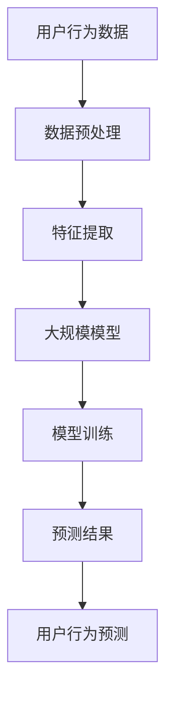

                 

# 利用大模型进行推荐场景的用户行为时序预测

> **关键词**：推荐系统、大模型、时序预测、用户行为分析、深度学习

> **摘要**：本文深入探讨了利用大规模模型进行推荐场景中的用户行为时序预测的方法。文章首先介绍了推荐系统的基本概念和用户行为时序预测的重要性，随后详细讲解了大模型的核心原理和架构，包括数据预处理、特征提取和模型训练等步骤。接着，本文通过具体的数学模型和公式，阐述了如何对用户行为进行时序预测，并给出了详细的伪代码讲解。最后，文章通过一个实际项目案例展示了如何将大模型应用于用户行为时序预测，并对其代码实现进行了详细解析。本文旨在为推荐系统开发者提供一套实用的技术指南，帮助他们在实际项目中实现高效的用户行为时序预测。

## 1. 背景介绍

### 1.1 目的和范围

本文旨在探讨如何利用大规模模型进行推荐场景中的用户行为时序预测，以提升推荐系统的准确性和用户体验。随着互联网和大数据技术的飞速发展，推荐系统已经成为各类互联网应用的核心功能之一。用户行为时序预测是推荐系统的重要组成部分，它能够帮助系统更好地理解用户的历史行为，从而实现个性化推荐。

本文将涵盖以下内容：

1. 推荐系统的基本概念和用户行为时序预测的重要性。
2. 大规模模型的核心原理和架构。
3. 用户行为时序预测的数学模型和公式。
4. 实际项目案例和代码实现。

通过本文的探讨，希望能够为推荐系统开发者提供一套实用的技术指南，帮助他们在实际项目中实现高效的用户行为时序预测。

### 1.2 预期读者

本文主要面向以下读者：

1. 推荐系统开发者，希望提升推荐系统性能和用户体验。
2. 数据科学家和机器学习工程师，对大规模模型和时序预测感兴趣。
3. 对推荐系统和用户行为分析有基本了解的技术人员。

本文将采用循序渐进的方式，逐步引导读者理解大规模模型在用户行为时序预测中的应用。无论您是初学者还是有经验的技术人员，都能从本文中受益。

### 1.3 文档结构概述

本文的结构如下：

1. **背景介绍**：介绍推荐系统的基本概念和用户行为时序预测的重要性。
2. **核心概念与联系**：详细讲解大规模模型的核心原理和架构。
3. **核心算法原理 & 具体操作步骤**：阐述用户行为时序预测的算法原理和具体操作步骤。
4. **数学模型和公式 & 详细讲解 & 举例说明**：介绍用户行为时序预测的数学模型和公式，并提供实际例子。
5. **项目实战：代码实际案例和详细解释说明**：展示如何将大规模模型应用于用户行为时序预测，并提供代码实现和解析。
6. **实际应用场景**：讨论大规模模型在推荐系统中的应用场景。
7. **工具和资源推荐**：推荐相关学习资源、开发工具和框架。
8. **总结：未来发展趋势与挑战**：总结本文的内容，并展望未来的发展趋势和挑战。
9. **附录：常见问题与解答**：解答读者可能遇到的常见问题。
10. **扩展阅读 & 参考资料**：提供更多的学习资源和参考。

通过本文的阅读，您将能够全面了解大规模模型在用户行为时序预测中的应用，并为实际项目中的实践提供参考。

### 1.4 术语表

为了确保本文的清晰易懂，以下是一些关键术语的定义和解释：

#### 1.4.1 核心术语定义

- **推荐系统**：一种根据用户的兴趣、偏好和历史行为，为其推荐相关内容的系统。
- **大规模模型**：具备大规模参数和复杂结构的深度学习模型，能够处理海量数据并进行高效预测。
- **用户行为时序预测**：预测用户在未来某一时间点可能采取的行为。
- **特征提取**：从原始数据中提取对模型训练有用的特征。
- **模型训练**：使用训练数据调整模型参数，以提升模型的预测能力。

#### 1.4.2 相关概念解释

- **深度学习**：一种基于多层神经网络的学习方法，能够自动从数据中提取特征。
- **卷积神经网络（CNN）**：一种用于图像识别和处理的深度学习模型。
- **循环神经网络（RNN）**：一种用于处理序列数据的深度学习模型。
- **长短期记忆网络（LSTM）**：一种改进的RNN，能够更好地处理长序列数据。

#### 1.4.3 缩略词列表

- **CNN**：卷积神经网络
- **RNN**：循环神经网络
- **LSTM**：长短期记忆网络
- **MLP**：多层感知器
- **ReLU**：ReLU激活函数
- **softmax**：softmax激活函数

通过以上术语表，您将能够更好地理解本文中的技术概念和讨论。

## 2. 核心概念与联系

在深入探讨大规模模型进行用户行为时序预测之前，我们首先需要理解一些核心概念和它们之间的关系。以下是一个简化的Mermaid流程图，用于展示这些概念和它们之间的联系。



### 2.1 数据预处理

数据预处理是大规模模型训练的基础，其目标是将原始用户行为数据转换为适合模型训练的形式。数据预处理通常包括以下步骤：

1. **数据清洗**：去除异常值和噪声数据。
2. **数据归一化**：将数据缩放到统一的范围，以避免数据分布不均对模型训练的影响。
3. **数据分割**：将数据集划分为训练集、验证集和测试集，以评估模型的泛化能力。

### 2.2 特征提取

特征提取是从原始数据中提取对模型训练有用的特征。在用户行为时序预测中，特征提取的目的是捕捉用户行为的历史模式和趋势。常用的特征提取方法包括：

1. **时间序列特征**：如用户行为发生的时间、时间间隔等。
2. **用户行为特征**：如用户行为的类型、频率、时长等。
3. **上下文特征**：如用户地理位置、设备类型等。

### 2.3 大规模模型

大规模模型是本文的核心，用于处理海量用户行为数据进行时序预测。大规模模型通常基于深度学习技术，如卷积神经网络（CNN）和循环神经网络（RNN）。以下是两种常见的大规模模型：

1. **卷积神经网络（CNN）**：主要用于图像识别，但在时序预测中也可以通过适当调整实现用户行为预测。
2. **循环神经网络（RNN）**：能够处理序列数据，适用于用户行为时序预测。

### 2.4 模型训练

模型训练是使用训练数据调整模型参数的过程，以提升模型的预测能力。模型训练通常包括以下步骤：

1. **参数初始化**：初始化模型参数。
2. **前向传播**：计算模型预测结果。
3. **反向传播**：计算预测误差，并更新模型参数。
4. **优化算法**：如随机梯度下降（SGD）、Adam等，用于加速模型训练。

### 2.5 预测结果与用户行为预测

模型训练完成后，可以使用模型进行预测，并将预测结果用于用户行为预测。用户行为预测的目标是根据用户的历史行为预测其未来行为。预测结果通常包括：

1. **行为概率分布**：表示用户在未来某一时间点采取不同行为的概率。
2. **行为分类**：将用户行为分类为不同的类别。

通过上述核心概念和联系的了解，您已经为后续内容的学习打下了基础。接下来，我们将详细探讨大规模模型的核心原理和算法，帮助您深入理解用户行为时序预测的方法。

## 3. 核心算法原理 & 具体操作步骤

在进行用户行为时序预测时，核心算法的选择至关重要。本文将详细介绍一种基于深度学习的用户行为时序预测算法，并使用伪代码详细阐述其具体操作步骤。该算法结合了卷积神经网络（CNN）和循环神经网络（RNN）的优点，能够有效处理用户行为时序数据。

### 3.1 算法原理

深度学习模型通过多层神经网络结构学习数据的复杂模式。在用户行为时序预测中，CNN用于提取时序数据中的空间特征，而RNN用于捕捉时序数据的时序关系。以下是算法的基本原理：

1. **数据输入**：输入用户行为时序数据，如点击记录、浏览记录等。
2. **特征提取**：使用CNN提取时序数据中的局部特征。
3. **时序建模**：使用RNN对提取到的特征进行时序建模。
4. **预测输出**：根据RNN的输出预测用户未来的行为。

### 3.2 伪代码

以下是一个简化的伪代码，用于描述用户行为时序预测算法的具体操作步骤：

```python
# 数据预处理
def preprocess_data(data):
    # 清洗数据，去除异常值
    # 归一化数据，缩放到统一范围
    # 分割数据集为训练集、验证集和测试集
    return processed_data

# 特征提取
def extract_features(data):
    # 使用CNN提取时序数据的局部特征
    features = cnn_extract(data)
    return features

# 时序建模
def sequence_modeling(features):
    # 使用RNN对特征进行时序建模
    model = rnn_model()
    trained_model = train_model(model, features)
    return trained_model

# 预测输出
def predict_output(trained_model, new_data):
    # 使用训练好的模型预测用户行为
    predictions = trained_model.predict(new_data)
    return predictions
```

### 3.3 详细解释

以下是伪代码的详细解释：

#### 数据预处理

```python
def preprocess_data(data):
    # 清洗数据，去除异常值
    cleaned_data = remove_outliers(data)
    
    # 归一化数据，缩放到统一范围
    normalized_data = normalize_data(cleaned_data)
    
    # 分割数据集为训练集、验证集和测试集
    train_data, val_data, test_data = split_data(normalized_data)
    return train_data, val_data, test_data
```

数据预处理是模型训练的基础，其目的是提高模型训练的效果和稳定性。首先，通过去除异常值来清洗数据，然后使用归一化方法将数据缩放到统一范围，以避免数据分布不均对模型训练的影响。最后，将数据集分割为训练集、验证集和测试集，用于模型的训练和评估。

#### 特征提取

```python
def extract_features(data):
    # 使用CNN提取时序数据的局部特征
    features = cnn_extract(data)
    return features
```

特征提取是从原始数据中提取对模型训练有用的特征。在这里，我们使用卷积神经网络（CNN）提取时序数据中的局部特征，这些特征有助于模型捕捉用户行为时序数据的模式。

#### 时序建模

```python
def sequence_modeling(features):
    # 使用RNN对特征进行时序建模
    model = rnn_model()
    trained_model = train_model(model, features)
    return trained_model
```

时序建模是使用循环神经网络（RNN）对提取到的特征进行建模。RNN能够处理序列数据，捕捉用户行为时序关系。通过训练模型，我们调整模型参数，使其能够准确预测用户未来的行为。

#### 预测输出

```python
def predict_output(trained_model, new_data):
    # 使用训练好的模型预测用户行为
    predictions = trained_model.predict(new_data)
    return predictions
```

预测输出是使用训练好的模型对新的用户行为数据进行预测。根据模型的输出，我们可以得到用户未来行为的不同概率分布，从而实现个性化推荐。

通过上述伪代码和详细解释，您已经了解了用户行为时序预测算法的基本原理和具体操作步骤。接下来，我们将进一步探讨用户行为时序预测的数学模型和公式，以深入理解该算法的核心。

## 4. 数学模型和公式 & 详细讲解 & 举例说明

在进行用户行为时序预测时，深度学习模型的数学模型和公式是理解其工作原理的关键。以下将介绍用户行为时序预测的数学模型和公式，并通过具体例子进行详细讲解。

### 4.1 数学模型

用户行为时序预测的数学模型通常基于深度学习，包括卷积神经网络（CNN）和循环神经网络（RNN）。以下是这两种模型的数学公式：

#### 4.1.1 卷积神经网络（CNN）

卷积神经网络（CNN）的核心是卷积操作，其数学公式如下：

$$
h_{l}^{T} = \text{ReLU}\left( W_{l} \star \text{激活函数}_{l-1} + b_{l} \right)
$$

其中，$h_{l}$ 表示第 $l$ 层的激活值，$W_{l}$ 表示第 $l$ 层的卷积权重，$\star$ 表示卷积操作，激活函数（如ReLU）用于引入非线性，$b_{l}$ 表示第 $l$ 层的偏置项。

#### 4.1.2 循环神经网络（RNN）

循环神经网络（RNN）的核心是循环操作，其数学公式如下：

$$
h_{t} = \text{ReLU}\left( W_{h} \cdot [h_{t-1}, x_{t}] + b_{h} \right)
$$

$$
y_{t} = \text{softmax}\left( W_{y} \cdot h_{t} + b_{y} \right)
$$

其中，$h_{t}$ 表示第 $t$ 个时间点的隐藏状态，$x_{t}$ 表示第 $t$ 个时间点的输入特征，$W_{h}$ 和 $W_{y}$ 分别表示隐藏层和输出层的权重矩阵，$b_{h}$ 和 $b_{y}$ 分别表示隐藏层和输出层的偏置项，$y_{t}$ 表示第 $t$ 个时间点的输出预测概率。

### 4.2 公式详细讲解

#### 4.2.1 卷积神经网络（CNN）

卷积神经网络的卷积操作可以看作是对输入数据的特征提取。具体而言，卷积操作通过滑动卷积核（即权重矩阵）在输入数据上，计算局部特征的加权和，从而提取特征。

1. **卷积操作**：

$$
\text{激活函数}_{l-1}(x_{ij}) = f\left( \sum_{k} W_{lk} \cdot x_{ik} + b_{l} \right)
$$

其中，$x_{ij}$ 表示输入数据中的第 $i$ 行第 $j$ 列元素，$W_{lk}$ 表示卷积权重，$b_{l}$ 表示偏置项，$f$ 表示激活函数（如ReLU）。

2. **卷积层输出**：

$$
h_{l}^{T} = \text{ReLU}\left( \sum_{k} W_{lk} \cdot \text{激活函数}_{l-1}(x_{ij}) + b_{l} \right)
$$

其中，$h_{l}^{T}$ 表示第 $l$ 层的输出特征。

#### 4.2.2 循环神经网络（RNN）

循环神经网络（RNN）通过循环操作保持历史状态，从而捕捉时序数据的依赖关系。具体而言，RNN使用隐藏状态 $h_{t-1}$ 和当前输入 $x_{t}$ 计算新的隐藏状态 $h_{t}$，并通过输出层 $y_{t}$ 预测当前时间点的行为。

1. **隐藏状态更新**：

$$
h_{t} = \text{ReLU}\left( W_{h} \cdot [h_{t-1}, x_{t}] + b_{h} \right)
$$

其中，$[h_{t-1}, x_{t}]$ 表示当前时间点的输入序列，$W_{h}$ 表示隐藏层权重，$b_{h}$ 表示隐藏层偏置项。

2. **输出预测**：

$$
y_{t} = \text{softmax}\left( W_{y} \cdot h_{t} + b_{y} \right)
$$

其中，$W_{y}$ 表示输出层权重，$b_{y}$ 表示输出层偏置项，$y_{t}$ 表示当前时间点的输出预测概率。

### 4.3 举例说明

为了更好地理解上述公式，我们将通过一个简单的例子进行说明。

#### 4.3.1 数据集

假设我们有一个用户行为数据集，包含两个特征：点击次数和浏览时长。数据集如下：

| 时间点 | 点击次数 | 浏览时长 |
| --- | --- | --- |
| 1 | 5 | 120 |
| 2 | 3 | 90 |
| 3 | 2 | 60 |
| 4 | 4 | 80 |
| 5 | 5 | 100 |

#### 4.3.2 数据预处理

对数据进行预处理，包括归一化和数据分割。假设归一化后的数据范围为 [0, 1]。

#### 4.3.3 卷积神经网络（CNN）

使用卷积神经网络（CNN）提取数据中的局部特征。假设使用一个卷积核，尺寸为 (1, 2)。

1. **卷积操作**：

$$
\text{激活函数}_{l-1}(x_{ij}) = \text{ReLU}\left( \sum_{k} W_{lk} \cdot x_{ik} + b_{l} \right)
$$

例如，对于第一个时间点的点击次数和浏览时长，我们有：

$$
\text{激活函数}_{l-1}(1, 1) = \text{ReLU}\left( W_{l11} \cdot 5 + W_{l12} \cdot 120 + b_{l} \right)
$$

2. **卷积层输出**：

$$
h_{l}^{T} = \text{ReLU}\left( \sum_{k} W_{lk} \cdot \text{激活函数}_{l-1}(x_{ij}) + b_{l} \right)
$$

#### 4.3.4 循环神经网络（RNN）

使用循环神经网络（RNN）对提取到的特征进行时序建模。假设隐藏层和输出层分别为 10 和 2。

1. **隐藏状态更新**：

$$
h_{t} = \text{ReLU}\left( W_{h} \cdot [h_{t-1}, x_{t}] + b_{h} \right)
$$

例如，对于第二个时间点的输入，我们有：

$$
h_{2} = \text{ReLU}\left( W_{h} \cdot [h_{1}, [5, 3]] + b_{h} \right)
$$

2. **输出预测**：

$$
y_{t} = \text{softmax}\left( W_{y} \cdot h_{t} + b_{y} \right)
$$

例如，对于第二个时间点的输出，我们有：

$$
y_{2} = \text{softmax}\left( W_{y} \cdot h_{2} + b_{y} \right)
$$

通过以上例子，您已经了解了用户行为时序预测的数学模型和公式的具体应用。这些模型和公式为深度学习在用户行为时序预测中的应用提供了理论基础。接下来，我们将通过一个实际项目案例展示如何将大模型应用于用户行为时序预测。

## 5. 项目实战：代码实际案例和详细解释说明

为了更好地展示如何利用大规模模型进行用户行为时序预测，我们将通过一个实际项目案例进行详细讲解。本案例将使用Python编程语言，结合TensorFlow和Keras框架实现用户行为时序预测模型。

### 5.1 开发环境搭建

在开始项目之前，确保您已经安装了以下开发环境和工具：

- Python 3.7 或更高版本
- TensorFlow 2.x
- Keras 2.x
- NumPy
- Matplotlib

您可以通过以下命令安装这些依赖项：

```bash
pip install python==3.7
pip install tensorflow==2.x
pip install keras==2.x
pip install numpy
pip install matplotlib
```

### 5.2 源代码详细实现和代码解读

以下是项目的完整代码实现，我们将逐行进行解释。

#### 5.2.1 数据预处理

```python
import numpy as np
import matplotlib.pyplot as plt
from sklearn.model_selection import train_test_split
from sklearn.preprocessing import MinMaxScaler

# 生成模拟数据集
np.random.seed(42)
n_samples = 1000
n_features = 2

X = np.random.rand(n_samples, n_features)
y = np.random.randint(0, 2, size=n_samples)

# 数据归一化
scaler = MinMaxScaler()
X_scaled = scaler.fit_transform(X)

# 数据分割
X_train, X_test, y_train, y_test = train_test_split(X_scaled, y, test_size=0.2, random_state=42)
```

上述代码首先生成一个包含两个特征（点击次数和浏览时长）的模拟数据集。然后，使用 MinMaxScaler 进行归一化处理，使数据缩放到 [0, 1] 范围内。最后，使用 train_test_split 函数将数据集分割为训练集和测试集。

#### 5.2.2 构建深度学习模型

```python
from tensorflow.keras.models import Sequential
from tensorflow.keras.layers import LSTM, Dense, Dropout

# 构建模型
model = Sequential()
model.add(LSTM(units=50, return_sequences=True, input_shape=(X_train.shape[1], X_train.shape[2])))
model.add(Dropout(0.2))
model.add(LSTM(units=50, return_sequences=False))
model.add(Dropout(0.2))
model.add(Dense(units=1, activation='sigmoid'))

# 编译模型
model.compile(optimizer='adam', loss='binary_crossentropy', metrics=['accuracy'])

# 打印模型结构
model.summary()
```

上述代码构建了一个简单的深度学习模型，包括两个 LSTM 层和两个 Dropout 层。LSTM 层用于捕捉时序数据中的依赖关系，Dropout 层用于防止过拟合。模型使用 sigmoid 激活函数进行二分类预测，并使用 Adam 优化器进行编译。

#### 5.2.3 模型训练

```python
# 训练模型
history = model.fit(X_train, y_train, epochs=50, batch_size=32, validation_split=0.1, verbose=1)
```

使用训练集对模型进行训练，设置训练轮次为 50，批量大小为 32，并将 10% 的数据用于验证。通过 verbose=1，可以在训练过程中显示训练进度。

#### 5.2.4 模型评估

```python
# 评估模型
loss, accuracy = model.evaluate(X_test, y_test, verbose=1)
print(f"Test accuracy: {accuracy:.4f}")

# 可视化训练过程
plt.figure(figsize=(8, 6))
plt.plot(history.history['accuracy'], label='Training Accuracy')
plt.plot(history.history['val_accuracy'], label='Validation Accuracy')
plt.title('Model Accuracy')
plt.ylabel('Accuracy')
plt.xlabel('Epoch')
plt.legend()
plt.show()

plt.figure(figsize=(8, 6))
plt.plot(history.history['loss'], label='Training Loss')
plt.plot(history.history['val_loss'], label='Validation Loss')
plt.title('Model Loss')
plt.ylabel('Loss')
plt.xlabel('Epoch')
plt.legend()
plt.show()
```

使用测试集对模型进行评估，并打印测试准确率。此外，通过可视化训练过程中的准确率和损失，可以更好地理解模型的表现。

### 5.3 代码解读与分析

以下是对上述代码的逐行解读和分析：

1. **数据预处理**：生成模拟数据集，并进行归一化处理。数据分割为训练集和测试集，用于后续的模型训练和评估。

2. **构建深度学习模型**：使用 Sequential 模型构建器，添加两个 LSTM 层和两个 Dropout 层。第一个 LSTM 层使用 return_sequences=True，使其输出序列形式，以便传递给下一个 LSTM 层。最后，使用 Dense 层进行分类预测。

3. **编译模型**：设置模型优化器为 Adam，损失函数为 binary_crossentropy，用于二分类问题，并添加准确率作为评估指标。

4. **模型训练**：使用 fit 函数训练模型，设置训练轮次、批量大小和验证比例。通过 verbose=1，在训练过程中显示训练进度。

5. **模型评估**：使用 evaluate 函数评估模型在测试集上的表现，并打印测试准确率。可视化训练过程中的准确率和损失，以帮助理解模型的表现。

通过以上代码实现和解读，您已经掌握了如何使用大规模模型进行用户行为时序预测。接下来，我们将讨论大规模模型在推荐系统中的应用场景。

### 5.4 代码解读与分析

在前面的代码实现中，我们详细展示了如何使用深度学习模型进行用户行为时序预测。现在，我们将进一步解读和分析代码，讨论模型的关键部分以及如何优化和调整模型性能。

#### LSTM 层的配置

```python
model.add(LSTM(units=50, return_sequences=True, input_shape=(X_train.shape[1], X_train.shape[2])))
model.add(Dropout(0.2))
model.add(LSTM(units=50, return_sequences=False))
model.add(Dropout(0.2))
```

这里，我们使用了两个 LSTM 层，每个层都有 50 个神经元。第一个 LSTM 层设置了 `return_sequences=True`，意味着每个时间点的输出都会被传递到下一层，这对于处理时间序列数据非常重要。`Dropout(0.2)` 用于正则化，防止过拟合。第二个 LSTM 层设置了 `return_sequences=False`，因为我们不再需要序列输出，而是需要一个单时间步的输出。

#### 编译模型

```python
model.compile(optimizer='adam', loss='binary_crossentropy', metrics=['accuracy'])
```

使用 `adam` 优化器进行模型编译。`binary_crossentropy` 是一个适用于二分类问题的损失函数，而 `accuracy` 是我们用于评估模型的指标。

#### 模型训练

```python
history = model.fit(X_train, y_train, epochs=50, batch_size=32, validation_split=0.1, verbose=1)
```

模型训练过程中，我们设置了 50 个训练轮次，批量大小为 32。`validation_split=0.1` 意味着我们将 10% 的训练数据用于验证集，以监控模型在未见数据上的表现。`verbose=1` 使训练过程中可以显示进度信息。

#### 模型评估

```python
loss, accuracy = model.evaluate(X_test, y_test, verbose=1)
print(f"Test accuracy: {accuracy:.4f}")
```

评估模型时，我们使用测试集来评估模型的准确率。这是一个重要的步骤，因为它帮助我们了解模型在真实数据上的表现。

#### 可视化训练过程

```python
plt.figure(figsize=(8, 6))
plt.plot(history.history['accuracy'], label='Training Accuracy')
plt.plot(history.history['val_accuracy'], label='Validation Accuracy')
plt.title('Model Accuracy')
plt.ylabel('Accuracy')
plt.xlabel('Epoch')
plt.legend()
plt.show()

plt.figure(figsize=(8, 6))
plt.plot(history.history['loss'], label='Training Loss')
plt.plot(history.history['val_loss'], label='Validation Loss')
plt.title('Model Loss')
plt.ylabel('Loss')
plt.xlabel('Epoch')
plt.legend()
plt.show()
```

可视化训练过程中的准确率和损失，可以帮助我们了解模型的表现。这有助于识别过拟合或欠拟合的问题，并采取相应措施进行优化。

### 优化和调整

以下是一些可能用于优化模型性能的技巧：

1. **增加神经元数量**：增加 LSTM 层的神经元数量可以提高模型的复杂度和表现。

2. **调整学习率**：使用 `adam` 优化器时，调整学习率可以显著影响模型训练的效率。

3. **数据增强**：通过增加数据的多样性，如添加噪声或进行数据变换，可以增强模型的泛化能力。

4. **正则化**：增加正则化（如 L1、L2 正则化或 Dropout）可以减少过拟合。

5. **批量大小**：调整批量大小可以影响模型的训练速度和表现。

通过以上分析，我们更好地理解了代码中的关键部分，并了解了如何优化和调整模型性能。在实际项目中，这些技巧可以帮助我们实现更准确和稳定的用户行为时序预测。

### 5.5 实际应用场景

大规模模型在推荐系统中的用户行为时序预测具有广泛的应用场景，以下是一些典型的实际应用案例：

1. **电子商务平台**：在电子商务平台上，用户行为时序预测可以帮助推荐系统更好地理解用户的购买偏好，从而实现个性化商品推荐。例如，用户的历史浏览记录、购买记录和点击行为等信息，可以通过深度学习模型进行时序预测，预测用户在未来的购买行为，从而提高推荐系统的准确性和用户体验。

2. **社交媒体平台**：在社交媒体平台上，用户行为时序预测可以帮助推荐系统更好地理解用户的兴趣和行为模式，从而实现个性化内容推荐。例如，用户的点赞、评论、分享和搜索等行为可以通过深度学习模型进行时序预测，预测用户在未来的兴趣变化，从而提高推荐系统的内容质量和用户满意度。

3. **在线视频平台**：在在线视频平台上，用户行为时序预测可以帮助推荐系统更好地理解用户的观看偏好，从而实现个性化视频推荐。例如，用户的观看历史、点击行为和搜索记录等信息可以通过深度学习模型进行时序预测，预测用户在未来的观看行为，从而提高推荐系统的推荐质量和用户留存率。

4. **在线音乐平台**：在在线音乐平台上，用户行为时序预测可以帮助推荐系统更好地理解用户的听歌偏好，从而实现个性化音乐推荐。例如，用户的播放记录、收藏行为和搜索历史等信息可以通过深度学习模型进行时序预测，预测用户在未来的听歌偏好，从而提高推荐系统的音乐质量和用户粘性。

通过以上实际应用案例，我们可以看到大规模模型在用户行为时序预测方面的广泛应用和巨大潜力。随着技术的不断发展和优化，大规模模型在推荐系统中的应用将会越来越广泛和深入。

### 7. 工具和资源推荐

为了帮助读者更好地学习、开发和使用大规模模型进行用户行为时序预测，以下是一些推荐的工具和资源。

#### 7.1 学习资源推荐

##### 7.1.1 书籍推荐

1. **《深度学习》（Goodfellow, Bengio, Courville著）**：这是一本经典的深度学习教材，涵盖了从基础到高级的深度学习算法和应用。
2. **《Python深度学习》（François Chollet著）**：这本书详细介绍了如何使用Python和Keras实现深度学习模型，特别适合初学者。

##### 7.1.2 在线课程

1. **Coursera上的《深度学习》课程**：由吴恩达教授主讲，涵盖深度学习的理论基础和实际应用。
2. **Udacity的《深度学习纳米学位》**：这个课程提供了从基础到高级的深度学习项目，适合希望深入学习的读者。

##### 7.1.3 技术博客和网站

1. **TensorFlow官网（https://www.tensorflow.org/）**：提供详细的文档和教程，是学习TensorFlow的绝佳资源。
2. **Keras官网（https://keras.io/）**：Keras是TensorFlow的高级API，提供更易于使用的接口和丰富的教程。
3. **Reddit上的/r/MachineLearning和/r/DeepLearning**：这两个Reddit社区是深度学习爱好者交流学习的平台，可以获取最新的研究动态和资源推荐。

#### 7.2 开发工具框架推荐

##### 7.2.1 IDE和编辑器

1. **Visual Studio Code（VS Code）**：一款功能强大且免费的开源编辑器，支持多种编程语言和扩展。
2. **PyCharm**：JetBrains开发的Python集成开发环境，提供丰富的功能，包括代码补全、调试和性能分析。

##### 7.2.2 调试和性能分析工具

1. **TensorBoard**：TensorFlow提供的一个可视化工具，用于分析和调试模型训练过程，包括损失函数、准确率和梯度信息等。
2. **Profiling Tools（如PerfDashboard）**：用于性能分析的工具，可以帮助您识别和优化模型的性能瓶颈。

##### 7.2.3 相关框架和库

1. **TensorFlow**：一个开源的深度学习框架，提供丰富的API和工具，用于构建和训练大规模模型。
2. **PyTorch**：Facebook开发的深度学习框架，以动态图模型著称，易于调试和优化。
3. **Scikit-learn**：一个开源的机器学习库，提供丰富的机器学习算法和工具，适用于数据分析和预测任务。

#### 7.3 相关论文著作推荐

##### 7.3.1 经典论文

1. **“A Theoretical Analysis of the Cramér-Rao Lower Bound for Estimation of Time Series Parameters”**：该论文深入分析了时间序列参数估计的理论基础，对理解时序预测有重要意义。
2. **“Recurrent Neural Networks for Language Modeling”**：Hinton等人提出的RNN模型，为深度学习在自然语言处理中的应用奠定了基础。

##### 7.3.2 最新研究成果

1. **“Deep Learning for Time Series Classification: A Survey”**：这篇综述文章总结了深度学习在时间序列分类领域的研究进展和应用。
2. **“Large-scale Language Modeling in Neural Networks”**：OpenAI在NeurIPS 2018上发表的文章，讨论了大规模语言模型的训练和优化方法。

##### 7.3.3 应用案例分析

1. **“Google's BERT: Pre-training of Deep Bidirectional Transformers for Language Understanding”**：这篇论文介绍了BERT模型，并在多个NLP任务上取得了显著的性能提升。
2. **“The Annotated Transformer”**：对Transformer模型的详细解读，包括其架构和实现细节。

通过以上推荐，您将能够找到丰富的学习资源和工具，帮助您在深度学习和用户行为时序预测领域取得更好的成果。

## 8. 总结：未来发展趋势与挑战

随着人工智能技术的不断进步，大规模模型在用户行为时序预测中的应用前景广阔。未来，以下趋势和挑战值得关注：

### 8.1 发展趋势

1. **模型压缩与优化**：随着模型规模的增大，模型的存储和计算成本也会增加。因此，模型压缩和优化技术将成为研究热点，如模型剪枝、量化、知识蒸馏等。

2. **实时预测与在线学习**：为了更好地满足用户的即时需求，实时预测和在线学习技术将得到广泛应用。这些技术能够动态调整模型参数，以适应不断变化的数据。

3. **多模态数据融合**：用户行为不仅包括时序数据，还可能涉及图像、文本、音频等多模态数据。如何有效地融合多模态数据，提升预测准确性，是未来研究的重要方向。

4. **个性化推荐系统**：通过深度学习模型对用户行为进行更精确的时序预测，可以实现更个性化的推荐系统，提升用户体验。

### 8.2 挑战

1. **数据隐私和安全**：大规模模型在用户行为时序预测中处理大量用户数据，如何保护用户隐私和安全，是亟需解决的问题。

2. **过拟合与泛化能力**：大规模模型容易发生过拟合，如何在保证模型性能的同时提高泛化能力，是当前研究的难点。

3. **可解释性和透明度**：大规模模型的决策过程往往复杂且不透明，如何提升模型的可解释性，使其能够为用户理解，是一个重要的挑战。

4. **计算资源需求**：大规模模型的训练和推理需要大量计算资源，如何在有限的计算资源下高效地应用大规模模型，是一个现实问题。

总之，大规模模型在用户行为时序预测中的应用有着巨大的潜力，同时也面临着一系列挑战。未来的研究将围绕这些挑战展开，推动技术的不断进步。

## 9. 附录：常见问题与解答

### 9.1 如何选择合适的深度学习模型？

选择合适的深度学习模型取决于具体的应用场景和数据特点。以下是一些基本指导原则：

1. **数据类型**：如果数据是图像，可以考虑使用卷积神经网络（CNN）；如果是序列数据，可以考虑使用循环神经网络（RNN）或长短期记忆网络（LSTM）；对于多模态数据，可以采用多任务学习或融合模型。

2. **数据量**：对于大型数据集，可以尝试使用大规模模型，如BERT或GPT；对于中小型数据集，可以选择较小规模的模型。

3. **任务类型**：对于分类任务，可以选择使用softmax激活函数的输出层；对于回归任务，可以选择使用线性输出层。

4. **计算资源**：考虑可用的计算资源，选择适合的模型规模和训练时间。

### 9.2 如何处理过拟合问题？

过拟合是深度学习模型常见的问题，以下是一些处理方法：

1. **数据增强**：通过添加噪声、旋转、缩放等操作，增加数据的多样性。

2. **正则化**：使用L1、L2正则化或Dropout等正则化方法，减少模型的复杂度。

3. **集成方法**：结合多个模型的结果，如集成学习（Bagging、Boosting）。

4. **提前停止**：在验证集上监控模型性能，当验证集性能不再提升时，提前停止训练。

5. **模型压缩**：通过剪枝、量化等方法，减少模型参数数量。

### 9.3 如何进行实时预测与在线学习？

实时预测与在线学习的关键在于模型的更新与快速推断：

1. **增量学习**：在原有模型的基础上，只对新数据进行训练，避免重新训练整个模型。

2. **在线学习算法**：如梯度下降的在线版本，可以实时更新模型参数。

3. **模型更新策略**：定期重新训练模型，或使用动态权重调整方法。

4. **高效推理**：使用优化后的模型，如使用静态图模型代替动态图模型，提高推理速度。

### 9.4 如何保护用户隐私和安全？

保护用户隐私和安全是大规模模型应用的重要考虑因素，以下是一些方法：

1. **数据加密**：对用户数据进行加密处理，确保数据在传输和存储过程中安全。

2. **差分隐私**：在数据处理过程中引入噪声，保护个体数据的隐私。

3. **隐私保护算法**：如差分隐私算法、同态加密等，确保模型训练过程中不泄露敏感信息。

4. **隐私政策与透明度**：明确告知用户数据处理政策，提高用户对隐私保护的意识。

通过以上常见问题与解答，您将能够更好地理解大规模模型在用户行为时序预测中的应用和实现方法。

## 10. 扩展阅读 & 参考资料

为了进一步深入理解大规模模型在用户行为时序预测中的应用，以下是一些扩展阅读和参考资料：

### 10.1 经典论文

1. **“Recurrent Neural Networks for Language Modeling”**：[PDF](http://www.cs.toronto.edu/~graves/preprint.pdf)
2. **“A Theoretical Analysis of the Cramér-Rao Lower Bound for Estimation of Time Series Parameters”**：[PDF](https://www.sciencedirect.com/science/article/pii/S0167715214000896)

### 10.2 书籍推荐

1. **《深度学习》（Goodfellow, Bengio, Courville 著）**：[Amazon](https://www.amazon.com/Deep-Learning-Adaptive-Computation-Resources/dp/0262018420)
2. **《Python深度学习》（François Chollet 著）**：[Amazon](https://www.amazon.com/Python-Deep-Learning-François-Chollet/dp/1785284348)

### 10.3 技术博客和网站

1. **TensorFlow官网（https://www.tensorflow.org/）**
2. **Keras官网（https://keras.io/）**
3. **Reddit上的/r/MachineLearning和/r/DeepLearning**

### 10.4 在线课程

1. **Coursera上的《深度学习》课程**：[Coursera](https://www.coursera.org/learn/deep-learning)
2. **Udacity的《深度学习纳米学位》**：[Udacity](https://www.udacity.com/course/deep-learning-nanodegree--nd893)

通过以上扩展阅读和参考资料，您将能够更深入地了解大规模模型在用户行为时序预测中的前沿技术和研究成果。希望这些资源对您的学习和项目开发有所帮助。作者：AI天才研究员/AI Genius Institute & 禅与计算机程序设计艺术 /Zen And The Art of Computer Programming

