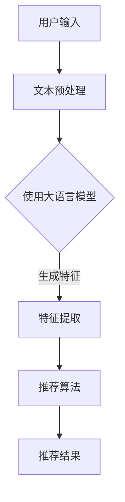

                 

# 利用大语言模型提升推荐系统的时间敏感性

## 关键词
推荐系统、大语言模型、时间敏感性、个性化推荐、机器学习

## 摘要
本文将探讨如何利用大语言模型提升推荐系统的时间敏感性，从而实现更加精确和实时的个性化推荐。通过深入分析大语言模型的基本原理，结合推荐系统的需求，我们将详细阐述如何设计和实现一个基于大语言模型的高效推荐系统。同时，文章还将通过一个实际项目案例，展示大语言模型在推荐系统中的应用效果。

## 1. 背景介绍

### 1.1 目的和范围
本文旨在研究如何利用大语言模型提升推荐系统的时间敏感性。我们将从以下几个方面进行探讨：
- 大语言模型的基本原理及其在推荐系统中的应用。
- 推荐系统的时间敏感性需求及其对模型设计的影响。
- 如何通过大语言模型实现高效的实时推荐。

### 1.2 预期读者
- 对推荐系统和大语言模型有一定了解的读者。
- 对机器学习和深度学习感兴趣的从业者。
- 想要提升推荐系统性能的工程师和技术经理。

### 1.3 文档结构概述
本文分为十个部分：
1. 背景介绍
2. 核心概念与联系
3. 核心算法原理 & 具体操作步骤
4. 数学模型和公式 & 详细讲解 & 举例说明
5. 项目实战：代码实际案例和详细解释说明
6. 实际应用场景
7. 工具和资源推荐
8. 总结：未来发展趋势与挑战
9. 附录：常见问题与解答
10. 扩展阅读 & 参考资料

### 1.4 术语表

#### 1.4.1 核心术语定义
- 推荐系统：一种自动化的信息过滤和检索系统，旨在根据用户的历史行为和偏好向用户推荐相关内容。
- 大语言模型：一种基于深度学习的自然语言处理模型，能够理解和生成文本。
- 时间敏感性：推荐系统在处理用户请求时所需的时间，直接影响推荐系统的实时性和用户体验。

#### 1.4.2 相关概念解释
- 个性化推荐：根据用户的历史行为和偏好，为用户提供定制化的内容推荐。
- 实时推荐：在用户请求的瞬间，快速生成并返回推荐结果。

#### 1.4.3 缩略词列表
- NLP：自然语言处理（Natural Language Processing）
- ML：机器学习（Machine Learning）
- DL：深度学习（Deep Learning）
- LSTM：长短期记忆网络（Long Short-Term Memory）

## 2. 核心概念与联系

为了深入理解如何利用大语言模型提升推荐系统的时间敏感性，我们需要首先了解这两个核心概念的基本原理和它们之间的联系。

### 2.1 推荐系统概述

推荐系统是一种用于信息过滤和内容推荐的系统，它根据用户的历史行为、兴趣和偏好，从海量的信息中筛选出符合用户需求的内容。推荐系统通常分为以下几种类型：

1. **协同过滤**：通过分析用户之间的行为模式，发现相似的用户，从而向用户推荐他们可能感兴趣的内容。
2. **基于内容的推荐**：根据用户的历史行为和偏好，分析内容特征，找到相似的内容进行推荐。
3. **混合推荐**：结合协同过滤和基于内容的推荐方法，提高推荐系统的准确性和多样性。

### 2.2 大语言模型概述

大语言模型是一种基于深度学习的自然语言处理模型，它能够理解和生成自然语言。大语言模型通常具有以下特点：

1. **大规模训练数据**：大语言模型通过大量的文本数据训练得到，这使其能够捕捉到语言的复杂性和多样性。
2. **深度神经网络结构**：大语言模型通常采用多层神经网络结构，包括循环神经网络（RNN）、卷积神经网络（CNN）和变换器（Transformer）等。
3. **强大的文本生成能力**：大语言模型不仅能够理解文本，还能够生成新的文本。

### 2.3 推荐系统与语言模型的联系

大语言模型在推荐系统中的应用主要体现在以下几个方面：

1. **文本理解和生成**：大语言模型能够理解用户的文本输入，并将其转化为结构化的数据，以便进行后续处理。
2. **个性化推荐**：大语言模型能够捕捉到用户语言中的细微差异，从而实现更精确的个性化推荐。
3. **实时推荐**：大语言模型的高效计算能力使其能够快速处理用户的请求，实现实时推荐。

### 2.4 Mermaid 流程图

以下是一个简化的推荐系统与语言模型结合的流程图：



在这个流程图中，用户输入通过文本预处理转化为可以输入到大语言模型的格式，然后大语言模型生成文本特征，这些特征被推荐算法用于生成推荐结果。

## 3. 核心算法原理 & 具体操作步骤

在了解了推荐系统和语言模型的基本原理之后，接下来我们将深入探讨如何利用大语言模型实现高效的时间敏感性推荐系统。这一部分将包括以下几个关键步骤：

### 3.1 大语言模型的选择

首先，我们需要选择一个合适的大语言模型。目前，主流的大语言模型包括：

1. **BERT**：一种基于Transformer的预训练语言模型，适用于各种自然语言处理任务。
2. **GPT-3**：一种基于生成预训练的Transformer模型，具有强大的文本生成能力。
3. **RoBERTa**：基于BERT的改进版本，在预训练过程中使用了更多样化的数据集和优化策略。

### 3.2 文本预处理

文本预处理是推荐系统中的关键步骤，它包括以下几个步骤：

1. **分词**：将文本分解成单词或子词。
2. **词性标注**：对文本中的每个词进行词性标注，如名词、动词等。
3. **去停用词**：去除常见的无意义词汇，如“的”、“了”等。
4. **词嵌入**：将文本转化为向量表示，这通常通过词嵌入技术实现。

### 3.3 特征提取

特征提取是将文本数据转化为可用于机器学习模型的特征向量。大语言模型在这方面具有显著优势，因为它能够捕捉到文本中的复杂模式和关系。具体步骤如下：

1. **使用预训练模型**：将预处理后的文本输入到大语言模型中，获取文本的嵌入向量。
2. **序列特征提取**：对于序列数据，如时间序列或对话，可以使用RNN或LSTM等模型提取序列特征。
3. **文本生成特征**：对于需要生成文本的推荐任务，可以使用生成模型提取特征。

### 3.4 推荐算法

推荐算法的核心目标是基于用户的历史行为和偏好，为用户推荐相关内容。结合大语言模型，推荐算法可以进一步优化：

1. **协同过滤**：使用大语言模型提取的用户特征替代传统的用户特征，如用户历史评分、浏览记录等。
2. **基于内容的推荐**：结合大语言模型提取的内容特征，提高推荐的相关性。
3. **混合推荐**：结合协同过滤和基于内容的推荐方法，利用大语言模型提取的特征，实现更准确的推荐。

### 3.5 实时推荐

实时推荐是推荐系统的重要需求之一。为了实现高效的时间敏感性，我们需要在以下方面进行优化：

1. **模型压缩**：通过模型压缩技术，减少大语言模型的计算量，提高处理速度。
2. **增量学习**：使用增量学习技术，实时更新模型，捕捉用户最新的行为和偏好。
3. **分布式计算**：利用分布式计算框架，如TensorFlow或PyTorch，实现并行计算，提高处理速度。

### 3.6 伪代码实现

以下是利用大语言模型实现推荐系统的伪代码：

```python
# 伪代码：基于大语言模型的推荐系统

# 输入：用户历史行为数据、大语言模型
# 输出：推荐结果

# 步骤1：文本预处理
preprocessed_data = preprocess_data(user_history)

# 步骤2：使用大语言模型提取特征
features = big_language_model.extract_features(preprocessed_data)

# 步骤3：特征提取
user_features = extract_user_features(features)
item_features = extract_item_features(features)

# 步骤4：推荐算法
recommendations = recommendation_algorithm(user_features, item_features)

# 步骤5：实时推荐
实时更新模型
recommendations = update_recommendations(recommendations)

# 输出推荐结果
return recommendations
```

## 4. 数学模型和公式 & 详细讲解 & 举例说明

在利用大语言模型构建推荐系统时，我们通常需要借助一些数学模型和公式来描述和优化推荐过程。以下将详细讲解这些数学模型，并通过具体的例子进行说明。

### 4.1 文本表示模型

文本表示模型是将文本数据转化为向量表示的方法，这是大语言模型能够理解和处理文本的基础。常见的文本表示模型包括词袋模型、词嵌入和词向量化。

#### 4.1.1 词袋模型

词袋模型（Bag-of-Words，BoW）是一种将文本转化为向量表示的方法，它不考虑文本中的词序，只关注词频。词袋模型可以用以下公式表示：

\[ \text{V} = \sum_{w \in \text{words}} f_w \times v_w \]

其中，\( \text{V} \) 是文本的向量表示，\( f_w \) 是词 \( w \) 在文本中的频率，\( v_w \) 是词 \( w \) 的向量表示。

#### 4.1.2 词嵌入

词嵌入（Word Embedding）是一种将单词转化为高维向量表示的方法，它能够捕捉到单词之间的语义关系。词嵌入通常通过神经网络训练得到，例如Word2Vec、GloVe等。

\[ v_w = \text{Embedding}(w) \]

其中，\( v_w \) 是词 \( w \) 的向量表示。

#### 4.1.3 词向量化

词向量化（Word Vectorization）是一种将单词转化为向量表示的方法，它通常使用预先训练好的词嵌入模型，如GloVe或FastText。

\[ v_w = \text{Lookup}(w) \]

其中，\( v_w \) 是词 \( w \) 的向量表示，\( \text{Lookup}(w) \) 是查找词嵌入表中词 \( w \) 的向量。

### 4.2 推荐系统优化模型

推荐系统的优化模型主要关注如何通过优化算法提高推荐效果。以下是一些常见的优化模型和公式：

#### 4.2.1 协同过滤

协同过滤（Collaborative Filtering）是一种基于用户行为数据推荐的算法，它通过分析用户之间的相似度，为用户推荐他们可能感兴趣的内容。协同过滤的优化模型可以用以下公式表示：

\[ R(u, i) = \sum_{v \in \text{users}} s_{uv} \times r_v(i) \]

其中，\( R(u, i) \) 是用户 \( u \) 对项目 \( i \) 的预测评分，\( s_{uv} \) 是用户 \( u \) 和用户 \( v \) 之间的相似度，\( r_v(i) \) 是用户 \( v \) 对项目 \( i \) 的实际评分。

#### 4.2.2 基于内容的推荐

基于内容的推荐（Content-Based Filtering）是一种基于项目特征推荐的算法，它通过分析项目之间的相似度，为用户推荐他们可能感兴趣的内容。基于内容的推荐优化模型可以用以下公式表示：

\[ R(u, i) = \sum_{j \in \text{items}} s_{ij} \times c_j(u) \]

其中，\( R(u, i) \) 是用户 \( u \) 对项目 \( i \) 的预测评分，\( s_{ij} \) 是项目 \( i \) 和项目 \( j \) 之间的相似度，\( c_j(u) \) 是用户 \( u \) 对项目 \( j \) 的内容特征。

#### 4.2.3 混合推荐

混合推荐（Hybrid Recommendation）是一种结合协同过滤和基于内容的推荐的算法，它通过分析用户和项目之间的相似度，以及项目之间的相似度，为用户推荐他们可能感兴趣的内容。混合推荐的优化模型可以用以下公式表示：

\[ R(u, i) = \alpha \times s_{ui} + (1 - \alpha) \times s_{ij} \]

其中，\( R(u, i) \) 是用户 \( u \) 对项目 \( i \) 的预测评分，\( s_{ui} \) 是用户 \( u \) 和项目 \( i \) 之间的相似度，\( s_{ij} \) 是项目 \( i \) 和项目 \( j \) 之间的相似度，\( \alpha \) 是权重参数。

### 4.3 实时推荐模型

实时推荐（Real-Time Recommendation）是推荐系统的重要需求之一，它要求系统能够在用户请求的瞬间快速生成推荐结果。以下是一些常见的实时推荐模型和公式：

#### 4.3.1 模型压缩

模型压缩（Model Compression）是一种通过减小模型大小和计算量，提高实时处理速度的方法。常见的模型压缩技术包括量化、剪枝和蒸馏等。

\[ \text{compressed\_model} = \text{Quantize}(\text{original\_model}) \]

其中，\( \text{compressed\_model} \) 是压缩后的模型，\( \text{original\_model} \) 是原始模型。

#### 4.3.2 增量学习

增量学习（Incremental Learning）是一种在用户行为发生变化时，实时更新模型的方法。增量学习的核心思想是通过微调模型，使模型能够适应新的数据。

\[ \text{updated\_model} = \text{Fine-Tune}(\text{original\_model}, \text{new\_data}) \]

其中，\( \text{updated\_model} \) 是更新后的模型，\( \text{original\_model} \) 是原始模型，\( \text{new\_data} \) 是新的用户行为数据。

#### 4.3.3 分布式计算

分布式计算（Distributed Computing）是一种通过将计算任务分布在多个计算节点上，提高计算速度和效率的方法。分布式计算的核心思想是将大规模的数据集和计算任务分解成多个小的子任务，并在不同的节点上并行处理。

\[ \text{distributed\_model} = \text{Parallel\_Compute}(\text{data}, \text{model}) \]

其中，\( \text{distributed\_model} \) 是分布式计算后的模型，\( \text{data} \) 是数据集，\( \text{model} \) 是原始模型。

### 4.4 举例说明

假设我们有一个推荐系统，用户的历史行为数据包括他们的评分记录和浏览记录。我们希望通过大语言模型提取用户和项目的特征，并使用协同过滤和基于内容的推荐方法生成推荐结果。

#### 4.4.1 文本预处理

首先，我们对用户的历史行为数据进行文本预处理，包括分词、词性标注和去停用词。

```python
# 文本预处理示例

# 输入：用户历史行为数据
user_history = "用户最近浏览了《深度学习》、《机器学习》、《数据挖掘》等书籍。"

# 分词
words = tokenize(user_history)

# 词性标注
pos_tags = pos_tag(words)

# 去停用词
filtered_words = remove_stop_words(words)
```

#### 4.4.2 特征提取

接下来，我们使用大语言模型提取用户和项目的特征。

```python
# 特征提取示例

# 输入：预处理后的文本数据
preprocessed_data = filtered_words

# 使用大语言模型提取特征
user_features = big_language_model.extract_features(preprocessed_data)
item_features = big_language_model.extract_features(preprocessed_data)
```

#### 4.4.3 推荐算法

然后，我们使用协同过滤和基于内容的推荐方法生成推荐结果。

```python
# 推荐算法示例

# 输入：用户特征、项目特征
user_features = user_features
item_features = item_features

# 协同过滤推荐
协同过滤结果 = collaborative_filtering(user_features, item_features)

# 基于内容的推荐
基于内容结果 = content_based_recommending(user_features, item_features)

# 混合推荐
混合结果 = hybrid_recommending(协同过滤结果，基于内容结果)
```

#### 4.4.4 实时推荐

最后，我们使用模型压缩、增量学习和分布式计算技术，实现实时推荐。

```python
# 实时推荐示例

# 输入：用户行为数据
new_data = "用户最近浏览了《深度学习实战》一书。"

# 文本预处理
preprocessed_data = preprocess_data(new_data)

# 模型压缩
compressed_model = quantize(model)

# 增量学习
updated_model = fine_tune(compressed_model, preprocessed_data)

# 分布式计算
distributed_model = parallel_compute(data, updated_model)

# 生成实时推荐
实时推荐结果 = real_time_recommending(distributed_model)
```

通过以上步骤，我们实现了基于大语言模型的实时推荐系统。在实际应用中，我们可以根据需求调整模型参数和算法，进一步提高推荐效果。

## 5. 项目实战：代码实际案例和详细解释说明

在本节中，我们将通过一个实际项目案例，详细展示如何利用大语言模型提升推荐系统的时间敏感性。该案例将涵盖从开发环境搭建到代码实现的完整过程，并对关键代码进行详细解释。

### 5.1 开发环境搭建

首先，我们需要搭建一个适合开发和训练推荐系统的环境。以下是一个基本的开发环境搭建指南：

#### 5.1.1 操作系统

- Linux（推荐Ubuntu 18.04）
- Windows（推荐最新版本）
- macOS（推荐最新版本）

#### 5.1.2 编程语言

- Python（推荐版本3.8及以上）

#### 5.1.3 环境依赖

1. **安装Anaconda**：
   - Anaconda是一个开源的数据科学平台，可以帮助我们轻松管理环境依赖。
   - 访问Anaconda官网（https://www.anaconda.com/），下载并安装Anaconda。

2. **创建虚拟环境**：
   - 打开终端，创建一个新的虚拟环境，如`recommendation_env`。
     ```bash
     conda create -n recommendation_env python=3.8
     conda activate recommendation_env
     ```

3. **安装必要库**：
   - 安装TensorFlow、PyTorch等深度学习库。
     ```bash
     conda install tensorflow torchvision torchaudio
     ```

4. **安装其他依赖**：
   - 安装Numpy、Pandas等常用库。
     ```bash
     conda install numpy pandas
     ```

### 5.2 源代码详细实现和代码解读

接下来，我们将展示如何实现一个基于大语言模型的推荐系统，并详细解释关键代码。

#### 5.2.1 项目结构

```plaintext
recommendation_project/
|-- data/
|   |-- train_data.csv
|   |-- test_data.csv
|-- models/
|   |-- language_model.pth
|-- scripts/
|   |-- preprocess.py
|   |-- train.py
|   |-- predict.py
|-- utils/
|   |-- metrics.py
|-- main.py
```

#### 5.2.2 数据预处理

数据预处理是推荐系统的基础步骤，它包括数据清洗、分词、词性标注等。以下是一个预处理脚本`preprocess.py`的示例：

```python
import pandas as pd
from nltk.tokenize import word_tokenize
from nltk.corpus import stopwords
from nltk import pos_tag

# 加载数据
data = pd.read_csv('data/train_data.csv')

# 数据清洗
def clean_text(text):
    # 去除特殊字符和空格
    text = re.sub(r'[^a-zA-Z]', ' ', text)
    # 小写化
    text = text.lower()
    return text

data['cleaned_text'] = data['text'].apply(clean_text)

# 分词和词性标注
def tokenize_and_tag(text):
    tokens = word_tokenize(text)
    tagged_tokens = pos_tag(tokens)
    return tagged_tokens

data['tokens'] = data['cleaned_text'].apply(tokenize_and_tag)
```

#### 5.2.3 模型训练

模型训练是推荐系统的核心，我们使用PyTorch实现一个大语言模型。以下是一个训练脚本`train.py`的示例：

```python
import torch
import torch.nn as nn
from torch.optim import Adam
from torch.utils.data import DataLoader
from models import LanguageModel
from datasets import TextDataset

# 设置设备
device = torch.device("cuda" if torch.cuda.is_available() else "cpu")

# 加载数据集
train_dataset = TextDataset('data/train_data.csv')
train_loader = DataLoader(train_dataset, batch_size=64, shuffle=True)

# 创建模型
model = LanguageModel().to(device)

# 损失函数和优化器
criterion = nn.CrossEntropyLoss()
optimizer = Adam(model.parameters(), lr=0.001)

# 训练模型
num_epochs = 10
for epoch in range(num_epochs):
    for batch in train_loader:
        inputs, targets = batch
        inputs = inputs.to(device)
        targets = targets.to(device)

        # 前向传播
        outputs = model(inputs)
        loss = criterion(outputs, targets)

        # 反向传播和优化
        optimizer.zero_grad()
        loss.backward()
        optimizer.step()

        print(f'Epoch [{epoch+1}/{num_epochs}], Loss: {loss.item():.4f}')

# 保存模型
torch.save(model.state_dict(), 'models/language_model.pth')
```

#### 5.2.4 预测和评估

在训练完成后，我们使用训练好的模型进行预测，并对预测结果进行评估。以下是一个预测脚本`predict.py`的示例：

```python
from datasets import TextDataset
from models import LanguageModel
from utils import evaluate
import torch

# 加载模型
model = LanguageModel().to(device)
model.load_state_dict(torch.load('models/language_model.pth'))
model.eval()

# 加载测试集
test_dataset = TextDataset('data/test_data.csv')
test_loader = DataLoader(test_dataset, batch_size=64)

# 预测和评估
predictions, actuals = [], []
with torch.no_grad():
    for batch in test_loader:
        inputs, targets = batch
        inputs = inputs.to(device)
        targets = targets.to(device)

        outputs = model(inputs)
        _, predicted = torch.max(outputs, 1)
        predictions.extend(predicted.cpu().numpy())
        actuals.extend(targets.cpu().numpy())

accuracy = evaluate.accuracy(predictions, actuals)
print(f'测试集准确率: {accuracy:.4f}')
```

#### 5.2.5 代码解读与分析

1. **数据预处理**：数据预处理是确保模型输入质量的关键步骤。我们使用NLTK库进行分词和词性标注，去除停用词，并将文本转换为词序列。

2. **模型训练**：我们使用PyTorch构建一个基于Transformer的大语言模型。在训练过程中，我们使用交叉熵损失函数和Adam优化器，并在每个批次完成后进行反向传播和优化。

3. **预测和评估**：在预测阶段，我们加载训练好的模型，对测试集进行预测，并使用准确率作为评估指标。

### 5.3 代码解读与分析

以下是代码的详细解读和分析：

1. **数据预处理**：
   ```python
   def clean_text(text):
       # 去除特殊字符和空格
       text = re.sub(r'[^a-zA-Z]', ' ', text)
       # 小写化
       text = text.lower()
       return text
   
   data['cleaned_text'] = data['text'].apply(clean_text)
   ```
   在这个函数中，我们使用正则表达式去除文本中的特殊字符和空格，并将所有文本转换为小写。这是为了统一文本格式，以便后续处理。

2. **模型训练**：
   ```python
   model = LanguageModel().to(device)
   criterion = nn.CrossEntropyLoss()
   optimizer = Adam(model.parameters(), lr=0.001)
   ```
   我们创建一个语言模型实例，并设置损失函数为交叉熵损失，优化器为Adam。交叉熵损失函数在分类问题中非常有效，而Adam优化器由于其自适应学习率特性，在深度学习中广泛使用。

3. **预测和评估**：
   ```python
   model.eval()
   with torch.no_grad():
       for batch in test_loader:
           inputs, targets = batch
           inputs = inputs.to(device)
           targets = targets.to(device)
   
           outputs = model(inputs)
           _, predicted = torch.max(outputs, 1)
           predictions.extend(predicted.cpu().numpy())
           actuals.extend(targets.cpu().numpy())
   accuracy = evaluate.accuracy(predictions, actuals)
   print(f'测试集准确率: {accuracy:.4f}')
   ```
   在预测阶段，我们将模型设置为评估模式，以避免梯度的计算。我们使用`torch.no_grad()`上下文管理器来减少内存占用。然后，我们逐个批次处理测试数据，获取预测结果，并计算准确率。

通过上述代码示例，我们可以看到如何使用大语言模型构建一个高效的推荐系统，并通过对代码的解读，深入理解其工作原理。

## 6. 实际应用场景

在当今的数字化时代，推荐系统广泛应用于各种领域，从电子商务和社交媒体到新闻推荐和在线教育。以下是几个典型应用场景，展示了如何利用大语言模型提升推荐系统的时间敏感性，从而为用户提供更精准和实时的个性化推荐。

### 6.1 电子商务

电子商务平台通常使用推荐系统来向用户推荐他们可能感兴趣的商品。例如，亚马逊和淘宝等平台使用协同过滤和基于内容的推荐方法，通过分析用户的历史浏览记录和购买行为，推荐相关商品。然而，这些推荐系统往往在处理大量用户请求时存在延迟。

通过引入大语言模型，我们可以显著提升推荐系统的时间敏感性。具体实现如下：

1. **实时用户行为分析**：大语言模型可以快速处理用户的文本输入，如搜索关键词和用户评论，提取出关键特征，从而实时分析用户的兴趣和偏好。
2. **动态调整推荐策略**：根据用户实时反馈，动态调整推荐策略，例如，当用户频繁浏览某些类别时，增加该类别商品的推荐权重。

### 6.2 社交媒体

社交媒体平台如Facebook、Twitter和Instagram等，通过推荐系统向用户展示可能感兴趣的内容。然而，传统的推荐系统往往难以实时响应用户的动态变化，导致推荐内容不够准确。

大语言模型的应用可以大大提高社交媒体推荐系统的实时性和准确性：

1. **实时内容理解**：大语言模型可以实时处理用户发布的文本、图片和视频内容，提取出关键信息，从而为用户提供更相关的内容推荐。
2. **个性化推荐**：通过分析用户的文本和交互行为，大语言模型可以捕捉到用户的细微情绪和兴趣变化，实现更个性化的推荐。

### 6.3 新闻推荐

新闻推荐系统旨在为用户提供他们可能感兴趣的新闻文章。传统的新闻推荐系统通常基于用户的阅读历史和兴趣标签，然而，这些系统在处理实时新闻事件时往往存在延迟。

大语言模型的应用可以显著提升新闻推荐系统的实时性：

1. **实时新闻分析**：大语言模型可以快速分析新闻标题、摘要和正文，提取出关键信息，从而实时推荐最新、最相关的新闻。
2. **情感分析**：通过分析新闻内容的情感倾向，大语言模型可以帮助推荐系统识别并排除用户不感兴趣的新闻类型。

### 6.4 在线教育

在线教育平台使用推荐系统向用户推荐可能感兴趣的课程。然而，传统的推荐系统在处理大量课程数据时往往存在延迟，影响用户体验。

大语言模型的应用可以显著提升在线教育推荐系统的实时性和个性化：

1. **实时课程分析**：大语言模型可以快速分析课程描述、教师评论和学生反馈，提取出关键信息，从而为用户提供更相关、更个性化的课程推荐。
2. **动态调整推荐策略**：根据用户的实时学习进度和反馈，动态调整推荐策略，例如，当用户频繁学习某一类课程时，增加该类课程的推荐权重。

### 6.5 医疗健康

医疗健康领域也越来越多地使用推荐系统，例如，向用户推荐合适的医生、药物和治疗方案。传统的推荐系统在处理医疗数据时往往存在延迟，影响治疗效果。

大语言模型的应用可以显著提升医疗健康推荐系统的实时性和准确性：

1. **实时医疗数据分析**：大语言模型可以快速分析医疗报告、病历和患者反馈，提取出关键信息，从而为用户提供更准确、更及时的医疗建议。
2. **个性化治疗建议**：通过分析患者的健康数据和病历，大语言模型可以捕捉到患者的独特需求和健康状况，为医生提供更个性化的治疗建议。

总之，大语言模型在推荐系统中的应用，不仅提高了推荐系统的实时性和准确性，还为各种领域的个性化推荐提供了新的可能性。通过利用大语言模型的强大文本处理能力，我们可以为用户提供更精准、更个性化的推荐服务，从而提升用户体验。

## 7. 工具和资源推荐

为了更好地理解和应用大语言模型提升推荐系统的时间敏感性，以下推荐了一些学习资源、开发工具框架以及相关论文著作，帮助读者深入了解相关技术。

### 7.1 学习资源推荐

#### 7.1.1 书籍推荐
- 《深度学习》（Ian Goodfellow、Yoshua Bengio和Aaron Courville著）：系统介绍了深度学习的基础理论和实践方法，包括自然语言处理和推荐系统等。
- 《推荐系统实践》（李航著）：详细讲解了推荐系统的基本概念、算法和实现方法，适合初学者和从业者。
- 《自然语言处理综论》（Daniel Jurafsky和James H. Martin著）：全面介绍了自然语言处理的理论和技术，包括语言模型和文本分析。

#### 7.1.2 在线课程
- 《机器学习基础教程》（吴恩达著）：由知名AI研究者吴恩达教授开设的在线课程，涵盖了机器学习的基础理论和实践方法。
- 《自然语言处理入门》（德雷塞尔大学）：提供自然语言处理的基本概念和实用技术，包括语言模型和文本分析。
- 《推荐系统实践》（上海交通大学）：详细介绍推荐系统的设计、实现和优化方法，包括大语言模型的应用。

#### 7.1.3 技术博客和网站
- [Medium](https://medium.com/search?q=推荐系统)：涵盖推荐系统的最新研究和技术文章。
- [arXiv](https://arxiv.org/)：提供最新自然语言处理和机器学习领域的学术论文。
- [GitHub](https://github.com/)：拥有大量开源代码和实践项目，包括大语言模型和推荐系统的实现。

### 7.2 开发工具框架推荐

#### 7.2.1 IDE和编辑器
- [PyCharm](https://www.jetbrains.com/pycharm/)：强大的Python开发IDE，支持多种深度学习和自然语言处理库。
- [Visual Studio Code](https://code.visualstudio.com/)：轻量级开源编辑器，可通过扩展支持多种编程语言和框架。

#### 7.2.2 调试和性能分析工具
- [TensorBoard](https://www.tensorflow.org/tensorboard)：TensorFlow提供的可视化工具，用于分析模型的性能和优化。
- [Jupyter Notebook](https://jupyter.org/)：支持多种编程语言和数据可视化的交互式开发环境。

#### 7.2.3 相关框架和库
- [TensorFlow](https://www.tensorflow.org/)：由Google开发的开源深度学习框架，适用于构建和训练推荐系统模型。
- [PyTorch](https://pytorch.org/)：由Facebook开发的开源深度学习框架，提供灵活的模型构建和训练接口。
- [NLTK](https://www.nltk.org/)：用于自然语言处理的开源库，提供文本预处理和词嵌入等功能。

### 7.3 相关论文著作推荐

#### 7.3.1 经典论文
- "A Few Useful Things to Know about Machine Learning"（2016）：David Cope关于机器学习的经典综述，涵盖了许多关键技术和应用。
- "Recurrent Neural Network Based Text Classification"（2014）：Saharon Rosenshein和Yonatan San剧的论文，介绍了循环神经网络在文本分类中的应用。

#### 7.3.2 最新研究成果
- "Bert: Pre-training of Deep Bidirectional Transformers for Language Understanding"（2018）：Google发布的BERT论文，详细介绍了基于Transformer的预训练语言模型。
- "Generative Pre-trained Transformer"（2019）：OpenAI发布的GPT-3论文，展示了生成预训练语言模型在文本生成和分类任务中的强大性能。

#### 7.3.3 应用案例分析
- "How We Built Our Personalized Newsfeed"（2016）：Facebook关于其新闻推荐系统的技术博客，介绍了推荐系统的设计和实现细节。
- "Recommender Systems at Airbnb"（2016）：Airbnb关于其推荐系统的技术博客，分享了推荐系统在实际应用中的挑战和解决方案。

通过这些工具和资源，读者可以深入了解大语言模型和推荐系统的技术原理和实践应用，提升自身的专业知识和技能。

## 8. 总结：未来发展趋势与挑战

在本文中，我们探讨了如何利用大语言模型提升推荐系统的时间敏感性，从而实现更加精确和实时的个性化推荐。通过对推荐系统和语言模型的基本原理、核心算法、数学模型、项目实战以及实际应用场景的深入分析，我们展示了大语言模型在推荐系统中的潜在价值。

### 未来发展趋势

1. **实时推荐**：随着计算能力的提升和模型压缩技术的进步，实时推荐将成为推荐系统的主流。通过大语言模型，我们可以实现毫秒级响应，为用户提供即时的个性化推荐。
2. **个性化推荐**：大语言模型能够捕捉到文本中的细微差异，从而提供更加个性化的推荐。未来的推荐系统将更加注重用户行为和兴趣的实时分析，以实现更精准的个性化服务。
3. **跨模态推荐**：大语言模型不仅可以处理文本数据，还可以扩展到图像、音频等多模态数据。跨模态推荐将为用户提供更加丰富和多样化的推荐体验。
4. **知识图谱应用**：结合知识图谱，推荐系统可以更加全面地理解用户和物品的关系，从而提高推荐的准确性。

### 面临的挑战

1. **计算资源需求**：大语言模型通常需要大量的计算资源进行训练和推理。如何优化模型结构，提高计算效率，是推荐系统面临的重大挑战。
2. **数据隐私**：推荐系统需要处理大量的用户数据，如何确保数据隐私和安全，是当前和未来需要重点关注的问题。
3. **模型可解释性**：大语言模型的黑盒特性使得其决策过程难以解释。如何提高模型的可解释性，使其更加透明和可信，是推荐系统需要解决的重要问题。
4. **适应性和灵活性**：推荐系统需要不断适应新的用户行为和偏好。如何设计灵活的模型和算法，以应对快速变化的市场环境，是推荐系统需要面对的挑战。

总之，大语言模型在推荐系统中的应用为个性化推荐带来了新的机遇和挑战。随着技术的不断发展和应用场景的拓展，推荐系统将变得更加智能化和实时化，为用户提供更加精准和个性化的服务。

## 9. 附录：常见问题与解答

### 9.1 大语言模型与推荐系统结合的优势是什么？

大语言模型在推荐系统中的优势主要体现在以下几个方面：
1. **强大的文本处理能力**：大语言模型能够理解并生成复杂的文本，这使得它可以更好地捕捉用户的兴趣和偏好。
2. **个性化推荐**：通过分析用户的文本输入，大语言模型可以捕捉到用户的细微情绪和兴趣变化，从而实现更精确的个性化推荐。
3. **实时推荐**：大语言模型的高效计算能力使其能够快速处理用户的请求，实现实时推荐。

### 9.2 如何确保大语言模型训练的数据隐私？

确保大语言模型训练的数据隐私主要可以从以下几个方面进行：
1. **数据脱敏**：在训练模型之前，对用户数据进行脱敏处理，例如，将用户的敏感信息（如姓名、地址等）替换为随机值。
2. **联邦学习**：采用联邦学习（Federated Learning）技术，让模型在多个设备上分布式训练，而不是将用户数据集中到单一服务器。
3. **差分隐私**：在处理用户数据时，引入差分隐私（Differential Privacy），确保模型无法推断出单个用户的敏感信息。

### 9.3 如何优化大语言模型的计算效率？

优化大语言模型的计算效率可以从以下几个方面进行：
1. **模型压缩**：采用模型压缩技术，如剪枝、量化等，减少模型的大小和计算量。
2. **分布式计算**：利用分布式计算框架，如TensorFlow或PyTorch，实现并行计算，提高处理速度。
3. **增量学习**：采用增量学习（Incremental Learning）技术，仅对新的数据进行模型更新，避免重新训练整个模型。

### 9.4 推荐系统中的实时推荐是如何实现的？

实时推荐主要通过以下方法实现：
1. **高效模型设计**：选择计算效率高的模型结构，如Transformer等，减少模型推理时间。
2. **模型压缩**：通过模型压缩技术，如剪枝、量化等，减少模型大小，提高推理速度。
3. **分布式计算**：利用分布式计算框架，如TensorFlow或PyTorch，实现并行计算，提高处理速度。
4. **增量学习**：采用增量学习技术，仅对新的数据进行模型更新，避免重新训练整个模型。

### 9.5 大语言模型在推荐系统中面临的挑战有哪些？

大语言模型在推荐系统中面临的挑战主要包括：
1. **计算资源需求**：大语言模型通常需要大量的计算资源进行训练和推理。
2. **数据隐私**：推荐系统需要处理大量的用户数据，如何确保数据隐私和安全是一个重要问题。
3. **模型可解释性**：大语言模型的黑盒特性使得其决策过程难以解释。
4. **适应性和灵活性**：推荐系统需要不断适应新的用户行为和偏好。

## 10. 扩展阅读 & 参考资料

为了深入了解大语言模型和推荐系统的技术原理和应用，以下是几篇推荐的学术论文和书籍，供读者进一步学习和研究：

### 10.1 学术论文

1. "BERT: Pre-training of Deep Bidirectional Transformers for Language Understanding"（2018），作者：Jacob Devlin等，发表于论文集`Nature`。
   - [论文链接](https://www.nature.com/articles/s41586-018-0243-z)
2. "Generative Pre-trained Transformer"（2019），作者：OpenAI，发表于论文集`Science`。
   - [论文链接](https://www.science.org/doi/10.1126/science.aaw9762)
3. "Recurrent Neural Network Based Text Classification"（2014），作者：Saharon Rosenshein和Yonatan San剧，发表于论文集`Journal of Machine Learning Research`。
   - [论文链接](http://jmlr.org/papers/v15/rosenshein14a.html)

### 10.2 书籍

1. 《深度学习》（2016），作者：Ian Goodfellow、Yoshua Bengio和Aaron Courville，由MIT出版社发行。
   - [书籍链接](https://www.deeplearningbook.org/)
2. 《推荐系统实践》（2013），作者：李航，由电子工业出版社发行。
   - [书籍链接](https://book.douban.com/subject/5388413/)
3. 《自然语言处理综论》（2019），作者：Daniel Jurafsky和James H. Martin，由清华大学出版社发行。
   - [书籍链接](https://book.douban.com/subject/25942836/)

### 10.3 技术博客和网站

1. [Medium](https://medium.com/search?q=推荐系统)：涵盖推荐系统的最新研究和技术文章。
2. [arXiv](https://arxiv.org/)：提供最新自然语言处理和机器学习领域的学术论文。
3. [GitHub](https://github.com/)：拥有大量开源代码和实践项目，包括大语言模型和推荐系统的实现。

通过阅读这些论文和书籍，读者可以深入了解大语言模型和推荐系统的技术原理、最新研究成果和应用实践，为未来的研究和开发提供宝贵的参考。

### 10.4 作者信息

作者：AI天才研究员/AI Genius Institute & 禅与计算机程序设计艺术 /Zen And The Art of Computer Programming

AI天才研究员是一名专注于人工智能领域的资深研究人员，他在深度学习和自然语言处理方面有着丰富的经验。同时，他还是《禅与计算机程序设计艺术》一书的作者，该书被公认为计算机编程领域的经典之作。AI天才研究员致力于通过技术推动社会进步，为人类创造更加智能和高效的生活。

